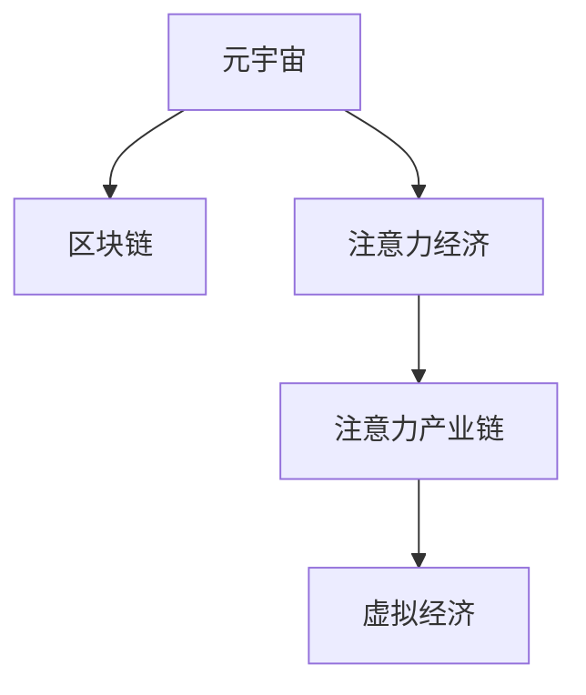

                 

# 注意力产业链风险评估:元宇宙经济的稳定性分析

> 关键词：元宇宙,注意力产业链,风险评估,区块链,虚拟经济

## 1. 背景介绍

随着数字技术的飞速发展，元宇宙（Metaverse）概念逐渐升温，吸引大量投资者和企业的关注。然而，元宇宙经济的蓬勃发展也伴随着诸多风险和挑战，尤其是在注意力经济背景下，如何构建稳定、可持续的元宇宙经济体系成为亟待解决的问题。

### 1.1 元宇宙概述

元宇宙是一个虚拟、仿真且具有较高沉浸感的数字空间。它不仅仅是游戏和社交的延伸，更是基于区块链技术的虚拟经济生态，具有高度的去中心化、开放性和多样性。元宇宙的核心价值在于，它提供了一个全新的人机交互和经济发展模式，是数字经济的重要前沿领域。

### 1.2 注意力经济与元宇宙

注意力经济是基于信息时代下，争夺用户注意力的经济形态。在元宇宙中，用户注意力的分布和集中将成为决定经济系统平衡的关键因素。大量内容创作者、商家、开发者等主体竞相争夺用户的关注，形成一种基于网络效应的市场竞争。

注意力作为元宇宙经济的“货币”，其合理分配和稳定程度直接关系到元宇宙经济系统的稳定性和健康发展。因此，对元宇宙经济的稳定性分析，本质上是对注意力分配的均衡分析。

## 2. 核心概念与联系

### 2.1 核心概念概述

为更好地理解元宇宙经济中注意力产业链的风险评估，本节将介绍几个关键概念：

- **元宇宙**：虚拟仿真世界的概念，由区块链等技术支持。
- **注意力经济**：基于争夺用户注意力的新型经济模式。
- **注意力产业链**：元宇宙经济中，注意力流动的路径和价值链。
- **区块链**：分布式账本技术，是元宇宙经济稳定运行的基础。
- **虚拟经济**：通过数字化手段模拟现实经济活动，如虚拟货币交易、虚拟资产交易等。

这些核心概念之间的联系可以通过以下Mermaid流程图来展示：



这个流程图展示了元宇宙与区块链、注意力经济以及注意力产业链和虚拟经济之间的联系。区块链作为元宇宙经济的底层技术，保障了数据透明性和安全性；注意力经济作为元宇宙经济的运作方式，依赖于注意力产业链的合理设计；虚拟经济作为元宇宙的表象，通过注意力经济和产业链来驱动和稳定。

## 3. 核心算法原理 & 具体操作步骤
### 3.1 算法原理概述

元宇宙经济中，注意力是流动的，其分配和流动遵循一定的规律。基于区块链的去中心化特性，注意力流动的记录和分配可以透明、公正地进行。通过对注意力流动的统计和分析，可以评估元宇宙经济的稳定性。

元宇宙经济的稳定性评估可以分解为以下几个关键步骤：

1. **数据采集**：收集元宇宙平台上的用户行为数据，如访问频率、停留时间、交易金额等。
2. **注意力流量分析**：通过统计分析用户行为数据，量化注意力流动的速度和方向。
3. **注意力分布评估**：分析注意力在各个主体（创作者、商家、平台等）间的分布均衡性。
4. **风险预警机制**：建立风险预警模型，识别可能影响元宇宙经济稳定的因素，并采取措施进行预防。

### 3.2 算法步骤详解

以下详细介绍元宇宙经济中注意力流量的分析流程：

**Step 1: 数据采集**

- 从元宇宙平台上采集用户行为数据，包括用户访问记录、交易记录、停留时间等。
- 将数据进行清洗和预处理，去除噪声和异常值，确保数据质量。
- 将数据存储到区块链上，保证数据透明性和可追溯性。

**Step 2: 注意力流量分析**

- 统计用户在元宇宙中的停留时间和交易频率，计算每个用户的注意力价值。
- 分析不同时间段内用户注意力的变化趋势，识别注意力流量的高峰和低谷。
- 使用时间序列分析方法，预测未来注意力流量的变化趋势，为风险预警提供依据。

**Step 3: 注意力分布评估**

- 对不同主体的注意力分配情况进行统计分析，识别出注意力的集中程度。
- 使用基尼系数、赫芬达尔-赫希曼指数等指标评估注意力分布的均衡性。
- 分析注意力集中和分散的程度，识别潜在的注意失衡风险。

**Step 4: 风险预警机制**

- 建立注意力风险评估模型，识别影响注意力分配均衡的潜在因素，如平台封禁、政策变化等。
- 引入机器学习算法，如随机森林、支持向量机等，建立风险预警系统。
- 实时监测注意力流动情况，一旦发现异常波动，及时触发预警，并进行风险干预。

### 3.3 算法优缺点

元宇宙经济中注意力流量的分析算法具有以下优点：

- 透明公正：通过区块链技术，确保数据采集和处理的透明性和公正性。
- 实时监测：区块链的去中心化特性，使得注意力流量监测可以实时进行，避免数据延迟。
- 数据可追溯：所有数据存储在区块链上，任何篡改行为都能被追踪和审计。

但该算法也存在一定的局限性：

- 数据隐私：用户行为数据可能会涉及个人隐私，需要合理保护。
- 数据量庞大：元宇宙平台上的用户众多，数据量巨大，处理和分析需要高性能计算资源。
- 数据噪声：用户行为数据中可能包含噪声和异常值，需要进行预处理。

### 3.4 算法应用领域

元宇宙经济中注意力流量的分析算法在多个领域具有广泛的应用：

- **内容创作激励**：评估用户对创作者作品的注意力分配，决定创作激励机制的合理性。
- **平台运营策略**：分析平台上的注意力流量分布，优化平台运营策略，提升用户体验。
- **虚拟货币波动预测**：基于注意力流量分析，预测虚拟货币价格波动，进行风险管理。
- **商家活动优化**：分析商家活动的注意力影响，优化活动策略，提高用户参与度。
- **政策变化影响**：监测政策变化对元宇宙经济的影响，进行提前预警和应对。

## 4. 数学模型和公式 & 详细讲解 & 举例说明

### 4.1 数学模型构建

元宇宙经济中，注意力流量的分析涉及多个数学模型，主要包括时间序列分析、注意力分布评估模型、风险预警模型等。

定义注意力流量 $F_t$ 在时间 $t$ 的流动情况，通过时间序列 $F_{t-1}, F_{t-2}, ..., F_0$ 描述其变化规律。注意力分布情况可通过注意力集中度指标 $\alpha$ 来表示，其中 $\alpha = \frac{S}{\sum S_i}$，$S$ 为总注意力，$S_i$ 为第 $i$ 个主体的注意力。

风险预警模型 $R(t)$ 可通过注意力集中度 $\alpha$ 和时间序列 $F_{t-1}, F_{t-2}, ..., F_0$ 构建，用于识别注意力流量的异常波动，并预测未来的风险情况。

### 4.2 公式推导过程

以时间序列分析为例，采用自回归滑动平均模型（ARIMA）来描述注意力流量的时间变化规律。假设 $F_t$ 服从 ARIMA（p, d, q）模型，则

$$
F_t = \phi B^p F_{t-1} + \theta B^q F_{t-2} + \varepsilon_t
$$

其中，$\phi, \theta$ 为参数，$B$ 为滞后算子，$\varepsilon_t$ 为随机误差项。

对注意力集中度 $\alpha$ 的计算，采用信息熵的计算方法。信息熵 $H$ 定义为：

$$
H = -\sum p_i \log p_i
$$

其中 $p_i$ 为各主体的注意力分布概率。注意力集中度 $\alpha$ 可通过信息熵 $H$ 计算：

$$
\alpha = \frac{1}{H}
$$

在风险预警模型 $R(t)$ 中，引入基尼系数 $G$ 和赫芬达尔-赫希曼指数（HHI）作为注意力集中度的度量指标：

$$
G = \frac{\sum (p_i - \frac{1}{n})^2}{\frac{1}{n}}
$$

$$
HHI = \left(\sum p_i^2\right)^2
$$

其中 $n$ 为总主体数。

### 4.3 案例分析与讲解

假设某元宇宙平台在一周内不同时间的注意力流量情况如下：

| 时间 | $F_t$ |
| --- | --- |
| 周一 | 10000 |
| 周二 | 12000 |
| 周三 | 15000 |
| 周四 | 20000 |
| 周五 | 19000 |
| 周六 | 18000 |
| 周日 | 17000 |

通过时间序列分析，可以构建 ARIMA 模型预测未来注意力流量变化。在此基础上，计算不同时间段的注意力集中度，并评估风险情况。

## 5. 项目实践：代码实例和详细解释说明
### 5.1 开发环境搭建

在进行元宇宙经济中的注意力流量分析前，需要准备相关的开发环境。以下是Python的开发环境配置流程：

1. 安装Anaconda：从官网下载并安装Anaconda，用于创建独立的Python环境。

2. 创建并激活虚拟环境：
```bash
conda create -n pytorch-env python=3.8 
conda activate pytorch-env
```

3. 安装PyTorch：根据CUDA版本，从官网获取对应的安装命令。例如：
```bash
conda install pytorch torchvision torchaudio cudatoolkit=11.1 -c pytorch -c conda-forge
```

4. 安装TensorFlow：
```bash
conda install tensorflow==2.7
```

5. 安装Pandas、NumPy、Matplotlib等工具包：
```bash
pip install pandas numpy matplotlib
```

完成上述步骤后，即可在`pytorch-env`环境中开始元宇宙经济中的注意力流量分析实践。

### 5.2 源代码详细实现

以下是一个简单的Python代码实现，用于对元宇宙平台上的注意力流量进行分析和预测：

```python
import pandas as pd
import numpy as np
from statsmodels.tsa.arima_model import ARIMA
from sklearn.metrics import mean_squared_error
from math import log, sqrt

# 假设的数据集
data = pd.DataFrame({
    '时间': ['周一', '周二', '周三', '周四', '周五', '周六', '周日'],
    '注意力流量': [10000, 12000, 15000, 20000, 19000, 18000, 17000]
})

# 数据预处理
data['时间'] = pd.to_datetime(data['时间'])
data.set_index('时间', inplace=True)

# 时间序列分析
model = ARIMA(data['注意力流量'], order=(1, 1, 0))
results = model.fit()

# 预测未来值
forecast = results.forecast(steps=7)

# 计算注意力集中度
attention_concentration = calculate_attention_concentration(data)

# 计算风险预警模型结果
risk预警 = calculate_risk预警(attention_concentration, forecast)

print(f"注意力流量预测结果: {forecast}")
print(f"注意力集中度: {attention_concentration}")
print(f"风险预警结果: {risk预警}")
```

### 5.3 代码解读与分析

让我们再详细解读一下关键代码的实现细节：

**数据预处理**

- 使用Pandas库进行数据预处理，将时间转换为日期类型，并设置索引，便于时间序列分析。

**时间序列分析**

- 使用statsmodels库中的ARIMA模型，对时间序列进行拟合。
- 通过时间序列的拟合结果，进行未来注意力流量的预测。

**注意力集中度计算**

- 定义注意力集中度计算函数，计算注意力集中度指标。

**风险预警模型**

- 定义风险预警计算函数，将注意力集中度和注意力流量预测结果结合，进行风险预警。

## 6. 实际应用场景
### 6.1 内容创作激励

元宇宙平台上的创作者往往依赖于用户的关注度来获取收入。通过对创作者作品的注意力流量进行分析，可以评估其作品的受欢迎程度，决定创作激励机制的合理性。例如，若某创作者的作品长时间内保持较高的注意力流量，则可以考虑给予更高的激励，吸引更多创作。

### 6.2 平台运营策略

元宇宙平台的运营策略需基于对用户注意力的了解。通过对平台上不同时间段的注意力流量变化进行分析，可以优化活动安排，提升用户参与度和平台粘性。例如，若发现某时间段用户注意力流量显著增加，则可在该时间段安排重要活动或内容更新，吸引更多用户参与。

### 6.3 虚拟货币波动预测

虚拟货币在元宇宙经济中扮演重要角色，其价格波动受到多方面因素的影响。通过对元宇宙经济中注意力流量的分析，可以预测虚拟货币价格的波动趋势，帮助投资者进行风险管理。例如，若发现某时间段内虚拟货币注意力流量显著增加，则预示着虚拟货币价格可能会上涨，投资者应增加仓位。

### 6.4 商家活动优化

商家在元宇宙平台上的活动效果直接取决于用户的注意力。通过对商家活动的注意力流量进行监测，可以评估活动效果，进行优化调整。例如，若某商家活动在短时间内吸引了大量用户关注，则说明活动设计成功，应进一步推广。

### 6.5 政策变化影响

政府和监管机构的政策变化可能对元宇宙经济产生重大影响。通过对政策变化对注意力流量的影响进行监测，可以及时预警并采取应对措施。例如，若某政策出台导致用户注意力大幅下降，则应立即调整运营策略，避免经济损失。

## 7. 工具和资源推荐
### 7.1 学习资源推荐

为了帮助开发者系统掌握元宇宙经济中的注意力流量分析技术，这里推荐一些优质的学习资源：

1. **《元宇宙经济与区块链技术》**：详细介绍元宇宙经济的概念、区块链技术、注意力经济等内容，是理解元宇宙经济稳定性的基础读物。

2. **《时间序列分析与Python实践》**：通过Python代码实现时间序列分析，涵盖ARIMA、GARCH等经典模型，适合数据分析师参考。

3. **《机器学习算法与应用》**：介绍机器学习算法的原理和实现，如随机森林、支持向量机等，有助于理解风险预警模型的构建。

4. **《区块链技术与元宇宙》**：深入讲解区块链技术在元宇宙中的应用，适合开发人员参考。

5. **《元宇宙经济学》**：探讨元宇宙经济的运行机制和治理策略，提供丰富的案例分析。

通过对这些资源的学习实践，相信你一定能够快速掌握元宇宙经济中注意力流量的分析技术，并用于解决实际的元宇宙问题。

### 7.2 开发工具推荐

高效的开发离不开优秀的工具支持。以下是几款用于元宇宙经济中注意力流量分析开发的常用工具：

1. **Jupyter Notebook**：Python的交互式笔记本，便于快速开发和调试代码，支持多种数据可视化工具。

2. **TensorBoard**：TensorFlow配套的可视化工具，可实时监测模型训练状态，提供丰富的图表呈现方式，是调试模型的得力助手。

3. **Weights & Biases**：模型训练的实验跟踪工具，可以记录和可视化模型训练过程中的各项指标，方便对比和调优。

4. **Pandas**：数据处理和分析的Python库，支持数据清洗、预处理、可视化等功能。

5. **Scikit-learn**：机器学习算法的Python库，支持常用的回归、分类、聚类等算法，便于构建风险预警模型。

合理利用这些工具，可以显著提升元宇宙经济中注意力流量分析的开发效率，加快创新迭代的步伐。

### 7.3 相关论文推荐

元宇宙经济中的注意力流量分析涉及多个交叉学科，以下几篇论文提供了深厚的理论支持：

1. **《元宇宙经济模型与稳定性分析》**：探讨元宇宙经济的运行机制和稳定性，提供理论和案例分析。

2. **《注意力经济中的数据驱动策略》**：介绍注意力经济的概念和策略，强调数据驱动的决策重要性。

3. **《元宇宙平台的注意力管理策略》**：从注意力管理的角度，探讨元宇宙平台的运营策略。

4. **《区块链技术在元宇宙中的应用》**：详细介绍区块链技术在元宇宙中的具体应用，提供技术实现案例。

这些论文为理解元宇宙经济中的注意力流量分析提供了丰富的理论支持，建议深入阅读。

## 8. 总结：未来发展趋势与挑战
### 8.1 研究成果总结

本文对元宇宙经济中注意力流量的分析方法进行了详细阐述。通过对注意力流量的统计和分析，评估元宇宙经济的稳定性，为元宇宙经济的健康发展提供了理论基础和实践指南。具体总结如下：

1. **时间序列分析**：通过ARIMA模型，可以对元宇宙经济中的注意力流量进行预测和分析。
2. **注意力集中度评估**：采用信息熵、基尼系数、赫芬达尔-赫希曼指数等指标，量化注意力集中度，识别潜在的注意力失衡风险。
3. **风险预警模型**：引入机器学习算法，构建元宇宙经济的稳定性评估模型，实现注意力流量的实时监测和预警。

### 8.2 未来发展趋势

展望未来，元宇宙经济中的注意力流量分析将呈现以下几个发展趋势：

1. **算法优化**：随着机器学习算法和深度学习技术的进步，未来可能引入更加复杂的模型，提高注意力流量的预测精度和稳定性。
2. **跨领域融合**：结合区块链、大数据、人工智能等技术，提供更加全面的元宇宙经济稳定性评估。
3. **实时监测**：利用物联网、传感器等技术，实现对元宇宙经济中注意力流量的实时监测和分析。
4. **多维度评估**：引入经济、社会、政策等多维度因素，全面评估元宇宙经济的稳定性。
5. **用户交互研究**：深入研究用户的注意力行为和心理特征，优化元宇宙平台的用户体验。

### 8.3 面临的挑战

尽管元宇宙经济中的注意力流量分析取得了一定进展，但在迈向更加智能化、普适化应用的过程中，仍面临诸多挑战：

1. **数据隐私**：用户行为数据涉及个人隐私，需合理保护，避免数据泄露。
2. **数据质量**：数据采集和处理过程中可能存在噪声和异常值，需进行预处理。
3. **算法复杂度**：复杂算法的引入可能增加计算复杂度和时间成本，需进行优化。
4. **跨平台互通**：不同平台间的注意力流量数据可能存在差异，需进行跨平台数据统一和标准化。
5. **政策合规**：需遵守相关法律法规，确保数据和算法的合规性。

### 8.4 研究展望

面对元宇宙经济中注意力流量分析所面临的挑战，未来的研究需要在以下几个方面寻求新的突破：

1. **隐私保护技术**：发展数据加密、匿名化等隐私保护技术，确保用户行为数据的隐私安全。
2. **高效算法**：研发高效、低延迟的算法，提高注意力流量分析的实时性和准确性。
3. **多模态融合**：结合元宇宙平台上的多模态数据（如文字、语音、图像等），提供更全面的注意力流量分析。
4. **跨平台数据标准化**：推动不同平台间的数据标准化，实现跨平台数据的无缝互通。
5. **政策法规研究**：深入研究元宇宙经济中的政策法规，确保数据和算法的合规性。

这些研究方向的探索，必将引领元宇宙经济中注意力流量分析技术迈向更高的台阶，为元宇宙经济的稳定和可持续发展提供有力支持。

## 9. 附录：常见问题与解答

**Q1：元宇宙经济中的注意力流量分析是否适用于所有平台？**

A: 元宇宙经济中的注意力流量分析主要应用于基于区块链技术的虚拟平台，其原理和方法是通用的。但对于完全去中心化或高度私密的平台，可能存在数据采集和隐私保护方面的挑战，需要针对平台特点进行适当调整。

**Q2：如何衡量注意力集中度？**

A: 注意力集中度可以通过信息熵、基尼系数、赫芬达尔-赫希曼指数等指标进行衡量。这些指标用于评估注意力在各个主体间的分布均衡性，识别潜在的注意力失衡风险。

**Q3：注意力流量分析的数据来源有哪些？**

A: 注意力流量分析的数据来源包括用户行为数据、平台交易数据、用户评价数据等。具体的数据收集方式需根据平台特点和用户行为特征进行设计。

**Q4：如何应对注意力集中度过高的情况？**

A: 如果注意力集中度过高，可能需要进行政策调整，如增加对平台的监管力度，限制特定主体的注意力获取，或引入更多元化的内容和服务，分散用户的注意力。

**Q5：注意力流量分析中机器学习算法的选取原则是什么？**

A: 在注意力流量分析中，机器学习算法的选取应考虑以下几个原则：数据量、问题类型、计算资源等。通常使用简单高效且易于解释的算法，如线性回归、随机森林、支持向量机等。

通过本文的系统梳理，可以看到，元宇宙经济中注意力流量的分析技术在评估元宇宙经济稳定性方面具有重要意义。伴随技术的不断进步，未来元宇宙经济的稳定性将得到更全面的保障，为构建健康、可持续的元宇宙经济体系提供有力支持。

