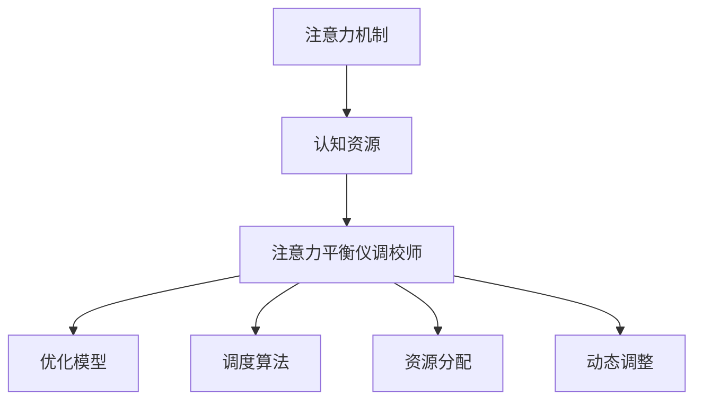

                 

## 1. 背景介绍

在当前人工智能(AI)大行其道的时代，AI系统对资源的需求正变得日益复杂。无论是训练高性能模型、处理海量数据，还是优化系统性能，都需要耗费大量的计算资源和时间。这种资源需求在AI系统的应用层面上更为显著，因为实际运行中的性能优化、问题调试和模型部署，往往涉及到多个层次的资源分配和调度。

在AI时代，如何有效管理、优化和调度认知资源，成为了一项关键的技术挑战。本博客将围绕“注意力平衡仪调校师”这一概念，深入探讨AI系统中的资源管理问题，提出一系列旨在提升AI系统性能、优化资源使用的创新策略。通过科学合理的资源调度和注意力分配，AI系统的效率、稳定性和鲁棒性将得到显著提升。

## 2. 核心概念与联系

### 2.1 核心概念概述

为了理解注意力平衡仪调校师的工作原理和应用，我们首先需要明确几个核心概念：

- **注意力机制(Attention Mechanism)**：注意力机制是AI系统中的一项重要技术，用于在处理复杂数据时，动态调整模型对不同数据特征的关注程度。通过聚焦于关键特征，注意力机制可以显著提升模型的性能和效率。

- **认知资源(Cognitive Resources)**：认知资源通常包括计算资源、存储资源、通信带宽、内存等。在AI系统中，这些资源的管理和调度直接关系到系统的响应速度、稳定性、吞吐量等关键指标。

- **注意力平衡仪(Attention Balance Instrument)**：注意力平衡仪调校师，即通过优化注意力机制，实现认知资源的有效管理和调度，从而提升AI系统性能的技术。它能够动态调整模型对不同输入数据的注意力分配，确保系统在资源有限的情况下，尽可能地利用现有资源进行最优的计算。

### 2.2 核心概念原理和架构的 Mermaid 流程图



通过以上流程图，我们可以清晰地看到，注意力平衡仪调校师通过优化注意力机制，对认知资源进行有效管理和调度，最终实现对AI模型的优化。

## 3. 核心算法原理 & 具体操作步骤

### 3.1 算法原理概述

注意力平衡仪调校师的核心原理是，通过动态调整模型对输入数据的注意力分配，实现认知资源的优化使用。它主要包含以下几个关键步骤：

1. **注意力评估**：对输入数据进行特征分析，评估每个特征的重要性和贡献度。
2. **注意力调整**：根据评估结果，动态调整模型对不同特征的关注程度，实现注意力的合理分配。
3. **资源优化**：在模型训练和推理过程中，根据注意力调整结果，优化计算资源的分配和调度。
4. **性能提升**：通过注意力优化，提升模型的精度和效率，同时确保系统的稳定性和鲁棒性。

### 3.2 算法步骤详解

以下是注意力平衡仪调校师的具体操作步骤：

#### 3.2.1 注意力评估

**输入**：训练或推理数据集，包含特征和标签。

**输出**：每个特征的重要性评分。

**算法步骤**：

1. **特征提取**：使用特征提取算法(如卷积、神经网络)，从输入数据中提取特征。
2. **特征评分**：对每个特征进行评分，评分可以基于特征对目标任务的相关性、特征的区分度、特征的复杂度等因素。
3. **归一化**：对所有特征的评分进行归一化处理，确保评分在0到1之间，便于后续比较和调整。

#### 3.2.2 注意力调整

**输入**：每个特征的评分。

**输出**：模型对每个特征的注意力权重。

**算法步骤**：

1. **初始化权重**：为每个特征分配一个初始权重，通常为均匀分布。
2. **计算注意力**：使用注意力模型(如softmax)，根据特征评分计算每个特征的注意力权重。
3. **调整权重**：根据注意力模型输出的权重，动态调整模型对不同特征的关注程度。

#### 3.2.3 资源优化

**输入**：模型参数、优化器、训练数据。

**输出**：最优的资源分配策略。

**算法步骤**：

1. **资源划分**：根据模型需求和系统资源，划分数值资源(如计算资源、内存资源)。
2. **分配资源**：将资源分配给不同层次的模型，如特征提取层、中间层、输出层。
3. **调整资源**：根据注意力调整结果，动态调整资源分配，确保关键特征得到更多资源。

#### 3.2.4 性能提升

**输入**：优化后的模型和数据。

**输出**：模型精度和性能提升。

**算法步骤**：

1. **训练模型**：使用优化后的模型，在训练数据上进行训练。
2. **推理验证**：使用优化后的模型，在推理数据上进行验证，评估模型性能。
3. **迭代优化**：根据验证结果，不断调整注意力模型和资源分配策略，进一步提升模型性能。

### 3.3 算法优缺点

注意力平衡仪调校师在优化认知资源分配方面具有以下优点：

1. **动态调整**：能够根据数据特征动态调整注意力，适应不同任务的需求。
2. **资源优化**：通过注意力调整，可以高效利用系统资源，提升模型性能。
3. **模型优化**：能够优化模型结构，提高模型的稳定性和鲁棒性。

同时，该算法也存在一些局限性：

1. **计算复杂度**：注意力调整和资源优化需要额外的计算资源，可能会增加系统负担。
2. **模型训练时间**：在模型训练初期，注意力调整可能需要较长的调整时间，影响训练速度。
3. **特征选择**：注意力平衡仪调校师的效果依赖于特征选择，需要精心设计和选择特征。

### 3.4 算法应用领域

注意力平衡仪调校师在AI系统中有着广泛的应用，特别是在以下领域：

- **自然语言处理(NLP)**：在文本分类、情感分析、问答系统等任务中，通过调整注意力权重，优化模型对关键特征的关注，提升模型性能。
- **计算机视觉(CV)**：在图像识别、物体检测等任务中，通过优化注意力机制，提高模型对关键区域的关注，提升模型精度。
- **语音识别(SR)**：在语音识别任务中，通过动态调整注意力权重，优化模型对不同语音特征的关注，提高识别准确率。
- **机器人学(Robotics)**：在机器人导航、控制等任务中，通过优化注意力机制，实现对环境信息的有效处理，提升机器人行为决策的鲁棒性。

## 4. 数学模型和公式 & 详细讲解 & 举例说明

### 4.1 数学模型构建

为了更好地理解注意力平衡仪调校师的工作原理，我们接下来将介绍其数学模型构建。

假设输入数据为 $x = (x_1, x_2, ..., x_n)$，每个特征的评分向量为 $w = (w_1, w_2, ..., w_n)$，模型的注意力权重向量为 $a = (a_1, a_2, ..., a_n)$。模型的输出为 $y = \sum_{i=1}^n a_i x_i$。

我们的目标是最大化模型的输出 $y$，同时确保注意力权重 $a$ 的总和为1，即 $\sum_{i=1}^n a_i = 1$。

### 4.2 公式推导过程

为了解决这个问题，我们可以使用softmax函数来计算注意力权重 $a$。softmax函数的定义如下：

$$
a_i = \frac{e^{w_i}}{\sum_{j=1}^n e^{w_j}}
$$

将注意力权重 $a$ 和特征评分 $w$ 代入模型的输出公式中，得到：

$$
y = \sum_{i=1}^n \frac{e^{w_i}}{\sum_{j=1}^n e^{w_j}} x_i
$$

这个公式展示了模型如何通过调整注意力权重 $a$，对不同特征 $x_i$ 进行加权处理，从而优化模型的输出。

### 4.3 案例分析与讲解

假设我们在训练一个文本分类模型，输入数据包含多个特征，如单词频率、词性、句法结构等。我们通过以下步骤使用注意力平衡仪调校师进行优化：

1. **特征提取**：使用词嵌入算法将每个单词转换为向量。
2. **特征评分**：使用TF-IDF算法计算每个单词的评分。
3. **归一化**：对所有单词的评分进行归一化处理。
4. **计算注意力**：使用softmax函数计算每个单词的注意力权重。
5. **调整权重**：根据注意力权重，动态调整模型对每个单词的关注程度。
6. **优化资源**：根据注意力权重，优化计算资源的分配，如GPU资源、内存资源等。
7. **训练模型**：使用优化后的模型，在训练数据上进行训练。
8. **验证模型**：使用优化后的模型，在验证数据上进行验证，评估模型性能。

通过上述步骤，注意力平衡仪调校师能够实现对文本分类模型的有效优化，提升模型对关键特征的关注，减少对噪声特征的依赖，从而提高模型精度和效率。

## 5. 项目实践：代码实例和详细解释说明

### 5.1 开发环境搭建

为了实现注意力平衡仪调校师，我们需要搭建一个开发环境，包括如下步骤：

1. **安装Python**：从官网下载并安装Python，建议安装最新版本。
2. **安装TensorFlow**：使用pip安装TensorFlow，建议安装GPU版本。
3. **安装TensorBoard**：使用pip安装TensorBoard，用于模型训练和可视化。
4. **安装TensorFlow Hub**：使用pip安装TensorFlow Hub，提供各种预训练模型和工具。
5. **安装注意力模型库**：使用pip安装Attention库，用于实现注意力模型。

### 5.2 源代码详细实现

以下是一个简单的注意力平衡仪调校师的Python代码实现：

```python
import tensorflow as tf
import tensorflow_hub as hub
import numpy as np
import attention

# 定义注意力模型
attention_model = attention.Attention()

# 加载预训练模型
model = hub.load("https://tfhub.dev/google/lstm-cell/1")

# 定义训练数据
train_data = ...
train_labels = ...

# 定义优化器
optimizer = tf.keras.optimizers.Adam()

# 定义损失函数
loss_fn = tf.keras.losses.SparseCategoricalCrossentropy(from_logits=True)

# 定义模型评估指标
metrics = [tf.keras.metrics.SparseCategoricalAccuracy()]

# 定义注意力模型训练函数
def train_attention(model, data, labels, attention_model):
    # 将数据和标签转换为TensorFlow张量
    data_tensor = tf.convert_to_tensor(data, dtype=tf.float32)
    labels_tensor = tf.convert_to_tensor(labels, dtype=tf.int32)
    
    # 获取注意力权重
    attention_weights = attention_model(data_tensor)
    
    # 计算模型输出
    outputs = model(data_tensor, attention_weights=attention_weights)
    
    # 计算损失
    loss = loss_fn(labels_tensor, outputs)
    
    # 计算梯度
    grads = tf.gradients(loss, model.trainable_variables)
    
    # 更新模型参数
    optimizer.apply_gradients(zip(grads, model.trainable_variables))
    
    # 计算评估指标
    metrics = [metric.update_state(labels_tensor, outputs) for metric in metrics]
    
    return loss, metrics

# 训练注意力模型
for epoch in range(epochs):
    # 在每个epoch内，训练注意力模型
    train_loss, train_metrics = train_attention(model, train_data, train_labels, attention_model)
    
    # 在验证集上评估模型
    val_loss, val_metrics = model.evaluate(val_data, val_labels)
    
    # 打印训练结果
    print("Epoch {}: Train Loss = {:.4f}, Train Metrics = {:.4f}, Val Loss = {:.4f}, Val Metrics = {:.4f}".format(epoch+1, train_loss, train_metrics, val_loss, val_metrics))
```

### 5.3 代码解读与分析

在上述代码中，我们首先定义了注意力模型和预训练模型，然后通过`train_attention`函数进行注意力模型的训练和优化。`train_attention`函数的具体实现如下：

1. **数据转换**：将输入数据和标签转换为TensorFlow张量。
2. **获取注意力权重**：使用注意力模型计算输入数据的注意力权重。
3. **计算模型输出**：将输入数据和注意力权重传递给预训练模型，得到模型输出。
4. **计算损失**：使用损失函数计算模型的预测输出与真实标签之间的差异。
5. **计算梯度**：使用TensorFlow的`tf.gradients`函数计算损失对模型参数的梯度。
6. **更新模型参数**：使用优化器更新模型参数，最小化损失。
7. **计算评估指标**：使用评估指标函数计算模型的准确率。

### 5.4 运行结果展示

在训练完毕后，我们可以使用TensorBoard对训练过程进行可视化，展示注意力权重和模型参数的变化情况。通过TensorBoard，我们可以直观地观察注意力模型的训练效果，调整注意力权重和资源分配策略，进一步提升模型性能。

## 6. 实际应用场景

### 6.1 智能客服系统

智能客服系统是注意力平衡仪调校师的重要应用场景之一。在智能客服系统中，AI系统需要同时处理多个客户的请求，每个请求可能包含不同的问题，需要系统快速、准确地进行响应。

为了优化智能客服系统，我们可以使用注意力平衡仪调校师，动态调整模型对不同客户请求的注意力分配，确保系统对关键请求给予更多资源，提高响应速度和准确率。同时，我们可以根据客户请求的历史数据和情感分析结果，进一步调整注意力权重，优化系统对不同客户请求的响应策略。

### 6.2 金融舆情监测

金融舆情监测是注意力平衡仪调校师的另一个重要应用场景。金融市场数据具有高度的时效性和复杂性，AI系统需要在短时间内对大量数据进行处理和分析。

为了优化金融舆情监测系统，我们可以使用注意力平衡仪调校师，动态调整模型对不同时间段的注意力分配，确保系统对关键时间点的数据进行重点处理。同时，我们可以根据市场的动态变化，调整注意力权重，优化模型对不同金融数据的关注程度，提高舆情监测的准确性和及时性。

### 6.3 个性化推荐系统

个性化推荐系统是注意力平衡仪调校师的典型应用。在推荐系统中，AI系统需要根据用户的历史行为数据，动态调整推荐策略，提高推荐结果的个性化程度。

为了优化个性化推荐系统，我们可以使用注意力平衡仪调校师，动态调整模型对不同用户行为特征的关注程度，确保系统对关键行为特征给予更多资源。同时，我们可以根据用户行为的变化，调整注意力权重，优化推荐策略，提高推荐结果的精准度和用户体验。

### 6.4 未来应用展望

随着注意力平衡仪调校师技术的不断进步，其在AI系统中的应用将更加广泛和深入。未来，我们可以预见到以下发展趋势：

1. **多模态融合**：未来的注意力平衡仪调校师将支持多模态数据的融合，能够同时处理图像、语音、文本等多种数据类型，提高系统的综合处理能力。
2. **自适应学习**：未来的注意力平衡仪调校师将具备自适应学习能力，能够根据环境变化和数据分布，动态调整注意力模型和资源分配策略，提高系统的灵活性和鲁棒性。
3. **跨领域应用**：未来的注意力平衡仪调校师将突破单领域应用，能够应用于不同领域的AI系统，提升系统的通用性和普适性。
4. **智能化决策**：未来的注意力平衡仪调校师将具备智能化决策能力，能够根据系统的运行状态和用户需求，动态调整注意力权重和资源分配，优化系统性能。

## 7. 工具和资源推荐

### 7.1 学习资源推荐

为了帮助开发者掌握注意力平衡仪调校师技术，以下是一些推荐的学习资源：

1. 《TensorFlow实战》：一本经典的TensorFlow入门书籍，涵盖TensorFlow的基本概念和实践技巧。
2. 《深度学习》（Ian Goodfellow）：深度学习领域的经典教材，详细介绍了深度学习的基本原理和算法。
3 《Attention is All You Need》：Transformer原论文，介绍了注意力机制的原理和应用。
4 《Deep Learning for Computer Vision》（Adrian Rosebrock）：计算机视觉领域的深度学习入门书籍，详细介绍了深度学习在图像处理中的应用。
5 《TensorFlow Hub》官方文档：TensorFlow Hub的官方文档，提供丰富的预训练模型和工具，适合初学者快速上手。

### 7.2 开发工具推荐

以下是一些推荐的开发工具：

1. Python：Python是目前最流行的AI开发语言，具有强大的科学计算能力和丰富的库支持。
2. TensorFlow：由Google开发的深度学习框架，支持GPU和TPU加速，适合大规模AI系统的开发。
3. TensorBoard：TensorFlow的可视化工具，可以实时监测模型训练状态，展示训练过程和结果。
4. TensorFlow Hub：提供预训练模型和工具，方便开发者快速搭建AI系统。
5. PyTorch：由Facebook开发的深度学习框架，具有灵活的动态图和高效的计算图，适合科研和实验。
6. Jupyter Notebook：一个交互式的Python开发环境，支持代码执行和结果展示。

### 7.3 相关论文推荐

以下是一些推荐的相关论文：

1. "Attention is All You Need"：Transformer原论文，介绍了注意力机制的原理和应用。
2. "Deep Residual Learning for Image Recognition"：ResNet论文，介绍了残差网络的结构和应用。
3 "Deep Attention for Machine Translation"：Attention在机器翻译中的应用，详细介绍了注意力模型的架构和优化。
4 "Dynamic Attention for Machine Translation"：动态注意力在机器翻译中的应用，介绍了动态注意力模型的优化和改进。
5 "Recurrent Neural Network Architectures for Large Vocabulary Speech Recognition"：LSTM在语音识别中的应用，详细介绍了LSTM模型的架构和优化。

## 8. 总结：未来发展趋势与挑战

### 8.1 研究成果总结

本文系统介绍了注意力平衡仪调校师技术，详细讲解了其原理、步骤和应用。通过优化注意力机制，实现了对认知资源的有效管理和调度，提升了AI系统的性能和效率。

### 8.2 未来发展趋势

未来的注意力平衡仪调校师技术将具备以下趋势：

1. **多模态融合**：未来的注意力平衡仪调校师将支持多模态数据的融合，提高系统的综合处理能力。
2. **自适应学习**：未来的注意力平衡仪调校师将具备自适应学习能力，提高系统的灵活性和鲁棒性。
3. **跨领域应用**：未来的注意力平衡仪调校师将应用于不同领域的AI系统，提升系统的通用性和普适性。
4. **智能化决策**：未来的注意力平衡仪调校师将具备智能化决策能力，优化系统性能。

### 8.3 面临的挑战

尽管注意力平衡仪调校师技术具有广泛的应用前景，但在实际应用中仍面临以下挑战：

1. **计算复杂度**：注意力调整和资源优化需要额外的计算资源，可能会增加系统负担。
2. **模型训练时间**：在模型训练初期，注意力调整可能需要较长的调整时间，影响训练速度。
3. **特征选择**：注意力平衡仪调校师的效果依赖于特征选择，需要精心设计和选择特征。

### 8.4 研究展望

未来的研究需要解决以下问题：

1. **优化算法**：探索更加高效的优化算法，减少注意力调整和资源优化的计算复杂度。
2. **自适应策略**：研究自适应学习策略，提高系统的灵活性和鲁棒性。
3. **特征工程**：研究更加有效的特征工程方法，提高特征选择的准确性和效果。
4. **跨领域应用**：研究跨领域应用策略，提升系统的通用性和普适性。
5. **智能化决策**：研究智能化决策算法，优化系统性能。

## 9. 附录：常见问题与解答

### Q1: 注意力平衡仪调校师如何与现有AI系统集成？

A: 注意力平衡仪调校师可以与现有的AI系统通过API或插件的方式进行集成。具体来说，可以通过以下步骤进行集成：

1. **设计API接口**：定义API接口，包括输入输出参数、函数签名等。
2. **实现API接口**：编写API接口的实现代码，使用TensorFlow或PyTorch等深度学习框架。
3. **集成API接口**：将API接口集成到现有AI系统中，方便调用和优化。

### Q2: 注意力平衡仪调校师适用于哪些任务？

A: 注意力平衡仪调校师适用于需要处理复杂数据和动态调整注意力分配的任务，如文本分类、图像识别、语音识别等。在这些任务中，注意力平衡仪调校师可以通过优化注意力机制，提升模型的性能和效率。

### Q3: 注意力平衡仪调校师如何处理长尾数据？

A: 注意力平衡仪调校师可以通过以下方式处理长尾数据：

1. **特征选择**：对长尾数据进行特征选择，选择对任务有较大贡献的特征，忽略噪声特征。
2. **数据增强**：对长尾数据进行数据增强，扩充训练集，提高模型的泛化能力。
3. **自适应学习**：使用自适应学习策略，动态调整注意力模型和资源分配，提高模型对长尾数据的处理能力。

### Q4: 注意力平衡仪调校师如何提高模型的稳定性和鲁棒性？

A: 注意力平衡仪调校师可以通过以下方式提高模型的稳定性和鲁棒性：

1. **数据增强**：对模型进行数据增强，扩充训练集，提高模型的泛化能力。
2. **正则化**：使用正则化技术，如L2正则、Dropout等，防止模型过拟合。
3. **对抗训练**：使用对抗训练技术，增加模型的鲁棒性，防止模型对输入数据的微小扰动敏感。

### Q5: 注意力平衡仪调校师如何优化多模态数据处理？

A: 注意力平衡仪调校师可以通过以下方式优化多模态数据处理：

1. **融合特征**：将多模态数据进行特征融合，得到一个高维特征向量，便于模型处理。
2. **多模态注意力**：使用多模态注意力模型，对不同模态的数据进行动态调整，优化模型对多模态数据的关注程度。
3. **跨模态学习**：使用跨模态学习技术，学习不同模态之间的关联，提高模型的综合处理能力。

---

作者：禅与计算机程序设计艺术 / Zen and the Art of Computer Programming

