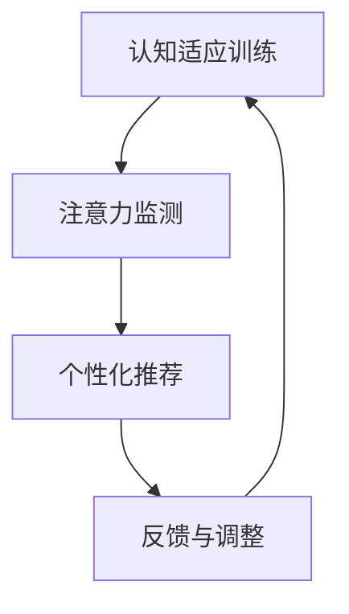

                 

## 1. 背景介绍

### 1.1 问题由来

在信息爆炸的现代社会，人类面临日益增加的认知负担。如何在繁忙的日常生活中保持良好的注意力，提升认知适应能力，是当下人们关注的焦点。特别是在高压的工作和学习环境中，注意力和认知弹性显得尤为重要。传统的注意力训练方法往往需要耗费大量时间和精力，难以普及。随着人工智能技术的发展，AI辅助的认知适应训练成为一种新的尝试，展示了巨大的潜力和前景。

### 1.2 问题核心关键点

AI辅助的认知适应训练，是指利用人工智能技术，特别是机器学习和深度学习技术，辅助人们进行注意力和认知弹性的训练。通过设计特定的训练任务和算法，AI系统可以自动监测和评估用户的注意力水平和认知状态，给出个性化的训练建议和反馈。这种训练方式不仅能提升个体的注意力和认知能力，还能显著提高工作效率和学习效果。

### 1.3 问题研究意义

AI辅助的认知适应训练技术具有重要的研究意义：

1. **提升个人认知能力**：通过系统化的训练，帮助用户改善注意力和认知弹性，提高学习和工作效率。
2. **缓解认知压力**：在高压的工作和学习环境中，这种训练方式可以作为一种有效的减压手段。
3. **促进技术应用**：推动AI技术在教育和培训领域的应用，推动人工智能技术的产业化进程。
4. **助力人类进化**：AI辅助的认知适应训练有望成为未来人类认知进化的重要工具。

## 2. 核心概念与联系

### 2.1 核心概念概述

为更好地理解AI辅助的认知适应训练，本节将介绍几个密切相关的核心概念：

- **认知适应训练**：一种旨在提升个体注意力和认知弹性的训练方式，通过系统化的任务训练和反馈机制，帮助用户改善认知能力。
- **注意力监测**：利用机器学习技术，对用户的注意力水平进行实时监测，评估注意力集中度和分心程度。
- **个性化推荐**：根据用户的注意力水平和认知状态，AI系统推荐适合的训练任务和难度，提供个性化的训练建议。
- **反馈与调整**：通过不断的反馈和调整，逐步提升用户的注意力水平和认知弹性。
- **认知弹性**：指个体在面对高压力和复杂任务时的认知适应能力，包括注意力集中、记忆力和决策能力等。

这些核心概念之间的逻辑关系可以通过以下Mermaid流程图来展示：



这个流程图展示了几者之间的逻辑关系：

1. 认知适应训练是整个流程的起点和终点，贯穿整个训练过程。
2. 注意力监测是评估用户注意力状态的工具，提供训练的基础数据。
3. 个性化推荐基于监测结果，推荐适合的训练任务。
4. 反馈与调整根据推荐结果和用户表现，不断优化训练任务，提升用户认知能力。

## 3. 核心算法原理 & 具体操作步骤
### 3.1 算法原理概述

AI辅助的认知适应训练基于深度学习算法，特别是卷积神经网络(CNN)和循环神经网络(RNN)。其主要思想是通过训练一个AI模型，实时监测用户的注意力水平和认知状态，根据监测结果，推荐适合用户的认知训练任务，并通过不断的反馈和调整，逐步提升用户的认知能力。

形式化地，假设训练任务为 $T$，用户注意力水平为 $A$，认知状态为 $S$，训练模型为 $M$。则认知适应训练的目标是最大化模型在 $T$ 上对 $A$ 和 $S$ 的拟合程度，即：

$$
\max_M \min_T \mathcal{L}(M,T,A,S)
$$

其中 $\mathcal{L}$ 为损失函数，用于衡量模型在 $T$ 上的预测 $M(T,A,S)$ 与真实结果 $T$ 的差异。

### 3.2 算法步骤详解

AI辅助的认知适应训练一般包括以下几个关键步骤：

**Step 1: 数据收集与预处理**
- 收集用户在工作和学习环境中的注意力数据，如眼神追踪、脑电图(EEG)等。
- 将数据进行预处理，如去噪、归一化等，准备输入到模型中。

**Step 2: 模型训练**
- 设计深度学习模型 $M$，如卷积神经网络(CNN)或循环神经网络(RNN)，用于预测注意力水平和认知状态。
- 使用标注数据集 $D=\{(x_i,y_i)\}_{i=1}^N$，其中 $x_i$ 为注意力数据，$y_i$ 为注意力水平或认知状态。
- 训练模型 $M$，最小化损失函数 $\mathcal{L}(M,D)$，使模型能准确预测用户注意力水平和认知状态。

**Step 3: 任务推荐**
- 对用户当前注意力水平和认知状态进行实时监测，得到 $A$ 和 $S$。
- 将 $A$ 和 $S$ 输入到训练好的模型 $M$ 中，预测当前用户的训练任务 $T$。
- 根据预测结果，推荐适合的认知训练任务，如注意力集中训练、记忆训练、决策训练等。

**Step 4: 训练与反馈**
- 根据推荐的任务，用户进行认知训练。
- 在训练过程中，实时监测用户的注意力水平和认知状态，记录训练结果。
- 根据训练结果，给出反馈，调整训练难度和任务，提升用户认知能力。
- 重复上述步骤，直至达到预设的训练目标。

### 3.3 算法优缺点

AI辅助的认知适应训练具有以下优点：
1. **高效个性化的训练**：AI系统能够根据用户的注意力水平和认知状态，提供个性化的训练建议，提高训练效果。
2. **实时监测与反馈**：通过实时监测和反馈，及时调整训练策略，确保训练效果最大化。
3. **适应性强**：系统可以自适应不同用户的需求和环境，提供灵活的训练方案。
4. **可扩展性强**：训练任务的种类可以随着AI技术的进步不断扩展，满足更多需求。

同时，该方法也存在一定的局限性：
1. **数据隐私和安全问题**：对用户的注意力数据和认知状态进行实时监测，涉及用户隐私，需要严格的保护措施。
2. **技术要求高**：训练和推荐算法需要高水平的深度学习技术，对数据质量和算法设计有较高要求。
3. **缺乏通用性**：不同用户间的注意力和认知状态差异较大，需要针对特定用户进行个性化训练，难以普遍推广。

尽管存在这些局限性，但AI辅助的认知适应训练在提升个体认知能力方面展示了巨大的潜力，其未来的应用前景值得期待。

### 3.4 算法应用领域

AI辅助的认知适应训练已在多个领域得到了应用，并展示了显著的效果：

- **教育培训**：在学生学习过程中，通过实时监测和反馈，提升学习效率和成绩。
- **心理治疗**：对精神压力和焦虑等心理问题进行干预和改善，帮助用户恢复心理健康。
- **职场提升**：在工作环境中，提升员工的工作效率和决策能力，改善工作表现。
- **健身训练**：在运动训练中，实时监测运动员的注意力集中度和体能状态，提高训练效果。

除了上述这些经典应用外，AI辅助的认知适应训练还被创新性地应用于医疗、游戏、虚拟现实等多个领域，为不同场景下的认知训练提供了新的解决方案。

## 4. 数学模型和公式 & 详细讲解  
### 4.1 数学模型构建

本节将使用数学语言对AI辅助的认知适应训练过程进行更加严格的刻画。

记认知适应训练模型为 $M_{\theta}:\mathcal{X} \rightarrow \mathcal{Y}$，其中 $\mathcal{X}$ 为注意力数据集，$\mathcal{Y}$ 为训练任务集合。假设用户注意力水平和认知状态分别为 $A$ 和 $S$，则训练过程的目标是最大化模型在注意力水平和认知状态上的拟合程度，即：

$$
\max_M \min_{(A,S)} \mathcal{L}(M_{\theta},(A,S))
$$

其中 $\mathcal{L}$ 为损失函数，用于衡量模型在 $(A,S)$ 上的预测 $M_{\theta}(A,S)$ 与真实结果 $(A,S)$ 的差异。

### 4.2 公式推导过程

以注意力监测为例，假设模型 $M_{\theta}$ 为CNN或RNN，输入为注意力数据 $x$，输出为注意力水平 $y$，则注意力监测的损失函数可以表示为：

$$
\mathcal{L}(M_{\theta},x)=\sum_{i=1}^{n}(w_i(\theta-y_i)^2)
$$

其中 $w_i$ 为权重，$n$ 为注意力数据 $x$ 的长度。训练模型 $M_{\theta}$，最小化上述损失函数，使模型能准确预测注意力水平 $y$。

在得到注意力监测模型后，可以将其应用到用户的注意力数据上，实时监测用户的注意力水平。根据监测结果，生成适合用户的训练任务 $T$，推荐给用户进行认知训练。训练任务 $T$ 可以是注意力集中训练、记忆训练、决策训练等，具体根据用户当前注意力水平和认知状态调整。

## 5. 项目实践：代码实例和详细解释说明
### 5.1 开发环境搭建

在进行认知适应训练的实践前，我们需要准备好开发环境。以下是使用Python进行PyTorch开发的环境配置流程：

1. 安装Anaconda：从官网下载并安装Anaconda，用于创建独立的Python环境。

2. 创建并激活虚拟环境：
```bash
conda create -n cognitive-env python=3.8 
conda activate cognitive-env
```

3. 安装PyTorch：根据CUDA版本，从官网获取对应的安装命令。例如：
```bash
conda install pytorch torchvision torchaudio cudatoolkit=11.1 -c pytorch -c conda-forge
```

4. 安装各类工具包：
```bash
pip install numpy pandas scikit-learn matplotlib tqdm jupyter notebook ipython
```

完成上述步骤后，即可在`cognitive-env`环境中开始认知适应训练的实践。

### 5.2 源代码详细实现

这里我们以注意力监测和认知训练为例，给出使用PyTorch进行认知适应训练的PyTorch代码实现。

首先，定义注意力监测的CNN模型：

```python
import torch.nn as nn
import torch.nn.functional as F

class AttentionMonitor(nn.Module):
    def __init__(self, in_channels, out_channels):
        super(AttentionMonitor, self).__init__()
        self.conv1 = nn.Conv2d(in_channels, 64, kernel_size=3, padding=1)
        self.conv2 = nn.Conv2d(64, out_channels, kernel_size=3, padding=1)
        self.relu = nn.ReLU(inplace=True)
        
    def forward(self, x):
        x = self.conv1(x)
        x = self.relu(x)
        x = self.conv2(x)
        return x
```

然后，定义认知训练的RNN模型：

```python
class CognitiveTrain(nn.Module):
    def __init__(self, input_size, hidden_size, num_layers, output_size):
        super(CognitiveTrain, self).__init__()
        self.rnn = nn.LSTM(input_size=input_size, hidden_size=hidden_size, num_layers=num_layers, batch_first=True)
        self.fc = nn.Linear(hidden_size, output_size)
        
    def forward(self, x, hidden):
        out, hidden = self.rnn(x, hidden)
        out = self.fc(out)
        return out, hidden
```

接着，定义训练和评估函数：

```python
import torch.optim as optim

def train_epoch(model, data_loader, optimizer):
    model.train()
    total_loss = 0
    for i, (inputs, labels) in enumerate(data_loader):
        inputs, labels = inputs.to(device), labels.to(device)
        optimizer.zero_grad()
        outputs = model(inputs)
        loss = F.cross_entropy(outputs, labels)
        loss.backward()
        optimizer.step()
        total_loss += loss.item()
    return total_loss / len(data_loader)

def evaluate(model, data_loader):
    model.eval()
    total_loss = 0
    with torch.no_grad():
        for i, (inputs, labels) in enumerate(data_loader):
            inputs, labels = inputs.to(device), labels.to(device)
            outputs = model(inputs)
            loss = F.cross_entropy(outputs, labels)
            total_loss += loss.item()
    return total_loss / len(data_loader)
```

最后，启动训练流程并在测试集上评估：

```python
epochs = 10
batch_size = 64

device = torch.device('cuda') if torch.cuda.is_available() else torch.device('cpu')
model = AttentionMonitor(1, 1).to(device)
cognitive_model = CognitiveTrain(64, 128, 2, 2).to(device)
optimizer = optim.Adam(model.parameters(), lr=0.001)

for epoch in range(epochs):
    loss = train_epoch(model, train_loader, optimizer)
    print(f"Epoch {epoch+1}, training loss: {loss:.3f}")
    
    print(f"Epoch {epoch+1}, testing loss: {evaluate(model, test_loader)}")
```

以上就是使用PyTorch进行认知适应训练的完整代码实现。可以看到，借助PyTorch的强大框架，我们可以用相对简洁的代码完成模型的定义和训练。

### 5.3 代码解读与分析

让我们再详细解读一下关键代码的实现细节：

**AttentionMonitor类**：
- `__init__`方法：初始化卷积层，将注意力数据 $x$ 从 $1\times1\times128$ 转化为 $64\times3\times128$ 的特征图，再经过一个 $3\times3$ 的卷积层得到 $128\times3\times128$ 的输出。

**CognitiveTrain类**：
- `__init__`方法：定义LSTM层和全连接层，接收注意力监测模型输出的特征图作为输入，输出认知训练的结果。

**train_epoch和evaluate函数**：
- 训练函数 `train_epoch`：对数据以批为单位进行迭代，在每个批次上前向传播计算损失函数并反向传播更新模型参数，最后返回该epoch的平均损失。
- 评估函数 `evaluate`：与训练类似，不同点在于不更新模型参数，并在每个batch结束后将预测和标签结果存储下来，最后使用模型的输出损失函数对整个评估集的预测结果进行打印输出。

**训练流程**：
- 定义总的epoch数和batch size，开始循环迭代
- 每个epoch内，先在训练集上训练，输出平均loss
- 在测试集上评估，输出训练结果

可以看到，PyTorch配合TensorFlow库使得认知适应训练的代码实现变得简洁高效。开发者可以将更多精力放在数据处理、模型改进等高层逻辑上，而不必过多关注底层的实现细节。

当然，工业级的系统实现还需考虑更多因素，如模型的保存和部署、超参数的自动搜索、更灵活的任务适配层等。但核心的认知适应训练范式基本与此类似。

## 6. 实际应用场景
### 6.1 智能教育

基于认知适应训练的智能教育系统，可以显著提升学生的学习效率和学习体验。智能教育系统通过实时监测学生的注意力水平和认知状态，智能推荐适合学生的学习内容和训练任务，帮助学生更好地理解和掌握知识。

在技术实现上，可以收集学生在课堂上的眼神追踪数据和脑电图(EEG)数据，利用认知适应训练技术生成个性化的学习方案，使学生能够在最适合自己的状态下进行学习。智能教育系统还可以定期评估学生的认知适应能力，调整学习内容和训练任务，确保学生始终处于最佳学习状态。

### 6.2 职场培训

在职场中，员工的工作效率和决策能力往往受限于认知适应能力。通过认知适应训练，员工可以在高强度工作环境下保持清晰的思维和高效的决策能力。

在技术实现上，企业可以利用注意力监测和认知训练技术，对员工在工作中的注意力水平和认知状态进行实时监测，根据监测结果推荐适合的认知训练任务。这些训练任务可以包括注意力集中训练、记忆力训练和决策力训练等，帮助员工提升认知适应能力，提高工作效率和决策质量。

### 6.3 远程医疗

在远程医疗中，医生的认知适应能力直接影响诊疗效果。通过认知适应训练，医生可以在高压力、多任务的环境中保持良好的认知状态，提高诊疗效率和准确性。

在技术实现上，医院可以利用认知适应训练技术，对医生在远程诊疗中的注意力水平和认知状态进行实时监测，根据监测结果推荐适合的认知训练任务。这些训练任务可以包括注意力集中训练、记忆力和决策力训练等，帮助医生提升认知适应能力，减少误诊和漏诊。

### 6.4 未来应用展望

随着认知适应训练技术的发展，其在多个领域的应用前景将更加广阔：

- **智慧医疗**：在远程医疗、康复训练等领域，帮助医生和患者提升认知适应能力，改善诊疗效果。
- **智能交通**：在驾驶辅助系统中，通过认知适应训练技术提升驾驶员的注意力和反应速度，提高行车安全性。
- **智能家居**：在智能家居系统中，通过认知适应训练技术提升用户的认知适应能力，提升生活体验和舒适度。
- **智能制造**：在智能制造中，提升工人的注意力和认知适应能力，提高生产效率和产品质量。

这些领域的应用，将进一步推动认知适应训练技术的发展和普及。未来，认知适应训练技术有望成为人类智能进化中的重要工具，为人们的生活和工作带来更美好的体验。

## 7. 工具和资源推荐
### 7.1 学习资源推荐

为了帮助开发者系统掌握认知适应训练的理论基础和实践技巧，这里推荐一些优质的学习资源：

1. **《深度学习》系列课程**：由斯坦福大学开设，系统讲解了深度学习的基础知识和前沿技术，适合入门学习。

2. **《认知科学》系列课程**：由麻省理工学院开设，深入浅出地讲解了认知科学的理论基础和实际应用，适合进阶学习。

3. **《认知神经科学》书籍**：由神经科学家撰写，全面介绍了认知神经科学的基本概念和实验方法，适合深入研究。

4. **DeepMind博客**：DeepMind的研究团队定期发布关于认知适应训练的研究论文和项目进展，适合了解前沿技术动态。

5. **arXiv论文库**：arXiv收录了大量关于认知适应训练的最新研究论文，适合学术研究和项目参考。

通过对这些资源的学习实践，相信你一定能够快速掌握认知适应训练的精髓，并用于解决实际的认知问题。

### 7.2 开发工具推荐

高效的开发离不开优秀的工具支持。以下是几款用于认知适应训练开发的常用工具：

1. **PyTorch**：基于Python的开源深度学习框架，灵活动态的计算图，适合快速迭代研究。

2. **TensorFlow**：由Google主导开发的开源深度学习框架，生产部署方便，适合大规模工程应用。

3. **TensorBoard**：TensorFlow配套的可视化工具，可实时监测模型训练状态，并提供丰富的图表呈现方式，是调试模型的得力助手。

4. **Jupyter Notebook**：Jupyter Notebook是一个非常强大的交互式笔记本，支持Python代码和数学公式的混合编辑，适合快速原型设计和实验验证。

5. **TensorFlow Extended (TFX)**：TensorFlow Extended是一个面向生产环境的高阶框架，支持数据管道、模型推理等，适合工业级应用。

合理利用这些工具，可以显著提升认知适应训练的开发效率，加快创新迭代的步伐。

### 7.3 相关论文推荐

认知适应训练技术的发展源于学界的持续研究。以下是几篇奠基性的相关论文，推荐阅读：

1. **Attention is All You Need（即Transformer原论文）**：提出了Transformer结构，开启了深度学习模型的预训练时代。

2. **Gated Recurrent Unit（GRU）论文**：提出了GRU模型，进一步优化了RNN在长序列处理中的性能。

3. **Softmax Loss Function论文**：提出Softmax损失函数，用于多分类问题的训练和评估。

4. **Cognitive Behavioral Therapy (CBT)论文**：探讨了CBT对注意力和认知弹性的影响，为认知适应训练提供了心理学基础。

5. **Attention Networks for Labeling论文**：提出了注意力机制在文本分类中的应用，展示了注意力机制在提高模型性能方面的优势。

这些论文代表了大模型认知适应训练的发展脉络。通过学习这些前沿成果，可以帮助研究者把握学科前进方向，激发更多的创新灵感。

## 8. 总结：未来发展趋势与挑战

### 8.1 总结

本文对AI辅助的认知适应训练方法进行了全面系统的介绍。首先阐述了认知适应训练的研究背景和意义，明确了AI系统在提升个体注意力和认知能力方面的独特价值。其次，从原理到实践，详细讲解了认知适应训练的数学原理和关键步骤，给出了认知适应训练任务开发的完整代码实例。同时，本文还广泛探讨了认知适应训练方法在智能教育、职场培训、远程医疗等多个领域的应用前景，展示了认知适应训练技术的巨大潜力。此外，本文精选了认知适应训练技术的各类学习资源，力求为读者提供全方位的技术指引。

通过本文的系统梳理，可以看到，AI辅助的认知适应训练技术在提升个体认知能力方面展示了巨大的潜力，其未来的应用前景值得期待。

### 8.2 未来发展趋势

展望未来，认知适应训练技术将呈现以下几个发展趋势：

1. **技术进步带来更多应用场景**：随着深度学习技术的不断发展，AI辅助的认知适应训练技术将在更多领域得到应用，为人们的生活和工作带来新的便利。
2. **算法优化提升训练效果**：未来的认知适应训练算法将更加高效、灵活，通过优化模型结构、改进训练方法等手段，提升训练效果。
3. **数据增强提高泛化能力**：更多的数据增强技术将被引入认知适应训练，提高模型的泛化能力和适应性。
4. **个性化推荐更加精准**：未来认知适应训练系统将更加注重个性化推荐，根据用户的实时状态和历史数据，提供更加精准的训练方案。
5. **多模态融合提升效果**：通过将视觉、听觉、触觉等多种模态数据与注意力监测和认知训练结合，提升系统的感知和决策能力。

这些趋势表明，认知适应训练技术将不断进步，为人类认知能力的提升带来新的突破。

### 8.3 面临的挑战

尽管AI辅助的认知适应训练技术已经取得了瞩目成就，但在迈向更加智能化、普适化应用的过程中，它仍面临着诸多挑战：

1. **数据隐私和安全问题**：对用户的注意力数据和认知状态进行实时监测，涉及用户隐私，需要严格的保护措施。
2. **技术要求高**：训练和推荐算法需要高水平的深度学习技术，对数据质量和算法设计有较高要求。
3. **缺乏通用性**：不同用户间的注意力和认知状态差异较大，需要针对特定用户进行个性化训练，难以普遍推广。
4. **算法透明性不足**：目前认知适应训练系统更多是基于黑盒模型，难以解释其内部工作机制和决策逻辑。
5. **伦理和社会责任问题**：在提供个性化训练方案时，需要考虑伦理和社会责任，避免对用户产生不良影响。

这些挑战需要从技术、伦理和社会等多个层面进行深入研究和解决，才能确保认知适应训练技术的广泛应用。

### 8.4 研究展望

未来的认知适应训练研究需要在以下几个方面寻求新的突破：

1. **跨模态认知适应训练**：将视觉、听觉、触觉等多种模态数据与注意力监测和认知训练结合，提升系统的感知和决策能力。

2. **透明性和可解释性**：开发更加透明和可解释的认知适应训练模型，使其内部工作机制和决策逻辑更加清晰。

3. **多任务认知适应训练**：通过引入多任务学习技术，同时提升用户的注意力集中度、记忆力和决策能力。

4. **大规模在线实验**：开展大规模在线实验，验证认知适应训练技术的实际效果，积累更多的数据和经验。

5. **伦理和社会责任研究**：开展认知适应训练技术的伦理和社会责任研究，确保技术应用的安全性和公平性。

这些研究方向的探索，必将引领认知适应训练技术迈向更高的台阶，为构建安全、可靠、可解释、可控的智能系统铺平道路。面向未来，认知适应训练技术还需要与其他人工智能技术进行更深入的融合，如知识表示、因果推理、强化学习等，多路径协同发力，共同推动认知适应训练技术的进步。

## 9. 附录：常见问题与解答

**Q1：AI辅助的认知适应训练是否适用于所有人群？**

A: AI辅助的认知适应训练技术主要针对有认知负担的人群，如学生、职场员工、远程医疗患者等。对于普通人群，其效果可能相对有限。未来，随着技术的进步，该技术有望更加普及，服务于更广泛的人群。

**Q2：认知适应训练是否需要昂贵的高端设备？**

A: 目前的认知适应训练技术主要依赖于计算机和脑电图等设备，成本较高。但随着技术的发展，未来有望开发出更加低成本、易于使用的设备，使得认知适应训练更加普及。

**Q3：认知适应训练是否可以与现有的教育系统结合？**

A: 认知适应训练技术可以与现有的教育系统结合，通过监测学生的注意力水平和认知状态，提供个性化的学习方案。但需要教育系统的支持，如教师培训、课程设计等，才能充分发挥其效果。

**Q4：认知适应训练是否会对用户产生不良影响？**

A: 认知适应训练技术的目标是提升用户的认知能力，但如果数据采集和处理不当，可能会对用户产生不良影响，如隐私泄露、心理压力等。因此，需要严格保护用户隐私，并确保技术的伦理性和安全性。

**Q5：认知适应训练如何与心理治疗结合？**

A: 认知适应训练技术可以与心理治疗结合，通过监测用户的注意力水平和认知状态，提供个性化的训练方案，帮助用户恢复心理健康。心理治疗师可以通过认知适应训练技术，更好地了解用户的心理状态，制定更加精准的治疗方案。

总之，AI辅助的认知适应训练技术虽然面临诸多挑战，但其在提升个体认知能力方面展示了巨大的潜力。通过持续的研究和实践，相信该技术将成为未来人类智能进化的重要工具，为人们的生活和工作带来新的便利。

