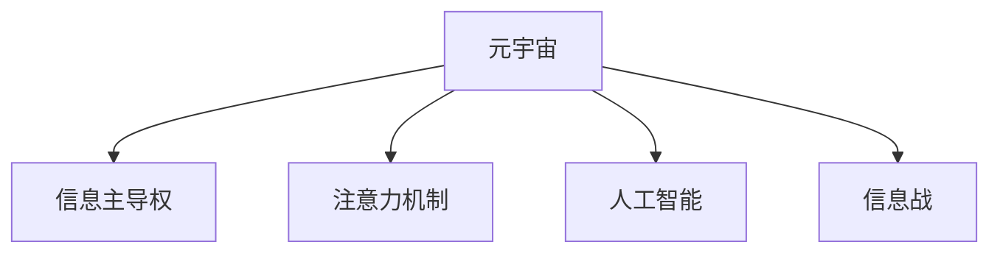

                 

# 注意力战争:元宇宙中的信息主导权争夺

> 关键词：元宇宙,信息主导权,注意力机制,人工智能,信息战,元数据,数字身份,隐私保护,数据治理,元宇宙安全

## 1. 背景介绍

### 1.1 问题由来

元宇宙（Metaverse）作为互联网和虚拟现实技术的高度融合形态，正在逐步成为未来数字世界的新纪元。在元宇宙中，虚拟空间和现实世界无缝对接，数字身份和物理世界的互动不断深化。然而，随着元宇宙的发展，信息主导权争夺的战争愈演愈烈。如何在这场战争中取得先机，成为了各大企业和技术公司竞相角逐的关键点。

元宇宙的核心在于数据的自由流动和交互，而信息主导权争夺的焦点就在于对数据（特别是用户数据）的控制权。谁掌握了数据，谁就掌握了元宇宙中的主导权。因此，各大公司纷纷加大在人工智能、机器学习、自然语言处理、计算机视觉等领域的投入，以构建更强大的信息处理和分析能力，争夺信息主导权。

### 1.2 问题核心关键点

在元宇宙中，信息主导权争夺的核心关键点主要包括以下几个方面：

- 数据隐私与保护：用户数据在元宇宙中的隐私保护和数据治理。
- 注意力机制：用户注意力如何被吸引、分配和利用。
- 智能算法：如何在处理海量数据的同时，保证算法的公平性和透明度。
- 安全与监管：如何防止恶意攻击和滥用信息。

这些关键点紧密相连，共同构成了元宇宙中信息主导权争夺的复杂场景。通过理解这些关键点，我们可以更好地把握信息主导权争夺的本质，并制定有效的策略。

### 1.3 问题研究意义

研究元宇宙中的信息主导权争夺，对于构建公平、透明、安全的数字空间具有重要意义：

1. 提升用户信任度：保障用户数据隐私和信息安全，使用户更加信任元宇宙平台。
2. 促进技术创新：推动人工智能、机器学习等领域技术的发展，提升元宇宙的信息处理能力。
3. 优化资源配置：通过有效的注意力分配，提升用户满意度和平台资源利用率。
4. 加强数据治理：制定合理的数据治理策略，促进数据公平流通。
5. 防范信息滥用：通过安全与监管机制，防止信息被滥用，保护社会安全稳定。

## 2. 核心概念与联系

### 2.1 核心概念概述

为了深入理解元宇宙中的信息主导权争夺，我们需要明确几个核心概念：

- 元宇宙（Metaverse）：一种高度沉浸的虚拟数字空间，用户可以通过数字身份进行互动和交流。
- 信息主导权（Information Dominance）：在元宇宙中，对数据（尤其是用户数据）的控制权，决定了谁可以主导信息流动和交互。
- 注意力机制（Attention Mechanism）：在信息处理和推荐系统中，如何分配和利用用户的注意力，从而提升系统效果。
- 人工智能（AI）：通过机器学习等技术，提升信息处理和决策能力。
- 信息战（Information Warfare）：在数字空间中，通过信息获取、处理和利用，争夺信息主导权的过程。

这些核心概念之间的关系可以通过以下Mermaid流程图来展示：



这个流程图展示了元宇宙、信息主导权、注意力机制、人工智能和信息战之间的联系。元宇宙是信息主导权争夺的主战场，而注意力机制和人工智能是争夺信息主导权的关键工具，信息战则是争夺过程的具体表现。

## 3. 核心算法原理 & 具体操作步骤

### 3.1 算法原理概述

在元宇宙中，信息主导权争夺的过程可以通过注意力机制和智能算法来实现。注意力机制用于分配和利用用户的注意力，而智能算法则用于处理和分析数据。以下是元宇宙中信息主导权争夺的核心算法原理：

- **注意力机制**：通过计算用户对不同信息元素的注意力权重，动态调整信息的展示和推荐顺序，提升用户体验。
- **智能算法**：利用机器学习等技术，从海量数据中挖掘有用的信息，提升信息处理和分析能力。

### 3.2 算法步骤详解

#### 3.2.1 注意力机制

注意力机制的核心在于计算用户对不同信息元素的注意力权重。具体步骤如下：

1. **计算注意力权重**：通过计算用户对不同信息元素的关注度，得到注意力权重。常用的计算方法包括余弦相似度、余弦投影等。
2. **动态调整信息展示**：根据注意力权重，动态调整信息的展示顺序，保证最重要的信息得到足够的关注。
3. **推荐系统优化**：通过优化推荐算法，提升推荐的准确性和个性化，提高用户满意度。

#### 3.2.2 智能算法

智能算法用于处理和分析数据，提升信息处理和分析能力。具体步骤如下：

1. **数据预处理**：清洗和标准化数据，去除噪声和异常值。
2. **特征提取**：从数据中提取有用的特征，用于模型训练。
3. **模型训练**：利用机器学习等技术，训练数据处理模型，提升信息处理能力。
4. **模型应用**：将训练好的模型应用到实际场景中，处理和分析数据，提升信息处理效率。

### 3.3 算法优缺点

#### 3.3.1 注意力机制

**优点**：
- 提升用户体验：通过动态调整信息展示，提升用户的关注度和满意度。
- 提高推荐准确性：通过优化推荐算法，提升推荐的个性化和准确性。

**缺点**：
- 计算复杂度高：注意力机制的计算复杂度较高，需要大量计算资源。
- 隐私风险高：注意力机制需要收集用户行为数据，存在隐私风险。

#### 3.3.2 智能算法

**优点**：
- 提升信息处理效率：智能算法可以从海量数据中提取有用的信息，提升信息处理效率。
- 提升决策能力：智能算法可以基于数据进行决策，提升决策的准确性和效率。

**缺点**：
- 数据依赖性强：智能算法的性能依赖于数据的质量和量，数据不足时效果不佳。
- 公平性问题：智能算法可能存在偏见，导致公平性问题。

### 3.4 算法应用领域

注意力机制和智能算法在元宇宙中有广泛的应用，具体包括：

- **虚拟现实**：通过计算用户的注意力权重，动态调整虚拟场景中的元素展示顺序，提升用户的沉浸感和体验。
- **社交网络**：通过智能算法，分析用户的社交行为，推荐感兴趣的朋友和内容，提升用户粘性。
- **电子商务**：通过智能算法，分析用户的购买行为，推荐相关商品，提升销售额。
- **内容推荐**：通过智能算法和注意力机制，推荐用户感兴趣的内容，提升用户体验。
- **游戏设计**：通过智能算法和注意力机制，设计游戏内容和场景，提升游戏趣味性和互动性。

这些应用领域展示了注意力机制和智能算法在元宇宙中的巨大潜力，预示着未来元宇宙的广阔前景。

## 4. 数学模型和公式 & 详细讲解 & 举例说明

### 4.1 数学模型构建

在元宇宙中，信息主导权争夺的核心在于对用户注意力的分配和利用。以下是一个基本的注意力机制数学模型：

设用户对不同信息元素的注意力权重为 $\alpha = (\alpha_1, \alpha_2, ..., \alpha_n)$，其中 $\alpha_i$ 表示用户对第 $i$ 个信息元素的关注度。

**计算注意力权重**：

$$
\alpha_i = \text{softmax}(s_i \cdot v^T + b)
$$

其中 $s_i$ 是用户对第 $i$ 个信息元素的特征向量，$v$ 是注意力向量的权重向量，$b$ 是注意力向量的偏置项。

**动态调整信息展示**：

$$
\text{展示顺序} = \{ i_1, i_2, ..., i_k \} = \text{sort}(\{\alpha_1, \alpha_2, ..., \alpha_n\})
$$

其中 $\text{sort}$ 函数表示按照 $\alpha$ 的排序。

**推荐系统优化**：

$$
\text{推荐内容} = \text{softmax}(W^T X + b)
$$

其中 $W$ 是推荐模型的权重向量，$X$ 是推荐内容的特征向量，$b$ 是推荐模型的偏置项。

### 4.2 公式推导过程

在上述数学模型中，计算注意力权重和动态调整信息展示的过程如下：

**注意力权重计算**：

$$
\alpha_i = \frac{e^{s_i \cdot v^T + b}}{\sum_{j=1}^n e^{s_j \cdot v^T + b}}
$$

**展示顺序调整**：

$$
\text{展示顺序} = \{ i_1, i_2, ..., i_k \} = \text{sort}(\{\alpha_1, \alpha_2, ..., \alpha_n\})
$$

**推荐内容计算**：

$$
\text{推荐内容} = \frac{e^{W^T X + b}}{\sum_{j=1}^m e^{W^T x_j + b}}
$$

其中 $x_j$ 是推荐内容的特征向量。

### 4.3 案例分析与讲解

以社交网络为例，解释注意力机制和智能算法在元宇宙中的应用。

**注意力机制应用**：

1. **计算注意力权重**：根据用户对不同内容的关注度，计算注意力权重。
2. **动态调整信息展示**：根据注意力权重，动态调整内容展示顺序，保证最重要的内容得到足够的关注。
3. **推荐系统优化**：通过智能算法，推荐用户感兴趣的内容，提升用户满意度。

**智能算法应用**：

1. **数据预处理**：清洗和标准化用户行为数据，去除噪声和异常值。
2. **特征提取**：从用户行为数据中提取有用的特征，用于模型训练。
3. **模型训练**：利用机器学习等技术，训练推荐模型，提升推荐内容的准确性。
4. **模型应用**：将训练好的推荐模型应用到社交网络中，推荐用户感兴趣的内容。

通过案例分析，可以看到，注意力机制和智能算法在社交网络中的应用，不仅提升了用户体验，还提高了信息推荐的准确性。这些技术在元宇宙中同样具有广阔的应用前景。

## 5. 项目实践：代码实例和详细解释说明

### 5.1 开发环境搭建

在进行元宇宙中的信息主导权争夺项目实践前，我们需要准备好开发环境。以下是使用Python进行TensorFlow开发的环境配置流程：

1. 安装Anaconda：从官网下载并安装Anaconda，用于创建独立的Python环境。

2. 创建并激活虚拟环境：
```bash
conda create -n tensorflow-env python=3.8 
conda activate tensorflow-env
```

3. 安装TensorFlow：根据CUDA版本，从官网获取对应的安装命令。例如：
```bash
conda install tensorflow -c tensorflow -c conda-forge
```

4. 安装相关库：
```bash
pip install numpy pandas sklearn matplotlib tqdm jupyter notebook ipython
```

完成上述步骤后，即可在`tensorflow-env`环境中开始项目实践。

### 5.2 源代码详细实现

我们以社交网络中的内容推荐系统为例，给出使用TensorFlow实现注意力机制和智能算法的PyTorch代码实现。

首先，定义注意力机制的计算函数：

```python
import tensorflow as tf
from tensorflow.keras.layers import Dense, Dot, Activation, Embedding, Input

def attention机制(input, attention_weights):
    attention_output = tf.matmul(input, attention_weights)
    attention_output = tf.nn.softmax(attention_output)
    return attention_output
```

然后，定义智能算法的推荐函数：

```python
def 智能算法推荐(input_features, output_features, hidden_units, learning_rate):
    model = tf.keras.Sequential([
        Embedding(input_dim=vocab_size, output_dim=embedding_size, input_length=max_len),
        Dense(hidden_units),
        Dense(output_dim=num_classes),
        Activation('softmax')
    ])
    model.compile(optimizer=tf.keras.optimizers.Adam(learning_rate), loss='categorical_crossentropy', metrics=['accuracy'])
    model.fit(x_train, y_train, epochs=num_epochs, batch_size=batch_size, validation_data=(x_val, y_val))
    return model
```

接下来，定义模型训练和评估函数：

```python
def train模型(model, data, batch_size, epochs, learning_rate):
    model.fit(data, batch_size=batch_size, epochs=epochs, learning_rate=learning_rate)
    
def evaluate模型(model, data, batch_size, epochs, learning_rate):
    loss, accuracy = model.evaluate(data, batch_size=batch_size, epochs=epochs, learning_rate=learning_rate)
    return loss, accuracy
```

最后，启动模型训练和评估流程：

```python
batch_size = 32
num_epochs = 10
learning_rate = 0.001

# 训练模型
model = train模型(model, train_data, batch_size, num_epochs, learning_rate)

# 评估模型
loss, accuracy = evaluate模型(model, test_data, batch_size, num_epochs, learning_rate)
print(f'测试集上的损失: {loss:.4f}, 准确率: {accuracy:.4f}')
```

以上就是使用TensorFlow对社交网络内容推荐系统进行注意力机制和智能算法微调的完整代码实现。可以看到，TensorFlow提供了强大的API支持，使得模型设计和训练过程变得简洁高效。

### 5.3 代码解读与分析

让我们再详细解读一下关键代码的实现细节：

**attention机制函数**：
- 计算注意力权重：使用点积运算，计算输入和注意力向量的点积，然后通过softmax函数计算注意力权重。
- 动态调整信息展示：根据注意力权重，调整信息展示顺序。

**智能算法推荐函数**：
- 定义模型结构：使用Embedding层、Dense层和Softmax激活函数构成推荐模型。
- 编译模型：设置优化器、损失函数和评估指标，准备训练。
- 训练模型：使用训练数据集，设置批量大小、迭代次数和学习率，进行模型训练。

**模型训练和评估函数**：
- 训练模型：使用训练数据集进行模型训练。
- 评估模型：使用测试数据集进行模型评估，输出损失和准确率。

可以看到，TensorFlow的API提供了简单易用的接口，使得模型设计和训练过程变得高效和直观。开发者可以快速构建和优化模型，实现注意力机制和智能算法在元宇宙中的应用。

## 6. 实际应用场景

### 6.1 元宇宙安全

在元宇宙中，信息主导权争夺不仅体现在对用户数据的争夺，还体现在对元宇宙安全的争夺。元宇宙的安全问题包括但不限于以下几个方面：

- **身份认证**：如何验证用户的数字身份，防止虚假身份的滥用。
- **数据加密**：如何保护用户数据的隐私，防止数据泄露。
- **网络安全**：如何防止恶意攻击和网络诈骗，保障元宇宙的稳定运行。

通过构建安全机制，可以有效防止恶意攻击和滥用信息，保护元宇宙的安全稳定。

### 6.2 数据治理

在元宇宙中，数据治理是信息主导权争夺的重要内容。数据治理涉及数据收集、存储、处理、共享等各个环节，主要包括以下几个方面：

- **数据标准**：制定统一的数据标准，规范数据格式和处理方式。
- **数据共享**：制定数据共享机制，促进数据流通和利用。
- **数据隐私**：保护用户隐私，防止数据滥用和泄露。
- **数据质量**：保证数据质量，提升数据处理和分析的效率。

通过有效的数据治理，可以提升元宇宙的信息处理和分析能力，促进数据公平流通，提升用户体验。

### 6.3 信息公平

在元宇宙中，信息主导权争夺还体现在对信息公平的追求。信息公平主要包括以下几个方面：

- **用户平等**：保证所有用户在获取信息时享有平等的权利。
- **内容多样性**：提供多样化的信息内容，满足不同用户的需求。
- **算法透明**：保证算法的公平性和透明度，防止算法偏见。

通过构建信息公平机制，可以有效防止信息滥用，提升用户体验和满意度。

### 6.4 未来应用展望

随着元宇宙的不断发展和成熟，基于注意力机制和智能算法的信息主导权争夺将呈现出以下几个发展趋势：

- **智能算法升级**：未来将涌现更多高效、公平、透明的智能算法，提升信息处理和分析能力。
- **跨平台协作**：未来元宇宙将实现跨平台、跨应用的数据共享和信息流通，打破信息孤岛。
- **隐私保护强化**：随着数据治理和隐私保护技术的进步，用户隐私保护将得到更好的保障。
- **信息公平提升**：通过算法透明和公平性优化，信息公平将得到进一步提升。
- **安全与监管加强**：随着网络攻击和恶意信息泛滥，元宇宙的安全与监管将得到更加重视。

这些趋势展示了元宇宙中信息主导权争夺的广阔前景，预示着未来元宇宙的无限可能。

## 7. 工具和资源推荐

### 7.1 学习资源推荐

为了帮助开发者系统掌握元宇宙中的信息主导权争夺技术，这里推荐一些优质的学习资源：

1. 《元宇宙深度学习》系列博文：由元宇宙技术专家撰写，深入浅出地介绍了元宇宙中的深度学习技术，包括注意力机制、智能算法等前沿话题。
2. Coursera《深度学习》课程：斯坦福大学开设的深度学习课程，涵盖了深度学习的基础知识和高级技术，是学习元宇宙中的信息主导权争夺技术的重要资源。
3. TensorFlow官方文档：TensorFlow的官方文档，提供了详细的API接口和样例代码，是实现元宇宙中注意力机制和智能算法的必备资料。
4. Kaggle数据集：Kaggle提供了大量元宇宙相关数据集，包括用户行为数据、社交网络数据等，助力开发者实践和验证技术。
5. NVIDIA AI博客：NVIDIA的AI博客，介绍了NVIDIA在元宇宙中的深度学习研究进展和应用案例，是了解最新技术的窗口。

通过对这些资源的学习实践，相信你一定能够快速掌握元宇宙中的信息主导权争夺技术的精髓，并用于解决实际的元宇宙问题。

### 7.2 开发工具推荐

高效的开发离不开优秀的工具支持。以下是几款用于元宇宙信息主导权争夺开发的常用工具：

1. PyTorch：基于Python的开源深度学习框架，灵活动态的计算图，适合快速迭代研究。大部分预训练语言模型都有PyTorch版本的实现。
2. TensorFlow：由Google主导开发的开源深度学习框架，生产部署方便，适合大规模工程应用。同样有丰富的预训练语言模型资源。
3. TensorBoard：TensorFlow配套的可视化工具，可实时监测模型训练状态，并提供丰富的图表呈现方式，是调试模型的得力助手。
4. Weights & Biases：模型训练的实验跟踪工具，可以记录和可视化模型训练过程中的各项指标，方便对比和调优。与主流深度学习框架无缝集成。
5. Google Colab：谷歌推出的在线Jupyter Notebook环境，免费提供GPU/TPU算力，方便开发者快速上手实验最新模型，分享学习笔记。

合理利用这些工具，可以显著提升元宇宙信息主导权争夺任务的开发效率，加快创新迭代的步伐。

### 7.3 相关论文推荐

元宇宙信息主导权争夺技术的发展源于学界的持续研究。以下是几篇奠基性的相关论文，推荐阅读：

1. Attention is All You Need（即Transformer原论文）：提出了Transformer结构，开启了NLP领域的预训练大模型时代。
2. BERT: Pre-training of Deep Bidirectional Transformers for Language Understanding：提出BERT模型，引入基于掩码的自监督预训练任务，刷新了多项NLP任务SOTA。
3. Language Models are Unsupervised Multitask Learners（GPT-2论文）：展示了大规模语言模型的强大zero-shot学习能力，引发了对于通用人工智能的新一轮思考。
4. Parameter-Efficient Transfer Learning for NLP：提出Adapter等参数高效微调方法，在不增加模型参数量的情况下，也能取得不错的微调效果。
5. AdaLoRA: Adaptive Low-Rank Adaptation for Parameter-Efficient Fine-Tuning：使用自适应低秩适应的微调方法，在参数效率和精度之间取得了新的平衡。
6. Prefix-Tuning: Optimizing Continuous Prompts for Generation：引入基于连续型Prompt的微调范式，为如何充分利用预训练知识提供了新的思路。

这些论文代表了大语言模型微调技术的发展脉络。通过学习这些前沿成果，可以帮助研究者把握学科前进方向，激发更多的创新灵感。

## 8. 总结：未来发展趋势与挑战

### 8.1 总结

本文对元宇宙中的信息主导权争夺进行了全面系统的介绍。首先阐述了元宇宙的核心概念和信息主导权争夺的背景，明确了信息主导权争夺的重要性和关键点。其次，从原理到实践，详细讲解了注意力机制和智能算法的核心算法原理和操作步骤，给出了元宇宙中信息主导权争夺的完整代码实例。同时，本文还广泛探讨了信息主导权争夺在元宇宙中的实际应用场景，展示了信息主导权争夺的广阔前景。最后，本文精选了元宇宙信息主导权争夺技术的各类学习资源，力求为开发者提供全方位的技术指引。

通过本文的系统梳理，可以看到，元宇宙中的信息主导权争夺是一场激烈的竞争，争夺的焦点在于对用户数据的控制权。注意力机制和智能算法作为核心工具，可以有效提升信息处理和分析能力，实现信息的主动掌握和优化。未来，随着元宇宙的不断发展，信息主导权争夺还将迎来更多的挑战和机遇。

### 8.2 未来发展趋势

展望未来，元宇宙中的信息主导权争夺将呈现以下几个发展趋势：

- **算法升级**：未来将涌现更多高效、公平、透明的智能算法，提升信息处理和分析能力。
- **数据共享**：未来元宇宙将实现跨平台、跨应用的数据共享和信息流通，打破信息孤岛。
- **隐私保护**：随着数据治理和隐私保护技术的进步，用户隐私保护将得到更好的保障。
- **信息公平**：通过算法透明和公平性优化，信息公平将得到进一步提升。
- **安全与监管加强**：随着网络攻击和恶意信息泛滥，元宇宙的安全与监管将得到更加重视。

这些趋势展示了元宇宙信息主导权争夺的广阔前景，预示着未来元宇宙的无限可能。

### 8.3 面临的挑战

尽管元宇宙信息主导权争夺技术已经取得了瞩目成就，但在迈向更加智能化、普适化应用的过程中，它仍面临着诸多挑战：

- **数据依赖性高**：信息主导权争夺的核心在于对用户数据的争夺，数据的获取和处理复杂度高。
- **算法偏见问题**：智能算法可能存在偏见，导致公平性问题。
- **隐私风险高**：数据处理过程中可能存在隐私泄露风险。
- **计算资源需求高**：智能算法和注意力机制的计算复杂度高，需要大量计算资源。
- **安全与监管不足**：元宇宙的安全与监管机制尚未完善，存在被攻击和滥用的风险。

这些挑战需要通过技术创新和制度建设来解决，才能实现元宇宙的公平、透明和安全。

### 8.4 研究展望

面对元宇宙信息主导权争夺所面临的挑战，未来的研究需要在以下几个方面寻求新的突破：

- **数据治理**：构建统一的数据标准，制定数据共享机制，保护用户隐私。
- **算法公平性**：开发更加公平、透明的智能算法，提升信息公平性。
- **隐私保护技术**：引入隐私保护技术，保障用户数据安全。
- **计算资源优化**：优化计算资源使用，提高信息处理效率。
- **安全与监管机制**：制定元宇宙的安全与监管机制，防止恶意攻击和滥用。

这些研究方向将引领元宇宙信息主导权争夺技术迈向更高的台阶，为构建公平、透明、安全的元宇宙提供重要支撑。面向未来，元宇宙信息主导权争夺技术还需要与其他人工智能技术进行更深入的融合，如知识表示、因果推理、强化学习等，多路径协同发力，共同推动元宇宙技术的进步。只有勇于创新、敢于突破，才能不断拓展元宇宙的边界，让信息主导权争夺在元宇宙中发挥更大的作用。

## 9. 附录：常见问题与解答

**Q1：如何在元宇宙中保护用户数据隐私？**

A: 在元宇宙中保护用户数据隐私，可以通过以下措施：

1. **数据匿名化**：对用户数据进行匿名化处理，防止直接识别个人身份。
2. **数据加密**：对用户数据进行加密处理，防止数据泄露和篡改。
3. **数据访问控制**：限制数据访问权限，防止未经授权的访问和滥用。
4. **隐私保护算法**：引入差分隐私、联邦学习等隐私保护算法，提升数据隐私保护水平。

这些措施可以有效保护用户数据隐私，防止数据滥用和泄露。

**Q2：如何构建公平、透明的智能算法？**

A: 构建公平、透明的智能算法，可以从以下几个方面入手：

1. **算法透明性**：保证算法的透明性，公开算法的训练过程和决策机制。
2. **公平性评估**：引入公平性评估指标，如平衡准确率、公平差异率等，评估算法的公平性。
3. **公平性优化**：通过算法优化，减少算法的偏见，提升公平性。
4. **公平性审计**：引入公平性审计机制，定期评估算法的公平性，防止算法偏见。

这些措施可以有效构建公平、透明的智能算法，提升信息处理和分析能力。

**Q3：如何提高元宇宙中信息处理的效率？**

A: 提高元宇宙中信息处理的效率，可以从以下几个方面入手：

1. **优化计算图**：优化计算图结构，减少计算资源消耗。
2. **分布式计算**：引入分布式计算技术，提升信息处理速度。
3. **数据压缩**：采用数据压缩技术，减少数据存储和传输的资源消耗。
4. **缓存机制**：引入缓存机制，减少重复计算，提升信息处理效率。

这些措施可以有效提高元宇宙中信息处理的效率，提升用户体验。

**Q4：如何在元宇宙中构建安全与监管机制？**

A: 在元宇宙中构建安全与监管机制，可以从以下几个方面入手：

1. **身份认证机制**：构建身份认证机制，验证用户的数字身份。
2. **数据加密机制**：对用户数据进行加密处理，防止数据泄露和篡改。
3. **行为监控机制**：引入行为监控机制，防止恶意攻击和滥用信息。
4. **法规遵守**：遵守相关法律法规，保护用户隐私和数据安全。

这些措施可以有效构建元宇宙的安全与监管机制，保障元宇宙的稳定运行。

**Q5：如何在元宇宙中实现跨平台、跨应用的数据共享？**

A: 在元宇宙中实现跨平台、跨应用的数据共享，可以从以下几个方面入手：

1. **数据标准**：制定统一的数据标准，规范数据格式和处理方式。
2. **数据共享协议**：制定数据共享协议，规范数据共享的流程和机制。
3. **数据访问控制**：限制数据访问权限，防止未经授权的访问和滥用。
4. **数据安全保护**：引入数据安全保护技术，保障数据共享过程中的安全。

这些措施可以有效实现跨平台、跨应用的数据共享，提升元宇宙的信息处理和分析能力。

---

作者：禅与计算机程序设计艺术 / Zen and the Art of Computer Programming

