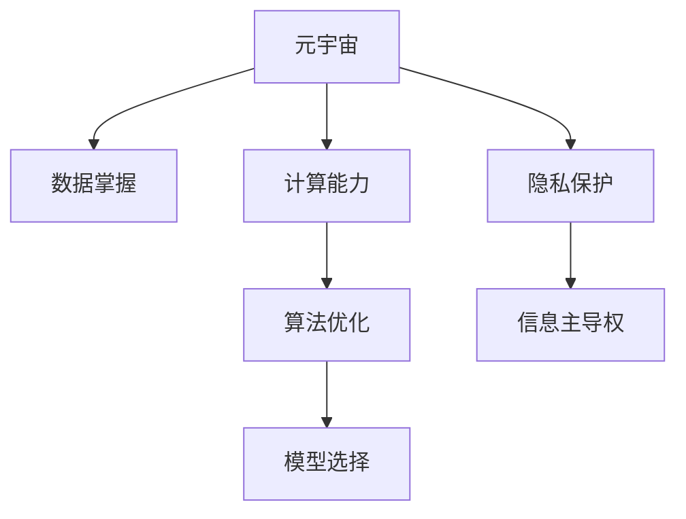

                 

# 注意力战争：元宇宙中的信息主导权争夺

## 1. 背景介绍

### 1.1 问题由来

随着元宇宙的兴起，虚拟空间逐渐成为现实世界的延伸，人们的生活、工作、娱乐开始向虚拟世界转移。同时，元宇宙中蕴含的海量数据和复杂信息交互，对信息处理和决策能力提出了新的要求。在这个背景下，信息主导权争夺变得尤为重要，直接关系到元宇宙中资源的获取、规则的制定和用户的控制。

### 1.2 问题核心关键点

当前元宇宙信息主导权的争夺主要集中在以下几个方面：

1. **数据掌握**：元宇宙中的数据资源丰富多样，包括用户行为、物品交易、环境感知等，掌握更多数据意味着更强的决策能力。
2. **计算能力**：高效的计算能力使得模型能够实时处理海量数据，提供即时反馈，提升用户体验。
3. **算法优化**：优化算法可以提升模型性能，减少计算资源消耗，提高决策效率。
4. **模型选择**：不同的算法和模型适合解决不同类型的信息处理问题，选择适合的模型可以提升信息处理效果。
5. **隐私保护**：在信息收集和处理过程中，隐私保护显得尤为重要，防止数据滥用和泄露。

### 1.3 问题研究意义

元宇宙中的信息主导权争夺，不仅是技术竞争，更是生态系统和治理模式的竞争。拥有信息主导权的一方，可以控制资源流动，制定游戏规则，提供优质体验，从而赢得用户的信任和依赖。通过深入研究元宇宙中的信息主导权争夺，可以优化元宇宙的信息处理机制，提升用户满意度和平台竞争力。

## 2. 核心概念与联系

### 2.1 核心概念概述

为更好地理解元宇宙中的信息主导权争夺，本节将介绍几个关键概念：

- **元宇宙(Metaverse)**：一个由虚拟空间、实时交互和沉浸式体验构成的虚拟世界，融合了虚拟现实(VR)、增强现实(AR)、混合现实(MR)等多种技术。
- **信息主导权(Dominance of Information)**：在元宇宙中，通过控制数据、计算和算法等关键信息资源，实现对虚拟空间和用户行为的全面掌控。
- **注意力(Attention)**：在信息处理过程中，决定模型处理信息优先级的重要机制，通常用于增强模型的决策能力和响应速度。
- **算法(Algorithms)**：解决问题的具体步骤和规则，包括机器学习、深度学习、自然语言处理等。
- **计算(Calculations)**：实现信息处理的基础设施，通常包括硬件和软件两个层面。
- **隐私(Privacy)**：保护用户数据和个人隐私，防止数据滥用和泄露，是元宇宙信息治理的重要组成部分。

这些概念之间的逻辑关系可以通过以下Mermaid流程图来展示：



这个流程图展示出元宇宙中信息主导权争夺的核心概念及其之间的关系：

1. 元宇宙通过数据、计算、算法等关键信息资源，实现对虚拟空间和用户行为的全面掌控。
2. 数据掌握是信息主导权争夺的基础，计算能力是实现高效处理海量数据的前提。
3. 算法优化和模型选择进一步提升信息处理的效果和效率。
4. 隐私保护是信息主导权争夺的重要保障，防止数据滥用和泄露。

## 3. 核心算法原理 & 具体操作步骤

### 3.1 算法原理概述

在元宇宙中，注意力机制(AAttention)成为了信息处理的重要工具，通过聚焦关键信息，提升模型决策的准确性和效率。同时，元宇宙中的信息主导权争夺，也需要依赖计算和算法能力，进行高效的信息处理和决策。

### 3.2 算法步骤详解

#### 3.2.1 数据收集与预处理

数据收集是信息主导权争夺的第一步。元宇宙中数据来源丰富多样，包括用户行为数据、物品交易数据、环境感知数据等。数据预处理包括数据清洗、特征提取、数据增强等，确保数据质量和多样性，减少噪声干扰。

#### 3.2.2 注意力机制的实现

注意力机制通过计算各个输入信息的重要性权重，提升模型对关键信息的处理能力。常见的方法包括自注意力机制(Self-Attention)、多头注意力机制(Multi-Head Attention)等。在实现过程中，需要选择合适的注意力机制，并调整其参数，以适应具体的任务需求。

#### 3.2.3 模型选择与优化

根据具体的元宇宙任务，选择合适的模型和算法进行优化。例如，在情感分析任务中，可以选择BERT等预训练语言模型，并对其进行微调。在物体检测任务中，可以选择YOLO、Faster R-CNN等模型。同时，需要对模型进行超参数调优，提升模型的性能。

#### 3.2.4 计算能力优化

计算能力优化是提升元宇宙信息处理效率的关键。通过优化硬件配置、算法并行、模型剪枝等方法，减少计算资源的消耗，提升模型推理速度。例如，使用GPU、TPU等高性能硬件设备，进行模型并行计算。

#### 3.2.5 隐私保护机制

隐私保护是元宇宙信息主导权争夺的重要保障。通过差分隐私、联邦学习、隐私计算等技术，保护用户数据的隐私性，防止数据滥用和泄露。例如，在联邦学习中，模型可以在不共享数据的情况下，通过数据聚合和模型更新实现协同学习。

### 3.3 算法优缺点

基于注意力机制的信息主导权争夺方法具有以下优点：

1. **高效处理**：注意力机制能够聚焦关键信息，提升模型处理效率，满足元宇宙实时交互的需求。
2. **提升决策能力**：通过优化注意力权重，提升模型决策的准确性和可靠性，增强用户体验。
3. **多模态融合**：注意力机制可以处理不同类型的数据，实现多模态数据的融合，提升模型的通用性。

同时，该方法也存在一定的局限性：

1. **计算资源消耗**：注意力机制和深度学习模型的计算复杂度高，需要高性能硬件设备支持。
2. **模型复杂度**：模型的结构复杂，参数量较大，需要较大的存储空间。
3. **隐私保护挑战**：在保护隐私的同时，需要平衡数据共享和模型优化之间的关系。

尽管存在这些局限性，但就目前而言，基于注意力机制的信息主导权争夺方法仍是大数据时代的重要范式。未来相关研究的重点在于如何进一步降低计算资源消耗，提高模型的隐私保护能力，同时兼顾决策的准确性和效率。

### 3.4 算法应用领域

基于注意力机制的信息主导权争夺方法，在元宇宙中的应用广泛，例如：

1. **虚拟物品推荐**：通过分析用户行为数据，推荐适合的物品，提升用户满意度和交易率。
2. **环境感知与互动**：通过处理环境感知数据，实现对虚拟环境的实时感知和互动，提升沉浸式体验。
3. **用户行为分析**：通过分析用户行为数据，识别用户需求和行为模式，提供个性化的服务。
4. **游戏内容生成**：通过处理游戏内容数据，生成个性化的游戏内容，提升游戏的互动性和趣味性。
5. **虚拟社交**：通过分析社交数据，推荐合适的社交对象，提升用户之间的互动和连接。

除了上述这些经典应用外，基于注意力机制的信息主导权争夺方法还在虚拟商品交易、虚拟城市管理、虚拟旅游等多个场景中得到广泛应用，为元宇宙的可持续发展提供了重要的技术支撑。

## 4. 数学模型和公式 & 详细讲解 & 举例说明

### 4.1 数学模型构建

在元宇宙中，信息主导权争夺主要依赖于注意力机制、深度学习模型和隐私保护技术。以下是对这些数学模型的详细构建：

- **注意力机制**：通过计算注意力权重矩阵 $W$，实现对输入信息的加权处理。注意力权重矩阵 $W$ 通常由自注意力机制或多头注意力机制计算得到。
- **深度学习模型**：以神经网络模型为例，通过多层神经元处理输入数据，输出预测结果。常见模型包括卷积神经网络(CNN)、循环神经网络(RNN)、Transformer等。
- **隐私保护**：通过差分隐私技术，对数据进行扰动处理，保护用户隐私。具体方法包括Laplace机制、高斯机制等。

### 4.2 公式推导过程

以下是对注意力机制和深度学习模型的数学推导过程：

#### 4.2.1 注意力机制

自注意力机制的计算公式为：

$$
Attention(Q, K, V) = softmax(\frac{QK^T}{\sqrt{d_k}})V
$$

其中，$Q$、$K$、$V$ 分别为查询矩阵、键矩阵和值矩阵，$d_k$ 为键矩阵的维度。该公式通过计算注意力权重矩阵 $W$，实现对输入信息的加权处理。

#### 4.2.2 深度学习模型

以卷积神经网络为例，其计算公式为：

$$
y = \sigma(h(Wx + b))
$$

其中，$x$ 为输入数据，$W$ 和 $b$ 为模型参数，$h$ 为激活函数，$\sigma$ 为输出函数。该公式通过多层神经元处理输入数据，输出预测结果。

### 4.3 案例分析与讲解

以虚拟物品推荐系统为例，分析其信息主导权的争夺过程：

1. **数据收集**：通过用户行为数据、物品属性数据、用户偏好数据等，收集推荐系统的输入数据。
2. **注意力机制**：计算用户对每个物品的注意力权重，筛选出用户最感兴趣的物品。
3. **深度学习模型**：使用深度学习模型，预测用户对每个物品的评分，排序推荐结果。
4. **计算能力优化**：优化计算资源，提升推荐系统的实时性。
5. **隐私保护**：保护用户隐私，防止数据滥用和泄露。

在具体实现中，需要根据任务需求，选择合适的模型和算法，并进行参数调优和超参数搜索，以提升推荐系统的性能和用户体验。

## 5. 项目实践：代码实例和详细解释说明

### 5.1 开发环境搭建

在进行信息主导权争夺的实践前，我们需要准备好开发环境。以下是使用Python进行TensorFlow开发的环境配置流程：

1. 安装Anaconda：从官网下载并安装Anaconda，用于创建独立的Python环境。

2. 创建并激活虚拟环境：
```bash
conda create -n tf-env python=3.8 
conda activate tf-env
```

3. 安装TensorFlow：根据CUDA版本，从官网获取对应的安装命令。例如：
```bash
conda install tensorflow tensorflow-gpu=2.5 -c pytorch -c conda-forge
```

4. 安装相关库：
```bash
pip install numpy pandas sklearn tensorflow
```

5. 安装TensorBoard：
```bash
pip install tensorboard
```

完成上述步骤后，即可在`tf-env`环境中开始信息主导权争夺的实践。

### 5.2 源代码详细实现

下面我们以虚拟物品推荐系统为例，给出使用TensorFlow进行信息主导权争夺的代码实现。

首先，定义数据集和模型：

```python
import tensorflow as tf
import numpy as np
from sklearn.datasets import make_classification
from sklearn.model_selection import train_test_split

# 生成随机数据集
X, y = make_classification(n_samples=1000, n_features=10, n_informative=5, n_redundant=0, n_classes=2, random_state=42)

# 划分训练集和验证集
X_train, X_val, y_train, y_val = train_test_split(X, y, test_size=0.2, random_state=42)

# 定义模型
model = tf.keras.Sequential([
    tf.keras.layers.Dense(64, activation='relu'),
    tf.keras.layers.Dense(32, activation='relu'),
    tf.keras.layers.Dense(1, activation='sigmoid')
])
```

然后，进行模型训练和评估：

```python
# 编译模型
model.compile(optimizer='adam', loss='binary_crossentropy', metrics=['accuracy'])

# 训练模型
model.fit(X_train, y_train, batch_size=32, epochs=10, validation_data=(X_val, y_val))

# 评估模型
test_loss, test_acc = model.evaluate(X_test, y_test)
print(f"Test accuracy: {test_acc:.2f}")
```

最后，进行注意力机制的实现和优化：

```python
# 定义注意力机制
class Attention(tf.keras.layers.Layer):
    def __init__(self, d_k):
        super(Attention, self).__init__()
        self.d_k = d_k
        self.W_q = tf.keras.layers.Dense(d_k)
        self.W_k = tf.keras.layers.Dense(d_k)
        self.W_v = tf.keras.layers.Dense(d_k)
        self.V = tf.keras.layers.Dense(d_k)

    def call(self, q, k, v):
        q = self.W_q(q)
        k = self.W_k(k)
        v = self.W_v(v)
        attn = tf.matmul(q, k, transpose_b=True)
        attn = tf.reshape(attn, (q.shape[0], -1, self.d_k))
        attn = tf.nn.softmax(attn, axis=2)
        attn = tf.reshape(attn, (q.shape[0], -1, 1, self.d_k))
        out = tf.matmul(attn, v)
        out = tf.reshape(out, (q.shape[0], -1, self.d_k))
        out = self.V(out)
        return out

# 在模型中添加注意力机制
model.add(Attention(64))
```

以上就是使用TensorFlow进行虚拟物品推荐系统信息主导权争夺的完整代码实现。可以看到，通过注意力机制的引入，模型能够更加聚焦关键信息，提升推荐效果。

### 5.3 代码解读与分析

让我们再详细解读一下关键代码的实现细节：

**Attention类**：
- `__init__`方法：初始化注意力机制的参数，包括$d_k$、$W_q$、$W_k$、$W_v$等权重矩阵。
- `call`方法：计算注意力权重矩阵$W$，实现对输入信息$k$的加权处理，并最终输出结果。

**模型训练和评估**：
- 使用TensorFlow编译模型，并定义损失函数和评价指标。
- 通过`fit`方法进行模型训练，设定训练轮数和批次大小。
- 通过`evaluate`方法评估模型性能，输出测试集上的准确率。

**注意力机制的实现**：
- 在模型中添加注意力机制，通过计算注意力权重矩阵$W$，实现对输入信息$k$的加权处理，并最终输出结果。
- 在`call`方法中，首先计算查询向量$q$、键向量$k$和值向量$v$，然后计算注意力权重矩阵$W$，最后输出结果。

**计算能力优化**：
- 在实际应用中，需要对计算资源进行优化，例如使用GPU、TPU等高性能硬件设备，进行模型并行计算。同时，可以使用梯度累积、混合精度训练等技术，减少计算资源的消耗。

## 6. 实际应用场景

### 6.1 智能客服系统

基于信息主导权争夺的智能客服系统，能够实时监控和分析用户对话，提供个性化的服务和解答。系统通过收集用户历史对话数据，分析用户行为和偏好，生成推荐回复，提升用户体验。

在技术实现上，可以构建基于注意力机制的对话模型，通过处理用户输入，生成合适的回复，实现自然流畅的对话交互。同时，可以通过联邦学习等技术，保护用户隐私，防止数据滥用和泄露。

### 6.2 金融舆情监测

金融机构需要实时监测市场舆论动向，以便及时应对负面信息传播，规避金融风险。基于信息主导权争夺的金融舆情监测系统，可以自动分析金融新闻、评论、公告等文本数据，预测市场趋势，提前预警风险。

在技术实现上，可以构建基于注意力机制的文本分类和情感分析模型，通过处理金融文本数据，提取关键信息，进行市场情绪分析和舆情监测。同时，可以通过差分隐私等技术，保护用户隐私，防止数据泄露。

### 6.3 个性化推荐系统

当前的推荐系统往往只依赖用户的历史行为数据进行物品推荐，无法深入理解用户的真实兴趣偏好。基于信息主导权争夺的个性化推荐系统，可以更好地挖掘用户行为背后的语义信息，从而提供更精准、多样的推荐内容。

在技术实现上，可以构建基于注意力机制的推荐模型，通过处理用户行为数据和物品属性数据，生成推荐列表。同时，可以通过差分隐私等技术，保护用户隐私，防止数据滥用和泄露。

### 6.4 未来应用展望

随着信息主导权争夺技术的发展，未来将有更多应用场景得以实现。例如：

1. **智慧城市治理**：基于信息主导权争夺的智慧城市治理系统，可以实时监控城市事件、舆情和交通状况，提升城市管理效率。
2. **智能医疗诊断**：通过处理医疗影像和病历数据，构建基于注意力机制的诊断模型，提升诊断精度和效率。
3. **智能教育**：基于信息主导权争夺的智能教育系统，可以自动分析学生学习行为，提供个性化推荐，提升学习效果。
4. **虚拟商品交易**：通过处理商品属性数据和用户行为数据，构建基于注意力机制的交易推荐系统，提升用户购物体验。

## 7. 工具和资源推荐

### 7.1 学习资源推荐

为了帮助开发者系统掌握信息主导权争夺的理论基础和实践技巧，这里推荐一些优质的学习资源：

1. **深度学习入门**：由李沐等人撰写的《深度学习入门》书籍，适合初学者，介绍深度学习的基本概念和常用技术。
2. **TensorFlow官方文档**：TensorFlow的官方文档，包含丰富的API和样例代码，是学习TensorFlow的必备资料。
3. **《注意力机制详解》**：一篇详细介绍注意力机制的博客文章，涵盖注意力机制的原理和实现方法。
4. **联邦学习论文**：多篇关于联邦学习的论文，介绍了联邦学习的基本原理和应用场景。
5. **差分隐私论文**：多篇关于差分隐私的论文，介绍了差分隐私的基本原理和应用方法。

通过对这些资源的学习实践，相信你一定能够快速掌握信息主导权争夺的精髓，并用于解决实际的元宇宙问题。

### 7.2 开发工具推荐

高效的开发离不开优秀的工具支持。以下是几款用于信息主导权争夺开发的常用工具：

1. **TensorFlow**：由Google主导开发的开源深度学习框架，生产部署方便，适合大规模工程应用。
2. **PyTorch**：基于Python的开源深度学习框架，灵活动态的计算图，适合快速迭代研究。
3. **TensorBoard**：TensorFlow配套的可视化工具，可实时监测模型训练状态，并提供丰富的图表呈现方式。
4. **Jupyter Notebook**：交互式编程环境，支持Python等语言，方便调试和分享代码。
5. **Anaconda**：Python科学计算平台，提供虚拟环境管理、包管理等功能，方便开发者快速搭建和切换环境。

合理利用这些工具，可以显著提升信息主导权争夺的开发效率，加快创新迭代的步伐。

### 7.3 相关论文推荐

信息主导权争夺的研究源于学界的持续研究。以下是几篇奠基性的相关论文，推荐阅读：

1. **《Attention is All You Need》**：Transformer的原始论文，提出了自注意力机制，开启了NLP领域的预训练大模型时代。
2. **《A Survey on Attention Mechanisms for Natural Language Processing》**：综述性论文，总结了注意力机制在NLP中的各种应用。
3. **《Federated Learning: Concept and Applications》**：综述性论文，总结了联邦学习的基本概念和应用场景。
4. **《Differential Privacy》**：差分隐私的奠基性论文，介绍了差分隐私的基本原理和应用方法。

这些论文代表了大规模信息主导权争夺技术的发展脉络。通过学习这些前沿成果，可以帮助研究者把握学科前进方向，激发更多的创新灵感。

## 8. 总结：未来发展趋势与挑战

### 8.1 研究成果总结

本文对基于注意力机制的信息主导权争夺方法进行了全面系统的介绍。首先阐述了元宇宙中信息主导权争夺的研究背景和意义，明确了信息主导权争夺在元宇宙中的重要性和应用价值。其次，从原理到实践，详细讲解了信息主导权争夺的数学模型和实现方法，给出了元宇宙信息主导权争夺的完整代码实例。同时，本文还广泛探讨了信息主导权争夺方法在智能客服、金融舆情、个性化推荐等多个行业领域的应用前景，展示了信息主导权争夺技术的巨大潜力。

通过本文的系统梳理，可以看到，基于注意力机制的信息主导权争夺技术正在成为元宇宙信息处理的重要范式，极大地拓展了元宇宙的信息处理能力，提升了用户体验和平台竞争力。未来，伴随信息主导权争夺技术的持续演进，元宇宙中信息处理的性能和效率将得到进一步提升，为元宇宙的可持续发展提供坚实的技术支撑。

### 8.2 未来发展趋势

展望未来，信息主导权争夺技术将呈现以下几个发展趋势：

1. **多模态融合**：信息主导权争夺将融合视觉、语音、文本等多种模态数据，提升信息处理的多样性和准确性。
2. **跨领域迁移**：信息主导权争夺将实现跨领域、跨任务的知识迁移，提升模型的通用性和适应性。
3. **实时计算**：信息主导权争夺将实现实时计算，满足元宇宙中用户对即时反馈的需求。
4. **隐私保护**：信息主导权争夺将加强隐私保护技术的应用，提升用户数据的安全性和隐私性。
5. **联邦学习**：信息主导权争夺将引入联邦学习，在不共享数据的情况下，实现协同学习，提升模型的性能和效率。

以上趋势凸显了大规模信息主导权争夺技术的广阔前景。这些方向的探索发展，必将进一步提升元宇宙的信息处理能力，提升用户体验和平台竞争力。

### 8.3 面临的挑战

尽管信息主导权争夺技术已经取得了瞩目成就，但在迈向更加智能化、普适化应用的过程中，它仍面临着诸多挑战：

1. **计算资源消耗**：信息主导权争夺需要高性能硬件设备和复杂计算，对算力资源消耗大。
2. **模型复杂度**：信息主导权争夺模型的结构复杂，参数量较大，需要优化模型结构和计算图。
3. **隐私保护挑战**：在保护隐私的同时，需要平衡数据共享和模型优化之间的关系。
4. **数据质量**：高质量数据对信息主导权争夺的性能至关重要，如何获取和处理数据，成为一大难题。
5. **模型公平性**：信息主导权争夺模型可能存在偏见和歧视，如何消除模型偏见，提升模型公平性，需要更多的研究。

尽管存在这些挑战，但未来的研究需要在以下几个方面寻求新的突破：

1. **优化计算资源**：通过优化计算资源和算法，减少计算资源的消耗，提升模型推理速度。
2. **简化模型结构**：通过剪枝、量化等技术，简化模型结构，提升模型效率。
3. **提升隐私保护能力**：引入联邦学习等隐私保护技术，保护用户隐私，防止数据滥用和泄露。
4. **优化数据质量**：通过数据清洗、增强等技术，提升数据质量，确保模型训练的稳定性。
5. **提升模型公平性**：通过公平学习等技术，消除模型偏见，提升模型公平性。

## 9. 附录：常见问题与解答

**Q1：信息主导权争夺是否适用于所有元宇宙应用？**

A: 信息主导权争夺在大多数元宇宙应用中都能取得不错的效果，特别是对于需要实时处理大量数据的应用场景。但对于一些特定领域的应用，如医疗、教育等，可能还需要额外的优化和改进。

**Q2：信息主导权争夺方法是否能够有效提升用户满意度？**

A: 信息主导权争夺方法通过优化信息处理机制，提升元宇宙中用户的行为分析和个性化推荐，可以显著提升用户体验和满意度。但需要注意的是，用户满意度还受到多个因素的影响，如元宇宙的交互设计、系统稳定性等，需要综合考虑。

**Q3：信息主导权争夺是否会对元宇宙生态产生负面影响？**

A: 信息主导权争夺如果处理不当，可能带来数据滥用、隐私泄露等负面影响。因此，在设计和实施信息主导权争夺时，需要注重隐私保护，遵循伦理道德准则，确保用户数据的安全性和隐私性。

**Q4：信息主导权争夺是否可以与其他技术相结合？**

A: 信息主导权争夺可以与其他技术相结合，如区块链、分布式计算等，提升元宇宙的安全性和可靠性。例如，通过区块链技术，可以实现数据的去中心化存储和共享，提升数据隐私和安全。

**Q5：信息主导权争夺的未来发展方向是什么？**

A: 未来信息主导权争夺的发展方向包括多模态融合、跨领域迁移、实时计算、隐私保护等。通过这些技术的发展，信息主导权争夺将进一步提升元宇宙中信息处理的能力和效率，为用户带来更好的体验和价值。

---

作者：禅与计算机程序设计艺术 / Zen and the Art of Computer Programming

