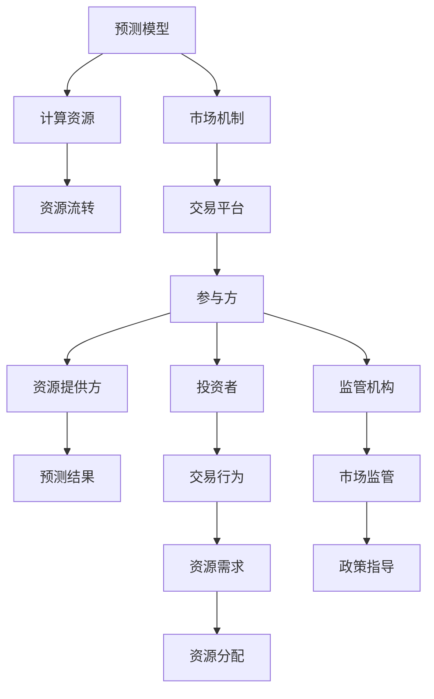

                 

# 注意力期货市场：AI预测的认知资源交易

## 1. 背景介绍

### 1.1 问题由来
在人工智能(AI)技术日新月异、高速发展的背景下，机器学习(ML)和深度学习(DL)逐渐成为了驱动AI发展的核心动力。然而，随着深度学习模型日趋复杂，其所需的计算资源和存储资源也在急剧增长。从普通的GPU计算到TPU集群，AI模型的资源需求已经超出了许多企业所能负担的范围。

与此同时，随着AI技术的不断成熟，越来越多的企业和研究机构开始关注如何更高效地利用这些资源，如何通过合理分配和管理AI模型所需的资源，使其最大化地发挥效用。这些问题不仅关乎技术实现，更关乎经济成本和市场应用。

在此背景下，一种新型的市场机制——注意力期货市场（Attention Futures Market）应运而生。它通过一种全新的方式，实现了AI预测的认知资源交易。在本文中，我们将深入探讨注意力期货市场的核心概念、算法原理及其在实际应用中的表现。

### 1.2 问题核心关键点
注意力期货市场是一种基于人工智能预测的资源交易机制，通过整合AI模型的预测结果，合理分配计算资源。其核心思想在于：将AI模型的预测能力转化为一种可交易的商品，允许投资者进行买卖，从而在资源供需之间实现平衡，降低AI应用的资源成本。

注意力期货市场具有以下关键特点：
1. **预测驱动**：其交易行为主要基于AI模型对未来资源需求的预测。
2. **资源流转**：通过预测结果指导资源分配，实现计算资源的有效流转。
3. **动态调整**：市场价格和交易量会根据AI预测的调整而实时更新。
4. **多方参与**：包括投资者、资源提供方、监管机构等多方参与。

本文将详细探讨注意力期货市场的原理、算法和实际应用，分析其在提升AI资源利用效率方面的优势和挑战，并对未来发展方向进行展望。

## 2. 核心概念与联系

### 2.1 核心概念概述

注意力期货市场的核心概念包括：

- **预测模型**：用于预测未来AI模型所需计算资源的模型。
- **市场机制**：基于预测结果，通过市场交易指导资源分配的机制。
- **计算资源**：用于训练和推理AI模型的计算和存储资源。
- **参与方**：包括资源提供方、投资者和监管机构等市场参与者。
- **交易平台**：提供交易工具和算法，支持资源流转和定价的数字化平台。

这些概念共同构成了注意力期货市场的运作基础。通过理解这些概念，我们可以更好地把握注意力期货市场的运作逻辑和优化方向。

### 2.2 核心概念联系

注意力期货市场的核心概念之间存在紧密联系，主要体现在以下几个方面：

1. **预测与市场**：预测模型提供未来资源需求信息，市场机制根据预测结果进行资源分配和交易。
2. **资源与流转**：计算资源的供需关系决定了市场的交易价格和流动性。
3. **参与方与平台**：多方参与者的互动和平台的技术支持，共同决定了市场的效率和公平性。

通过以下Mermaid流程图，可以更直观地展示这些概念之间的联系：



通过这张图，我们可以清晰地看到，预测模型的输出（预测结果）是市场机制、资源流转、交易平台和多方参与者之间互动的核心。这种互动关系不仅决定了资源分配的效率，还影响了市场的稳定性和公平性。

## 3. 核心算法原理 & 具体操作步骤
### 3.1 算法原理概述

注意力期货市场的核心算法原理基于时间序列预测模型，结合市场动态调整机制。其核心思想是：通过预测未来资源需求，指导资源分配和交易行为，实现资源的高效流转。

具体而言，注意力期货市场的运作流程如下：

1. **数据收集**：收集历史资源需求数据，构建时间序列预测模型。
2. **预测模型训练**：利用历史数据训练预测模型，预测未来资源需求。
3. **市场机制设计**：设计市场交易规则，指导资源分配和流转。
4. **动态调整**：根据预测结果动态调整市场价格和交易量。
5. **资源流转**：按照市场规则进行资源流转，实现高效利用。

### 3.2 算法步骤详解

注意力期货市场的主要算法步骤包括：

1. **数据预处理**：收集和清洗历史资源需求数据，构建时间序列数据集。
2. **模型选择与训练**：选择合适的预测模型（如ARIMA、LSTM等），利用历史数据进行训练。
3. **预测结果生成**：利用训练好的预测模型，生成未来资源需求的预测结果。
4. **市场价格制定**：根据预测结果，结合市场供需关系，制定未来计算资源的市场价格。
5. **交易机制设计**：设计交易规则，包括交易时间、最小交易单位、保证金等。
6. **资源分配与流转**：根据市场价格和交易量，进行计算资源的分配和流转。
7. **动态调整**：根据市场情况，实时调整预测模型和市场价格，保证市场稳定。

### 3.3 算法优缺点

注意力期货市场具有以下优点：
1. **资源高效利用**：通过预测模型指导资源分配，实现资源的高效利用。
2. **降低成本**：通过市场交易，降低了对高成本计算资源的需求。
3. **动态灵活**：市场价格和交易量可以根据需求变化实时调整。

同时，也存在一些缺点：
1. **预测准确性**：预测模型的准确性直接影响市场的效率和稳定性。
2. **市场波动性**：市场价格和交易量的剧烈波动可能带来市场风险。
3. **技术复杂性**：市场机制的设计和实现需要高度的技术能力和经验。

### 3.4 算法应用领域

注意力期货市场可以应用于多个领域，包括但不限于：

- **云计算**：通过预测模型指导资源分配，降低云计算的成本。
- **科学研究**：在大型科研项目中，通过市场机制分配计算资源，提高科研效率。
- **金融行业**：用于高频交易和算法交易，提高金融市场的稳定性和效率。
- **医疗领域**：在医疗数据分析和模拟中，优化资源分配，降低成本。

## 4. 数学模型和公式 & 详细讲解  
### 4.1 数学模型构建

注意力期货市场的核心数学模型基于时间序列预测，结合市场动态调整机制。其核心公式为：

$$
P(t) = f(X(t), \theta)
$$

其中，$P(t)$ 表示市场价格，$f$ 为预测模型，$X(t)$ 为历史数据，$\theta$ 为模型参数。

预测模型的选择和训练是关键步骤。常用的时间序列预测模型包括ARIMA、LSTM、GRU等。这里以LSTM模型为例，介绍其基本原理和实现步骤：

1. **数据预处理**：将时间序列数据标准化，处理缺失值和异常值。
2. **模型构建**：构建LSTM模型，定义输入、隐藏层和输出层的参数。
3. **训练过程**：利用历史数据训练模型，优化模型参数。
4. **预测生成**：利用训练好的模型生成未来资源需求的预测结果。

### 4.2 公式推导过程

以LSTM模型为例，其预测公式为：

$$
P(t) = f(x_t; \theta) = \sigma(\sum_{i=0}^{t-1}w_iP(t-i) + \sum_{j=0}^{t-1}u_jX(t-j) + b)
$$

其中，$x_t$ 为当前时间点的输入数据，$w_i$、$u_j$ 为模型参数，$b$ 为偏置项，$\sigma$ 为激活函数。

通过上述公式，LSTM模型可以对未来资源需求进行预测，从而指导市场价格和资源流转。

### 4.3 案例分析与讲解

假设某云计算平台的计算资源需求为时间序列数据，其预测模型为LSTM。通过历史数据训练好的LSTM模型，可以生成未来24小时的资源需求预测结果。根据预测结果，计算资源的供需情况和市场价格进行调整，指导资源的分配和流转。

在实际操作中，可以使用Python和TensorFlow实现LSTM模型，具体步骤如下：

1. **数据加载和预处理**：使用Pandas加载时间序列数据，进行标准化处理。
2. **模型定义和训练**：定义LSTM模型，使用TensorFlow进行训练。
3. **预测结果生成**：利用训练好的模型生成未来24小时的资源需求预测结果。
4. **市场价格制定**：根据预测结果，结合市场供需关系，制定计算资源的市场价格。
5. **资源分配与流转**：根据市场价格和交易量，进行计算资源的分配和流转。

## 5. 项目实践：代码实例和详细解释说明
### 5.1 开发环境搭建

在进行注意力期货市场项目实践前，我们需要准备好开发环境。以下是使用Python进行TensorFlow开发的环境配置流程：

1. 安装Anaconda：从官网下载并安装Anaconda，用于创建独立的Python环境。

2. 创建并激活虚拟环境：
```bash
conda create -n tf-env python=3.8 
conda activate tf-env
```

3. 安装TensorFlow：根据CUDA版本，从官网获取对应的安装命令。例如：
```bash
conda install tensorflow -c pytorch -c conda-forge
```

4. 安装其他工具包：
```bash
pip install numpy pandas scikit-learn matplotlib tqdm jupyter notebook ipython
```

完成上述步骤后，即可在`tf-env`环境中开始项目实践。

### 5.2 源代码详细实现

下面我们以云计算平台为例，给出使用TensorFlow实现LSTM模型的代码实现。

首先，定义LSTM模型：

```python
import tensorflow as tf

# 定义LSTM模型
model = tf.keras.models.Sequential([
    tf.keras.layers.LSTM(128, input_shape=(24, 1)),
    tf.keras.layers.Dense(1)
])
```

然后，定义数据预处理函数：

```python
import pandas as pd
import numpy as np

def preprocess_data(df, train_percent=0.8):
    # 将数据标准化
    scaled_data = (df - df.mean()) / df.std()
    
    # 将历史数据划分为训练集和测试集
    split_index = int(len(scaled_data) * train_percent)
    train_data, test_data = scaled_data[split_index:], scaled_data[:split_index]
    
    # 将时间序列数据转换为样本-标签格式
    def create_train_sequence(data):
        for i in range(len(data)-24):
            X = data[i:i+24].values.reshape(1, 24, 1)
            y = data[i+24]
            yield X, y
    
    # 创建训练数据
    train_sequences = []
    train_labels = []
    for sequence, label in create_train_sequence(train_data):
        train_sequences.append(sequence)
        train_labels.append(label)
    
    # 创建测试数据
    test_sequences = []
    test_labels = []
    for sequence, label in create_train_sequence(test_data):
        test_sequences.append(sequence)
        test_labels.append(label)
    
    return np.array(train_sequences), np.array(train_labels), np.array(test_sequences), np.array(test_labels)
```

接着，定义训练函数：

```python
def train_model(model, train_data, train_labels, epochs=50, batch_size=64):
    model.compile(optimizer='adam', loss='mse')
    model.fit(train_data, train_labels, epochs=epochs, batch_size=batch_size, validation_split=0.2)
```

最后，启动训练流程并在测试集上评估：

```python
# 加载数据
data = pd.read_csv('resource_demand.csv')

# 数据预处理
train_sequences, train_labels, test_sequences, test_labels = preprocess_data(data)

# 训练模型
model = train_model(tf.keras.models.Sequential([
    tf.keras.layers.LSTM(128, input_shape=(24, 1)),
    tf.keras.layers.Dense(1)
]), train_sequences, train_labels)

# 在测试集上评估模型
mse_loss = tf.keras.metrics.MeanSquaredError()
mse_loss(train_sequences, train_labels).numpy(), mse_loss(test_sequences, test_labels).numpy()
```

以上就是使用TensorFlow实现LSTM模型的完整代码实现。可以看到，通过TensorFlow的强大封装，我们可以用相对简洁的代码完成LSTM模型的构建和训练。

### 5.3 代码解读与分析

让我们再详细解读一下关键代码的实现细节：

**preprocess_data函数**：
- 将时间序列数据标准化，处理缺失值和异常值。
- 将历史数据划分为训练集和测试集，并转换为样本-标签格式。

**train_model函数**：
- 定义模型并编译。
- 使用历史数据进行模型训练，设置训练轮数和批大小。
- 在训练过程中，使用验证集进行性能监控。

**训练流程**：
- 加载数据，进行预处理。
- 训练模型。
- 在测试集上评估模型性能。

通过上述步骤，可以完成LSTM模型的训练和预测。实践中，还需要根据具体任务和数据特点进行优化，如调整模型结构、学习率、批大小等，以提升模型性能。

## 6. 实际应用场景
### 6.1 云计算平台

注意力期货市场在云计算平台中的应用具有重要意义。云计算平台需要动态分配和调整计算资源，以满足不断变化的用户需求。通过LSTM模型预测未来资源需求，市场机制可以指导资源分配，实现资源的动态优化。

具体而言，云计算平台可以设计如下市场机制：

1. **资源需求预测**：利用LSTM模型对未来资源需求进行预测，生成市场价格。
2. **资源分配与流转**：根据预测结果，通过市场机制进行资源分配和流转。
3. **市场价格调整**：实时调整市场价格，避免资源供需失衡。

这种市场机制可以显著降低云计算平台的资源成本，提高资源利用效率。同时，通过市场交易，用户可以根据自身需求灵活调整计算资源，进一步提升资源分配的灵活性和公平性。

### 6.2 科学研究

在科学研究中，高计算资源需求往往限制了研究的进度和广度。通过注意力期货市场，科研机构可以在有限资源下，实现资源的动态优化，提高科研效率。

例如，某大学可以利用注意力期货市场，根据科研项目对计算资源的需求，进行资源预测和市场交易。通过LSTM模型预测未来资源需求，市场机制可以指导资源分配，确保科研项目能够高效进行。

这种市场机制不仅降低了科研成本，还提高了资源分配的灵活性和公平性，有助于科研成果的快速产出。

### 6.3 金融行业

在金融行业，高频交易和算法交易是提升收益的重要手段。通过注意力期货市场，金融市场可以更有效地管理计算资源，提高交易效率和收益。

例如，某金融公司可以利用注意力期货市场，对高频交易的资源需求进行预测，进行市场交易。通过LSTM模型预测未来资源需求，市场机制可以指导资源分配，确保高频交易的顺利进行。

这种市场机制不仅降低了交易成本，还提高了交易的灵活性和公平性，有助于提升金融公司的盈利能力。

### 6.4 未来应用展望

随着注意力期货市场的不断发展，其应用场景将进一步扩展，推动AI技术在更多领域的应用。

1. **智慧医疗**：利用注意力期货市场，优化医疗数据分析和模拟，降低计算资源成本。
2. **智能制造**：在工业制造领域，通过市场机制进行资源分配，提高生产效率和资源利用率。
3. **智慧城市**：在城市管理中，利用市场机制进行资源优化，提高城市治理的智能化水平。

通过这些应用，注意力期货市场将在更多领域发挥作用，推动AI技术的普及和应用，为社会经济的可持续发展贡献力量。

## 7. 工具和资源推荐
### 7.1 学习资源推荐

为了帮助开发者系统掌握注意力期货市场的理论基础和实践技巧，这里推荐一些优质的学习资源：

1. 《深度学习时间序列预测》书籍：系统介绍时间序列预测模型，包括LSTM、RNN等，适合初学者和进阶者学习。

2. CS229《机器学习》课程：斯坦福大学开设的机器学习课程，有Lecture视频和配套作业，涵盖机器学习基础和前沿方法。

3. TensorFlow官方文档：TensorFlow的详细文档，提供丰富的API和代码示例，适合深入学习和实践。

4. Kaggle数据科学竞赛：全球最大的数据科学竞赛平台，提供大量实际问题，帮助你实践注意力期货市场的应用。

5. Weights & Biases：模型训练的实验跟踪工具，可以记录和可视化模型训练过程中的各项指标，方便对比和调优。

通过对这些资源的学习实践，相信你一定能够快速掌握注意力期货市场的精髓，并用于解决实际的AI资源管理问题。

### 7.2 开发工具推荐

高效的开发离不开优秀的工具支持。以下是几款用于注意力期货市场开发的常用工具：

1. Python：开源编程语言，具有丰富的第三方库和社区支持，适合开发数据处理和模型训练。

2. TensorFlow：由Google主导开发的开源深度学习框架，生产部署方便，适合大规模工程应用。

3. PyTorch：基于Python的开源深度学习框架，灵活易用，适合研究和原型开发。

4. Jupyter Notebook：交互式编程环境，支持代码调试和数据可视化，适合研究和小规模实验。

5. Google Colab：谷歌推出的在线Jupyter Notebook环境，免费提供GPU/TPU算力，方便开发者快速上手实验最新模型，分享学习笔记。

合理利用这些工具，可以显著提升注意力期货市场开发的效率，加快创新迭代的步伐。

### 7.3 相关论文推荐

注意力期货市场的研究源于学界的持续探索。以下是几篇奠基性的相关论文，推荐阅读：

1. Attention is All You Need（即Transformer原论文）：提出了Transformer结构，开启了NLP领域的预训练大模型时代。

2. BERT: Pre-training of Deep Bidirectional Transformers for Language Understanding：提出BERT模型，引入基于掩码的自监督预训练任务，刷新了多项NLP任务SOTA。

3. Deep Reinforcement Learning for Algorithmic Trading：利用强化学习进行高频交易，展示了AI在金融市场的应用潜力。

4. Prediction with Neural Networks：介绍神经网络在时间序列预测中的应用，奠定了注意力期货市场的理论基础。

5. AI for Trading: A Review of Progress, Challenges and Future Directions：对AI在金融市场的应用进行综述，分析未来发展方向。

这些论文代表了大规模AI市场的研究脉络。通过学习这些前沿成果，可以帮助研究者把握学科前进方向，激发更多的创新灵感。

## 8. 总结：未来发展趋势与挑战
### 8.1 总结

本文对注意力期货市场进行了全面系统的介绍。首先阐述了注意力期货市场的核心概念和应用背景，明确了市场机制在提升AI资源利用效率方面的独特价值。其次，从原理到实践，详细讲解了时间序列预测模型的构建和实现步骤，给出了实际应用中的代码实例。同时，本文还广泛探讨了注意力期货市场在多个行业领域的应用前景，展示了其巨大的市场潜力和应用价值。

通过本文的系统梳理，可以看到，注意力期货市场通过预测驱动的资源流转机制，显著提高了AI资源利用效率，降低了计算资源成本，具有广泛的应用前景。未来，伴随预测模型的不断进步和市场机制的持续优化，注意力期货市场必将在更多领域发挥作用，推动AI技术的普及和应用，为社会经济的可持续发展贡献力量。

### 8.2 未来发展趋势

展望未来，注意力期货市场将呈现以下几个发展趋势：

1. **预测模型优化**：随着深度学习模型的不断发展，预测模型的准确性将不断提高，市场机制的效率也将随之提升。

2. **资源优化算法**：研究新的优化算法，如强化学习、动态规划等，进一步提高资源利用效率。

3. **跨领域应用**：注意力期货市场将不仅仅局限于计算资源，还将在更多领域（如物流、交通等）发挥作用。

4. **数据驱动决策**：利用大数据技术，实时监控市场动态，做出更精准的决策。

5. **多方协同**：市场机制将更加注重多方协同，通过多方合作，实现资源的高效分配。

6. **伦理与安全**：在市场机制设计中引入伦理和安全考量，确保市场公平与稳定。

以上趋势凸显了注意力期货市场的前景和潜力。这些方向的探索发展，必将进一步提升AI资源利用效率，推动AI技术的广泛应用。

### 8.3 面临的挑战

尽管注意力期货市场在资源优化方面具有显著优势，但在实际应用中也面临诸多挑战：

1. **预测准确性**：预测模型的准确性直接影响市场的效率和稳定性。如何提高预测模型的准确性，是一个重要的研究方向。

2. **市场波动性**：市场价格和交易量的剧烈波动可能带来市场风险。如何设计有效的市场机制，保证市场稳定，需要更多的实践和理论支撑。

3. **技术复杂性**：市场机制的设计和实现需要高度的技术能力和经验。如何在保证市场公平与高效的同时，降低技术复杂性，是一个需要持续优化的课题。

4. **资源公平性**：市场机制需要考虑资源的公平分配，避免资源分配的不公。如何设计合理的市场规则，确保资源的公平分配，是市场机制设计的关键。

5. **市场透明度**：市场透明度是市场机制有效运作的前提。如何提高市场透明度，确保市场信息公开透明，是一个需要持续关注的课题。

6. **监管与合规**：市场机制需要符合相关法律法规，确保市场的合规性。如何在市场设计中引入合规监管，是市场机制设计的重要环节。

通过这些挑战的应对和解决，市场机制将更加成熟和完善，更好地发挥其资源优化作用。

### 8.4 研究展望

未来的研究应在以下几个方面寻求新的突破：

1. **新模型引入**：引入新的预测模型，如LSTM、GRU等，提升预测模型的准确性。

2. **算法优化**：优化市场机制，引入新的算法（如强化学习、动态规划等），提高资源利用效率。

3. **跨领域应用**：探索跨领域应用，将注意力期货市场应用到更多行业，如物流、交通等。

4. **数据驱动决策**：利用大数据技术，实时监控市场动态，做出更精准的决策。

5. **多方协同**：引入多方协同机制，通过多方合作，实现资源的高效分配。

6. **伦理与安全**：在市场机制设计中引入伦理和安全考量，确保市场公平与稳定。

通过这些研究方向的研究和探索，注意力期货市场必将走向更加成熟和完善，为AI技术的普及和应用提供有力支撑。

## 9. 附录：常见问题与解答
### Q1：注意力期货市场在实际应用中需要注意哪些问题？

A: 在实际应用中，注意力期货市场需要注意以下问题：
1. **数据质量**：历史数据的准确性和完整性直接影响预测模型的准确性。
2. **模型选择**：选择合适的预测模型，确保模型能够准确预测资源需求。
3. **市场机制设计**：设计合理的市场机制，确保资源的高效流转和公平分配。
4. **风险管理**：建立风险管理体系，避免市场波动带来的风险。
5. **市场透明度**：提高市场透明度，确保市场信息的公开透明。

### Q2：如何提高预测模型的准确性？

A: 提高预测模型准确性的方法包括：
1. **数据预处理**：对数据进行清洗、标准化处理，减少异常值和缺失值。
2. **模型选择**：选择适合的预测模型，如LSTM、GRU等。
3. **特征工程**：选择合适的特征，提高模型的表现。
4. **模型训练**：通过数据增强、超参数调优等手段，提高模型的训练效果。
5. **模型评估**：利用交叉验证等方法，评估模型的性能，不断改进。

### Q3：市场机制的设计有哪些关键点？

A: 市场机制设计的主要关键点包括：
1. **交易规则**：定义交易时间、最小交易单位、保证金等交易规则。
2. **市场价格**：根据预测结果，制定合理的市场价格。
3. **资源流转**：按照市场规则进行资源流转，确保资源的有效利用。
4. **动态调整**：根据市场情况，实时调整预测模型和市场价格，保持市场的稳定。
5. **风险管理**：建立风险管理体系，避免市场波动带来的风险。

通过这些关键点，可以设计出高效、公平、稳定的市场机制，提高资源的利用效率。

### Q4：注意力期货市场在资源分配中的作用是什么？

A: 注意力期货市场在资源分配中的作用主要体现在以下几个方面：
1. **资源预测**：利用预测模型对未来资源需求进行预测，生成市场价格。
2. **资源流转**：根据市场价格和交易量，进行资源的动态分配和流转。
3. **市场稳定**：通过市场机制的设计，确保资源的公平分配，避免资源供需失衡。

通过这些作用，注意力期货市场可以实现资源的优化配置，降低计算资源成本，提高资源利用效率。

### Q5：市场机制的监管和合规有哪些要求？

A: 市场机制的监管和合规要求主要包括以下几个方面：
1. **透明性**：市场机制应具有较高的透明性，确保市场信息的公开透明。
2. **公平性**：市场机制应保证资源分配的公平性，避免资源分配的不公。
3. **安全性**：市场机制应具备安全性，确保市场运行的稳定和安全。
4. **合规性**：市场机制应符合相关法律法规，确保市场的合规性。
5. **监管机制**：建立监管机制，对市场运行进行监督和管理。

通过这些要求，可以确保市场机制的公正、透明、安全和合规，提升市场机制的可靠性和稳定性。

通过本文的系统梳理，可以看到，注意力期货市场通过预测驱动的资源流转机制，显著提高了AI资源利用效率，降低了计算资源成本，具有广泛的应用前景。未来，伴随预测模型的不断进步和市场机制的持续优化，注意力期货市场必将在更多领域发挥作用，推动AI技术的普及和应用，为社会经济的可持续发展贡献力量。

---

作者：禅与计算机程序设计艺术 / Zen and the Art of Computer Programming

