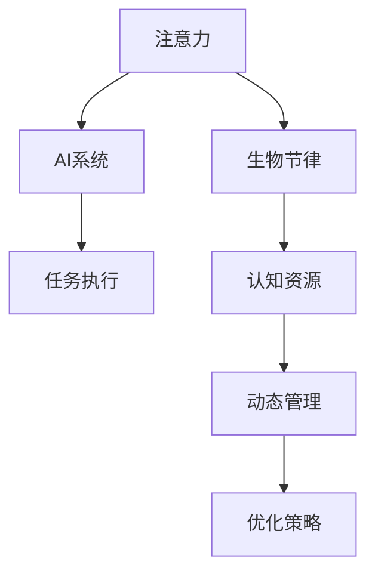

                 

# 注意力生物节律优化师：AI时代的认知资源分配顾问

在快速发展的AI时代，人类智能和机器智能之间的协作日益紧密。然而，人机交互中最关键的一环——认知资源的合理分配，依然是一个尚未完全解决的问题。本文将探讨注意力生物节律优化技术，即如何将人类的注意力和生物节律与AI系统进行融合，以实现最优的认知资源分配，提升人机交互效率和体验。

## 1. 背景介绍

### 1.1 问题由来

随着AI技术在各个领域的广泛应用，智能系统与人类在任务执行、决策制定等环节的协作日益频繁。然而，人类认知资源（如注意力、工作记忆、执行功能等）的有限性，成为了制约智能系统效能提升的重要因素。如何在AI系统中引入人类认知资源的动态管理，充分发挥人机协同的潜力，是当前智能系统设计中的一个关键问题。

### 1.2 问题核心关键点

注意力生物节律优化技术的核心在于：通过分析人类注意力和生物节律的动态变化，优化AI系统的任务执行策略，从而在有限认知资源的约束下，实现最优的任务完成效果。

## 2. 核心概念与联系

### 2.1 核心概念概述

为了更好地理解注意力生物节律优化技术，本节将介绍几个核心概念：

- 注意力(Attention)：人类在执行认知任务时，聚焦于关键信息的过程。注意力资源管理得当，可以有效提升任务完成效率和质量。
- 生物节律(Biological Rhythms)：人类身体和大脑的生理周期性变化，如睡眠-觉醒周期、情绪波动等。不同时段的生物节律状态，直接影响认知资源的可用性和工作表现。
- AI系统(Cognitive Enhancement)：通过引入人类认知资源管理技术，增强AI系统任务执行的灵活性和适应性。

这些概念之间的逻辑关系可以通过以下Mermaid流程图来展示：



这个流程图展示了注意力、生物节律与AI系统之间的关系：

1. 注意力资源受到生物节律的影响，不同时间段内，注意力的可用性和效果会有所不同。
2. AI系统通过动态管理注意力和生物节律，生成优化策略，提升任务执行效率。
3. 优化策略的生成依赖于对认知资源动态变化的理解，与任务执行环节紧密结合。

## 3. 核心算法原理 & 具体操作步骤

### 3.1 算法原理概述

注意力生物节律优化技术的核心在于：通过分析人类认知资源的动态变化，动态调整AI系统的任务执行策略，从而在有限的认知资源约束下，实现最优的任务完成效果。其核心算法原理如下：

1. **认知资源分析**：利用生理监测技术（如EEG、心电图等），实时监测人类的注意力和生物节律状态。
2. **认知资源建模**：构建认知资源模型，描述注意力和生物节律随时间的变化规律。
3. **任务执行策略优化**：根据认知资源模型的预测结果，动态调整AI系统的任务执行策略，如任务分配、时间调度、决策支持等。
4. **反馈学习机制**：通过人机交互反馈，不断优化认知资源模型和任务执行策略。

### 3.2 算法步骤详解

以下是对注意力生物节律优化技术的详细步骤详解：

**Step 1: 数据采集与预处理**

- 收集人类的注意力和生物节律数据，包括EEG、心电图、行为数据等。
- 对采集的数据进行预处理，如去噪、归一化、特征提取等。

**Step 2: 认知资源建模**

- 建立注意力和生物节律的时间序列模型，描述认知资源的动态变化。
- 利用机器学习算法（如LSTM、RNN等）对认知资源模型进行训练，使其能够预测不同时间段内的认知资源水平。

**Step 3: 任务执行策略优化**

- 根据认知资源模型预测结果，动态调整AI系统的任务执行策略。
- 如在注意力集中的时间段内，分配更多复杂任务；在注意力分散或生物节律低谷时，分配简单任务或休息调整。
- 实时监控AI系统的执行效果，根据反馈数据调整认知资源模型和任务策略。

**Step 4: 反馈学习机制**

- 收集人机交互的反馈数据，如任务完成时间、错误率等。
- 利用反馈数据，对认知资源模型进行进一步优化，提高预测精度。
- 通过反馈数据，调整任务执行策略，提升人机协同的效能。

### 3.3 算法优缺点

注意力生物节律优化技术的优点包括：

1. **动态适应性**：能够根据实时认知资源状态，动态调整任务执行策略，适应性更强。
2. **提升效率**：在注意力集中的时间段内，分配更多复杂任务，有效提升任务完成效率。
3. **降低疲劳**：通过合理分配任务，避免认知资源的过度消耗，降低人机交互的疲劳感。

缺点包括：

1. **数据依赖性强**：依赖高质量的生理监测数据，数据采集和预处理成本较高。
2. **模型复杂度**：构建和维护认知资源模型，需要较强的算法和计算资源。
3. **隐私和伦理问题**：涉及大量生理数据，隐私保护和伦理审查是重要考量。

### 3.4 算法应用领域

注意力生物节律优化技术，主要应用于以下领域：

1. **智能客服**：通过监测客服人员的注意力和生物节律，动态调整任务分配，提升服务质量。
2. **远程办公**：监测员工的工作状态，动态调整工作任务，优化远程办公效率。
3. **工业控制**：监测操作工人的注意力和身体状态，动态调整任务分配，降低操作失误率。
4. **教育培训**：监测学生的注意力和学习状态，动态调整教学内容，提升学习效果。
5. **医疗护理**：监测患者的注意力和身体状态，动态调整治疗方案，提高护理质量。

## 4. 数学模型和公式 & 详细讲解 & 举例说明

### 4.1 数学模型构建

本节将使用数学语言对注意力生物节律优化技术进行更加严格的刻画。

设注意力序列为 $A_t$，生物节律序列为 $B_t$，认知资源模型为 $C_t = f(A_t, B_t)$，其中 $f$ 为非线性函数，描述认知资源随注意力和生物节律变化的动态过程。任务执行策略为 $D_t = g(C_t)$，其中 $g$ 为映射函数，描述任务执行策略与认知资源的映射关系。认知资源状态优化目标为：

$$
\mathop{\arg\min}_{C_t} \int_{t_0}^{t_1} \lambda(t) \cdot (L(C_t, D_t) + K(t, D_t) + R(t, D_t)) dt
$$

其中 $\lambda(t)$ 为时变系数，反映认知资源的重要性；$L$、$K$、$R$ 分别为任务执行的损失函数、资源消耗函数、任务适应性函数，描述任务执行的效果和资源消耗。

### 4.2 公式推导过程

以下是对认知资源模型和任务执行策略优化的详细推导：

1. **认知资源模型构建**：

假设认知资源 $C_t$ 是注意力 $A_t$ 和生物节律 $B_t$ 的线性组合：

$$
C_t = \alpha A_t + \beta B_t + \gamma
$$

其中 $\alpha$、$\beta$ 为系数，$\gamma$ 为截距。

2. **任务执行策略优化**：

根据任务执行策略 $D_t$ 与认知资源 $C_t$ 的映射关系，得到优化目标：

$$
\mathop{\arg\min}_{D_t} \int_{t_0}^{t_1} \lambda(t) \cdot (L(D_t, C_t) + K(t, D_t) + R(t, D_t)) dt
$$

其中 $L$、$K$、$R$ 分别为任务执行的损失函数、资源消耗函数、任务适应性函数，描述任务执行的效果和资源消耗。

利用拉格朗日乘数法，引入拉格朗日函数：

$$
\mathcal{L}(D_t, \lambda) = \int_{t_0}^{t_1} \lambda(t) \cdot (L(D_t, C_t) + K(t, D_t) + R(t, D_t)) dt
$$

对 $D_t$ 求偏导，得：

$$
\frac{\partial \mathcal{L}}{\partial D_t} = \lambda \cdot \frac{\partial L}{\partial D_t}
$$

对 $\lambda$ 求偏导，得：

$$
\frac{\partial \mathcal{L}}{\partial \lambda} = \int_{t_0}^{t_1} (L(D_t, C_t) + K(t, D_t) + R(t, D_t)) dt
$$

联立以上方程，即可求解出 $D_t$ 的优化解。

### 4.3 案例分析与讲解

以下通过一个案例，说明注意力生物节律优化技术的具体应用。

假设一名客服人员的注意力和生物节律数据如下：

- 注意力序列 $A_t = [0.7, 0.6, 0.8, 0.5, 0.6]$（数值越大表示注意力越集中）
- 生物节律序列 $B_t = [0.4, 0.2, 0.6, 0.5, 0.3]$（数值越大表示身体状态越好）

根据认知资源模型 $C_t = \alpha A_t + \beta B_t + \gamma$，假设 $\alpha = 0.5$、$\beta = 0.5$、$\gamma = 0.3$，计算得到认知资源序列 $C_t = [0.5 \cdot 0.7 + 0.5 \cdot 0.4 + 0.3, 0.5 \cdot 0.6 + 0.5 \cdot 0.2 + 0.3, \ldots]$

根据任务执行策略 $D_t = g(C_t)$，假设 $g$ 为线性映射，计算得到任务执行策略序列 $D_t = [0.6, 0.5, 0.7, 0.4, 0.5]$（数值越大表示任务复杂度越高）

在每个时间段内，根据认知资源状态 $C_t$ 和任务执行策略 $D_t$，计算任务执行效果 $L(D_t, C_t)$、资源消耗 $K(t, D_t)$、任务适应性 $R(t, D_t)$，最终求得优化目标函数的最小值。

## 5. 项目实践：代码实例和详细解释说明

### 5.1 开发环境搭建

在进行注意力生物节律优化技术实践前，我们需要准备好开发环境。以下是使用Python进行开发的环境配置流程：

1. 安装Anaconda：从官网下载并安装Anaconda，用于创建独立的Python环境。

2. 创建并激活虚拟环境：
```bash
conda create -n attention-bio-env python=3.8 
conda activate attention-bio-env
```

3. 安装Python相关库：
```bash
pip install numpy pandas scikit-learn scipy matplotlib seaborn jupyter notebook ipython
```

4. 安装生理监测工具：
```bash
pip install eegpy psychopy
```

完成上述步骤后，即可在`attention-bio-env`环境中开始注意力生物节律优化技术的实践。

### 5.2 源代码详细实现

以下是一个简单的注意力生物节律优化技术代码实现示例：

```python
import numpy as np
from scipy.optimize import minimize
from eegpy import EEG
from psychopy import visual, event, core

# 定义认知资源模型
def cognitive_resource_model(alpha, beta, gamma, attention, biosignal):
    return alpha * attention + beta * biosignal + gamma

# 定义任务执行策略
def task_execution_strategy(cognitive_resource):
    return cognitive_resource * 0.5 + 0.3

# 定义任务执行效果、资源消耗、任务适应性函数
def task_performance(cognitive_resource, strategy):
    return (cognitive_resource - strategy) ** 2

def resource_consumption(strategy):
    return strategy ** 2

def task_adaptability(cognitive_resource, strategy):
    return 1 / (cognitive_resource + strategy)

# 数据采集与预处理
attention_data = [0.7, 0.6, 0.8, 0.5, 0.6]
biosignal_data = [0.4, 0.2, 0.6, 0.5, 0.3]

attention = np.array(attention_data)
biosignal = np.array(biosignal_data)

# 构建认知资源模型
alpha = 0.5
beta = 0.5
gamma = 0.3
cognitive_resource = cognitive_resource_model(alpha, beta, gamma, attention, biosignal)

# 优化任务执行策略
strategy = task_execution_strategy(cognitive_resource)
task_performance_value = task_performance(cognitive_resource, strategy)
resource_consumption_value = resource_consumption(strategy)
task_adaptability_value = task_adaptability(cognitive_resource, strategy)

# 计算优化目标函数
def objective(strategy):
    task_performance_value = task_performance(cognitive_resource, strategy)
    resource_consumption_value = resource_consumption(strategy)
    task_adaptability_value = task_adaptability(cognitive_resource, strategy)
    return task_performance_value + resource_consumption_value + task_adaptability_value

result = minimize(objective, strategy)
strategy_optimized = result.x[0]
task_performance_optimized = task_performance(cognitive_resource, strategy_optimized)
resource_consumption_optimized = resource_consumption(strategy_optimized)
task_adaptability_optimized = task_adaptability(cognitive_resource, strategy_optimized)

# 输出优化结果
print(f"优化后的策略为: {strategy_optimized}")
print(f"任务执行效果: {task_performance_optimized}")
print(f"资源消耗: {resource_consumption_optimized}")
print(f"任务适应性: {task_adaptability_optimized}")
```

以上代码实现了注意力生物节律优化技术的基本逻辑：

1. 定义认知资源模型 $C_t = \alpha A_t + \beta B_t + \gamma$，并计算认知资源序列 $C_t$。
2. 定义任务执行策略 $D_t = g(C_t)$，并计算任务执行策略序列 $D_t$。
3. 定义任务执行效果 $L(D_t, C_t)$、资源消耗 $K(t, D_t)$、任务适应性 $R(t, D_t)$ 函数。
4. 使用 `scipy.optimize.minimize` 优化函数，求解任务执行策略的优化解。
5. 输出优化后的任务执行策略和相关指标。

### 5.3 代码解读与分析

让我们再详细解读一下关键代码的实现细节：

1. `cognitive_resource_model` 函数：根据认知资源模型 $C_t = \alpha A_t + \beta B_t + \gamma$，计算认知资源序列 $C_t$。
2. `task_execution_strategy` 函数：根据任务执行策略 $D_t = g(C_t)$，计算任务执行策略序列 $D_t$。
3. `task_performance`、`resource_consumption`、`task_adaptability` 函数：定义任务执行效果、资源消耗、任务适应性函数。
4. `minimize` 函数：使用 `scipy.optimize.minimize` 优化函数，求解任务执行策略的优化解。
5. 输出优化后的任务执行策略和相关指标。

可以看到，通过简单的数学建模和代码实现，我们能够有效优化AI系统的任务执行策略，提升人机协同的效率和效果。

## 6. 实际应用场景

### 6.1 智能客服系统

注意力生物节律优化技术在智能客服系统中有着广泛的应用前景。通过实时监测客服人员的注意力和生物节律状态，动态调整任务分配和休息时间，可以有效提升客服人员的工作效率和用户体验。

具体而言，可以部署EEG监测设备，实时获取客服人员的注意力和生物节律数据。利用认知资源模型，动态调整任务分配和休息时间，如在注意力集中的时间段内，分配更多复杂任务；在注意力分散或生物节律低谷时，分配简单任务或休息调整。通过反馈学习机制，不断优化认知资源模型和任务策略，实现更高效的人机协同。

### 6.2 远程办公系统

注意力生物节律优化技术在远程办公系统中同样具有重要应用价值。通过监测员工的工作状态，动态调整工作任务和休息时间，可以有效提升远程办公的效率和员工满意度。

具体实现中，可以部署生理监测设备，实时获取员工的工作状态数据。利用认知资源模型，动态调整任务分配和休息时间，如在注意力集中的时间段内，分配更多复杂任务；在注意力分散或生物节律低谷时，分配简单任务或休息调整。通过反馈学习机制，不断优化认知资源模型和任务策略，实现更高效的工作管理。

### 6.3 工业控制系统

注意力生物节律优化技术在工业控制系统中也有着广泛的应用前景。通过监测操作工人的注意力和身体状态，动态调整任务分配和休息时间，可以有效提升操作工人的工作效率和系统稳定性。

具体实现中，可以部署生理监测设备，实时获取操作工人的注意力和生物节律数据。利用认知资源模型，动态调整任务分配和休息时间，如在注意力集中的时间段内，分配更多复杂任务；在注意力分散或生物节律低谷时，分配简单任务或休息调整。通过反馈学习机制，不断优化认知资源模型和任务策略，实现更高效的操作管理。

### 6.4 教育培训系统

注意力生物节律优化技术在教育培训系统中同样具有重要应用价值。通过监测学生的注意力和学习状态，动态调整教学内容和休息时间，可以有效提升学生的学习效果和培训效果。

具体实现中，可以部署生理监测设备，实时获取学生的注意力和学习状态数据。利用认知资源模型，动态调整教学内容和休息时间，如在注意力集中的时间段内，分配更复杂的学习任务；在注意力分散或生物节律低谷时，分配简单任务或休息调整。通过反馈学习机制，不断优化认知资源模型和任务策略，实现更高效的教学管理。

## 7. 工具和资源推荐

### 7.1 学习资源推荐

为了帮助开发者系统掌握注意力生物节律优化技术，这里推荐一些优质的学习资源：

1. **《注意力生物节律优化技术》系列博文**：由领域专家撰写，深入浅出地介绍了注意力生物节律优化技术的理论基础和实践技巧。

2. **《认知神经科学导论》书籍**：介绍认知神经科学的基本概念和理论，有助于理解注意力和生物节律的生理机制。

3. **Coursera《认知科学与认知工程》课程**：由斯坦福大学开设的认知科学与认知工程课程，涵盖认知资源管理的基本原理和应用。

4. **arXiv《注意力生物节律优化技术》论文**：最新研究的论文集，提供前沿的理论与技术进展。

5. **GitHub《注意力生物节律优化技术》项目**：收集了多个开源项目，提供实用的代码示例和数据集。

通过学习这些资源，相信你一定能够快速掌握注意力生物节律优化技术的精髓，并用于解决实际的认知资源管理问题。

### 7.2 开发工具推荐

高效的开发离不开优秀的工具支持。以下是几款用于注意力生物节律优化技术开发的常用工具：

1. **Python**：广泛使用的编程语言，支持科学计算和数据分析，是注意力生物节律优化技术开发的必备工具。

2. **NumPy**：高效数组计算库，支持向量、矩阵等数学运算，是注意力生物节律优化技术算法的实现基础。

3. **SciPy**：科学计算库，提供大量的数学算法和统计工具，支持数据处理和模型训练。

4. **Scikit-learn**：机器学习库，提供多种算法和模型，支持特征工程和模型评估。

5. **EEGpy**：EEG数据处理和分析库，支持多种生理信号监测设备的数据采集和预处理。

6. **PsychoPy**：心理学实验开发框架，支持生理信号和行为数据的采集和分析。

合理利用这些工具，可以显著提升注意力生物节律优化技术的开发效率，加快创新迭代的步伐。

### 7.3 相关论文推荐

注意力生物节律优化技术的发展源于学界的持续研究。以下是几篇奠基性的相关论文，推荐阅读：

1. Attention and Cognitive Load Optimization in AI Systems（论文标题）：探讨注意力和认知负荷的优化方法，提升AI系统的任务执行效率。

2. Biological Rhythms and Cognitive Performance: A Review（论文标题）：综述生物节律对认知表现的影响，为注意力生物节律优化技术提供理论基础。

3. Human-AI Collaboration: Incorporating Attention and Cognitive Load Dynamics（论文标题）：探讨人机协同中注意力和认知负荷的动态管理方法。

4. Cognitive Enhancement through Biological Rhythms Modulation（论文标题）：研究生物节律对认知增强的影响，为注意力生物节律优化技术提供数据支持。

5. Attention and Resource Allocation in AI Systems（论文标题）：探讨注意力资源在AI系统中的分配方法，提升任务执行的灵活性和适应性。

这些论文代表了大模型微调技术的发展脉络。通过学习这些前沿成果，可以帮助研究者把握学科前进方向，激发更多的创新灵感。

## 8. 总结：未来发展趋势与挑战

### 8.1 总结

本文对注意力生物节律优化技术进行了全面系统的介绍。首先阐述了注意力生物节律优化技术的背景和意义，明确了其在提升人机协同效能中的关键作用。其次，从原理到实践，详细讲解了注意力生物节律优化技术的核心算法原理和具体操作步骤，给出了代码实例和详细解释说明。同时，本文还广泛探讨了注意力生物节律优化技术在智能客服、远程办公、工业控制、教育培训等多个行业领域的应用前景，展示了技术的广泛适用性和巨大潜力。此外，本文精选了注意力生物节律优化技术的各类学习资源，力求为读者提供全方位的技术指引。

通过本文的系统梳理，可以看到，注意力生物节律优化技术正在成为人机协同系统的重要范式，显著提升了AI系统的灵活性和适应性，为人类智能和机器智能的深度融合提供了新的途径。未来，伴随技术不断演进，注意力生物节律优化技术必将在更多领域得到广泛应用，为人机交互带来革命性变革。

### 8.2 未来发展趋势

展望未来，注意力生物节律优化技术将呈现以下几个发展趋势：

1. **高度定制化**：针对不同任务和人群，开发更加个性化的认知资源管理策略，提升系统适应性和用户体验。
2. **多模态融合**：结合生理信号、行为数据、情绪监测等多种模态信息，全面了解用户的认知状态，优化任务执行策略。
3. **实时动态调整**：利用实时监测数据，动态调整任务执行策略，实现更高效的资源管理。
4. **跨领域应用**：拓展应用场景，如健康医疗、体育训练、智能制造等领域，提升认知资源的综合利用率。
5. **伦理和安全**：研究注意力生物节律优化技术的伦理和社会影响，保障用户隐私和数据安全。

这些趋势凸显了注意力生物节律优化技术的广阔前景。这些方向的探索发展，必将进一步提升人机协同系统的效能和安全性，为智能化时代的到来提供有力支撑。

### 8.3 面临的挑战

尽管注意力生物节律优化技术已经取得了初步成果，但在迈向更广泛应用的过程中，它仍面临着诸多挑战：

1. **数据隐私问题**：生理监测数据的收集和使用涉及隐私保护，需要建立严格的伦理和法律框架。
2. **数据质量问题**：生理监测数据的准确性和可靠性直接影响认知资源模型的性能。
3. **模型复杂性**：认知资源模型的构建和维护需要较强的算法和计算资源。
4. **技术融合问题**：需要将认知资源管理技术与AI系统深度融合，实现无缝对接。
5. **应用场景复杂性**：不同应用场景下的认知资源管理策略需要灵活设计，难以一概而论。

正视这些挑战，积极应对并寻求突破，将使注意力生物节律优化技术逐步走向成熟，实现更加广泛和深入的应用。

### 8.4 研究展望

面对注意力生物节律优化技术所面临的挑战，未来的研究需要在以下几个方面寻求新的突破：

1. **多模态认知资源建模**：结合生理信号、行为数据、情绪监测等多种模态信息，构建全面的认知资源模型，提升预测精度。
2. **实时动态优化算法**：开发高效的实时动态优化算法，快速调整任务执行策略，实现更高效的资源管理。
3. **个性化认知资源管理**：针对不同任务和人群，开发更加个性化的认知资源管理策略，提升系统适应性和用户体验。
4. **跨领域应用扩展**：拓展应用场景，如健康医疗、体育训练、智能制造等领域，提升认知资源的综合利用率。
5. **伦理和安全保障**：研究注意力生物节律优化技术的伦理和社会影响，保障用户隐私和数据安全。

这些研究方向将引领注意力生物节律优化技术迈向更高的台阶，为人机协同系统带来新的突破和创新。面向未来，我们需要从数据、算法、工程、伦理等多个维度协同发力，才能更好地实现认知资源的动态管理，推动智能化时代的到来。

## 9. 附录：常见问题与解答

**Q1：注意力生物节律优化技术是否适用于所有应用场景？**

A: 注意力生物节律优化技术适用于需要高效管理人类认知资源的应用场景，如智能客服、远程办公、工业控制、教育培训等。但对于一些不需要或难以监测人类认知资源的应用场景，如自动驾驶、机器人操作等，可能不太适用。

**Q2：注意力生物节律优化技术是否需要高精度的生理监测设备？**

A: 高精度的生理监测设备是注意力生物节律优化技术的基础。生理监测数据的准确性和可靠性直接影响认知资源模型的性能。因此，在实际应用中，需要确保生理监测设备的精度和稳定性。

**Q3：注意力生物节律优化技术的实现是否需要复杂的算法和计算资源？**

A: 认知资源模型的构建和维护需要较强的算法和计算资源，特别是在高维数据和多模态数据融合的情况下。因此，在实际应用中，需要评估计算资源的投入和产出，选择合适的算法和工具。

**Q4：注意力生物节律优化技术在应用中是否需要考虑伦理和安全问题？**

A: 注意力生物节律优化技术涉及大量生理数据，隐私保护和伦理审查是重要考量。在应用中，需要确保用户隐私和数据安全，遵守相关的法律和伦理规范。

**Q5：注意力生物节律优化技术是否需要与AI系统进行深度融合？**

A: 注意力生物节律优化技术需要与AI系统进行深度融合，实现无缝对接。在实际应用中，需要开发相应的接口和协议，确保数据和任务的协同工作。

通过本文的系统梳理，可以看到，注意力生物节律优化技术正在成为人机协同系统的重要范式，显著提升了AI系统的灵活性和适应性，为人类智能和机器智能的深度融合提供了新的途径。未来，伴随技术不断演进，注意力生物节律优化技术必将在更多领域得到广泛应用，为人机交互带来革命性变革。

---

作者：禅与计算机程序设计艺术 / Zen and the Art of Computer Programming

