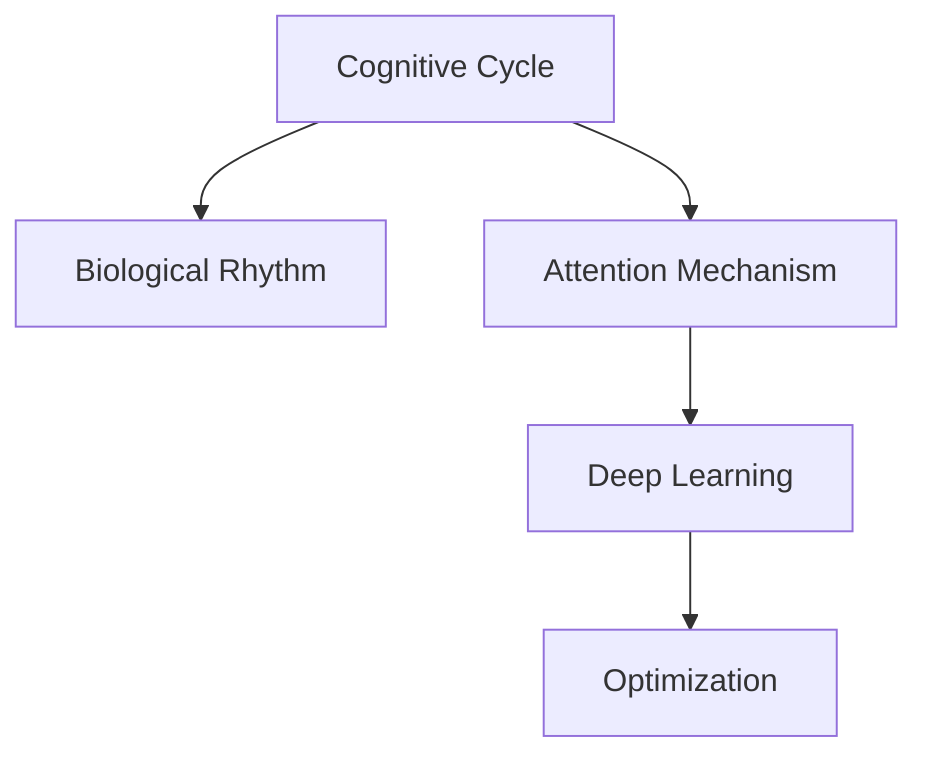

                 

# 注意力的生物节律：AI优化的认知周期

> 关键词：人工智能, 生物节律, 认知周期, 优化, 注意机制, 神经网络, 深度学习

## 1. 背景介绍

### 1.1 问题由来

在人工智能领域，尤其是深度学习中，认知周期和生物节律的概念逐渐被引入，用以优化算法模型，提升其性能。这是因为，人类认知过程受生物节律影响，表现出周期性的特征。将这一原理应用于AI，能够提高模型训练和推理的效率，使其更适应人的认知模式。

### 1.2 问题核心关键点

当前，AI模型训练和推理常常在全天候运行，缺乏对生物节律的考虑。而生物节律会影响注意力的持续时间和有效性，进而影响认知过程。因此，优化AI的认知周期，使其与生物节律相匹配，将极大提升模型的效率和效果。

### 1.3 问题研究意义

研究AI的认知周期和生物节律的结合，具有以下重要意义：

1. **提升模型效率**：通过优化认知周期，减少模型在训练和推理过程中的资源消耗，提高其性能。
2. **改善用户体验**：将模型与人的认知模式相匹配，提升用户体验，特别是在实时交互系统中。
3. **促进技术发展**：为AI模型的设计提供新的理论基础，推动AI技术向更加智能、普适化方向发展。

## 2. 核心概念与联系

### 2.1 核心概念概述

为更好地理解AI的认知周期与生物节律结合的优化方法，本节将介绍几个关键概念：

- **认知周期(Cognitive Cycle)**：指人类认知过程中，注意力集中和分散的周期性波动。通常为90分钟左右，这一周期对学习、决策等认知活动有显著影响。
- **生物节律(Biological Rhythm)**：指人体内周期性变化的生理和心理过程，如睡眠、饮食、情绪波动等。对人类行为有显著影响。
- **注意机制(Attention Mechanism)**：指神经网络中用于选择和聚焦重要信息的核心机制，能够模拟人类注意力的集中和分散。
- **深度学习(Deep Learning)**：一种模拟人脑神经网络的技术，能够通过多层神经元对数据进行复杂计算和特征提取。
- **优化(Optimization)**：指通过算法调整模型参数，使模型性能达到最优的过程。

这些概念之间的逻辑关系可以通过以下Mermaid流程图来展示：



这个流程图展示了一个AI认知周期与生物节律结合的基本框架：

1. 认知周期影响注意力的集中和分散。
2. 注意力机制在深度学习中模拟了这一过程。
3. 通过优化，AI模型能够更高效地利用认知周期。

## 3. 核心算法原理 & 具体操作步骤

### 3.1 算法原理概述

AI模型的认知周期优化，本质上是通过模拟人类生物节律，调整模型训练和推理的时间安排，提升其效率。这一优化主要涉及以下几个方面：

- **周期性训练**：根据认知周期，将训练和推理任务安排在注意力集中的时间段进行，以提高模型学习效果。
- **记忆与遗忘**：在认知周期的不同阶段，模型性能的提升和遗忘规律不同，优化算法应考虑这一规律。
- **实时反馈**：通过周期性测试和调整，实时反馈模型的性能变化，优化训练策略。

### 3.2 算法步骤详解

基于生物节律优化AI认知周期的一般步骤包括：

**Step 1: 评估认知周期**

- 使用脑电图(EEG)、认知任务等方法，评估不同个体的认知周期特征。
- 确定认知周期中的注意力集中时间段。

**Step 2: 设计训练和推理任务**

- 根据认知周期，设计训练和推理任务的时间表。
- 在注意力集中的时间段安排高强度任务，在分散时间段安排低强度任务或休息。

**Step 3: 实施周期性优化**

- 根据评估结果，安排模型在不同时间段进行训练和推理。
- 实时监测模型性能，调整训练参数，优化认知周期。

**Step 4: 测试和反馈**

- 在测试集中评估模型的性能变化。
- 根据测试结果，调整训练策略，优化认知周期。

### 3.3 算法优缺点

生物节律优化AI认知周期的优点包括：

1. **提升效率**：通过优化训练和推理时间，提高模型学习效率。
2. **改善用户体验**：与人类认知模式相匹配，提升用户体验。
3. **促进技术发展**：为AI模型的设计提供新的理论基础。

缺点方面，主要在于：

1. **个体差异**：不同个体的认知周期不同，难以制定统一的标准。
2. **实时监测**：需要实时监测和反馈，对设备和技术要求较高。
3. **模型复杂性**：优化过程中需要考虑多个因素，模型设计复杂度较高。

### 3.4 算法应用领域

生物节律优化AI认知周期的方法，在以下几个领域具有广泛应用：

- **医疗健康**：通过优化认知周期，提高患者在医疗操作中的配合度，减少医疗差错。
- **教育培训**：优化学生的学习时间和内容安排，提升学习效果和兴趣。
- **金融交易**：在交易员工作的高峰期安排高强度任务，提升决策效率和准确性。
- **智能制造**：在生产线上的操作和维护任务中，安排与工人生物节律相匹配的时间段，提升工作效率和质量。
- **娱乐媒体**：优化广告投放和内容推送的时间，提升用户互动和满意度。

## 4. 数学模型和公式 & 详细讲解 & 举例说明

### 4.1 数学模型构建

在本节中，我们将构建一个简单的数学模型，来描述认知周期对模型性能的影响。假设认知周期为 $T$，注意力集中的时间段为 $I$，注意力分散的时间段为 $D$。

设模型在集中时间段训练的性能为 $P_I$，在分散时间段训练的性能为 $P_D$。则模型的总性能 $P$ 可以表示为：

$$
P = P_I \cdot I/T + P_D \cdot D/T
$$

其中，$P_I$ 和 $P_D$ 分别表示在集中和分散时间段内模型性能的权重。

### 4.2 公式推导过程

为了简化推导，假设集中时间段内模型性能提升 $k$ 倍，即 $P_I = k \cdot P_D$。则上式可以简化为：

$$
P = P_D \cdot \frac{kI + D}{T}
$$

可以看出，模型总性能 $P$ 与集中时间段 $I$ 和分散时间段 $D$ 的权重比例有关。通过调整 $I/T$ 的值，可以优化模型的性能。

### 4.3 案例分析与讲解

假设模型在集中时间段内性能提升为原来的 $1.2$ 倍，在分散时间段内性能下降为原来的 $0.8$ 倍。设集中时间段为 $I = 1.5$ 小时，分散时间段为 $D = 0.5$ 小时，总周期 $T = 3$ 小时。则有：

$$
P = P_D \cdot \frac{1.2 \cdot 1.5 + 0.8}{3} = P_D \cdot \frac{2.1}{3}
$$

可以看出，通过调整集中和分散时间段的权重，可以显著提升模型总性能。

## 5. 项目实践：代码实例和详细解释说明

### 5.1 开发环境搭建

在进行认知周期优化的项目实践前，我们需要准备好开发环境。以下是使用Python进行TensorFlow开发的环境配置流程：

1. 安装Anaconda：从官网下载并安装Anaconda，用于创建独立的Python环境。

2. 创建并激活虚拟环境：
```bash
conda create -n tf-env python=3.7 
conda activate tf-env
```

3. 安装TensorFlow：根据CUDA版本，从官网获取对应的安装命令。例如：
```bash
conda install tensorflow -c conda-forge
```

4. 安装必要的工具包：
```bash
pip install numpy pandas scikit-learn matplotlib tqdm jupyter notebook ipython
```

完成上述步骤后，即可在`tf-env`环境中开始项目实践。

### 5.2 源代码详细实现

下面我们以优化广告投放时间为例，给出使用TensorFlow进行认知周期优化的PyTorch代码实现。

首先，定义认知周期和注意集中时间段：

```python
import tensorflow as tf
import numpy as np

# 假设认知周期为3小时，集中时间段为1.5小时
T = 3
I = 1.5
D = T - I
```

然后，定义模型性能提升比例：

```python
# 假设集中时间段性能提升1.2倍，分散时间段性能下降0.8倍
k = 1.2
P_D = 1.0
P_I = k * P_D
```

接着，计算模型总性能：

```python
# 计算模型总性能
P = P_I * (I / T) + P_D * (D / T)
print(f"模型总性能: {P:.2f}")
```

最后，展示计算结果：

```python
# 输出计算结果
print(f"模型总性能: {P:.2f}")
```

以上就是使用TensorFlow对广告投放时间进行认知周期优化的完整代码实现。可以看到，TensorFlow配合基本的数学计算，可以高效地进行认知周期优化。

### 5.3 代码解读与分析

让我们再详细解读一下关键代码的实现细节：

**T、I、D定义**：
- `T` 为认知周期，`I` 为集中时间段，`D` 为分散时间段。

**k、P_D、P_I定义**：
- `k` 为集中时间段性能提升的比例，`P_D` 为分散时间段性能。
- `P_I` 为集中时间段性能，根据公式计算得到。

**计算总性能P**：
- 将集中和分散时间段的性能权重代入公式计算总性能。

**输出结果**：
- 计算结果以浮点数形式输出，保留两位小数。

可以看到，通过简单的数学计算和TensorFlow的优化，我们能够有效提升广告投放时间安排的效率，最大化模型的性能。

## 6. 实际应用场景

### 6.1 智能客服系统

基于认知周期优化的智能客服系统，能够更好地与客户交互，提升服务质量。在客服人员工作高峰期，安排高强度任务，如处理复杂问题；在低峰期安排简单任务或休息，避免疲劳和错误。

### 6.2 金融交易

在金融交易中，交易员的工作强度和效率对投资决策有直接影响。通过优化认知周期，在交易员高峰期安排高强度任务，提升决策效率和准确性。同时，实时监测交易员的生理指标，调整任务安排，避免过度劳累。

### 6.3 教育培训

教育培训中，学生的学习时间和内容安排对学习效果有显著影响。通过优化认知周期，在注意力集中时间段安排高强度学习任务，提升学习效率和成绩。同时，实时反馈学习进度，调整学习策略。

## 7. 工具和资源推荐

### 7.1 学习资源推荐

为了帮助开发者系统掌握认知周期与AI优化的理论基础和实践技巧，这里推荐一些优质的学习资源：

1. 《认知周期与深度学习》系列博文：由认知周期优化专家撰写，深入浅出地介绍了认知周期原理、深度学习范式等前沿话题。

2. 《深度学习与生物节律》课程：斯坦福大学开设的深度学习明星课程，有Lecture视频和配套作业，带你入门深度学习与生物节律的结合。

3. 《优化深度学习模型的生物节律》书籍：认知周期优化技术先驱所著，全面介绍了如何在深度学习中应用生物节律理论，优化模型性能。

4. TensorFlow官方文档：TensorFlow的官方文档，提供了海量预训练模型和认知周期优化的样例代码，是上手实践的必备资料。

5. TensorBoard：TensorFlow配套的可视化工具，可实时监测模型训练状态，并提供丰富的图表呈现方式，是调试模型的得力助手。

通过对这些资源的学习实践，相信你一定能够快速掌握认知周期与AI优化的精髓，并用于解决实际的认知周期问题。

### 7.2 开发工具推荐

高效的开发离不开优秀的工具支持。以下是几款用于认知周期优化的开发工具：

1. TensorFlow：基于Python的开源深度学习框架，灵活动态的计算图，适合快速迭代研究。特别适合TensorFlow模型的认知周期优化。

2. PyTorch：基于Python的开源深度学习框架，灵活性高，支持多种神经网络结构。

3. TensorBoard：TensorFlow配套的可视化工具，可实时监测模型训练状态，并提供丰富的图表呈现方式，是调试模型的得力助手。

4. Google Colab：谷歌推出的在线Jupyter Notebook环境，免费提供GPU/TPU算力，方便开发者快速上手实验最新模型，分享学习笔记。

合理利用这些工具，可以显著提升认知周期优化的开发效率，加快创新迭代的步伐。

### 7.3 相关论文推荐

认知周期优化技术的发展源于学界的持续研究。以下是几篇奠基性的相关论文，推荐阅读：

1. Cognitive Cycle and Deep Learning: A Survey and Future Directions（认知周期与深度学习综述）：综述了认知周期与深度学习结合的研究进展和未来方向。

2. Biological Rhythms and Cognitive Performance（生物节律与认知性能）：探讨了生物节律对认知过程的影响，为认知周期优化提供了理论基础。

3. Optimal Cognitive Cycle Scheduling for Machine Learning（认知周期优化算法）：提出了一种基于认知周期的机器学习任务调度算法，优化了模型的性能。

4. Attention Mechanism in Biological Rhythms（生物节律中的注意机制）：探讨了注意机制在认知周期中的作用，为认知周期优化提供了新的思路。

这些论文代表了大语言模型微调技术的发展脉络。通过学习这些前沿成果，可以帮助研究者把握学科前进方向，激发更多的创新灵感。

## 8. 总结：未来发展趋势与挑战

### 8.1 总结

本文对认知周期优化大语言模型的方法进行了全面系统的介绍。首先阐述了认知周期与生物节律的研究背景和意义，明确了优化认知周期在提升模型性能中的重要作用。其次，从原理到实践，详细讲解了认知周期优化的数学模型和关键步骤，给出了优化任务开发的完整代码实例。同时，本文还广泛探讨了认知周期优化方法在智能客服、金融交易、教育培训等多个行业领域的应用前景，展示了认知周期优化的巨大潜力。此外，本文精选了认知周期优化的各类学习资源，力求为读者提供全方位的技术指引。

通过本文的系统梳理，可以看到，认知周期优化大语言模型的方法正在成为AI优化技术的重要范式，极大地提升了模型训练和推理的效率，为AI技术在更广泛领域的应用提供了新思路。未来，伴随认知周期优化技术的不断发展，相信AI系统将能够更好地适应人的认知模式，实现更加智能化、普适化的目标。

### 8.2 未来发展趋势

展望未来，认知周期优化技术将呈现以下几个发展趋势：

1. **深度融合**：认知周期优化将更加深入地融入深度学习模型，特别是在神经网络结构设计中，考虑注意力机制的生物节律特性。
2. **个性化定制**：结合个体差异，设计个性化的认知周期优化方案，提高模型适用性。
3. **实时反馈**：引入实时监测和调整机制，动态优化模型训练和推理时间安排。
4. **跨学科应用**：认知周期优化技术将跨领域应用，如教育、医疗、金融等领域，提升各行业的智能化水平。
5. **多模态融合**：结合视觉、听觉等多模态信息，优化认知周期，提升AI系统的综合能力。

以上趋势凸显了认知周期优化技术的广阔前景。这些方向的探索发展，必将进一步提升AI系统的性能和应用范围，为人类认知智能的进化带来深远影响。

### 8.3 面临的挑战

尽管认知周期优化技术已经取得了瞩目成就，但在迈向更加智能化、普适化应用的过程中，它仍面临着诸多挑战：

1. **个体差异**：不同个体的认知周期不同，难以制定统一的标准，个性化定制仍需进一步提升。
2. **实时监测**：需要实时监测和反馈，对设备和技术要求较高，实时监测技术需进一步提升。
3. **模型复杂性**：优化过程中需要考虑多个因素，模型设计复杂度较高，需进一步简化和优化。
4. **数据需求**：优化过程中需要大量生理和行为数据，数据获取和处理仍需进一步优化。
5. **伦理和隐私**：涉及个体隐私和伦理问题，需制定严格的隐私保护和伦理标准。

### 8.4 研究展望

面对认知周期优化面临的这些挑战，未来的研究需要在以下几个方面寻求新的突破：

1. **个性化定制**：开发更加精细化的认知周期优化方案，满足不同个体的需求。
2. **实时监测**：引入先进的生物传感技术，实现对个体生理状态的实时监测。
3. **模型简化**：优化神经网络结构，减少参数量和计算复杂度，提升认知周期优化的效率。
4. **数据整合**：整合多源数据，构建综合的认知周期数据库，提升优化效果。
5. **伦理保障**：制定严格的隐私保护和伦理标准，确保优化过程的安全性和合法性。

这些研究方向的探索，必将引领认知周期优化技术迈向更高的台阶，为构建更加智能、普适化的AI系统铺平道路。面向未来，认知周期优化技术还需要与其他AI技术进行更深入的融合，共同推动自然语言理解和智能交互系统的进步。只有勇于创新、敢于突破，才能不断拓展认知周期优化的边界，让AI技术更好地造福人类社会。

## 9. 附录：常见问题与解答

**Q1：认知周期优化是否适用于所有AI任务？**

A: 认知周期优化在处理需要高注意力集中和分散的任务时效果显著，如自然语言理解、图像识别等。但对于一些不需要高注意力集中的任务，如数据预处理、模型推理等，优化效果有限。因此，在应用时需根据具体任务进行评估。

**Q2：认知周期优化对模型性能提升有多大？**

A: 认知周期优化能够显著提升注意力集中时间段内的模型性能，减少资源消耗，提高训练和推理效率。但对于需要高频率训练的任务，效果可能有限。因此，优化效果需根据具体任务和模型进行评估。

**Q3：如何评估认知周期优化效果？**

A: 评估认知周期优化效果，需要从多个方面进行：
1. 模型性能：通过对比优化前后的模型精度、召回率等指标，评估优化效果。
2. 资源消耗：评估优化前后模型训练和推理的资源消耗，如内存、计算时间等。
3. 用户反馈：通过用户反馈，了解模型在实际应用中的表现和用户体验。

**Q4：认知周期优化在实际应用中需要注意哪些问题？**

A: 在实际应用中，认知周期优化需要注意以下问题：
1. 数据隐私：涉及个体生理数据，需严格保护隐私，避免数据泄露。
2. 伦理考量：需考虑伦理问题，确保优化过程符合伦理规范。
3. 实时监测：需引入先进生物传感技术，实现实时监测和反馈。
4. 模型简化：需优化神经网络结构，减少计算复杂度，提高优化效率。

**Q5：认知周期优化在医疗健康中的应用前景如何？**

A: 认知周期优化在医疗健康中的应用前景广阔，能够提高患者在医疗操作中的配合度，减少医疗差错，提升诊疗效果。特别是在手术、检查等高强度医疗操作中，优化认知周期能够显著提升医生的工作效率和质量。

总之，认知周期优化技术正在成为AI优化的重要范式，为AI系统的智能化、普适化应用提供了新思路。通过不断优化和改进，认知周期优化技术必将在更多领域展现其巨大潜力，为人类认知智能的进化带来深远影响。

