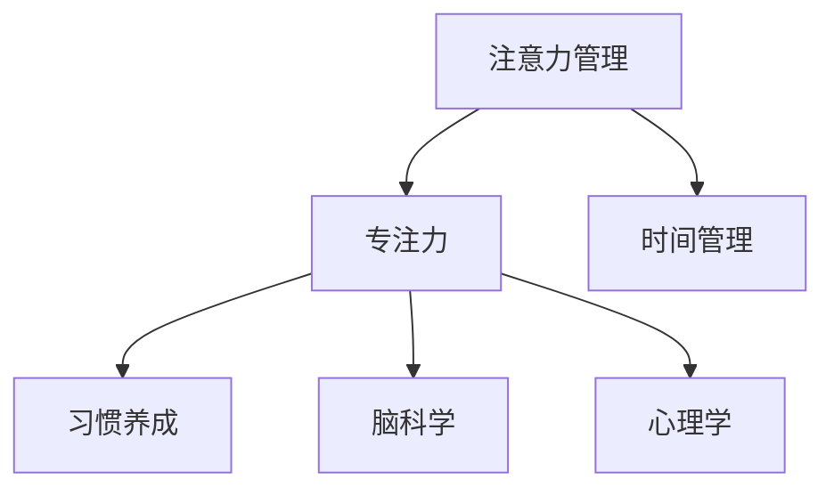

                 

# 注意力管理101：提高专注力的技巧和习惯

> 关键词：注意力管理, 专注力, 时间管理, 习惯养成, 高效工作, 脑科学, 心理学, 实践方法

## 1. 背景介绍

在当今信息爆炸的时代，人们的注意力往往被各种干扰因素所分散，如社交媒体、新闻推送、电子邮件等。这种注意力不集中现象，不仅影响我们的工作和学习效率，还可能对我们的身心健康造成危害。因此，掌握提高专注力的技巧和习惯变得尤为重要。本文章将深入探讨注意力管理的核心概念、基本原理和实践方法，帮助读者在日常工作和生活中提升专注力，提高工作效率。

## 2. 核心概念与联系

### 2.1 核心概念概述

- **注意力管理(Attention Management)**：指通过有效管理和利用注意力，提升个人和团队的工作效率和绩效。
- **专注力(Focus)**：指在一定时间内集中精力于某项任务，避免外界干扰的能力。
- **时间管理(Time Management)**：指通过合理安排时间，高效利用时间资源，以实现目标的过程。
- **习惯养成(Habit Formation)**：指通过重复行为，逐步形成固定习惯的过程。
- **脑科学(Brain Science)**：研究大脑功能和认知过程的科学，为注意力管理和专注力提升提供了科学依据。
- **心理学(Psychology)**：研究人类行为和心理过程的科学，帮助理解注意力分散和专注力提升的心理机制。

这些概念之间相互联系，共同构成提高专注力的完整框架。通过理解这些核心概念，可以更好地制定和实施有效的注意力管理策略。

### 2.2 核心概念原理和架构的 Mermaid 流程图(Mermaid 流程节点中不要有括号、逗号等特殊字符)



## 3. 核心算法原理 & 具体操作步骤

### 3.1 算法原理概述

注意力管理的核心原理基于认知神经科学和行为科学的理论，主要包含以下几个方面：

- **前额叶皮层(Prefrontal Cortex, PFC)**：是注意力管理的核心区域，负责决策、规划、执行控制等高级认知功能。
- **多巴胺(Dopamine)**：一种与奖励、动机和注意力相关的神经递质，对注意力的分配和调节起着重要作用。
- **执行功能(Executive Functions)**：如抑制控制、工作记忆、切换等，是注意力管理的基础。

基于这些原理，注意力管理的算法主要分为以下几个步骤：

1. **识别干扰因素**：了解并识别潜在的干扰因素，如社交媒体、电子邮件等。
2. **设定目标**：明确目标，制定详细的计划和时间表。
3. **分配注意力**：使用时间块(Timing Blocking)、番茄工作法(Pomodoro Technique)等方法，合理分配注意力。
4. **执行和调整**：实施计划，并根据执行情况进行必要的调整。
5. **反馈和优化**：通过反思和调整，不断优化注意力管理策略。

### 3.2 算法步骤详解

#### 3.2.1 识别干扰因素

1. **社交媒体**：统计每天花在社交媒体上的时间，了解主要使用平台和时间段。
2. **电子邮件**：记录每天处理邮件的次数和时长，分析关键邮件和垃圾邮件的占比。
3. **环境干扰**：观察工作环境中可能引起分心的因素，如嘈杂的声音、干扰的工作区域等。

#### 3.2.2 设定目标

1. **SMART原则**：目标应具有具体(Specific)、可测量(Measurable)、可达成(Achievable)、相关性(Relevant)、时限性(Time-bound)。
2. **分解目标**：将大目标分解为小任务，逐步完成。
3. **优先级排序**：根据任务的重要性和紧急性，制定优先级列表。

#### 3.2.3 分配注意力

1. **时间块(Timing Blocking)**：将一天划分为多个时间块，每个时间块专注一个任务。
2. **番茄工作法(Pomodoro Technique)**：工作25分钟，休息5分钟，每4个番茄工作后休息更长时间。
3. **番茄工作法改进**：优化为工作50分钟，休息10分钟，更适合长时间高强度工作。

#### 3.2.4 执行和调整

1. **番茄钟应用**：使用番茄钟应用，如Toggl、Pomodone等，记录工作时间和休息时间。
2. **定期回顾**：每周或每月进行一次回顾，评估目标完成情况和注意力管理策略的效果。
3. **调整策略**：根据回顾结果，调整和优化时间分配和注意力管理策略。

#### 3.2.5 反馈和优化

1. **定期反思**：每天或每周进行反思，记录注意力管理中的成功和失败经验。
2. **优化方法**：根据反思结果，优化时间管理方法和注意力分配策略。
3. **持续改进**：不断尝试新的方法和策略，持续改进注意力管理效果。

### 3.3 算法优缺点

#### 3.3.1 优点

1. **提高效率**：通过合理分配注意力和时间，避免无效干扰，显著提高工作效率。
2. **改善心理健康**：减少分心，避免压力和焦虑，提升整体心理健康。
3. **提升工作质量**：更专注地工作，产出更高质量的结果。

#### 3.3.2 缺点

1. **初期难度大**：需要时间和耐心逐步适应新的时间管理方法和注意力分配策略。
2. **需要自律性**：需要高度的自律性和自我控制能力，避免偏离计划。
3. **可能造成压力**：过于严格的计划和目标，可能带来额外的压力和焦虑。

### 3.4 算法应用领域

注意力管理技术不仅适用于个人工作和学习，也广泛应用于团队管理、项目管理等领域。具体应用领域包括：

- **个人效率提升**：如写作、编程、阅读、学习等。
- **项目管理**：如任务分配、进度跟踪、会议安排等。
- **团队协作**：如沟通协调、目标对齐、资源配置等。
- **人力资源管理**：如员工培训、绩效评估、职业发展等。
- **产品管理**：如产品规划、市场推广、用户反馈等。

## 4. 数学模型和公式 & 详细讲解 & 举例说明（备注：数学公式请使用latex格式，latex嵌入文中独立段落使用 $$，段落内使用 $)
### 4.1 数学模型构建

假设有一个任务 $T$，需要完成 $N$ 个子任务，每个子任务 $i$ 需要时间 $t_i$ 完成。假设每天工作时间为 $H$ 小时，每小时可以专注的时间为 $F$。则任务 $T$ 的完成时间 $T_{total}$ 可以用以下公式计算：

$$
T_{total} = \frac{N}{F \times H} \times \max(\sum_{i=1}^N t_i)
$$

### 4.2 公式推导过程

- **任务分解**：将大任务分解为小任务 $t_i$，每个任务分配固定时间 $F$。
- **时间利用率**：计算实际专注时间与可用工作时间的比例，即 $F/H$。
- **总完成时间**：计算所有子任务完成所需时间，并乘以任务分解和分配效率。

### 4.3 案例分析与讲解

假设有一个开发任务，包含5个模块，每个模块需要时间 $t_i$ 分别为5小时、4小时、3小时、3小时、4小时。每天可以专注工作8小时。

- **任务分解**：将任务分解为5个模块，每个模块 $t_i$ 分别为5小时、4小时、3小时、3小时、4小时。
- **时间利用率**：每天可以专注工作8小时，即 $F=8$，$H=8$。
- **总完成时间**：所有模块总时间为 $5+4+3+3+4=19$ 小时，完成时间 $T_{total} = 19 / (8 \times 8) \approx 0.78125$ 天，约等于 $1.92$ 天。

## 5. 项目实践：代码实例和详细解释说明

### 5.1 开发环境搭建

#### 5.1.1 安装开发环境

1. **Python环境**：安装Python 3.9及以上版本，推荐使用Anaconda环境管理工具。
2. **番茄钟应用**：安装Toggl、Pomodone等番茄钟应用。
3. **时间管理工具**：安装Todoist、Trello等时间管理工具。

#### 5.1.2 设置环境变量

1. **工作时间**：设置每日专注工作时间和休息时间，如8小时工作，2次15分钟休息。
2. **任务清单**：创建每日任务清单，并标注优先级和截止日期。

### 5.2 源代码详细实现

#### 5.2.1 时间块管理

```python
import time

class TimeBlockManager:
    def __init__(self, work_hours=8, rest_minutes=15, task_list=None):
        self.work_hours = work_hours
        self.rest_minutes = rest_minutes
        self.task_list = task_list
        self.current_task = 0
        self.current_time = 0
        self.total_time = 0
    
    def start(self):
        self.current_time = time.time()
        self.total_time = 0
    
    def end(self):
        self.total_time += time.time() - self.current_time
    
    def work(self):
        task = self.task_list[self.current_task]
        start_time = time.time()
        while True:
            end_time = time.time()
            if end_time - start_time > task[1]:
                print(f"Task {task[0]} completed in {end_time - start_time} seconds.")
                self.current_task += 1
                break
            elif task[1] < 0.5:  # 防止卡住
                break
    
    def rest(self):
        time.sleep(self.rest_minutes)
    
    def update_task_list(self, new_task_list):
        self.task_list = new_task_list
        self.current_task = 0
        self.current_time = 0
        self.total_time = 0
```

#### 5.2.2 番茄钟管理

```python
import time

class PomodoroManager:
    def __init__(self, work_minutes=25, rest_minutes=5):
        self.work_minutes = work_minutes
        self.rest_minutes = rest_minutes
        self.total_time = 0
    
    def start(self):
        self.current_time = time.time()
        self.total_time = 0
    
    def end(self):
        self.total_time += time.time() - self.current_time
    
    def work(self):
        start_time = time.time()
        while True:
            end_time = time.time()
            if end_time - start_time > self.work_minutes:
                print(f"Work session completed in {end_time - start_time} seconds.")
                self.total_time += self.work_minutes
                self.rest()
                break
    
    def rest(self):
        time.sleep(self.rest_minutes)
```

### 5.3 代码解读与分析

#### 5.3.1 时间块管理

- **start**：记录开始时间。
- **end**：记录结束时间，计算专注时间。
- **work**：执行当前任务，直到任务完成或超时。
- **rest**：休息一段时间后，更新任务清单。

#### 5.3.2 番茄钟管理

- **start**：记录开始时间。
- **end**：记录结束时间，计算专注时间。
- **work**：执行25分钟工作，休息5分钟后，继续下一轮。

### 5.4 运行结果展示

假设有一个任务列表 `task_list = [("Task 1", 5), ("Task 2", 4), ("Task 3", 3), ("Task 4", 3), ("Task 5", 4)]`。

```python
time_block_manager = TimeBlockManager(task_list=task_list)
time_block_manager.start()
time_block_manager.work()
time_block_manager.end()
print(f"Total time spent: {time_block_manager.total_time} seconds.")
```

## 6. 实际应用场景

### 6.1 项目管理

在项目管理中，可以使用时间块管理方法，将项目分解为多个子任务，每个子任务分配固定时间块。这样可以避免团队成员频繁切换任务，提高整体效率。

### 6.2 学习管理

在学习管理中，可以使用番茄钟管理方法，每个学习单元为25分钟，休息5分钟，可以有效地提高学习效率，避免长时间疲劳。

### 6.3 生活管理

在生活中，可以使用时间块管理方法，将一天划分为多个时间块，每个时间块专注于不同的任务，如工作、运动、休息等，可以更好地管理时间，提高生活质量。

## 7. 工具和资源推荐

### 7.1 学习资源推荐

#### 7.1.1 书籍推荐

1. **《深度工作》(Deep Work)**：Cal Newport著，介绍了如何通过深度工作提升专注力，提高工作效率。
2. **《习惯的力量》(The Power of Habit)**：Charles Duhigg著，介绍了习惯的形成和改变机制，帮助读者培养好习惯。
3. **《自控力》(The Willpower Instinct)**：Kelly McGonigal著，介绍了如何提高自控力，管理时间。

#### 7.1.2 在线课程

1. **Coursera《时间管理基础》(Time Management Foundations)**：由University of California Irvine开设，介绍时间管理的核心原理和实践方法。
2. **edX《心理学导论》(Introduction to Psychology)**：由Harvard University和University of California Irvine合作开设，介绍心理学基础，理解注意力管理机制。

### 7.2 开发工具推荐

#### 7.2.1 番茄钟应用

1. **Toggl**：功能强大的时间追踪工具，支持多种平台，适合个人和企业使用。
2. **Pomodone**：基于Web的番茄钟应用，支持多种操作系统和浏览器。

#### 7.2.2 时间管理工具

1. **Todoist**：简单易用的任务管理工具，支持任务分类、优先级、截止日期等。
2. **Trello**：灵活的项目管理工具，支持看板、列表、卡片等形式的任务组织。

### 7.3 相关论文推荐

#### 7.3.1 脑科学研究

1. **《注意力和认知控制》(Attention and Cognitive Control)**：由Brussaard等学者发表，介绍注意力控制的神经机制。
2. **《大脑的注意力系统》(The Attention System of the Brain)**：由Thut等学者发表，介绍大脑的注意力网络。

#### 7.3.2 心理学研究

1. **《注意力缺陷多动障碍：一种神经发育障碍》(Attention Deficit Hyperactivity Disorder: A Neurodevelopmental Disorder)**：由Gast髓等学者发表，介绍注意力缺陷与多动症的相关研究。
2. **《心理弹性》(Resilience)**：由Garrison等学者发表，介绍心理弹性的机制和应用。

## 8. 总结：未来发展趋势与挑战

### 8.1 研究成果总结

注意力管理技术的发展主要集中在以下几个方面：

1. **神经科学基础**：理解注意力和专注力的神经机制，为技术开发提供理论基础。
2. **心理科学应用**：应用心理学原理，提高时间管理和任务分配的科学性。
3. **实践方法创新**：开发新的时间管理方法和注意力分配策略，提升用户体验。

### 8.2 未来发展趋势

1. **个性化管理**：根据用户的行为和习惯，提供个性化的注意力管理方案。
2. **多模态融合**：结合视觉、听觉、触觉等多模态信息，提升注意力管理的全面性。
3. **智能推荐**：利用机器学习算法，根据用户历史数据推荐最优的时间管理策略。
4. **跨平台集成**：实现跨设备、跨应用的时间管理集成，提高用户使用便捷性。

### 8.3 面临的挑战

1. **用户习惯差异**：不同用户习惯和需求差异大，难以提供普适化的解决方案。
2. **数据隐私问题**：用户数据隐私保护成为关注焦点，需采取措施确保数据安全。
3. **技术普及度低**：新技术的普及和应用仍需时间和用户教育。
4. **用户依赖性强**：依赖于技术工具，用户主动性不足，可能导致应用效果不佳。

### 8.4 研究展望

1. **结合AI技术**：利用AI技术，如机器学习、深度学习，提升时间管理和注意力分配的智能化水平。
2. **拓展应用场景**：拓展应用场景，如智能家居、智能办公室等，提升生活质量和工作效率。
3. **多学科交叉**：结合脑科学、心理学、工程学等学科，推动注意力管理技术的创新发展。

## 9. 附录：常见问题与解答

### 9.1 问题1：番茄钟工作法效果不如预期，如何解决？

**解答**：可能有以下几种原因：
1. **休息时间不足**：番茄钟工作法的核心在于适当的休息，休息时间过短会导致疲劳积累。
2. **任务难度过大**：任务难度过大或过小都会影响专注力。建议选择适当的任务难度，逐步提高。
3. **环境干扰**：工作环境嘈杂或干扰因素多，会影响专注力。建议选择一个安静的工作环境，或使用耳机隔离干扰。

### 9.2 问题2：如何保持长期专注力？

**解答**：保持长期专注力需要以下几个方面的努力：
1. **目标设定**：设定明确、可实现的目标，保持动力。
2. **时间管理**：合理分配时间，避免过度劳累。
3. **兴趣培养**：培养对任务的兴趣，提高内在动机。
4. **自我奖励**：完成任务后给予自己适当的奖励，保持积极心态。

### 9.3 问题3：时间管理工具如何选择？

**解答**：选择时间管理工具时，需要考虑以下几个因素：
1. **功能需求**：根据自身需求选择工具，如任务管理、时间追踪、进度跟踪等。
2. **用户体验**：界面友好、操作便捷的工具更能提高使用意愿。
3. **跨平台支持**：支持多平台和设备的使用，提升便捷性。
4. **社区支持**：选择有活跃社区支持的工具，可以获得更多支持和建议。

### 9.4 问题4：如何应对突发事件？

**解答**：突发事件难免会干扰注意力管理计划，以下是一些应对策略：
1. **预留缓冲时间**：在计划中预留一定的缓冲时间，应对突发事件。
2. **灵活调整计划**：根据突发事件的影响，灵活调整任务和时间安排。
3. **及时反馈**：突发事件后及时反馈和总结，优化后续计划。

---

作者：禅与计算机程序设计艺术 / Zen and the Art of Computer Programming

