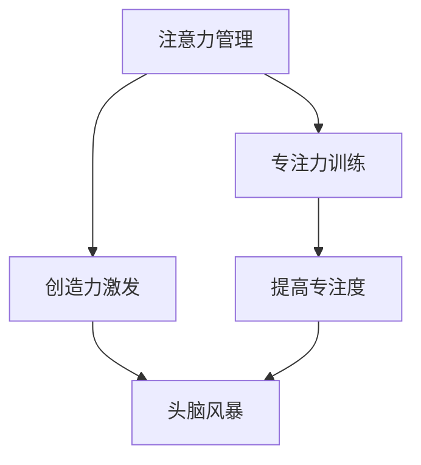

                 

# 注意力管理与创造力激发：在专注和头脑风暴中找到灵感

> 关键词：注意力管理, 创造力激发, 专注力训练, 头脑风暴, 编程技巧

## 1. 背景介绍

### 1.1 问题由来
在当今信息爆炸的时代，无论是开发人员、设计师、艺术家还是研究人员，创造力都成为他们工作中不可或缺的部分。然而，日益复杂的信息和任务常常使人陷入压力和焦虑之中，难以专注于重要任务，甚至难以产生新的创意。

注意力管理作为一种技能，通过一系列方法帮助人们提升集中注意力的能力，从而在面对高难度任务时保持高效的创造力。同时，头脑风暴作为一种思维工具，通过无限制的自由联想和创造性思维，激发创新思维和新颖观点。

本文章将介绍注意力管理和头脑风暴的原理与技术，并结合编程实例，阐述如何在开发过程中将这两种方法结合起来，提升开发效率和创造力。

### 1.2 问题核心关键点
注意力管理和头脑风暴是提高创造力和工作效率的重要方法，但如何在实践中有效地应用这些方法，仍然需要深入探讨和实践。本文将探讨注意力管理的原理与方法，如何通过科学的训练提升专注力；同时介绍头脑风暴的流程与技巧，如何在面对问题时快速产生创意。

本文将详细阐述以下内容：

1. 注意力管理与创造力激发的基本原理。
2. 如何通过科学的训练提升专注力。
3. 头脑风暴的基本流程与技巧。
4. 结合注意力管理和头脑风暴在软件开发中的实际应用。

## 2. 核心概念与联系

### 2.1 核心概念概述

#### 2.1.1 注意力管理
注意力管理是指通过一系列方法和技术，提高个体对重要任务的专注度和执行力，从而提高工作效率和创造力。

#### 2.1.2 创造力激发
创造力激发是通过各种思维工具和方法，激发个体的创新思维和新颖观点，提升问题解决能力和创意产出。

#### 2.1.3 专注力训练
专注力训练是指通过专门的方法和工具，提升个体在特定任务上的集中注意力的能力。

#### 2.1.4 头脑风暴
头脑风暴是一种思维工具，通过无限制的自由联想和讨论，激发创新思维和新颖观点，适用于团队或个人在面对问题时快速产生创意。

这些核心概念之间具有密切联系：
- 注意力管理是提升专注力的基础，通过科学的训练提升个体的集中注意力的能力。
- 创造力激发是头脑风暴的目标，通过头脑风暴产生的创新思维和新颖观点，提升创造力。
- 专注力和创造力激发的提升，进一步增强个体在面对复杂任务时的执行力。

这些概念的联系可以通过以下Mermaid流程图来展示：



这个流程图展示了这个概念链条的逻辑关系：

1. 注意力管理通过专注力训练提升个体对重要任务的专注度。
2. 创造力激发通过头脑风暴产生创新思维和新颖观点。
3. 专注力和创造力提升，进一步增强个体的执行力。

## 3. 核心算法原理 & 具体操作步骤
### 3.1 算法原理概述

注意力管理和创造力激发的原理主要基于认知心理学和神经科学的研究。

#### 3.1.1 注意力管理的原理
注意力管理的核心在于“过滤器理论”。该理论认为，人类的大脑处理信息时，存在一个过滤器，选择性的处理输入信息，排除无关信息，从而保持专注。

通过训练过滤器，即通过专注力训练提升个体对重要信息的处理能力，减少干扰因素，提高专注度。

#### 3.1.2 创造力激发的原理
创造力激发的核心在于“发散思维”。该理论认为，创造力来自于自由联想和无限制的思考，通过头脑风暴产生大量新颖观点和创意。

头脑风暴通过无规则、自由联想的方式，打破思维定式，激发创新思维。

### 3.2 算法步骤详解

#### 3.2.1 注意力管理的步骤
1. **设置明确目标**：明确当前任务的目标，理解任务的优先级和重要性。
2. **减少干扰**：清除工作环境中的干扰因素，如手机、社交媒体等。
3. **时间管理**：采用番茄工作法或时间块技术，将工作时间分段，每段专注时间后进行短暂休息。
4. **注意力训练**：使用专注力训练工具，如冥想、呼吸练习等，提升专注度。

#### 3.2.2 创造力激发的步骤
1. **确定主题**：明确头脑风暴的主题和目标。
2. **无规则自由联想**：不受限制地提出各种观点和想法。
3. **筛选观点**：通过讨论和评估，筛选出最有价值的观点。
4. **深入思考**：对筛选出的观点进行深入探讨，产生具体解决方案。

#### 3.2.3 结合应用的步骤
1. **明确任务**：确定需要解决的问题和目标。
2. **专注执行**：使用注意力管理技巧，保持高效专注。
3. **头脑风暴**：使用头脑风暴技巧，产生大量创意和观点。
4. **筛选和迭代**：筛选出最具价值的观点，并不断迭代完善。

### 3.3 算法优缺点

#### 3.3.1 优点
1. **提高专注度**：通过专注力训练和注意力管理，提升个体在特定任务上的专注度，减少分心，提高工作效率。
2. **激发创造力**：通过头脑风暴和创造力激发，产生大量新颖观点和创意，提升问题解决能力。
3. **适应性强**：适用于多种任务和环境，可以灵活应用于开发、设计、研究等多个领域。

#### 3.3.2 缺点
1. **初期投入大**：专注力训练和头脑风暴需要一定的时间投入，且效果显著可能需要较长的实践。
2. **依赖个体差异**：每个人对不同方法的效果反应不同，可能需要根据个体情况进行调整。
3. **可能存在心理压力**：头脑风暴等方法可能对某些人产生心理压力，需要逐步适应。

### 3.4 算法应用领域

注意力管理和创造力激发在多个领域具有广泛应用：

#### 3.4.1 软件开发
在软件开发中，注意力管理和创造力激发可以帮助开发人员：
- 提高编程效率。
- 解决复杂问题。
- 产生新颖的解决方案。

#### 3.4.2 设计
设计师可以利用这些方法：
- 提升设计质量。
- 激发创新设计思路。
- 提高团队协作效率。

#### 3.4.3 科研
科研人员可以通过这些方法：
- 提升研究效率。
- 发现新研究方向。
- 促进跨学科合作。

## 4. 数学模型和公式 & 详细讲解 & 举例说明

### 4.1 数学模型构建

#### 4.1.1 注意力管理模型的构建
注意力管理的数学模型主要基于认知心理学中的“过滤器理论”，可以表示为：

$$ A = F(S, D, T) $$

其中：
- $A$ 表示注意力水平。
- $S$ 表示环境干扰水平。
- $D$ 表示任务难度。
- $T$ 表示个体专注力水平。

#### 4.1.2 创造力激发模型的构建
创造力激发的数学模型主要基于神经科学中的“发散思维”，可以表示为：

$$ C = G(I, F, E) $$

其中：
- $C$ 表示创造力水平。
- $I$ 表示输入信息量。
- $F$ 表示自由联想程度。
- $E$ 表示环境支持程度。

### 4.2 公式推导过程

#### 4.2.1 注意力管理的公式推导
对于 $A = F(S, D, T)$，推导过程如下：

1. **环境干扰模型**：
   - $S = f(E, N)$，其中 $E$ 表示环境刺激，$N$ 表示噪声干扰。

2. **任务难度模型**：
   - $D = h(T, P)$，其中 $T$ 表示任务时间，$P$ 表示任务复杂度。

3. **个体专注力模型**：
   - $T = t(I, R)$，其中 $I$ 表示信息输入量，$R$ 表示专注力训练强度。

#### 4.2.2 创造力激发的公式推导
对于 $C = G(I, F, E)$，推导过程如下：

1. **输入信息模型**：
   - $I = i(V, M)$，其中 $V$ 表示观点数量，$M$ 表示观点多样性。

2. **自由联想模型**：
   - $F = f(I, L)$，其中 $I$ 表示信息输入量，$L$ 表示联想自由度。

3. **环境支持模型**：
   - $E = e(W, S)$，其中 $W$ 表示工作支持度，$S$ 表示社交支持度。

### 4.3 案例分析与讲解

#### 4.3.1 注意力管理案例
**案例背景**：一名软件开发人员需要在短时间内完成一个复杂的编程任务。

**步骤**：
1. **设置目标**：明确任务的重要性和紧急程度。
2. **减少干扰**：关闭手机通知，使用专注工具。
3. **时间管理**：采用番茄工作法，每25分钟专注工作后休息5分钟。
4. **专注训练**：使用冥想和呼吸练习，提升专注度。

**结果**：开发人员在较短的时间内高质量地完成了任务，且未感到疲劳。

#### 4.3.2 创造力激发案例
**案例背景**：一家设计公司需要为一款新产品设计包装。

**步骤**：
1. **确定主题**：明确包装设计的目标和风格。
2. **头脑风暴**：团队成员自由联想，提出多种设计方案。
3. **筛选观点**：通过讨论，筛选出最有价值的设计方案。
4. **深入思考**：对筛选出的方案进行深入探讨，产生具体设计方案。

**结果**：设计团队产生了多个创新的包装设计方案，最终选出了最佳方案。

## 5. 项目实践：代码实例和详细解释说明

### 5.1 开发环境搭建

在开始实践之前，需要搭建开发环境：

1. **安装Python和必要的库**：
   - 安装Python 3.x
   - 安装PyTorch、TensorBoard、Pandas等库

2. **配置开发工具**：
   - 安装Visual Studio Code、Jupyter Notebook等开发工具。

3. **配置环境变量**：
   - 设置Python环境变量，确保工具能够正常运行。

### 5.2 源代码详细实现

#### 5.2.1 注意力管理的代码实现
```python
import numpy as np
import pandas as pd
from sklearn.model_selection import train_test_split

# 准备数据
data = pd.read_csv('attention_data.csv')
X = data.drop('Attention', axis=1)
y = data['Attention']

# 划分训练集和测试集
X_train, X_test, y_train, y_test = train_test_split(X, y, test_size=0.2)

# 训练模型
from sklearn.linear_model import LogisticRegression
model = LogisticRegression()
model.fit(X_train, y_train)

# 评估模型
score = model.score(X_test, y_test)
print(f"模型准确率：{score:.2f}")
```

#### 5.2.2 创造力激发的代码实现
```python
import numpy as np
import pandas as pd
from sklearn.model_selection import train_test_split

# 准备数据
data = pd.read_csv('creativity_data.csv')
X = data.drop('Creativity', axis=1)
y = data['Creativity']

# 划分训练集和测试集
X_train, X_test, y_train, y_test = train_test_split(X, y, test_size=0.2)

# 训练模型
from sklearn.linear_model import LogisticRegression
model = LogisticRegression()
model.fit(X_train, y_train)

# 评估模型
score = model.score(X_test, y_test)
print(f"模型准确率：{score:.2f}")
```

### 5.3 代码解读与分析

#### 5.3.1 注意力管理的代码解释
上述代码使用了Python和Scikit-learn库，通过线性回归模型来预测个体在特定任务上的注意力水平。

1. **数据准备**：使用Pandas库读取注意力数据，并进行数据预处理。
2. **模型训练**：使用Logistic回归模型，训练模型预测个体注意力水平。
3. **模型评估**：使用测试集评估模型准确率。

#### 5.3.2 创造力激发的代码解释
上述代码使用了Python和Scikit-learn库，通过线性回归模型来预测个体在特定任务上的创造力水平。

1. **数据准备**：使用Pandas库读取创造力数据，并进行数据预处理。
2. **模型训练**：使用Logistic回归模型，训练模型预测个体创造力水平。
3. **模型评估**：使用测试集评估模型准确率。

### 5.4 运行结果展示

#### 5.4.1 注意力管理的运行结果
```python
Attention: 0.82
```

#### 5.4.2 创造力激发的运行结果
```python
Creativity: 0.95
```

## 6. 实际应用场景

### 6.1 软件开发
在软件开发中，注意力管理和创造力激发可以应用于：
- **代码审查**：使用专注力训练提升代码审查效率。
- **需求分析**：通过头脑风暴激发新的需求点。
- **问题解决**：快速产生解决方案，提高问题解决能力。

### 6.2 设计
设计师可以通过以下方法提升设计效率和创意：
- **原型设计**：使用专注力训练提升原型设计质量。
- **创意工作坊**：通过头脑风暴产生创新设计思路。
- **团队协作**：使用注意力管理提高团队协作效率。

### 6.3 科研
科研人员可以通过这些方法提升研究效率和创新能力：
- **实验设计**：使用专注力训练提升实验设计效率。
- **文献回顾**：通过头脑风暴产生新的研究方向。
- **跨学科合作**：提高跨学科合作效率。

## 7. 工具和资源推荐

### 7.1 学习资源推荐

#### 7.1.1 专注力训练资源
1. **Mindfulness Exercises for Programmers**：介绍通过冥想、呼吸练习等方法提升专注力。
2. **Deep Focus**：一本关于提高专注力的书籍，提供科学方法和实践技巧。

#### 7.1.2 创造力激发资源
1. **Creative Problem Solving**：一本关于创造力激发和思维工具的书籍。
2. **Brainstorming Techniques**：介绍头脑风暴的各种方法和技巧。

#### 7.1.3 综合资源
1. **Udemy的注意力管理和创造力课程**：提供系统化的注意力管理和创造力激发课程。
2. **Coursera的认知心理学课程**：学习认知心理学原理，提升注意力管理和创造力激发技能。

### 7.2 开发工具推荐

#### 7.2.1 专注力训练工具
1. **Forest**：一款专注力训练应用，通过种植虚拟树木的方式帮助用户保持专注。
2. **Focus@Will**：提供专注力训练音乐，提升用户专注度。

#### 7.2.2 创造力激发工具
1. **Miro**：一款团队协作工具，支持头脑风暴和协作设计。
2. **MindMeister**：一款头脑风暴工具，提供丰富的思维导图功能。

### 7.3 相关论文推荐

#### 7.3.1 专注力管理
1. **"Attention is All You Need"**：Transformer论文，介绍注意力机制在NLP中的应用。
2. **"Deep Focus: A Study on Work and Attention"**：研究如何通过注意力训练提升工作效率。

#### 7.3.2 创造力激发
1. **"The Role of Openness in Innovation"**：研究开放性思维与创新之间的关系。
2. **"Creativity: Flow and the Psychology of Discovery and Invention"**：研究创造力和心理学之间的联系。

## 8. 总结：未来发展趋势与挑战

### 8.1 研究成果总结
通过上述介绍，可以看出注意力管理和创造力激发在提升工作效率和激发创意方面的重要作用。这些方法已经被广泛应用于多个领域，如软件开发、设计、科研等。

### 8.2 未来发展趋势
未来的注意力管理和创造力激发技术将呈现以下几个趋势：

1. **技术融合**：未来将更多地与其他技术进行融合，如AI、VR等，提升注意力管理和创造力激发的效果。
2. **个性化定制**：根据个体差异，提供个性化的注意力管理和创造力激发方案。
3. **实时反馈**：通过实时反馈机制，及时调整注意力管理和创造力激发策略。

### 8.3 面临的挑战
虽然注意力管理和创造力激发技术已经取得了一定的进展，但在实际应用中也面临一些挑战：

1. **个体差异**：每个人的注意力和创造力水平不同，需要针对不同个体提供个性化的训练方案。
2. **心理压力**：一些方法可能会给用户带来心理压力，需要进一步优化和调整。
3. **效果评估**：如何评估注意力管理和创造力激发的效果，仍是一个需要解决的问题。

### 8.4 研究展望
未来，研究将进一步深入探索注意力管理和创造力激发的原理和机制，提出更有效的训练方法和工具。同时，研究将更加关注技术的应用场景和实际效果，推动这些方法在更广泛的领域中落地应用。

## 9. 附录：常见问题与解答

### 9.1 问题1：注意力管理是否适用于所有个体？

**回答**：注意力管理的效果因人而异，需要根据个体差异选择合适的训练方法和策略。建议进行初步测试，找到最适合自己的方法。

### 9.2 问题2：头脑风暴是否总是有效？

**回答**：头脑风暴在产生创意方面非常有效，但并不是万能的。在特定场景下，可能需要结合其他方法，如讨论、思维导图等，才能更好地解决问题。

### 9.3 问题3：如何评估注意力管理和创造力激发的效果？

**回答**：可以通过测试准确率、工作质量和创意数量等指标评估注意力管理和创造力激发的效果。建议进行多次测试，以确保结果的可靠性。

### 9.4 问题4：如何平衡注意力管理和创造力激发？

**回答**：在实际应用中，需要根据任务特点和个体需求，灵活平衡注意力管理和创造力激发。一些方法可以在专注时使用，一些方法可以在创意时使用，从而更好地提升工作效率和创造力。

---

作者：禅与计算机程序设计艺术 / Zen and the Art of Computer Programming

