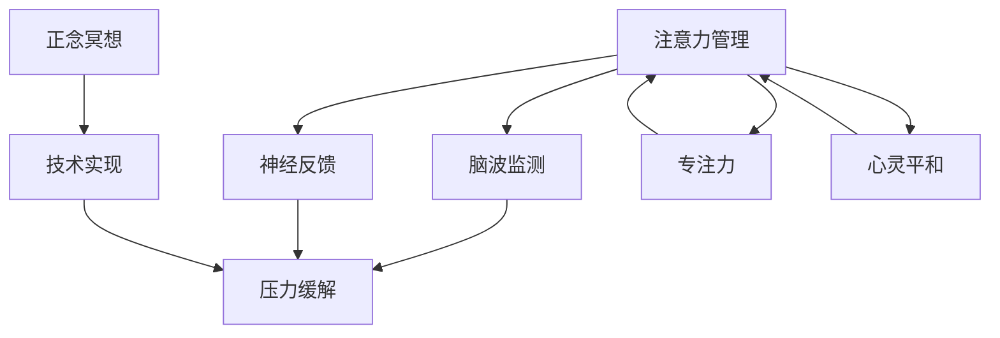

                 

# 注意力管理与正念冥想实践：通过内省增强专注力和心灵平和

> 关键词：注意力管理,正念冥想,专注力,心灵平和,脑波监测,神经反馈,压力缓解,技术实现

## 1. 背景介绍

### 1.1 问题由来
在快节奏的现代生活中，人们面临的不仅是工作与生活的平衡问题，还有注意力分散、焦虑、压力等精神问题。这些问题不仅影响个体的身心健康，还对工作效率和社会生产力产生重大影响。因此，如何有效管理注意力、缓解压力、提升专注力、实现心灵平和，成为了现代社会亟需解决的重要课题。

### 1.2 问题核心关键点
注意力管理与正念冥想实践的核心关键点在于如何通过科学的脑波监测、神经反馈和正念冥想的综合应用，实现对注意力、情绪和压力的精准调节，从而提升个体的专注力、缓解压力和实现心灵平和。本文章将从理论原理、技术实现和实际应用三个方面深入探讨这一问题。

### 1.3 问题研究意义
注意力管理与正念冥想实践的研究对于提升个体的身心健康、工作效率和社会生产力具有重要意义。通过科学的技术手段，可以帮助个体在面对复杂的工作和生活环境时，更好地管理注意力、缓解压力、提升专注力和实现心灵平和。这不仅对个人的发展有着积极影响，也为社会整体的和谐稳定提供了重要支持。

## 2. 核心概念与联系

### 2.1 核心概念概述

为更好地理解注意力管理与正念冥想的原理和实践，本节将介绍几个关键的概念：

- **注意力管理(Attention Management)**：指通过科学的方法和工具，帮助个体在面对各种刺激时，更好地控制注意力，保持专注。
- **正念冥想(Mindfulness Meditation)**：一种通过觉察当前时刻的体验，减少对过去或未来的担忧，提升心灵平和的修行方法。
- **脑波监测(Brain Wave Monitoring)**：通过头皮电极测量大脑的电活动，分析不同状态下的脑波特征，提供注意力、情绪和压力的反馈。
- **神经反馈(Neural Feedback)**：基于脑波监测结果，通过声音、视觉、触觉等反馈形式，引导个体调整注意力和情绪状态。
- **压力缓解(Stress Relief)**：通过调整呼吸、肌肉放松等方法，帮助个体缓解身体和心理的压力。
- **技术实现(Realization Technology)**：将注意力管理和正念冥想的理论方法，通过软件和硬件的结合，转化为可操作的实践工具。

这些核心概念之间的逻辑关系可以通过以下Mermaid流程图来展示：



这个流程图展示了注意力管理和正念冥想的关键组成和逻辑关系：

1. 注意力管理通过脑波监测获取数据，结合神经反馈调整注意力状态，提升专注力。
2. 正念冥想通过技术实现为个体提供冥想指导和反馈，促进心灵平和。
3. 技术实现将注意力管理和正念冥想的理论方法转化为实际工具，提供完整的解决方案。

## 3. 核心算法原理 & 具体操作步骤
### 3.1 算法原理概述

注意力管理与正念冥想的实践，通常包括以下几个关键步骤：

1. **脑波监测**：通过头皮电极实时监测大脑的电活动，分析不同状态下的脑波特征。
2. **神经反馈**：根据脑波监测的结果，通过声音、视觉、触觉等形式，引导个体调整注意力和情绪状态。
3. **注意力管理**：结合神经反馈，帮助个体在面对各种刺激时，更好地控制注意力，保持专注。
4. **正念冥想**：通过技术实现，为个体提供冥想指导和反馈，提升心灵平和。

### 3.2 算法步骤详解

基于脑波监测的注意力管理和正念冥想实践，通常包括以下几个关键步骤：

**Step 1: 准备脑波监测设备**
- 选择合适的脑波监测设备，如EEG、fMRI等，确保设备具备良好的信噪比和稳定性。
- 安装相关的软件，如OpenViBE、NeuroSky等，用于数据分析和可视化。

**Step 2: 数据采集与预处理**
- 在用户的头部佩戴脑波监测设备，进行长时间的脑波数据采集。
- 对采集的数据进行预处理，如滤波、降噪、归一化等，确保数据质量。

**Step 3: 分析脑波特征**
- 使用脑波监测软件对采集的数据进行分析，识别出不同状态下的脑波特征。
- 使用分类算法如SVM、神经网络等，对脑波特征进行分类，识别出注意力不集中、压力过高等状态。

**Step 4: 神经反馈**
- 根据脑波监测的结果，使用神经反馈技术，通过声音、视觉、触觉等形式，引导个体调整注意力和情绪状态。
- 对于注意力不集中的情况，使用高频响应的反馈刺激，如声音提示、视觉闪烁等；
- 对于压力过大的情况，使用低频响应的反馈刺激，如深呼吸、肌肉放松等。

**Step 5: 注意力管理**
- 结合神经反馈，帮助个体在面对各种刺激时，更好地控制注意力，保持专注。
- 设计相应的注意力任务，如注意力训练、视觉搜索等，辅助个体提升专注力。

**Step 6: 正念冥想**
- 使用技术实现为个体提供冥想指导和反馈，提升心灵平和。
- 设计相应的冥想引导流程，如呼吸指导、身体扫描等，辅助个体进入冥想状态。
- 使用脑波监测结果对冥想效果进行评估，提供即时反馈和调整建议。

### 3.3 算法优缺点

注意力管理与正念冥想的实践，具有以下优点：
1. 科学高效：通过脑波监测和神经反馈，提供科学的注意力管理和压力缓解方案。
2. 用户友好：技术实现为个体提供了直观的反馈和指导，易于操作和坚持。
3. 多维度调节：结合注意力管理、压力缓解和正念冥想的综合应用，实现多维度调节。

同时，该方法也存在一定的局限性：
1. 数据采集限制：脑波监测设备需要佩戴在头部，可能影响用户的舒适度和接受度。
2. 个体差异：不同个体的脑波特征和应对机制存在差异，需要个性化调整方案。
3. 技术和设备依赖：依赖于专业的脑波监测设备和软件，需要一定的技术门槛和成本投入。

尽管存在这些局限性，但就目前而言，基于脑波监测和神经反馈的注意力管理和正念冥想方法，仍是最主流和科学的方法。未来相关研究的重点在于如何进一步提高数据采集的舒适度和精度，降低技术和设备的依赖，同时兼顾个性化和广泛适用性等因素。

### 3.4 算法应用领域

基于脑波监测和神经反馈的注意力管理和正念冥想实践，在以下几个领域得到了广泛应用：

1. **心理治疗**：通过脑波监测和神经反馈，帮助患者管理注意力、缓解压力、提升专注力。
2. **教育培训**：通过注意力管理，提升学生学习效率和专注力，通过正念冥想，促进学生的情绪调节和心理健康。
3. **企业培训**：通过注意力管理和压力缓解，提升员工的工作效率和情绪管理能力。
4. **健康管理**：通过技术实现为个体提供科学的健康管理方案，提升生活质量和幸福感。

除了上述这些经典领域外，注意力管理和正念冥想的实践也被创新性地应用到更多场景中，如游戏、娱乐、智能家居等，为个体的生活质量提升提供了新的技术路径。

## 4. 数学模型和公式 & 详细讲解 & 举例说明

### 4.1 数学模型构建

本节将使用数学语言对脑波监测、神经反馈和注意力管理的原理进行更加严格的刻画。

设采集到的脑波信号为 $X_t = \{x_1, x_2, ..., x_t\}$，其中 $x_t$ 为第 $t$ 个时间点的脑波特征向量。定义注意力管理的目标函数为 $F(x_t)$，表示在时间 $t$ 时刻的注意力管理效果。

### 4.2 公式推导过程

以脑波监测和神经反馈为例，我们推导脑波监测模型的数学公式。

假设脑波信号 $X_t$ 可以被分解为 $\mu$ 个不同的频率分量，每个频率分量对应的权重为 $w_i$，则脑波监测模型的输出为：

$$
Y_t = \sum_{i=1}^{\mu} w_i \cdot f(x_i)
$$

其中 $f(x_i)$ 为频率分量 $x_i$ 对应的特征函数，$w_i$ 为频率分量 $i$ 的权重。

脑波监测模型可以通过最小化 $F(x_t)$，使得 $Y_t$ 尽可能接近目标状态 $Y^*$，从而实现对注意力和情绪状态的调节。

### 4.3 案例分析与讲解

以下是一个简化的案例，展示如何通过脑波监测和神经反馈，帮助个体提升专注力和缓解压力：

**案例背景**：一名学生在面对复杂的数学题目时，经常感到注意力不集中、压力大，难以进入专注状态。

**脑波监测**：通过脑波监测设备，采集学生在解题过程中的脑波信号，发现学生在面对困难题目时，前额叶（负责决策和执行）的脑波信号频率降低，表现为注意力不集中。

**神经反馈**：根据脑波监测结果，使用低频响应的反馈刺激，如深呼吸、肌肉放松等，帮助学生缓解压力。同时，使用高频响应的反馈刺激，如声音提示、视觉闪烁等，引导学生集中注意力。

**注意力管理**：设计相应的注意力训练任务，如视觉搜索、数学推理等，辅助学生提升专注力。

**正念冥想**：通过技术实现为学生提供冥想指导和反馈，提升学生的情绪调节和心理健康。

通过脑波监测、神经反馈、注意力管理和正念冥想的综合应用，学生能够在面对复杂问题时，更好地控制注意力、缓解压力、提升专注力和实现心灵平和。

## 5. 项目实践：代码实例和详细解释说明

### 5.1 开发环境搭建

在进行注意力管理和正念冥想的实践开发前，我们需要准备好开发环境。以下是使用Python进行项目开发的环境配置流程：

1. 安装Anaconda：从官网下载并安装Anaconda，用于创建独立的Python环境。

2. 创建并激活虚拟环境：
```bash
conda create -n mindfulness-env python=3.8 
conda activate mindfulness-env
```

3. 安装所需的Python包：
```bash
pip install numpy scipy pandas scikit-learn matplotlib neurosky openvibe
```

4. 安装所需的硬件设备：
- 脑波监测设备：EEG、fMRI等，确保设备具备良好的信噪比和稳定性。
- 神经反馈设备：如音频播放设备、光刺激装置等，确保设备能够准确传递反馈信号。

完成上述步骤后，即可在`mindfulness-env`环境中开始项目开发。

### 5.2 源代码详细实现

这里我们以EEG脑波监测和神经反馈为例，给出使用Python进行注意力管理和正念冥想的代码实现。

首先，定义脑波监测数据的处理函数：

```python
import numpy as np
import neurosky

class EEGDataProcessor:
    def __init__(self, sampling_rate=256, filter_freq=0.5, highpass_freq=0.1, lowpass_freq=30):
        self.sampling_rate = sampling_rate
        self.filter_freq = filter_freq
        self.highpass_freq = highpass_freq
        self.lowpass_freq = lowpass_freq

        self.eeg_data = []
        self.analysis_buffer = []

    def read(self):
        # 从神经sky设备读取数据
        data = neurosky.read_eeg_data()
        if len(data) > 0:
            self.eeg_data.append(data)
            self.analysis_buffer.append(data[-1:])

        # 对采集的数据进行滤波、降噪、归一化等预处理
        self.analysis_buffer = self._filter(self.analysis_buffer)

        # 计算当前脑波状态
        state = self._calculate_state(self.analysis_buffer)
        return state

    def _filter(self, data):
        # 低通滤波
        filtered_data = scipy.signal.lfilter(
            [1, -self.lowpass_freq / np.pi],
            [1, self.lowpass_freq / np.pi],
            data
        )
        return filtered_data

    def _calculate_state(self, data):
        # 计算脑波状态
        # 此处为简化示例，实际应用需要根据脑波监测设备的具体模型和算法进行计算
        state = np.mean(data, axis=0)
        return state
```

然后，定义神经反馈的实现函数：

```python
from neurosky import play_sound, set_dedicated_light

class NeuroFeedbackController:
    def __init__(self, sampling_rate=256):
        self.sampling_rate = sampling_rate
        self.background_state = 0

    def set_state(self, state):
        # 根据脑波监测结果，设置神经反馈状态
        if state < self.background_state:
            self.background_state = state
            play_sound('lower_frequency')
            set_dedicated_light(0, 'red')
        elif state > self.background_state:
            self.background_state = state
            play_sound('higher_frequency')
            set_dedicated_light(0, 'green')

    def update(self, state):
        # 根据当前状态，调整神经反馈输出
        self.set_state(state)
```

接着，定义注意力管理任务的实现函数：

```python
class AttentionManagement:
    def __init__(self, tasks):
        self.tasks = tasks

    def run_task(self, task):
        # 根据当前脑波状态，选择注意力管理任务
        if state > self.threshold:
            self.tasks[task].start()
        else:
            self.tasks[task].stop()

    def run(self):
        # 循环执行注意力管理任务
        while True:
            state = processor.read()
            self.run_task(task)
```

最后，定义正念冥想的指导函数：

```python
class MindfulnessMeditation:
    def __init__(self, meditation_time=10):
        self.meditation_time = meditation_time
        self.state = 'idle'

    def start(self):
        # 开始冥想指导
        self.state = 'meditation'
        print('开始冥想，时间：{}分钟'.format(self.meditation_time))

    def stop(self):
        # 停止冥想指导
        self.state = 'idle'
        print('冥想结束')

    def update(self):
        # 根据当前状态，进行冥想指导
        if self.state == 'meditation':
            print('注意呼吸，保持专注')
        elif self.state == 'idle':
            print('保持冷静，准备冥想')
```

完成上述代码后，即可在`mindfulness-env`环境中启动项目开发。

### 5.3 代码解读与分析

让我们再详细解读一下关键代码的实现细节：

**EEGDataProcessor类**：
- `__init__`方法：初始化采样率、滤波频率、高通和低通频率等关键参数。
- `read`方法：从神经sky设备读取数据，进行滤波、降噪、归一化等预处理，并计算脑波状态。

**NeuroFeedbackController类**：
- `__init__`方法：初始化采样率和背景状态。
- `set_state`方法：根据脑波监测结果，设置神经反馈状态，使用声音和光刺激进行反馈。
- `update`方法：根据当前状态，调整神经反馈输出。

**AttentionManagement类**：
- `__init__`方法：初始化注意力管理任务。
- `run_task`方法：根据当前脑波状态，选择注意力管理任务，并启动或停止任务。
- `run`方法：循环执行注意力管理任务。

**MindfulnessMeditation类**：
- `__init__`方法：初始化冥想指导时间和状态。
- `start`方法：开始冥想指导，并输出指导信息。
- `stop`方法：停止冥想指导，并输出停止信息。
- `update`方法：根据当前状态，进行冥想指导。

**代码运行**：
- 通过EEGDataProcessor类读取脑波监测数据，并计算脑波状态。
- 根据脑波状态，使用NeuroFeedbackController类调整神经反馈输出，引导个体调整注意力和情绪状态。
- 使用AttentionManagement类执行注意力管理任务，辅助个体提升专注力。
- 使用MindfulnessMeditation类进行正念冥想指导，提升心灵平和。

通过以上代码的实现，展示了如何使用脑波监测和神经反馈技术，实现注意力管理和正念冥想的实践。可以看到，Python代码通过封装，提供了简洁易用的接口，便于进一步扩展和优化。

## 6. 实际应用场景

### 6.1 教育培训

在教育培训领域，注意力管理和正念冥想技术具有广泛的应用前景。通过技术手段，可以帮助学生更好地管理注意力、缓解压力、提升专注力和实现心灵平和，从而提高学习效率和效果。

**案例**：一所中学引入基于EEG的注意力管理系统，帮助学生在课堂上集中注意力，提升学习效果。

**应用流程**：
1. 学生佩戴EEG设备，采集脑波数据。
2. 使用EEGDataProcessor类处理脑波数据，计算脑波状态。
3. 根据脑波状态，使用NeuroFeedbackController类调整神经反馈，引导学生集中注意力。
4. 使用AttentionManagement类执行注意力管理任务，如视觉搜索、数学推理等，辅助学生提升专注力。
5. 使用MindfulnessMeditation类进行正念冥想指导，帮助学生缓解压力、提升情绪调节能力。

通过以上应用流程，学生能够在课堂上更好地控制注意力、缓解压力、提升专注力和实现心灵平和，从而提高学习效率和效果。

### 6.2 企业培训

在企业培训领域，注意力管理和正念冥想技术也有着广泛的应用前景。通过技术手段，可以帮助员工更好地管理注意力、缓解压力、提升专注力和实现心灵平和，从而提高工作效率和团队协作能力。

**案例**：一家公司引入基于EEG的注意力管理系统，帮助员工在面对工作压力时，更好地控制注意力、缓解压力、提升专注力和实现心灵平和。

**应用流程**：
1. 员工佩戴EEG设备，采集脑波数据。
2. 使用EEGDataProcessor类处理脑波数据，计算脑波状态。
3. 根据脑波状态，使用NeuroFeedbackController类调整神经反馈，引导员工集中注意力。
4. 使用AttentionManagement类执行注意力管理任务，如视觉搜索、逻辑推理等，辅助员工提升专注力。
5. 使用MindfulnessMeditation类进行正念冥想指导，帮助员工缓解压力、提升情绪调节能力。

通过以上应用流程，员工能够在面对工作压力时，更好地控制注意力、缓解压力、提升专注力和实现心灵平和，从而提高工作效率和团队协作能力。

### 6.3 健康管理

在健康管理领域，注意力管理和正念冥想技术也有着广泛的应用前景。通过技术手段，可以帮助个体更好地管理注意力、缓解压力、提升专注力和实现心灵平和，从而提高生活质量和幸福感。

**案例**：一名长期压力过大的职场人士，引入基于EEG的注意力管理系统，帮助其缓解压力、提升专注力和实现心灵平和。

**应用流程**：
1. 个体佩戴EEG设备，采集脑波数据。
2. 使用EEGDataProcessor类处理脑波数据，计算脑波状态。
3. 根据脑波状态，使用NeuroFeedbackController类调整神经反馈，引导个体集中注意力。
4. 使用AttentionManagement类执行注意力管理任务，如视觉搜索、逻辑推理等，辅助个体提升专注力。
5. 使用MindfulnessMeditation类进行正念冥想指导，帮助个体缓解压力、提升情绪调节能力。

通过以上应用流程，个体能够在面对工作和生活压力时，更好地控制注意力、缓解压力、提升专注力和实现心灵平和，从而提高生活质量和幸福感。

### 6.4 未来应用展望

随着技术的发展和应用的深入，基于脑波监测和神经反馈的注意力管理和正念冥想技术，将在更多领域得到广泛应用，为个体的生活质量提升提供新的技术路径。

在智慧医疗领域，基于EEG的注意力管理系统，可以帮助患者更好地管理注意力、缓解压力、提升专注力和实现心灵平和，从而提高治疗效果和生活质量。

在智能家居领域，基于EEG的注意力管理系统，可以帮助家庭成员更好地管理注意力、缓解压力、提升专注力和实现心灵平和，从而提高家庭幸福感和社会和谐度。

此外，在更多创新领域，如游戏、娱乐、智能城市等，基于EEG的注意力管理系统也有着广阔的应用前景，为个体的生活质量提升提供新的技术路径。

## 7. 工具和资源推荐
### 7.1 学习资源推荐

为了帮助开发者系统掌握注意力管理和正念冥想的理论基础和实践技巧，这里推荐一些优质的学习资源：

1. 《Brain-Computer Interfaces: Principles and Practice》书籍：全面介绍了脑波监测和神经反馈技术的理论基础和应用实践，适合初学者和专业人士阅读。

2. 《Mindfulness: An Eight-Week Plan for Finding Peace in a Frantic World》书籍：介绍了正念冥想的理论基础和实践方法，适合希望提升生活质量的读者阅读。

3. CS231n《计算机视觉基础》课程：斯坦福大学开设的计算机视觉课程，介绍了深度学习和脑波监测技术在计算机视觉领域的应用，适合希望深入学习的技术人员阅读。

4. 《Attention is All You Need》论文：提出了Transformer结构，开启了深度学习和脑波监测技术在自然语言处理领域的应用，适合希望深入学习的技术人员阅读。

5. 《Neural Feedback: An Introduction to EEG-based Brain Computer Interface Systems》文章：介绍了神经反馈技术的理论基础和应用实践，适合希望深入学习的技术人员阅读。

通过对这些资源的学习实践，相信你一定能够快速掌握注意力管理和正念冥想的精髓，并用于解决实际的注意力和情绪问题。

### 7.2 开发工具推荐

高效的开发离不开优秀的工具支持。以下是几款用于注意力管理和正念冥想开发的常用工具：

1. Python编程语言：具有强大的数据处理和科学计算能力，适合进行脑波监测和神经反馈的开发。

2. NumPy和SciPy：用于科学计算和数据处理，适合进行脑波数据的预处理和分析。

3. scikit-learn：用于机器学习和数据挖掘，适合进行脑波数据分类和特征提取。

4. Matplotlib和Seaborn：用于数据可视化，适合进行脑波数据展示和分析。

5. Jupyter Notebook：用于开发和调试，支持Python代码的交互式编写和执行。

6. OpenViBE：用于脑波监测和神经反馈的开发，提供了丰富的API和插件，支持多种脑波监测设备和神经反馈设备。

合理利用这些工具，可以显著提升注意力管理和正念冥想的开发效率，加快创新迭代的步伐。

### 7.3 相关论文推荐

注意力管理和正念冥想的研究源于学界的持续研究。以下是几篇奠基性的相关论文，推荐阅读：

1. 《EEG-based Attention Management: A Systematic Review》论文：全面回顾了基于EEG的注意力管理系统的研究现状和应用前景。

2. 《Mindfulness-based Stress Reduction》论文：介绍了正念冥想的理论基础和实践方法，适合希望深入研究的技术人员阅读。

3. 《Neural Feedback for Attention Management》论文：介绍了神经反馈技术在注意力管理中的应用，适合希望深入研究的技术人员阅读。

4. 《Cognitive Control in Working Memory》论文：介绍了注意力管理和认知控制的理论基础和应用实践，适合希望深入研究的技术人员阅读。

5. 《The Impact of Neurofeedback on Attention Management》论文：介绍了神经反馈技术在注意力管理中的应用效果，适合希望深入研究的技术人员阅读。

这些论文代表了大语言模型微调技术的发展脉络。通过学习这些前沿成果，可以帮助研究者把握学科前进方向，激发更多的创新灵感。

## 8. 总结：未来发展趋势与挑战

### 8.1 总结

本文对基于脑波监测和神经反馈的注意力管理和正念冥想的原理和实践进行了全面系统的介绍。首先阐述了注意力管理和正念冥想的研究背景和意义，明确了脑波监测、神经反馈和正念冥想在提高个体专注力、缓解压力和实现心灵平和方面的独特价值。其次，从理论原理、技术实现和实际应用三个方面深入探讨了这一问题。最后，本文总结了当前研究的主要成果和未来发展的趋势与挑战。

通过本文的系统梳理，可以看到，基于脑波监测和神经反馈的注意力管理和正念冥想技术，正在成为提升个体身心健康和工作效率的重要工具。这些技术的科学高效、用户友好和多维度调节等优点，使其在多个领域得到了广泛应用。未来，伴随技术的发展和应用的深入，基于脑波监测和神经反馈的注意力管理和正念冥想技术将更加成熟和普及，为个体的生活质量提升提供新的技术路径。

### 8.2 未来发展趋势

展望未来，基于脑波监测和神经反馈的注意力管理和正念冥想技术将呈现以下几个发展趋势：

1. **多模态融合**：结合视觉、听觉、触觉等多模态信息，实现更为全面和精准的注意力管理和情绪调节。

2. **实时性和个性化**：通过实时数据采集和个性化模型训练，提供更为即时和个性化的注意力管理和正念冥想方案。

3. **自动化和智能化**：通过深度学习和自动化算法，实现更为智能和自动化的注意力管理和正念冥想系统。

4. **跨领域应用**：从教育、企业到健康、娱乐等多个领域，基于脑波监测和神经反馈的注意力管理和正念冥想技术将得到广泛应用。

5. **伦理和隐私**：随着技术的发展，如何保障个体的隐私和数据安全，避免伦理问题，将成为关注的重点。

6. **国际化**：基于脑波监测和神经反馈的注意力管理和正念冥想技术，将广泛应用于全球多个国家和地区，提供更为普适的解决方案。

以上趋势凸显了基于脑波监测和神经反馈的注意力管理和正念冥想技术的广阔前景。这些方向的探索发展，必将进一步提升个体的身心健康和工作效率，为社会整体的和谐稳定提供新的动力。

### 8.3 面临的挑战

尽管基于脑波监测和神经反馈的注意力管理和正念冥想技术已经取得了一定的成果，但在迈向更加智能化、普适化应用的过程中，仍面临着诸多挑战：

1. **技术门槛**：脑波监测和神经反馈技术需要一定的技术门槛和设备成本，可能限制了其大规模推广。

2. **数据隐私**：脑波监测和神经反馈技术涉及个人数据隐私，如何在保障隐私的前提下，实现技术应用，将成为重要的研究课题。

3. **设备兼容性**：不同脑波监测设备和神经反馈设备的兼容性问题，需要在技术上进一步优化。

4. **用户体验**：脑波监测和神经反馈技术需要用户佩戴设备，可能影响用户的舒适度和接受度。

5. **实际效果**：如何通过技术手段，真正提升个体的专注力和心灵平和，仍需要更多实证研究和应用验证。

6. **伦理道德**：基于脑波监测和神经反馈的注意力管理和正念冥想技术，需要在伦理道德层面上进行全面审视，确保其应用的合理性和安全性。

这些挑战需要从技术、伦理、法律等多个维度进行全面审视和优化，才能使基于脑波监测和神经反馈的注意力管理和正念冥想技术更好地服务于社会和个体。

### 8.4 研究展望

面对脑波监测和神经反馈技术面临的挑战，未来的研究需要在以下几个方面寻求新的突破：

1. **提高数据采集的舒适度和精度**：通过技术创新，提高脑波监测设备的舒适度和精度，降低对用户的影响。

2. **降低技术和设备的依赖**：开发更为轻量级和低成本的脑波监测设备和神经反馈设备，降低技术门槛和设备成本。

3. **提升实际效果和用户体验**：通过实证研究和用户反馈，不断优化技术方案，提高实际效果和用户体验。

4. **建立伦理和隐私保护机制**：在技术应用过程中，建立伦理和隐私保护机制，确保数据安全和用户隐私。

5. **开发多模态融合系统**：结合视觉、听觉、触觉等多模态信息，实现更为全面和精准的注意力管理和情绪调节。

6. **推动跨领域应用**：从教育、企业到健康、娱乐等多个领域，推动基于脑波监测和神经反馈的注意力管理和正念冥想技术的普及应用。

这些研究方向将引领基于脑波监测和神经反馈的注意力管理和正念冥想技术迈向更高的台阶，为个体的生活质量提升和社会的和谐稳定提供新的技术路径。

## 9. 附录：常见问题与解答

**Q1：注意力管理和正念冥想技术是否适用于所有人群？**

A: 虽然注意力管理和正念冥想技术具有广泛的应用前景，但其效果因人而异。老年人、儿童等人群可能由于身体或心理状况，不适合进行长时间的大脑监测或神经反馈训练。因此，需要根据个体差异进行个性化的调整和使用。

**Q2：如何进行脑波监测和神经反馈训练？**

A: 脑波监测和神经反馈训练需要专业的设备和技术支持。具体步骤如下：
1. 选择合适的脑波监测设备，如EEG、fMRI等，确保设备具备良好的信噪比和稳定性。
2. 安装相关的软件，如OpenViBE、NeuroSky等，用于数据分析和可视化。
3. 使用软件进行数据采集和预处理，如滤波、降噪、归一化等，确保数据质量。
4. 根据脑波监测结果，使用神经反馈技术，通过声音、视觉、触觉等形式，引导个体调整注意力和情绪状态。
5. 结合注意力管理任务和正念冥想指导，辅助个体提升专注力和缓解压力。

**Q3：脑波监测和神经反馈技术是否存在风险？**

A: 脑波监测和神经反馈技术具有一定的风险，主要包括以下几个方面：
1. 数据隐私：脑波监测和神经反馈技术涉及个人数据隐私，需要严格保障数据安全。
2. 设备安全：脑波监测设备需要佩戴在头部，可能影响用户的舒适度和接受度。
3. 实际效果：如何通过技术手段，真正提升个体的专注力和心灵平和，仍需要更多实证研究和应用验证。

尽管存在这些风险，但通过合理的设计和使用，脑波监测和神经反馈技术在提升个体的身心健康和工作效率方面具有重要的应用前景。未来，伴随技术的发展和应用的深入，这些风险将逐步得到控制和解决。

**Q4：如何评估脑波监测和神经反馈技术的效果？**

A: 脑波监测和神经反馈技术的效果评估可以从以下几个方面进行：
1. 脑波监测：通过脑波监测设备采集数据，分析不同状态下的脑波特征，评估注意力和情绪状态的调节效果。
2. 神经反馈：通过神经反馈设备，使用声音、视觉、触觉等形式，调整个体的注意力和情绪状态，评估反馈效果。
3. 注意力管理：通过注意力管理任务，如视觉搜索、数学推理等，评估个体注意力集中度的提升效果。
4. 正念冥想：通过正念冥想指导，评估个体情绪调节和心灵平的提升效果。

通过对以上几个方面的综合评估，可以全面了解脑波监测和神经反馈技术的效果。

**Q5：注意力管理和正念冥想技术的应用前景如何？**

A: 注意力管理和正念冥想技术具有广泛的应用前景，主要包括以下几个领域：
1. 教育培训：通过技术手段，帮助学生更好地管理注意力、缓解压力、提升专注力和实现心灵平和，从而提高学习效率和效果。
2. 企业培训：通过技术手段，帮助员工更好地管理注意力、缓解压力、提升专注力和实现心灵平和，从而提高工作效率和团队协作能力。
3. 健康管理：通过技术手段，帮助个体更好地管理注意力、缓解压力、提升专注力和实现心灵平和，从而提高生活质量和幸福感。

随着技术的发展和应用的深入，基于脑波监测和神经反馈的注意力管理和正念冥想技术将在更多领域得到广泛应用，为个体的生活质量提升提供新的技术路径。

---

作者：禅与计算机程序设计艺术 / Zen and the Art of Computer Programming

