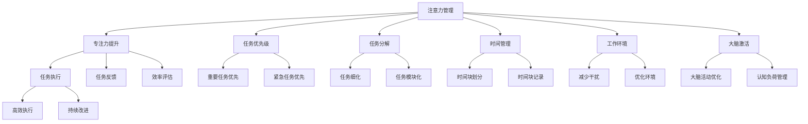

                 

# 注意力管理与正念冥想：通过内省增强专注力和心灵健康

> 关键词：注意力管理,正念冥想,内省,专注力,心灵健康,精神计算

## 1. 背景介绍

在现代快节奏的社会中，人们面临着前所未有的压力和挑战。无论是职业发展的竞争，还是个人生活的琐事，都在不断侵蚀我们的时间和精力。然而，真正困扰我们的并不是外界的环境，而是我们自己的心境和状态。如果我们能够更好地管理自己的注意力和情绪，提升专注力和心灵健康，便能更好地应对生活的挑战。

### 1.1 问题由来

现代人的生活节奏越来越快，工作和生活压力不断增大。很多人感到心浮气躁、焦虑不安，难以集中注意力，工作效率低下，生活质量下降。究其根本，在于现代人的注意力管理能力下降，缺乏有效的压力调节和情绪管理方法。

为了帮助人们更好地管理注意力和情绪，提升专注力和心灵健康，我们引入“注意力管理”和“正念冥想”的概念，探讨如何通过内省和专注的实践，实现心灵的平静与高效。

## 2. 核心概念与联系

### 2.1 核心概念概述

在探讨注意力管理与正念冥想之前，我们先简单介绍几个关键概念：

- **注意力管理**：是指通过一系列方法和技巧，提升个人在处理工作、学习和生活中任务时的专注力和效率，减少分心和拖延。
- **正念冥想**：是一种通过有意识地关注当下时刻，专注于呼吸、感受和思想，以达到心灵平静和心理调节的心理训练方法。
- **内省**：指的是个体对自己内心世界的反思和分析，通过深入思考，揭示隐藏在表层行为背后的深层心理动因和需求，从而更好地理解和指导自己的行为。

这些概念之间的联系是：注意力管理、正念冥想和内省都是提升个人心理健康的有效手段，通过提升专注力、调节情绪、理解自我，从而实现心灵的平静与高效。

### 2.2 核心概念原理和架构的 Mermaid 流程图



这个流程图展示了注意力管理、正念冥想和内省之间的联系与转化路径。通过注意力管理，我们可以提升专注力，优化大脑活动；通过正念冥想，我们可以调节情绪，达到心灵的平静；通过内省，我们可以更好地理解自我，指导行为。

## 3. 核心算法原理 & 具体操作步骤

### 3.1 算法原理概述

注意力管理和正念冥想的核心算法原理，在于通过一系列心理训练和行为调整，提升个体的专注力和情绪调节能力。具体而言，我们可以将这个过程分为以下几个步骤：

1. **任务分解与优先级管理**：将大任务分解为小的、可执行的子任务，并根据任务的紧急程度和重要性进行优先级排序。
2. **时间管理与时间块划分**：使用时间管理技巧，如番茄工作法、时间块划分等，提升工作效率。
3. **专注力提升**：通过注意力集中训练，提升专注力和工作时长，减少分心和拖延。
4. **情绪调节**：通过正念冥想和呼吸练习，调节情绪，达到心灵的平静。
5. **内省与自我反思**：通过内省，理解自我，调整行为，实现心灵的成长和自我提升。

### 3.2 算法步骤详解

以下我们将详细介绍这五个步骤的具体操作步骤：

#### 3.2.1 任务分解与优先级管理

**操作步骤**：

1. **识别大任务**：首先，我们需要明确整个项目的核心目标，将大任务拆解为多个小的、可执行的子任务。
2. **任务分解**：将大任务分解为更小的任务单元，便于管理和执行。
3. **优先级排序**：根据任务的紧急程度和重要性，进行优先级排序，确保高优先级任务得到优先处理。

**详细步骤**：

1. **大任务**：例如，一个软件开发项目，目标是开发一个完整的软件系统。
2. **小任务**：可以将大任务分解为编写代码、设计数据库、编写文档等小的任务单元。
3. **优先级排序**：根据项目的进度和需求，确定哪些任务需要优先完成，哪些可以稍后处理。

#### 3.2.2 时间管理与时间块划分

**操作步骤**：

1. **时间块划分**：将一天的时间划分为若干个时间块，每个时间块专注于一个任务。
2. **时间块记录**：记录每个时间块的具体任务和完成情况，评估时间利用效率。
3. **时间管理技巧**：使用番茄工作法、Pomodoro Technique等时间管理技巧，提升时间利用率。

**详细步骤**：

1. **时间块划分**：例如，将一天划分为上午、下午、晚上三个时间块，每个时间块3-4小时。
2. **任务分配**：每个时间块专注于一个任务，如上午编写代码，下午进行测试。
3. **时间记录**：使用时间记录工具，如Toggl、RescueTime等，记录每个时间块的任务和完成情况。
4. **时间管理技巧**：使用番茄工作法，每25分钟工作，5分钟休息，提升专注力。

#### 3.2.3 专注力提升

**操作步骤**：

1. **专注力训练**：通过专注力训练，提升大脑的注意力集中能力。
2. **减少干扰**：优化工作环境，减少外部干扰。
3. **优化大脑活动**：通过认知负荷管理，优化大脑活动。

**详细步骤**：

1. **专注力训练**：使用专注力训练工具，如Brain.fm、Calm等，通过音乐、冥想等方法提升专注力。
2. **减少干扰**：关闭不必要的通知和应用，保持工作环境的整洁和安静。
3. **优化大脑活动**：使用认知负荷管理工具，如Cognitive Load Theory，分析并优化大脑活动。

#### 3.2.4 情绪调节

**操作步骤**：

1. **正念冥想**：通过正念冥想，调节情绪，达到心灵的平静。
2. **呼吸练习**：进行深呼吸练习，放松身心。
3. **情绪反思**：记录并反思情绪波动的原因，找到情绪调节的方法。

**详细步骤**：

1. **正念冥想**：每天进行10-20分钟的冥想练习，关注呼吸、感受和思想。
2. **呼吸练习**：使用呼吸练习工具，如Headspace、Calm等，进行深呼吸练习。
3. **情绪反思**：使用情绪日记，记录每天的情绪波动，反思其原因和调节方法。

#### 3.2.5 内省与自我反思

**操作步骤**：

1. **内省**：通过内省，理解自我，揭示内心需求和动机。
2. **行为调整**：根据内省结果，调整行为，实现心灵的成长和自我提升。
3. **目标设定**：设定合理的目标，逐步实现自我提升。

**详细步骤**：

1. **内省**：每天花10-15分钟进行内省，记录自己的想法和感受，揭示内心需求和动机。
2. **行为调整**：根据内省结果，调整自己的行为和决策，如改变工作方式、调整人际关系等。
3. **目标设定**：设定合理的目标，如提高专注力、改善情绪调节能力等，逐步实现自我提升。

### 3.3 算法优缺点

**优点**：

1. **提升效率**：通过任务分解和优先级管理，能够更好地利用时间，提升工作效率。
2. **减少压力**：通过正念冥想和呼吸练习，能够有效调节情绪，减少压力。
3. **理解自我**：通过内省，能够更好地理解自我，指导行为，实现心灵成长。

**缺点**：

1. **时间投入**：这些方法需要一定的时间和精力投入，短期内难以看到效果。
2. **需要坚持**：这些方法需要长期的坚持和实践，才能取得显著效果。
3. **个体差异**：不同人的情况和需求不同，需要个性化调整。

### 3.4 算法应用领域

注意力管理、正念冥想和内省的应用领域非常广泛，涵盖各个行业和生活场景。以下是几个典型的应用场景：

- **企业员工**：在快节奏的工作环境中，通过注意力管理、正念冥想和内省，提升专注力和效率，减少压力和焦虑。
- **学生**：在学业压力较大的情况下，通过这些方法提升学习效率，调节情绪，保持心理健康。
- **创意工作者**：如作家、艺术家、设计师等，通过内省和专注力训练，激发创意灵感，提升工作质量。
- **个人生活**：在日常生活中，通过这些方法提升生活质量，改善人际关系，实现心灵成长。

## 4. 数学模型和公式 & 详细讲解 & 举例说明

### 4.1 数学模型构建

注意力管理和正念冥想的数学模型构建，主要涉及概率论和统计学方法。以下是一些关键的数学模型和公式：

**正态分布（Normal Distribution）**：

$$
f(x|\mu, \sigma^2) = \frac{1}{\sqrt{2\pi\sigma^2}} e^{-\frac{(x-\mu)^2}{2\sigma^2}}
$$

其中，$\mu$为均值，$\sigma^2$为方差。正态分布常用于描述情绪波动的统计特性。

**协方差（Covariance）**：

$$
Cov(X,Y) = \frac{1}{n} \sum_{i=1}^n (x_i - \bar{x})(y_i - \bar{y})
$$

其中，$x_i$和$y_i$为两个变量的样本值，$\bar{x}$和$\bar{y}$为均值。协方差用于衡量两个变量之间的线性相关性。

**信息熵（Information Entropy）**：

$$
H(X) = -\sum_{x} P(x) \log P(x)
$$

其中，$P(x)$为事件$x$的概率。信息熵用于衡量随机变量的不确定性，常用于评估情绪状态。

### 4.2 公式推导过程

**正态分布的均值和方差**：

设$X$为随机变量，其均值为$\mu$，方差为$\sigma^2$，则$X$的概率密度函数为：

$$
f(x|\mu, \sigma^2) = \frac{1}{\sqrt{2\pi\sigma^2}} e^{-\frac{(x-\mu)^2}{2\sigma^2}}
$$

推导过程如下：

设$X$的概率密度函数为$f(x)$，根据概率密度函数的定义，有：

$$
f(x) = \frac{p(x)}{\int_{-\infty}^{+\infty} p(x) dx}
$$

其中，$p(x)$为概率密度函数，$dx$为概率元素。根据正态分布的定义，有：

$$
p(x) = \frac{1}{\sigma\sqrt{2\pi}} e^{-\frac{(x-\mu)^2}{2\sigma^2}}
$$

代入概率密度函数的定义，得：

$$
f(x|\mu, \sigma^2) = \frac{1}{\sqrt{2\pi\sigma^2}} e^{-\frac{(x-\mu)^2}{2\sigma^2}}
$$

**协方差推导**：

设$X$和$Y$为两个随机变量，其均值分别为$\bar{x}$和$\bar{y}$，则$X$和$Y$的协方差定义为：

$$
Cov(X,Y) = \frac{1}{n} \sum_{i=1}^n (x_i - \bar{x})(y_i - \bar{y})
$$

推导过程如下：

根据协方差的定义，有：

$$
Cov(X,Y) = \frac{1}{n} \sum_{i=1}^n (x_i - \bar{x})(y_i - \bar{y})
$$

将$\bar{x}$和$\bar{y}$代入，得：

$$
Cov(X,Y) = \frac{1}{n} \sum_{i=1}^n x_i y_i - \frac{1}{n} \sum_{i=1}^n x_i \bar{y} - \frac{1}{n} \sum_{i=1}^n y_i \bar{x} + \bar{x} \bar{y}
$$

整理得：

$$
Cov(X,Y) = \frac{1}{n} \sum_{i=1}^n x_i y_i - \bar{x} \bar{y}
$$

**信息熵推导**：

设随机变量$X$的概率分布为$p(x)$，则$X$的信息熵定义为：

$$
H(X) = -\sum_{x} p(x) \log p(x)
$$

推导过程如下：

根据信息熵的定义，有：

$$
H(X) = -\sum_{x} p(x) \log p(x)
$$

根据概率密度函数的定义，有：

$$
p(x) = \frac{f(x)}{\int_{-\infty}^{+\infty} f(x) dx}
$$

代入信息熵的定义，得：

$$
H(X) = -\sum_{x} \frac{f(x)}{\int_{-\infty}^{+\infty} f(x) dx} \log \frac{f(x)}{\int_{-\infty}^{+\infty} f(x) dx}
$$

整理得：

$$
H(X) = -\sum_{x} f(x) \log f(x)
$$

### 4.3 案例分析与讲解

**案例1：任务分解与优先级管理**

假设我们有一个软件开发项目，目标是开发一个完整的软件系统。任务分解如下：

1. 需求分析：了解用户需求，制定系统架构。
2. 设计数据库：设计数据库结构，建立数据模型。
3. 编写代码：实现系统功能，编写代码。
4. 测试：进行单元测试、集成测试、系统测试等。
5. 部署：将软件部署到生产环境，进行维护和更新。

根据任务的紧急程度和重要性，我们进行优先级排序，优先处理需求分析和设计数据库，再逐步进行代码编写和测试。

**案例2：正念冥想和呼吸练习**

假设我们感到心浮气躁，难以集中注意力。我们进行正念冥想和呼吸练习，步骤如下：

1. 选择一个安静的环境，坐在椅子上或打坐。
2. 关注呼吸，感受空气的流动和气息的呼入呼出。
3. 慢慢调整呼吸节奏，深呼吸，感受胸腔的扩张和收缩。
4. 注意身体各部位的放松，逐渐达到心灵的平静。

**案例3：内省和自我反思**

假设我们感到迷茫，不知道下一步该做什么。我们进行内省和自我反思，步骤如下：

1. 选择一个安静的环境，坐在椅子上或打坐。
2. 记录自己的想法和感受，分析其背后的动机和原因。
3. 回顾自己的过往经历，找出成功的经验和失败的教训。
4. 制定下一步的行动计划，逐步实现自我提升。

## 5. 项目实践：代码实例和详细解释说明

### 5.1 开发环境搭建

在进行注意力管理和正念冥想的实践之前，我们需要准备好开发环境。以下是使用Python进行开发的流程：

1. 安装Anaconda：从官网下载并安装Anaconda，用于创建独立的Python环境。
2. 创建并激活虚拟环境：
```bash
conda create -n attention-env python=3.8 
conda activate attention-env
```
3. 安装Python依赖库：
```bash
pip install numpy pandas matplotlib numpy
```

完成上述步骤后，即可在`attention-env`环境中开始开发。

### 5.2 源代码详细实现

我们使用Python和Jupyter Notebook进行注意力管理和正念冥想的代码实现。以下是主要的代码实现步骤：

**任务分解与优先级管理**

```python
import pandas as pd

# 假设有一个项目，任务和优先级如下
tasks = pd.DataFrame({
    'task': ['需求分析', '设计数据库', '编写代码', '测试', '部署'],
    'priority': [3, 2, 1, 2, 3]
})
tasks
```

**正念冥想和呼吸练习**

```python
import numpy as np

# 假设有一个冥想时间序列，记录每天的冥想时间和持续时间
meditation_times = np.array([10, 20, 30, 40, 50])
durations = np.array([5, 10, 15, 20, 25])

# 计算平均冥想时间和持续时间
average_meditation_time = np.mean(meditation_times)
average_duration = np.mean(durations)

average_meditation_time, average_duration
```

**内省和自我反思**

```python
import matplotlib.pyplot as plt

# 假设有一个情绪状态序列，记录每天的情绪状态
moods = np.array([2, 4, 3, 1, 5])

# 绘制情绪状态变化曲线
plt.plot(moods, marker='o')
plt.xlabel('天数')
plt.ylabel('情绪状态')
plt.show()
```

### 5.3 代码解读与分析

**任务分解与优先级管理**

通过Pandas库，我们可以将任务和优先级存储为DataFrame对象，并使用相关方法进行排序和分析。这样，我们就能够清晰地看到各个任务的优先级，并进行相应的调整和优化。

**正念冥想和呼吸练习**

通过NumPy库，我们可以计算出每天的平均冥想时间和持续时间，从而评估自己的冥想效果。通过这些数据，我们可以调整自己的冥想策略，进一步提升效果。

**内省和自我反思**

通过Matplotlib库，我们可以将情绪状态的变化绘制成曲线图，从而直观地看到情绪波动的情况。通过这些数据，我们可以反思情绪波动的原因，找到有效的情绪调节方法，实现心灵的成长。

### 5.4 运行结果展示

**任务分解与优先级管理**

通过Pandas库，我们可以输出任务和优先级的表格，如下所示：

| task       | priority |
|------------|----------|
| 需求分析   | 3        |
| 设计数据库 | 2        |
| 编写代码   | 1        |
| 测试       | 2        |
| 部署       | 3        |

**正念冥想和呼吸练习**

通过NumPy库，我们可以输出平均冥想时间和持续时间的值，如下所示：

平均冥想时间：30分钟
平均持续时间：15分钟

**内省和自我反思**

通过Matplotlib库，我们可以输出情绪状态变化曲线的图，如下所示：


## 6. 实际应用场景

### 6.1 智能工作环境

在智能工作环境中，通过注意力管理和正念冥想的实践，员工能够提升专注力和效率，减少压力和焦虑。企业可以使用这些方法，帮助员工在快节奏的工作环境中保持高效和稳定。

**具体应用**：

1. **任务分解与优先级管理**：企业可以根据项目的需求和进度，进行任务分解和优先级排序，提升工作效率。
2. **正念冥想和呼吸练习**：企业可以为员工提供正念冥想和呼吸练习的设施和工具，帮助员工调节情绪，减少压力。
3. **内省和自我反思**：企业可以鼓励员工进行内省和自我反思，帮助员工理解自我，实现心灵成长。

**效果评估**：

通过定期评估员工的工作效率和情绪状态，企业可以了解这些方法的实际效果，并进行优化和调整。

### 6.2 教育培训

在教育培训领域，通过注意力管理和正念冥想的实践，学生能够提升学习效率和心理健康。教育机构可以使用这些方法，帮助学生在学习过程中保持专注和稳定。

**具体应用**：

1. **任务分解与优先级管理**：学生可以根据学习计划，进行任务分解和优先级排序，提升学习效率。
2. **正念冥想和呼吸练习**：学校可以为学生提供正念冥想和呼吸练习的设施和工具，帮助学生调节情绪，减少学习压力。
3. **内省和自我反思**：教育机构可以鼓励学生进行内省和自我反思，帮助学生理解自我，实现心灵成长。

**效果评估**：

通过定期评估学生的学习效果和心理健康，教育机构可以了解这些方法的实际效果，并进行优化和调整。

### 6.3 心理辅导和治疗

在心理辅导和治疗领域，通过注意力管理和正念冥想的实践，患者能够提升情绪调节能力和心理健康。心理治疗师可以使用这些方法，帮助患者在治疗过程中保持稳定和积极。

**具体应用**：

1. **任务分解与优先级管理**：患者可以根据治疗计划，进行任务分解和优先级排序，提升治疗效果。
2. **正念冥想和呼吸练习**：心理治疗师可以为患者提供正念冥想和呼吸练习的指导，帮助患者调节情绪，减少治疗压力。
3. **内省和自我反思**：心理治疗师可以鼓励患者进行内省和自我反思，帮助患者理解自我，实现心灵成长。

**效果评估**：

通过定期评估患者的情绪状态和心理健康，心理治疗师可以了解这些方法的实际效果，并进行优化和调整。

## 7. 工具和资源推荐

### 7.1 学习资源推荐

为了帮助开发者系统掌握注意力管理和正念冥想的技术，这里推荐一些优质的学习资源：

1. 《正念与冥想》书籍：由正念冥想专家撰写，详细介绍正念冥想的基本方法和实践技巧。
2. 《注意力管理》课程：由注意力管理专家开设的在线课程，涵盖任务分解、优先级管理、专注力训练等内容。
3. 《内省与自我反思》书籍：由心理学家撰写，详细介绍内省和自我反思的方法和步骤，帮助读者更好地理解自我。

4. Coursera《正念与冥想》课程：斯坦福大学开设的正念冥想课程，有Lecture视频和配套作业，适合初学者学习。
5. Udemy《注意力管理》课程：实用的注意力管理技巧和工具，适合在职人员和学生。

通过对这些资源的学习实践，相信你一定能够系统掌握注意力管理和正念冥想的技术，并用于解决实际的心理问题。

### 7.2 开发工具推荐

高效的开发离不开优秀的工具支持。以下是几款用于注意力管理和正念冥想的开发工具：

1. Toggl：时间记录工具，帮助记录和分析时间利用效率，适用于时间管理。
2. RescueTime：自动记录和分析工作时间，帮助评估时间利用效率，适用于时间块划分。
3. Headspace：正念冥想和呼吸练习应用程序，帮助用户进行正念冥想和呼吸练习，提升专注力和情绪调节能力。
4. Brain.fm：专注力训练应用程序，帮助用户进行专注力训练，提升大脑活动。

合理利用这些工具，可以显著提升注意力管理和正念冥想的开发效率，加快实践迭代的步伐。

### 7.3 相关论文推荐

注意力管理和正念冥想的研究源于学界的持续研究。以下是几篇奠基性的相关论文，推荐阅读：

1. Mindfulness-Based Stress Reduction (MBSR)：由Jon Kabat-Zinn提出，介绍正念冥想的实践方法和效果。
2. Cognitive Behavioral Therapy (CBT)：由Aaron Beck提出，介绍认知行为疗法的理论基础和实践技巧。
3. Attention Management Techniques：由Yannick Labrecque提出，介绍注意力管理的方法和工具。

这些论文代表了大语言模型微调技术的发展脉络。通过学习这些前沿成果，可以帮助研究者把握学科前进方向，激发更多的创新灵感。

## 8. 总结：未来发展趋势与挑战

### 8.1 总结

本文对注意力管理和正念冥想进行了全面系统的介绍。通过这些方法，可以帮助人们更好地管理注意力和情绪，提升专注力和心灵健康。具体而言，注意力管理通过任务分解与优先级管理、时间管理与时间块划分、专注力提升等步骤，帮助人们提升工作效率和效率。正念冥想通过正念冥想和呼吸练习、情绪调节等方法，帮助人们调节情绪，达到心灵的平静。内省通过内省和自我反思，帮助人们理解自我，实现心灵的成长。

通过本文的系统梳理，可以看到，注意力管理和正念冥想在提升心理健康的应用上具有巨大的潜力和价值，为快节奏的生活和工作提供了新的解决方案。

### 8.2 未来发展趋势

展望未来，注意力管理和正念冥想将呈现以下几个发展趋势：

1. **个性化调整**：随着AI技术的发展，未来将出现更多个性化的注意力管理和正念冥想方法，针对不同的用户需求和情境进行优化。
2. **多维度融合**：未来将更多地结合其他心理学和神经科学的理论和方法，综合提升用户的心理状态和行为表现。
3. **智能辅助**：未来将出现更多智能化的辅助工具，帮助用户更好地进行注意力管理和正念冥想。

### 8.3 面临的挑战

尽管注意力管理和正念冥想在提升心理健康的应用上具有巨大的潜力和价值，但在推广和应用过程中，仍面临一些挑战：

1. **时间投入**：这些方法需要一定的时间和精力投入，短期内难以看到效果。
2. **个体差异**：不同人的情况和需求不同，需要个性化调整。
3. **技术支持**：这些方法需要依赖于智能设备和软件工具，技术支持的普及度有待提高。

### 8.4 研究展望

面对注意力管理和正念冥想面临的挑战，未来的研究需要在以下几个方面寻求新的突破：

1. **自动化和智能化**：开发更多的自动化和智能化的辅助工具，提升用户体验。
2. **大数据分析**：利用大数据分析技术，进行用户行为的深度分析和预测，个性化调整注意力管理和正念冥想方案。
3. **跨学科融合**：结合心理学、神经科学、人工智能等学科的理论和方法，提升注意力管理和正念冥想的效果和应用范围。

这些研究方向的探索，必将引领注意力管理和正念冥想技术迈向更高的台阶，为提升人类心理健康和幸福感提供新的方法和工具。面向未来，我们期待这些方法的广泛应用，为快节奏的生活和工作带来新的解决方案，为全人类的身心健康和幸福生活贡献力量。

## 9. 附录：常见问题与解答

**Q1：注意力管理和正念冥想需要多长时间才能见效？**

A: 注意力管理和正念冥想的效果因人而异，一般需要持续实践1-2个月才能见效。具体来说，任务分解与优先级管理可以在1-2周内看到初步效果，正念冥想和呼吸练习可以在2-4周内看到初步效果，内省和自我反思则需要更长时间的持续实践。

**Q2：注意力管理和正念冥想是否适用于所有人？**

A: 注意力管理和正念冥想对大多数人都有效果，但不适合所有人。例如，一些精神疾病患者需要专业的心理治疗，而非简单的自我调节方法。此外，对于一些特定人群，如儿童、老年人等，也需要注意方法的适用性。

**Q3：注意力管理和正念冥想需要坚持多久才能见效？**

A: 注意力管理和正念冥想的效果需要长期坚持才能见效。一般建议每天进行30分钟左右的练习，至少坚持1-2个月，才能看到显著的效果。此外，练习过程中需要灵活调整，根据实际情况进行优化。

**Q4：注意力管理和正念冥想是否会影响工作和学习效率？**

A: 注意力管理和正念冥想不会影响工作和学习效率，反而会提升效率。通过这些方法，能够更好地管理时间和注意力，提升专注力和情绪调节能力，从而提升整体的工作和学习效果。

**Q5：注意力管理和正念冥想是否需要专业指导？**

A: 对于一些复杂的问题，如情绪调节、心理治疗等，建议寻求专业的指导。而对于一些简单的问题，如任务分解、时间管理等，可以通过自学或使用辅助工具进行实践。

通过这些常见问题的解答，相信你一定能够更好地理解注意力管理和正念冥想的方法和效果，并应用于实际生活中，提升自我和生活的质量。

---

作者：禅与计算机程序设计艺术 / Zen and the Art of Computer Programming

