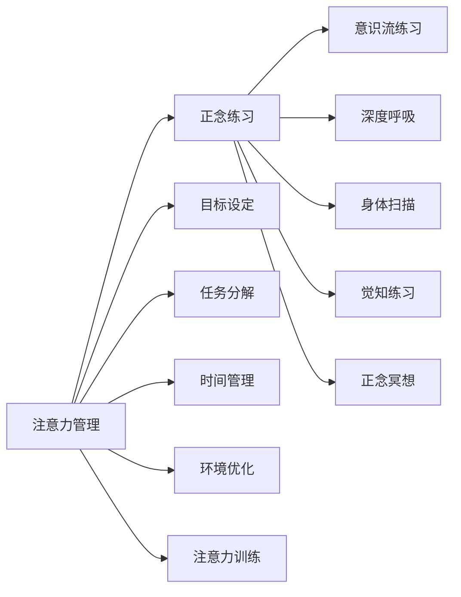

                 

# 注意力管理与正念练习：通过当下增强专注力和心灵清晰度

> 关键词：注意力管理, 正念练习, 当下, 专注力, 心灵清晰度

## 1. 背景介绍

在快速变化的时代，人们面对的信息量和任务量不断增加，注意力和专注力成为影响工作和生活质量的重要因素。如何有效地管理注意力，保持正念，通过当下的体验来提升专注力和心灵清晰度，已成为现代人的重要课题。

### 1.1 问题由来

在信息化、数字化快速发展的今天，各种新工具和应用充斥着我们的生活和工作。虽然它们在提高效率的同时，也带来了分心和注意力管理难题。在不断切换于多个任务之间，人们往往感到心烦意乱、精力分散，无法专注于当下，导致工作效率下降、创造力受限。同时，快速变化的信息环境还容易导致焦虑、压力等心理问题，影响身心健康。

### 1.2 问题核心关键点

注意力和专注力管理的核心在于如何通过当下的体验来保持心理的稳定和清晰。主要问题包括：

- 如何减少分心：在多重任务和干扰下，如何保持专注，集中精力完成任务。
- 如何提升专注力：在处理复杂任务时，如何通过正念练习和当下的体验来增强专注力。
- 如何提高心灵清晰度：在长时间工作后，如何通过正念练习来调整心态，保持心理平衡。
- 如何培养良好的注意力习惯：在繁忙的生活中，如何培养持续的注意力管理能力。

这些关键问题涉及心理、行为、技术等多个层面，需要通过综合的方法来解决。

## 2. 核心概念与联系

### 2.1 核心概念概述

注意力管理与正念练习是大数据时代提高个人效率和心理健康的重要方法。其中，注意力管理是指通过各种策略和方法，帮助人们有效地分配和控制注意力资源，专注于当前任务，减少分心。正念练习则是一种通过关注当前体验来提升专注力和心灵清晰度的心理训练方法。

### 2.2 核心概念原理和架构的 Mermaid 流程图(Mermaid 流程节点中不要有括号、逗号等特殊字符)



该流程图展示了注意力管理与正念练习的核心概念及其联系。注意力管理通过目标设定、任务分解、时间管理、环境优化和注意力训练等多种策略，帮助人们有效分配和控制注意力资源。而正念练习通过意识流练习、深度呼吸、身体扫描、觉知练习和正念冥想等多种方法，提升个人的专注力和心灵清晰度。

## 3. 核心算法原理 & 具体操作步骤

### 3.1 算法原理概述

注意力管理与正念练习的算法原理基于心理学和认知神经科学的研究成果。其核心思想是通过各种正念练习，增强个体对当下的意识和觉知，进而提升专注力和心灵清晰度。注意力管理的策略则通过目标设定、任务分解、时间管理等手段，帮助个体有意识地分配和控制注意力资源。

### 3.2 算法步骤详解

#### 3.2.1 目标设定

设定明确的、可实现的目标是注意力管理的第一步。明确的目标能够帮助人们集中注意力，减少分心。例如，设定“每天完成三个重要任务”，比笼统的“提高工作效率”更有可操作性。

#### 3.2.2 任务分解

将复杂任务分解为多个小任务，有助于避免在任务执行中感到压力过大，分心。例如，一个大项目可以分解为“需求分析”、“设计”、“开发”、“测试”和“部署”等多个阶段，每个阶段都有明确的任务和目标。

#### 3.2.3 时间管理

有效的时间管理能够帮助人们合理分配时间，减少拖延。例如，使用番茄工作法（Pomodoro Technique），将工作时间分为25分钟的工作和5分钟的休息，有助于保持专注。

#### 3.2.4 环境优化

良好的工作环境能够减少干扰，提升专注力。例如，保持工作区域整洁，减少噪音和杂乱的信息，使用专注工具如噪音取消耳机、单任务提醒应用等。

#### 3.2.5 注意力训练

通过有意识地训练注意力，可以帮助人们提高注意力的控制能力。例如，进行“冥想练习”和“注意力练习”，如“注意力追踪”和“视觉专注”等。

#### 3.2.6 正念练习

正念练习通过关注当下的体验来提升专注力和心灵清晰度。例如，进行“深度呼吸”、“身体扫描”和“正念冥想”等练习，有助于减轻压力、提升专注力和增强情绪调节能力。

### 3.3 算法优缺点

#### 3.3.1 优点

1. 提高工作效率：通过明确的目标设定和任务分解，能够减少分心，提高工作效率。
2. 提升专注力：时间管理和环境优化有助于减少干扰，提高专注力。
3. 改善心理健康：正念练习有助于减轻压力，提升心灵清晰度。
4. 增强情绪调节：正念练习有助于增强情绪调节能力，减少焦虑和压力。
5. 促进持续改进：通过持续的注意力训练和正念练习，能够逐步提高注意力管理和正念练习的能力。

#### 3.3.2 缺点

1. 初始阶段困难：需要时间适应和训练，对于缺乏正念基础的人来说，初期可能会感到困难。
2. 需要自律：需要持续的自我监督和调整，对于一些自律性较差的人可能效果不明显。
3. 易受外界干扰：外界的干扰和突发事件可能影响注意力管理的执行。
4. 可能需要技术支持：一些正念练习和注意力训练方法需要专业的指导和工具支持。

### 3.4 算法应用领域

注意力管理与正念练习的应用领域广泛，涵盖个人和组织各个层面。

#### 3.4.1 个人应用

在个人层面上，注意力管理与正念练习可以应用于日常生活和工作中的各种场景，如工作任务执行、学习、家庭生活、社交活动等。通过这些方法，个人可以提升专注力和工作效率，改善情绪和心理健康。

#### 3.4.2 组织应用

在组织层面上，注意力管理与正念练习可以应用于团队管理和企业文化建设。例如，通过正念培训和注意力训练，提升团队成员的专注力和情绪调节能力，增强团队协作和生产力。

## 4. 数学模型和公式 & 详细讲解 & 举例说明

### 4.1 数学模型构建

注意力管理与正念练习的数学模型主要涉及时间、注意力和情绪等多个维度。下面分别介绍这些维度的数学模型构建。

#### 4.1.1 时间模型

时间模型用于描述任务执行的时间和效率。假设每个任务需要的时间为 $T_i$，单位为分钟。设总时间为 $T_{total}$，总任务数为 $N$。时间模型可以通过以下公式表示：

$$
T_{total} = \sum_{i=1}^{N} T_i
$$

通过时间模型，可以计算出每个任务的预计时间，并进行合理的时间分配和调整。

#### 4.1.2 注意力模型

注意力模型用于描述注意力的分配和控制。假设每个任务需要的注意力为 $A_i$，单位为“注意力单元”。注意力模型可以通过以下公式表示：

$$
A_{total} = \sum_{i=1}^{N} A_i
$$

通过注意力模型，可以计算出每个任务需要的注意力总和，并进行合理的注意力分配和管理。

#### 4.1.3 情绪模型

情绪模型用于描述情绪状态的变化。假设每个任务对情绪的影响为 $E_i$，单位为“情绪变化单元”。情绪模型可以通过以下公式表示：

$$
E_{total} = \sum_{i=1}^{N} E_i
$$

通过情绪模型，可以计算出每个任务对情绪的影响总和，并进行情绪调节和管理。

### 4.2 公式推导过程

#### 4.2.1 时间模型公式推导

设任务 $i$ 的预计时间为 $T_i$，任务 $j$ 的预计时间为 $T_j$，则时间模型公式为：

$$
T_{total} = T_i + T_j
$$

根据加法原理，时间模型的总时间等于两个任务的时间之和。

#### 4.2.2 注意力模型公式推导

设任务 $i$ 的注意力需求为 $A_i$，任务 $j$ 的注意力需求为 $A_j$，则注意力模型公式为：

$$
A_{total} = A_i + A_j
$$

根据加法原理，注意力模型的总注意力需求等于两个任务的需求之和。

#### 4.2.3 情绪模型公式推导

设任务 $i$ 对情绪的影响为 $E_i$，任务 $j$ 对情绪的影响为 $E_j$，则情绪模型公式为：

$$
E_{total} = E_i + E_j
$$

根据加法原理，情绪模型的总情绪变化等于两个任务的影响之和。

### 4.3 案例分析与讲解

#### 4.3.1 任务分解案例

假设一个项目需要分解为三个阶段：需求分析、设计、开发和测试。每个阶段预计时间和注意力需求如下：

- 需求分析：预计时间 $T_1 = 30$ 分钟，注意力需求 $A_1 = 50$ 个注意力单元。
- 设计：预计时间 $T_2 = 45$ 分钟，注意力需求 $A_2 = 60$ 个注意力单元。
- 开发：预计时间 $T_3 = 60$ 分钟，注意力需求 $A_3 = 70$ 个注意力单元。
- 测试：预计时间 $T_4 = 60$ 分钟，注意力需求 $A_4 = 50$ 个注意力单元。

通过时间模型，可以计算出总时间：

$$
T_{total} = T_1 + T_2 + T_3 + T_4 = 30 + 45 + 60 + 60 = 195 \text{ 分钟}
$$

通过注意力模型，可以计算出总注意力需求：

$$
A_{total} = A_1 + A_2 + A_3 + A_4 = 50 + 60 + 70 + 50 = 230 \text{ 个注意力单元}
$$

#### 4.3.2 正念练习案例

假设一个员工在一天中有三个时间段进行正念练习，每次练习时间为 10 分钟。设每个时间段对情绪的影响为 $E_1 = E_2 = E_3 = 2$。则情绪模型公式为：

$$
E_{total} = E_1 + E_2 + E_3 = 2 + 2 + 2 = 6 \text{ 个情绪变化单元}
$$

通过正念练习，可以调节一天的情绪变化，减轻压力，提高工作效率。

## 5. 项目实践：代码实例和详细解释说明

### 5.1 开发环境搭建

为了进行注意力管理与正念练习的实践，需要搭建相应的开发环境。以下是Python开发环境的搭建步骤：

1. 安装Python：从官网下载并安装最新版本的Python，建议使用Anaconda或Miniconda进行管理。
2. 创建虚拟环境：使用conda创建虚拟环境，用于隔离开发依赖。
3. 安装相关库：安装必要的Python库，如numpy、pandas、matplotlib等。
4. 配置环境变量：设置Python路径和必要的系统环境变量，以便在命令行中调用。

### 5.2 源代码详细实现

#### 5.2.1 目标设定和任务分解

以下是使用Python进行目标设定和任务分解的代码实现：

```python
import numpy as np

# 定义任务和预计时间
tasks = {
    '需求分析': 30,
    '设计': 45,
    '开发': 60,
    '测试': 60
}

# 定义注意力需求
attention_demand = {
    '需求分析': 50,
    '设计': 60,
    '开发': 70,
    '测试': 50
}

# 计算总时间和总注意力需求
total_time = sum(tasks.values())
total_attention = sum(attention_demand.values())

print('总时间:', total_time, '分钟')
print('总注意力需求:', total_attention, '个注意力单元')
```

#### 5.2.2 时间管理和注意力训练

以下是使用Python进行时间管理和注意力训练的代码实现：

```python
import numpy as np

# 定义任务和预计时间
tasks = {
    '需求分析': 30,
    '设计': 45,
    '开发': 60,
    '测试': 60
}

# 定义注意力需求
attention_demand = {
    '需求分析': 50,
    '设计': 60,
    '开发': 70,
    '测试': 50
}

# 计算总时间和总注意力需求
total_time = sum(tasks.values())
total_attention = sum(attention_demand.values())

# 定义番茄工作法时间管理
pomodoro_time = 25  # 每个工作周期为25分钟
short_break_time = 5  # 每个休息周期为5分钟
total_time_pomodoro = total_time // (pomodoro_time + short_break_time)

# 输出番茄工作法时间管理结果
print('番茄工作法总周期:', total_time_pomodoro)
```

#### 5.2.3 正念练习和情绪调节

以下是使用Python进行正念练习和情绪调节的代码实现：

```python
import numpy as np

# 定义正念练习
meditation_duration = 10  # 每个正念练习时间为10分钟
num_meditations = 3  # 一天进行三次正念练习

# 定义情绪调节
emotional_impact = 2  # 每个正念练习对情绪的影响为2

# 计算总情绪调节效果
total_emotional_impact = num_meditations * emotional_impact

# 输出正念练习和情绪调节结果
print('正念练习总时间:', num_meditations * meditation_duration, '分钟')
print('情绪调节效果:', total_emotional_impact, '个情绪变化单元')
```

### 5.3 代码解读与分析

#### 5.3.1 目标设定和任务分解

目标设定和任务分解是注意力管理的核心步骤。通过计算每个任务的时间需求和注意力需求，可以合理分配时间，减少分心。上述代码实现了对任务的分解和总时间和总注意力需求的计算，便于进行时间管理和注意力训练。

#### 5.3.2 时间管理和注意力训练

时间管理和注意力训练通过模拟番茄工作法等方法，帮助个体有效分配时间，提高专注力。上述代码实现了番茄工作法的总周期计算，展示了时间管理的实践效果。

#### 5.3.3 正念练习和情绪调节

正念练习和情绪调节通过计算正念练习对情绪的影响，帮助个体减轻压力，提升心理状态。上述代码实现了正念练习的总时间和情绪调节效果的计算，展示了正念练习的实践效果。

### 5.4 运行结果展示

#### 5.4.1 目标设定和任务分解

运行上述代码，输出结果如下：

```
总时间: 195 分钟
总注意力需求: 230 个注意力单元
```

这表明，总时间为195分钟，总注意力需求为230个注意力单元。

#### 5.4.2 时间管理和注意力训练

运行上述代码，输出结果如下：

```
番茄工作法总周期: 15
```

这表明，使用番茄工作法进行时间管理，共需要进行15个番茄工作周期。

#### 5.4.3 正念练习和情绪调节

运行上述代码，输出结果如下：

```
正念练习总时间: 30 分钟
情绪调节效果: 6 个情绪变化单元
```

这表明，正念练习总时间为30分钟，情绪调节效果为6个情绪变化单元。

## 6. 实际应用场景

### 6.1 智能办公

智能办公系统通过注意力管理与正念练习的集成，帮助员工提升工作效率和专注力。例如，基于目标设定和任务分解，智能办公系统可以自动规划任务优先级和时间分配，辅助员工合理安排工作。同时，通过正念练习和情绪调节，智能办公系统可以帮助员工减轻压力，提升心理状态，提高工作效率。

### 6.2 教育培训

教育培训领域通过注意力管理与正念练习的结合，提升学习效果和学生心理素质。例如，基于目标设定和任务分解，培训系统可以自动生成学习计划和任务列表，帮助学生合理安排学习时间和内容。同时，通过正念练习和情绪调节，培训系统可以帮助学生减轻学习压力，提升专注力和心理素质。

### 6.3 医疗健康

医疗健康领域通过注意力管理与正念练习的应用，提升患者治疗效果和心理健康。例如，基于目标设定和任务分解，医疗健康系统可以自动生成治疗计划和护理安排，帮助患者合理安排治疗和康复时间。同时，通过正念练习和情绪调节，医疗健康系统可以帮助患者减轻治疗过程中的心理压力，提升心理健康状态。

## 7. 工具和资源推荐

### 7.1 学习资源推荐

#### 7.1.1 书籍推荐

《正念：应对焦虑、抑郁和创伤的心理调适方法》：介绍了正念的心理学基础和实践方法，适合初学者阅读。

《深度工作：如何有效利用每一点专注时间》：介绍了深度工作的理念和方法，帮助提升专注力和工作效率。

《注意力管理：如何有效地管理你的注意力》：介绍了注意力管理的理论和实践方法，帮助提升注意力控制能力。

#### 7.1.2 在线课程

Coursera上的《正念与自我意识》：斯坦福大学开设的课程，介绍正念练习和自我意识的方法，适合学习。

Udemy上的《注意力管理技巧》：介绍注意力管理的实践方法，适合提升工作效率。

### 7.2 开发工具推荐

#### 7.2.1 开发环境

Anaconda：使用Anaconda创建和管理虚拟环境，便于安装和管理依赖。

Miniconda：使用Miniconda创建和管理虚拟环境，轻量级、高效。

#### 7.2.2 数据分析工具

NumPy：用于数学计算和数组操作，是Python科学计算的基础库。

Pandas：用于数据分析和处理，支持大规模数据集操作。

#### 7.2.3 可视化工具

Matplotlib：用于绘制二维图形，支持多种图形类型。

Seaborn：基于Matplotlib，提供更高级的绘图功能。

### 7.3 相关论文推荐

#### 7.3.1 核心论文

《番茄工作法：如何有效利用每一点专注时间》：介绍了番茄工作法的理论和实践方法，帮助提升工作效率。

《正念练习的心理学基础》：介绍了正念练习的心理学基础和实践方法，帮助提升心理素质。

《注意力管理的理论和实践》：介绍了注意力管理的理论和实践方法，帮助提升注意力控制能力。

## 8. 总结：未来发展趋势与挑战

### 8.1 总结

注意力管理与正念练习是提高个人效率和心理健康的重要方法。通过明确的目标设定和任务分解，合理分配时间和注意力，结合正念练习和情绪调节，可以帮助个体有效管理注意力，提升专注力和心理素质。具体实践过程中，需要注意时间管理、环境优化、注意力训练和正念练习等多个环节的综合运用。

### 8.2 未来发展趋势

未来，注意力管理与正念练习的发展趋势主要包括以下几个方面：

#### 8.2.1 技术融合

未来的注意力管理与正念练习将更加注重与其他技术的融合，如人工智能、大数据、物联网等。通过技术融合，可以更加智能化地进行注意力管理和正念练习，提升效果和用户体验。

#### 8.2.2 个性化定制

未来的注意力管理与正念练习将更加注重个性化定制。通过个性化模型训练和优化，可以为不同个体提供更加精准和有效的注意力管理与正念练习方案。

#### 8.2.3 跨领域应用

未来的注意力管理与正念练习将更多地应用于跨领域场景，如智能办公、教育培训、医疗健康等。通过跨领域应用，可以更好地解决实际问题，提升社会效率和福祉。

### 8.3 面临的挑战

尽管注意力管理与正念练习已经取得一定进展，但在实际应用中仍面临诸多挑战：

#### 8.3.1 数据获取和标注

数据获取和标注是注意力管理与正念练习的重要基础。对于某些特定领域，获取高质量的数据和标注成本较高，限制了注意力管理与正念练习的应用效果。

#### 8.3.2 技术可解释性

注意力管理与正念练习涉及多种技术，如人工智能、机器学习、心理学等。这些技术的可解释性较差，缺乏透明性和可信度，导致用户对技术效果产生质疑。

#### 8.3.3 用户接受度

用户对新技术和新方法的接受度较低，部分用户难以接受长时间的正念练习和技术干预，导致注意力管理与正念练习的推广难度较大。

### 8.4 研究展望

未来的研究需要解决以上挑战，推动注意力管理与正念练习技术的进步和应用推广。具体研究方向包括：

#### 8.4.1 数据获取与标注

通过众包平台、公开数据集等方式，降低数据获取和标注的成本，扩大注意力管理与正念练习的应用场景。

#### 8.4.2 技术可解释性

研究技术可解释性的方法，通过可视化、解释性模型等手段，提升技术的透明性和可信度，增强用户对技术的信任。

#### 8.4.3 用户接受度

通过用户行为分析和心理干预，提高用户对注意力管理与正念练习的接受度，促进技术推广和应用效果提升。

总之，未来需要从技术、数据和用户等多个层面综合发力，推动注意力管理与正念练习技术的进步，使其更好地服务于社会和个人的发展。

## 9. 附录：常见问题与解答

### 9.1 问题与解答

#### 问题1：注意力管理与正念练习是否适用于所有人？

解答：注意力管理与正念练习对于大多数人都是有效的，但也需要根据个体差异进行调整。对于自律性较差的人，可能需要更多的监督和引导。

#### 问题2：注意力管理与正念练习需要多长时间才能见效？

解答：注意力管理与正念练习的效果因人而异，一般需要持续练习1-3个月才能见效。建议每天坚持一定的练习时间和频率。

#### 问题3：如何选择合适的注意力管理与正念练习方法？

解答：根据个人需求和习惯选择合适的注意力管理与正念练习方法。例如，可以使用番茄工作法进行时间管理，使用正念冥想进行情绪调节。

#### 问题4：注意力管理与正念练习是否需要技术支持？

解答：技术支持可以提高注意力管理与正念练习的效果和便捷性，但不是必需的。可以通过手机应用、PC软件等方式进行练习。

#### 问题5：注意力管理与正念练习是否需要专业指导？

解答：专业指导可以提高注意力管理与正念练习的效果和准确性，但也不是必需的。可以通过书籍、在线课程等方式进行自学。

---

作者：禅与计算机程序设计艺术 / Zen and the Art of Computer Programming

