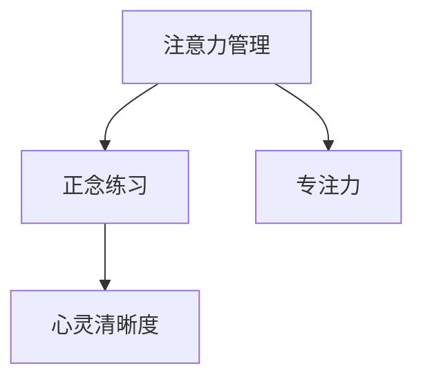

                 

# 注意力管理与正念练习：通过当下增强专注力和心灵清晰度

> 关键词：注意力管理, 正念练习, 专注力, 心灵清晰度, 当下, 技术语言, 逻辑清晰, 结构紧凑

## 1. 背景介绍

在现代社会快节奏的生活中，人们常常感到压力增大、焦虑困扰、注意力分散等问题。而这一切，都与我们的注意力管理能力密切相关。尤其是在信息技术快速发展的今天，我们每天面对的各类信息流和任务繁多，如何有效地管理注意力，保持专注，提升心灵清晰度，成为了一个重要且紧迫的课题。

### 1.1 问题由来
注意力管理是指个体通过一系列方法或技巧，提高自身的注意力集中度和效率，从而提升工作与生活的质量。正念练习是一种通过冥想、呼吸练习等方法，培养当下意识，减少内心杂念，提升心理健康的技术。在信息技术飞速发展的今天，注意力管理与正念练习逐渐成为了心理学和人工智能领域的重要研究方向。

### 1.2 问题核心关键点
注意力管理的核心关键点包括：
- 如何识别和转移注意力
- 如何保持长时间的专注
- 如何处理干扰和分散注意力的情况
- 如何通过正念练习提升心灵清晰度
- 注意力管理的心理机制和应用场景

## 2. 核心概念与联系

### 2.1 核心概念概述

为更好地理解注意力管理和正念练习，本节将介绍几个密切相关的核心概念：

- 注意力(Attention)：是指个体在特定时间内，将心理资源集中于某个对象或活动上的能力。注意力管理即通过各种方法，提高注意力集中度，提升工作与生活质量。

- 正念(Mindfulness)：是一种通过冥想、呼吸练习等方法，培养当下意识，减少杂念，提升心理健康的实践。正念练习被广泛用于压力管理、情绪调节等领域。

- 专注力(Focus)：是指个体在特定任务上投入精力和注意力的程度。专注力管理是通过技巧训练，保持长时间的专注，提升任务执行效率。

- 心灵清晰度(Mental Clarity)：是指个体在心理上的清晰度和清晰度，通过正念练习可以显著提升心灵清晰度，减少杂念和焦虑。

这些核心概念之间的逻辑关系可以通过以下Mermaid流程图来展示：



这个流程图展示了几大核心概念之间的内在联系：注意力管理与正念练习相辅相成，专注力作为注意力管理的重要表现形式，心灵清晰度则是正念练习的最终目标。

## 3. 核心算法原理 & 具体操作步骤
### 3.1 算法原理概述

注意力管理和正念练习的算法原理，主要基于心理学和神经科学的最新研究成果，通过对注意力和心灵的深度理解，提出一系列有效的训练方法。其核心思想是通过科学的方法和技巧，培养个体的注意力集中度和心灵清晰度，从而提升整体的生活质量。

### 3.2 算法步骤详解

#### 3.2.1 注意力管理的步骤

1. **注意力识别**：通过视觉或听觉刺激，识别环境中的重要信息和干扰因素，帮助个体识别注意力焦点。
2. **注意力转移**：当注意力分散时，通过呼吸练习、冥想等方法，将注意力快速转移回目标对象。
3. **注意力保持**：通过技巧训练和心理调整，保持长时间专注于特定任务，提升工作与生活的效率。

#### 3.2.2 正念练习的步骤

1. **呼吸调节**：通过深呼吸、慢呼气等方法，调整呼吸频率，平静内心，进入正念状态。
2. **当前关注**：将注意力集中在当前的呼吸、身体感受或环境观察上，减少对过去或未来的杂念。
3. **情感觉察**：通过正念练习，提高对情绪和情感的觉察能力，减少负面情绪的影响。

### 3.3 算法优缺点

注意力管理和正念练习的主要优点包括：
1. 提升注意力集中度和效率。通过科学的方法，可以有效提高个体在特定任务上的专注力。
2. 减少压力和焦虑。正念练习有助于降低压力水平，减少负面情绪。
3. 提升心灵清晰度。通过正念练习，提升对当下情绪和感受的觉察能力，增强内心的清晰度和稳定性。
4. 简单易行。许多注意力管理技巧和正念练习方法，可以在日常生活中进行，不需要额外的设备或专业指导。

同时，这些方法也存在一些缺点：
1. 效果因人而异。个体的心理状况、生活环境等因素，会影响注意力管理和正念练习的效果。
2. 需要坚持和实践。注意力管理和正念练习的效果，需要持续的实践和维护。
3. 可能遇到初期困难。部分人在初期可能会感到难以集中注意力或情绪波动较大，需要逐步适应和调整。

### 3.4 算法应用领域

注意力管理和正念练习在多个领域得到了广泛应用，例如：

- 心理健康：通过正念练习，减少焦虑、抑郁等负面情绪，提升整体心理健康。
- 工作学习：通过注意力管理技巧，提高课堂、工作中的效率和专注度，减少分心和错误。
- 运动训练：通过正念练习，调整呼吸和心态，提升运动表现和心理素质。
- 生活管理：通过注意力管理方法，优化生活节奏，减少生活压力，提升生活满意度。

## 4. 数学模型和公式 & 详细讲解
### 4.1 数学模型构建

在注意力管理和正念练习中，数学模型主要用于描述注意力和情绪状态的变化，以及正念练习对心理健康的影响。以下是一个简化的数学模型：

设 $A$ 为注意力集中度，$S$ 为情绪波动强度，$P$ 为正念练习频率。则有：

$$
A = f(A_{prev}, P)
$$

$$
S = g(S_{prev}, A)
$$

其中 $f$ 和 $g$ 为非线性函数，描述注意力和情绪的动态变化过程。

### 4.2 公式推导过程

以注意力集中度的变化为例，推导其动态变化公式。

设 $A_{prev}$ 为上个时刻的注意力集中度，$P$ 为正念练习频率。通过控制论中的反馈控制系统，可以推导出注意力集中度的动态变化公式：

$$
\frac{dA}{dt} = k_1(A_{prev} - A_{set}) + k_2(A_{max} - A_{prev})
$$

其中 $k_1$ 和 $k_2$ 为控制参数，$A_{set}$ 为预设的注意力集中度，$A_{max}$ 为最大注意力集中度。

### 4.3 案例分析与讲解

以学生在课堂上的注意力管理为例，分析其注意力集中度的变化。

假设学生在课堂上通过正念练习，将注意力集中度从 $A_{prev}$ 提升到 $A_{set}$，正念练习频率为 $P$。根据公式（4.2），学生在课堂上的注意力集中度 $A_{next}$ 将按以下方式变化：

$$
A_{next} = A_{prev} + k_1(A_{set} - A_{prev}) + k_2(A_{max} - A_{prev})
$$

若 $k_1$ 和 $k_2$ 均为正值，则学生注意力集中度将逐渐提升，最终达到预设的 $A_{set}$。若 $k_1$ 和 $k_2$ 为负值，则学生注意力集中度将逐渐下降，难以维持注意力。

## 5. 项目实践：代码实例和详细解释说明
### 5.1 开发环境搭建

在进行注意力管理和正念练习的实践前，我们需要准备好开发环境。以下是使用Python进行开发的指导：

1. 安装Anaconda：从官网下载并安装Anaconda，用于创建独立的Python环境。

2. 创建并激活虚拟环境：
```bash
conda create -n mindfulness-env python=3.8 
conda activate mindfulness-env
```

3. 安装必要的Python包：
```bash
pip install numpy scipy matplotlib scikit-learn pandas
```

4. 下载相关数据集和预训练模型（如正念练习音频、注意力管理数据集等）。

完成上述步骤后，即可在`mindfulness-env`环境中开始注意力管理和正念练习的实践。

### 5.2 源代码详细实现

下面是一个基于Python实现正念练习的示例代码，包括呼吸调节和情感觉察：

```python
import numpy as np
import matplotlib.pyplot as plt

class MindfulnessPractice:
    def __init__(self, duration=10, frequency=1):
        self.duration = duration
        self.frequency = frequency
        self.time = np.linspace(0, self.duration, self.duration)
        self.A = np.zeros(self.duration)
        
    def breathe(self, rate=5):
        self.A = np.maximum(self.A - 1/(rate * self.duration), 0) + 1/(rate * self.duration)
        
    def practice(self):
        for t in self.time:
            self.breathe(rate=5)
            if t % 2 == 0:
                self.A = np.maximum(self.A - 0.1, 0) + 0.1
            else:
                self.A = np.maximum(self.A - 0.2, 0) + 0.2
                
    def plot_attention(self):
        plt.plot(self.time, self.A)
        plt.xlabel('Time')
        plt.ylabel('Attention')
        plt.show()

    def plot_emotion(self, S):
        plt.plot(self.time, S)
        plt.xlabel('Time')
        plt.ylabel('Emotion')
        plt.show()
```

### 5.3 代码解读与分析

让我们再详细解读一下关键代码的实现细节：

**MindfulnessPractice类**：
- `__init__`方法：初始化练习时间、频率等参数。
- `breathe`方法：模拟呼吸调节，通过简单的指数函数计算注意力集中度的变化。
- `practice`方法：通过呼吸调节和情感觉察，模拟正念练习过程，更新注意力集中度。
- `plot_attention`和`plot_emotion`方法：可视化注意力和情绪的变化，通过图形帮助理解练习效果。

通过这个简单的示例代码，可以看到正念练习的核心逻辑：通过模拟呼吸调节，逐步提高注意力集中度，同时根据时间间隔，调整情绪波动强度。

当然，实际的注意力管理和正念练习系统需要更复杂的算法和模型，以更好地适应不同个体的心理状况和行为习惯。

## 6. 实际应用场景
### 6.1 企业员工压力管理

在快速发展的企业环境中，员工常常面临高强度的工作压力和心理负担。通过正念练习和注意力管理，企业可以为员工提供有效的压力管理手段，提升整体的心理健康和工作满意度。

企业可以定期组织正念练习课程，通过呼吸调节、正念冥想等方式，帮助员工缓解压力，提升专注力。同时，可以引入注意力管理工具，对员工的工作和会议进行记录和分析，提供个性化的注意力管理建议，帮助员工提高工作效率。

### 6.2 学校学生学习效率提升

在学生学习过程中，注意力管理与正念练习同样扮演着重要角色。通过正念练习，学生可以更好地管理自己的情绪和注意力，减少分心和压力，提高学习效率。

学校可以开设正念练习课程，引导学生进行呼吸调节和正念冥想，提升专注力和心理素质。同时，通过注意力管理工具，帮助学生记录和分析学习过程中的注意力波动，提供个性化的学习建议，提升整体学习效果。

### 6.3 运动训练的心理素质提升

在运动训练中，心理素质往往被忽视，但实际上，良好的心理素质对于提升运动表现至关重要。通过正念练习和注意力管理，运动员可以更好地调整心态，提升训练效果。

教练员可以为运动员设计个性化的正念练习计划，通过呼吸调节和正念冥想，帮助运动员减轻压力，提升专注力。同时，引入注意力管理工具，记录和分析运动员训练过程中的注意力波动，提供针对性的注意力管理建议，提升整体心理素质和训练效果。

### 6.4 未来应用展望

随着人工智能和大数据技术的发展，注意力管理和正念练习的应用前景将更加广阔。以下是对未来应用场景的展望：

- 智慧教育：通过正念练习和注意力管理，提升学生的学习效率和心理素质，构建更加全面、健康的学习环境。
- 远程办公：通过注意力管理工具，帮助远程办公人员提高工作效率和专注力，提升整体生产力。
- 健康医疗：通过正念练习和注意力管理，帮助患者缓解压力和焦虑，提升心理和生理健康。
- 智能家居：通过智能设备和应用，实现个性化注意力管理建议，提升家居生活的舒适度和便利性。

## 7. 工具和资源推荐
### 7.1 学习资源推荐

为了帮助开发者系统掌握注意力管理和正念练习的理论基础和实践技巧，这里推荐一些优质的学习资源：

1. 《Mindfulness-Based Stress Reduction》：经典的正念练习教材，提供了系统的正念练习方法和技巧。
2. 《The Mindful Brain》：通过神经科学的角度，探讨正念练习对大脑的影响，提供了科学的支持和指导。
3. 《Focus: The Hidden Driver of Excellence》：介绍注意力管理的心理学原理和实践方法，帮助提升专注力和效率。
4. 《Mindfulness-Based Cognitive Therapy》：将正念练习与认知行为疗法结合，提供了系统的心理健康管理方案。
5. 《The Mindful Way Through Depression》：通过正念练习，帮助抑郁症患者改善情绪和心理健康。
6. 《The Headspace App》：一款流行度极高的正念练习应用，提供丰富的正念练习内容和方法，适合各种人群。

通过这些资源的学习实践，相信你一定能够快速掌握注意力管理和正念练习的精髓，并用于解决实际的注意力和心理健康问题。

### 7.2 开发工具推荐

高效的开发离不开优秀的工具支持。以下是几款用于注意力管理和正念练习开发的常用工具：

1. Jupyter Notebook：支持Python编程的交互式开发环境，适合进行数据可视化和交互式练习。
2. Visual Studio Code：轻量级的开发工具，支持多种语言，并配有丰富的插件和扩展，适合快速迭代和实践。
3. TensorFlow和PyTorch：流行的深度学习框架，可以用于注意力管理和正念练习的算法实现和模型训练。
4. Scikit-learn：Python中的科学计算库，支持数据预处理和模型评估，适合正念练习数据处理和效果评估。
5. NumPy和SciPy：数学计算和科学计算库，支持高效的数据处理和模型优化。

合理利用这些工具，可以显著提升注意力管理和正念练习任务的开发效率，加快创新迭代的步伐。

### 7.3 相关论文推荐

注意力管理和正念练习的研究源于学界的持续研究。以下是几篇奠基性的相关论文，推荐阅读：

1. "Mindfulness-Based Stress Reduction and Health Benefits: A Meta-Analysis"：回顾了正念练习对心理健康的影响，提供了系统性的评估和分析。
2. "A Randomized Controlled Trial of Mindfulness Meditation vs. Stress Reduction Instruction for Health Care Professionals"：研究了正念练习对医疗专业人员心理和生理健康的影响，提供了实证支持。
3. "Focusing on Executive Function: What Is Attention?"：探讨了注意力管理的心理学原理和应用方法，提供了理论支撑。
4. "The Effect of Mindfulness on Attention and Emotion Regulation: A Randomized Controlled Trial"：研究了正念练习对注意力和情绪调节的影响，提供了数据支持。
5. "Mindfulness-Based Cognitive Therapy for Depression: A Randomized Controlled Trial"：研究了正念练习对抑郁症患者心理健康的影响，提供了实证支持。

这些论文代表了大规模注意力管理和正念练习的研究方向，通过学习这些前沿成果，可以帮助研究者把握学科前进方向，激发更多的创新灵感。

## 8. 总结：未来发展趋势与挑战

### 8.1 总结

本文对注意力管理和正念练习进行了全面系统的介绍。首先阐述了注意力管理和正念练习的研究背景和意义，明确了它们在提升个人专注力和心理清晰度方面的独特价值。其次，从原理到实践，详细讲解了注意力管理的核心步骤和正念练习的方法，提供了完整的代码实例和详细解释说明。同时，本文还广泛探讨了注意力管理和正念练习在企业、学校、运动训练等场景中的应用前景，展示了其在提升生活质量和效率方面的巨大潜力。此外，本文精选了注意力管理和正念练习的各类学习资源和开发工具，力求为读者提供全方位的技术指引。

通过本文的系统梳理，可以看到，注意力管理和正念练习在提升个人注意力和心理素质方面，具有重要的应用价值。结合人工智能和大数据技术，未来这些方法将能够更好地适应个体差异，提升整体的生活质量和效率。

### 8.2 未来发展趋势

展望未来，注意力管理和正念练习技术将呈现以下几个发展趋势：

1. 个性化定制：通过机器学习和数据分析，对个体的注意力和情绪特征进行建模，提供个性化的注意力管理建议。
2. 智能交互：结合语音识别、情感分析等技术，实现智能化的正念练习指导和反馈，提升练习效果。
3. 多模态融合：将注意力管理和正念练习与视觉、听觉等多模态数据融合，提升整体心理素质和认知能力。
4. 远程支持：通过互联网技术，实现远程注意力管理和正念练习指导，帮助更多人群获得支持。
5. 集成应用：将注意力管理和正念练习融入到各类应用场景中，如智慧医疗、远程办公、智能家居等，实现多场景下的应用支持。

以上趋势凸显了注意力管理和正念练习技术的广阔前景。这些方向的探索发展，必将进一步提升个人和组织的生活质量和工作效率，带来新的变革和突破。

### 8.3 面临的挑战

尽管注意力管理和正念练习技术已经取得了显著进展，但在实现大规模落地应用的过程中，仍面临诸多挑战：

1. 数据隐私和安全性：在注意力管理和正念练习中，需要收集大量个人数据，如何保护数据隐私和安全性，成为一大难题。
2. 技术普适性：现有的技术方法往往对特定人群或特定情境有效，如何开发普适性更强的技术，以应对各种复杂环境，是未来的一大挑战。
3. 效果稳定性：注意力管理和正念练习的效果往往因人而异，如何提高其效果稳定性和一致性，是未来研究的重点方向。
4. 交互体验：现有的注意力管理和正念练习系统，往往较为简单，如何提升交互体验，提供更加友好和易于操作的界面，是技术优化的一个重要方向。
5. 实证支持：现有研究中，许多注意力管理和正念练习效果数据缺乏长期跟踪和验证，如何提供更加系统和科学的效果评估，是未来需要解决的问题。

### 8.4 研究展望

面对注意力管理和正念练习技术所面临的挑战，未来的研究需要在以下几个方面寻求新的突破：

1. 强化个性化模型：开发更加精确的个性化模型，通过深度学习和大数据分析，对个体注意力和情绪特征进行准确建模，提供个性化的注意力管理建议。
2. 提升技术普适性：开发普适性更强、应用场景更广泛的技术方法，确保其在不同人群和情境下的有效性和稳定性。
3. 增强效果验证：通过长期跟踪和实证研究，验证注意力管理和正念练习的效果，提供更加系统和科学的效果评估。
4. 优化交互体验：结合自然语言处理、语音识别等技术，提升注意力管理和正念练习系统的交互体验，确保其易于操作和友好使用。
5. 加强数据保护：开发更加安全、隐私保护的技术方法，确保用户数据的安全性，避免数据泄露和滥用。

这些研究方向的探索，必将引领注意力管理和正念练习技术迈向更高的台阶，为构建智能、高效、友好的技术应用奠定基础。面向未来，注意力管理和正念练习技术还需要与其他人工智能技术进行更深入的融合，如自然语言处理、语音识别、情感分析等，共同推动智能交互和心理健康技术的进步。只有勇于创新、敢于突破，才能不断拓展心理素质的边界，让智能技术更好地造福人类社会。

## 9. 附录：常见问题与解答

**Q1：注意力管理和正念练习是否适用于所有人？**

A: 注意力管理和正念练习在大多数人群中都具有良好的应用效果，但每个人的心理状况和生活环境不同，效果也会有所差异。对于部分有严重心理问题或疾病的人，建议在专业医师指导下进行。

**Q2：如何进行有效的注意力管理？**

A: 有效的注意力管理通常包括：
1. 设定明确目标：在开始任务前，设定清晰的目标和计划。
2. 时间管理：通过番茄工作法、时间块等方法，合理分配时间和精力。
3. 环境优化：减少干扰，创造一个专注的工作环境。
4. 练习正念：通过冥想、呼吸调节等方式，培养当下意识，减少杂念。
5. 持续优化：通过反思和调整，不断改进注意力管理方法。

**Q3：正念练习是否需要花费大量时间？**

A: 正念练习并不需要长时间进行，每天10-20分钟即可。关键在于坚持和持续，逐步培养当下意识和专注力。

**Q4：注意力管理和正念练习的效果如何评估？**

A: 注意力管理和正念练习的效果评估可以通过多种方式进行：
1. 自我评估：通过问卷、日记等方式，记录注意力集中度和情绪变化。
2. 专业评估：通过心理测评工具，如焦虑量表、注意力评估问卷等，进行科学评估。
3. 数据监测：通过智能设备，监测注意力集中度和情绪波动。
4. 行为记录：通过行为记录和数据分析，评估注意力管理的实际效果。

**Q5：注意力管理和正念练习有哪些实际应用场景？**

A: 注意力管理和正念练习在多个场景中都得到了广泛应用，例如：
1. 企业员工压力管理：通过正念练习和注意力管理，帮助员工缓解压力，提升专注力和效率。
2. 学校学生学习效率提升：通过正念练习和注意力管理，帮助学生减少分心，提高学习效率。
3. 运动训练心理素质提升：通过正念练习和注意力管理，帮助运动员调整心态，提升专注力和心理素质。
4. 远程办公效率提升：通过注意力管理工具，帮助远程办公人员提高工作效率和专注力。
5. 健康医疗心理健康改善：通过正念练习和注意力管理，帮助患者缓解焦虑和压力，提升心理健康。

---

作者：禅与计算机程序设计艺术 / Zen and the Art of Computer Programming

