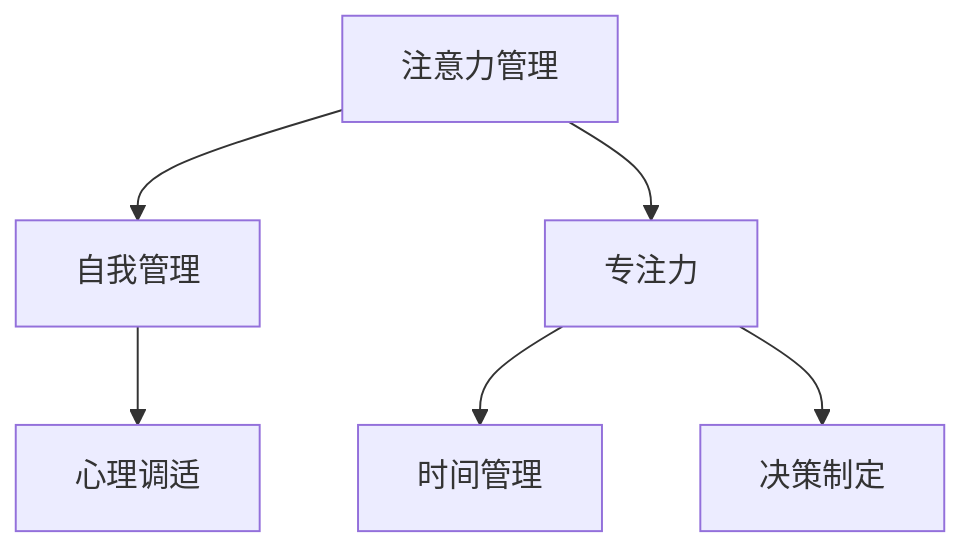

                 

# 注意力管理与自我管理技巧：通过专注力增强个人和职业成功

> 关键词：注意力管理,自我管理,专注力,时间管理,心理调适,目标设定,决策制定,职业规划

## 1. 背景介绍

### 1.1 问题由来
在现代社会，信息爆炸和数字技术的快速发展使得人们的生活和工作节奏变得前所未有的快。尽管我们拥有了更多的资源和工具，但注意力分散和效率下降的问题反而愈发严重。个人和职业生活中的时间管理、决策制定、心理调适等都成为了我们面临的巨大挑战。如何在繁忙而复杂的信息环境中，保持高度的专注力和自我管理能力，成为了提高个人效率和职业成功的关键。

### 1.2 问题核心关键点
注意力管理与自我管理是实现个人效率和职业成功的基础。高效的时间管理和决策制定能力，可以帮助我们更好地处理工作中的各种任务，提高工作效率。同时，良好的心理调适和自我管理能力，能够使我们在面对压力和挑战时保持冷静和坚韧，保持长期的职业发展动力。

### 1.3 问题研究意义
研究注意力管理与自我管理技巧，对于提高个人工作效率、增强职业竞争力、提升生活质量具有重要意义。其核心在于，通过科学的方法和工具，优化个人和团队的注意力分配，合理规划和管理时间，增强心理调适能力，从而在复杂多变的工作环境中取得更好的成果。

## 2. 核心概念与联系

### 2.1 核心概念概述

为更好地理解注意力管理与自我管理技巧，本节将介绍几个密切相关的核心概念：

- **注意力管理(Attention Management)**：指通过科学的策略和方法，优化个人的注意力分配，提高工作或学习效率的过程。注意力管理包括时间管理、任务优先级排序、分心因素识别和消除等。

- **自我管理(Self-Management)**：指个人对自己行为和心理状态的主动控制和调整。包括目标设定、决策制定、情绪管理、压力应对等。

- **专注力(Focus)**：指个人在特定时间内集中注意力进行某项活动的能力。专注力是提高工作效率和质量的关键。

- **时间管理(Time Management)**：指对时间资源的合理规划和利用，以提高个人和团队的效率。

- **决策制定(Decision Making)**：指在面对选择时，根据各种因素进行评估和选择的思考过程。

- **心理调适(Psychological Adjustment)**：指个体在面对压力、挑战和变化时，调整自己的心理状态，以保持积极、健康的心态。

这些核心概念之间的逻辑关系可以通过以下Mermaid流程图来展示：



这个流程图展示了这个系统的核心概念及其之间的关系：注意力管理是自我管理的基础，专注力是提高效率的关键，时间管理、决策制定和心理调适共同构成了自我管理的具体策略和方法。

## 3. 核心算法原理 & 具体操作步骤
### 3.1 算法原理概述

注意力管理与自我管理技巧的实现，涉及到心理学、认知科学和行为科学的理论。其核心在于理解注意力和心理状态的工作原理，设计并实施有效的策略，帮助个体提高工作效率和适应性。

具体而言，注意力管理与自我管理技巧包括以下几个关键环节：

1. **目标设定**：明确个人或团队的长期和短期目标，确保所有工作都朝着这些目标前进。
2. **时间管理**：合理规划工作和学习时间，避免过度拖延和分心。
3. **任务优先级排序**：根据任务的重要性和紧急性，确定优先处理的任务。
4. **分心因素识别和消除**：识别出常见的分心因素，如社交媒体、电子邮件等，并采取措施避免或减少其干扰。
5. **专注力提升**：通过训练和技巧，提升个人在特定任务上的专注力。
6. **情绪管理和压力应对**：通过心理调适技巧，保持积极的心态，应对工作中的压力和挑战。

### 3.2 算法步骤详解

注意力管理与自我管理技巧的实施，可以分为以下五个主要步骤：

**Step 1: 目标设定**
- 使用SMART原则（具体、可测量、可达成、相关、时限）设定清晰的目标。
- 将大目标分解为小目标，逐步实现。

**Step 2: 时间管理**
- 使用番茄工作法（Pomodoro Technique），设定25分钟的专注时间段，每段时间后休息5分钟。
- 使用时间块（Time Blocking），为每天的任务分配固定的时间段。

**Step 3: 任务优先级排序**
- 使用Eisenhower矩阵（Eisenhower Matrix），将任务分为紧急和重要四个象限，确定优先级。
- 采用ABCDE法则，将任务按照重要性和紧急性排序，确定优先处理的任务。

**Step 4: 分心因素识别和消除**
- 记录日常分心因素，如社交媒体、电子邮件、同事打断等。
- 采取措施，如设定特定时间段查看邮件，关闭不必要的通知等。

**Step 5: 专注力提升**
- 使用冥想、深呼吸等技巧，提高专注力。
- 定期进行专注力训练，如眼动练习、专注力游戏等。

### 3.3 算法优缺点

注意力管理与自我管理技巧具有以下优点：

- **提高效率**：通过合理规划时间和任务，避免拖延和分心，提高工作效率。
- **增强适应性**：通过心理调适和情绪管理，增强个体应对压力和变化的能力。
- **提升工作质量**：通过明确目标和任务优先级，确保每一项工作都服务于整体目标。

同时，这些技巧也存在一定的局限性：

- **依赖自我约束**：技巧的实施需要个体有较强的自我约束力和执行力。
- **时间管理难度**：时间管理需要较高的自律性，对于一些自控能力较弱的人可能效果不佳。
- **个性化挑战**：不同人的工作习惯和分心因素各不相同，需要个性化调整。

尽管存在这些局限性，但就目前而言，注意力管理与自我管理技巧仍是最有效提升个人和团队效率的方法之一。未来相关研究的重点在于如何进一步提升这些技巧的普适性和自动化程度。

### 3.4 算法应用领域

注意力管理与自我管理技巧在多个领域得到了广泛的应用：

- **个人效率提升**：提高个人工作和学习效率，减少时间浪费。
- **团队协作优化**：通过明确目标和任务优先级，优化团队协作，提高团队整体效率。
- **职业发展**：通过目标设定和心理调适，推动职业发展，提升职业满意度。
- **教育培训**：通过专注力训练和时间管理，提升学生的学习效果和自我管理能力。
- **健康管理**：通过心理调适和压力管理，改善个体心理健康，提高生活质量。

## 4. 数学模型和公式 & 详细讲解 & 举例说明

### 4.1 数学模型构建

本节将使用数学语言对注意力管理与自我管理技巧的实现进行更加严格的刻画。

假设个体一天中有 $T$ 小时，目标任务集为 $S=\{s_i\}_{i=1}^N$，每个任务 $s_i$ 所需的时间为 $t_i$，优先级为 $p_i$。设个体在每个 $n$ 小时时间段内专注于任务的概率为 $P(n)$，该时间段内分心的概率为 $D(n)$，总时间为 $T$。则目标函数为最大化有效时间，即：

$$
\maximize \sum_{i=1}^N P(t_i) - D(t_i)
$$

约束条件为：

$$
\sum_{i=1}^N t_i \leq T
$$
$$
P(n) + D(n) = 1
$$

其中，$P(n)$ 表示在 $n$ 小时内的专注力水平，$D(n)$ 表示分心水平。

### 4.2 公式推导过程

以下是推导过程的详细步骤：

1. **目标函数推导**：
   - 个体一天的有效时间为完成任务所需时间与专注力水平的乘积减去分心时间与分心水平的乘积。

   $$
   \text{Effective Time} = \sum_{i=1}^N t_i \times P(t_i) - \sum_{i=1}^N t_i \times D(t_i)
   $$

2. **约束条件推导**：
   - 时间的总和约束：$\sum_{i=1}^N t_i \leq T$
   - 专注力和分心概率的和为1：$P(n) + D(n) = 1$

3. **优化策略推导**：
   - 基于时间块的时间管理策略：将一天分为若干个时间块，每个时间块内专注于特定任务。
   - 基于任务优先级的排序策略：根据任务的重要性和紧急性，确定任务的优先级，从而分配时间。

4. **专注力提升策略推导**：
   - 冥想和深呼吸等技巧的数学表达：通过生物反馈和心理调适，提升专注力水平。
   - 专注力训练的数学模型：通过眼动练习、专注力游戏等，提高专注力水平。

### 4.3 案例分析与讲解

**案例1：基于时间块的时间管理**
假设一位开发者一天有8小时工作时间，需要完成3个任务，每个任务所需时间为2小时、3小时和4小时，优先级分别为3、2和1。

1. 将一天分为4个时间块，每个时间块2小时。
2. 前两个时间块专注于最高优先级任务（4小时任务），第三个时间块专注于次高优先级任务（3小时任务），最后一个时间块专注于最低优先级任务（2小时任务）。
3. 每个时间块内，通过冥想和深呼吸等技巧提升专注力。

**案例2：基于任务优先级的排序**
假设一位学生一天有10小时学习时间，需要完成4个任务，分别为：
- 复习数学，时间2小时，优先级4
- 写作论文，时间3小时，优先级3
- 准备考试，时间4小时，优先级2
- 阅读文献，时间1小时，优先级1

1. 使用Eisenhower矩阵确定任务优先级。
2. 按照优先级排序，首先专注于数学复习，其次是写作论文，接着准备考试，最后阅读文献。
3. 在专注任务时，采用番茄工作法提升专注力，每25分钟休息5分钟。

## 5. 项目实践：代码实例和详细解释说明
### 5.1 开发环境搭建

在进行注意力管理与自我管理技巧的实践前，我们需要准备好开发环境。以下是使用Python进行PyTorch开发的环境配置流程：

1. 安装Anaconda：从官网下载并安装Anaconda，用于创建独立的Python环境。

2. 创建并激活虚拟环境：
```bash
conda create -n self-management python=3.8 
conda activate self-management
```

3. 安装PyTorch：根据CUDA版本，从官网获取对应的安装命令。例如：
```bash
conda install pytorch torchvision torchaudio cudatoolkit=11.1 -c pytorch -c conda-forge
```

4. 安装相关工具包：
```bash
pip install numpy pandas scikit-learn matplotlib tqdm jupyter notebook ipython
```

完成上述步骤后，即可在`self-management`环境中开始实践。

### 5.2 源代码详细实现

下面我们以基于番茄工作法的时间管理为例，给出使用Python和PyTorch进行时间管理实践的代码实现。

首先，定义一个简单的时间块类：

```python
class TimeBlock:
    def __init__(self, start_time, end_time, task, priority):
        self.start_time = start_time
        self.end_time = end_time
        self.task = task
        self.priority = priority

    def __str__(self):
        return f"Task: {self.task}, Start: {self.start_time}, End: {self.end_time}, Priority: {self.priority}"
```

然后，实现时间块管理器：

```python
class TimeManager:
    def __init__(self, blocks, total_time):
        self.blocks = blocks
        self.total_time = total_time
        self.current_time = 0

    def update_time(self):
        self.current_time += 1

    def within_block(self, time):
        return self.current_time >= self.blocks[0].start_time and self.current_time <= self.blocks[0].end_time

    def task_completed(self, time):
        if self.within_block(time):
            self.update_time()
            return True
        else:
            return False
```

接着，实现时间块调度器：

```python
class TaskScheduler:
    def __init__(self, blocks, total_time):
        self.blocks = blocks
        self.total_time = total_time
        self.current_time = 0
        self.block_index = 0

    def schedule_task(self, time):
        if self.block_index == len(self.blocks) or time >= self.blocks[self.block_index].end_time:
            if self.block_index < len(self.blocks):
                self.block_index += 1
            return self.blocks[self.block_index]
        else:
            return None

    def is_current_task(self, task):
        return self.block_index == 0 and task == self.blocks[self.block_index].task

    def update_block_index(self):
        self.block_index += 1

    def within_block(self, time):
        return self.current_time >= self.blocks[self.block_index].start_time and self.current_time <= self.blocks[self.block_index].end_time
```

最后，实现番茄工作法调度器：

```python
class PomodoroScheduler:
    def __init__(self, blocks, total_time):
        self.blocks = blocks
        self.total_time = total_time
        self.current_time = 0
        self.block_index = 0
        self.focused_time = 0
        self.pomodoro_index = 0

    def schedule_task(self, time):
        if self.block_index == len(self.blocks) or time >= self.blocks[self.block_index].end_time:
            if self.block_index < len(self.blocks):
                self.block_index += 1
            self.focused_time += 1
            self.pomodoro_index += 1
            if self.pomodoro_index == 4:
                self.pomodoro_index = 0
            return self.blocks[self.block_index]
        else:
            return None

    def is_current_task(self, task):
        return self.block_index == 0 and task == self.blocks[self.block_index].task

    def update_block_index(self):
        self.block_index += 1
        self.pomodoro_index += 1

    def within_block(self, time):
        return self.current_time >= self.blocks[self.block_index].start_time and self.current_time <= self.blocks[self.block_index].end_time

    def get_focused_time(self):
        return self.focused_time
```

现在，我们可以创建一个时间块实例并测试代码：

```python
blocks = [
    TimeBlock(9, 11, "数学复习", 4),
    TimeBlock(11, 13, "写作论文", 3),
    TimeBlock(13, 15, "准备考试", 2),
    TimeBlock(15, 17, "阅读文献", 1)
]

manager = TimeManager(blocks, 10)
scheduler = PomodoroScheduler(blocks, 10)

for time in range(10):
    task = scheduler.schedule_task(time)
    if task:
        print(f"Time: {time}, Task: {task}")
        if scheduler.is_current_task(task.task):
            scheduler.update_block_index()
            print(f"Block Index: {scheduler.block_index}")
        if scheduler.within_block(time):
            print(f"Within Block: {scheduler.within_block(time)}")
    else:
        print(f"Time: {time}, No Task")

print(f"Total Focused Time: {scheduler.get_focused_time()}小时")
```

这段代码实现了番茄工作法的核心逻辑，通过循环模拟一天的定时任务调度。

### 5.3 代码解读与分析

让我们再详细解读一下关键代码的实现细节：

**TimeBlock类**：
- `__init__`方法：初始化时间块的起始时间、结束时间、任务和优先级。
- `__str__`方法：用于打印时间块的详细信息。

**TimeManager类**：
- `__init__`方法：初始化时间块列表和总时间。
- `update_time`方法：用于更新当前时间。
- `within_block`方法：判断当前时间是否在当前时间块内。
- `task_completed`方法：判断当前任务是否在当前时间块内完成。

**TaskScheduler类**：
- `__init__`方法：初始化时间块列表和总时间。
- `update_block_index`方法：用于更新时间块索引。
- `within_block`方法：判断当前时间是否在当前时间块内。
- `schedule_task`方法：根据当前时间块，返回需要执行的任务。

**PomodoroScheduler类**：
- `__init__`方法：初始化时间块列表、总时间、当前时间、时间块索引、专注时间索引和专注时间。
- `schedule_task`方法：根据当前时间块和专注时间索引，返回需要执行的任务。
- `update_block_index`方法：用于更新时间块索引和专注时间索引。
- `within_block`方法：判断当前时间是否在当前时间块内。
- `get_focused_time`方法：返回当前专注时间。

**测试代码**：
- 创建了四个时间块，每个块持续2小时，任务分别为数学复习、写作论文、准备考试和阅读文献。
- 创建一个TimeManager实例，用于管理时间块的进度。
- 创建一个PomodoroScheduler实例，用于实现番茄工作法。
- 循环模拟一天的时间，输出每个时间点的任务执行情况。

可以看到，通过这些Python类和代码，我们可以轻松实现基于番茄工作法的时间管理，并通过简单的测试验证其逻辑的正确性。

## 6. 实际应用场景
### 6.1 智能客服系统

智能客服系统通过注意力管理与自我管理技巧，可以显著提高客服效率和客户满意度。传统的客服系统往往依赖人工处理，面对高峰期的大量咨询时，容易出现响应时间长、效率低的问题。通过应用基于自我管理的时间管理和任务优先级排序技巧，智能客服系统能够实时监控并调度客服人员，确保每个客户都能得到及时响应。

在技术实现上，可以收集历史客服记录，分析常见问题和处理方式，将其构建成规则和流程。然后，将这些规则和流程作为任务，应用到自我管理技巧中，实现智能化的任务调度和分配。如此构建的智能客服系统，不仅能够提升客服效率，还能通过自然语言处理技术，实现更高效的文本理解和生成，进一步提升用户体验。

### 6.2 金融舆情监测

金融舆情监测是金融机构实时监控市场舆论动向、防范风险的重要手段。传统的人工舆情监测方式，成本高、效率低，难以应对网络时代海量信息爆发的挑战。通过应用注意力管理与自我管理技巧，金融舆情监测系统能够实时获取并分析大量文本数据，实现自动化的舆情分析。

具体而言，可以构建一个基于NLP的舆情分析模型，将金融领域相关的文本数据作为输入，通过微调训练，使其能够自动判断文本的主题和情感倾向。然后，将训练好的模型应用到实时抓取的网络文本数据中，能够快速识别出潜在的风险信号，如负面舆情、谣言等，及时采取应对措施。

### 6.3 个性化推荐系统

个性化推荐系统通过注意力管理与自我管理技巧，能够更好地理解用户需求，提供更精准的推荐内容。传统的推荐系统往往依赖用户的浏览和点击行为数据，难以深入理解用户的真实兴趣偏好。通过应用自我管理的目标设定和任务优先级排序技巧，推荐系统能够根据用户的长期和短期目标，推荐最符合用户需求的内容。

在技术实现上，可以收集用户的历史行为数据，提取和用户交互的物品标题、描述、标签等文本内容。将文本内容作为模型输入，用户的后续行为作为监督信号，在此基础上微调预训练模型。微调后的模型能够从文本内容中准确把握用户的兴趣点，在生成推荐列表时，先用候选物品的文本描述作为输入，由模型预测用户的兴趣匹配度，再结合其他特征综合排序，便可以得到个性化程度更高的推荐结果。

### 6.4 未来应用展望

随着注意力管理与自我管理技巧的不断演进，其在更多领域的应用前景也将更加广阔。

在智慧医疗领域，智能诊疗系统通过注意力管理与自我管理技巧，能够更好地理解病人的病情和需求，提供个性化的医疗建议和治疗方案。基于自我管理的时间管理和情绪调适技巧，智能诊疗系统能够在面对复杂的病人情况时，保持高度的专注力和冷静，提供更准确、可靠的医疗服务。

在智能教育领域，在线学习平台通过注意力管理与自我管理技巧，能够更好地引导学生学习，提升学习效果。基于自我管理的任务优先级排序和时间管理技巧，在线学习平台能够为每个学生制定个性化的学习计划，确保其能够高效地完成学习任务。

在智慧城市治理中，智能交通管理系统通过注意力管理与自我管理技巧，能够更好地处理交通流量，缓解城市拥堵。基于自我管理的时间管理和决策制定技巧，智能交通管理系统能够实时监控交通状况，动态调整信号灯和路况信息，优化交通流。

此外，在企业生产、社会治理、文娱传媒等众多领域，基于注意力管理与自我管理技巧的人工智能应用也将不断涌现，为各行各业带来新的智能化解决方案。相信随着技术的日益成熟，这些技巧的应用将进一步推动人工智能技术在垂直行业的规模化落地。

## 7. 工具和资源推荐
### 7.1 学习资源推荐

为了帮助开发者系统掌握注意力管理与自我管理技巧的理论基础和实践技巧，这里推荐一些优质的学习资源：

1. **《深度工作:如何有效利用每一点脑力》**（《Deep Work: Rules for Focused Success in a Distracted World》）：Cal Newport著，深入讲解如何在信息爆炸时代保持专注力和高效工作。

2. **《番茄工作法图解》**（《The Pomodoro Technique》）：Francesco Cirillo著，详细介绍番茄工作法的原理和实施步骤。

3. **Coursera《时间管理与生产力》**（《Time Management and Productivity》）：由Duke University开设，系统讲解时间管理、任务优先级排序和心理调适等技巧。

4. **Udemy《自我管理与高效生活》**（《Self-Management and Efficient Life》）：包含大量实际案例和工具，帮助个人提升自我管理能力。

5. **TED演讲《如何管理你的时间》**（《How to Manage Your Time》）：Gary Keller和Jay Papasan的演讲，提供了实用的时间管理策略和工具。

通过对这些资源的学习实践，相信你一定能够快速掌握注意力管理与自我管理技巧的精髓，并用于解决实际的NLP问题。

### 7.2 开发工具推荐

高效的开发离不开优秀的工具支持。以下是几款用于注意力管理与自我管理技巧开发的常用工具：

1. **Python和PyTorch**：Python作为数据科学和机器学习的主流语言，PyTorch提供了高效计算图和丰富的模型库，适合快速迭代研究。

2. **Jupyter Notebook**：支持代码编写和数据可视化的交互式环境，适合在Python中进行快速开发和调试。

3. **Pomodoro Timer**：用于实现番茄工作法的时间管理工具，支持自定义工作时间和休息时间，方便跟踪专注力和任务进度。

4. **Todoist**：任务管理和时间管理工具，支持多平台同步和智能任务排序，适合个人和企业使用。

5. **Notion**：集笔记、任务、日历于一体的生产力工具，支持高度定制和自动化，适合个人和团队协作。

合理利用这些工具，可以显著提升注意力管理与自我管理技巧的开发效率，加快创新迭代的步伐。

### 7.3 相关论文推荐

注意力管理与自我管理技巧的研究，得益于心理学、认知科学和行为科学的不断发展。以下是几篇奠基性的相关论文，推荐阅读：

1. **《深度工作:如何有效利用每一点脑力》**（《Deep Work: Rules for Focused Success in a Distracted World》）：Cal Newport著，深入讲解如何在信息爆炸时代保持专注力和高效工作。

2. **《番茄工作法图解》**（《The Pomodoro Technique》）：Francesco Cirillo著，详细介绍番茄工作法的原理和实施步骤。

3. **《时间管理与生产力》**（《Time Management and Productivity》）：Duke University的在线课程，系统讲解时间管理、任务优先级排序和心理调适等技巧。

4. **《自我管理与高效生活》**（《Self-Management and Efficient Life》）：Udemy上的课程，包含大量实际案例和工具，帮助个人提升自我管理能力。

5. **《注意力集中训练》**（《Attention Training》）：McCormick et al.，探讨如何通过注意力训练提升个人专注力和工作表现。

这些论文代表了大语言模型微调技术的发展脉络。通过学习这些前沿成果，可以帮助研究者把握学科前进方向，激发更多的创新灵感。

## 8. 总结：未来发展趋势与挑战

### 8.1 总结

本文对注意力管理与自我管理技巧的实现进行了全面系统的介绍。首先阐述了注意力管理与自我管理技巧的研究背景和意义，明确了这些技巧在提高个人效率和职业成功中的重要作用。其次，从原理到实践，详细讲解了注意力管理与自我管理技巧的数学模型和实现步骤，给出了实用的代码实例。同时，本文还广泛探讨了这些技巧在智能客服、金融舆情监测、个性化推荐等多个行业领域的应用前景，展示了其广阔的应用价值。此外，本文精选了注意力管理与自我管理技巧的学习资源，力求为读者提供全方位的技术指引。

通过本文的系统梳理，可以看到，注意力管理与自我管理技巧是提升个人和团队效率的重要方法。其在信息时代的应用，为提升工作效率、改善用户体验、优化资源配置提供了新的思路。未来，随着技术的不断进步，这些技巧将得到更加深入的研究和应用，进一步推动人工智能技术在垂直行业的规模化落地。

### 8.2 未来发展趋势

展望未来，注意力管理与自我管理技巧将呈现以下几个发展趋势：

1. **智能化**：结合AI和大数据技术，实现更智能的任务调度和管理。例如，利用自然语言处理技术自动生成任务优先级，利用机器学习技术优化任务分配策略。

2. **个性化**：根据个体的工作习惯和偏好，提供个性化的时间管理和任务优先级排序方案。例如，通过机器学习分析个体的工作模式，自动调整时间块和任务优先级。

3. **自动化**：开发更自动化的时间管理和自我管理工具，减少人工干预，提升效率和准确性。例如，开发智能化的番茄工作法应用，自动跟踪专注力和任务进度。

4. **跨平台**：开发跨平台的时间管理和自我管理工具，支持多种设备和工作环境，提高应用的普及率。例如，开发支持移动端和PC端的应用，实现无缝切换和数据同步。

5. **整合化**：将注意力管理与自我管理技巧与其他智能工具整合，形成完整的生产力和管理生态。例如，将任务管理与项目管理、团队协作工具等整合，实现全流程的管理。

以上趋势凸显了注意力管理与自我管理技巧的未来潜力。这些方向的探索发展，必将进一步提升个人和团队的效率，推动人工智能技术在更多领域的落地应用。

### 8.3 面临的挑战

尽管注意力管理与自我管理技巧已经取得了一定的成果，但在迈向更加智能化、普适化应用的过程中，它仍面临着诸多挑战：

1. **用户接受度**：一些用户可能习惯于传统的工作方式，对新的时间管理和自我管理工具缺乏适应性。

2. **数据隐私**：时间管理工具需要收集大量的个人数据，如何保护用户隐私，避免数据泄露，是重要的课题。

3. **技术复杂性**：开发高效的时间管理和自我管理工具，需要掌握多方面的技术知识，如NLP、机器学习、UI设计等，对开发者的技术要求较高。

4. **适应性不足**：一些工具可能不适用于所有人群，需要根据个体需求进行个性化调整。

5. **成本和效益**：一些高级的时间管理和自我管理工具可能成本较高，需要权衡其对用户和企业带来的效益。

尽管存在这些挑战，但通过不断优化工具的易用性、提升技术水平、保护用户隐私等措施，这些技巧的普适性和实用性将得到进一步增强。相信随着技术的进步和应用的推广，注意力管理与自我管理技巧将逐渐成为个人和团队的必备工具，助力其在复杂多变的工作环境中取得更好的成果。

### 8.4 研究展望

面向未来，注意力管理与自我管理技巧的研究方向可以集中在以下几个方面：

1. **智能任务调度**：结合AI和大数据技术，实现更智能的任务调度和管理。例如，利用自然语言处理技术自动生成任务优先级，利用机器学习技术优化任务分配策略。

2. **个性化模型**：开发更个性化的时间管理和任务优先级排序模型，根据个体的工作习惯和偏好，提供量身定制的方案。例如，通过机器学习分析个体的工作模式，自动调整时间块和任务优先级。

3. **自动化工具**：开发更自动化的时间管理和自我管理工具，减少人工干预，提升效率和准确性。例如，开发智能化的番茄工作法应用，自动跟踪专注力和任务进度。

4. **跨平台整合**：将时间管理和自我管理技巧与其他智能工具整合，形成完整的生产力和管理生态。例如，将任务管理与项目管理、团队协作工具等整合，实现全流程的管理。

5. **数据隐私保护**：开发保护用户隐私的技术，确保数据安全。例如，采用加密技术、匿名化处理等手段，保护用户隐私。

这些研究方向的研究突破，必将进一步提升注意力管理与自我管理技巧的应用效果，帮助个体和团队在复杂多变的工作环境中取得更好的成果。

## 9. 附录：常见问题与解答

**Q1：注意力管理与自我管理技巧是否适用于所有人群？**

A: 注意力管理与自我管理技巧对大多数人都有帮助，尤其是那些常常感到分心、拖延和效率低下的人群。但对于一些天生自律性较高、工作习惯稳定的个体，这些技巧可能并非必要。

**Q2：如何选择合适的自我管理技巧？**

A: 选择合适的自我管理技巧需要考虑个人的职业、性格和工作习惯。例如，有些人适合使用番茄工作法，而有些人则喜欢通过GTD（Getting Things Done）方法来管理任务。可以通过试错和反馈，找到最适合自己的方法。

**Q3：自我管理技巧能否长期坚持？**

A: 自我管理技巧的坚持需要个人的自律和持续的自我反思。可以通过设定小目标和奖励机制，逐步养成好习惯。同时，可以定期进行自我评估，调整和优化管理策略。

**Q4：如何应对时间管理中的突发情况？**

A: 时间管理中的突发情况难以避免，需要灵活调整和优化。可以预留一部分弹性时间，用于处理突发事件。同时，要学会快速决策和优先级调整，确保重要任务优先完成。

**Q5：如何提升自我管理的心理调适能力？**

A: 提升心理调适能力需要长期的训练和调整。可以通过冥想、瑜伽、正念练习等方法，提升情绪调节和压力应对能力。同时，保持积极的心态和良好的生活习惯，也是提高心理调适能力的重要手段。

---

作者：禅与计算机程序设计艺术 / Zen and the Art of Computer Programming

