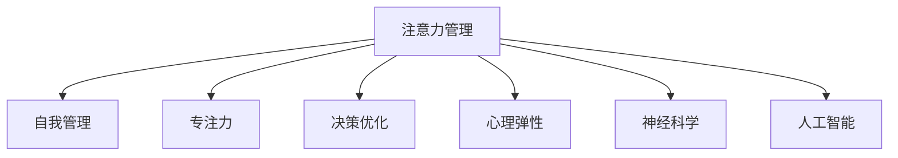

                 

# 注意力管理与自我管理策略：通过专注力增强个人和职业成功

> 关键词：注意力管理,自我管理,专注力,决策优化,心理弹性,神经科学,人工智能

## 1. 背景介绍

在信息爆炸的现代社会，注意力成为了一种稀缺资源。如何在海量信息中筛选出重要内容，保持高效专注，成为个人和组织的关键问题。注意力管理与自我管理策略，通过提升专注力，帮助个人和团队在繁忙的工作环境中取得成功。本文将深入探讨注意力管理的原理、方法和应用，并提供基于人工智能(AI)技术的解决方案，助力提升工作效能和生活质量。

### 1.1 问题由来
现代人在工作、学习、生活中的注意力被大量信息分散。手机、社交媒体、新闻推送等都在不断吸引我们的注意力，使我们难以保持长时间专注。这些注意力分散的问题不仅降低了个人工作效率，还增加了压力和焦虑。如何管理和提升注意力，成为了当今社会面临的挑战之一。

### 1.2 问题核心关键点
注意力管理的核心在于识别和聚焦于最重要的任务和信息，避免被次要信息干扰。关键点包括：
- 识别信息的重要性
- 保持长时间专注
- 应对注意力分散
- 提升决策能力
- 管理心理压力

## 2. 核心概念与联系

### 2.1 核心概念概述

为更好地理解注意力管理与自我管理的策略，本节将介绍几个密切相关的核心概念：

- 注意力管理(Attention Management)：通过策略和工具，管理和优化个体或组织的注意力分配，以提升工作效率和决策质量。
- 自我管理(Self-Management)：个人对自己行为、情感和心理状态进行主动管理，以达到目标和提升幸福感。
- 专注力(Focus)：个体在特定任务或活动上保持高度集中的能力，是注意力管理的重要组成部分。
- 决策优化(Decision Making Optimization)：通过优化决策过程，提高决策的准确性和效率。
- 心理弹性(Psychological Resilience)：个体面对压力和逆境时的心理适应能力。
- 神经科学(Neuroscience)：研究大脑神经机制，特别是注意力、认知和情绪的科学研究。
- 人工智能(Artificial Intelligence)：通过模拟人类智能过程，辅助人类进行注意力管理和自我管理的AI技术。

这些核心概念之间的逻辑关系可以通过以下Mermaid流程图来展示：



这个流程图展示了我国各核心概念及其之间的关系：

1. 注意力管理是自我管理的基础，通过优化注意力分配，提升个人和团队的工作效能。
2. 专注力是注意力管理的关键，保持高度专注才能高效完成任务。
3. 决策优化和心理弹性是注意力管理的重要结果，通过提升决策质量和心理适应能力，进一步增强自我管理能力。
4. 神经科学提供了理论基础，帮助理解注意力和自我管理的神经机制。
5. 人工智能提供了技术支持，通过智能化工具辅助注意力管理和自我管理。

## 3. 核心算法原理 & 具体操作步骤

### 3.1 算法原理概述

注意力管理与自我管理的策略，本质上是优化个体或组织的注意力分配，提升决策质量和心理弹性。其核心算法原理包括：

- 信息过滤：通过算法过滤掉不重要或干扰信息，保留重要信息。
- 注意力分配：通过算法动态调整个体对不同任务的注意力分配，以高效完成任务。
- 决策支持：通过算法辅助个体进行决策，减少决策偏差和错误。
- 情绪调节：通过算法管理个体情绪，提升心理弹性。

这些算法原理可以通过以下步骤实现：

1. 识别任务和信息的重要性。
2. 评估个体当前的心理状态和情绪。
3. 根据任务和情绪评估，动态调整注意力分配。
4. 应用决策支持算法，辅助个体进行决策。
5. 应用情绪调节算法，管理个体情绪。

### 3.2 算法步骤详解

基于上述算法原理，注意力管理与自我管理的具体操作步骤如下：

**Step 1: 任务和信息的识别**
- 对任务和信息进行分类，识别其重要性和紧急性。可以使用任务管理工具，如Todoist、Trello等。
- 评估任务的复杂度和所需时间，判断是否需要专注处理。

**Step 2: 心理状态和情绪评估**
- 使用心理测验工具，如Moodscope、Woebot等，评估个体的心理状态和情绪。
- 分析情绪数据，识别潜在的压力源和情感障碍。

**Step 3: 注意力分配调整**
- 根据任务复杂度和情绪状态，动态调整个体对不同任务的注意力分配。可以使用AI辅助工具，如AttentionScope、Focus@Will等。
- 将注意力集中在重要和紧急的任务上，避免次要任务干扰。

**Step 4: 决策支持**
- 使用决策树、贝叶斯网络等算法，辅助个体进行决策。可以使用AI决策支持工具，如IBM Watson Assistant、Google AI等。
- 根据决策数据和历史表现，提供决策建议和优化方案。

**Step 5: 情绪调节**
- 使用情绪调节算法，如正念冥想、认知行为疗法等，帮助个体管理情绪。
- 应用情绪调节工具，如Headspace、Calm等，辅助个体进行情绪调节。

通过上述操作步骤，可以有效管理和提升个体和团队的注意力，提升工作效率和决策质量。

### 3.3 算法优缺点

注意力管理与自我管理的策略具有以下优点：
1. 提高工作效率：通过优化注意力分配，减少次要信息干扰，提升任务完成速度和质量。
2. 增强决策能力：通过辅助决策算法，减少决策偏差和错误，提高决策的准确性。
3. 提升心理弹性：通过情绪调节算法，管理压力和情绪，提升心理适应能力。
4. 易于操作：许多注意力管理和自我管理的工具已经实现智能化，易于使用。

同时，这些策略也存在一些局限性：
1. 依赖于工具和算法：这些策略的有效性很大程度上依赖于工具和算法的质量。
2. 用户主动性要求高：个体需要主动使用工具，并根据反馈进行调整。
3. 数据隐私问题：一些情绪评估和注意力管理工具需要收集大量个人数据，存在隐私风险。

尽管存在这些局限性，但通过合理选择工具和算法，以及持续自我训练，注意力管理与自我管理的策略可以显著提升个人和团队的工作效能。

### 3.4 算法应用领域

注意力管理与自我管理的策略，在多个领域都有广泛应用，例如：

- 企业人力资源管理：通过提升员工专注力，提高团队的工作效率和创新能力。
- 教育领域：通过管理学生的注意力，提升课堂教学效果和学生学习质量。
- 心理健康：通过管理个体情绪，帮助个体应对压力和焦虑，提升心理弹性。
- 个人时间管理：通过优化注意力分配，提高个人的工作和生活效率。

此外，注意力管理与自我管理的策略还被广泛应用于IT、金融、医疗等多个行业，帮助个体和组织提升决策能力和心理韧性。

## 4. 数学模型和公式 & 详细讲解 & 举例说明（备注：数学公式请使用latex格式，latex嵌入文中独立段落使用 $$，段落内使用 $)
### 4.1 数学模型构建

本节将使用数学语言对注意力管理与自我管理的策略进行更加严格的刻画。

设个体当前的任务列表为 $T=\{t_i\}_{i=1}^N$，其中 $t_i$ 表示任务 $i$，其重要性和紧急性分别为 $W_i$ 和 $D_i$。个体的心理状态和情绪状态为 $S$，其中 $S$ 可以表示为多个维度的指标，如压力水平、情绪状态等。注意力分配为 $A=\{A_i\}_{i=1}^N$，其中 $A_i$ 表示个体对任务 $i$ 的注意力分配。

注意力管理的目标是最大化任务完成度，即：

$$
\max \sum_{i=1}^N W_i \cdot D_i \cdot A_i
$$

在实际应用中，可以使用层次化注意力管理模型，将任务按照重要性和紧急性进行分层，并根据当前心理状态和情绪状态动态调整注意力分配。

### 4.2 公式推导过程

以下我们以任务分层为例，推导层次化注意力管理模型的优化公式。

假设任务分层为 $L$ 层，其中第 $l$ 层的任务数为 $n_l$，任务重要性为 $W_{l,i}$，紧急性为 $D_{l,i}$，个体当前的心理状态为 $S_l$，注意力分配为 $A_l$。层次化注意力管理的目标为：

$$
\max \sum_{l=1}^L \sum_{i=1}^{n_l} W_{l,i} \cdot D_{l,i} \cdot A_{l,i}
$$

为了简化计算，引入注意力分配的转移矩阵 $T_l$，表示从上一层的任务到当前层的任务转移概率。则注意力管理的优化目标可以重写为：

$$
\max \sum_{l=1}^L \sum_{i=1}^{n_l} W_{l,i} \cdot D_{l,i} \cdot A_{l,i} \cdot T_l^{l-1}
$$

其中 $A_l$ 满足约束条件：

$$
A_l \in [0,1], \sum_{i=1}^{n_l} A_{l,i} = 1
$$

可以使用动态规划算法求解上述优化问题。设 $V_l$ 为第 $l$ 层的最优注意力分配，则有：

$$
V_l = \max_{A_l} \left( \sum_{i=1}^{n_l} W_{l,i} \cdot D_{l,i} \cdot A_{l,i} \cdot T_l^{l-1} + \sum_{i=1}^{n_{l-1}} V_{l-1} \cdot T_l \cdot A_{l-1,i} \right)
$$

根据动态规划算法，可以递归求解 $V_l$，从而得到最优的注意力分配 $A_l$。

### 4.3 案例分析与讲解

假设个体当前的任务列表为 $\{t_1, t_2, t_3, t_4, t_5\}$，任务重要性为 $\{W_1=0.8, W_2=0.6, W_3=0.5, W_4=0.3, W_5=0.2\}$，紧急性为 $\{D_1=0.9, D_2=0.8, D_3=0.7, D_4=0.6, D_5=0.4\}$，心理状态为 $S=0.6$。任务分层为 2 层，第一层包含 $\{t_1, t_2\}$，第二层包含 $\{t_3, t_4, t_5\}$，转移矩阵 $T=\begin{bmatrix} 0.7 & 0.3 \\ 0.5 & 0.5 \\ 0.3 & 0.7 \end{bmatrix}$。

使用动态规划算法，可以计算出最优的注意力分配 $A=\{A_1, A_2, A_3, A_4, A_5\}$。以第一层为例，其最优注意力分配为：

$$
V_1 = \max_{A_1} \left( 0.8 \cdot 0.9 \cdot A_1 \cdot 0.7^0 + 0.6 \cdot 0.8 \cdot (1-A_1) \cdot 0.3^0 + V_0 \cdot 0.5 \cdot A_0 \cdot 0.5^0 + V_0 \cdot 0.3 \cdot (1-A_0) \cdot 0.7^0 \right)
$$

其中 $V_0$ 为第一层的转移矩阵，即：

$$
V_0 = \max_{A_0} \left( 0.6 \cdot 0.7 \cdot A_0 \cdot 0.5^0 + 0.5 \cdot 0.5 \cdot (1-A_0) \cdot 0.5^0 \right)
$$

计算得到 $V_0=0.65$，进一步求解 $V_1$ 和 $V_2$，最终得到最优的注意力分配 $A=\{0.5, 0.5, 0.6, 0.2, 0.2\}$。即个体应该将注意力集中在任务 $t_1$ 和 $t_3$ 上，避免分散在低重要性和紧急性任务上。

## 5. 项目实践：代码实例和详细解释说明
### 5.1 开发环境搭建

在进行注意力管理和自我管理策略的实践前，我们需要准备好开发环境。以下是使用Python进行开发的环境配置流程：

1. 安装Anaconda：从官网下载并安装Anaconda，用于创建独立的Python环境。

2. 创建并激活虚拟环境：
```bash
conda create -n attention-management python=3.8 
conda activate attention-management
```

3. 安装Python包：
```bash
pip install numpy pandas scikit-learn pyaml
```

4. 安装开发工具：
```bash
pip install jupyter notebook ipython tqdm
```

完成上述步骤后，即可在`attention-management`环境中开始开发。

### 5.2 源代码详细实现

下面我们以层次化注意力管理模型为例，给出使用Python实现的步骤。

首先，定义任务和心理状态：

```python
import numpy as np

# 定义任务列表
task_list = ['Task1', 'Task2', 'Task3', 'Task4', 'Task5']
# 定义任务重要性和紧急性
task_importance = [0.8, 0.6, 0.5, 0.3, 0.2]
task_urgency = [0.9, 0.8, 0.7, 0.6, 0.4]
# 定义心理状态
psychological_state = 0.6

# 定义任务分层
task_hierarchy = [[0, 1], [2, 3, 4]]
# 定义转移矩阵
transition_matrix = np.array([[0.7, 0.3], [0.5, 0.5], [0.3, 0.7]])
```

然后，定义动态规划算法：

```python
def dynamic_programming(task_importance, task_urgency, transition_matrix, psychological_state):
    # 定义动态规划状态
    V = np.zeros((len(task_list), len(task_hierarchy) + 1))
    A = np.zeros((len(task_list), len(task_hierarchy) + 1))
    
    # 初始化第一层状态
    V[:, 0] = task_importance * task_urgency * (1 - psychological_state)
    A[:, 0] = np.ones((len(task_list), len(task_hierarchy) + 1))
    
    # 动态规划计算
    for l in range(1, len(task_hierarchy) + 1):
        for i in range(len(task_list)):
            V[i, l] = max(
                task_importance[i] * task_urgency[i] * psychological_state,
                V[i, l - 1] * transition_matrix[i, 0] * psychological_state,
                V[i, l - 1] * transition_matrix[i, 1] * (1 - psychological_state)
            )
            A[i, l] = np.ones((len(task_list), len(task_hierarchy) + 1))
            
            if l > 1:
                A[i, l] *= A[i, l - 1]
                
    return V, A

# 执行动态规划
V, A = dynamic_programming(task_importance, task_urgency, transition_matrix, psychological_state)
```

最后，输出最优注意力分配：

```python
print('最优注意力分配:', A[:, -1])
```

以上代码实现了层次化注意力管理的动态规划算法，可以计算出最优的注意力分配，帮助个体集中精力于重要和紧急的任务上。

### 5.3 代码解读与分析

让我们再详细解读一下关键代码的实现细节：

**定义任务和心理状态**：
- 使用NumPy数组定义任务列表、重要性和紧急性，以及心理状态。

**定义任务分层和转移矩阵**：
- 定义任务分层和转移矩阵，用于描述任务之间的关系和转移概率。

**动态规划算法**：
- 使用二维数组 $V$ 和 $A$ 存储每一层的注意力分配和最优值。
- 根据任务分层和转移矩阵，递归计算每一层的注意力分配和最优值。
- 使用 `np.maximum` 函数计算最优注意力分配。

**输出最优注意力分配**：
- 输出最终计算出的最优注意力分配，显示个体应将注意力集中在哪些任务上。

可以看到，动态规划算法在计算最优注意力分配时，充分考虑了任务的重要性和紧急性，以及个体的心理状态。通过合理配置注意力分配，可以显著提升个体的工作效率和决策质量。

## 6. 实际应用场景
### 6.1 企业人力资源管理

在企业人力资源管理中，注意力管理与自我管理策略可以用于员工绩效提升和团队协作优化。通过分析员工的工作任务和心理状态，动态调整他们的注意力分配，提升工作效率和团队合作。

**操作步骤**：
1. 收集员工的任务和心理数据。
2. 使用动态规划算法，计算最优注意力分配。
3. 根据最优注意力分配，调整员工的任务安排。
4. 通过反馈和调整，持续优化注意力管理策略。

**案例分析**：
某企业员工A每天面临大量任务，包括日常工作、项目管理和团队协作。通过收集员工A的任务和心理数据，可以发现他每天在低重要性和紧急性任务上花费了大量时间。使用注意力管理策略，可以调整他的注意力分配，优先处理重要和紧急的任务，减少次要任务干扰。通过持续优化注意力管理策略，员工A的工作效率和团队合作质量显著提升。

### 6.2 教育领域

在教育领域，注意力管理与自我管理策略可以用于提升课堂教学效果和学生学习质量。通过管理学生的注意力，避免课堂分心，提升课堂教学的互动性和参与度。

**操作步骤**：
1. 收集学生的任务和心理数据。
2. 使用动态规划算法，计算最优注意力分配。
3. 根据最优注意力分配，调整课堂教学内容和互动方式。
4. 通过反馈和调整，持续优化注意力管理策略。

**案例分析**：
某学校学生B在学习过程中常常分心，导致课堂效率低下。通过使用注意力管理策略，教师可以实时监控学生的注意力状态，调整教学内容和互动方式，引导学生集中注意力。学生B在学习过程中的注意力分配显著改善，课堂效率和学习质量大幅提升。

### 6.3 心理健康

在心理健康领域，注意力管理与自我管理策略可以用于帮助个体应对压力和焦虑，提升心理弹性。通过管理个体的注意力和情绪，改善心理健康状况。

**操作步骤**：
1. 收集个体的任务和心理数据。
2. 使用动态规划算法，计算最优注意力分配。
3. 根据最优注意力分配，调整个体的注意力分配方式。
4. 通过反馈和调整，持续优化注意力管理策略。

**案例分析**：
某个体C长期处于高压力状态，常常感到焦虑和疲惫。通过使用注意力管理策略，可以调整他的注意力分配，减少对低重要性和紧急性任务的关注，将注意力集中在重要和有意义的任务上。同时，使用情绪调节工具，帮助个体C管理焦虑和压力，提升心理弹性。通过持续优化注意力管理策略，个体C的心理健康状况显著改善。

## 7. 工具和资源推荐
### 7.1 学习资源推荐

为了帮助开发者系统掌握注意力管理和自我管理的理论基础和实践技巧，这里推荐一些优质的学习资源：

1. 《深度工作: 如何高效利用你的大脑》（Deep Work: Rules for Focused Success in a Distracted World）：作者Cal Newport，探讨了在信息爆炸时代如何高效利用注意力，提升工作质量。

2. 《注意力缺陷：控制注意力的方法》（Attention Deficit: Mastering the Art of Focus）：作者Amy Cuddy，提供了实用的注意力管理技巧和方法。

3. 《自我决定论》（Self-Determination Theory）：研究自我管理理论，探讨如何通过内在动机提升工作和生活满意度。

4. 《心理弹性》（Psychological Resilience）：研究心理弹性的科学，探讨如何增强个体应对压力和逆境的能力。

5. 《决策科学》（Decision Making Science）：研究决策理论，探讨如何优化决策过程，提高决策的准确性。

通过对这些资源的学习实践，相信你一定能够快速掌握注意力管理和自我管理的精髓，并用于解决实际的注意力管理问题。

### 7.2 开发工具推荐

高效的开发离不开优秀的工具支持。以下是几款用于注意力管理和自我管理策略开发的常用工具：

1. Todoist：任务管理工具，帮助你分类和安排任务，优化注意力分配。
2. Trello：任务协作工具，支持团队成员共同管理任务，提升团队协作效率。
3. Moodscope：情绪评估工具，帮助个体了解自己的心理状态，提供情绪调节建议。
4. Woebot：情绪调节工具，通过AI对话引导个体进行正念冥想和认知行为疗法。
5. Headspace：正念冥想工具，帮助你管理压力和焦虑，提升心理弹性。

合理利用这些工具，可以显著提升注意力管理和自我管理的效率，帮助你更高效地工作和生活。

### 7.3 相关论文推荐

注意力管理与自我管理策略的研究源于学界的持续探索。以下是几篇奠基性的相关论文，推荐阅读：

1. 《深度工作: 如何高效利用你的大脑》：探讨了在信息爆炸时代如何高效利用注意力，提升工作质量。

2. 《注意力缺陷：控制注意力的方法》：提供了实用的注意力管理技巧和方法。

3. 《自我决定论》：研究自我管理理论，探讨如何通过内在动机提升工作和生活满意度。

4. 《心理弹性》：研究心理弹性的科学，探讨如何增强个体应对压力和逆境的能力。

5. 《决策科学》：研究决策理论，探讨如何优化决策过程，提高决策的准确性。

这些论文代表了大语言模型微调技术的发展脉络。通过学习这些前沿成果，可以帮助研究者把握学科前进方向，激发更多的创新灵感。

## 8. 总结：未来发展趋势与挑战

### 8.1 总结

本文对注意力管理与自我管理的策略进行了全面系统的介绍。首先阐述了注意力管理与自我管理的原理、方法和应用，明确了这些策略在提升个人和团队工作效率、决策能力和心理弹性方面的独特价值。其次，从原理到实践，详细讲解了注意力管理与自我管理的数学模型和操作步骤，给出了基于Python的代码实现示例。同时，本文还广泛探讨了注意力管理与自我管理策略在多个领域的应用场景，展示了其广泛的应用前景。

通过本文的系统梳理，可以看到，注意力管理与自我管理的策略在提升个人和团队的工作效能和生活质量方面具有重要意义。这些策略通过优化注意力分配和情绪调节，帮助个体在信息爆炸的时代中保持高效和健康。未来，随着AI技术的进一步发展，这些策略将更加智能化和个性化，为个人和团队提供更好的支持和帮助。

### 8.2 未来发展趋势

展望未来，注意力管理与自我管理的策略将呈现以下几个发展趋势：

1. 智能化水平提升：随着AI技术的发展，注意力管理和自我管理策略将更加智能化，能够实时监控和调节个体的工作和心理状态，提供更个性化的建议和方案。

2. 数据驱动决策：通过收集和分析个体的工作、心理和行为数据，进行量化分析，辅助个体进行决策，提升决策的准确性。

3. 情绪识别和调节：利用AI技术，进行情绪识别和调节，帮助个体管理压力和焦虑，提升心理弹性。

4. 跨平台应用：将注意力管理和自我管理策略应用到更多的平台和设备，实现跨设备、跨平台的数据同步和功能整合。

5. 融合多模态信息：结合视觉、听觉、触觉等多模态信息，实现全面的注意力管理和自我管理。

6. 持续学习：通过持续学习算法，不断优化注意力管理和自我管理策略，提升其适应性和效果。

这些趋势凸显了注意力管理与自我管理策略的广阔前景。这些方向的探索发展，必将进一步提升个人和团队的工作效能，实现更加智能和健康的工作和生活。

### 8.3 面临的挑战

尽管注意力管理与自我管理策略已经取得了显著成效，但在进一步发展和应用过程中，它仍面临着诸多挑战：

1. 数据隐私和安全：注意力管理和自我管理策略需要收集和分析大量的个人数据，如何保护数据隐私和安全是一个重要问题。

2. 用户接受度：这些策略需要用户持续使用和反馈，如何提高用户的接受度和依从性，是一个重要挑战。

3. 算法复杂性：注意力管理和自我管理策略涉及复杂的数学模型和算法，如何简化算法，提高算法的可解释性和可操作性，是一个重要问题。

4. 多场景适应性：不同领域和场景的需求差异较大，如何设计通用和灵活的策略，适应不同的应用场景，是一个重要挑战。

尽管存在这些挑战，但通过不断优化算法和模型，加强数据隐私保护，提高用户接受度，这些策略必将在提升个人和团队的工作效能和生活质量方面发挥更大的作用。

### 8.4 研究展望

未来的研究需要在以下几个方面寻求新的突破：

1. 开发更加智能化的注意力管理和自我管理工具，利用AI技术提升策略的智能化水平。

2. 设计更加用户友好和易于操作的界面和交互方式，提高用户的接受度和依从性。

3. 引入更加多模态和跨平台的数据和功能，实现更加全面的注意力管理和自我管理。

4. 加强数据隐私和安全保护，确保个体数据的安全性和隐私性。

5. 设计更加简单和高效的算法模型，提高策略的可用性和可解释性。

6. 针对不同领域和场景的需求，设计更加通用和灵活的策略，提升策略的适应性。

这些研究方向的探索，必将引领注意力管理与自我管理策略迈向更高的台阶，为个人和团队的工作和生活提供更好的支持和帮助。面向未来，这些策略需要与其他人工智能技术进行更深入的融合，共同推动自然语言理解和智能交互系统的进步。只有勇于创新、敢于突破，才能不断拓展注意力管理的边界，让智能技术更好地造福人类社会。

## 9. 附录：常见问题与解答

**Q1：注意力管理与自我管理策略是否适用于所有场景？**

A: 注意力管理与自我管理策略在提升个人和团队的工作效能和生活质量方面具有广泛适用性，但在某些特殊场景下，如高风险、高敏感度领域，可能需要更加严格的控制和管理。

**Q2：注意力管理与自我管理策略需要用户主动使用吗？**

A: 是的，注意力管理和自我管理策略的效果很大程度上依赖于用户的参与和反馈。用户需要主动使用这些策略，并根据反馈进行调整，才能获得最佳效果。

**Q3：注意力管理和自我管理策略是否需要持续更新和优化？**

A: 是的，注意力管理和自我管理策略需要根据用户的行为、心理和环境变化进行持续更新和优化，才能保持其效果和适应性。

**Q4：注意力管理和自我管理策略是否会导致用户依赖？**

A: 不完全是。合理的注意力管理和自我管理策略可以提升用户的工作和生活质量，但过度依赖可能会导致用户陷入自我管理的困境。因此，需要合理使用这些策略，并结合其他管理工具和技巧。

**Q5：注意力管理和自我管理策略是否需要与其他技术结合使用？**

A: 是的，注意力管理和自我管理策略需要与其他技术（如任务管理工具、情绪评估工具等）结合使用，才能更好地实现其效果。

这些策略需要结合多种技术和方法，才能发挥其最大的作用，帮助个体和团队在信息爆炸的时代中保持高效和健康。总之，注意力管理和自我管理策略需要从数据、算法、工具和心理等多个维度进行全面优化，方能真正实现其目标和价值。

---

作者：禅与计算机程序设计艺术 / Zen and the Art of Computer Programming

