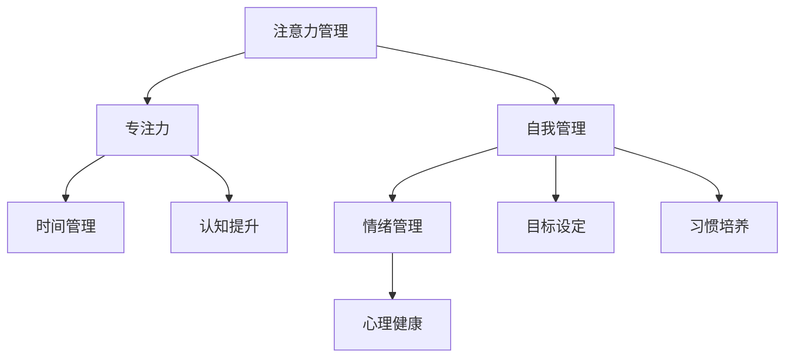

                 

# 注意力管理与自我管理：如何通过专注力实现个人成长

> 关键词：注意力管理,自我管理,专注力,个人成长,时间管理,认知提升,心理健康

## 1. 背景介绍

### 1.1 问题由来
在信息爆炸的时代，人们面临前所未有的信息压力和注意力分散挑战。无论是日常工作还是个人生活，高效的注意力管理成为了达成目标和提升个人成长的关键。如何在众多干扰中保持专注，实现高效自我管理，成为了现代社会中人们普遍关注的问题。

### 1.2 问题核心关键点
注意力管理与自我管理的核心在于如何有效地分配和利用注意力资源，以实现个人和职业目标。注意力管理涉及到对干扰因素的控制和排除，以及对有益刺激的集中和深化。自我管理则更多关注于内心的认知调整，如情绪控制、目标设定、习惯培养等。

注意力管理和自我管理相辅相成，两者都是实现个人成长的重要工具。有效的注意力管理可以提升工作效率，节省时间，而良好的自我管理则有助于保持心理健康，实现长期的个人目标。

### 1.3 问题研究意义
提升个人注意力管理和自我管理能力，对于提高生产力和生活满意度，实现个人成长具有重要意义。它可以帮助人们在繁忙的工作和生活中，更好地分配和利用有限的时间和资源，达成更高的目标和实现更健康的生活状态。同时，这也为人工智能、机器学习、人机交互等领域提供了重要的应用方向，通过技术手段辅助和提升人类注意力和自我管理能力。

## 2. 核心概念与联系

### 2.1 核心概念概述

为更好地理解注意力管理与自我管理的核心概念，本节将介绍几个密切相关的核心概念：

- 注意力管理(Attention Management)：指通过一系列策略和工具，帮助个体有效控制和分配注意力的过程。注意力管理的目的是减少干扰，提高集中度，从而提升任务完成效率和效果。
- 自我管理(Self-Management)：指个人对自己行为、情绪和认知的监控和调节，以实现目标和提升生活质量。自我管理包括时间管理、情绪管理、目标设定、习惯培养等多个方面。
- 专注力(Focus)：指个体在特定任务上投入的全部心理资源和能量，包括注意力的集中、情绪的稳定和意志力的坚持。专注力是注意力管理和自我管理的重要组成部分。
- 时间管理(Time Management)：指对时间资源的有效规划和分配，以实现效率最大化和目标达成。时间管理是自我管理的重要组成部分，与注意力管理密切相关。
- 认知提升(Cognitive Enhancement)：指通过各种手段提高个体的认知能力，如记忆力、思维能力和决策能力等，是自我管理的重要目标之一。
- 心理健康(Mental Health)：指个体在情感、认知和行为上的良好状态，是自我管理的重要维度之一，与注意力管理密切相关。

这些核心概念之间的逻辑关系可以通过以下Mermaid流程图来展示：



这个流程图展示了几组核心概念之间的联系：

1. 注意力管理通过减少干扰，提升专注力，是时间管理和认知提升的重要基础。
2. 自我管理通过目标设定、习惯培养等手段，帮助个体保持心理健康，同时也需要良好的时间管理和认知能力。
3. 专注力是注意力管理的目标，也是自我管理中的核心能力之一。
4. 时间管理和认知提升相互促进，共同提升个人效率和质量。
5. 情绪管理与心理健康相互影响，是自我管理的核心维度之一。

## 3. 核心算法原理 & 具体操作步骤
### 3.1 算法原理概述

注意力管理和自我管理的算法原理，可以追溯到心理学和神经科学的研究。其核心思想是通过认知行为干预和环境调节，提升个体的注意力和自我管理能力。

基于这一思想，注意力管理与自我管理的算法通常包括以下几个关键步骤：

1. **目标设定**：明确具体的个人目标，设定可量化的时间节点和标准，帮助个体集中注意力和资源。
2. **干扰排除**：识别和排除可能的干扰因素，如社交媒体、噪音等，确保专注力集中于当前任务。
3. **时间规划**：根据目标设定，合理分配时间，制定详细的日程安排，确保任务有序进行。
4. **情绪调节**：通过冥想、运动等手段，控制和调节情绪，保持心理健康和稳定。
5. **习惯养成**：通过重复训练和正反馈，建立和巩固良好的工作和生活习惯。
6. **认知提升**：通过学习和训练，提升个体的认知能力，如记忆力和决策能力。

### 3.2 算法步骤详解

以下是具体的注意力管理和自我管理算法的详细步骤：

#### 3.2.1 目标设定

目标设定是注意力管理和自我管理的基础，其步骤如下：

1. **明确具体目标**：将大目标分解为小任务，明确每个任务的具体要求和时间节点。例如，一个具体的目标是“在两周内完成一份报告”。
2. **设定优先级**：根据任务的重要性和紧急程度，设定优先级，确保高优先级任务优先完成。
3. **时间节点**：设定每个任务的完成时间节点，帮助跟踪进度。

#### 3.2.2 干扰排除

干扰排除的关键在于识别和消除可能分散注意力的因素。具体步骤包括：

1. **环境优化**：选择一个安静、整洁、舒适的工作环境，减少外部干扰。
2. **技术工具**：使用如专注模式、时间管理应用等工具，帮助屏蔽干扰。
3. **任务聚焦**：专注于当前任务，避免多任务处理，确保注意力集中。

#### 3.2.3 时间规划

时间规划的目的是通过合理分配时间，提高任务完成效率。具体步骤如下：

1. **制定日程**：根据目标和优先级，制定详细的日程安排，将时间划分为工作、学习、休息等不同板块。
2. **任务分解**：将大任务分解为小任务，每天设定具体的任务清单。
3. **时间块**：采用时间块技术，将工作时间划分为若干个时间块，每个时间块集中处理一个任务。

#### 3.2.4 情绪调节

情绪调节的目的是通过调整情绪状态，保持心理健康和稳定。具体步骤如下：

1. **冥想**：每天进行短暂的冥想练习，帮助缓解压力和焦虑。
2. **运动**：定期进行身体锻炼，提升身体健康和心理状态。
3. **社交支持**：与亲友保持良好的沟通，寻求情感支持和共鸣。

#### 3.2.5 习惯养成

习惯养成是通过重复训练和正反馈，建立和巩固良好的工作和生活习惯。具体步骤如下：

1. **行为跟踪**：使用习惯跟踪应用，记录和分析行为习惯，识别不良习惯。
2. **设定小目标**：设定每日或每周的小目标，逐步养成新习惯。
3. **正反馈**：及时给予自己正反馈，庆祝小成就，保持积极心态。

#### 3.2.6 认知提升

认知提升的目的是通过学习和训练，提升个体的认知能力。具体步骤如下：

1. **阅读学习**：定期阅读相关书籍和文章，拓展知识面。
2. **技能培训**：参加相关培训和课程，提升专业技能。
3. **脑力训练**：进行如数学题解、语言游戏等脑力训练，提升认知能力。

### 3.3 算法优缺点

注意力管理和自我管理的算法有以下优点：

1. **系统化管理**：通过明确目标和详细规划，确保任务有序进行，提升效率和效果。
2. **自动化工具**：利用技术工具，帮助排除干扰，提高专注力和执行力。
3. **心理支持**：通过情绪调节和认知提升，帮助个体保持心理健康和积极心态。

同时，这些算法也存在一些缺点：

1. **实施难度**：需要一定的时间和精力投入，实施起来可能较为复杂。
2. **个人差异**：不同个体的需求和偏好不同，需要根据具体情况进行调整。
3. **持续性问题**：习惯的养成需要时间，需要坚持不懈的努力和调整。

### 3.4 算法应用领域

注意力管理和自我管理的算法广泛应用于个人成长和职业发展的各个领域：

1. **职场效率提升**：通过时间管理和任务聚焦，提升工作效率和任务完成率。
2. **学业成绩提升**：通过目标设定和习惯养成，帮助学生有效规划学习时间和任务，提高成绩。
3. **心理健康改善**：通过情绪调节和认知提升，帮助个体保持心理健康，提升生活质量。
4. **职业规划与发展**：通过设定长期目标和短期计划，帮助个体在职业道路上持续进步。

此外，这些算法在教育、医疗、心理辅导等多个领域也有广泛应用，为个体提供全面的支持和帮助。

## 4. 数学模型和公式 & 详细讲解 & 举例说明（备注：数学公式请使用latex格式，latex嵌入文中独立段落使用 $$，段落内使用 $)
### 4.1 数学模型构建

注意力管理和自我管理的数学模型构建，主要基于时间管理、目标设定和行为分析等理论。以下是几个核心模型：

#### 4.1.1 时间管理模型

时间管理模型通常采用时间块(Timing Block)技术，将时间划分为若干个固定时间段，每个时间段内专注于一个任务。其数学模型为：

$$
T = \sum_{i=1}^n t_i
$$

其中，$T$ 为总时间，$t_i$ 为每个时间块的持续时间。

#### 4.1.2 目标设定模型

目标设定模型通常采用SMART原则（Specific, Measurable, Achievable, Relevant, Time-bound），将大目标分解为小任务，设定具体的时间节点。其数学模型为：

$$
G = \sum_{j=1}^m \frac{g_j}{d_j}
$$

其中，$G$ 为总目标，$g_j$ 为第 $j$ 个小目标，$d_j$ 为完成时间。

#### 4.1.3 行为分析模型

行为分析模型通过记录和分析个体的行为数据，识别不良习惯和改进方向。其数学模型为：

$$
H = \sum_{k=1}^K h_k
$$

其中，$H$ 为总行为习惯得分，$h_k$ 为第 $k$ 个习惯的得分。

### 4.2 公式推导过程

以下我们以时间管理模型为例，推导时间块技术的具体实现。

假设总时间为 $T$，每个时间块的持续时间为 $t_i$，每个任务的时间估算为 $d_j$，则时间管理模型的具体实现步骤如下：

1. **任务分解**：将总任务分解为 $m$ 个小任务，每个任务的时间估算为 $d_j$。
2. **时间块划分**：将总时间 $T$ 划分为 $n$ 个时间块，每个时间块的持续时间为 $t_i$。
3. **任务分配**：将每个任务 $g_j$ 分配到合适的时间块 $i$，确保每个时间块内只处理一个任务。

时间块技术的具体实现步骤如下：

1. **任务优先级排序**：根据任务的重要性和紧急程度，对任务进行优先级排序。
2. **时间块安排**：将高优先级任务安排在较长的时间块中，低优先级任务安排在较短的时间块中。
3. **任务执行**：在每个时间块内，集中处理一个任务，直到任务完成或时间块结束。

### 4.3 案例分析与讲解

以一个具体的案例来说明时间管理模型的应用。假设一个项目经理需要完成一个为期一周的项目，总时间为7天。项目包括多个任务，每个任务的时间估算如下：

- 任务1：3天
- 任务2：2天
- 任务3：2天
- 任务4：2天
- 任务5：1天

根据时间管理模型的计算，可以得出如下时间块安排：

| 时间块编号 | 持续时间 | 任务 |
| --- | --- | --- |
| 1 | 3天 | 任务1 |
| 2 | 2天 | 任务2 |
| 3 | 2天 | 任务3 |
| 4 | 1天 | 任务4 |
| 5 | 1天 | 任务5 |

这种时间块安排可以帮助项目经理合理分配时间，确保每个任务按时完成。同时，由于每个时间块内只处理一个任务，可以有效避免多任务处理带来的注意力分散问题。

## 5. 项目实践：代码实例和详细解释说明
### 5.1 开发环境搭建

在进行注意力管理和自我管理算法实践前，我们需要准备好开发环境。以下是使用Python进行开发的环境配置流程：

1. 安装Python：从官网下载并安装Python，确保版本为3.6以上。
2. 安装必要的库：如Pandas、Matplotlib、Scikit-Learn等，用于数据分析和可视化。
3. 配置开发工具：如Jupyter Notebook、PyCharm等，用于编写和调试代码。

完成上述步骤后，即可在本地或云端平台上进行注意力管理和自我管理算法的开发和测试。

### 5.2 源代码详细实现

下面以一个具体的时间管理模型实现为例，展示如何使用Python进行注意力管理和自我管理算法的开发。

```python
import pandas as pd
import numpy as np
import matplotlib.pyplot as plt

# 定义任务和任务时间估算
tasks = {'任务1': 3, '任务2': 2, '任务3': 2, '任务4': 2, '任务5': 1}

# 定义时间块大小和总时间
time_block_duration = 1
total_time = sum(tasks.values())

# 计算每个任务所需时间块数量
task_blocks = {}
for task, time in tasks.items():
    task_blocks[task] = np.ceil(time / time_block_duration)

# 生成时间块安排表
time_blocks = []
while total_time > 0:
    for task in tasks:
        if tasks[task] > 0 and task_blocks[task] > 0:
            total_time -= tasks[task]
            task_blocks[task] -= 1
            time_blocks.append((task, time_block_duration))

# 输出时间块安排表
print('时间块安排表：')
for task, block in time_blocks:
    print(f'{task}: {block} 天')

# 可视化时间块安排图
plt.bar(range(len(tasks)), task_blocks.values(), color='blue')
plt.xticks(range(len(tasks)), list(tasks.values()), rotation=45)
plt.xlabel('任务')
plt.ylabel('所需时间块数量')
plt.title('时间块安排图')
plt.show()
```

这段代码实现了一个简单的时间管理模型，将任务时间估算转换为所需的时间块数量，并生成了一个时间块安排表和可视化的时间块安排图。

### 5.3 代码解读与分析

这段代码实现了以下几个关键步骤：

1. **任务时间估算**：使用一个字典存储每个任务的时间估算。
2. **时间块大小**：定义每个时间块的持续时间，这里假设为1天。
3. **任务所需时间块数量**：计算每个任务所需的时间块数量，使用np.ceil函数向上取整。
4. **时间块安排**：通过循环和条件判断，生成时间块安排表。
5. **可视化安排**：使用Matplotlib库绘制时间块安排图。

这段代码的优点在于简单直观，易于理解和修改。然而，由于其逻辑相对简单，只能处理较小规模的任务安排，对于复杂的多任务管理场景，可能需要进一步优化。

## 6. 实际应用场景
### 6.1 智能客服系统

智能客服系统可以通过注意力管理和自我管理算法，提升客服人员的效率和质量。具体应用包括：

1. **任务优先级排序**：通过设定任务优先级，确保高优先级客户请求优先响应。
2. **时间块划分**：将客户请求分配到不同的时间块，确保每个时间块内只处理一个请求。
3. **情绪调节**：通过定期休息和心理疏导，帮助客服人员保持良好心理状态。

### 6.2 金融交易平台

金融交易平台可以利用时间管理和自我管理算法，提高交易效率和风险控制能力。具体应用包括：

1. **时间块安排**：将交易任务和分析任务分配到不同的时间块，确保每个时间块内专注于一个任务。
2. **任务聚焦**：通过减少多任务处理，提高交易执行的准确性和效率。
3. **认知提升**：通过持续学习和技能培训，提升交易员和分析师的专业能力。

### 6.3 健康管理平台

健康管理平台可以利用时间管理和自我管理算法，提升用户的健康和生活质量。具体应用包括：

1. **目标设定**：通过设定健康目标和每日任务，帮助用户建立良好的生活习惯。
2. **情绪调节**：通过冥想、运动等手段，帮助用户缓解压力和焦虑。
3. **行为分析**：通过记录和分析用户的行为数据，提供个性化的健康建议。

### 6.4 未来应用展望

随着人工智能和机器学习技术的不断发展，注意力管理和自我管理算法将具备更强大的智能化能力。未来可能的应用场景包括：

1. **个性化推荐**：通过分析用户的行为和心理状态，提供个性化的任务和时间安排建议。
2. **情绪识别**：通过分析用户的语音和文字数据，识别情绪状态，提供及时的心理支持。
3. **动态调整**：根据用户的行为反馈和心理状态，动态调整任务和时间安排，提升用户体验。

## 7. 工具和资源推荐
### 7.1 学习资源推荐

为了帮助开发者系统掌握注意力管理和自我管理的理论基础和实践技巧，这里推荐一些优质的学习资源：

1. 《注意力管理与自我管理》系列博文：由心理学和计算机科学专家撰写，深入浅出地介绍了注意力管理和自我管理的理论基础和实践方法。
2. 《时间管理与效率提升》书籍：讲解了时间管理的基本原理和具体方法，提供了实用的时间管理工具和技巧。
3. 《认知行为疗法》课程：介绍了认知行为疗法的原理和实践，帮助用户调整不良情绪和行为。
4. 《番茄工作法》书籍：介绍了番茄工作法的原理和实践方法，帮助用户提升工作效率。
5. 《专注力训练》课程：讲解了专注力的重要性及其训练方法，提供了一系列训练技巧和工具。

通过对这些资源的学习实践，相信你一定能够快速掌握注意力管理和自我管理的精髓，并用于解决实际的个人成长问题。

### 7.2 开发工具推荐

高效的开发离不开优秀的工具支持。以下是几款用于注意力管理和自我管理算法开发的常用工具：

1. Jupyter Notebook：用于编写和运行Python代码，支持代码和数据可视化。
2. PyCharm：一个强大的IDE，支持代码编写、调试和测试。
3. Pandas：一个数据分析库，支持数据处理和分析。
4. Matplotlib：一个数据可视化库，支持绘制各种图表。
5. Scikit-Learn：一个机器学习库，支持模型训练和评估。

合理利用这些工具，可以显著提升注意力管理和自我管理算法的开发效率，加快创新迭代的步伐。

### 7.3 相关论文推荐

注意力管理和自我管理的研究源于学界的持续研究。以下是几篇奠基性的相关论文，推荐阅读：

1. "The Power of Habit"（《习惯的力量》）：由Charles Duhigg所著，讲解了习惯的形成和改变机制，提供了实用的习惯养成方法。
2. "Deep Work"（《深度工作》）：由Cal Newport所著，讲解了深度工作的原理和实践方法，提供了提升专注力和效率的策略。
3. "Flow: The Psychology of Optimal Experience"（《心流》）：由Mihaly Csikszentmihalyi所著，讲解了心流的概念和实现方法，提供了提升幸福感和生产力的策略。
4. "The Willpower Instinct"（《意志力的力量》）：由Kelly McGonigal所著，讲解了意志力的原理和实践方法，提供了提升自控力和执行力的策略。
5. "Drive: The Surprising Truth About What Motivates Us"（《驱动力》）：由Daniel Pink所著，讲解了驱动力的原理和实现方法，提供了提升内驱力和自我激励的策略。

这些论文代表了大注意力管理和自我管理的发展脉络。通过学习这些前沿成果，可以帮助研究者把握学科前进方向，激发更多的创新灵感。

## 8. 总结：未来发展趋势与挑战
### 8.1 总结

本文对注意力管理和自我管理的核心算法进行了全面系统的介绍。首先阐述了注意力管理和自我管理的背景和意义，明确了注意力管理和自我管理在提升个人成长和效率中的重要性。其次，从原理到实践，详细讲解了注意力管理和自我管理的算法步骤，提供了实际应用的代码实现。同时，本文还广泛探讨了注意力管理和自我管理在多个行业领域的应用前景，展示了其巨大的应用潜力。

通过本文的系统梳理，可以看到，注意力管理和自我管理算法正成为提升个人生产力和生活品质的重要工具。这些算法的实施和优化，可以帮助人们在繁忙的工作和生活中，更好地分配和利用有限的时间和资源，达成更高的目标和实现更健康的生活状态。未来，伴随人工智能和机器学习技术的不断发展，注意力管理和自我管理算法将具备更强大的智能化能力，进一步提升人类的生活质量和工作效率。

### 8.2 未来发展趋势

展望未来，注意力管理和自我管理算法将呈现以下几个发展趋势：

1. **智能化提升**：通过人工智能和机器学习技术，提升注意力管理和自我管理的智能化水平，提供更加个性化的建议和服务。
2. **多模态融合**：将文本、语音、图像等多种模态信息融合，提供更全面、深入的分析和建议。
3. **环境自适应**：根据环境变化和用户反馈，动态调整注意力管理和自我管理策略，提高适应性和灵活性。
4. **交互性增强**：通过自然语言处理和智能助手，实现人机交互，提供更加高效、便捷的服务。
5. **跨领域应用**：在教育、医疗、金融等多个领域推广应用，提供全面的支持和服务。

以上趋势凸显了注意力管理和自我管理算法的广阔前景。这些方向的探索发展，必将进一步提升个人效率和生活质量，为人工智能技术在更广泛的场景中落地应用提供重要支持。

### 8.3 面临的挑战

尽管注意力管理和自我管理算法已经取得了一定的进展，但在向更深层次和更广泛场景推广应用的过程中，仍面临诸多挑战：

1. **个性化需求差异**：不同用户的个性化需求差异较大，需要针对不同用户群体提供定制化的解决方案。
2. **数据隐私和安全**：用户数据的隐私和安全问题需要得到充分保护，避免数据泄露和滥用。
3. **技术复杂性**：算法的实现和优化需要深厚的技术积累和实践经验，存在一定的技术难度。
4. **用户接受度**：用户对于新技术和新方法的接受度和信任度需要进一步提高，才能有效推广应用。
5. **长期效果评估**：算法的长期效果评估和持续优化需要进一步探索和验证，确保用户长期受益。

正视这些挑战，积极应对并寻求突破，将是注意力管理和自我管理算法进一步发展的关键。相信随着技术的发展和应用的深入，这些挑战终将逐步得到解决，注意力管理和自我管理算法将更好地服务于人类的生活和工作。

### 8.4 研究展望

面对注意力管理和自我管理算法面临的挑战，未来的研究需要在以下几个方面寻求新的突破：

1. **跨模态融合技术**：将文本、语音、图像等多模态信息融合，提供更全面、深入的分析和建议。
2. **个性化推荐算法**：基于用户行为和心理状态，提供更加个性化的注意力管理和自我管理建议。
3. **长期行为预测**：通过机器学习模型，预测用户的长期行为变化，提供动态调整的策略。
4. **人机协同机制**：通过人机协同机制，提高算法的透明度和可解释性，增强用户的信任和接受度。
5. **隐私保护技术**：采用先进的隐私保护技术，保护用户数据的隐私和安全。

这些研究方向的探索，必将引领注意力管理和自我管理算法迈向更高的台阶，为提升个人效率和生活质量提供更加强大的技术支持。面向未来，需要更多学界和产业界的共同努力，推动注意力管理和自我管理算法的不断创新和优化，实现更好的应用效果和社会价值。

## 9. 附录：常见问题与解答

**Q1：注意力管理与自我管理有什么区别？**

A: 注意力管理和自我管理虽然都关注于提升个人效率和生活质量，但侧重点略有不同。注意力管理更多关注于时间的有效规划和分配，提升任务完成效率。而自我管理则更多关注于内心的调整和行为改进，提升心理状态和生活满意度。两者相辅相成，共同构成个人成长的重要组成部分。

**Q2：注意力管理和自我管理如何有效结合？**

A: 注意力管理和自我管理可以通过任务优先级排序、时间块安排、情绪调节和认知提升等多种手段，实现有效结合。具体步骤如下：

1. **任务分解**：将大目标分解为小任务，明确每个任务的具体要求和时间节点。
2. **时间规划**：根据任务的重要性和紧急程度，合理分配时间，制定详细的日程安排。
3. **情绪调节**：通过冥想、运动等手段，控制和调节情绪，保持心理健康和稳定。
4. **习惯养成**：通过重复训练和正反馈，建立和巩固良好的工作和生活习惯。
5. **认知提升**：通过学习和训练，提升个体的认知能力，如记忆力和决策能力。

通过以上步骤，可以更好地结合注意力管理和自我管理，提升个人效率和生活质量。

**Q3：注意力管理与自我管理在实施过程中需要注意哪些问题？**

A: 在实施注意力管理和自我管理过程中，需要注意以下问题：

1. **实施难度**：需要一定的时间和精力投入，实施起来可能较为复杂。
2. **个性化差异**：不同个体的需求和偏好不同，需要根据具体情况进行调整。
3. **持续性问题**：习惯的养成需要时间，需要坚持不懈的努力和调整。
4. **技术依赖**：依赖于各种工具和技术的支持，技术故障可能导致执行困难。
5. **反馈机制**：需要建立有效的反馈机制，及时调整策略和优化方案。

通过合理安排和灵活调整，可以更好地实现注意力管理和自我管理的目标。

**Q4：注意力管理和自我管理算法的应用场景有哪些？**

A: 注意力管理和自我管理算法广泛应用于多个领域，具体应用场景包括：

1. **职场效率提升**：通过时间管理和任务聚焦，提升工作效率和任务完成率。
2. **学业成绩提升**：通过目标设定和习惯养成，帮助学生有效规划学习时间和任务，提高成绩。
3. **心理健康改善**：通过情绪调节和认知提升，帮助个体保持心理健康，提升生活质量。
4. **职业规划与发展**：通过设定长期目标和短期计划，帮助个体在职业道路上持续进步。

此外，注意力管理和自我管理算法在教育、医疗、心理辅导等多个领域也有广泛应用，为个体提供全面的支持和帮助。

---

作者：禅与计算机程序设计艺术 / Zen and the Art of Computer Programming

