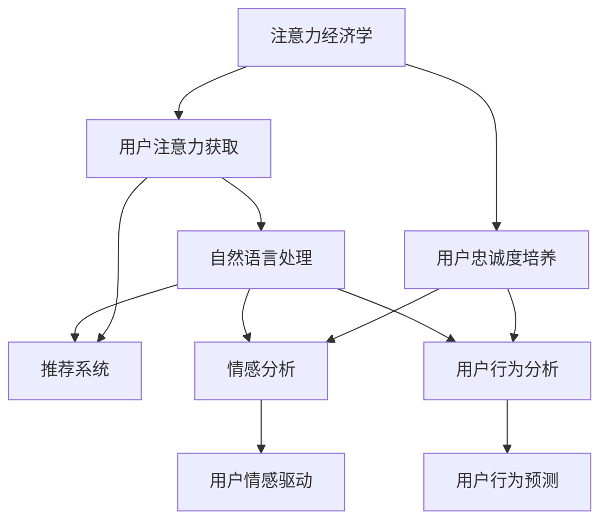

                 

# 注意力经济下的用户忠诚度培养

在数字化时代，注意力成为了一种稀缺资源，企业越来越重视如何吸引和维持用户的注意力。随着AI技术的发展，特别是自然语言处理(NLP)和推荐系统技术的进步，注意力经济学和用户忠诚度的培养已经成为企业战略的核心组成部分。本文将深入探讨在注意力经济环境下，如何利用AI技术，尤其是自然语言处理，来培养和维持用户忠诚度。

## 1. 背景介绍

### 1.1 问题由来

随着互联网和移动互联网的普及，信息的传播速度和获取方式发生了巨大的变化。用户被大量的信息所包围，注意力成为稀缺资源。企业不仅要吸引用户的注意力，更要维持用户的长期关注，以形成持续的忠诚度。在这个背景下，注意力经济学的概念应运而生，强调通过有效的注意力管理，创造和获取经济价值。

注意力经济学关注的是如何通过吸引、保持和转化用户注意力来提升商业价值。用户忠诚度则是指用户对品牌或产品的长期承诺和偏好，是企业持续盈利的重要保障。在注意力经济环境下，企业如何通过AI技术，特别是自然语言处理，来培养和维持用户忠诚度，成为了一个重要的研究课题。

### 1.2 问题核心关键点

注意力经济与用户忠诚度培养的核心关键点包括：
- **注意力获取**：如何有效地吸引用户的注意力。
- **注意力保持**：如何持续保持用户的关注。
- **注意力转化**：如何将用户的注意力转化为实际价值。
- **用户忠诚度**：如何通过用户的持续互动和情感投资，培养长期的忠诚度。

这些关键点在注意力经济学和用户忠诚度培养的研究中，共同构成了研究框架。本文将从注意力获取、保持和转化的角度，探讨AI技术在用户忠诚度培养中的应用。

## 2. 核心概念与联系

### 2.1 核心概念概述

- **注意力经济学**：指通过管理和利用用户的注意力资源，创造经济价值的过程。
- **用户忠诚度**：用户对品牌或产品的长期承诺和偏好，是企业可持续发展的关键。
- **自然语言处理(NLP)**：利用计算机处理和理解自然语言的技术，广泛应用于信息检索、文本分类、机器翻译等领域。
- **推荐系统**：通过分析用户行为和兴趣，推荐相关内容的技术，广泛应用于电商、新闻、视频等平台。
- **情感分析**：利用自然语言处理技术，分析用户文本中的情感倾向，帮助企业了解用户情绪和需求。
- **用户行为分析**：通过分析用户在平台上的行为数据，预测用户偏好和需求，提升用户体验。

这些核心概念通过自然语言处理技术，实现了对用户注意力的有效管理，进而影响和维持用户忠诚度。

### 2.2 核心概念原理和架构的 Mermaid 流程图



这个流程图展示了注意力经济环境下，自然语言处理如何通过用户注意力获取、保持和转化，最终影响用户忠诚度的过程。

## 3. 核心算法原理 & 具体操作步骤

### 3.1 算法原理概述

在注意力经济环境下，用户注意力的获取和保持，主要依赖于两个方面的技术：自然语言处理和推荐系统。自然语言处理通过分析用户生成的文本，了解用户需求和情感，从而引导用户行为；推荐系统则通过分析用户历史行为，预测用户偏好，推荐相关内容。用户忠诚度的培养，则需要通过持续的互动和情感投资，实现用户的情感绑定和长期承诺。

#### 3.1.1 自然语言处理

自然语言处理在注意力获取和保持中起到关键作用。通过分析用户生成的文本，企业可以了解用户的兴趣、需求和情感状态。常用的自然语言处理技术包括：

- **情感分析**：通过分析文本中的情感倾向，了解用户对品牌或产品的情感态度。情感分析可以帮助企业及时调整策略，提升用户体验。
- **用户行为分析**：通过分析用户在平台上的行为数据，预测用户偏好和需求。用户行为分析可以帮助企业定制个性化的内容推荐，提高用户满意度。

#### 3.1.2 推荐系统

推荐系统通过分析用户历史行为，预测用户未来行为，实现对用户注意力的有效管理。常用的推荐系统技术包括：

- **协同过滤**：通过分析用户的历史行为，预测用户对新内容的偏好。协同过滤可以有效地发现用户间的相似性，提供个性化的推荐。
- **内容推荐**：通过分析内容的特征，推荐与用户兴趣相关的内容。内容推荐可以帮助用户发现新内容，提高平台活跃度。

### 3.2 算法步骤详解

#### 3.2.1 注意力获取

1. **情感分析**：
   - 收集用户生成的文本，如评论、私信、聊天记录等。
   - 使用自然语言处理技术，如TF-IDF、情感词典等，分析文本中的情感倾向。
   - 根据情感分析结果，识别出对品牌或产品持积极或消极态度的用户。

2. **用户行为分析**：
   - 收集用户在平台上的行为数据，如浏览历史、点击行为、购买记录等。
   - 使用推荐系统技术，如协同过滤、内容推荐等，预测用户对新内容的兴趣。
   - 根据用户行为分析结果，推荐与用户兴趣相关的内容，吸引用户注意力。

#### 3.2.2 注意力保持

1. **持续互动**：
   - 通过自然语言处理技术，实现与用户的持续互动，如智能客服、聊天机器人等。
   - 利用自然语言处理技术，了解用户需求和情感，提供个性化的服务。

2. **情感绑定**：
   - 通过情感分析技术，了解用户的情感状态，提供情感支持。
   - 利用推荐系统技术，推荐与用户情感相关的产品或内容，增强用户情感绑定。

#### 3.2.3 注意力转化

1. **个性化推荐**：
   - 通过用户行为分析技术，预测用户对新内容的兴趣。
   - 利用推荐系统技术，提供个性化的推荐，提升用户满意度和忠诚度。

2. **用户反馈**：
   - 收集用户对推荐内容的反馈，优化推荐算法。
   - 根据用户反馈，调整产品或服务，提升用户体验。

### 3.3 算法优缺点

#### 3.3.1 优点

1. **提升用户体验**：通过个性化推荐和持续互动，提升用户满意度，增强用户忠诚度。
2. **精准预测**：利用自然语言处理和推荐系统技术，精准预测用户需求和偏好，实现高效管理注意力资源。
3. **实时反馈**：通过情感分析和用户行为分析，实时调整策略，提升平台响应速度。

#### 3.3.2 缺点

1. **隐私风险**：大量收集用户数据可能带来隐私问题，需要严格的数据保护措施。
2. **算法偏见**：自然语言处理和推荐系统可能存在算法偏见，需要持续优化和监管。
3. **技术成本**：自然语言处理和推荐系统技术的开发和维护成本较高，需要投入大量资源。

### 3.4 算法应用领域

自然语言处理和推荐系统技术在多个领域都有广泛应用，如电商、社交媒体、新闻媒体等。这些技术不仅能够帮助企业吸引和维持用户注意力，还能提升用户体验和平台活跃度，实现长期的商业价值。

## 4. 数学模型和公式 & 详细讲解 & 举例说明

### 4.1 数学模型构建

在注意力经济环境下，用户忠诚度的培养主要依赖于自然语言处理和推荐系统技术。这些技术的数学模型构建如下：

1. **情感分析模型**：
   - 文本情感分析：
     - 输入：文本 $T$
     - 输出：情感倾向 $E$
     - 模型：$E = f(T)$
   - 情感词典模型：
     - 输入：词典 $W$
     - 输出：情感分数 $S$
     - 模型：$S = g(W)$

2. **用户行为分析模型**：
   - 用户行为预测模型：
     - 输入：用户行为数据 $B$
     - 输出：兴趣评分 $I$
     - 模型：$I = h(B)$

3. **推荐系统模型**：
   - 协同过滤模型：
     - 输入：用户行为数据 $B$，物品特征数据 $F$
     - 输出：推荐评分 $R$
     - 模型：$R = k(B, F)$

### 4.2 公式推导过程

#### 4.2.1 情感分析

1. **情感词典模型**：
   - 假设词典 $W$ 包含 $n$ 个词语，每个词语 $w_i$ 的情感分数 $s_i$ 已知。
   - 文本 $T$ 中包含 $m$ 个词语 $t_1, t_2, ..., t_m$。
   - 文本 $T$ 的情感分数 $S$ 可以表示为：
     - $S = \sum_{i=1}^m s_i \cdot d(t_i)$
   - 其中 $d(t_i)$ 表示词语 $t_i$ 在文本 $T$ 中出现的概率。

2. **文本情感分析**：
   - 假设情感词典模型已经训练完成，给定文本 $T$ 的情感分数 $S$。
   - 文本情感分析模型 $E = f(T)$ 可以表示为：
     - $E = g(S)$

#### 4.2.2 用户行为分析

1. **用户行为预测模型**：
   - 假设用户行为数据 $B$ 包含 $k$ 个行为记录，每个记录 $b_j$ 包含行为时间 $t_j$ 和行为类型 $a_j$。
   - 行为评分 $I$ 可以表示为：
     - $I = \sum_{j=1}^k w_j \cdot h(b_j)$
   - 其中 $w_j$ 表示行为 $b_j$ 的权重，$h(b_j)$ 表示行为 $b_j$ 对用户兴趣的影响。

#### 4.2.3 推荐系统

1. **协同过滤模型**：
   - 假设物品特征数据 $F$ 包含 $n$ 个物品，每个物品 $f_i$ 的特征向量 $v_i$ 已知。
   - 用户行为数据 $B$ 包含 $k$ 个行为记录，每个记录 $b_j$ 包含用户 $u_j$ 和物品 $f_i$。
   - 推荐评分 $R$ 可以表示为：
     - $R = \sum_{j=1}^k w_j \cdot k(u_j, f_i)$
   - 其中 $w_j$ 表示行为 $b_j$ 的权重，$k(u_j, f_i)$ 表示用户 $u_j$ 对物品 $f_i$ 的评分。

### 4.3 案例分析与讲解

#### 4.3.1 情感分析案例

假设某电商平台收集了用户对产品评论的文本数据 $T$，每个评论 $t_i$ 的情感倾向 $e_i$ 已知。电商平台希望通过情感分析，了解用户对品牌和产品的情感态度。

1. **情感词典构建**：
   - 假设情感词典 $W$ 包含 $n$ 个词语，每个词语 $w_i$ 的情感分数 $s_i$ 已知。
   - 文本 $T$ 中包含 $m$ 个词语 $t_1, t_2, ..., t_m$。

2. **情感分析模型训练**：
   - 使用情感词典模型 $S = g(W)$，计算每个评论的情感分数 $S_i$。
   - 文本情感分析模型 $E_i = f(T_i)$，输出每个评论的情感倾向 $E_i$。

#### 4.3.2 用户行为分析案例

假设某视频平台收集了用户观看视频的行为数据 $B$，每个行为记录 $b_j$ 包含观看时间 $t_j$ 和视频类型 $a_j$。视频平台希望通过用户行为分析，预测用户对新视频的兴趣。

1. **行为评分计算**：
   - 使用用户行为分析模型 $I = h(B)$，计算每个用户的兴趣评分 $I_u$。

2. **个性化推荐**：
   - 利用协同过滤模型 $R = k(I_u, F_v)$，计算每个视频 $v$ 对每个用户的推荐评分 $R_{uv}$。
   - 根据推荐评分 $R_{uv}$，推荐与用户兴趣相关的新视频 $v$。

## 5. 项目实践：代码实例和详细解释说明

### 5.1 开发环境搭建

进行项目实践前，需要准备好开发环境。以下是使用Python进行PyTorch开发的环境配置流程：

1. 安装Anaconda：从官网下载并安装Anaconda，用于创建独立的Python环境。

2. 创建并激活虚拟环境：
```bash
conda create -n pytorch-env python=3.8 
conda activate pytorch-env
```

3. 安装PyTorch：根据CUDA版本，从官网获取对应的安装命令。例如：
```bash
conda install pytorch torchvision torchaudio cudatoolkit=11.1 -c pytorch -c conda-forge
```

4. 安装TensorFlow：
```bash
pip install tensorflow
```

5. 安装各类工具包：
```bash
pip install numpy pandas scikit-learn matplotlib tqdm jupyter notebook ipython
```

完成上述步骤后，即可在`pytorch-env`环境中开始项目实践。

### 5.2 源代码详细实现

下面我们以情感分析项目为例，给出使用PyTorch进行自然语言处理的项目代码实现。

首先，定义情感分析模型：

```python
import torch
import torch.nn as nn
import torch.optim as optim
from torchtext.legacy import data, datasets

class SentimentAnalysisModel(nn.Module):
    def __init__(self, vocab_size, embed_size, hidden_size, output_size):
        super(SentimentAnalysisModel, self).__init__()
        self.embedding = nn.Embedding(vocab_size, embed_size)
        self.rnn = nn.LSTM(embed_size, hidden_size)
        self.fc = nn.Linear(hidden_size, output_size)
    
    def forward(self, text):
        embedded = self.embedding(text)
        output, (hidden, cell) = self.rnn(embedded)
        return self.fc(hidden.squeeze(0))
```

然后，准备情感分析数据集：

```python
TEXT = data.Field(tokenize='spacy', lower=True, include_lengths=True)
LABEL = data.LabelField(dtype=torch.float)
train_data, test_data = datasets.IMDB.splits(TEXT, LABEL)
TEXT.build_vocab(train_data, max_size=25000, vectors='glove.6B.100d')
LABEL.build_vocab(train_data)
train_data, valid_data = train_data.split()
```

接着，定义训练和评估函数：

```python
def train_epoch(model, iterator, optimizer, criterion):
    model.train()
    for batch in iterator:
        optimizer.zero_grad()
        predictions = model(batch.text)
        loss = criterion(predictions, batch.label)
        loss.backward()
        optimizer.step()
        yield loss.item()

def evaluate(model, iterator, criterion):
    model.eval()
    with torch.no_grad():
        predictions, true_labels = [], []
        for batch in iterator:
            predictions.append(model(batch.text).detach())
            true_labels.append(batch.label)
        predictions = torch.cat(predictions, dim=0)
        true_labels = torch.cat(true_labels, dim=0)
        loss = criterion(predictions, true_labels)
        acc = accuracy(predictions, true_labels)
        return loss.item(), acc.item()
```

最后，启动训练流程：

```python
device = torch.device('cuda') if torch.cuda.is_available() else torch.device('cpu')
model = SentimentAnalysisModel(len(TEXT.vocab), 100, 256, 1)
optimizer = optim.Adam(model.parameters())
criterion = nn.BCEWithLogitsLoss()

train_iterator, test_iterator = data.BucketIterator.splits((train_data, test_data), batch_size=64, sort_key=lambda x: len(x.text), device=device)

n_epochs = 10
for epoch in range(n_epochs):
    train_loss, train_acc = train_epoch(model, train_iterator, optimizer, criterion)
    test_loss, test_acc = evaluate(model, test_iterator, criterion)
    print(f'Epoch {epoch+1:02d}, train loss: {train_loss:.3f}, train acc: {train_acc:.2%}, test loss: {test_loss:.3f}, test acc: {test_acc:.2%}')
```

以上就是使用PyTorch进行情感分析的完整代码实现。可以看到，借助自然语言处理技术，通过情感分析模型，可以高效地从用户生成的文本中提取情感信息，预测用户对品牌和产品的情感态度。

### 5.3 代码解读与分析

让我们再详细解读一下关键代码的实现细节：

**SentimentAnalysisModel类**：
- `__init__`方法：初始化模型参数，包含嵌入层、RNN层和全连接层。
- `forward`方法：定义前向传播，通过嵌入层、RNN层和全连接层计算情感倾向预测结果。

**TEXT和LABEL字段**：
- `TEXT`字段：定义输入文本字段，使用spacy进行分词，并转换为小写。
- `LABEL`字段：定义情感标签字段，使用浮点数表示情感倾向。

**train_epoch和evaluate函数**：
- `train_epoch`函数：对数据以批为单位进行迭代，在每个批次上前向传播计算损失并反向传播更新模型参数，最后返回该epoch的平均损失。
- `evaluate`函数：与训练类似，不同点在于不更新模型参数，并在每个batch结束后将预测和标签结果存储下来，最后使用BCEWithLogitsLoss计算损失并打印分类指标。

**训练流程**：
- 定义总的epoch数，开始循环迭代
- 每个epoch内，先在训练集上训练，输出平均损失和准确率
- 在测试集上评估，输出损失和准确率
- 所有epoch结束后，评估模型在测试集上的性能

可以看到，自然语言处理技术在情感分析中扮演了关键角色。通过情感分析模型，可以高效地从用户生成的文本中提取情感信息，预测用户对品牌和产品的情感态度。

当然，工业级的系统实现还需考虑更多因素，如模型的保存和部署、超参数的自动搜索、更灵活的任务适配层等。但核心的情感分析范式基本与此类似。

## 6. 实际应用场景

### 6.1 智能客服系统

智能客服系统是自然语言处理技术的重要应用场景。通过情感分析，可以实时监测用户的情感状态，提供个性化的服务。例如，某电商平台通过智能客服系统，实时分析用户在聊天中的情感倾向，及时调整客服策略，提升用户满意度。

具体实现中，可以收集用户在聊天中的文本数据，使用情感分析模型预测用户情感倾向。如果用户持消极态度，智能客服系统可以自动转入人工客服，或者提供情感支持。如果用户持积极态度，则可以推荐相关产品，提升用户购买意愿。

### 6.2 金融舆情监测

金融舆情监测是自然语言处理技术在金融领域的重要应用。通过情感分析，可以实时监测金融市场舆情，预测市场趋势。例如，某证券公司通过金融舆情监测系统，实时分析用户对某股票的情感倾向，预测市场对该公司股票的态度变化。

具体实现中，可以收集用户在社交媒体上的评论数据，使用情感分析模型预测用户情感倾向。如果用户持负面态度，证券公司可以及时调整策略，避免股价下跌。如果用户持正面态度，则可以加大宣传力度，提升股票价值。

### 6.3 个性化推荐系统

个性化推荐系统是自然语言处理技术的重要应用场景。通过情感分析，可以更好地了解用户需求和情感状态，提供个性化的推荐。例如，某视频平台通过个性化推荐系统，实时分析用户观看视频的情感倾向，推荐与用户兴趣相关的内容。

具体实现中，可以收集用户观看视频的情感数据，使用情感分析模型预测用户情感倾向。如果用户持积极态度，则推荐相似视频，提升用户观看体验。如果用户持消极态度，则可以推荐其他类型视频，避免用户流失。

### 6.4 未来应用展望

随着自然语言处理技术的不断发展，基于情感分析的用户忠诚度培养将有更广泛的应用前景。未来，情感分析技术将在更多领域得到应用，为传统行业带来变革性影响。

在智慧医疗领域，通过情感分析，可以实时监测患者情绪，提供个性化的护理服务，提升患者满意度和忠诚度。

在智能教育领域，通过情感分析，可以实时监测学生学习状态，提供个性化的学习建议，提升学生学习效果和忠诚度。

在智慧城市治理中，通过情感分析，可以实时监测市民情感状态，提供个性化的城市管理服务，提升市民满意度和忠诚度。

此外，在企业生产、社会治理、文娱传媒等众多领域，基于自然语言处理技术的情感分析方法，都将有更广泛的应用前景。

## 7. 工具和资源推荐

### 7.1 学习资源推荐

为了帮助开发者系统掌握自然语言处理和用户忠诚度培养的理论基础和实践技巧，这里推荐一些优质的学习资源：

1. 《Natural Language Processing with PyTorch》书籍：详细介绍使用PyTorch进行自然语言处理的项目开发，包括情感分析在内的诸多自然语言处理任务。

2. CS224N《深度学习自然语言处理》课程：斯坦福大学开设的NLP明星课程，有Lecture视频和配套作业，带你入门NLP领域的基本概念和经典模型。

3. 《Introduction to Deep Learning with Python》书籍：详解深度学习的基本概念和实践技巧，包括自然语言处理和用户行为分析等技术。

4. PyTorch官方文档：详细介绍PyTorch的使用方法和API接口，是进行自然语言处理项目开发的必备资料。

5. Kaggle数据集：提供丰富的NLP任务数据集，供开发者进行情感分析、文本分类、推荐系统等任务的实验和训练。

通过对这些资源的学习实践，相信你一定能够快速掌握自然语言处理和用户忠诚度培养的精髓，并用于解决实际的NLP问题。

### 7.2 开发工具推荐

高效的开发离不开优秀的工具支持。以下是几款用于自然语言处理和用户忠诚度培养开发的常用工具：

1. PyTorch：基于Python的开源深度学习框架，灵活动态的计算图，适合快速迭代研究。大部分自然语言处理模型都有PyTorch版本的实现。

2. TensorFlow：由Google主导开发的开源深度学习框架，生产部署方便，适合大规模工程应用。同样有丰富的自然语言处理模型资源。

3. Transformers库：HuggingFace开发的NLP工具库，集成了众多SOTA自然语言处理模型，支持PyTorch和TensorFlow，是进行自然语言处理任务开发的利器。

4. Weights & Biases：模型训练的实验跟踪工具，可以记录和可视化模型训练过程中的各项指标，方便对比和调优。与主流深度学习框架无缝集成。

5. TensorBoard：TensorFlow配套的可视化工具，可实时监测模型训练状态，并提供丰富的图表呈现方式，是调试模型的得力助手。

6. Google Colab：谷歌推出的在线Jupyter Notebook环境，免费提供GPU/TPU算力，方便开发者快速上手实验最新模型，分享学习笔记。

合理利用这些工具，可以显著提升自然语言处理和用户忠诚度培养的开发效率，加快创新迭代的步伐。

### 7.3 相关论文推荐

自然语言处理和用户忠诚度培养的发展源于学界的持续研究。以下是几篇奠基性的相关论文，推荐阅读：

1. Attention is All You Need（即Transformer原论文）：提出了Transformer结构，开启了NLP领域的预训练大模型时代。

2. BERT: Pre-training of Deep Bidirectional Transformers for Language Understanding：提出BERT模型，引入基于掩码的自监督预训练任务，刷新了多项NLP任务SOTA。

3. Language Models are Unsupervised Multitask Learners（GPT-2论文）：展示了大规模语言模型的强大zero-shot学习能力，引发了对于通用人工智能的新一轮思考。

4. Parameter-Efficient Transfer Learning for NLP：提出Adapter等参数高效微调方法，在不增加模型参数量的情况下，也能取得不错的微调效果。

5. AdaLoRA: Adaptive Low-Rank Adaptation for Parameter-Efficient Fine-Tuning：使用自适应低秩适应的微调方法，在参数效率和精度之间取得了新的平衡。

这些论文代表了大语言模型和用户忠诚度培养的研究方向。通过学习这些前沿成果，可以帮助研究者把握学科前进方向，激发更多的创新灵感。

## 8. 总结：未来发展趋势与挑战

### 8.1 研究成果总结

本文对基于自然语言处理技术的用户忠诚度培养进行了全面系统的介绍。首先阐述了在注意力经济环境下，如何利用自然语言处理和推荐系统技术，吸引和维持用户的注意力。其次，从情感分析、用户行为分析和个性化推荐的角度，详细讲解了自然语言处理技术在用户忠诚度培养中的应用。最后，通过实例和案例，展示了自然语言处理技术在智能客服、金融舆情监测、个性化推荐等多个领域的应用前景。

通过本文的系统梳理，可以看到，自然语言处理技术在用户忠诚度培养中扮演了关键角色。通过情感分析、用户行为分析和个性化推荐，可以有效吸引和维持用户的注意力，增强用户的情感绑定和长期承诺，实现用户忠诚度的培养。

### 8.2 未来发展趋势

未来，自然语言处理和用户忠诚度培养技术将呈现以下几个发展趋势：

1. **多模态融合**：结合文本、语音、图像等多模态数据，提升用户忠诚度培养的全面性和准确性。
2. **深度学习模型**：利用深度学习模型，提升自然语言处理和用户行为分析的精度和泛化能力。
3. **联邦学习**：通过联邦学习技术，保护用户隐私，同时提升模型性能。
4. **边缘计算**：将自然语言处理和用户忠诚度培养任务部署到边缘设备，提升响应速度和系统可靠性。
5. **实时分析**：利用实时分析技术，快速响应用户需求，提升用户体验。

### 8.3 面临的挑战

尽管自然语言处理和用户忠诚度培养技术已经取得了瞩目成就，但在实际应用中，仍然面临诸多挑战：

1. **数据隐私**：大量收集用户数据可能带来隐私问题，需要严格的数据保护措施。
2. **模型偏见**：自然语言处理和推荐系统可能存在算法偏见，需要持续优化和监管。
3. **计算资源**：自然语言处理和推荐系统技术的开发和维护成本较高，需要投入大量资源。
4. **实时响应**：实时分析技术需要高性能计算资源支持，需要进一步优化。

### 8.4 研究展望

面对自然语言处理和用户忠诚度培养所面临的挑战，未来的研究需要在以下几个方面寻求新的突破：

1. **隐私保护**：探索差分隐私、联邦学习等技术，保护用户数据隐私。
2. **算法优化**：开发更加高效、公平的自然语言处理和推荐系统算法。
3. **边缘计算**：结合边缘计算技术，提升自然语言处理和用户忠诚度培养的实时性和可靠性。
4. **多模态融合**：探索多模态数据融合方法，提升用户忠诚度培养的全面性和准确性。
5. **智能辅助**：引入专家知识库、逻辑规则等，提升自然语言处理和用户忠诚度培养的智能化水平。

这些研究方向将引领自然语言处理和用户忠诚度培养技术迈向更高的台阶，为构建安全、可靠、可解释、可控的智能系统铺平道路。面向未来，自然语言处理和用户忠诚度培养技术还需要与其他人工智能技术进行更深入的融合，如知识表示、因果推理、强化学习等，多路径协同发力，共同推动自然语言理解和智能交互系统的进步。

## 9. 附录：常见问题与解答

**Q1：自然语言处理在用户忠诚度培养中扮演了什么角色？**

A: 自然语言处理在用户忠诚度培养中扮演了关键角色。通过情感分析、用户行为分析和个性化推荐，可以有效地吸引和维持用户的注意力，增强用户的情感绑定和长期承诺。具体而言，情感分析可以帮助企业了解用户的情感态度，提供个性化的服务；用户行为分析可以预测用户需求，提升推荐系统的精度；个性化推荐可以实现对用户注意力的高效管理，提升用户体验。

**Q2：如何进行有效的情感分析？**

A: 进行有效的情感分析需要选择合适的模型和技术。常用的情感分析方法包括：
1. 基于词典的方法：使用情感词典，统计文本中情感词语的出现频率，判断情感倾向。
2. 基于机器学习的方法：使用机器学习算法，训练情感分类模型，预测文本情感倾向。
3. 基于深度学习的方法：使用深度学习模型，如卷积神经网络、循环神经网络等，训练情感分类模型。
4. 基于迁移学习的方法：使用预训练语言模型，进行微调，提升情感分析的精度和泛化能力。

**Q3：如何优化推荐系统的性能？**

A: 优化推荐系统性能的方法包括：
1. 数据收集：收集多样化的用户行为数据，丰富数据集。
2. 模型选择：选择合适的推荐算法，如协同过滤、内容推荐等。
3. 特征工程：提取和选择对用户行为有影响的特征，提升模型性能。
4. 模型优化：优化推荐模型，如调整超参数、引入正则化等。
5. 数据增强：通过数据增强技术，丰富训练集，提升模型泛化能力。
6. 实时学习：利用在线学习技术，及时调整推荐策略，提升推荐效果。

**Q4：用户行为分析与情感分析的关系是什么？**

A: 用户行为分析与情感分析是用户忠诚度培养中相互关联的两个重要环节。用户行为分析通过分析用户历史行为，预测用户需求和偏好；情感分析通过分析用户情感倾向，了解用户情绪状态。两者结合可以提供更加全面、精准的用户画像，提升推荐系统的个性化水平，从而更好地吸引和维持用户注意力。

**Q5：未来自然语言处理和用户忠诚度培养技术的发展方向是什么？**

A: 未来自然语言处理和用户忠诚度培养技术的发展方向包括：
1. 多模态融合：结合文本、语音、图像等多模态数据，提升用户忠诚度培养的全面性和准确性。
2. 深度学习模型：利用深度学习模型，提升自然语言处理和用户行为分析的精度和泛化能力。
3. 联邦学习：通过联邦学习技术，保护用户数据隐私，同时提升模型性能。
4. 边缘计算：将自然语言处理和用户忠诚度培养任务部署到边缘设备，提升响应速度和系统可靠性。
5. 实时分析：利用实时分析技术，快速响应用户需求，提升用户体验。

**Q6：如何保护用户隐私？**

A: 保护用户隐私的方法包括：
1. 数据匿名化：通过数据匿名化技术，保护用户个人信息。
2. 差分隐私：引入差分隐私技术，保护用户隐私，同时提升模型性能。
3. 联邦学习：通过联邦学习技术，保护用户数据隐私，同时提升模型性能。
4. 数据加密：采用数据加密技术，保护用户数据安全。

**Q7：如何评估情感分析模型的性能？**

A: 评估情感分析模型性能的方法包括：
1. 准确率：计算模型对文本情感的分类准确率。
2. 召回率：计算模型对正样本的召回率。
3. F1-score：计算模型分类结果的F1-score，综合考虑准确率和召回率。
4. ROC曲线：绘制ROC曲线，评估模型在不同阈值下的分类效果。
5. AUC值：计算模型在不同阈值下的AUC值，评估模型分类能力。

通过这些方法，可以全面评估情感分析模型的性能，优化模型参数，提升情感分析的精度。

**Q8：如何提升推荐系统的实时性？**

A: 提升推荐系统实时性的方法包括：
1. 缓存机制：利用缓存机制，减少计算资源的消耗。
2. 异步处理：采用异步处理技术，提升推荐系统响应速度。
3. 分布式计算：利用分布式计算技术，提升推荐系统处理能力。
4. 边缘计算：将推荐系统任务部署到边缘设备，提升响应速度。
5. 实时学习：利用在线学习技术，及时调整推荐策略，提升推荐效果。

通过这些方法，可以提升推荐系统的实时性，满足用户实时需求，提升用户体验。

---

作者：禅与计算机程序设计艺术 / Zen and the Art of Computer Programming

