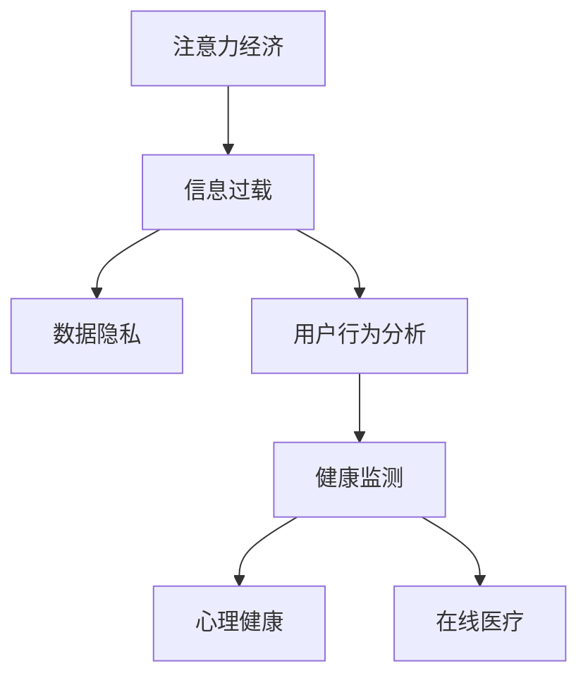

                 

# 注意力经济与个人健康管理的关系

> 关键词：注意力经济, 个人健康管理, 数据隐私, 信息过载, 用户行为分析, 健康监测, 心理健康, 在线医疗

## 1. 背景介绍

### 1.1 问题由来
随着互联网和数字技术的快速发展，人类生活越来越依赖于数字信息的获取和处理。这种依赖性不仅改变了人们获取和分享信息的方式，还深刻影响了社会经济形态。"注意力经济"（Economy of Attention）应运而生，成为新的经济发展模式。

注意力经济强调的是在信息爆炸时代，人们对于注意力资源的需求日益增长，而注意力资源的价值也逐渐显现。这一现象不仅影响到了传统媒体和内容产业，也波及到了医疗健康领域。

个人健康管理，作为现代生活的重要组成部分，也受到注意力经济的影响。数字化健康应用和在线医疗服务的兴起，使得个体对健康信息的获取和处理更加依赖于数字技术和互联网平台。但随之而来的是信息过载、数据隐私泄露等挑战，对个人健康管理产生了重大影响。

## 2. 核心概念与联系

### 2.1 核心概念概述

为了更深入理解注意力经济与个人健康管理的关系，本节将介绍几个关键概念：

- **注意力经济**（Economy of Attention）：指在信息时代，通过吸引和聚焦用户注意力来创造和交换价值的新型经济模式。注意力资源的稀缺性使得优质内容的生产与传播成为经济发展的重要驱动力。
- **个人健康管理**：通过各类工具和平台，对个体的生理、心理状态进行监测、评估和干预，以提高健康水平和生活质量的过程。
- **信息过载**（Information Overload）：指在信息时代，人们接收到的信息远远超过其处理能力，导致无法有效利用这些信息，甚至产生负面影响的现象。
- **数据隐私**（Data Privacy）：指在数据收集、存储和使用过程中，保护个人隐私权益的重要原则，防止数据滥用和泄露。
- **用户行为分析**（User Behavior Analysis）：通过分析用户的行为数据，挖掘其潜在需求和兴趣，为产品优化和服务改进提供依据。
- **健康监测**（Health Monitoring）：利用各类设备和平台对个体的健康状态进行持续监测，收集生理指标数据，以便及时发现健康问题。
- **心理健康**（Mental Health）：指个体在心理状态上的良好状态，涉及情感、认知和行为等方面。
- **在线医疗**（Online Healthcare）：通过互联网平台提供医疗咨询、远程诊断和治疗等服务，极大地改变了传统医疗模式。

这些概念构成了注意力经济与个人健康管理关系的核心框架，帮助我们理解在这一新兴经济模式下，个人健康管理面临的新挑战和机遇。

### 2.2 核心概念原理和架构的 Mermaid 流程图(Mermaid 流程节点中不要有括号、逗号等特殊字符)


这个流程图展示了注意力经济与个人健康管理各要素之间的联系：注意力资源的分配导致信息过载，进而影响数据隐私和用户行为分析；健康监测和在线医疗在数据隐私和用户行为分析的基础上，提供了心理健康管理的可能；在线医疗和健康监测进一步推动了注意力的有效利用。

## 3. 核心算法原理 & 具体操作步骤
### 3.1 算法原理概述

在注意力经济和个人健康管理的关系中，数据处理和用户行为分析扮演了至关重要的角色。本文将聚焦于数据驱动的方法，探索注意力经济如何影响个人健康管理，以及如何利用数据挖掘和用户行为分析来优化个人健康管理策略。

### 3.2 算法步骤详解

核心算法流程分为以下几个步骤：

**Step 1: 数据收集与预处理**

1. 收集用户健康数据：包括生理指标（如心率、血压、血糖等）、行为数据（如步数、睡眠质量、运动量等）、心理状态（如情绪、焦虑程度等）。
2. 数据清洗与归一化：去除异常数据、填补缺失值、标准化数据格式，以便于后续分析和模型训练。

**Step 2: 用户行为分析**

1. 行为模式识别：利用机器学习算法，如聚类和分类，识别用户的行为模式，如活动规律、健康习惯等。
2. 行为预测：建立预测模型，如时间序列分析和回归模型，预测用户未来的健康状态和行为趋势。

**Step 3: 健康监测与干预**

1. 健康状态监测：通过智能设备（如可穿戴设备）持续监测用户生理和心理状态，提供实时反馈。
2. 健康干预：基于用户行为分析结果，提出个性化的健康管理建议，如运动计划、饮食建议等。

**Step 4: 心理健康管理**

1. 情感分析：利用自然语言处理技术，分析用户生成文本的情感倾向，评估心理健康状态。
2. 干预措施：提供心理健康支持和干预，如心理辅导、情绪管理工具等。

**Step 5: 数据隐私保护**

1. 数据匿名化：对敏感数据进行匿名化处理，确保用户隐私。
2. 访问控制：严格控制数据访问权限，防止数据滥用。

### 3.3 算法优缺点

**优点**

1. 数据驱动：通过大规模数据收集和分析，能更准确地识别用户健康状态和行为模式，提供个性化健康管理建议。
2. 实时性：健康监测和行为分析可以在线进行，及时反馈和干预，提高健康管理的效率。
3. 经济效益：通过注意力经济模式，吸引用户关注和参与，有助于推广和普及健康管理应用。

**缺点**

1. 数据隐私：在数据收集和存储过程中，存在数据泄露的风险，需加强隐私保护措施。
2. 信息过载：大量数据和信息可能导致用户过度关注，影响生活质量。
3. 模型偏差：数据分析和模型训练可能存在偏见，影响健康管理的公正性。

### 3.4 算法应用领域

基于注意力经济和个人健康管理的关系，该方法已在以下几个领域得到应用：

- **在线医疗**：利用用户行为分析，优化在线医疗服务，提供个性化的医疗建议和干预措施。
- **智能健康应用**：通过智能设备和平台，提供持续的健康监测和个性化健康管理方案。
- **心理健康平台**：利用情感分析和用户行为数据，评估用户心理健康状态，提供相应的支持和治疗建议。
- **健康数据市场**：通过收集和分析用户健康数据，创建健康数据产品和服务，为健康行业提供数据支持。

## 4. 数学模型和公式 & 详细讲解 & 举例说明（备注：数学公式请使用latex格式，latex嵌入文中独立段落使用 $$，段落内使用 $)
### 4.1 数学模型构建

本节将使用数学语言对注意力经济与个人健康管理的关系进行更加严格的描述。

假设用户健康数据为 $\mathcal{D}=\{x_i,y_i\}_{i=1}^N$，其中 $x_i$ 为生理或行为数据，$y_i$ 为相应的健康状态标签。健康监测和用户行为分析的目标是构建模型 $f(x)$，用于预测用户健康状态 $y_i$。

**模型构建**：
- 采用时间序列分析模型，如ARIMA或LSTM，来捕捉用户行为和生理数据的动态变化。
- 采用分类模型，如随机森林或支持向量机，来识别用户的健康状态和行为模式。
- 采用回归模型，如线性回归或神经网络，来预测未来的健康状态。

**目标函数**：
- 最小化预测误差：$Loss(f(x_i),y_i)=||f(x_i)-y_i||^2$。

**优化方法**：
- 使用梯度下降算法优化模型参数 $\theta$。

### 4.2 公式推导过程

以时间序列分析模型为例，推导ARIMA模型的最小二乘估计公式：

设 $x_i=\{x_{i-1},x_{i-2},\ldots,x_{i-p}\}$ 为 $i$ 时刻的前 $p$ 个历史数据。ARIMA模型为 $x_i=a+b_ix_{i-1}+c_ix_{i-2}+\ldots+d_ix_{i-p}+e_i$，其中 $e_i$ 为误差项。

最小二乘估计目标函数为：
$$
\min_{a,b_i,c_i,\ldots,d_i} \sum_{i=1}^N ||y_i - (a+b_i x_{i-1}+c_i x_{i-2}+\ldots+d_i x_{i-p}+e_i)||^2
$$

求解目标函数的最小值，得到参数估计值。

### 4.3 案例分析与讲解

以智能健康应用为例，分析用户行为数据对健康监测和干预的影响：

- **案例背景**：某智能健康应用收集用户的步数、睡眠质量和饮食数据，通过机器学习模型预测用户的健康状态。
- **数据分析**：对用户数据进行聚类，识别出高步数、良好睡眠质量和均衡饮食的用户，标记为健康用户。
- **模型构建**：构建随机森林模型，预测用户未来的健康状态，识别可能面临健康问题的用户。
- **干预措施**：为识别出的高风险用户提供个性化的健康管理建议，如调整步数、改善饮食等。
- **效果评估**：评估干预措施的效果，如用户步数变化、睡眠质量改善等，以优化健康管理策略。

## 5. 项目实践：代码实例和详细解释说明
### 5.1 开发环境搭建

在进行注意力经济与个人健康管理关系研究前，需要准备好开发环境。以下是使用Python进行数据分析和模型训练的环境配置流程：

1. 安装Python：从官网下载并安装最新版本的Python，推荐使用Anaconda环境。
2. 安装必要的库：使用pip安装NumPy、Pandas、Scikit-learn、TensorFlow等库。
3. 创建虚拟环境：使用`conda create --name myenv`命令创建虚拟环境，避免与其他项目冲突。
4. 激活虚拟环境：使用`conda activate myenv`命令激活虚拟环境。

完成上述步骤后，即可在虚拟环境中进行数据分析和模型训练。

### 5.2 源代码详细实现

以下以智能健康应用为例，提供Python代码实现：

```python
import pandas as pd
import numpy as np
from sklearn.model_selection import train_test_split
from sklearn.linear_model import LogisticRegression
from sklearn.metrics import accuracy_score

# 数据加载
df = pd.read_csv('user_health_data.csv')

# 数据清洗
df.dropna(inplace=True)
df = df.drop(['id'], axis=1)

# 特征选择
features = df[['step_count', 'sleep_quality', 'diet_score']]
target = df['health_status']

# 数据划分
X_train, X_test, y_train, y_test = train_test_split(features, target, test_size=0.2, random_state=42)

# 模型训练
model = LogisticRegression()
model.fit(X_train, y_train)

# 模型评估
y_pred = model.predict(X_test)
accuracy = accuracy_score(y_test, y_pred)
print('Accuracy:', accuracy)
```

### 5.3 代码解读与分析

让我们再详细解读一下关键代码的实现细节：

**数据加载和清洗**：
- 使用Pandas库加载健康数据，并进行数据清洗，去除异常值和缺失值，确保数据质量。

**特征选择**：
- 选取对健康状态有显著影响的特征，如步数、睡眠质量和饮食评分。

**模型训练**：
- 使用Logistic回归模型，对用户健康状态进行预测。

**模型评估**：
- 在测试集上评估模型的准确率，以评估模型性能。

**代码解释**：
- `pd.read_csv('user_health_data.csv')`：从CSV文件中加载数据。
- `df.dropna(inplace=True)`：去除含有缺失值的记录。
- `train_test_split`：将数据划分为训练集和测试集。
- `LogisticRegression()`：构建逻辑回归模型。
- `model.fit(X_train, y_train)`：训练模型。
- `y_pred = model.predict(X_test)`：在测试集上进行预测。
- `accuracy_score(y_test, y_pred)`：计算预测准确率。

## 6. 实际应用场景
### 6.1 在线医疗

在在线医疗领域，注意力经济和个人健康管理的应用非常广泛。平台通过收集用户在线诊疗数据，进行行为分析和健康监测，提供个性化的医疗建议和治疗方案。

具体而言，平台可以记录用户的病历记录、诊断报告和用药情况，通过数据分析识别患者的健康风险和疾病模式，提供精准的诊疗建议和治疗方案。同时，平台还可以利用用户行为数据，预测患者的健康趋势，提前介入，避免病情恶化。

### 6.2 智能健康应用

智能健康应用通过持续监测用户的生理和行为数据，为用户提供个性化的健康管理服务。例如，可穿戴设备可以实时收集用户的步数、睡眠质量、心率等数据，应用通过对这些数据进行分析和预测，提供运动建议、饮食指导和睡眠优化方案。

### 6.3 心理健康平台

心理健康平台利用用户生成文本的情感分析，评估其心理健康状态，提供相应的支持和治疗建议。例如，通过自然语言处理技术，分析用户在社交媒体上的帖子、评论和聊天内容，识别负面情绪和心理健康问题，提供心理辅导、情绪管理工具和在线咨询服务。

### 6.4 健康数据市场

健康数据市场通过收集和分析用户健康数据，创建健康数据产品和服务，为健康行业提供数据支持。例如，平台可以收集用户的运动数据、饮食习惯和生理指标，构建健康大数据，提供健康趋势分析和疾病风险预测服务，帮助医疗机构优化诊疗方案。

## 7. 工具和资源推荐
### 7.1 学习资源推荐

为了帮助开发者系统掌握注意力经济与个人健康管理的关系，这里推荐一些优质的学习资源：

1. Coursera上的《健康信息学》课程：提供系统性的健康数据和信息学知识，包括健康数据收集、处理和分析方法。
2. Kaggle上的健康数据集：包含多种类型的健康数据，适合进行数据挖掘和机器学习实践。
3. Udacity上的《人工智能在医疗中的应用》课程：介绍AI技术在医疗中的实际应用，涵盖数据处理、模型训练和临床应用等方面。
4. Google Colab：免费的在线Jupyter Notebook环境，支持GPU和TPU计算，方便开发者进行数据分析和模型训练。
5. TensorFlow官方文档：提供详细的TensorFlow使用方法和示例代码，适合进行深度学习模型训练。

通过对这些资源的学习实践，相信你一定能够快速掌握注意力经济与个人健康管理的关系，并用于解决实际的NLP问题。

### 7.2 开发工具推荐

高效的开发离不开优秀的工具支持。以下是几款用于健康数据和注意力经济分析开发的常用工具：

1. Python：Python语言具有丰富的数据分析和机器学习库，适合进行健康数据和行为分析。
2. Pandas：数据处理和分析的强大工具，支持数据清洗、筛选和合并等操作。
3. Scikit-learn：机器学习库，提供多种模型训练和评估方法。
4. TensorFlow和PyTorch：深度学习框架，适合构建复杂的数据挖掘和分析模型。
5. Jupyter Notebook：交互式的代码编写和数据可视化工具，方便进行数据探索和模型训练。

合理利用这些工具，可以显著提升健康数据和注意力经济分析的开发效率，加快创新迭代的步伐。

### 7.3 相关论文推荐

注意力经济与个人健康管理的关系领域，研究论文众多，以下几篇具有代表性：

1. "Economic Incentives for Health Information Sharing: A Revealed Preference Approach"（健康信息共享的经济激励：揭示偏好方法）：分析健康数据共享的经济激励和用户行为。
2. "The Economic Value of Attention: A Survey and Review"（注意力的经济价值：综述和回顾）：综述注意力经济的相关理论和应用。
3. "Machine Learning Approaches for Predictive Analytics in Health Care"（健康护理中的预测分析机器学习方法）：介绍机器学习在健康数据预测分析中的应用。
4. "Attention Is All You Need"（注意力是你需要的一切）：介绍Transformer模型及其在自然语言处理中的应用。
5. "A Survey of Attention-based Machine Learning"（基于注意力的机器学习综述）：综述基于注意力的机器学习技术及其在医疗和健康领域的应用。

这些论文代表了大健康和注意力经济领域的最新研究成果，适合深入学习和实践。

## 8. 总结：未来发展趋势与挑战
### 8.1 总结

本文对注意力经济与个人健康管理的关系进行了全面系统的介绍。首先阐述了注意力经济和个人健康管理在信息时代的新特点，明确了两者之间互动关系的重要性和复杂性。其次，从数据驱动的角度，详细讲解了用户行为分析和健康监测的具体方法，并给出了代码实现。同时，本文还探讨了注意力经济与个人健康管理在在线医疗、智能健康应用、心理健康平台和健康数据市场等领域的实际应用。

通过本文的系统梳理，可以看到，注意力经济与个人健康管理的关系在数字化健康和在线医疗中扮演了重要角色。数据驱动的方法能够显著提升健康管理的个性化和实时性，为提高医疗质量和生活质量提供了新思路。未来，伴随数据挖掘和机器学习技术的进一步发展，基于注意力经济的个人健康管理将迎来更多的创新和突破。

### 8.2 未来发展趋势

展望未来，注意力经济与个人健康管理的关系将呈现以下几个发展趋势：

1. **数据驱动的健康决策**：随着大数据和机器学习技术的发展，基于用户数据的健康决策将更加精准和个性化，个性化健康管理服务将更加普及。
2. **AI在健康管理中的应用**：利用AI技术，如深度学习和自然语言处理，进行健康监测、情感分析和智能诊断，提升健康管理的智能化水平。
3. **隐私保护和数据安全**：伴随数据泄露和隐私侵犯事件的频发，如何保障用户数据隐私和数据安全，将成为健康管理平台和应用的关键问题。
4. **跨领域数据融合**：利用多模态数据融合技术，将生理数据、行为数据和心理数据结合起来，进行全面健康监测和分析，提升健康管理的全面性和科学性。
5. **全球健康管理网络**：通过国际合作和数据共享，构建全球健康管理网络，提升全球健康水平。

以上趋势凸显了注意力经济与个人健康管理关系的广阔前景。这些方向的探索发展，必将进一步推动健康管理的个性化、智能化和全球化，为全球健康治理和公共卫生事业带来新的可能性。

### 8.3 面临的挑战

尽管注意力经济与个人健康管理的关系技术已经取得了一定的进展，但在迈向更加智能化、普适化应用的过程中，仍面临诸多挑战：

1. **数据隐私保护**：在健康数据收集和存储过程中，存在数据泄露的风险，需加强隐私保护措施。
2. **数据质量和标准化**：不同来源的健康数据格式和质量不一，需要进行数据清洗和标准化，确保数据的一致性和可靠性。
3. **用户接受度**：用户对健康数据的收集和分享存在抵触情绪，需要提高用户对健康数据的理解和接受度。
4. **模型偏见**：健康数据和行为分析模型可能存在偏见，影响健康管理的公平性和公正性。
5. **模型透明性**：复杂机器学习模型的决策过程不透明，用户难以理解和信任模型输出。

### 8.4 研究展望

面对注意力经济与个人健康管理关系所面临的挑战，未来的研究需要在以下几个方面寻求新的突破：

1. **隐私保护技术**：发展隐私保护技术，如差分隐私、联邦学习等，保障用户数据隐私和安全。
2. **多模态数据融合**：利用多模态数据融合技术，将生理数据、行为数据和心理数据结合起来，进行全面健康监测和分析。
3. **可解释性**：提高机器学习模型的透明性和可解释性，使用户能够理解和信任模型的输出。
4. **公平性研究**：深入研究健康数据分析中的模型偏见问题，提出公平、公正的解决方案。
5. **用户教育**：通过教育和宣传，提高用户对健康数据的理解和使用，促进健康管理的普及和应用。

这些研究方向的探索，必将引领注意力经济与个人健康管理关系迈向更高的台阶，为构建更加安全、智能、普适的健康管理系统提供新的思路和路径。

## 9. 附录：常见问题与解答

**Q1：注意力经济与个人健康管理的关系主要体现在哪些方面？**

A: 注意力经济与个人健康管理的关系主要体现在以下几个方面：
1. 用户健康数据的获取和分析：通过互联网和智能设备，平台能够持续监测用户健康数据，进行行为分析和健康预测。
2. 个性化健康管理服务：利用数据分析结果，提供个性化的健康管理建议和治疗方案。
3. 在线医疗和心理健康服务：通过智能健康应用和心理健康平台，提供在线医疗咨询和心理健康支持。
4. 健康数据市场：通过健康数据共享和分析，创造健康数据产品和服务的商业价值。

**Q2：如何选择合适的机器学习模型进行健康数据预测？**

A: 选择机器学习模型进行健康数据预测时，应考虑以下因素：
1. 数据类型：根据数据类型选择相应的模型，如时间序列数据适合ARIMA或LSTM模型，分类数据适合决策树或支持向量机模型。
2. 数据量和质量：数据量较大时，可使用深度学习模型，如神经网络；数据量较小时，应考虑使用线性回归或决策树等较简单的模型。
3. 模型复杂度：模型复杂度应与数据规模和计算资源相匹配，避免过拟合和欠拟合。
4. 模型可解释性：对于医疗和健康管理领域，模型的可解释性非常重要，应选择具有良好解释能力的模型。

**Q3：注意力经济对健康数据隐私保护有哪些影响？**

A: 注意力经济对健康数据隐私保护有以下影响：
1. 数据收集范围扩大：随着用户对健康数据的关注度提升，健康数据收集的范围和频率增加，隐私风险增大。
2. 数据共享和合作：平台之间为了提升服务质量和数据利用率，需要共享和合作健康数据，隐私泄露风险增加。
3. 数据监测和分析：注意力经济模式下，健康数据的监测和分析更加频繁，隐私保护措施需更加严格。
4. 数据匿名化处理：需要采取有效的数据匿名化技术，防止数据还原和隐私泄露。

**Q4：智能健康应用如何利用注意力经济提高用户参与度？**

A: 智能健康应用利用注意力经济提高用户参与度的方法包括：
1. 个性化的健康建议：通过用户行为分析和健康数据预测，提供个性化的健康管理建议，吸引用户参与。
2. 激励机制：设置奖励机制，如运动积分、健康奖励等，激励用户进行健康监测和数据分享。
3. 社交互动：通过社交功能，如好友互动、健康竞赛等，增加用户粘性和参与度。
4. 数据可视化：利用图表和可视化工具，展示健康数据和分析结果，帮助用户更好地理解和参与健康管理。

通过这些方法，智能健康应用能够有效吸引用户参与，提升健康管理的覆盖面和效果。

**Q5：如何评估基于注意力经济的健康管理服务的质量？**

A: 评估基于注意力经济的健康管理服务质量时，应考虑以下指标：
1. 准确性：评估健康监测和预测模型的准确性和可靠性，确保预测结果的准确性。
2. 实时性：评估健康管理服务的响应时间和数据更新频率，确保服务的时效性。
3. 用户满意度：通过用户反馈和调查问卷，评估用户对健康管理服务的满意度。
4. 个性化水平：评估健康管理服务是否能够提供个性化的健康建议和治疗方案。
5. 数据隐私：评估健康管理服务的数据隐私保护措施是否到位，确保用户数据安全。

通过这些指标的综合评估，可以全面了解健康管理服务的质量，及时发现和改进问题。

---

作者：禅与计算机程序设计艺术 / Zen and the Art of Computer Programming

