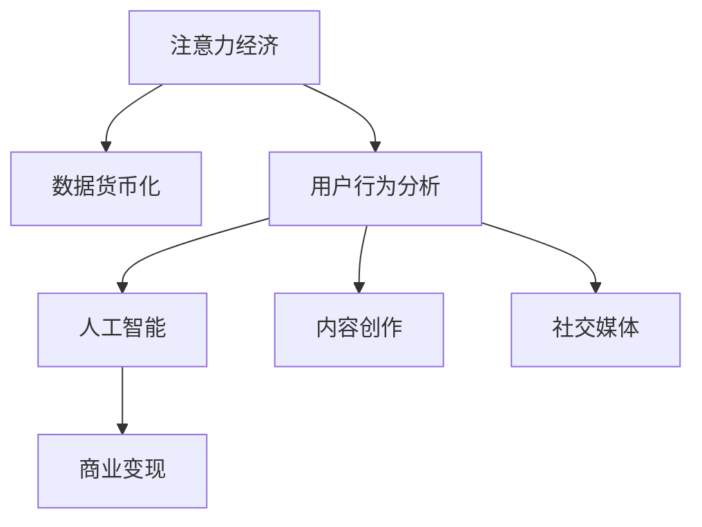

                 

# 注意力经济与个人创业机会的关系

> 关键词：注意力经济, 个人创业机会, 数据货币化, 用户行为分析, 人工智能

## 1. 背景介绍

### 1.1 问题由来
在数字化时代，信息的爆炸性增长使得人们的时间变得稀缺。面对海量的信息和内容，用户的时间和注意力变得极为珍贵。这种以用户注意力为核心的新型经济形态，被称为“注意力经济”。

### 1.2 问题核心关键点
注意力经济的核心在于：信息生产者（如媒体、广告商、内容创作者等）通过吸引用户的时间和注意力，获得经济收益。而个人创业者（如自媒体、内容创作者、社交媒体运营者等）则可以通过提供有价值的内容，吸引用户的关注，从而获取商业机会。

### 1.3 问题研究意义
研究注意力经济与个人创业机会的关系，对于理解数字化时代的信息流分配机制、探索新的商业模式具有重要意义。可以帮助创业者识别和抓住市场机遇，优化内容策略，提升运营效率，实现商业成功。

## 2. 核心概念与联系

### 2.1 核心概念概述

为更好地理解注意力经济与个人创业机会的关系，本节将介绍几个密切相关的核心概念：

- 注意力经济（Economy of Attention）：一种新型经济形态，信息生产者通过吸引用户的时间和注意力，实现商业变现。
- 数据货币化（Data Monetization）：将数据转化为经济价值的商业实践，包括数据挖掘、分析、交易等。
- 用户行为分析（User Behavior Analysis）：通过分析用户在平台上的行为数据，揭示用户偏好和需求，指导内容创作和个性化推荐。
- 人工智能（AI）：指通过机器学习和深度学习等技术，使计算机具备智能分析、决策和执行能力。
- 内容创作（Content Creation）：包括文字、视频、音频等形式的创作活动，是吸引用户注意力的重要手段。
- 社交媒体（Social Media）：通过社交互动，增强用户粘性，提供平台价值。

这些核心概念之间的逻辑关系可以通过以下Mermaid流程图来展示：



这个流程图展示了这个经济体系的各个组成部分及其相互作用：

1. 注意力经济由用户注意力驱动，是信息生产者获取经济价值的基础。
2. 数据货币化通过对用户行为数据进行分析挖掘，转化为经济价值。
3. 用户行为分析利用人工智能技术，分析用户行为，发现用户需求。
4. 内容创作和社交媒体是吸引用户注意力的关键手段。
5. 商业变现通过以上各环节，实现经济收益。

这些核心概念共同构成了注意力经济的基础框架，决定了信息生产者与个人创业者的商业机会。

## 3. 核心算法原理 & 具体操作步骤
### 3.1 算法原理概述

注意力经济与个人创业机会的关系，本质上是一种通过数据驱动的商业逻辑。其核心在于如何吸引用户注意力，并通过分析用户行为，实现内容的精准投放和个性化推荐，从而获取商业收益。

具体来说，信息生产者通过以下步骤实现这一过程：

1. **内容创作**：生产符合用户需求和兴趣的内容，吸引用户注意力。
2. **数据收集**：通过各种方式（如点击率、停留时间、互动行为等）收集用户行为数据。
3. **数据分析**：利用人工智能技术，对用户行为数据进行分析，挖掘用户偏好和需求。
4. **个性化推荐**：根据分析结果，生成个性化推荐内容，进一步提升用户粘性。
5. **商业变现**：通过广告、会员、付费内容等方式，实现经济收益。

### 3.2 算法步骤详解

以下是基于注意力经济的商业逻辑，信息生产者获取经济收益的具体操作步骤：

**Step 1: 内容创作与分发**

信息生产者需要创作符合目标用户群体需求和兴趣的内容，并通过社交媒体、搜索引擎等渠道进行分发。这可以包括但不限于：

- 创建视频、文章、播客等形式的内容，覆盖不同用户偏好。
- 利用SEO技术，提高内容在搜索引擎中的排名，吸引更多流量。
- 在社交媒体上活跃互动，吸引用户关注和分享。

**Step 2: 数据收集与处理**

在内容分发过程中，收集用户的行为数据，如点击率、停留时间、互动行为等。这可以通过以下方式实现：

- 在网站和应用中集成Web分析工具（如Google Analytics）。
- 使用API接口收集社交媒体互动数据。
- 利用传感器和智能设备收集用户行为数据。

收集到的数据需要经过清洗和处理，去除噪音和异常值，形成可用于分析的数据集。

**Step 3: 数据分析与挖掘**

利用人工智能技术，对用户行为数据进行分析挖掘，发现用户偏好和需求。这包括：

- 使用机器学习算法（如协同过滤、分类、回归等）对用户行为数据进行建模。
- 应用深度学习技术（如神经网络、Transformer等）挖掘用户隐含的需求和偏好。
- 利用自然语言处理技术（如文本分类、情感分析等）分析用户评论和反馈。

**Step 4: 个性化推荐与用户互动**

根据分析结果，生成个性化推荐内容，进一步提升用户粘性。这可以通过以下方式实现：

- 利用协同过滤推荐算法，推荐与用户历史行为相似的内容。
- 应用内容推荐模型（如Seq2Seq、BERT等）生成个性化的文章、视频推荐。
- 通过社交互动，如评论、点赞、分享等，增强用户粘性和参与感。

**Step 5: 商业变现**

通过广告、会员、付费内容等方式，实现经济收益。这包括：

- 在内容旁边展示广告，获取广告收益。
- 提供会员订阅服务，获得用户定期付费。
- 提供优质内容付费，提升内容价值和收益。

以上是基于注意力经济的商业逻辑，信息生产者获取经济收益的详细操作步骤。

### 3.3 算法优缺点

基于注意力经济的商业逻辑，信息生产者获取经济收益的算法具有以下优点：

1. **精准定位**：通过数据分析，可以精准定位目标用户，提升内容效果。
2. **个性化推荐**：个性化推荐算法提升用户粘性，增加用户留存率。
3. **高效运营**：数据驱动的决策，减少人工干预，提升运营效率。
4. **多渠道变现**：通过多种变现方式，最大化经济收益。

但同时，该算法也存在一定的局限性：

1. **数据隐私问题**：用户行为数据的收集和处理可能涉及隐私问题，需要遵守数据保护法律法规。
2. **算法偏见**：数据分析和推荐算法可能存在偏见，影响内容质量和用户体验。
3. **模型复杂度**：深度学习模型的高复杂度可能带来较高的计算和存储成本。
4. **用户教育成本**：用户需要适应新算法生成的个性化内容，可能需要教育成本。
5. **内容同质化**：过度依赖算法推荐，可能导致内容同质化，缺乏多样性。

尽管存在这些局限性，但总体而言，基于注意力经济的算法在信息生产者获取经济收益方面具有显著优势。

### 3.4 算法应用领域

基于注意力经济的算法在多个领域得到了广泛应用，包括但不限于：

- 广告投放：通过精准定位和个性化推荐，提升广告效果和ROI。
- 内容推荐：利用数据分析，提升内容推荐质量，提升用户粘性。
- 电商推荐：通过个性化推荐，提升用户购买率和销售额。
- 社交媒体：通过分析用户互动数据，提升平台粘性和用户活跃度。
- 视频平台：通过推荐系统，提升用户观看时间和内容消费。
- 在线教育：通过数据分析，个性化推荐学习内容和课程，提升学习效果。

此外，基于注意力经济的算法在更多领域得到了创新性的应用，如新闻推荐、音乐推荐、股票市场分析等，为信息生产者提供了新的商业机会。

## 4. 数学模型和公式 & 详细讲解 & 举例说明

### 4.1 数学模型构建

基于注意力经济的商业逻辑，信息生产者获取经济收益的数学模型可以形式化为以下形式：

设 $X$ 为信息生产者生产的内容集，$U$ 为用户群体集。用户对内容的偏好可以用 $P:U \times X \rightarrow [0,1]$ 表示，其中 $P(u,x)$ 表示用户 $u$ 对内容 $x$ 的偏好程度。

用户对内容的实际选择可以用 $S:U \times X \rightarrow \{0,1\}$ 表示，其中 $S(u,x)$ 表示用户 $u$ 是否选择了内容 $x$。

信息生产者获取的经济收益可以用 $R:U \times X \rightarrow [0,\infty)$ 表示，其中 $R(u,x)$ 表示用户 $u$ 选择了内容 $x$ 后，信息生产者获得的收益。

### 4.2 公式推导过程

假设信息生产者生产的内容集 $X$ 已知，目标是最大化总收益 $R$。即求解以下优化问题：

$$
\mathop{\max}_{P} \sum_{u \in U} \sum_{x \in X} P(u,x) R(u,x)
$$

根据贝叶斯定理，可以将其转化为：

$$
\mathop{\max}_{P} \sum_{u \in U} P(u) \sum_{x \in X} P(x|u) R(u,x)
$$

其中 $P(u)$ 为用户 $u$ 的先验概率，$P(x|u)$ 为条件概率，即用户 $u$ 选择内容 $x$ 的概率。

通过对 $P(u)$ 和 $P(x|u)$ 进行建模，可以利用机器学习和深度学习技术求解最优 $P(u)$ 和 $P(x|u)$，从而最大化总收益 $R$。

### 4.3 案例分析与讲解

假设某在线视频平台生产了 $100$ 部视频，目标是最小化用户流失率，最大化平台收益。平台收集了 $1000$ 个用户的观看数据，其中 $200$ 个用户流失，$800$ 个用户观看视频。

利用协同过滤推荐算法，计算用户对每部视频的评分 $P(u,x)$，结果如下：

| 用户 | 视频1 | 视频2 | 视频3 | ... | 视频100 |
| --- | --- | --- | --- | --- | --- |
| 用户1 | 0.8 | 0.5 | 0.3 | ... | 0.1 |
| 用户2 | 0.5 | 0.6 | 0.7 | ... | 0.2 |
| ... | ... | ... | ... | ... | ... |
| 用户800 | 0.1 | 0.2 | 0.4 | ... | 0.9 |

利用上述评分矩阵 $P(u,x)$，可以计算出每个用户对每部视频的期望收益 $R(u,x)$。假设每部视频售价 $1$ 元，用户观看后一定购买，则 $R(u,x)=1$。

根据优化问题，可以求解出最优的 $P(u,x)$，从而确定每个用户对每部视频的推荐概率 $S(u,x)$。具体计算过程如下：

1. 将用户观看数据与评分矩阵 $P(u,x)$ 结合，得到用户对每部视频的观看次数 $O(u,x)$。
2. 计算每个用户的平均观看次数 $\overline{O}(u)$。
3. 利用最大熵模型（MaxEnt）或协同过滤模型计算每个用户对每部视频的推荐概率 $S(u,x)$。
4. 通过最大化总收益，求解出最优的 $S(u,x)$。

通过上述步骤，可以最大化平台收益，同时最小化用户流失率，实现用户粘性和平台收益的双赢。

## 5. 项目实践：代码实例和详细解释说明

### 5.1 开发环境搭建

在进行注意力经济的商业实践前，我们需要准备好开发环境。以下是使用Python进行PyTorch开发的环境配置流程：

1. 安装Anaconda：从官网下载并安装Anaconda，用于创建独立的Python环境。

2. 创建并激活虚拟环境：
```bash
conda create -n attention-env python=3.8 
conda activate attention-env
```

3. 安装PyTorch：根据CUDA版本，从官网获取对应的安装命令。例如：
```bash
conda install pytorch torchvision torchaudio cudatoolkit=11.1 -c pytorch -c conda-forge
```

4. 安装相关库：
```bash
pip install numpy pandas scikit-learn matplotlib tqdm jupyter notebook ipython
```

完成上述步骤后，即可在`attention-env`环境中开始注意力经济的商业实践。

### 5.2 源代码详细实现

下面我们以广告投放为例，给出使用PyTorch对广告点击率进行预测的PyTorch代码实现。

首先，定义广告点击率预测模型：

```python
import torch
import torch.nn as nn
import torch.optim as optim

class ClickRateModel(nn.Module):
    def __init__(self, input_size, hidden_size):
        super(ClickRateModel, self).__init__()
        self.fc1 = nn.Linear(input_size, hidden_size)
        self.fc2 = nn.Linear(hidden_size, 1)
        self.sigmoid = nn.Sigmoid()
        
    def forward(self, x):
        x = self.fc1(x)
        x = self.fc2(x)
        return self.sigmoid(x)
```

然后，定义广告点击率预测数据的准备函数：

```python
import pandas as pd
from sklearn.model_selection import train_test_split

def load_data():
    data = pd.read_csv('ad_data.csv')
    features = data.drop('click', axis=1)
    labels = data['click']
    features_train, features_test, labels_train, labels_test = train_test_split(features, labels, test_size=0.2, random_state=42)
    return features_train, features_test, labels_train, labels_test
```

接着，定义模型训练和评估函数：

```python
def train_model(model, features_train, features_test, labels_train, labels_test, batch_size, epochs, learning_rate):
    features_train = torch.tensor(features_train.values, dtype=torch.float)
    labels_train = torch.tensor(labels_train.values, dtype=torch.float)
    features_test = torch.tensor(features_test.values, dtype=torch.float)
    labels_test = torch.tensor(labels_test.values, dtype=torch.float)
    
    criterion = nn.BCELoss()
    optimizer = optim.Adam(model.parameters(), lr=learning_rate)
    
    for epoch in range(epochs):
        model.train()
        for i in range(0, len(features_train), batch_size):
            x = features_train[i:i+batch_size]
            y = labels_train[i:i+batch_size]
            optimizer.zero_grad()
            y_hat = model(x)
            loss = criterion(y_hat, y)
            loss.backward()
            optimizer.step()
        
        model.eval()
        with torch.no_grad():
            y_hat = model(features_test)
            y_hat = y_hat.numpy()
            y_test = labels_test.numpy()
            accuracy = np.mean(np.round(y_hat) == y_test)
            print(f"Epoch {epoch+1}, Accuracy: {accuracy:.2f}")
    
    return model
```

最后，启动训练流程：

```python
input_size = 10
hidden_size = 5
learning_rate = 0.01
batch_size = 32
epochs = 10

features_train, features_test, labels_train, labels_test = load_data()
model = ClickRateModel(input_size, hidden_size)
model = train_model(model, features_train, features_test, labels_train, labels_test, batch_size, epochs, learning_rate)
```

以上就是使用PyTorch对广告点击率进行预测的完整代码实现。可以看到，得益于PyTorch的强大封装，我们可以用相对简洁的代码完成广告点击率的预测模型。

### 5.3 代码解读与分析

让我们再详细解读一下关键代码的实现细节：

**ClickRateModel类**：
- `__init__`方法：初始化神经网络结构，包括两个全连接层和一个Sigmoid激活函数。
- `forward`方法：定义前向传播过程，通过两层全连接层和Sigmoid激活函数，得到广告点击率的预测值。

**load_data函数**：
- 从CSV文件中读取广告点击率数据，并将其分割为训练集和测试集。

**train_model函数**：
- 定义损失函数为二元交叉熵损失函数（BCELoss），优化器为Adam。
- 在每个epoch内，先进行模型前向传播，计算损失，并反向传播更新模型参数。
- 在每个epoch结束后，在测试集上评估模型性能，打印测试准确率。

**训练流程**：
- 定义模型结构、输入大小、隐藏层大小、学习率、批大小和epoch数，启动训练过程。
- 在每个epoch内，训练模型，并记录训练准确率。
- 在训练结束后，返回训练好的模型。

可以看到，PyTorch配合TensorFlow等深度学习框架使得广告点击率预测的代码实现变得简洁高效。开发者可以将更多精力放在数据预处理、模型改进等高层逻辑上，而不必过多关注底层的实现细节。

当然，工业级的系统实现还需考虑更多因素，如模型的保存和部署、超参数的自动搜索、更灵活的模型结构等。但核心的注意力经济的商业逻辑基本与此类似。

## 6. 实际应用场景
### 6.1 智能推荐系统

基于注意力经济的算法在智能推荐系统中的应用非常广泛。通过数据分析，了解用户的行为模式和偏好，生成个性化的推荐内容，提升用户满意度和粘性。

在技术实现上，可以收集用户的浏览、点击、评分等行为数据，通过机器学习或深度学习技术，对用户进行建模，生成推荐列表。同时，结合用户画像和行为分析，实现更精准的推荐效果。

### 6.2 广告投放

广告投放是注意力经济的核心应用场景之一。通过精准定位和个性化推荐，实现广告的高效投放，提升广告效果和ROI。

在技术实现上，可以利用广告点击率预测模型，对用户对广告的点击行为进行预测。根据预测结果，优化广告投放策略，选择目标用户，调整投放时间和频次，实现广告效果最大化。

### 6.3 内容创作

内容创作者通过分析用户行为数据，了解用户需求和偏好，创作符合用户期望的内容，提升用户粘性和参与度。

在技术实现上，可以收集用户对内容的反馈数据，如点赞、评论、分享等，通过情感分析和内容推荐技术，指导内容创作。同时，结合用户画像和行为分析，创作更符合用户需求的内容，提升用户满意度和忠诚度。

### 6.4 社交媒体

社交媒体平台通过分析用户互动数据，提升用户粘性和平台活跃度。通过个性化推荐和内容创作，吸引用户关注和分享。

在技术实现上，可以收集用户的互动数据，如点赞、评论、分享等，通过情感分析和用户行为分析，生成个性化的推荐内容。同时，结合用户画像和行为分析，创作更具吸引力的内容，提升用户粘性和参与度。

## 7. 工具和资源推荐
### 7.1 学习资源推荐

为了帮助开发者系统掌握注意力经济的商业逻辑和相关技术，这里推荐一些优质的学习资源：

1. 《机器学习实战》系列书籍：详细介绍了机器学习算法的实现和应用，包括协同过滤推荐算法等。

2. 《深度学习》课程：斯坦福大学开设的深度学习课程，涵盖深度学习的基本原理和实现方法，包括神经网络、卷积神经网络等。

3. 《TensorFlow官方文档》：TensorFlow的官方文档，提供了丰富的学习资源和样例代码，适合初学者和进阶开发者。

4. 《Kaggle数据科学竞赛》：Kaggle上的数据科学竞赛，提供了大量的数据集和模型算法，适合实践和竞赛。

5. 《Python机器学习》书籍：详细介绍了Python在机器学习和深度学习中的应用，包括推荐系统、广告投放等。

通过对这些资源的学习实践，相信你一定能够快速掌握注意力经济的商业逻辑，并用于解决实际的商业问题。

### 7.2 开发工具推荐

高效的开发离不开优秀的工具支持。以下是几款用于注意力经济开发的常用工具：

1. PyTorch：基于Python的开源深度学习框架，灵活动态的计算图，适合快速迭代研究。大部分预训练模型都有PyTorch版本的实现。

2. TensorFlow：由Google主导开发的开源深度学习框架，生产部署方便，适合大规模工程应用。同样有丰富的预训练语言模型资源。

3. Scikit-learn：Python机器学习库，提供了简单易用的机器学习算法，包括协同过滤推荐算法等。

4. Pandas：Python数据分析库，适合处理和分析大规模数据集。

5. Numpy：Python数值计算库，适合进行数值计算和矩阵运算。

6. Jupyter Notebook：Python交互式编程工具，支持代码编写、数据可视化等，非常适合数据科学和机器学习的研究和实践。

合理利用这些工具，可以显著提升注意力经济的商业实践效率，加快创新迭代的步伐。

### 7.3 相关论文推荐

注意力经济和商业逻辑的研究源于学界的持续研究。以下是几篇奠基性的相关论文，推荐阅读：

1. Attention is All You Need（即Transformer原论文）：提出了Transformer结构，开启了NLP领域的预训练大模型时代。

2. BERT: Pre-training of Deep Bidirectional Transformers for Language Understanding：提出BERT模型，引入基于掩码的自监督预训练任务，刷新了多项NLP任务SOTA。

3. Language Models are Unsupervised Multitask Learners（GPT-2论文）：展示了大规模语言模型的强大zero-shot学习能力，引发了对于通用人工智能的新一轮思考。

4. Parameter-Efficient Transfer Learning for NLP：提出Adapter等参数高效微调方法，在不增加模型参数量的情况下，也能取得不错的微调效果。

5. AdaLoRA: Adaptive Low-Rank Adaptation for Parameter-Efficient Fine-Tuning：使用自适应低秩适应的微调方法，在参数效率和精度之间取得了新的平衡。

这些论文代表了大语言模型微调技术的发展脉络。通过学习这些前沿成果，可以帮助研究者把握学科前进方向，激发更多的创新灵感。

## 8. 总结：未来发展趋势与挑战

### 8.1 总结

本文对注意力经济与个人创业机会的关系进行了全面系统的介绍。首先阐述了注意力经济的核心逻辑，即信息生产者通过吸引用户的时间和注意力，获得经济收益。接着介绍了信息生产者获取经济收益的数学模型和算法步骤，并给出了代码实例。同时，本文还广泛探讨了注意力经济在多个领域的应用场景，展示了其广泛的商业价值。

通过本文的系统梳理，可以看到，基于注意力经济的商业逻辑，信息生产者获取经济收益的算法在多个领域得到了广泛应用，为信息生产者提供了新的商业机会。未来，伴随深度学习技术的发展和应用场景的拓展，基于注意力经济的算法将在更多领域得到应用，为信息生产者带来更多的商业机遇和挑战。

### 8.2 未来发展趋势

展望未来，基于注意力经济的算法将呈现以下几个发展趋势：

1. 数据驱动的智能推荐：随着深度学习技术的发展，智能推荐算法将更加精准和高效，能够更好地满足用户需求。
2. 个性化广告投放：通过精准定位和个性化推荐，实现广告的高效投放，提升广告效果和ROI。
3. 内容创作的多样化：利用用户行为数据，创作更符合用户需求的内容，提升用户满意度和忠诚度。
4. 实时数据分析：利用实时数据分析技术，提升用户行为预测的准确性和及时性。
5. 多渠道融合：结合社交媒体、搜索引擎、应用等多渠道数据，提升用户的整体体验。
6. 跨领域应用：将注意力经济的商业逻辑应用于更多领域，如医疗、教育、旅游等，创造新的商业机会。

以上趋势凸显了基于注意力经济的算法的广阔前景。这些方向的探索发展，必将进一步提升信息生产者获取经济收益的能力，为数字化时代带来更多的商业机遇。

### 8.3 面临的挑战

尽管基于注意力经济的算法已经取得了瞩目成就，但在迈向更加智能化、普适化应用的过程中，它仍面临着诸多挑战：

1. 数据隐私问题：用户行为数据的收集和处理可能涉及隐私问题，需要遵守数据保护法律法规。
2. 算法偏见：数据分析和推荐算法可能存在偏见，影响内容质量和用户体验。
3. 模型复杂度：深度学习模型的高复杂度可能带来较高的计算和存储成本。
4. 用户教育成本：用户需要适应新的推荐系统，可能需要教育成本。
5. 内容同质化：过度依赖推荐系统，可能导致内容同质化，缺乏多样性。
6. 平台依赖：用户对平台的依赖性可能限制其选择权，影响用户体验。

尽管存在这些挑战，但总体而言，基于注意力经济的算法在信息生产者获取经济收益方面具有显著优势。

### 8.4 未来突破

面对注意力经济面临的挑战，未来的研究需要在以下几个方面寻求新的突破：

1. 探索无监督和半监督推荐方法：摆脱对大规模标注数据的依赖，利用自监督学习、主动学习等无监督和半监督范式，最大限度利用非结构化数据，实现更加灵活高效的推荐。
2. 研究参数高效和计算高效的推荐算法：开发更加参数高效的推荐方法，在固定大部分推荐参数的同时，只更新极少量的任务相关参数。同时优化推荐模型的计算图，减少前向传播和反向传播的资源消耗，实现更加轻量级、实时性的部署。
3. 引入因果推断和博弈论工具：将因果推断方法引入推荐系统，识别出推荐决策的关键特征，增强推荐系统输出解释的因果性和逻辑性。借助博弈论工具刻画人机交互过程，主动探索并规避推荐系统的脆弱点，提高系统稳定性。
4. 纳入伦理道德约束：在推荐目标中引入伦理导向的评估指标，过滤和惩罚有害的推荐结果，确保推荐系统输出的安全性。同时加强人工干预和审核，建立推荐系统的监管机制，确保其符合人类价值观和伦理道德。

这些研究方向的探索，必将引领注意力经济的商业逻辑迈向更高的台阶，为信息生产者带来更多的商业机遇和挑战。

## 9. 附录：常见问题与解答

**Q1：注意力经济是否适用于所有信息生产者？**

A: 注意力经济的核心在于用户注意力的吸引和转化，适用于任何能够提供有价值内容的信息生产者，包括传统媒体、社交平台、电商平台等。

**Q2：如何平衡用户隐私和商业利益？**

A: 用户隐私和商业利益的平衡是注意力经济中的重要问题。信息生产者需要在尊重用户隐私的前提下，合理利用用户行为数据，实现商业变现。可以通过以下方式平衡两者：
- 透明数据收集：明确告知用户数据收集的目的和范围，并获得用户同意。
- 数据匿名化：对用户数据进行匿名化处理，去除敏感信息。
- 合规存储和处理：遵守相关法律法规，如GDPR等，确保用户数据的安全性和隐私性。

**Q3：注意力经济是否会导致内容同质化？**

A: 过度依赖推荐算法可能导致内容同质化，但也可以通过以下方式避免：
- 多样性推荐：在推荐算法中引入多样性约束，确保推荐结果包含多种类型的内容。
- 用户主导：让用户自主选择内容，而非完全依赖推荐算法。
- 内容创新：持续创新内容形式和题材，提升用户对新内容的兴趣。

**Q4：注意力经济是否适用于所有的商业模型？**

A: 注意力经济适用于需要依赖用户注意力获取经济收益的商业模型，如广告、电商、内容订阅等。对于依赖资本投入或物理资源的商业模式，如重工业、农业等，可能不适用。

**Q5：注意力经济是否适用于小规模信息生产者？**

A: 注意力经济对小规模信息生产者的要求较高，需要有较强的数据分析能力和内容创作能力。但随着数据分析技术的普及和社交媒体平台的开放，小规模信息生产者也能通过精准定位和个性化推荐，获得商业机会。

通过这些问题的解答，可以帮助信息生产者更好地理解注意力经济的商业逻辑，平衡隐私和利益，优化内容策略，提升商业效果。

---

作者：禅与计算机程序设计艺术 / Zen and the Art of Computer Programming

