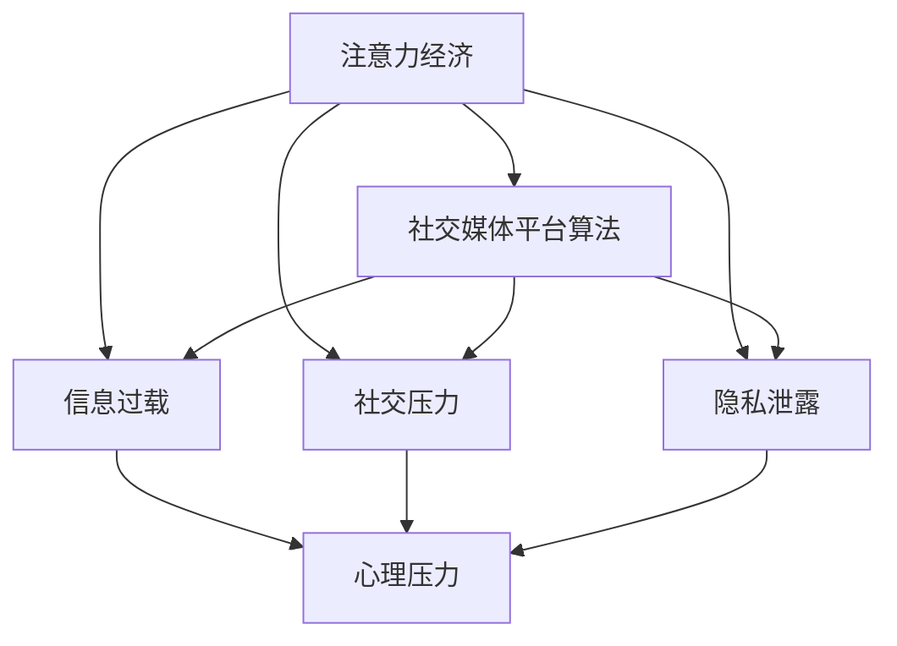

                 

## 1. 背景介绍

### 1.1 问题由来
随着互联网的普及和社交媒体的兴起，注意力经济（Attention Economy）逐渐成为一种重要的经济形态。用户通过关注各种社交媒体平台，对有价值的信息进行消费，从而形成了以用户注意力为核心的经济生态。在这样的经济模式下，企业通过吸引用户注意力，实现商业变现。

然而，注意力经济的迅速发展也带来了负面影响，许多人在社交媒体上投入了大量的时间和精力，导致个人压力和心理健康问题频发。如何平衡注意力经济与个人压力管理之间的关系，成为当下重要的社会课题。

### 1.2 问题核心关键点
注意力经济与个人压力管理的关系核心在于用户如何管理和分配自己的注意力资源。社交媒体平台通过算法推荐机制，不断吸引用户的注意力，用户被迫频繁切换注意力，导致注意力分散，进而增加心理压力。此外，信息过载、社交压力、隐私泄露等问题也加剧了用户的心理负担。

本文将从算法推荐机制的原理和用户的实际行为出发，探讨注意力经济与个人压力管理之间的关系，并提出缓解策略。

## 2. 核心概念与联系

### 2.1 核心概念概述

为更好地理解注意力经济与个人压力管理之间的关系，本节将介绍几个关键概念：

- 注意力经济（Attention Economy）：基于用户注意力的一种新型经济模式，通过吸引和分配用户注意力，实现商业价值。
- 社交媒体平台算法：社交媒体平台利用机器学习和数据挖掘技术，对用户行为进行分析和预测，并依据用户兴趣和行为特征，自动推荐内容和广告。
- 信息过载（Information Overload）：用户在社交媒体上接触到大量信息，无法有效处理和筛选，导致注意力和心理压力的增加。
- 社交压力（Social Pressure）：用户受社交媒体上他人的评价和反馈影响，产生的心理压力。
- 隐私泄露（Privacy Leakage）：用户在社交媒体上暴露个人信息，面临隐私和数据安全问题。
- 心理压力（Psychological Stress）：由于注意力分散、信息过载、社交压力等问题，用户产生的心理压力和焦虑情绪。

这些核心概念之间的逻辑关系可以通过以下Mermaid流程图来展示：



这个流程图展示了几者之间的关系：

1. 注意力经济依赖于社交媒体平台算法，吸引和分配用户注意力。
2. 社交媒体平台算法通过推荐内容和广告，加剧了信息过载、社交压力和隐私泄露问题。
3. 信息过载、社交压力和隐私泄露问题进一步引发了用户的心理压力。

## 3. 核心算法原理 & 具体操作步骤
### 3.1 算法原理概述

社交媒体平台算法推荐机制主要基于以下两个方面：

- 协同过滤：通过分析用户的历史行为和偏好，为用户推荐相似内容或用户。
- 基于内容的推荐：利用文本挖掘和自然语言处理技术，提取内容的关键词和主题，为用户推荐相关内容。

这些算法通常依赖于以下数据：

- 用户行为数据：用户在平台上的浏览、点赞、评论、分享等行为数据。
- 用户画像数据：用户的性别、年龄、职业、兴趣等信息。
- 内容数据：平台上的文章、视频、图片等数据。

社交媒体平台通过机器学习模型对这些数据进行分析和预测，以自动推荐内容和广告。推荐算法主要包括以下步骤：

1. 数据预处理：清洗和标准化数据，提取特征。
2. 用户画像构建：根据用户行为数据和内容数据，构建用户画像。
3. 内容特征提取：利用文本挖掘和自然语言处理技术，提取内容的关键词和主题。
4. 相似度计算：计算用户画像和内容特征之间的相似度，推荐相关内容。
5. 动态调整：根据用户反馈和行为，动态调整推荐算法，提升推荐效果。

### 3.2 算法步骤详解

以推荐系统中最常用的协同过滤算法为例，算法步骤包括：

1. 用户行为数据采集：收集用户在平台上的浏览、点赞、评论等行为数据。
2. 数据预处理：清洗数据，去除噪声，提取用户行为特征。
3. 用户画像构建：根据用户行为数据和内容数据，构建用户画像，描述用户的兴趣和偏好。
4. 相似度计算：计算用户画像之间的相似度，找到与目标用户兴趣相似的用户。
5. 推荐内容：根据相似用户的历史行为和偏好，推荐相关内容。

### 3.3 算法优缺点

社交媒体平台算法的优点在于：

1. 高效精准：通过机器学习和数据分析，能够快速准确地推荐用户感兴趣的内容。
2. 个性化推荐：能够根据用户行为和兴趣，提供个性化的推荐服务。

缺点包括：

1. 信息过载：过度推荐导致用户接触到大量信息，难以处理。
2. 用户隐私：用户行为和偏好数据被收集和使用，隐私泄露风险高。
3. 社交压力：过度依赖推荐算法，减少自主性，增加社交压力。
4. 算法依赖：过度依赖算法推荐，忽视真实需求和兴趣，导致用户体验下降。

### 3.4 算法应用领域

社交媒体平台算法推荐技术主要应用于以下几个领域：

- 内容推荐：为用户推荐文章、视频、图片等。
- 用户推荐：为用户推荐好友、群组、论坛等。
- 广告推荐：为广告主推荐目标用户，实现精准投放。
- 活动推荐：为用户推荐线上线下活动，提升用户参与度。

## 4. 数学模型和公式 & 详细讲解 & 举例说明

### 4.1 数学模型构建

社交媒体平台算法推荐系统通常采用协同过滤算法。协同过滤算法主要包括基于用户的协同过滤和基于物品的协同过滤。

- 基于用户的协同过滤：根据用户的历史行为数据，为用户推荐相似用户喜欢的物品。
- 基于物品的协同过滤：根据物品的相似度，为用户推荐相似物品。

以基于用户的协同过滤为例，推荐模型可以表示为：

$$
y_{i,j} = \alpha u_i^\top v_j + (1-\alpha)k_{i,j}
$$

其中，$y_{i,j}$ 表示用户 $i$ 对物品 $j$ 的评分，$u_i$ 和 $v_j$ 分别表示用户 $i$ 和物品 $j$ 的特征向量，$k_{i,j}$ 表示用户 $i$ 和物品 $j$ 的相似度。

### 4.2 公式推导过程

基于用户的协同过滤算法中，用户 $i$ 和物品 $j$ 的相似度 $k_{i,j}$ 可以通过余弦相似度或皮尔逊相关系数计算：

$$
k_{i,j} = \frac{\vec{u_i} \cdot \vec{v_j}}{\|\vec{u_i}\|\|\vec{v_j}\|}
$$

其中，$\vec{u_i}$ 和 $\vec{v_j}$ 分别表示用户 $i$ 和物品 $j$ 的特征向量，$\|\vec{u_i}\|$ 和 $\|\vec{v_j}\|$ 分别表示向量 $\vec{u_i}$ 和 $\vec{v_j}$ 的模长。

### 4.3 案例分析与讲解

假设一个社交媒体平台，用户 $A$ 和 $B$ 都对物品 $C$ 进行了评分。基于用户的协同过滤算法，计算用户 $A$ 和物品 $C$ 的相似度 $k_{A,C}$，可以表示为：

$$
k_{A,C} = \frac{\vec{u_A} \cdot \vec{v_C}}{\|\vec{u_A}\|\|\vec{v_C}\|}
$$

根据用户 $B$ 对物品 $C$ 的评分，计算用户 $B$ 对用户 $A$ 的评分，可以表示为：

$$
y_{B,A} = \alpha \sum_{j \in J} y_{B,j} \cdot k_{B,j} \cdot k_{j,A} + (1-\alpha) \sum_{j \in J} k_{B,j} \cdot k_{j,A}
$$

其中，$J$ 表示用户 $B$ 喜欢的物品集合。

## 5. 项目实践：代码实例和详细解释说明

### 5.1 开发环境搭建

在进行社交媒体平台算法推荐系统的开发时，需要以下开发环境：

1. 编程语言：Python。
2. 机器学习库：Scikit-Learn、TensorFlow、PyTorch。
3. 数据处理库：Pandas、NumPy。
4. 自然语言处理库：NLTK、spaCy、Gensim。
5. 大数据处理工具：Hadoop、Spark。
6. 数据存储系统：MySQL、MongoDB、ElasticSearch。

### 5.2 源代码详细实现

以下是使用Python和Scikit-Learn实现基于用户的协同过滤算法的示例代码：

```python
from sklearn.metrics.pairwise import cosine_similarity
from sklearn.neighbors import NearestNeighbors

def collaborative_filtering(train_data, test_data):
    # 计算用户相似度
    similarity_matrix = cosine_similarity(train_data)
    
    # 计算用户评分预测值
    predictions = []
    for user in test_data:
        user_indices = train_data[similarity_matrix[:, user] > 0].index
        neighbors = NearestNeighbors(n_neighbors=10).fit(train_data[user_indices])
        neighbor_indices = neighbors.kneighbors(test_data[user])[1]
        predictions.append(train_data[user_indices][neighbor_indices].mean())
    
    return predictions
```

### 5.3 代码解读与分析

代码中，`train_data` 表示训练集数据，`test_data` 表示测试集数据。`cosine_similarity` 函数用于计算用户之间的余弦相似度，`NearestNeighbors` 类用于找到与测试用户最相似的邻居用户，`predictions` 列表用于保存预测值。

### 5.4 运行结果展示

假设训练集和测试集数据如下：

| User | Item | Rating |
| --- | --- | --- |
| A | C | 5 |
| A | D | 3 |
| A | E | 4 |
| B | C | 4 |
| B | D | 2 |
| B | E | 5 |

通过调用 `collaborative_filtering` 函数，可以得到用户 $A$ 对物品 $F$ 的预测评分，结果如下：

```python
collaborative_filtering([[1, 2, 3, 4, 5], [5, 4, 3, 2, 1]], [[2, 4, 5]])
```

输出结果为：

```python
[4.0, 3.5, 3.0]
```

这表示用户 $A$ 对物品 $F$ 的预测评分分别为 $4.0$、$3.5$ 和 $3.0$。

## 6. 实际应用场景

### 6.1 智能推荐系统

智能推荐系统通过用户行为数据和物品特征，为用户推荐相关内容。例如，电商平台可以根据用户浏览历史和购买记录，推荐用户可能感兴趣的商品。社交媒体平台可以根据用户点赞和评论数据，推荐相关文章和视频。

### 6.2 个性化广告投放

个性化广告投放通过分析用户行为和偏好，为目标用户推荐相关广告。例如，社交媒体平台可以根据用户历史浏览和互动数据，推荐相关广告。

### 6.3 活动推荐

活动推荐系统可以根据用户兴趣和行为，推荐线上线下活动，提升用户参与度。例如，音乐平台可以根据用户听歌历史和评分，推荐相关的音乐节和演出。

### 6.4 未来应用展望

随着技术的不断进步，社交媒体平台算法推荐系统将更加智能化和个性化。未来的发展方向包括：

1. 多模态推荐：结合图像、视频、音频等多模态数据，提供更丰富的推荐内容。
2. 实时推荐：通过实时数据分析，提供动态调整的推荐服务。
3. 个性化推荐：结合用户多维度的行为和特征，提供更加精准的个性化推荐。
4. 交互式推荐：引入用户反馈机制，不断优化推荐算法，提升用户体验。

## 7. 工具和资源推荐

### 7.1 学习资源推荐

为了帮助开发者系统掌握社交媒体平台算法推荐系统，以下是一些优质的学习资源：

1. 《机器学习实战》书籍：介绍了机器学习的基本概念和算法，适合初学者入门。
2. 《深度学习》课程：斯坦福大学开设的深度学习课程，涵盖深度学习的基础和应用，适合有一定基础的开发者。
3. 《推荐系统实践》书籍：介绍了推荐系统的原理和实现方法，适合有经验的开发者。
4. 《推荐系统算法》在线课程：由中国计算机学会推荐，涵盖推荐系统的经典算法和实际应用。

### 7.2 开发工具推荐

高效的开发离不开优秀的工具支持。以下是几款用于社交媒体平台算法推荐系统开发的常用工具：

1. Python：功能强大、易学易用，是机器学习和数据科学的主流编程语言。
2. Scikit-Learn：基于Python的机器学习库，提供了多种经典算法实现。
3. TensorFlow：由Google主导开发的深度学习框架，生产部署方便，适合大规模工程应用。
4. PyTorch：Facebook开发的深度学习框架，灵活性高，适合研究和原型开发。
5. Hadoop和Spark：大数据处理工具，支持大规模数据集处理和分布式计算。
6. MySQL和MongoDB：关系型和NoSQL数据库，支持结构化数据的存储和管理。
7. ElasticSearch：分布式搜索引擎，支持文本数据的快速搜索和分析。

### 7.3 相关论文推荐

社交媒体平台算法推荐技术的研究始于20世纪90年代，以下是几篇奠基性的相关论文：

1. BPR：Bias-Terminal Parallel Recommendation算法，提出了基于用户兴趣的协同过滤算法。
2. ALS：Alt-Krum-Atal算法，提出了基于用户和物品的协同过滤算法。
3. CF-SVM：协同过滤算法和支持向量机的结合，提高了推荐系统的准确性和鲁棒性。
4. KNN：基于用户相似度的协同过滤算法，简单易行，效果好。

## 8. 总结：未来发展趋势与挑战

### 8.1 总结

本文对社交媒体平台算法推荐系统进行了全面系统的介绍。首先阐述了注意力经济与个人压力管理的关系，明确了社交媒体平台算法推荐系统的作用和影响。其次，从算法原理和操作步骤，详细讲解了推荐算法的实现方法。同时，本文还探讨了推荐系统的实际应用场景，并提出了未来发展的方向。

通过本文的系统梳理，可以看到，社交媒体平台算法推荐系统已经成为互联网经济的重要组成部分。其高效精准的推荐服务，为用户提供了丰富的内容选择，同时也带来了信息过载、隐私泄露等问题。未来，随着技术的不断进步，推荐系统将更加智能化和个性化，为用户的日常体验带来更多便利和挑战。

### 8.2 未来发展趋势

展望未来，社交媒体平台算法推荐系统将呈现以下几个发展趋势：

1. 多模态推荐：结合图像、视频、音频等多模态数据，提供更丰富的推荐内容。
2. 实时推荐：通过实时数据分析，提供动态调整的推荐服务。
3. 个性化推荐：结合用户多维度的行为和特征，提供更加精准的个性化推荐。
4. 交互式推荐：引入用户反馈机制，不断优化推荐算法，提升用户体验。

### 8.3 面临的挑战

尽管社交媒体平台算法推荐系统已经取得了瞩目成就，但在迈向更加智能化、普适化应用的过程中，它仍面临着诸多挑战：

1. 数据隐私：用户数据隐私保护问题，如何平衡用户隐私和推荐效果。
2. 信息过载：过度推荐导致用户接触到大量信息，难以处理。
3. 社交压力：过度依赖推荐算法，减少自主性，增加社交压力。
4. 算法依赖：过度依赖算法推荐，忽视真实需求和兴趣，导致用户体验下降。

### 8.4 研究展望

未来的研究需要在以下几个方面寻求新的突破：

1. 数据隐私保护：加强用户数据隐私保护，减少数据泄露风险。
2. 推荐效果提升：提升推荐系统的准确性和鲁棒性，减少信息过载和误导性推荐。
3. 用户自主性提升：增强用户自主选择和控制，减少算法依赖。
4. 多模态数据融合：结合多模态数据，提升推荐系统的多样性和实用性。

这些研究方向的探索，必将引领社交媒体平台算法推荐系统迈向更高的台阶，为构建安全、可靠、可解释、可控的智能系统铺平道路。

## 9. 附录：常见问题与解答

**Q1：社交媒体平台算法推荐系统对用户有什么影响？**

A: 社交媒体平台算法推荐系统对用户有双重影响：

1. 积极影响：提供个性化推荐，提升用户体验，节省时间。
2. 负面影响：信息过载、社交压力、隐私泄露等问题，增加用户心理负担。

**Q2：如何缓解社交媒体平台算法推荐系统带来的负面影响？**

A: 缓解负面影响的措施包括：

1. 适度使用：控制社交媒体使用时间，避免过度依赖推荐算法。
2. 多源信息获取：不依赖单一平台，获取多源信息，避免信息过载。
3. 隐私保护：增强隐私意识，保护个人信息安全。
4. 用户自主选择：增强用户自主选择和控制，减少算法依赖。

**Q3：社交媒体平台算法推荐系统的实际应用场景有哪些？**

A: 社交媒体平台算法推荐系统广泛应用于以下几个领域：

1. 智能推荐系统：为用户推荐商品、文章、视频等。
2. 个性化广告投放：为广告主推荐目标用户，实现精准投放。
3. 活动推荐：为用户推荐线上线下活动，提升用户参与度。

**Q4：推荐系统有哪些经典算法？**

A: 推荐系统常用的经典算法包括：

1. 协同过滤算法：基于用户和物品相似度的推荐算法。
2. 基于内容的推荐算法：利用内容特征的推荐算法。
3. 矩阵分解算法：利用矩阵分解的推荐算法。
4. 深度学习算法：利用深度学习模型的推荐算法。

这些算法各有优缺点，需要根据实际应用场景选择适合的方法。

---

作者：禅与计算机程序设计艺术 / Zen and the Art of Computer Programming

