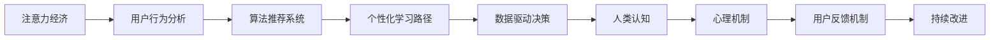

                 

# 注意力经济与个人学习动机的变化

> 关键词：注意力经济, 个人学习动机, 算法推荐系统, 用户行为分析, 个性化学习路径, 数据驱动决策, 人类认知, 心理机制, 用户反馈机制, 持续改进

## 1. 背景介绍

在当今信息爆炸的时代，注意力经济成为一种重要的商业模式和资源分配方式。从互联网的点击流到移动设备的屏幕使用时间，从社交媒体的互动到电商平台的交易记录，这些数据构成了数字化世界的注意力图谱。同时，个人学习动机也在发生变化，受数字化时代信息泛滥和消费主义文化的影响，人们对于知识获取的需求与学习动机呈现新的趋势。本文将探讨注意力经济对个人学习动机的影响，并分析算法推荐系统在个人学习动机驱动下的新模式。

## 2. 核心概念与联系

### 2.1 核心概念概述

**注意力经济（Attention Economy）**：指在信息过载的数字化时代，注意力成为一种稀缺资源，各种商业策略和政策手段争夺人们的注意力以实现商业目标。

**个人学习动机（Personal Learning Motivation）**：指个人为了满足内在或外在需求，主动获取知识、提升能力、改善自我的心理动力。

**算法推荐系统（Recommendation Systems）**：基于用户行为数据，通过机器学习模型，为用户推荐个性化内容、产品或服务的系统。

**用户行为分析（User Behavior Analysis）**：通过数据分析技术，解析用户在线上的行为模式、偏好和需求，以指导产品和服务的设计与优化。

**个性化学习路径（Personalized Learning Path）**：针对每个用户设计独特的学习路径，根据其兴趣、能力和进度，推荐适宜的学习内容。

**数据驱动决策（Data-Driven Decision Making）**：依赖数据分析和建模结果，而非直觉和经验，进行商业决策和产品优化。

**人类认知（Human Cognition）**：指人类获取、处理、存储和使用信息的心理过程和生理机制。

**心理机制（Psychological Mechanisms）**：影响个人行为和决策的心理因素，如动机、情绪、认知负荷等。

**用户反馈机制（User Feedback Mechanism）**：通过用户反馈调整系统行为和优化模型性能的机制。

**持续改进（Continuous Improvement）**：在产品或系统运行过程中不断根据用户反馈和环境变化进行调整和优化，以提升性能。

### 2.2 核心概念原理和架构的 Mermaid 流程图



这个流程图展示了注意力经济、用户行为分析、算法推荐系统、个性化学习路径、数据驱动决策、人类认知、心理机制、用户反馈机制、持续改进之间的联系。其中，注意力经济和用户行为分析是输入端，通过算法推荐系统和个性化学习路径进行处理，最终通过数据驱动决策和人类认知、心理机制形成反馈，持续改进算法推荐系统。

## 3. 核心算法原理 & 具体操作步骤

### 3.1 算法原理概述

基于注意力经济和用户行为分析的个性化学习动机驱动的算法推荐系统，其核心算法原理可以概括为以下几个步骤：

1. **数据收集与处理**：收集用户的行为数据，如浏览历史、点击流、互动记录等，并进行清洗、归一化等预处理。
2. **用户行为建模**：利用机器学习模型对用户行为进行建模，预测用户偏好和需求。
3. **个性化学习路径生成**：根据用户模型，生成个性化学习路径，推荐适宜的学习内容。
4. **学习动机分析**：通过分析用户行为和学习路径，理解用户的个性化学习动机。
5. **动机驱动的推荐优化**：根据动机分析结果，优化推荐算法，提升用户体验和学习效果。

### 3.2 算法步骤详解

**Step 1: 数据收集与处理**

数据收集是算法的第一步，主要通过日志记录、用户反馈等方式获取用户的行为数据。这些数据包括但不限于：

- 点击流：用户在网站或应用上的点击行为。
- 浏览历史：用户在网站或应用上浏览过的内容。
- 互动记录：用户与内容之间的互动，如点赞、评论、分享等。
- 交易记录：用户在电商平台上购买的商品和行为。
- 搜索记录：用户在搜索引擎中输入的查询词。

数据处理包括：

- 清洗：去除无用的噪声和异常数据。
- 归一化：将数据转换为标准化的格式，方便后续分析。
- 特征工程：提取有意义的特征，构建用户行为模型。

**Step 2: 用户行为建模**

用户行为建模是通过机器学习模型对用户行为进行建模，以预测用户偏好和需求。常用的模型包括：

- 协同过滤：通过用户之间的相似性，推荐相似用户喜欢的内容。
- 矩阵分解：将用户行为表示为低维矩阵，挖掘潜在的用户兴趣和内容特征。
- 深度学习：使用神经网络模型，对用户行为进行更复杂的建模。

**Step 3: 个性化学习路径生成**

个性化学习路径是根据用户模型，生成适合用户的学习内容路径。这一步骤包括：

- 内容推荐：根据用户兴趣，推荐合适的学习内容。
- 路径规划：设计学习路径，使其具有逻辑性和可执行性。
- 进度跟踪：监控用户的学习进度，调整学习路径。

**Step 4: 学习动机分析**

学习动机分析是通过用户行为和学习路径，理解用户的个性化学习动机。这一步骤包括：

- 动机分类：将用户的动机分为成就、社交、自我提升等不同类型。
- 动机强度：分析用户动机的强度，指导个性化推荐。
- 动机变化：监控用户动机的变化，及时调整推荐策略。

**Step 5: 动机驱动的推荐优化**

动机驱动的推荐优化是根据动机分析结果，优化推荐算法，提升用户体验和学习效果。这一步骤包括：

- 动机导向推荐：根据用户动机，调整推荐算法和策略。
- 动机反馈调整：通过用户反馈，调整推荐模型和策略。
- 持续改进：在用户反馈和环境变化中不断优化推荐系统。

### 3.3 算法优缺点

**优点**：

- 个性化强：能够根据用户动机和行为，提供个性化的学习路径和内容。
- 学习效果提升：通过优化推荐算法，提升用户的学习效果和满意度。
- 数据驱动决策：基于用户数据，进行科学决策，提升商业价值。

**缺点**：

- 隐私问题：收集和处理用户数据可能涉及隐私问题，需要严格的数据保护措施。
- 数据依赖：算法效果依赖于数据质量，数据偏差可能导致推荐效果不佳。
- 动态调整：个性化学习路径需要实时调整，对算法的灵活性和鲁棒性要求高。

### 3.4 算法应用领域

基于算法推荐系统的个性化学习动机驱动方法，可以应用于以下领域：

- 在线教育平台：根据用户动机，推荐适宜的课程和教材。
- 职业培训平台：根据用户动机和需求，推荐合适的培训课程。
- 个人学习管理系统：记录和规划用户的学习路径，提供个性化学习建议。
- 企业培训系统：根据员工动机和学习效果，推荐适宜的培训资源。
- 智能辅导系统：根据学生的动机和反馈，调整教学策略和内容。

## 4. 数学模型和公式 & 详细讲解 & 举例说明

### 4.1 数学模型构建

假设用户 $u$ 有 $n$ 个行为特征 $x_i$，其中 $i=1,...,n$。用户 $u$ 与内容 $c$ 的交互关系表示为 $y_{u,i}$，其中 $y_{u,i} \in \{0,1\}$ 表示用户 $u$ 是否对内容 $c$ 进行了交互。设内容 $c$ 的特征为 $z_j$，其中 $j=1,...,m$。

根据用户 $u$ 的行为特征和内容 $c$ 的特征，构建用户行为模型：

$$
y_{u,i} = \phi_i(x_i, z_j)
$$

其中 $\phi_i$ 为非线性映射函数，将用户行为特征和内容特征映射到 $[0,1]$ 区间。

### 4.2 公式推导过程

对于协同过滤模型，假设用户 $u$ 和内容 $c$ 的相似度为 $s_{u,c}$，则用户 $u$ 对内容 $c$ 的预测行为概率为：

$$
\hat{y}_{u,c} = \sigma(\sum_{v \in V} s_{u,v} y_{v,c})
$$

其中 $V$ 为所有用户集，$\sigma$ 为sigmoid函数，将预测结果映射到 $[0,1]$ 区间。

对于矩阵分解模型，设用户 $u$ 的行为矩阵为 $X_u$，内容 $c$ 的特征矩阵为 $Z_c$，则用户 $u$ 对内容 $c$ 的预测行为概率为：

$$
\hat{y}_{u,c} = \sigma(\vec{z}_c^T X_u)
$$

其中 $\vec{z}_c$ 为内容 $c$ 的特征向量，$X_u$ 为用户 $u$ 的行为矩阵。

对于深度学习模型，使用多层神经网络对用户行为进行建模，输入层为 $x_i$，输出层为 $\hat{y}_{u,c}$，中间层为 $z_j$。设神经网络模型参数为 $\theta$，则：

$$
\hat{y}_{u,c} = f_\theta(x_i, z_j)
$$

其中 $f_\theta$ 为神经网络模型，包括权重和偏置项。

### 4.3 案例分析与讲解

以在线教育平台为例，假设用户 $u$ 想要提升编程技能，平台根据用户的历史学习行为和反馈，推荐适合的学习路径和课程。

1. **数据收集**：收集用户的学习记录、课程选择、测验成绩、评论等行为数据。
2. **用户行为建模**：使用协同过滤模型，根据用户的历史行为和选择，预测用户对不同课程的兴趣程度。
3. **个性化学习路径生成**：根据用户模型，推荐从基础编程到高级算法的多门课程，并设计学习路径。
4. **学习动机分析**：通过用户互动和学习进度，分析用户的成就动机、自我提升动机。
5. **动机驱动的推荐优化**：根据用户的动机，调整推荐算法，如增加实战项目和交互练习，提高用户的学习兴趣和效果。

## 5. 项目实践：代码实例和详细解释说明

### 5.1 开发环境搭建

在进行算法推荐系统开发前，需要准备好开发环境。以下是使用Python进行TensorFlow开发的环境配置流程：

1. 安装Anaconda：从官网下载并安装Anaconda，用于创建独立的Python环境。

2. 创建并激活虚拟环境：
```bash
conda create -n tf-env python=3.8 
conda activate tf-env
```

3. 安装TensorFlow：根据CUDA版本，从官网获取对应的安装命令。例如：
```bash
pip install tensorflow
```

4. 安装TensorBoard：用于可视化模型的训练状态和结果。
```bash
pip install tensorboard
```

5. 安装NumPy、Pandas、Scikit-learn、Matplotlib等工具包。
```bash
pip install numpy pandas scikit-learn matplotlib jupyter notebook ipython
```

完成上述步骤后，即可在`tf-env`环境中开始算法推荐系统的开发。

### 5.2 源代码详细实现

这里以协同过滤模型为例，给出使用TensorFlow进行在线教育平台用户行为分析的代码实现。

```python
import tensorflow as tf
import numpy as np
import pandas as pd

# 构建用户行为模型
class UserBehaviorModel(tf.keras.Model):
    def __init__(self, num_users, num_items):
        super(UserBehaviorModel, self).__init__()
        self.user_embeddings = tf.keras.layers.Embedding(num_users, 64, input_length=1)
        self.item_embeddings = tf.keras.layers.Embedding(num_items, 64, input_length=1)
        self.interaction_layer = tf.keras.layers.Dot(axes=[1, 1], normalize=True, use_bias=False)

    def call(self, inputs):
        user_ids, item_ids = inputs
        user_embeddings = self.user_embeddings(user_ids)
        item_embeddings = self.item_embeddings(item_ids)
        interaction = self.interaction_layer([user_embeddings, item_embeddings])
        return tf.nn.sigmoid(interaction)

# 加载用户行为数据
user_data = pd.read_csv('user_behavior.csv')

# 构建模型
model = UserBehaviorModel(num_users=len(user_data['user_id'].unique()), num_items=len(user_data['item_id'].unique()))

# 编译模型
model.compile(optimizer='adam', loss='binary_crossentropy', metrics=['accuracy'])

# 训练模型
model.fit(user_data[['user_id', 'item_id']], user_data['interaction'], epochs=10, batch_size=64)

# 使用模型进行预测
new_user = np.array([0, 1])
new_item = np.array([2, 3])
prediction = model.predict([new_user, new_item])
```

### 5.3 代码解读与分析

让我们再详细解读一下关键代码的实现细节：

**UserBehaviorModel类**：
- `__init__`方法：定义用户和内容的嵌入层，以及交互层，将用户嵌入和内容嵌入相乘后通过sigmoid函数得到预测结果。
- `call`方法：在模型调用时，将用户和内容嵌入作为输入，通过交互层得到预测结果。

**用户行为数据加载**：
- 使用Pandas库加载用户行为数据，解析用户ID、内容ID和交互信息。

**模型编译与训练**：
- 使用TensorFlow编译模型，设置优化器为Adam，损失函数为二元交叉熵，评估指标为准确率。
- 使用训练集数据训练模型，设置迭代次数和批量大小。

**模型预测**：
- 使用模型对新用户和内容进行预测，返回预测结果。

## 6. 实际应用场景

### 6.1 在线教育平台

基于算法推荐系统的在线教育平台，可以根据用户的学习动机和行为，推荐适宜的课程和教材。通过数据分析和机器学习，平台能够了解用户的学习偏好、兴趣点和知识薄弱环节，为其提供个性化学习路径和推荐资源。

具体而言，可以收集用户的学习记录、课程选择、测验成绩、评论等行为数据，使用协同过滤、矩阵分解等算法对用户行为进行建模，并根据模型结果生成个性化学习路径。同时，通过用户互动和学习进度，分析用户的成就动机、自我提升动机，调整推荐策略，增加实战项目和交互练习，提升用户的学习兴趣和效果。

### 6.2 职业培训平台

职业培训平台可以根据用户的职业目标和动机，推荐合适的培训课程。通过算法推荐系统，平台能够精准匹配用户的学习需求和职业规划，为其提供高质量的培训资源和路径。

具体而言，可以收集用户的学习记录、课程选择、培训效果、反馈等行为数据，使用深度学习模型对用户行为进行建模，并根据模型结果生成个性化培训路径。同时，通过用户互动和反馈，分析用户的成就动机、技能提升动机，调整推荐策略，增加实践机会和项目，提升用户的学习效果和职业竞争力。

### 6.3 个人学习管理系统

个人学习管理系统可以根据用户的个性化学习需求，记录和规划学习路径，提供个性化学习建议。通过算法推荐系统，用户可以更好地管理自己的学习进度和目标，提高学习效率和效果。

具体而言，可以收集用户的浏览历史、学习进度、反馈等行为数据，使用协同过滤、深度学习等算法对用户行为进行建模，并根据模型结果生成个性化学习路径。同时，通过用户互动和反馈，分析用户的成就动机、知识提升动机，调整推荐策略，增加学习资源和路径，提升用户的学习效果和满意度。

### 6.4 未来应用展望

随着算法推荐系统的发展，未来的个性化学习动机驱动方法将更加智能和全面，为用户提供更加精准和高效的学习体验。以下是未来可能的应用趋势：

1. **跨平台整合**：将不同平台的用户行为数据整合，进行全局分析和推荐。
2. **实时推荐**：利用流数据处理技术，实现实时推荐和学习路径调整。
3. **多模态融合**：将文本、图像、视频等多模态数据进行融合，提供更全面的个性化推荐。
4. **智能辅导**：结合自然语言处理和机器学习，提供智能化的学习辅导和反馈。
5. **动态优化**：根据用户反馈和环境变化，实时优化推荐算法和策略。

## 7. 工具和资源推荐

### 7.1 学习资源推荐

为了帮助开发者系统掌握算法推荐系统的理论和实践，这里推荐一些优质的学习资源：

1. 《推荐系统实践》：由推荐系统领域专家撰写，全面介绍了推荐系统的原理、算法和应用。
2. 《深度学习与推荐系统》：介绍深度学习在推荐系统中的应用，涵盖协同过滤、矩阵分解、深度学习等经典方法。
3. 《个性化推荐系统》：系统讲解个性化推荐系统的设计、实现和优化，包含案例分析与实践。
4. 《TensorFlow推荐系统实战》：使用TensorFlow实现推荐系统的示例代码和实战教程。
5. 《机器学习实战》：介绍了机器学习在推荐系统中的应用，涵盖回归、分类、聚类等算法。

通过对这些资源的学习实践，相信你一定能够快速掌握算法推荐系统的精髓，并用于解决实际的个性化学习动机问题。

### 7.2 开发工具推荐

高效的开发离不开优秀的工具支持。以下是几款用于算法推荐系统开发的常用工具：

1. TensorFlow：由Google主导开发的深度学习框架，生产部署方便，适合大规模工程应用。
2. PyTorch：基于Python的开源深度学习框架，灵活动态的计算图，适合快速迭代研究。
3. Scikit-learn：用于数据预处理、模型训练和评估的Python库，功能强大且易于使用。
4. Pandas：用于数据清洗、处理和分析的Python库，能够高效处理大规模数据集。
5. TensorBoard：TensorFlow配套的可视化工具，可实时监测模型训练状态，并提供丰富的图表呈现方式。

合理利用这些工具，可以显著提升算法推荐系统的开发效率，加快创新迭代的步伐。

### 7.3 相关论文推荐

算法推荐系统的发展源于学界的持续研究。以下是几篇奠基性的相关论文，推荐阅读：

1. "Collaborative Filtering for Implicit Feedback Datasets"：提出协同过滤算法，用于推荐系统中的用户行为数据。
2. "Matrix Factorization Techniques for Recommender Systems"：提出矩阵分解算法，用于推荐系统中的用户行为数据。
3. "Deep Learning with Gaussian Processes for Diverse and Scalable Recommendations"：提出深度学习与高斯过程结合的推荐算法，提高推荐系统的多样性和可扩展性。
4. "Attention-Based Recommender Systems"：提出注意力机制的推荐算法，提高推荐系统的准确性和鲁棒性。
5. "The Surprising Effectiveness of Self-Supervised Learning"：介绍自监督学习在推荐系统中的应用，提升推荐系统的效果和泛化能力。

这些论文代表了大语言模型微调技术的发展脉络。通过学习这些前沿成果，可以帮助研究者把握学科前进方向，激发更多的创新灵感。

## 8. 总结：未来发展趋势与挑战

### 8.1 总结

本文对基于算法推荐系统的个性化学习动机驱动方法进行了全面系统的介绍。首先阐述了注意力经济和用户行为分析对个人学习动机的影响，明确了算法推荐系统在个性化学习动机驱动下的重要价值。其次，从原理到实践，详细讲解了算法推荐系统的数学模型和具体步骤，给出了完整的代码实现。同时，本文还广泛探讨了算法推荐系统在在线教育、职业培训、个人学习管理系统等领域的实际应用，展示了算法的强大潜力。此外，本文精选了算法推荐系统的各类学习资源，力求为读者提供全方位的技术指引。

通过本文的系统梳理，可以看到，算法推荐系统在个性化学习动机驱动下，正在成为商业和教育领域的重要技术范式，极大地提升了用户体验和学习效果。未来，伴随算法推荐系统的持续演进，其将会在更多领域发挥更大的作用，为个性化学习动机驱动提供更全面的解决方案。

### 8.2 未来发展趋势

展望未来，算法推荐系统的个性化学习动机驱动方法将呈现以下几个发展趋势：

1. **多模态数据融合**：将文本、图像、视频等多模态数据进行融合，提供更全面的个性化推荐。
2. **实时动态优化**：利用流数据处理技术，实现实时推荐和学习路径调整。
3. **跨平台整合**：将不同平台的用户行为数据整合，进行全局分析和推荐。
4. **智能辅导与反馈**：结合自然语言处理和机器学习，提供智能化的学习辅导和反馈。
5. **模型可解释性**：提升推荐模型的可解释性，使用户理解推荐背后的逻辑和理由。

以上趋势凸显了算法推荐系统的广阔前景。这些方向的探索发展，必将进一步提升个性化学习动机驱动的效果，为学习者提供更加精准和高效的学习体验。

### 8.3 面临的挑战

尽管算法推荐系统已经取得了瞩目成就，但在迈向更加智能化、普适化应用的过程中，它仍面临着诸多挑战：

1. **数据隐私保护**：收集和处理用户数据可能涉及隐私问题，需要严格的数据保护措施。
2. **数据质量问题**：算法效果依赖于数据质量，数据偏差可能导致推荐效果不佳。
3. **实时性问题**：实时推荐和学习路径调整对算法的灵活性和鲁棒性要求高。
4. **多模态数据融合**：多模态数据的融合和处理技术复杂，需要高效的数据表示和处理方法。
5. **可解释性问题**：推荐模型的可解释性差，用户难以理解推荐背后的逻辑和理由。

### 8.4 研究展望

面对算法推荐系统面临的挑战，未来的研究需要在以下几个方面寻求新的突破：

1. **数据隐私保护**：研究如何在使用推荐系统的同时，保护用户的隐私数据。
2. **数据质量提升**：研究如何优化数据采集和处理流程，提高数据质量。
3. **实时推荐算法**：研究如何设计高效、鲁棒的实时推荐算法，提高推荐系统的响应速度和准确性。
4. **多模态数据融合**：研究如何高效融合多模态数据，提升推荐系统的多样性和可扩展性。
5. **推荐模型可解释性**：研究如何提升推荐模型的可解释性，使用户理解推荐背后的逻辑和理由。

这些研究方向的探索，必将引领算法推荐系统迈向更高的台阶，为个性化学习动机驱动提供更全面的解决方案。面向未来，算法推荐系统需要与其他人工智能技术进行更深入的融合，如自然语言处理、深度学习、计算机视觉等，多路径协同发力，共同推动个性化学习动机驱动的发展。只有勇于创新、敢于突破，才能不断拓展算法推荐系统的边界，让个性化学习动机驱动更加智能和高效。

## 9. 附录：常见问题与解答

**Q1：算法推荐系统是否适用于所有个性化学习动机驱动的应用场景？**

A: 算法推荐系统在大多数个性化学习动机驱动的应用场景中都能取得不错的效果，特别是对于数据量较大的场景。但对于一些特定领域的应用，如医学、法律等，仅仅依靠算法推荐系统可能难以很好地适应。此时需要结合专家知识，进行混合推荐策略。

**Q2：算法推荐系统如何处理用户动机分析中的数据噪声？**

A: 用户动机分析中的数据噪声可以通过多种方法进行处理，如特征选择、数据清洗、异常值处理等。具体方法包括：

- 特征选择：选择具有代表性的动机特征，去除无关或重复特征。
- 数据清洗：去除无用的噪声和异常数据，保持数据集的一致性和完整性。
- 异常值处理：识别和处理异常值，如通过平滑处理、替换等方法。

**Q3：如何优化算法推荐系统中的模型性能？**

A: 算法推荐系统中的模型性能优化可以从以下几个方面进行：

- 数据增强：通过数据增强技术，扩充训练集，提高模型的泛化能力。
- 模型选择：选择适合的模型架构和参数，如深度神经网络、卷积神经网络、循环神经网络等。
- 超参数调优：通过网格搜索、贝叶斯优化等方法，寻找最优超参数组合。
- 正则化技术：使用L1正则、L2正则、Dropout等技术，防止模型过拟合。
- 动态调整：根据用户反馈和环境变化，实时调整推荐策略和模型参数。

**Q4：算法推荐系统在实际应用中需要注意哪些问题？**

A: 在实际应用中，算法推荐系统需要注意以下几个问题：

- 用户隐私保护：保证用户数据的安全性和隐私性，防止数据泄露和滥用。
- 数据质量问题：确保数据质量，避免数据偏差和噪声影响推荐效果。
- 实时性问题：提高推荐系统的响应速度和实时性，满足用户需求。
- 多模态数据融合：高效融合多模态数据，提升推荐系统的多样性和可扩展性。
- 推荐模型可解释性：提高推荐模型的可解释性，使用户理解推荐背后的逻辑和理由。

这些问题的解决需要综合考虑技术、业务、法规等多方面因素，确保推荐系统的稳定性和可靠性。

---

作者：禅与计算机程序设计艺术 / Zen and the Art of Computer Programming

