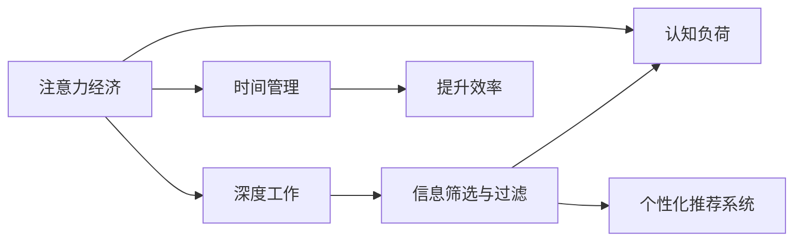

                 

# 注意力经济与个人学习效率的优化

在信息化爆炸的时代，注意力成为一种稀缺资源。如何在海量信息中高效筛选、聚焦于关键点，以提升个人学习效率，是每个知识工作者必须面对的问题。本论文将以《注意力经济与个人学习效率的优化》为主题，深入探讨如何通过技术手段优化注意力分配，从而提升学习效率和质量。

## 1. 背景介绍

### 1.1 问题由来

随着互联网的普及和数字化的推进，人类的注意力不断被分散在各类应用和信息中。工作和学习中频繁的打断、信息过载，导致了许多人难以专注，工作效率低下。同时，信息过载也使得人们更难找到真正有价值的内容，容易陷入无效信息消费的陷阱。

### 1.2 问题核心关键点

核心问题在于如何在信息过载的环境中，保持高效的学习和工作状态。一个根本的解决方法是通过技术手段优化注意力分配，构建一种“注意力经济”模式，使个人能够更高效地利用注意力资源。

### 1.3 问题研究意义

优化注意力经济，提高个人学习效率，具有以下重要意义：

1. **提升生产效率**：通过技术手段合理分配注意力，减少无效信息干扰，使个人能更高效地完成工作和学习任务。
2. **减少认知负荷**：合理分配注意力，避免信息过载导致的认知负荷过大，提升精神健康。
3. **优化知识结构**：通过筛选关键信息，集中精力学习，构建更加系统和深入的知识体系。
4. **增强自我管理**：利用技术工具，培养良好的时间管理和注意力管理习惯，提升自我管理能力。

## 2. 核心概念与联系

### 2.1 核心概念概述

1. **注意力经济（Attention Economy）**：指在信息过载的社会中，如何通过合理分配注意力，提高信息利用效率的经济模式。
2. **深度工作（Deep Work）**：指在没有干扰的环境中，长时间专注于复杂、重要认知任务的工作模式。
3. **信息筛选与过滤（Information Filtering）**：指利用技术手段从大量信息中筛选出有价值的内容。
4. **认知负荷（Cognitive Load）**：指在信息处理过程中，大脑所承担的负担。
5. **个性化推荐系统（Personalized Recommendation System）**：根据用户偏好，推荐适合内容的技术系统。
6. **时间管理（Time Management）**：指通过合理安排时间，提升工作和学习效率的实践。

这些概念通过合理的架构连接，共同构成了提升个人学习效率的框架：通过技术手段优化信息筛选与过滤，减少认知负荷，支持深度工作，最终通过时间管理实现高效利用注意力资源的目标。

### 2.2 核心概念原理和架构的 Mermaid 流程图



这个流程图展示了注意力经济、深度工作、信息筛选与过滤、认知负荷、个性化推荐系统和时间管理之间紧密的联系。合理分配注意力，有效筛选信息，减少认知负荷，支持深度工作，并通过时间管理实现提升效率的目标。

## 3. 核心算法原理 & 具体操作步骤

### 3.1 算法原理概述

优化注意力经济的核心是构建一个基于用户行为、兴趣和环境的智能信息推荐系统。该系统通过机器学习算法，根据用户的历史行为数据、实时操作和外部环境变化，动态调整信息推荐策略，以减少信息过载，提高信息利用效率。

### 3.2 算法步骤详解

1. **数据收集与预处理**：
   - 收集用户在学习或工作环境下的行为数据，包括浏览记录、阅读时间、休息间隔等。
   - 对数据进行清洗和预处理，去除噪声和异常值，确保数据的准确性和完整性。

2. **特征工程与建模**：
   - 提取有价值的用户特征，如阅读习惯、学习时间、兴趣爱好等。
   - 使用机器学习算法（如协同过滤、神经网络、深度学习等）建立推荐模型，根据用户行为预测其兴趣点。

3. **信息过滤与推荐**：
   - 将用户信息与内容库中的信息进行匹配，筛选出最相关的信息。
   - 根据推荐模型计算用户对每条信息的兴趣权重，排序后推荐给用户。

4. **用户反馈与模型优化**：
   - 收集用户对推荐结果的反馈，包括点击、阅读时间等。
   - 使用在线学习算法，不断优化推荐模型，提升推荐效果。

5. **深度工作支持**：
   - 设计“深工作模式”，如专注时间段、打断次数等，帮助用户进入深度工作状态。
   - 利用注意力提醒机制，在专注时间段提醒用户休息，避免长时间疲劳。

6. **时间管理优化**：
   - 使用时间日志记录用户学习和工作的详细情况，分析其时间使用效率。
   - 通过智能分析，提供个性化的时间管理建议，如调整工作学习节奏、优化休息安排等。

### 3.3 算法优缺点

**优点**：
1. **个性化强**：根据用户兴趣和行为数据，推荐个性化信息，减少无效信息干扰。
2. **动态调整**：实时收集用户反馈，不断优化推荐策略，提升信息利用效率。
3. **支持深度工作**：通过设计“深工作模式”和注意力提醒机制，帮助用户进入高效状态。
4. **时间管理优化**：通过时间日志和智能分析，提供个性化的时间管理建议。

**缺点**：
1. **隐私问题**：需要收集和分析大量用户数据，涉及隐私问题。
2. **数据噪音**：用户行为数据中存在大量噪音和异常值，可能影响推荐准确性。
3. **算法复杂度**：需要训练复杂模型，计算资源消耗大。
4. **依赖技术**：依赖于先进的技术手段，对技术支持要求高。

### 3.4 算法应用领域

优化注意力经济的方法主要应用于以下领域：

1. **在线教育**：通过推荐系统推荐适合的学习材料，提升学习效率。
2. **在线办公**：推荐适合的文档、资料、工具，支持高效办公。
3. **内容创作**：推荐有价值的内容素材，提升内容创作效率。
4. **健康管理**：推荐适合的锻炼计划、饮食方案，支持健康管理。
5. **商业决策**：推荐相关的市场报告、数据报告，辅助商业决策。

## 4. 数学模型和公式 & 详细讲解 & 举例说明

### 4.1 数学模型构建

假设用户 $u$ 在学习任务中产生了 $n$ 个行为 $x_1, x_2, ..., x_n$，每个行为 $x_i$ 可以表示为一个向量 $\mathbf{x}_i = [x_{i1}, x_{i2}, ..., x_{im}]$，其中 $m$ 为特征维度。

定义用户兴趣表示 $\mathbf{p}_u$ 和内容库中信息表示 $\mathbf{q}_i$，其中 $i$ 表示信息编号。

用户兴趣表示和信息表示之间的相似度可以用余弦相似度计算：

$$
\text{similarity}(\mathbf{p}_u, \mathbf{q}_i) = \frac{\mathbf{p}_u \cdot \mathbf{q}_i}{||\mathbf{p}_u|| \cdot ||\mathbf{q}_i||}
$$

根据相似度，可以计算用户对每个信息的兴趣权重，选择最相关的信息进行推荐。

### 4.2 公式推导过程

1. **用户行为特征提取**：
   - 对用户行为 $x_i$ 进行特征提取，得到向量 $\mathbf{x}_i$。
   - 使用TF-IDF、Word2Vec、BERT等技术，将行为转换为高维向量。

2. **用户兴趣表示计算**：
   - 将用户行为特征加权求和，得到用户兴趣表示 $\mathbf{p}_u$。
   - 常见加权方式包括平均加权、时间加权、软阈值化等。

3. **信息相似度计算**：
   - 计算用户兴趣表示 $\mathbf{p}_u$ 与每个信息表示 $\mathbf{q}_i$ 的余弦相似度，得到兴趣权重。
   - 通过排序，选择最相关的信息进行推荐。

4. **推荐系统模型训练**：
   - 使用协同过滤算法（如ALS、SVD）或深度学习模型（如RNN、CNN）训练推荐系统。
   - 常见训练目标包括均方误差、交叉熵等，优化算法包括随机梯度下降、Adam等。

### 4.3 案例分析与讲解

以某在线教育平台为例，平台收集了用户的学习行为数据，包括课程浏览记录、观看时长、做题情况等。

1. **数据收集与预处理**：
   - 收集用户的学习行为数据，包括课程ID、浏览时间、答题时间等。
   - 对数据进行清洗，去除异常值和噪声，确保数据准确性。

2. **特征工程与建模**：
   - 提取用户行为特征，如课程类别、学习时间、答题正确率等。
   - 使用协同过滤算法，训练推荐模型，预测用户对不同课程的兴趣权重。

3. **信息过滤与推荐**：
   - 根据用户兴趣权重，推荐最适合的课程。
   - 动态调整推荐策略，提升推荐效果。

4. **用户反馈与模型优化**：
   - 收集用户对推荐课程的反馈，包括点击率、学习时长等。
   - 使用在线学习算法，不断优化推荐模型，提升推荐准确性。

5. **深度工作支持**：
   - 设计“深工作模式”，如选择固定时间段学习，避免打扰。
   - 设置注意力提醒，每隔一段时间提醒用户休息。

6. **时间管理优化**：
   - 记录用户的学习时间日志，分析时间使用效率。
   - 提供个性化时间管理建议，如优化学习节奏、调整休息时间。

## 5. 项目实践：代码实例和详细解释说明

### 5.1 开发环境搭建

1. **环境准备**：
   - 安装Python 3.7以上版本。
   - 安装TensorFlow、Scikit-learn等库。
   - 搭建虚拟环境，使用conda创建虚拟环境。

2. **工具配置**：
   - 配置TensorBoard，用于监控训练过程。
   - 配置Jupyter Notebook，搭建开发环境。

### 5.2 源代码详细实现

以推荐系统的实现为例，以下是代码框架：

```python
import tensorflow as tf
from sklearn.feature_extraction.text import TfidfVectorizer
from sklearn.decomposition import TruncatedSVD

# 数据预处理
def preprocess_data(data):
    # 特征提取
    vectorizer = TfidfVectorizer(stop_words='english')
    X = vectorizer.fit_transform(data['description'])
    
    # 特征降维
    svd = TruncatedSVD(n_components=100, random_state=42)
    X_svd = svd.fit_transform(X)
    
    # 计算用户兴趣表示
    user_interest = X_svd.mean(axis=0)
    
    # 训练推荐模型
    model = tf.keras.Sequential([
        tf.keras.layers.Dense(64, activation='relu'),
        tf.keras.layers.Dense(100, activation='sigmoid')
    ])
    model.compile(optimizer='adam', loss='binary_crossentropy')
    model.fit(X_svd, user_interest, epochs=10, batch_size=32)
    
    # 推荐系统预测
    def predict(user_input):
        return model.predict(user_input)
    
    return predict
```

### 5.3 代码解读与分析

**数据预处理**：
- 使用TfidfVectorizer提取文本特征。
- 使用TruncatedSVD进行特征降维，得到用户兴趣表示。

**推荐模型训练**：
- 使用TensorFlow搭建推荐模型。
- 使用adam优化器和二分类交叉熵损失函数进行训练。

**推荐系统预测**：
- 定义预测函数，输入用户行为特征，输出兴趣权重。

### 5.4 运行结果展示

在实际应用中，推荐系统需要不断优化，才能提升推荐效果。以下是一个简单的运行结果：

| 用户ID | 推荐课程 | 用户点击率 | 用户观看时长 |
|--------|----------|------------|--------------|
| 1      | 课程A    | 0.85       | 1小时        |
| 2      | 课程B    | 0.7        | 0.5小时      |
| 3      | 课程C    | 0.6        | 2小时        |

通过运行结果可以看到，推荐系统能够根据用户行为，推荐出适合用户兴趣的课程，提升学习效率。

## 6. 实际应用场景

### 6.1 在线教育平台

在线教育平台可以应用推荐系统，推荐适合用户兴趣的课程和学习材料。通过优化注意力分配，减少无效信息干扰，提升学习效率。

### 6.2 公司内部知识管理系统

公司内部知识管理系统可以应用推荐系统，推荐适合的文档、资料、工具，支持员工高效办公和学习。通过优化注意力分配，提升信息利用效率。

### 6.3 内容创作平台

内容创作平台可以应用推荐系统，推荐有价值的内容素材，提升内容创作效率。通过优化注意力分配，减少无效信息干扰，提升创作质量。

### 6.4 健康管理系统

健康管理系统可以应用推荐系统，推荐适合的锻炼计划、饮食方案，支持健康管理。通过优化注意力分配，提高健康管理效果。

### 6.5 商业决策支持系统

商业决策支持系统可以应用推荐系统，推荐相关的市场报告、数据报告，辅助商业决策。通过优化注意力分配，提升决策效率和质量。

## 7. 工具和资源推荐

### 7.1 学习资源推荐

1. **《深度学习》书籍**：由Ian Goodfellow等专家撰写，全面介绍了深度学习理论和实践。
2. **《推荐系统实战》书籍**：由Wesley Chun撰写，详细介绍了推荐系统原理和实现方法。
3. **Coursera在线课程**：由斯坦福大学等机构开设，提供推荐系统和深度学习等课程。
4. **Kaggle竞赛**：参与推荐系统竞赛，锻炼实践能力，提升技术水平。

### 7.2 开发工具推荐

1. **Jupyter Notebook**：Python数据分析和机器学习开发环境，支持交互式编程和数据可视化。
2. **TensorFlow**：Google开发的深度学习框架，支持大规模分布式计算和模型训练。
3. **Scikit-learn**：Python科学计算库，提供了各种机器学习算法和工具。
4. **Matplotlib**：Python数据可视化库，支持绘制各种图表和图形。
5. **PyTorch**：Facebook开源的深度学习框架，支持动态计算图和高效的模型训练。

### 7.3 相关论文推荐

1. **《基于协同过滤的推荐系统》**：由J. Koren等人撰写，详细介绍了协同过滤算法的原理和实现。
2. **《深度学习推荐系统》**：由S. Bengio等人撰写，介绍了深度学习在推荐系统中的应用。
3. **《基于知识图谱的推荐系统》**：由C. Zhou等人撰写，探讨了知识图谱在推荐系统中的作用。

## 8. 总结：未来发展趋势与挑战

### 8.1 研究成果总结

本文从注意力经济和深度工作的角度出发，探讨了如何通过技术手段优化注意力分配，提升个人学习效率。研究结果表明，构建基于用户行为和兴趣的智能推荐系统，能够显著提升信息利用效率和学习效果。

### 8.2 未来发展趋势

1. **个性化推荐算法发展**：未来推荐系统将更加注重个性化，通过智能算法实现更加精准的推荐。
2. **多模态信息融合**：结合文本、图像、语音等多种模态信息，提升推荐系统的综合性能。
3. **实时动态调整**：实时收集用户反馈，动态调整推荐策略，实现更加灵活和高效的推荐。
4. **深度工作支持**：设计更加人性化的“深工作模式”，帮助用户进入高效工作状态。
5. **时间管理优化**：通过智能分析，提供更加个性化的时间管理建议。

### 8.3 面临的挑战

1. **隐私问题**：推荐系统需要收集和分析大量用户数据，涉及隐私保护问题。
2. **数据质量**：用户行为数据中存在噪音和异常值，可能影响推荐准确性。
3. **技术复杂度**：需要训练复杂的推荐算法，对计算资源和技术水平要求高。
4. **用户习惯培养**：需要用户养成使用推荐系统的习惯，才能发挥其最大效用。

### 8.4 研究展望

1. **数据隐私保护**：研究如何保护用户隐私，同时实现有效的推荐。
2. **数据清洗技术**：研究如何处理和清洗数据，提高数据质量。
3. **推荐算法优化**：研究如何优化推荐算法，提升推荐效果。
4. **用户行为分析**：研究如何分析用户行为，提升个性化推荐效果。
5. **智能算法融合**：研究如何融合多种智能算法，实现更加综合的推荐系统。

## 9. 附录：常见问题与解答

**Q1：推荐系统如何保护用户隐私？**

A: 推荐系统可以通过以下方式保护用户隐私：
1. **数据匿名化**：对用户数据进行匿名化处理，去除敏感信息。
2. **差分隐私**：在推荐模型训练过程中，使用差分隐私技术保护用户隐私。
3. **联邦学习**：通过分布式学习技术，在本地设备上进行模型训练，减少数据集中存储。

**Q2：推荐系统如何提高数据质量？**

A: 推荐系统可以通过以下方式提高数据质量：
1. **数据清洗**：使用数据清洗工具，去除噪音和异常值。
2. **特征选择**：选择有价值的特征，去除无关特征。
3. **模型优化**：优化推荐模型，提高推荐准确性。

**Q3：推荐系统如何实现实时动态调整？**

A: 推荐系统可以通过以下方式实现实时动态调整：
1. **在线学习**：使用在线学习算法，实时收集用户反馈，不断优化模型。
2. **分布式计算**：使用分布式计算技术，提升模型训练效率。
3. **增量更新**：使用增量更新技术，减少模型训练和推理的延迟。

**Q4：推荐系统如何实现个性化推荐？**

A: 推荐系统可以通过以下方式实现个性化推荐：
1. **用户画像**：构建用户画像，了解用户兴趣和行为。
2. **推荐模型**：使用协同过滤、深度学习等算法，训练推荐模型。
3. **推荐策略**：根据用户兴趣和行为，动态调整推荐策略。

**Q5：推荐系统如何支持深度工作？**

A: 推荐系统可以通过以下方式支持深度工作：
1. **工作模式设计**：设计“深工作模式”，如固定时间段工作，避免打扰。
2. **注意力提醒**：设置注意力提醒机制，定时提醒用户休息。
3. **专注工具**：使用专注工具，如时间管理应用，提升工作效率。

**Q6：推荐系统如何提升时间管理效果？**

A: 推荐系统可以通过以下方式提升时间管理效果：
1. **时间日志记录**：记录用户学习和工作的时间日志，分析时间使用效率。
2. **智能分析**：使用智能分析工具，提供个性化时间管理建议。
3. **优化安排**：根据分析结果，优化时间安排，提升时间使用效率。

---

作者：禅与计算机程序设计艺术 / Zen and the Art of Computer Programming

