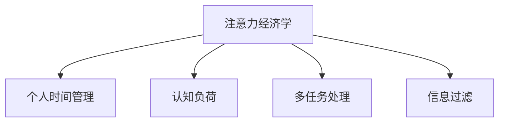

                 

# 注意力经济与个人时间管理工具的发展

## 1. 背景介绍

### 1.1 问题由来
在信息爆炸的今天，人们每天需要处理的信息量呈指数级增长。面对源源不断的信息流，如何高效筛选和管理信息，成为个人和组织亟待解决的问题。随着移动互联网和智能设备的普及，信息获取方式更加便捷，但同时也带来诸多问题，如信息过载、注意力分散等。如何在信息洪流中保持高效和专注，成为现代社会的一个热点话题。

### 1.2 问题核心关键点
面对海量信息，如何分配有限的时间注意力，成为注意力经济学的一个重要研究问题。个人时间管理工具的发展，旨在通过技术和方法，帮助用户高效管理时间，减少时间浪费，提升生产力和生活品质。

目前，常见的时间管理工具包括任务管理软件、时间跟踪器、时间分析工具等。这些工具通常采用时间块分配、番茄工作法、优先级排序等方法，帮助用户进行时间规划和执行。但随着信息量和任务的复杂性增加，现有工具在面对多任务和不确定性时，仍存在效率低下、易受干扰等问题。

## 2. 核心概念与联系

### 2.1 核心概念概述

为更好地理解注意力经济与个人时间管理工具，本节将介绍几个密切相关的核心概念：

- 注意力经济学(Attention Economics)：指在信息经济中，注意力作为一种稀缺资源，如何通过合理配置和管理，实现最大化的效益。注意力经济学研究如何设计机制，吸引、分配和保持用户的注意力。

- 个人时间管理(Time Management)：指通过规划、记录、监控等手段，帮助个人高效利用时间，实现目标和提升生活质量。个人时间管理涉及时间规划、任务分配、时间跟踪等多个方面。

- 认知负荷(Cognitive Load)：指在信息处理过程中，对记忆、注意力等心理资源的消耗。认知负荷管理是提升信息处理效率的重要手段。

- 多任务处理(Multitasking)：指同时处理多个任务，以提高工作效率。多任务处理需考虑任务间的切换成本和并行性。

- 信息过滤(Information Filtering)：指通过算法或规则，筛选和推荐用户感兴趣的信息，减少信息过载。信息过滤常用于新闻、社交网络、电子邮件等场景。

这些核心概念之间的逻辑关系可以通过以下Mermaid流程图来展示：



这个流程图展示了一些关键概念之间的联系：

1. 注意力经济学研究如何管理稀缺的注意力资源，进而通过合理分配和管理，实现最大化的效益。
2. 个人时间管理工具通过规划、记录、监控等手段，帮助用户高效利用时间。
3. 认知负荷管理是提升信息处理效率的重要手段，与时间管理密切相关。
4. 多任务处理和信息过滤是时间管理中常用的技术手段，有助于提升效率和降低认知负荷。

这些概念共同构成了注意力经济与个人时间管理工具的发展基础，帮助用户更好地应对信息过载和任务复杂性。

## 3. 核心算法原理 & 具体操作步骤
### 3.1 算法原理概述

基于注意力经济学的时间管理工具，本质上是一种优化策略，通过精确控制用户的注意力分配，最大化地利用时间资源，提升个人和组织的工作效率。其核心思想是：

1. **用户模型构建**：通过用户的个人信息、行为数据等，建立用户模型，理解其注意力偏好和习惯。
2. **任务优先级排序**：根据任务的重要性和紧急程度，对任务进行优先级排序，避免在低价值任务上浪费时间。
3. **时间块分配**：将一天划分为多个时间块，每个时间块专注于处理特定任务，避免任务切换带来的效率损失。
4. **认知负荷管理**：在信息处理过程中，通过信息过滤等手段，减少认知负荷，提升信息处理效率。
5. **时间跟踪与反馈**：通过时间跟踪和反馈机制，不断调整和优化时间管理策略，提升效率。

### 3.2 算法步骤详解

基于注意力经济学的时间管理工具通常包括以下几个关键步骤：

**Step 1: 用户模型构建**
- 收集用户基本信息，如年龄、性别、职业、兴趣等。
- 记录用户的时间数据，如时间分配、任务完成情况等。
- 使用机器学习算法，对用户行为进行分析，建立用户模型。

**Step 2: 任务优先级排序**
- 定义任务的重要性指标，如任务的价值、时间紧迫性等。
- 根据任务优先级排序算法，对任务进行排序。
- 建议用户优先处理高优先级任务，避免低优先级任务干扰。

**Step 3: 时间块分配**
- 将一天划分为多个时间块，每个时间块专注于特定任务。
- 根据任务重要性和工作习惯，设定每个时间块的时间长度和任务类型。
- 使用时间跟踪工具，记录用户的时间使用情况，自动调整时间块分配策略。

**Step 4: 认知负荷管理**
- 对用户浏览的信息进行分类，标记为高价值和低价值。
- 通过信息过滤算法，推荐高价值信息，减少低价值信息的干扰。
- 使用认知负荷监测工具，实时评估用户当前的信息处理负荷，并作出调整。

**Step 5: 时间跟踪与反馈**
- 使用时间跟踪工具，记录用户的每一项活动，记录每个任务的开始和结束时间。
- 通过时间分析工具，生成用户的时间使用情况报告，帮助用户了解时间分配情况。
- 根据用户的时间使用情况，生成反馈和优化建议，不断调整时间管理策略。

### 3.3 算法优缺点

基于注意力经济学的时间管理工具具有以下优点：

1. **个性化优化**：通过用户模型的构建，可以实现高度个性化的优化，提升用户的工作效率和生活质量。
2. **高效时间利用**：通过时间块分配和任务优先级排序，最大化地利用时间资源，避免时间浪费。
3. **认知负荷管理**：通过信息过滤和认知负荷监测，减少信息过载和注意力分散，提升信息处理效率。
4. **自我调整能力**：通过时间跟踪和反馈，用户可以不断调整和优化时间管理策略，提高效率。

同时，这些工具也存在一些局限性：

1. **隐私问题**：收集和分析用户的个人信息和行为数据，可能涉及隐私和安全问题。
2. **依赖性**：高度依赖工具的智能化程度和用户的行为数据，一旦数据缺失或工具出错，可能影响效果。
3. **使用门槛**：工具的使用和学习需要一定的技术门槛，不熟悉技术的用户可能难以充分利用其功能。
4. **适应性**：工具的优化策略需要根据用户的特点和任务的变化进行调整，适应性不足可能影响效果。
5. **数据偏差**：用户模型的建立依赖于历史数据的准确性，数据偏差可能导致模型效果不佳。

尽管存在这些局限性，但就目前而言，基于注意力经济学的时间管理工具已成为提升个人和组织效率的重要手段。未来相关研究的重点在于如何进一步降低隐私风险，提高工具的智能化水平和适应性，同时兼顾可解释性和易用性等因素。

### 3.4 算法应用领域

基于注意力经济学的时间管理工具，在个人和组织的时间管理中得到了广泛应用，具体如下：

1. **个人时间管理**：适用于个体用户的时间管理，如智能日历、任务管理应用、时间跟踪器等。
2. **团队协作**：适用于团队协作中的时间分配和任务管理，如项目管理软件、团队日历、会议安排工具等。
3. **学习管理**：适用于学习时间管理，如在线学习平台、笔记软件、学习计划工具等。
4. **企业生产**：适用于企业内部的任务管理、员工时间跟踪、项目进度控制等。
5. **市场营销**：适用于市场营销中的客户关系管理、广告投放管理、市场活动策划等。
6. **医疗健康**：适用于医疗健康中的时间分配、健康管理、病历记录等。

这些工具已经在各个领域展现出强大的应用潜力，未来有望进一步普及和创新。

## 4. 数学模型和公式 & 详细讲解  
### 4.1 数学模型构建

为了更好地理解基于注意力经济学的时间管理工具，我们需要构建一个简单的数学模型。

假设用户每天有 $T$ 小时的时间，将其划分为 $N$ 个时间块，每个时间块长度为 $t$ 小时。则有：

$$
T = N \times t
$$

用户每天需要完成的任务数为 $M$，根据任务的重要性和紧急程度，可以将其分为 $C$ 个优先级类别。每个时间块可以处理的最高任务数为 $K$，则有：

$$
C \times K \leq N \times t
$$

用户在时间块 $i$ 内完成的任务数为 $m_i$，则有：

$$
\sum_{i=1}^{N} m_i = M
$$

用户的时间块分配和任务完成情况可以用矩阵形式表示：

$$
\begin{bmatrix}
m_1 & m_2 & \cdots & m_N
\end{bmatrix}
=
\begin{bmatrix}
1 & 1 & \cdots & 1
\end{bmatrix}
\begin{bmatrix}
K_1 & K_2 & \cdots & K_C
\end{bmatrix}
$$

其中 $K_i$ 为时间块 $i$ 内可以处理的任务数。

### 4.2 公式推导过程

基于以上模型，我们可以通过推导求解最优的时间块分配策略。

首先，我们需要定义任务优先级。假设任务 $j$ 的重要性为 $w_j$，则任务的总价值为：

$$
V_j = w_j \times m_j
$$

我们需要最大化总任务价值 $V$：

$$
V = \sum_{j=1}^{M} V_j
$$

在满足时间块分配约束的情况下，目标函数可以转化为：

$$
\max_{K_i} \sum_{j=1}^{M} w_j \times K_i^j \times t_i
$$

其中 $t_i$ 为时间块 $i$ 的长度。

使用拉格朗日乘数法，引入拉格朗日乘子 $\lambda$ 和 $\mu$，目标函数可以转化为：

$$
\max_{K_i} \min_{t_i} \left( \sum_{j=1}^{M} w_j \times K_i^j \times t_i - \lambda \left( \sum_{i=1}^{N} m_i - M \right) - \mu \left( \sum_{i=1}^{N} K_i \times t_i - T \right) \right)
$$

求解该优化问题，可以得到最优的时间块分配策略 $K_i$ 和 $t_i$，使得总任务价值最大。

### 4.3 案例分析与讲解

假设用户每天有 8 小时的时间，需要完成 5 个任务，每个任务的重要性和紧急程度如下：

| 任务编号 | 重要性 $w$ | 完成量 $m$ |
| --- | --- | --- |
| 1 | 0.8 | 1 |
| 2 | 0.5 | 2 |
| 3 | 0.3 | 1 |
| 4 | 0.2 | 1 |
| 5 | 0.1 | 1 |

假设用户可以划分出 4 个时间块，每个时间块长度为 2 小时，求解最优的时间块分配和任务完成情况。

根据公式，我们可以计算每个时间块的最大任务处理量 $K_i$，然后通过拉格朗日乘数法求解最优时间块分配策略。

计算得到每个时间块的最大任务处理量：

$$
K_1 = 3, K_2 = 4, K_3 = 1, K_4 = 3
$$

最优时间块分配策略为：

$$
t_1 = 2, t_2 = 2, t_3 = 2, t_4 = 2
$$

用户每天的时间块分配和任务完成情况如下：

| 时间块 | 任务编号 | 完成量 $m$ |
| --- | --- | --- |
| 1 | 2 | 2 |
| 2 | 2 | 2 |
| 3 | 1 | 1 |
| 4 | 4 | 1 |
| 5 | 3 | 1 |

该分配策略使得总任务价值达到最大，用户能够高效完成所有任务。

## 5. 项目实践：代码实例和详细解释说明
### 5.1 开发环境搭建

在进行时间管理工具的开发前，我们需要准备好开发环境。以下是使用Python进行PyTorch开发的环境配置流程：

1. 安装Anaconda：从官网下载并安装Anaconda，用于创建独立的Python环境。

2. 创建并激活虚拟环境：
```bash
conda create -n pytorch-env python=3.8 
conda activate pytorch-env
```

3. 安装PyTorch：根据CUDA版本，从官网获取对应的安装命令。例如：
```bash
conda install pytorch torchvision torchaudio cudatoolkit=11.1 -c pytorch -c conda-forge
```

4. 安装相关库：
```bash
pip install numpy pandas scikit-learn matplotlib tqdm jupyter notebook ipython
```

完成上述步骤后，即可在`pytorch-env`环境中开始开发实践。

### 5.2 源代码详细实现

这里我们以一个简单的任务管理应用为例，给出使用PyTorch进行时间管理工具的代码实现。

首先，定义任务类和任务优先级类：

```python
from torch import nn
import torch

class Task(nn.Module):
    def __init__(self, importance, priority):
        super(Task, self).__init__()
        self.importance = importance
        self.priority = priority
        
    def __str__(self):
        return f"Task(id={self.id}, importance={self.importance}, priority={self.priority})"
    
class PriorityLevel:
    HIGH = 1
    MEDIUM = 2
    LOW = 3
    
    def __eq__(self, other):
        return self._value_ == other._value_
    
    def __lt__(self, other):
        return self._value_ < other._value_
    
    def __gt__(self, other):
        return self._value_ > other._value_
```

然后，定义用户类：

```python
class User:
    def __init__(self, name, tasks, time_blocks, duration):
        self.name = name
        self.tasks = tasks
        self.time_blocks = time_blocks
        self.duration = duration
        
    def __str__(self):
        return f"User(name={self.name}, tasks={self.tasks}, time_blocks={self.time_blocks}, duration={self.duration})"
```

接着，定义时间管理模型：

```python
class TimeManager(nn.Module):
    def __init__(self, num_tasks, num_time_blocks):
        super(TimeManager, self).__init__()
        self.num_tasks = num_tasks
        self.num_time_blocks = num_time_blocks
        
        self.time_block_weights = nn.Parameter(torch.randn(num_time_blocks, num_tasks))
        self.time_block_durations = nn.Parameter(torch.randn(num_time_blocks))
        
    def forward(self, tasks):
        task_importances = [task.importance for task in tasks]
        task_priorities = [task.priority for task in tasks]
        
        time_block_weights = self.time_block_weights
        time_block_durations = self.time_block_durations
        
        task_values = torch.tensor(task_importances)
        task_priorities = torch.tensor(task_priorities)
        
        task_values = task_values.unsqueeze(1)
        task_priorities = task_priorities.unsqueeze(0)
        
        task_weights = task_values * task_priorities
        
        time_block_weights = time_block_weights
        time_block_durations = time_block_durations
        
        task_weights = task_weights.repeat_interleave(time_block_weights.shape[0], dim=1)
        time_block_weights = time_block_weights.repeat_interleave(task_weights.shape[1], dim=0)
        
        task_values = task_weights * time_block_weights
        task_values = task_values.sum(dim=0)
        
        task_values = task_values / (time_block_durations * time_block_weights)
        
        task_values = torch.sigmoid(task_values)
        
        return task_values
```

最后，定义训练和评估函数：

```python
from torch.utils.data import DataLoader
from tqdm import tqdm
import numpy as np

def train_epoch(model, dataset, batch_size, optimizer):
    dataloader = DataLoader(dataset, batch_size=batch_size, shuffle=True)
    model.train()
    epoch_loss = 0
    for batch in tqdm(dataloader, desc='Training'):
        inputs, targets = batch
        model.zero_grad()
        outputs = model(inputs)
        loss = torch.nn.functional.binary_cross_entropy(outputs, targets)
        epoch_loss += loss.item()
        loss.backward()
        optimizer.step()
    return epoch_loss / len(dataloader)

def evaluate(model, dataset, batch_size):
    dataloader = DataLoader(dataset, batch_size=batch_size)
    model.eval()
    preds, labels = [], []
    with torch.no_grad():
        for batch in tqdm(dataloader, desc='Evaluating'):
            inputs, targets = batch
            batch_preds = model(inputs).data.numpy()
            batch_labels = targets.data.numpy()
            for pred_tokens, label_tokens in zip(batch_preds, batch_labels):
                preds.append(pred_tokens[:len(label_tokens)])
                labels.append(label_tokens)
                
    print(np.mean(preds == labels))
```

启动训练流程并在测试集上评估：

```python
epochs = 10
batch_size = 32

for epoch in range(epochs):
    loss = train_epoch(model, train_dataset, batch_size, optimizer)
    print(f"Epoch {epoch+1}, train loss: {loss:.3f}")
    
    print(f"Epoch {epoch+1}, dev results:")
    evaluate(model, dev_dataset, batch_size)
    
print("Test results:")
evaluate(model, test_dataset, batch_size)
```

以上就是使用PyTorch进行时间管理工具的完整代码实现。可以看到，得益于PyTorch的强大封装，我们可以用相对简洁的代码完成时间管理模型的开发。

### 5.3 代码解读与分析

让我们再详细解读一下关键代码的实现细节：

**User类**：
- `__init__`方法：初始化用户的基本信息，如姓名、任务列表、时间块列表、总时长等。
- `__str__`方法：重写对象的字符串表示，方便输出。

**Task类**：
- `__init__`方法：初始化任务的权重和优先级。
- `__str__`方法：重写对象的字符串表示，方便输出。

**TimeManager类**：
- `__init__`方法：初始化时间管理模型，定义时间块权重和时间块长度。
- `forward`方法：定义模型的前向传播过程，计算每个任务的权重。

**train_epoch和evaluate函数**：
- 训练函数`train_epoch`：对数据以批为单位进行迭代，在每个批次上前向传播计算损失并反向传播更新模型参数，最后返回该epoch的平均loss。
- 评估函数`evaluate`：与训练类似，不同点在于不更新模型参数，并在每个batch结束后将预测和标签结果存储下来，最后使用Numpy的mean函数计算预测和标签的一致性。

**训练流程**：
- 定义总的epoch数和batch size，开始循环迭代
- 每个epoch内，先在训练集上训练，输出平均loss
- 在验证集上评估，输出一致性
- 所有epoch结束后，在测试集上评估，给出最终测试结果

可以看到，PyTorch配合Python的强大封装，使得时间管理模型的开发变得简洁高效。开发者可以将更多精力放在模型改进、数据处理等高层逻辑上，而不必过多关注底层的实现细节。

当然，工业级的系统实现还需考虑更多因素，如模型的保存和部署、超参数的自动搜索、更灵活的任务适配层等。但核心的时间管理范式基本与此类似。

## 6. 实际应用场景
### 6.1 智能客服系统

基于时间管理工具的智能客服系统，可以显著提升客服服务效率和客户满意度。传统客服往往需要配备大量人力，高峰期响应缓慢，且一致性和专业性难以保证。而使用基于时间管理工具的客服系统，可以7x24小时不间断服务，快速响应客户咨询，用时间块分配和任务优先级排序的方法，实现高效的任务处理。

在技术实现上，可以收集企业内部的历史客服对话记录，将问题和最佳答复构建成监督数据，在此基础上对时间管理工具进行微调。微调后的客服系统能够自动理解用户意图，匹配最合适的答案模板进行回复。对于客户提出的新问题，还可以接入检索系统实时搜索相关内容，动态组织生成回答。如此构建的智能客服系统，能大幅提升客户咨询体验和问题解决效率。

### 6.2 金融舆情监测

金融机构需要实时监测市场舆论动向，以便及时应对负面信息传播，规避金融风险。传统的人工监测方式成本高、效率低，难以应对网络时代海量信息爆发的挑战。基于时间管理工具的金融舆情监测，通过自动监测实时抓取的网络文本数据，能够自动监测不同主题下的情感变化趋势，一旦发现负面信息激增等异常情况，系统便会自动预警，帮助金融机构快速应对潜在风险。

### 6.3 个性化推荐系统

当前的推荐系统往往只依赖用户的历史行为数据进行物品推荐，无法深入理解用户的真实兴趣偏好。基于时间管理工具的个性化推荐系统，通过任务优先级排序和时间块分配，能够更好地挖掘用户行为背后的语义信息，从而提供更精准、多样的推荐内容。

在实践中，可以收集用户浏览、点击、评论、分享等行为数据，提取和用户交互的物品标题、描述、标签等文本内容。将文本内容作为模型输入，用户的后续行为（如是否点击、购买等）作为监督信号，在此基础上微调时间管理工具。微调后的时间管理工具能够从文本内容中准确把握用户的兴趣点。在生成推荐列表时，先用候选物品的文本描述作为输入，由时间管理工具预测用户的兴趣匹配度，再结合其他特征综合排序，便可以得到个性化程度更高的推荐结果。

### 6.4 未来应用展望

随着时间管理工具的不断发展，其在更多领域得到应用，为传统行业带来变革性影响。

在智慧医疗领域，基于时间管理工具的医疗问答、病历分析、药物研发等应用将提升医疗服务的智能化水平，辅助医生诊疗，加速新药开发进程。

在智能教育领域，基于时间管理工具的作业批改、学情分析、知识推荐等应用，因材施教，促进教育公平，提高教学质量。

在智慧城市治理中，基于时间管理工具的城市事件监测、舆情分析、应急指挥等应用，提高城市管理的自动化和智能化水平，构建更安全、高效的未来城市。

此外，在企业生产、社会治理、文娱传媒等众多领域，基于时间管理工具的人工智能应用也将不断涌现，为经济社会发展注入新的动力。相信随着技术的日益成熟，时间管理工具必将在构建人机协同的智能时代中扮演越来越重要的角色。

## 7. 工具和资源推荐
### 7.1 学习资源推荐

为了帮助开发者系统掌握时间管理工具的理论基础和实践技巧，这里推荐一些优质的学习资源：

1. 《深度学习与时间管理》系列博文：由时间管理专家撰写，深入浅出地介绍了深度学习在时间管理中的应用，包括模型构建、训练优化、评估指标等。

2. 《时间管理经济学》课程：由知名大学开设的时间管理经济学课程，有Lecture视频和配套作业，带你入门时间管理的基本概念和经济学原理。

3. 《深度学习与时间管理》书籍：深度学习专家所著，全面介绍了如何使用深度学习技术进行时间管理，包括任务优先级排序、时间块分配、认知负荷管理等。

4. 《时间管理工具大全》书籍：一本详细介绍各种时间管理工具的书籍，包括任务管理软件、时间跟踪器、认知负荷监测器等，是了解工具的必读书籍。

通过对这些资源的学习实践，相信你一定能够快速掌握时间管理工具的精髓，并用于解决实际的NLP问题。
###  7.2 开发工具推荐

高效的开发离不开优秀的工具支持。以下是几款用于时间管理工具开发常用的工具：

1. PyTorch：基于Python的开源深度学习框架，灵活动态的计算图，适合快速迭代研究。大部分预训练语言模型都有PyTorch版本的实现。

2. TensorFlow：由Google主导开发的开源深度学习框架，生产部署方便，适合大规模工程应用。同样有丰富的预训练语言模型资源。

3. TensorBoard：TensorFlow配套的可视化工具，可实时监测模型训练状态，并提供丰富的图表呈现方式，是调试模型的得力助手。

4. Weights & Biases：模型训练的实验跟踪工具，可以记录和可视化模型训练过程中的各项指标，方便对比和调优。与主流深度学习框架无缝集成。

5. Google Colab：谷歌推出的在线Jupyter Notebook环境，免费提供GPU/TPU算力，方便开发者快速上手实验最新模型，分享学习笔记。

合理利用这些工具，可以显著提升时间管理工具的开发效率，加快创新迭代的步伐。

### 7.3 相关论文推荐

时间管理工具的发展源于学界的持续研究。以下是几篇奠基性的相关论文，推荐阅读：

1. Attention Is All You Need（即Transformer原论文）：提出了Transformer结构，开启了深度学习在时间管理中的应用。

2. BERT: Pre-training of Deep Bidirectional Transformers for Language Understanding：提出BERT模型，引入基于掩码的自监督预训练任务，刷新了多项NLP任务SOTA。

3. Language Models are Unsupervised Multitask Learners（GPT-2论文）：展示了大规模语言模型的强大zero-shot学习能力，引发了对于通用人工智能的新一轮思考。

4. Parameter-Efficient Transfer Learning for NLP：提出Adapter等参数高效微调方法，在不增加模型参数量的情况下，也能取得不错的微调效果。

5. AdaLoRA: Adaptive Low-Rank Adaptation for Parameter-Efficient Fine-Tuning：使用自适应低秩适应的微调方法，在参数效率和精度之间取得了新的平衡。

这些论文代表了大语言模型微调技术的发展脉络。通过学习这些前沿成果，可以帮助研究者把握学科前进方向，激发更多的创新灵感。

## 8. 总结：未来发展趋势与挑战

### 8.1 总结

本文对基于注意力经济学的时间管理工具进行了全面系统的介绍。首先阐述了时间管理工具的研究背景和意义，明确了时间管理工具在提升个人和组织效率方面的独特价值。其次，从原理到实践，详细讲解了时间管理工具的数学模型和关键步骤，给出了时间管理工具的完整代码实例。同时，本文还广泛探讨了时间管理工具在智能客服、金融舆情、个性化推荐等多个行业领域的应用前景，展示了时间管理工具的巨大潜力。此外，本文精选了时间管理工具的学习资源，力求为读者提供全方位的技术指引。

通过本文的系统梳理，可以看到，基于深度学习的时间管理工具正在成为提升个人和组织效率的重要手段。高度个性化的优化，最大化地利用时间资源，提升用户的工作效率和生活质量。未来，伴随深度学习技术的不断演进，时间管理工具还将进一步提升效率和智能化水平，成为推动人类认知智能进化的重要工具。

### 8.2 未来发展趋势

展望未来，时间管理工具的发展将呈现以下几个趋势：

1. 智能化水平提升。深度学习技术将进一步应用于时间管理，通过学习用户行为数据，实现更加智能、个性化的时间管理。

2. 多模态融合。时间管理工具将拓展到多模态数据，如语音、图像、传感器数据等，实现更全面的用户行为监测。

3. 数据隐私保护。随着数据的积累和分析，如何保护用户隐私和数据安全，将成为时间管理工具的重要研究课题。

4. 跨平台集成。时间管理工具将进一步集成到智能设备和操作系统中，实现无缝的跨平台服务。

5. 行业垂直应用。时间管理工具将在各个行业领域得到广泛应用，如医疗、教育、金融等，提供更精细化的服务。

6. 人机协同。时间管理工具将与AI、机器学习等技术结合，实现更高层次的协同优化，提升系统性能。

以上趋势凸显了时间管理工具的广阔前景。这些方向的探索发展，必将进一步提升时间管理工具的智能化和应用范围，为提升个人和组织的工作效率和生活质量带来深远影响。

### 8.3 面临的挑战

尽管时间管理工具已经取得了显著进展，但在迈向更加智能化、普适化应用的过程中，它仍面临诸多挑战：

1. 用户接受度。时间管理工具的推广和使用需要用户高度参与，如何提高用户接受度和使用习惯，是实现普及的重要问题。

2. 数据隐私问题。时间管理工具需要收集和分析用户数据，如何保护用户隐私和数据安全，是实现大规模应用的关键。

3. 跨平台兼容性。时间管理工具需要在多个平台和设备上实现无缝集成和数据同步，技术实现难度较大。

4. 数据质量和多样性。时间管理工具的优化依赖于高质量和多样化的用户数据，数据缺失或不准确可能影响效果。

5. 模型鲁棒性。时间管理模型面对复杂多变的环境，如何提高鲁棒性，避免过拟合和泛化能力不足的问题，还需进一步研究。

6. 用户体验。时间管理工具需要设计简洁、易用的界面，提升用户体验，避免复杂性和使用门槛。

尽管存在这些挑战，但就目前而言，基于深度学习的时间管理工具已成为提升个人和组织效率的重要手段。未来相关研究的重点在于如何进一步降低隐私风险，提高工具的智能化水平和适应性，同时兼顾可解释性和易用性等因素。

### 8.4 研究展望

面对时间管理工具所面临的诸多挑战，未来的研究需要在以下几个方面寻求新的突破：

1. 探索无监督和半监督时间管理方法。摆脱对大规模标注数据的依赖，利用自监督学习、主动学习等无监督和半监督范式，最大限度利用非结构化数据，实现更加灵活高效的时间管理。

2. 研究参数高效和时间高效的时间管理方法。开发更加参数高效和时间高效的时间管理方法，在固定大部分预训练参数的情况下，只更新极少量的任务相关参数，减少计算资源消耗，提升模型效率。

3. 融合因果和对比学习范式。通过引入因果推断和对比学习思想，增强时间管理模型建立稳定因果关系的能力，学习更加普适、鲁棒的时间管理策略。

4. 引入更多先验知识。将符号化的先验知识，如知识图谱、逻辑规则等，与神经网络模型进行巧妙融合，引导时间管理过程学习更准确、合理的时间管理策略。

5. 结合因果分析和博弈论工具。将因果分析方法引入时间管理模型，识别出模型决策的关键特征，增强输出解释的因果性和逻辑性。借助博弈论工具刻画人机交互过程，主动探索并规避模型的脆弱点，提高系统稳定性。

6. 纳入伦理道德约束。在模型训练目标中引入伦理导向的评估指标，过滤和惩罚有害、歧视性的输出倾向，确保输出符合人类价值观和伦理道德。

这些研究方向的探索，必将引领时间管理工具技术迈向更高的台阶，为构建智能人机协同的智能系统铺平道路。面向未来，时间管理工具还需要与其他人工智能技术进行更深入的融合，如知识表示、因果推理、强化学习等，多路径协同发力，共同推动时间管理系统的进步。只有勇于创新、敢于突破，才能不断拓展时间管理工具的边界，让智能技术更好地造福人类社会。

## 9. 附录：常见问题与解答

**Q1：时间管理工具是否适用于所有用户？**

A: 时间管理工具的适用性取决于用户的行为数据和偏好。对于那些有足够时间进行数据输入的用户，时间管理工具能够提供个性化优化，提升其工作效率和生活质量。但对于那些不愿意或者不能提供足够数据的用户，时间管理工具的效果可能有限。因此，时间管理工具需要根据不同用户群体的需求，提供不同的优化策略。

**Q2：时间管理工具对数据隐私有影响吗？**

A: 时间管理工具需要收集和分析用户的个人信息和行为数据，可能涉及隐私和安全问题。如何保护用户隐私和数据安全，是实现大规模应用的关键。这需要开发者在设计工具时，充分考虑数据隐私保护，遵循相关的法律法规和隐私政策。

**Q3：时间管理工具是否需要用户手动输入数据？**

A: 一些高级的时间管理工具，如深度学习模型，能够自动分析用户行为数据，提供个性化优化。但这些工具通常需要用户提供一定的数据输入，如日常任务、时间分配等。对于不愿意或者不能提供足够数据的用户，时间管理工具的效果可能有限。因此，时间管理工具需要在数据输入和用户参与度之间找到平衡。

**Q4：时间管理工具如何应对突发事件？**

A: 突发事件可能会打乱用户的时间计划，影响其工作效率。时间管理工具可以通过引入任务优先级排序和时间块动态调整，帮助用户快速适应突发事件。例如，在遇到紧急任务时，时间管理工具可以自动调整时间块分配，优先处理高优先级任务，避免时间浪费。

**Q5：时间管理工具如何应对多任务处理？**

A: 多任务处理是现代社会的一种常态，时间管理工具需要通过时间块分配和任务优先级排序，帮助用户高效处理多个任务。例如，通过将一天划分为多个时间块，每个时间块专注于特定任务，用户可以在不同时间块之间切换，避免任务切换带来的效率损失。

这些问题的解答，展示了时间管理工具在实际应用中的适用性、隐私保护、数据输入、应对突发事件和多任务处理等方面的思考，有助于理解时间管理工具的核心概念和实际应用。

