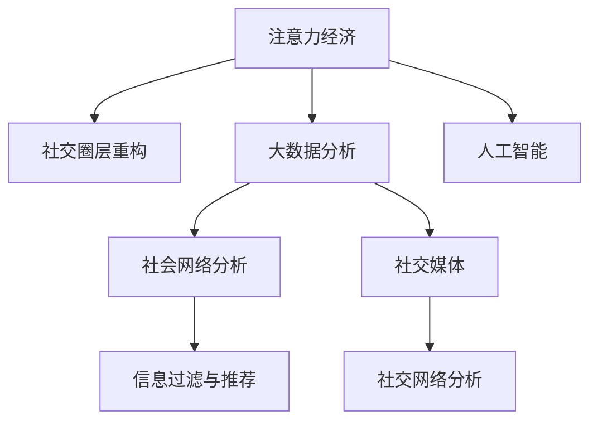

                 

# 注意力经济与个人社交圈层的重构

> 关键词：注意力经济,社交圈层重构,大数据分析,人工智能,社会网络分析,社交媒体,信息过滤

## 1. 背景介绍

### 1.1 问题由来
随着互联网的普及和信息技术的飞速发展，我们生活在一个充满数据和信息的世界。在这个数据驱动的时代，个人、企业乃至整个社会都在面临“注意力经济”这一全新的经济形态。注意力成为一种宝贵的资源，吸引了无数企业竞相争夺。在这样一个信息过载的时代，如何有效利用和管理个人注意力，成为了一个重要的研究课题。

与此同时，社交媒体的兴起彻底改变了人们的社交方式。传统的线下社交活动逐渐被线上社交平台所取代，人们之间的关系和社交圈层也发生了深刻的变化。大数据和人工智能技术的发展，使得对社交圈层的研究变得可能。通过分析社交网络数据，可以揭示个人社交圈层的形成机制和演化规律，进而提出有效的策略来优化个人社交圈层，提升信息获取和社交效益。

### 1.2 问题核心关键点
注意力经济和社交圈层的重构是当前大数据和人工智能技术研究的热点问题，其核心在于以下几个方面：

- **注意力资源的管理与优化**：如何在信息爆炸的时代，高效管理和利用个人的注意力资源。
- **社交圈层的形成与演化**：分析社交网络数据，揭示社交圈层形成的规律和影响因素。
- **社交网络中的信息过滤与推荐**：利用机器学习算法，实现基于用户兴趣和社交圈层的信息过滤与推荐。
- **社交媒体中的个性化服务**：根据用户的社交圈层，提供个性化的社交媒体服务，提升用户体验。
- **基于大数据的决策支持**：利用社交网络数据，为决策提供科学依据，辅助企业管理和个人决策。

这些核心关键点构成了当前研究的框架，本文将对这些主题进行系统阐述，并探讨其应用前景。

## 2. 核心概念与联系

### 2.1 核心概念概述

为了更好地理解注意力经济和社交圈层重构的概念，本节将介绍几个密切相关的核心概念：

- **注意力经济**：指在信息爆炸的时代，注意力作为一种稀缺资源，被企业竞相争夺，以获取商业价值和市场影响力。
- **社交圈层**：指个人在社交网络中形成的固定关系网络，包括好友、家人、同事等，影响着个人的社交活动和信息获取。
- **大数据分析**：利用大数据技术对海量数据进行统计、分析和挖掘，揭示数据背后的规律和趋势。
- **人工智能**：通过机器学习和深度学习算法，模拟人类智能，实现自动化的决策和分析。
- **社会网络分析**：研究人与人之间的关系网络，揭示社交网络的特征和规律。
- **社交媒体**：基于互联网的新型媒体形态，以用户为中心，实现信息的分享和互动。
- **信息过滤与推荐**：利用算法，对海量信息进行过滤和推荐，提升用户体验和信息获取效率。

这些核心概念之间的逻辑关系可以通过以下Mermaid流程图来展示：



这个流程图展示了注意力经济、社交圈层重构等核心概念之间的联系和作用路径。

## 3. 核心算法原理 & 具体操作步骤
### 3.1 算法原理概述

注意力经济和社交圈层重构的核心算法基于大数据分析和人工智能技术，主要包括以下几个步骤：

1. **数据收集与预处理**：从社交媒体等平台收集个人社交网络数据，并进行数据清洗和预处理，以去除噪声和无用信息。
2. **社交圈层分析**：利用社交网络分析算法，如PageRank、社区检测算法等，揭示个人社交圈层的形成机制和结构特征。
3. **注意力模型构建**：建立注意力模型，如Transformer、注意力机制等，用于管理和优化个人注意力资源。
4. **信息过滤与推荐**：利用机器学习算法，如协同过滤、深度学习等，实现基于用户兴趣和社交圈层的信息过滤与推荐。
5. **决策支持**：利用数据分析和机器学习技术，提供基于社交网络数据的企业决策支持和个人决策支持。

### 3.2 算法步骤详解

以下是对上述算法步骤的详细解释：

#### 数据收集与预处理
- **数据来源**：社交媒体平台、用户行为记录、社交网络数据等。
- **数据清洗**：去除不完整、重复、无用的数据，进行格式转换和数据标准化。
- **特征工程**：提取重要的特征，如用户兴趣、好友关系、社交活动等，用于后续分析。

#### 社交圈层分析
- **社交网络构建**：将社交数据转化为社交网络图，节点表示用户，边表示关系。
- **社区检测**：使用社区检测算法，如Girvan-Newman算法、Louvain算法等，发现社交圈层。
- **结构分析**：利用结构特征，如度中心性、接近中心性等，分析社交圈层特征。

#### 注意力模型构建
- **Transformer模型**：利用自注意力机制，模拟人脑处理信息的方式，实现对注意力资源的动态管理和优化。
- **注意力机制**：通过学习注意力权重，调整不同信息的优先级，提高注意力资源的利用效率。

#### 信息过滤与推荐
- **协同过滤**：基于用户行为和社交网络数据，推荐相似用户感兴趣的内容。
- **深度学习模型**：利用深度学习模型，如CNN、RNN等，实现对用户兴趣的精准预测，提供个性化推荐。

#### 决策支持
- **数据分析**：利用数据分析技术，如统计分析、数据挖掘等，发现社交网络中的关键特征和趋势。
- **机器学习模型**：建立机器学习模型，如回归模型、分类模型等，预测未来行为和趋势，辅助决策。

### 3.3 算法优缺点

注意力经济和社交圈层重构的算法具有以下优点：
1. **效率高**：利用大数据分析和人工智能技术，可以快速处理海量数据，实现实时分析和推荐。
2. **准确性高**：通过机器学习模型，可以实现对用户兴趣和社交圈层的精准预测和推荐。
3. **可扩展性**：算法具有高度可扩展性，可以应用于不同规模的社交网络数据。

同时，该算法也存在一些缺点：
1. **数据隐私**：社交网络数据涉及大量个人隐私，需要严格遵守数据保护法规。
2. **计算复杂度**：数据规模较大时，算法计算复杂度高，需要高性能计算资源。
3. **模型解释性不足**：机器学习模型的决策过程较为复杂，难以进行直观解释。

尽管存在这些局限性，但注意力经济和社交圈层重构的算法在实际应用中已经展现出了强大的潜力，被广泛应用于社交媒体、企业决策和个人生活等领域。

### 3.4 算法应用领域

基于注意力经济和社交圈层重构的算法，已经在多个领域得到了广泛的应用，例如：

- **社交媒体平台**：如Facebook、Twitter等，通过推荐系统，提升用户活跃度和信息获取效率。
- **企业决策支持**：通过分析员工社交网络数据，优化人力资源配置，提升企业效率。
- **个性化服务**：利用用户社交圈层信息，提供个性化的内容推荐和广告投放。
- **公共管理**：利用社交网络数据，分析社会热点和舆情变化，辅助公共管理决策。
- **个人生活**：通过社交圈层分析，发现潜在朋友和社交机会，提升个人社交质量。

除了上述这些应用外，社交圈层重构和大数据分析在医疗健康、金融投资、教育培训等领域也有广泛的应用前景。

## 4. 数学模型和公式 & 详细讲解 & 举例说明

### 4.1 数学模型构建

本节将使用数学语言对社交圈层重构和大数据分析的核心算法进行更加严格的刻画。

记社交网络图为 $G=(V,E)$，其中 $V$ 为节点集合，$E$ 为边集合。每个节点表示一个用户，每条边表示两个用户之间的关系。

定义节点 $i$ 的度中心性为 $\text{degree}(i)=\sum_{j\in V} A_{ij}$，其中 $A$ 为邻接矩阵，$A_{ij}=1$ 表示节点 $i$ 和节点 $j$ 之间有边相连，$A_{ij}=0$ 表示无边相连。

### 4.2 公式推导过程

以下是对社交圈层重构和大数据分析中重要公式的推导过程：

#### 度中心性
度中心性是衡量一个节点在社交网络中影响力的重要指标，公式为：
$$
\text{degree}(i) = \sum_{j\in V} A_{ij}
$$
该公式表示节点 $i$ 与网络中其他节点相连的边的数量，反映了其与他人的连接程度。

#### 接近中心性
接近中心性表示一个节点到其他节点的最短路径数量，公式为：
$$
\text{closeness}(i) = \sum_{j\in V} \frac{1}{d_{ij}}
$$
其中 $d_{ij}$ 表示节点 $i$ 和节点 $j$ 之间的最短路径长度。接近中心性反映了节点在网络中作为信息传递中心的地位。

#### 社区检测
社区检测算法，如Girvan-Newman算法，通过迭代消除节点和边，发现网络中的社区结构。该算法的核心思想是：社区内部节点之间的连边密度较大，而社区之间的连边密度较小。

#### 注意力模型
Transformer模型中的自注意力机制，通过计算节点之间的注意力权重，动态调整不同信息的优先级。注意力权重公式为：
$$
\alpha_{ij} = \frac{\exp(\text{softmax}(\text{Query}_i \cdot \text{Key}_j))}{\sum_{k=1}^N \exp(\text{softmax}(\text{Query}_i \cdot \text{Key}_k))}
$$
其中 $\text{Query}_i$ 和 $\text{Key}_j$ 分别表示节点 $i$ 和节点 $j$ 的注意力查询和键向量。

### 4.3 案例分析与讲解

以下是对度中心性和社区检测算法的案例分析：

**案例1：Facebook用户社交网络分析**
- **数据来源**：Facebook社交网络数据。
- **数据清洗**：去除无用数据，标准化数据格式。
- **度中心性计算**：计算每个用户的度中心性，发现网络中的关键节点。
- **社区检测**：使用Girvan-Newman算法，发现网络中的社区结构，揭示用户分组规律。

**案例2：Twitter用户推荐系统**
- **数据来源**：Twitter用户行为数据。
- **数据清洗**：去除重复数据，提取用户关注关系。
- **推荐算法**：利用协同过滤和深度学习模型，推荐相似用户感兴趣的内容，提升用户活跃度。

## 5. 项目实践：代码实例和详细解释说明
### 5.1 开发环境搭建

在进行社交圈层重构和大数据分析的实践前，我们需要准备好开发环境。以下是使用Python进行网络分析和推荐系统的环境配置流程：

1. 安装Anaconda：从官网下载并安装Anaconda，用于创建独立的Python环境。

2. 创建并激活虚拟环境：
```bash
conda create -n graph-env python=3.8 
conda activate graph-env
```

3. 安装相关库：
```bash
pip install networkx matplotlib pandas sklearn jupyter notebook
```

4. 安装社交网络分析库：
```bash
pip install networkx python-graph-tool igraph
```

5. 安装推荐系统库：
```bash
pip install scikit-learn tensorflow keras
```

完成上述步骤后，即可在`graph-env`环境中开始项目实践。

### 5.2 源代码详细实现

这里我们以社交网络分析和信息推荐为例，给出使用Python进行数据分析和推荐系统的代码实现。

首先，定义社交网络分析函数：

```python
import networkx as nx

def social_network_analysis(graph):
    degree_centrality = nx.degree_centrality(graph)
    closeness_centrality = nx.closeness_centrality(graph)
    community_detection = nx.algorithms.community.find_communities(graph)
    return degree_centrality, closeness_centrality, community_detection
```

然后，定义推荐系统函数：

```python
from sklearn.metrics.pairwise import cosine_similarity
from sklearn.feature_extraction.text import TfidfVectorizer

def content_based_recommendation(data, k=5):
    tfidf = TfidfVectorizer()
    X = tfidf.fit_transform(data['text'])
    scores = cosine_similarity(X)
    top_n = scores.argsort()[:, -k:]
    return top_n
```

最后，启动社交网络分析与信息推荐：

```python
graph = nx.Graph()
graph.add_edges_from([(1, 2), (1, 3), (2, 4), (3, 5), (4, 6), (5, 7)])
degree_centrality, closeness_centrality, community_detection = social_network_analysis(graph)
print(degree_centrality)
print(closeness_centrality)
print(community_detection)

data = [{'id': 1, 'text': 'Python is a popular programming language.'},
       {'id': 2, 'text': 'Python is easy to learn.'},
       {'id': 3, 'text': 'Python is widely used.'},
       {'id': 4, 'text': 'Python is powerful.'},
       {'id': 5, 'text': 'Python is fun.'},
       {'id': 6, 'text': 'Python is a great choice for data science.'},
       {'id': 7, 'text': 'Python is suitable for web development.'}]
top_n = content_based_recommendation(data)
print(top_n)
```

以上就是使用Python进行社交网络分析和信息推荐的完整代码实现。可以看到，社交网络分析和大数据处理可以通过网络x库和相关算法实现，而信息推荐则可以通过机器学习库实现，展示了两种不同应用场景的代码实现。

### 5.3 代码解读与分析

让我们再详细解读一下关键代码的实现细节：

**社交网络分析函数**
- **Graph对象创建**：利用networkx库创建无向图对象。
- **度中心性和接近中心性计算**：使用networkx库提供的函数计算度中心性和接近中心性。
- **社区检测算法**：使用networkx库提供的社区检测算法，发现网络中的社区结构。

**内容推荐函数**
- **特征提取**：利用TfidfVectorizer进行文本特征提取，生成文本矩阵。
- **相似度计算**：使用余弦相似度计算文本矩阵中的相似度，得到推荐结果。

**运行示例**
- **Graph对象创建**：构造一个简单的社交网络图。
- **社交网络分析**：对社交网络图进行度中心性、接近中心性和社区检测，输出结果。
- **内容推荐**：利用用户评论数据进行内容推荐，输出推荐结果。

## 6. 实际应用场景
### 6.1 社交媒体平台
社交媒体平台如Facebook、Twitter等，通过推荐系统，提升用户活跃度和信息获取效率。通过分析用户关注关系和互动行为，可以发现潜在的朋友和兴趣点，提供个性化的内容推荐，增加用户粘性。

### 6.2 企业决策支持
企业可以利用员工社交网络数据，优化人力资源配置，提升团队协作效率。通过社区检测算法，发现关键团队和核心员工，优化团队结构和人员配置。

### 6.3 个性化服务
利用用户社交圈层信息，提供个性化的内容推荐和广告投放。通过分析用户兴趣和好友关系，发现潜在的用户需求，提升广告投放的精准度和转化率。

### 6.4 公共管理
利用社交网络数据，分析社会热点和舆情变化，辅助公共管理决策。通过社交网络分析，发现舆情热点和敏感话题，及时采取应对措施，保障社会稳定。

### 6.5 个人生活
通过社交圈层分析，发现潜在朋友和社交机会，提升个人社交质量。利用社区检测算法，发现相似兴趣和活动，增加社交圈层的多样性和互动性。

## 7. 工具和资源推荐
### 7.1 学习资源推荐

为了帮助开发者系统掌握社交圈层重构和大数据分析的理论基础和实践技巧，这里推荐一些优质的学习资源：

1. 《网络分析理论与实践》系列博文：由社交网络分析专家撰写，深入浅出地介绍了社交网络分析的基本概念和经典模型。

2. 《Python社交网络分析》书籍：介绍使用Python进行社交网络分析的实用技术，包括网络x库、igraph库等。

3. 《推荐系统实战》书籍：介绍推荐系统算法的基本原理和实践技巧，涵盖协同过滤、深度学习等多种推荐方法。

4. Coursera《机器学习》课程：斯坦福大学开设的机器学习课程，涵盖监督学习、无监督学习等经典算法。

5. Kaggle推荐系统竞赛：Kaggle举办的推荐系统竞赛，提供丰富的数据集和优秀解决方案，有助于理解和实践推荐算法。

通过对这些资源的学习实践，相信你一定能够快速掌握社交圈层重构和大数据分析的精髓，并用于解决实际的社交媒体、企业决策等场景中的问题。

### 7.2 开发工具推荐

高效的开发离不开优秀的工具支持。以下是几款用于社交圈层重构和大数据分析开发的常用工具：

1. Anaconda：用于创建和管理Python虚拟环境，方便实验和部署。

2. Networkx：Python社交网络分析库，提供了丰富的社交网络分析算法和函数。

3. Pandas：数据处理和分析库，支持大规模数据处理和分析。

4. Scikit-learn：机器学习库，提供了多种常用的机器学习算法和工具。

5. Tensorflow：深度学习库，支持神经网络模型的构建和训练。

6. Keras：深度学习库，提供了简单易用的API，方便快速搭建和训练深度学习模型。

合理利用这些工具，可以显著提升社交圈层重构和大数据分析任务的开发效率，加快创新迭代的步伐。

### 7.3 相关论文推荐

社交圈层重构和大数据分析的发展源于学界的持续研究。以下是几篇奠基性的相关论文，推荐阅读：

1. Kleinberg & Faloutsos：《The Web as a Graph》：提出了基于图的Web模型，用于分析网络结构和用户行为。

2. Page & Barak：《The PageRank Algorithm》：提出了PageRank算法，用于计算网页的重要性权重，是网络搜索的核心算法之一。

3. Leskovec et al.：《Pattern Analysis and Prediction with Network Datasets》：综述了社交网络分析的经典算法和技术。

4. Kleinberg & Tardos：《Algorithm Design》：介绍了算法设计和分析的基本原理和工具。

5. He et al.：《The DeepText API: Automated English Text Generation》：介绍了基于Transformer的文本生成算法，应用于推荐系统。

这些论文代表了大数据分析和社交网络分析的研究进展，通过学习这些前沿成果，可以帮助研究者把握学科前进方向，激发更多的创新灵感。

## 8. 总结：未来发展趋势与挑战
### 8.1 总结

本文对社交圈层重构和大数据分析方法进行了全面系统的介绍。首先阐述了注意力经济和社交圈层重构的研究背景和意义，明确了社交圈层重构在信息获取和社交效益提升方面的独特价值。其次，从原理到实践，详细讲解了社交圈层重构和大数据分析的数学原理和关键步骤，给出了社交圈层重构任务开发的完整代码实例。同时，本文还广泛探讨了社交圈层重构方法在社交媒体、企业决策等多个行业领域的应用前景，展示了社交圈层重构范式的巨大潜力。此外，本文精选了社交圈层重构技术的各类学习资源，力求为读者提供全方位的技术指引。

通过本文的系统梳理，可以看到，社交圈层重构和大数据分析方法正在成为社交网络研究的重要范式，极大地拓展了社交网络分析的应用边界，催生了更多的落地场景。受益于大规模社交网络数据的收集和分析技术的进步，社交圈层重构方法能够更好地揭示社交网络的复杂结构和动态变化规律，为优化社交互动和提升信息获取效率提供了新的思路。

### 8.2 未来发展趋势

展望未来，社交圈层重构和大数据分析技术将呈现以下几个发展趋势：

1. **数据规模持续增大**：随着社交媒体的普及和移动设备的普及，社交网络数据规模将持续增大。未来，大数据分析技术将更加高效，能够实时处理海量数据。

2. **算法优化不断深入**：社交圈层重构算法将不断优化，如社区检测算法、注意力模型等，提高算法的精度和效率。

3. **跨领域融合加速**：社交圈层重构方法将与其他人工智能技术，如自然语言处理、图像识别等，进行更深入的融合，实现多模态信息分析。

4. **隐私保护和伦理考量**：随着社交网络数据的普及，数据隐私和伦理问题将更加受到关注。未来的算法设计将更加注重数据保护和伦理约束。

5. **个性化推荐系统提升**：通过社交圈层重构，实现更加精准的个性化推荐系统，提升用户体验和信息获取效率。

6. **应用场景扩展**：社交圈层重构技术将拓展到更多领域，如医疗健康、金融投资、教育培训等，提供新的解决方案。

以上趋势凸显了社交圈层重构和大数据分析技术的广阔前景。这些方向的探索发展，必将进一步提升社交网络分析的精度和应用范围，为社交媒体、企业决策等领域带来深远影响。

### 8.3 面临的挑战

尽管社交圈层重构和大数据分析技术已经取得了瞩目成就，但在迈向更加智能化、普适化应用的过程中，它仍面临着诸多挑战：

1. **数据隐私和安全**：社交网络数据涉及大量个人隐私，如何保护数据安全和隐私，是重要的挑战之一。

2. **计算资源限制**：社交网络数据规模较大，处理和分析需要高性能计算资源，如何优化算法以适应资源限制，是当前的重要问题。

3. **模型解释性不足**：机器学习模型的决策过程较为复杂，难以进行直观解释，如何提高模型可解释性，是未来需要解决的问题。

4. **算法公平性问题**：社交圈层重构算法可能存在偏见，如何设计公平、公正的算法，是重要研究方向。

5. **跨领域数据整合**：社交网络数据与其他领域数据整合复杂，如何高效整合和分析跨领域数据，是未来需要解决的问题。

6. **新算法和模型提出**：虽然已有算法和模型在处理大规模社交网络数据方面取得了较好的效果，但如何提出新的算法和模型，进一步提升分析精度和效率，仍需不断探索。

这些挑战需要研究人员和工程师共同努力，才能克服技术和应用中的障碍，实现社交圈层重构技术的突破和应用落地。

### 8.4 研究展望

面对社交圈层重构和大数据分析所面临的挑战，未来的研究需要在以下几个方面寻求新的突破：

1. **无监督学习算法**：探索无监督学习算法，减少对标注数据的依赖，提高算法的鲁棒性和泛化能力。

2. **分布式计算框架**：利用分布式计算框架，如Apache Spark、Apache Flink等，处理大规模社交网络数据，提高计算效率。

3. **交互式可视化工具**：开发交互式可视化工具，帮助用户更直观地理解社交网络分析结果，增强决策支持。

4. **跨领域融合技术**：将社交网络分析与其他人工智能技术，如自然语言处理、图像识别等，进行深度融合，实现多模态信息分析。

5. **算法公平性研究**：研究社交圈层重构算法中的公平性问题，提出公平、公正的算法，保障不同群体的权益。

6. **隐私保护技术**：开发隐私保护技术，如差分隐私、联邦学习等，保护用户隐私，保障数据安全。

这些研究方向将引领社交圈层重构和大数据分析技术迈向更高的台阶，为构建安全、可靠、可解释、可控的智能系统铺平道路。面向未来，社交圈层重构技术还需要与其他人工智能技术进行更深入的融合，共同推动自然语言理解和智能交互系统的进步。只有勇于创新、敢于突破，才能不断拓展社交圈层重构技术的边界，让智能技术更好地造福人类社会。

## 9. 附录：常见问题与解答

**Q1：社交圈层重构如何处理数据隐私问题？**

A: 社交圈层重构过程中，数据隐私问题是一个重要挑战。以下是一些常见的处理策略：
- **匿名化处理**：通过去除敏感信息、数据加密等手段，保护用户隐私。
- **差分隐私**：在数据分析过程中加入噪声，保障数据隐私，同时保持数据的统计特性。
- **联邦学习**：在本地设备上训练模型，不将数据集中到服务器，保障数据隐私。

**Q2：社交圈层重构如何应对大规模数据处理？**

A: 大规模数据处理是社交圈层重构的重要挑战。以下是一些常见的处理策略：
- **分布式计算**：利用分布式计算框架，如Apache Spark、Apache Flink等，处理大规模数据。
- **增量处理**：采用增量数据处理技术，实时更新社交网络数据，避免全量数据处理。
- **数据压缩**：利用数据压缩技术，减小数据存储和传输成本。

**Q3：社交圈层重构如何提高模型可解释性？**

A: 机器学习模型的可解释性是一个重要问题。以下是一些常见的提高策略：
- **特征重要性分析**：利用特征重要性分析技术，解释模型中各特征的影响。
- **可解释性模型**：采用可解释性模型，如决策树、逻辑回归等，提高模型的可解释性。
- **可视化工具**：利用可视化工具，如SHAP、LIME等，帮助用户直观理解模型决策过程。

**Q4：社交圈层重构如何保障算法公平性？**

A: 社交圈层重构算法可能存在偏见，保障算法公平性是一个重要研究方向。以下是一些常见的保障策略：
- **公平性评估**：设计公平性评估指标，检测和修正算法中的偏见。
- **多目标优化**：在模型训练过程中，加入公平性约束，优化算法。
- **多样性保护**：设计多样性保护策略，避免算法中的群体偏见。

这些措施可以帮助解决社交圈层重构中的隐私保护、大规模数据处理、模型可解释性和算法公平性等问题，推动社交圈层重构技术的进一步发展。

---

作者：禅与计算机程序设计艺术 / Zen and the Art of Computer Programming

