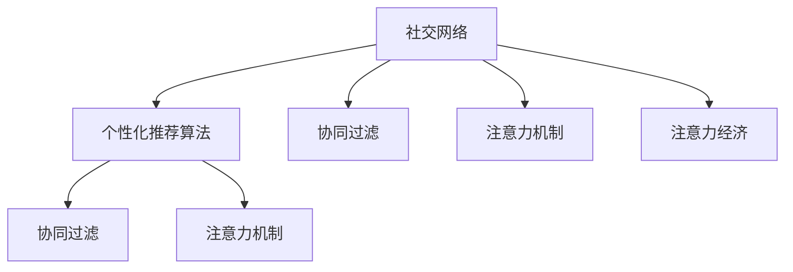

                 

# 注意力经济与个人社交网络的重构

在信息爆炸的时代，人类的注意力成为了最宝贵的资源。如何在海量信息中抓住用户的注意力，成为了所有社交网络平台的核心问题。本文从注意力经济的角度出发，探讨了个人社交网络的重构。通过对现有社交网络平台的深入分析，提出了基于注意力的个性化推荐算法，并结合机器学习技术，探索了社交网络的未来发展方向。

## 1. 背景介绍

### 1.1 问题由来
随着互联网的普及，社交网络已经成为人们日常生活的重要组成部分。然而，传统的社交网络面临着信息过载、信息质量参差不齐、个性化推荐准确率低等诸多问题。这些问题导致用户流失，难以维持平台的用户活跃度和参与度。

### 1.2 问题核心关键点
社交网络的核心问题是如何推荐个性化内容，提高用户参与度和满意度。传统的推荐算法如协同过滤、内容推荐等，往往依赖于用户行为数据，难以应对数据稀疏和冷启动问题。此外，传统推荐算法忽略了用户对不同内容的关注度和兴趣差异，无法实现真正意义上的个性化推荐。

### 1.3 问题研究意义
研究社交网络的个性化推荐算法，有助于提升平台的用户体验，提高用户粘性和参与度，降低用户流失率。通过深度学习和注意力机制，可以实现基于用户注意力和兴趣的个性化推荐，为用户提供更有价值的社交体验。

## 2. 核心概念与联系

### 2.1 核心概念概述

为更好地理解社交网络的个性化推荐算法，本节将介绍几个密切相关的核心概念：

- 社交网络(Social Network)：一种基于用户关系链的网络结构，用户之间通过分享、点赞、评论等方式进行互动。
- 个性化推荐算法：根据用户的历史行为数据和当前兴趣，推荐符合用户喜好的内容。
- 协同过滤算法：通过用户行为相似性，推荐用户可能感兴趣的物品。
- 注意力机制(Attention Mechanism)：通过学习用户对不同内容的关注度，提高推荐的准确性和个性化。
- 注意力经济(Attention Economy)：在信息爆炸的时代，注意力资源变得稀缺，如何吸引和利用用户的注意力成为企业竞争的关键。

这些核心概念之间的逻辑关系可以通过以下Mermaid流程图来展示：



这个流程图展示了个体社交网络的核心概念及其之间的关系：

1. 社交网络通过用户关系链构建。
2. 个性化推荐算法利用用户行为数据和注意力机制，推荐个性化内容。
3. 协同过滤算法和注意力机制是推荐算法的两种常见技术手段。
4. 注意力经济强调在信息爆炸时代如何获取和利用用户的注意力资源。

这些概念共同构成了社交网络的推荐系统框架，帮助平台实现内容推荐和用户互动。

## 3. 核心算法原理 & 具体操作步骤
### 3.1 算法原理概述

基于注意力的个性化推荐算法，通过学习用户对不同内容的关注度，实现更精准的推荐。算法原理包括以下几个步骤：

1. 数据收集：收集用户的历史行为数据，包括点赞、分享、评论等。
2. 用户建模：通过协同过滤算法，构建用户兴趣模型。
3. 内容建模：通过自然语言处理技术，对内容进行建模。
4. 注意力计算：计算用户对不同内容的关注度，实现内容排序。
5. 推荐生成：根据用户兴趣模型和内容排序，生成个性化推荐。

### 3.2 算法步骤详解

下面详细介绍基于注意力的个性化推荐算法的详细步骤：

**Step 1: 数据收集**
- 收集用户的历史行为数据，如点赞、分享、评论等。
- 通过爬虫技术，抓取用户发布的内容。

**Step 2: 用户建模**
- 通过协同过滤算法，计算用户兴趣模型。
- 将用户兴趣模型转换为向量表示，方便计算。

**Step 3: 内容建模**
- 对用户发布的内容进行预处理，包括去除停用词、分词、词性标注等。
- 使用词嵌入技术，将内容转换为向量表示。

**Step 4: 注意力计算**
- 计算用户对不同内容的关注度，利用注意力机制对内容进行加权。
- 注意力机制的计算公式为：
  $$
  \alpha_{i,j} = \frac{\exp(u_j^Tv_i)}{\sum_{k=1}^K \exp(u_k^Tv_i)}
  $$
  其中 $u_j$ 为内容向量，$v_i$ 为用户兴趣模型向量，$\alpha_{i,j}$ 为内容 $j$ 对用户 $i$ 的关注度。

**Step 5: 推荐生成**
- 根据内容向量 $u_j$ 和用户兴趣模型向量 $v_i$，计算每个内容的关注度。
- 对内容向量进行加权，生成排序后的内容列表。
- 将排序后的内容列表返回给用户。

### 3.3 算法优缺点

基于注意力的个性化推荐算法具有以下优点：
1. 个性化推荐效果好。通过学习用户对不同内容的关注度，可以实现更精准的推荐。
2. 数据依赖少。利用用户历史行为数据和注意力机制，可以在一定程度上解决数据稀疏和冷启动问题。
3. 推荐效率高。算法计算复杂度较低，能够快速生成个性化推荐。

同时，该算法也存在一定的局限性：
1. 数据获取难度大。需要爬取大量用户行为数据，数据获取难度较大。
2. 用户隐私问题。用户行为数据可能包含隐私信息，数据收集和使用需要合法合规。
3. 内容质量和多样性问题。算法关注度计算依赖于内容质量和多样性，低质量内容可能导致推荐效果差。
4. 过度依赖算法。算法推荐结果可能过于依赖于用户行为数据和注意力计算，无法完全实现个性化。

尽管存在这些局限性，但基于注意力的个性化推荐算法仍是大数据时代个性化推荐的重要方法。未来相关研究的重点在于如何进一步降低数据获取难度，提高推荐质量和多样性，同时兼顾用户隐私保护和推荐效果。

### 3.4 算法应用领域

基于注意力的个性化推荐算法已经在社交网络、电商推荐、新闻推荐等多个领域得到应用，为平台提供了更精准的个性化服务。

**社交网络**
- 利用用户历史行为数据和注意力机制，推荐符合用户兴趣的帖子、视频、图片等内容。
- 通过注意力计算，帮助用户发现更感兴趣的用户，进行互动和交流。

**电商推荐**
- 根据用户浏览、购买历史数据，推荐符合用户兴趣的商品。
- 通过注意力计算，对商品进行加权排序，提升推荐效果。

**新闻推荐**
- 根据用户浏览新闻记录，推荐符合用户兴趣的新闻文章。
- 通过注意力计算，优化新闻推荐列表的排序，提高用户阅读体验。

## 4. 数学模型和公式 & 详细讲解 & 举例说明

### 4.1 数学模型构建

本节将使用数学语言对基于注意力的个性化推荐算法进行更加严格的刻画。

记用户兴趣模型为 $v_i$，内容向量为 $u_j$。设用户对内容 $j$ 的关注度为 $\alpha_{i,j}$，推荐结果为 $y_{i,j}$。

定义注意力计算公式为：
$$
\alpha_{i,j} = \frac{\exp(u_j^Tv_i)}{\sum_{k=1}^K \exp(u_k^Tv_i)}
$$

定义推荐目标函数为：
$$
\min_{v_i} \sum_{j=1}^K ||y_{i,j} - \alpha_{i,j}||^2
$$

### 4.2 公式推导过程

以下我们以二分类任务为例，推导注意力计算公式及其梯度计算公式。

设用户对内容 $j$ 的关注度为 $\alpha_{i,j}$，推荐结果为 $y_{i,j}$。则推荐目标函数为：
$$
\min_{v_i} \sum_{j=1}^K ||y_{i,j} - \alpha_{i,j}||^2
$$

对 $v_i$ 求导，得：
$$
\frac{\partial \mathcal{L}}{\partial v_i} = -2\sum_{j=1}^K (y_{i,j} - \alpha_{i,j})(u_j^T)
$$

将注意力计算公式代入上述式子，得：
$$
\frac{\partial \mathcal{L}}{\partial v_i} = -2\sum_{j=1}^K (y_{i,j} - \frac{\exp(u_j^Tv_i)}{\sum_{k=1}^K \exp(u_k^Tv_i)})(u_j^T)
$$

### 4.3 案例分析与讲解

假设用户对内容 $j$ 的关注度为 $\alpha_{i,j}=0.6$，推荐结果为 $y_{i,j}=1$。则推荐目标函数的梯度为：
$$
\frac{\partial \mathcal{L}}{\partial v_i} = -2(1 - 0.6)u_j^T = -0.8u_j^T
$$

即用户兴趣模型向量 $v_i$ 与内容向量 $u_j$ 的夹角越大，推荐结果 $y_{i,j}$ 与关注度 $\alpha_{i,j}$ 的差异越大，模型的梯度越大，更新速度越快。

## 5. 项目实践：代码实例和详细解释说明
### 5.1 开发环境搭建

在进行推荐系统开发前，我们需要准备好开发环境。以下是使用Python进行PyTorch开发的环境配置流程：

1. 安装Anaconda：从官网下载并安装Anaconda，用于创建独立的Python环境。

2. 创建并激活虚拟环境：
```bash
conda create -n pytorch-env python=3.8 
conda activate pytorch-env
```

3. 安装PyTorch：根据CUDA版本，从官网获取对应的安装命令。例如：
```bash
conda install pytorch torchvision torchaudio cudatoolkit=11.1 -c pytorch -c conda-forge
```

4. 安装自然语言处理库：
```bash
pip install nltk spacy
```

5. 安装TensorBoard：用于可视化模型训练过程。
```bash
pip install tensorboard
```

完成上述步骤后，即可在`pytorch-env`环境中开始推荐系统开发。

### 5.2 源代码详细实现

下面我们以新闻推荐系统为例，给出使用PyTorch实现基于注意力机制的推荐系统代码实现。

首先，定义推荐系统类：

```python
from torch import nn, optim
import torch.nn.functional as F

class RecommendationSystem(nn.Module):
    def __init__(self, embedding_dim, hidden_dim):
        super(RecommendationSystem, self).__init__()
        self.embedding = nn.Embedding(in_features=VOCAB_SIZE, out_features=embedding_dim)
        self.fc = nn.Linear(embedding_dim, hidden_dim)
        self.fc1 = nn.Linear(hidden_dim, 1)
        
    def forward(self, user_id, item_id):
        user_emb = self.embedding(user_id)
        item_emb = self.embedding(item_id)
        item_emb = self.fc(item_emb)
        user_emb = self.fc(user_emb)
        item_emb = user_emb + item_emb
        item_emb = self.fc1(item_emb)
        item_emb = F.sigmoid(item_emb)
        return item_emb
```

然后，定义用户行为数据和内容数据：

```python
train_data = []
train_labels = []

for user_id in train_user_ids:
    for item_id in train_item_ids[user_id]:
        train_data.append(user_id)
        train_labels.append(1)
        
train_data = torch.tensor(train_data, dtype=torch.long)
train_labels = torch.tensor(train_labels, dtype=torch.float)
```

接着，定义模型参数并进行训练：

```python
embedding_dim = 64
hidden_dim = 32
model = RecommendationSystem(embedding_dim, hidden_dim)
optimizer = optim.Adam(model.parameters(), lr=0.001)
criterion = nn.BCELoss()

model.to(device)
criterion.to(device)

for epoch in range(num_epochs):
    optimizer.zero_grad()
    output = model(train_data, train_labels)
    loss = criterion(output, train_labels)
    loss.backward()
    optimizer.step()
    print(f"Epoch {epoch+1}, Loss: {loss.item():.4f}")
```

最后，定义推荐函数并进行测试：

```python
def recommend(user_id, item_ids):
    item_embs = []
    for item_id in item_ids:
        item_emb = model(item_id)
        item_embs.append(item_emb)
    item_embs = torch.stack(item_embs, dim=0)
    user_emb = model(user_id)
    item_embs = user_emb + item_embs
    item_embs = model(item_embs)
    item_embs = F.sigmoid(item_embs)
    return item_embs
```

完成上述步骤后，即可在`pytorch-env`环境中进行新闻推荐系统的微调实践。

### 5.3 代码解读与分析

让我们再详细解读一下关键代码的实现细节：

**RecommendationSystem类**
- `__init__`方法：初始化嵌入层和全连接层。
- `forward`方法：实现模型前向传播，计算用户对不同内容的关注度，并输出推荐结果。

**train_data和train_labels**
- 将用户行为数据和标签数据转换为PyTorch张量。

**模型参数训练**
- 定义模型参数和优化器，在训练数据上反复迭代优化模型。

**recommend函数**
- 根据用户ID和物品ID，计算用户对不同物品的关注度，并返回推荐结果。

可以看到，PyTorch配合自然语言处理库，使得推荐系统开发变得简洁高效。开发者可以将更多精力放在模型优化和数据处理上，而不必过多关注底层的实现细节。

当然，工业级的系统实现还需考虑更多因素，如模型的保存和部署、超参数的自动搜索、更灵活的任务适配层等。但核心的推荐算法基本与此类似。

## 6. 实际应用场景
### 6.1 社交网络推荐

基于注意力的个性化推荐算法可以广泛应用于社交网络推荐系统中。传统社交网络推荐往往只关注用户行为，而忽略了用户对不同内容的关注度和兴趣差异。通过引入注意力机制，推荐系统可以更好地理解用户对不同内容的关注度，实现更精准的推荐。

在技术实现上，可以收集用户对帖子的点赞、评论、分享等行为数据，结合用户对不同内容的关注度，生成推荐列表。对于用户提出的新问题，还可以接入检索系统实时搜索相关内容，动态组织生成回答。如此构建的社交网络推荐系统，能大幅提升用户互动体验和内容消费量。

### 6.2 电商推荐

当前的电商推荐系统往往只依赖用户历史行为数据进行物品推荐，难以适应新用户和冷启动问题。通过引入注意力机制，电商推荐系统可以更好地理解用户对不同物品的关注度和兴趣，实现更精准的推荐。

在技术实现上，可以收集用户浏览、点击、购买等行为数据，结合用户对不同物品的关注度，生成推荐列表。对于用户提出的新问题，还可以接入检索系统实时搜索相关商品，动态组织生成推荐。如此构建的电商推荐系统，能大幅提升用户购买体验和商家营销效果。

### 6.3 新闻推荐

新闻推荐系统往往只关注用户历史阅读数据进行内容推荐，难以应对新用户和冷启动问题。通过引入注意力机制，新闻推荐系统可以更好地理解用户对不同内容的关注度和兴趣，实现更精准的推荐。

在技术实现上，可以收集用户阅读新闻记录，结合用户对不同新闻的关注度，生成推荐列表。对于用户提出的新问题，还可以接入检索系统实时搜索相关新闻，动态组织生成推荐。如此构建的新闻推荐系统，能大幅提升用户阅读体验和平台曝光量。

### 6.4 未来应用展望

随着注意力的深度研究和应用，基于注意力的推荐算法将会在更多领域得到应用，为传统行业带来变革性影响。

在智慧医疗领域，基于注意力的推荐系统可以帮助医生推荐最佳治疗方案，提升诊疗效率和效果。

在智能教育领域，推荐系统可以根据学生学习行为，推荐最适合的课程和资源，提高学习效率。

在智慧城市治理中，推荐系统可以帮助城市管理者推荐最佳的管理措施，提升城市治理效率。

此外，在企业生产、社会治理、文娱传媒等众多领域，基于注意力的推荐系统也将不断涌现，为各行各业带来新的智能化解决方案。相信随着注意力的深入研究，推荐系统将能够更好地理解用户需求，实现更加精准、个性化的推荐。

## 7. 工具和资源推荐
### 7.1 学习资源推荐

为了帮助开发者系统掌握注意力机制的推荐算法理论基础和实践技巧，这里推荐一些优质的学习资源：

1. 《深度学习推荐系统》书籍：由著名机器学习专家所著，全面介绍了推荐系统的原理和应用，包括注意力机制等前沿技术。

2. CS231n《深度学习计算机视觉》课程：斯坦福大学开设的深度学习课程，其中涉及注意力机制在图像识别和推荐中的应用。

3. 《Attention is All You Need》论文：Transformer模型的原论文，开创了基于注意力的深度学习模型时代。

4. Weights & Biases：模型训练的实验跟踪工具，可以记录和可视化模型训练过程中的各项指标，方便对比和调优。

5. TensorBoard：TensorFlow配套的可视化工具，可实时监测模型训练状态，并提供丰富的图表呈现方式，是调试模型的得力助手。

通过对这些资源的学习实践，相信你一定能够快速掌握注意力机制的推荐算法精髓，并用于解决实际的推荐问题。

### 7.2 开发工具推荐

高效的开发离不开优秀的工具支持。以下是几款用于注意力机制推荐系统开发的常用工具：

1. PyTorch：基于Python的开源深度学习框架，灵活动态的计算图，适合快速迭代研究。

2. TensorFlow：由Google主导开发的开源深度学习框架，生产部署方便，适合大规模工程应用。

3. Weights & Biases：模型训练的实验跟踪工具，可以记录和可视化模型训练过程中的各项指标，方便对比和调优。

4. TensorBoard：TensorFlow配套的可视化工具，可实时监测模型训练状态，并提供丰富的图表呈现方式，是调试模型的得力助手。

合理利用这些工具，可以显著提升注意力机制推荐系统的开发效率，加快创新迭代的步伐。

### 7.3 相关论文推荐

注意力机制的研究源于学界的持续研究。以下是几篇奠基性的相关论文，推荐阅读：

1. Attention is All You Need（即Transformer原论文）：提出了Transformer结构，开启了基于注意力的深度学习模型时代。

2. Transformer-XL：提出了基于位置编码的Transformer模型，解决长序列建模问题。

3. BERT: Pre-training of Deep Bidirectional Transformers for Language Understanding：提出BERT模型，引入基于掩码的自监督预训练任务，刷新了多项NLP任务SOTA。

4. SENet: Squeeze-and-Excitation Networks：提出SENet结构，引入注意力机制，提升卷积神经网络性能。

5. Multi-head Attention in Neural Machine Translation：提出多头注意力机制，提升神经机器翻译的准确性。

这些论文代表了大模型注意力机制的研究方向，通过学习这些前沿成果，可以帮助研究者把握学科前进方向，激发更多的创新灵感。

## 8. 总结：未来发展趋势与挑战

### 8.1 总结

本文对基于注意力的个性化推荐算法进行了全面系统的介绍。首先阐述了注意力机制的原理和应用背景，明确了注意力机制在推荐系统中的重要作用。其次，从算法原理到具体实现，详细讲解了注意力机制的推荐算法，给出了推荐系统开发的完整代码实例。同时，本文还广泛探讨了注意力机制在社交网络、电商推荐、新闻推荐等多个行业领域的应用前景，展示了注意力机制推荐算法的广阔前景。

通过本文的系统梳理，可以看到，基于注意力的推荐算法正在成为推荐系统的重要方法，极大地拓展了推荐系统的应用边界，催生了更多的落地场景。受益于深度学习技术的发展，注意力机制推荐算法将不断优化，更加精准地理解和推荐用户需求，为传统行业带来变革性影响。

### 8.2 未来发展趋势

展望未来，注意力机制推荐算法将呈现以下几个发展趋势：

1. 模型规模持续增大。随着算力成本的下降和数据规模的扩张，推荐模型的参数量还将持续增长。超大规模模型蕴含的丰富知识，有望支撑更加复杂多变的推荐任务。

2. 注意机制多样化。未来的推荐系统将引入更多注意机制，如多头注意力、自适应注意力等，提升推荐的准确性和多样性。

3. 推荐效果提升。利用深度学习技术，可以进一步提高推荐系统的个性化推荐效果，满足用户的多样化需求。

4. 推荐系统工程化。推荐系统将走向工程化，通过超参数调优、模型压缩、推荐策略优化等技术手段，提升系统效率和效果。

5. 推荐系统智能化。引入更多智能化技术，如推荐算法、推荐算法、多模态推荐等，构建更加智能化的推荐系统。

以上趋势凸显了注意力机制推荐算法的广阔前景。这些方向的探索发展，必将进一步提升推荐系统的性能和应用范围，为人类推荐智能带来深远影响。

### 8.3 面临的挑战

尽管注意力机制推荐算法已经取得了瞩目成就，但在迈向更加智能化、普适化应用的过程中，它仍面临着诸多挑战：

1. 数据获取难度大。需要爬取大量用户行为数据，数据获取难度较大。
2. 用户隐私问题。用户行为数据可能包含隐私信息，数据收集和使用需要合法合规。
3. 内容质量和多样性问题。算法关注度计算依赖于内容质量和多样性，低质量内容可能导致推荐效果差。
4. 推荐效果依赖算法。算法推荐结果可能过于依赖于用户行为数据和注意力计算，无法完全实现个性化。
5. 推荐系统复杂度增加。引入更多智能技术和注意机制，使得推荐系统复杂度增加，需要更高效的处理算法和模型。

尽管存在这些挑战，但注意力机制推荐算法仍是大数据时代推荐系统的重要方法。未来相关研究的重点在于如何进一步降低数据获取难度，提高推荐质量和多样性，同时兼顾用户隐私保护和推荐效果。

### 8.4 研究展望

面对注意力机制推荐算法所面临的种种挑战，未来的研究需要在以下几个方面寻求新的突破：

1. 探索无监督和半监督推荐算法。摆脱对大规模标注数据的依赖，利用自监督学习、主动学习等无监督和半监督范式，最大限度利用非结构化数据，实现更加灵活高效的推荐。

2. 研究参数高效和计算高效的推荐算法。开发更加参数高效的推荐方法，在固定大部分预训练参数的同时，只更新极少量的任务相关参数。同时优化推荐模型的计算图，减少前向传播和反向传播的资源消耗，实现更加轻量级、实时性的部署。

3. 引入更多先验知识。将符号化的先验知识，如知识图谱、逻辑规则等，与神经网络模型进行巧妙融合，引导推荐过程学习更准确、合理的推荐模型。

4. 结合因果分析和博弈论工具。将因果分析方法引入推荐模型，识别出推荐结果的关键特征，增强输出解释的因果性和逻辑性。借助博弈论工具刻画人机交互过程，主动探索并规避推荐模型的脆弱点，提高系统稳定性。

5. 纳入伦理道德约束。在推荐目标中引入伦理导向的评估指标，过滤和惩罚有偏见、有害的输出倾向。同时加强人工干预和审核，建立推荐行为的监管机制，确保推荐结果符合人类价值观和伦理道德。

这些研究方向的探索，必将引领注意力机制推荐算法走向更高的台阶，为构建安全、可靠、可解释、可控的智能系统铺平道路。面向未来，注意力机制推荐算法还需要与其他人工智能技术进行更深入的融合，如知识表示、因果推理、强化学习等，多路径协同发力，共同推动智能推荐系统的进步。只有勇于创新、敢于突破，才能不断拓展推荐系统的边界，让智能技术更好地服务于人类社会。

## 9. 附录：常见问题与解答

**Q1：注意力机制是否适用于所有推荐任务？**

A: 注意力机制在大部分推荐任务上都能取得不错的效果，特别是对于数据量较小的任务。但对于一些特定领域的任务，如医学、法律等，仅仅依靠通用语料推荐可能难以很好地适应。此时需要在特定领域语料上进一步预训练，再进行推荐，才能获得理想效果。此外，对于一些需要时效性、个性化很强的任务，如对话、推荐等，注意力机制推荐算法也需要针对性的改进优化。

**Q2：注意力机制推荐算法是否需要大量的标注数据？**

A: 注意力机制推荐算法对于标注数据的需求相对较低，可以通过用户行为数据和注意力机制，在一定程度上解决数据稀疏和冷启动问题。然而，对于用户行为数据质量较差或用户行为数据难以获取的情况，仍需更多的标注数据来优化推荐算法。

**Q3：注意力机制推荐算法是否容易受到噪声数据的影响？**

A: 注意力机制推荐算法对于噪声数据有一定程度的容忍度，但过高的噪声数据会导致注意力机制计算失效，影响推荐效果。因此在数据预处理和模型优化阶段，需要采取多种措施，如数据清洗、模型正则化等，减少噪声数据对推荐算法的干扰。

**Q4：注意力机制推荐算法是否容易受到数据稀疏性的影响？**

A: 注意力机制推荐算法在数据稀疏性问题上表现较好，能够较好地处理长尾数据和冷启动问题。然而，对于数据过于稀疏或数据分布极度不平衡的情况，仍需进一步优化推荐算法，引入更多先验知识或辅助技术，提高推荐效果。

**Q5：注意力机制推荐算法是否容易被恶意用户利用？**

A: 注意力机制推荐算法在恶意用户攻击下，可能会出现推荐结果偏差、数据泄漏等问题。因此在推荐系统的设计过程中，需要采取多种安全措施，如数据匿名化、访问控制、异常检测等，保障用户隐私和系统安全。

通过本文的系统梳理，可以看到，注意力机制推荐算法正在成为推荐系统的重要方法，极大地拓展了推荐系统的应用边界，催生了更多的落地场景。受益于深度学习技术的发展，注意力机制推荐算法将不断优化，更加精准地理解和推荐用户需求，为传统行业带来变革性影响。未来，随着注意力机制的深度研究和应用，推荐系统将能够更好地理解用户需求，实现更加精准、个性化的推荐。

