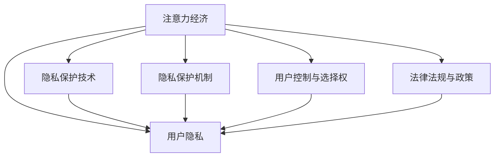

                 

# 注意力经济与个人隐私保护的平衡

## 1. 背景介绍

随着信息技术的飞速发展，我们正进入一个“注意力经济”的时代。注意力经济的核心在于，在数字化环境中，争夺和利用人类注意力已成为一种新型经济资源。平台和内容提供商通过各种手段，吸引和锁定用户注意力，以此产生价值和收益。与此同时，个人隐私问题也随之凸显，如何平衡注意力经济和个人隐私保护成为当前面临的重要课题。

### 1.1 问题由来

注意力经济的兴起得益于互联网和移动互联网技术的普及，使得各类内容和服务平台能够快速触达用户，并通过各种算法和推荐机制，精准推送个性化内容。诸如搜索引擎、社交媒体、新闻聚合、电子商务等平台，均通过数据分析和用户行为记录，不断优化内容推荐算法，提升用户参与度和粘性。这种模式下，用户注意力成为价值创造的重要因素，平台运营商通过捕获和利用用户注意力，获取巨大的经济收益。

然而，伴随注意力经济的高速发展，个人隐私问题也日益凸显。用户行为数据被广泛收集和分析，隐私泄露风险增加，个人信息被滥用甚至造成负面影响。例如，基于个性化推荐的内容推荐系统，可能带来“信息茧房”效应，导致用户接收的信息更加封闭，加剧信息分化。同时，广告投放机制、数据交易等过程中，隐私数据的滥用现象屡屡曝光，引发公众的广泛关注和质疑。

因此，如何在发展注意力经济的同时，确保个人隐私的保护，成为技术界和法律界共同面临的挑战。

### 1.2 问题核心关键点

当前，注意力经济与个人隐私保护的平衡问题主要集中在以下几个核心关键点上：

1. **数据收集与使用**：用户行为数据的收集和使用，应遵循什么原则？如何确保数据使用的透明度和公正性？
2. **隐私保护技术**：如何通过技术手段，如差分隐私、联邦学习等，保护用户隐私，避免数据泄露？
3. **隐私保护机制**：如何建立完善的隐私保护机制，如数据匿名化、访问控制等，防止隐私数据被滥用？
4. **用户控制与选择权**：用户如何掌握和管理自己的数据，包括知情同意、数据访问和删除等权利？
5. **法律法规与政策**：如何通过立法和政策，规范注意力经济中的隐私保护行为，保护用户权益？

这些关键点涉及技术、法律、伦理等多方面因素，需要通过综合措施加以解决。

## 2. 核心概念与联系

### 2.1 核心概念概述

本节将介绍几个与注意力经济与个人隐私保护密切相关的核心概念，并阐明它们之间的联系。

- **注意力经济**：指利用数字化技术，通过精确地捕获和利用用户注意力，创造经济价值的过程。其中，平台和内容提供商是注意力经济的主要参与者。
- **用户隐私**：指个人在数字世界中的个人信息不被泄露、滥用的状态，保护用户隐私是现代互联网发展的基础要求之一。
- **隐私保护技术**：包括差分隐私、联邦学习、同态加密等技术，用于在数据使用过程中保护个人隐私。
- **隐私保护机制**：如数据匿名化、访问控制、数据最小化等，通过组织和制度保障用户隐私不被滥用。
- **用户控制与选择权**：指用户对其个人信息的知情同意、数据访问、删除等权利，赋予用户选择权是保护隐私的重要手段。
- **法律法规与政策**：涉及数据保护法、隐私政策、隐私保护标准等，通过法律和政策规范注意力经济中的隐私保护行为。

这些概念之间存在紧密的联系，构成了一个相互依存的系统，共同保障了用户在注意力经济中的隐私权益。

### 2.2 核心概念原理和架构的 Mermaid 流程图(Mermaid 流程节点中不要有括号、逗号等特殊字符)



这个流程图展示了注意力经济、用户隐私、隐私保护技术、隐私保护机制、用户控制与选择权、法律法规与政策之间的关系，它们共同构建了一个保护用户隐私的体系。

## 3. 核心算法原理 & 具体操作步骤
### 3.1 算法原理概述

在注意力经济中，用户隐私保护的核心在于对用户数据的收集和使用进行严格管控，确保用户知情同意和数据最小化原则。具体而言，平台需要设计合理的数据收集和使用规则，通过隐私保护技术，防止数据泄露和滥用，同时赋予用户对其数据的控制权，并遵循相关法律法规。

### 3.2 算法步骤详解

基于上述原理，注意力经济与个人隐私保护的平衡可以分以下几个步骤进行：

**Step 1: 数据收集原则设计**
- 设计透明的数据收集原则，明确收集什么类型的数据、如何收集、收集目的等。
- 通过隐私政策和使用协议，告知用户其数据将如何被使用，并获得用户同意。

**Step 2: 隐私保护技术应用**
- 在数据收集和处理过程中，应用差分隐私、联邦学习、同态加密等技术，保护用户隐私。
- 对敏感数据进行匿名化处理，确保数据无法直接关联到具体用户。

**Step 3: 隐私保护机制建立**
- 建立数据访问控制机制，限制特定角色和用户的访问权限。
- 定期进行安全审计，检查隐私保护措施的有效性，防止数据泄露。

**Step 4: 用户控制与选择权实现**
- 提供数据访问、修改、删除等接口，使用户能够主动管理自己的数据。
- 采用用户友好的界面和操作流程，简化数据管理过程。

**Step 5: 法律法规与政策遵循**
- 遵守相关的数据保护法律法规，如GDPR、CCPA等，确保用户隐私权益的保护。
- 定期更新隐私政策和法律遵从措施，适应法律和市场环境的变化。

### 3.3 算法优缺点

基于隐私保护的注意力经济有以下优点：

1. 增强用户信任。透明的隐私政策和严格的数据保护措施，有助于增强用户对平台的信任，提升用户粘性和留存率。
2. 降低合规风险。遵守法律法规，可以减少法律诉讼和罚款风险，保障平台的可持续发展。
3. 改善用户体验。尊重用户隐私选择权，提供个性化和定制化的服务，提升用户体验。

同时，该方法也存在一些缺点：

1. 成本较高。隐私保护技术的实施需要较高的技术成本和资源投入。
2. 数据收集难度增加。严格的隐私保护措施可能限制部分数据的收集，影响个性化推荐和精准营销的效果。
3. 用户选择权复杂化。用户对数据的访问和删除权可能会增加平台数据管理的复杂性。

### 3.4 算法应用领域

隐私保护的注意力经济范式，可以广泛应用于各类数字平台和服务中，例如：

- **社交媒体平台**：如微信、微博、Facebook等，通过严格的数据隐私政策，保护用户分享内容的信息安全。
- **电子商务平台**：如亚马逊、京东、淘宝等，通过联邦学习等技术，保护用户购物行为数据。
- **新闻聚合平台**：如今日头条、网易新闻等，通过差分隐私保护用户阅读习惯。
- **内容推荐平台**：如Netflix、YouTube等，通过用户选择权保护用户个性化推荐数据。

## 4. 数学模型和公式 & 详细讲解 & 举例说明

### 4.1 数学模型构建

本节将使用数学语言对隐私保护的注意力经济模型进行详细构建。

假设平台从用户那里收集了一组行为数据 $X=\{x_1, x_2, ..., x_n\}$，其中每个 $x_i$ 表示一个用户的行为记录。为了保护用户隐私，平台需要对数据进行差分隐私处理，保证单个用户的数据对模型结果的影响尽可能小。

定义差分隐私模型 $\mathcal{L}(\epsilon)$，其中 $\epsilon$ 表示隐私参数，控制数据泄露的概率。

**Step 1: 差分隐私模型构建**

差分隐私模型的目标是，在模型输出中引入噪声，使得单个用户数据的变化对模型结果的影响不超过 $\epsilon$。具体而言，差分隐私模型可以表示为：

$$
\mathcal{L}(\epsilon) = \min_{f} \left\{ \mathbb{E}_{\mathcal{D}}[\ell(f(D))] + \frac{\epsilon}{\delta} \mathcal{W}(D) \right\}
$$

其中，$f$ 为模型函数，$\delta$ 为数据分布的敏感度，$\mathcal{W}(D)$ 为数据集的扰动敏感度。

**Step 2: 扰动敏感度计算**

数据集的扰动敏感度 $\mathcal{W}(D)$ 可以通过以下公式计算：

$$
\mathcal{W}(D) = \sup_{x \in D, x' \in D} \| P(f(D) = y|x) - P(f(D) = y|x') \|
$$

其中，$x$ 和 $x'$ 表示两个相邻的数据点，$P(f(D) = y|x)$ 表示在数据 $D$ 中，模型 $f$ 输出 $y$ 的概率。

### 4.2 公式推导过程

差分隐私模型的关键在于，在模型输出中引入噪声，使得单个用户数据的变化对模型结果的影响不超过 $\epsilon$。以下通过示例说明差分隐私模型的具体推导过程。

假设模型函数 $f$ 为简单的线性回归模型：

$$
f(D) = \theta_0 + \theta_1 x_1 + \theta_2 x_2 + ...
$$

其中 $\theta_0, \theta_1, \theta_2, ...$ 为模型参数，$x_1, x_2, ...$ 为用户行为数据。

引入噪声 $N$ 后，模型输出变为：

$$
f(D) + N
$$

其中 $N$ 为满足高斯分布的噪声，即 $N \sim \mathcal{N}(0, \sigma^2)$。

为了保证单个用户数据的变化对模型结果的影响不超过 $\epsilon$，需要对噪声进行限制：

$$
\| f(x) - f(x') \| \leq \epsilon
$$

其中 $x$ 和 $x'$ 表示两个相邻的数据点，$\| \cdot \|$ 表示向量范数。

根据上述约束，可以推导出噪声的方差 $\sigma^2$：

$$
\sigma^2 = \frac{\epsilon^2}{2\delta^2} \mathcal{W}(D)^2
$$

其中 $\mathcal{W}(D)$ 为数据集的扰动敏感度，$\delta$ 为数据分布的敏感度。

### 4.3 案例分析与讲解

**案例分析：电商平台用户行为数据保护**

假设一个电商平台收集了用户购买行为数据 $X=\{x_1, x_2, ..., x_n\}$，其中 $x_i$ 表示用户 $i$ 的购买记录。为了保护用户隐私，平台可以采用差分隐私模型进行处理。

具体而言，平台可以设计如下算法：

1. 对每个用户行为数据 $x_i$ 进行差分隐私处理，生成扰动后的数据 $x_i'$。
2. 使用扰动后的数据 $x_i'$ 重新训练模型 $f$，得到新的模型参数 $\hat{\theta}$。
3. 对新的模型参数 $\hat{\theta}$ 进行差分隐私保护，确保单个用户数据的变化对模型结果的影响不超过 $\epsilon$。

通过差分隐私模型，平台可以在保障用户隐私的前提下，实现个性化推荐和精准营销。

## 5. 项目实践：代码实例和详细解释说明
### 5.1 开发环境搭建

在进行隐私保护的注意力经济实践前，需要先搭建好开发环境。以下是Python环境搭建的详细步骤：

1. 安装Python：从官网下载并安装Python，推荐使用Python 3.8及以上版本。

2. 安装必要的Python库：
   - 安装numpy、pandas、matplotlib等数据处理和绘图库。
   - 安装scikit-learn、tensorflow等机器学习库。
   - 安装隐私保护库，如differential_privacy、federated_learning等。

3. 创建虚拟环境：
   - 使用virtualenv或conda等工具创建Python虚拟环境，避免与其他项目冲突。

4. 配置开发环境：
   - 设置环境变量，配置pip安装镜像。
   - 安装必要的依赖库和工具。

### 5.2 源代码详细实现

以下是一个基于差分隐私模型对用户行为数据进行保护的Python代码实现。

```python
import numpy as np
from differential_privacy import differential_privacy

def laplace_sensitivity(data, sensitivity):
    """计算数据的拉普拉斯敏感度"""
    return np.max(data) - np.min(data) + 2 * sensitivity

def add_laplace_noise(data, sensitivity, epsilon):
    """添加拉普拉斯噪声"""
    s = laplace_sensitivity(data, sensitivity)
    noise = np.random.laplace(s, size=data.shape)
    return data + epsilon * noise

def differential_privacy_algorithm(data, epsilon, delta):
    """差分隐私算法"""
    sensitivity = 1
    noise_scale = epsilon / (2 * delta)
    noisy_data = add_laplace_noise(data, sensitivity, noise_scale)
    return noisy_data

# 示例数据
X = np.array([[1, 2], [3, 4], [5, 6]])

# 差分隐私参数
epsilon = 0.1
delta = 0.1

# 差分隐私处理
noisy_X = differential_privacy_algorithm(X, epsilon, delta)

print(noisy_X)
```

代码实现如下：

1. `laplace_sensitivity`函数计算数据的拉普拉斯敏感度。
2. `add_laplace_noise`函数在数据上添加拉普拉斯噪声。
3. `differential_privacy_algorithm`函数实现差分隐私算法，在原始数据上添加噪声。
4. 示例数据 `X` 和差分隐私参数 `epsilon`、`delta`。
5. 调用差分隐私算法，得到差分隐私处理后的数据 `noisy_X`。

### 5.3 代码解读与分析

代码中，我们使用了差分隐私库中的Laplace机制来实现隐私保护。具体而言，通过对数据添加拉普拉斯噪声，使得单个用户数据的变化对模型结果的影响不超过 $\epsilon$，从而实现了差分隐私保护。

## 6. 实际应用场景
### 6.1 社交媒体平台

在社交媒体平台上，用户发布的内容和行为数据需要得到严格的隐私保护。社交媒体平台需要设计透明的隐私政策和严格的隐私保护措施，确保用户对其数据的知情同意和控制权。

平台可以通过差分隐私和联邦学习技术，保护用户发布的内容和行为数据，防止数据泄露和滥用。例如，Instagram、Facebook等社交媒体平台，已经在使用差分隐私技术保护用户的发布内容。

### 6.2 电子商务平台

电子商务平台通过收集用户的购物行为数据，进行个性化推荐和精准营销。然而，这些数据涉及用户的隐私，平台需要采取严格的隐私保护措施，确保用户隐私权益。

平台可以通过联邦学习和差分隐私技术，保护用户的购物行为数据，防止数据泄露和滥用。例如，阿里巴巴、亚马逊等电子商务平台，已经在利用联邦学习技术保护用户的购物行为数据。

### 6.3 内容推荐平台

内容推荐平台如Netflix、YouTube等，通过收集用户观看行为数据，进行个性化推荐。然而，这些数据涉及用户的隐私，平台需要采取严格的隐私保护措施，确保用户隐私权益。

平台可以通过差分隐私和用户控制技术，保护用户的观看行为数据，防止数据泄露和滥用。例如，Netflix通过差分隐私技术保护用户观看行为数据，同时提供用户对其数据的访问和删除权。

## 7. 工具和资源推荐
### 7.1 学习资源推荐

为了帮助开发者系统掌握隐私保护的注意力经济理论基础和实践技巧，这里推荐一些优质的学习资源：

1. 《隐私保护技术》系列博文：由隐私保护领域专家撰写，深入浅出地介绍了差分隐私、联邦学习、同态加密等隐私保护技术。

2. 《隐私保护与数据安全》课程：哈佛大学和耶鲁大学开设的隐私保护课程，涵盖隐私保护的基本概念和前沿技术，适合入门学习。

3. 《数据隐私保护技术》书籍：隐私保护领域知名专家所著，全面介绍了隐私保护技术的应用和实践，是隐私保护学习的经典教材。

4. 《联邦学习》书籍：联邦学习领域权威专家所著，系统介绍了联邦学习的基本原理和实际应用，是联邦学习学习的必读之作。

5. 《差分隐私》书籍：差分隐私领域权威专家所著，全面介绍了差分隐私的理论基础和实际应用，是差分隐私学习的权威指南。

通过对这些资源的学习实践，相信你一定能够快速掌握隐私保护的注意力经济的精髓，并用于解决实际的隐私保护问题。

### 7.2 开发工具推荐

高效的开发离不开优秀的工具支持。以下是几款用于隐私保护的注意力经济开发的常用工具：

1. Python：基于Python的隐私保护工具，如differential_privacy、federated_learning等，功能强大且易于使用。

2. TensorFlow：谷歌主导的深度学习框架，支持联邦学习等隐私保护技术，适合复杂和大规模模型的训练。

3. Scikit-learn：基于Python的机器学习库，支持差分隐私等隐私保护技术，适合中小规模模型的训练。

4. Keras：基于Python的高层深度学习框架，支持差分隐私和联邦学习等隐私保护技术，易于使用。

5. Weights & Biases：模型训练的实验跟踪工具，可以记录和可视化模型训练过程中的各项指标，方便对比和调优。

6. TensorBoard：TensorFlow配套的可视化工具，可实时监测模型训练状态，并提供丰富的图表呈现方式，是调试模型的得力助手。

合理利用这些工具，可以显著提升隐私保护的注意力经济开发的效率，加快创新迭代的步伐。

### 7.3 相关论文推荐

隐私保护的注意力经济的发展源于学界的持续研究。以下是几篇奠基性的相关论文，推荐阅读：

1. Differential Privacy: Definitions and Hardness of Problems（差分隐私的理论与问题难易度）：提出了差分隐私的定义和基本性质，是差分隐私理论的奠基之作。

2. Federated Learning: Concept and Architecture（联邦学习概念与架构）：介绍了联邦学习的基本概念和架构，是联邦学习的经典论文。

3. Privacy-Preserving Recommendation Systems: A Survey（隐私保护推荐系统的综述）：综述了隐私保护推荐系统的基本技术和应用，是隐私保护推荐系统的入门之作。

4. Secure Computing and Privacy-Preserving Protocols（安全计算与隐私保护协议）：介绍了安全计算和隐私保护协议的基本原理和应用，是隐私保护计算领域的经典论文。

这些论文代表了大语言模型微调技术的发展脉络。通过学习这些前沿成果，可以帮助研究者把握学科前进方向，激发更多的创新灵感。

## 8. 总结：未来发展趋势与挑战
### 8.1 研究成果总结

本文对隐私保护的注意力经济进行了全面系统的介绍。首先阐述了注意力经济与个人隐私保护的平衡问题，明确了隐私保护技术在注意力经济中的重要意义。其次，从原理到实践，详细讲解了差分隐私、联邦学习等隐私保护技术，给出了具体的代码实现和案例分析。同时，本文还广泛探讨了隐私保护技术在社交媒体、电子商务、内容推荐等领域的实际应用，展示了隐私保护技术在注意力经济中的广泛前景。

通过本文的系统梳理，可以看到，隐私保护的注意力经济已经成为一个重要的研究方向，不仅涉及隐私保护技术的不断演进，也涉及到隐私保护机制、法律法规、用户选择权等多方面因素的综合考量。隐私保护的注意力经济必将成为未来信息技术发展的重要方向。

### 8.2 未来发展趋势

展望未来，隐私保护的注意力经济将呈现以下几个发展趋势：

1. **隐私保护技术的突破**：随着差分隐私、联邦学习等隐私保护技术的不断演进，隐私保护技术将更加高效、灵活，能够更好地适应各种注意力经济场景。

2. **隐私保护机制的完善**：隐私保护机制的完善将成为未来隐私保护技术的重要方向。数据匿名化、访问控制等机制将更加严格，保障用户隐私权益。

3. **用户选择权的强化**：用户对其数据的知情同意、数据访问、删除等权利将更加明确，用户控制权将成为隐私保护的重要保障。

4. **法律法规的完善**：相关法律法规的制定和完善将更加规范注意力经济中的隐私保护行为，保障用户隐私权益。

5. **隐私保护与经济效益的平衡**：隐私保护技术与经济效益的平衡将成为未来隐私保护技术的重点研究方向，通过技术创新和机制设计，实现隐私保护与经济效益的双赢。

以上趋势凸显了隐私保护的注意力经济技术的前景。这些方向的探索发展，必将进一步提升隐私保护的效果，保障用户在注意力经济中的权益。

### 8.3 面临的挑战

尽管隐私保护的注意力经济已经取得了显著进展，但在实现全面隐私保护的过程中，仍面临诸多挑战：

1. **隐私保护技术的复杂性**：差分隐私、联邦学习等隐私保护技术的实现和应用较为复杂，需要高水平的技术能力和资源投入。

2. **数据收集难度增加**：严格的隐私保护措施可能会限制部分数据的收集，影响个性化推荐和精准营销的效果。

3. **法律法规的不完善**：现有的隐私保护法律法规尚需完善，部分行业领域缺乏明确的隐私保护规范。

4. **用户隐私意识的薄弱**：部分用户对隐私保护的意识薄弱，无法有效掌握和管理自己的数据。

5. **隐私保护与用户体验的平衡**：隐私保护与用户体验之间的平衡是一个复杂的问题，如何在保障隐私的同时，提升用户体验，是隐私保护技术需要不断优化的问题。

### 8.4 研究展望

面对隐私保护的注意力经济面临的挑战，未来的研究需要在以下几个方面寻求新的突破：

1. **隐私保护技术的新范式**：探索新的隐私保护技术，如零知识证明、多方安全计算等，在保障隐私的同时，提高隐私保护的效率和安全性。

2. **隐私保护机制的创新**：设计创新的隐私保护机制，如基于区块链的隐私保护方案、分布式隐私保护算法等，增强隐私保护的鲁棒性和安全性。

3. **法律法规的完善**：制定和完善隐私保护相关的法律法规，建立健全的隐私保护法律体系，规范隐私保护行为。

4. **用户隐私意识的提升**：通过教育和宣传，提升用户的隐私保护意识，使其能够更好地掌握和管理自己的数据。

5. **隐私保护与经济效益的平衡**：研究隐私保护技术与经济效益的平衡，通过技术创新和机制设计，实现隐私保护与经济效益的双赢。

这些研究方向的探索，必将引领隐私保护的注意力经济技术迈向更高的台阶，为构建安全、可靠、可解释、可控的智能系统铺平道路。面向未来，隐私保护的注意力经济技术还需要与其他人工智能技术进行更深入的融合，如知识表示、因果推理、强化学习等，多路径协同发力，共同推动自然语言理解和智能交互系统的进步。只有勇于创新、敢于突破，才能不断拓展隐私保护的效果，让智能技术更好地造福人类社会。

---

作者：禅与计算机程序设计艺术 / Zen and the Art of Computer Programming

