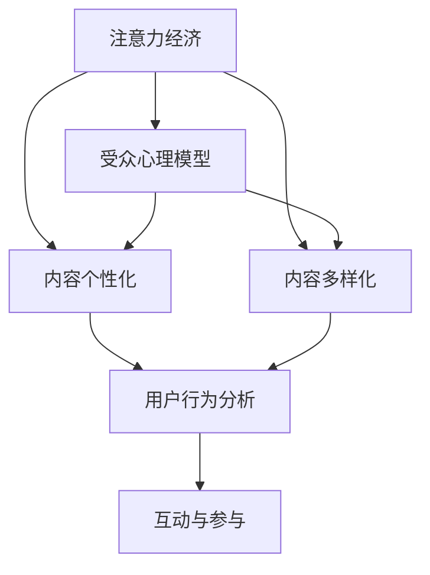

                 

# 注意力经济与内容创作策略：吸引并留住受众的参与度和忠诚度

> 关键词：注意力经济,内容创作策略,受众参与度,用户忠诚度,用户行为分析,数据分析,用户心理模型,内容个性化,内容多样化

## 1. 背景介绍

### 1.1 问题由来
在信息爆炸的今天，如何吸引受众注意力、维持其参与度和忠诚度，成为各内容创作者和平台运营者亟需解决的问题。随着数字媒体的蓬勃发展，越来越多的企业和个人投身于内容创作，但如何打造出高参与度、高忠诚度的内容，已经成为衡量创作者和平台运营成功与否的关键指标。

注意力经济（Attention Economy）应运而生，这一概念强调在信息过载的时代，受众的注意力资源是稀缺而宝贵的。创作者和平台运营者必须精心设计内容策略，吸引受众注意力，并通过互动和参与提升受众的忠诚度。在这一背景下，文章将从注意力经济的角度出发，探讨内容创作中的策略和技巧，以提升受众的参与度和忠诚度。

### 1.2 问题核心关键点
注意力经济与内容创作策略的核心在于理解受众的心理和行为模式，通过精确的内容定位、个性化推荐和动态调整策略，不断优化用户体验，从而提升受众的参与度和忠诚度。主要关注点包括：

- 受众心理模型：如何理解受众的心理需求和偏好。
- 内容个性化与多样化：如何通过个性化的内容创作和推荐，提升用户满意度和参与度。
- 用户行为分析：如何通过数据分析识别用户行为模式，优化内容策略。
- 互动与参与：如何设计互动机制，提升用户参与度和粘性。

### 1.3 问题研究意义
理解并掌握注意力经济与内容创作策略，对于内容创作者和平台运营者具有重要意义：

- 精准定位：通过深入分析受众心理和行为，实现内容创作和推荐的精准定位，提高内容相关性和用户体验。
- 提升参与度：通过个性化和多样化的内容策略，增强受众的参与感和互动性，提升内容的吸引力和影响力。
- 保持忠诚度：通过持续的用户互动和反馈，维持受众对内容创作者和平台的长期关注和信任。
- 商业价值：高参与度和忠诚度的受众群体能够带来更多的流量、点击率和转化率，驱动商业价值增长。

## 2. 核心概念与联系

### 2.1 核心概念概述

为了更好地理解注意力经济与内容创作策略，本节将介绍几个密切相关的核心概念：

- 注意力经济（Attention Economy）：在信息过载时代，注意力成为稀缺资源。创作者和平台需要吸引和保持受众的注意力，以实现商业价值。

- 受众心理模型（User Psychological Model）：基于心理学原理，分析受众的兴趣、需求和行为模式，指导内容创作和推荐策略。

- 内容个性化（Content Personalization）：根据受众的兴趣和行为数据，定制个性化内容，提升用户体验。

- 内容多样化（Content Diversification）：通过多样化内容呈现，满足不同受众的兴趣和需求，提升内容的吸引力。

- 用户行为分析（User Behavior Analysis）：通过数据分析识别用户行为模式，优化内容策略和运营手段。

- 互动与参与（Interactive and Participatory）：通过互动机制设计，提升受众的参与度和粘性，形成良好用户体验。

这些核心概念之间的逻辑关系可以通过以下Mermaid流程图来展示：



这个流程图展示了大语言模型的核心概念及其之间的关系：

1. 注意力经济决定创作者和平台需要吸引和保持受众的注意力。
2. 受众心理模型分析受众的心理需求和行为模式，指导内容创作。
3. 内容个性化和多样化策略提升用户体验和吸引力。
4. 用户行为分析识别受众行为模式，优化内容策略。
5. 互动与参与机制设计增强用户粘性和参与度。

这些概念共同构成了内容创作者和平台运营者的策略框架，使其能够通过精准定位和优化内容，吸引并留住受众的参与度和忠诚度。

## 3. 核心算法原理 & 具体操作步骤
### 3.1 算法原理概述

注意力经济与内容创作策略的实现，依赖于数据驱动的用户行为分析和个性化内容推荐算法。其核心思想是：通过分析用户的历史行为数据，构建用户兴趣模型，并利用模型预测用户对不同内容的可能反应，从而进行个性化内容推荐和策略调整。

形式化地，假设用户行为数据为 $D=\{(x_i, y_i)\}_{i=1}^N, x_i \in X, y_i \in Y$，其中 $X$ 为事件集合，$Y$ 为行为标签集合。定义用户兴趣模型为 $f: X \rightarrow [0,1]$，表示事件 $x$ 对用户兴趣的影响程度。

在用户行为数据的指导下，通过优化用户兴趣模型 $f$，使其最大化用户的参与度和满意度。即：

$$
\max_{f} \sum_{i=1}^N f(x_i)y_i - \lambda \|f\|^2
$$

其中 $\lambda$ 为正则化系数，控制模型复杂度。

### 3.2 算法步骤详解

基于注意力经济与内容创作策略的个性化推荐过程，主要包括以下几个关键步骤：

**Step 1: 数据收集与预处理**
- 收集用户的历史行为数据，包括浏览记录、点击行为、购买记录等。
- 对数据进行清洗和去重，去除噪音和无效数据。

**Step 2: 用户兴趣模型构建**
- 根据用户行为数据，利用机器学习算法（如协同过滤、神经网络等）构建用户兴趣模型 $f$。
- 模型的训练目标是最小化预测误差和模型复杂度之间的权衡。

**Step 3: 内容推荐**
- 根据用户兴趣模型，预测用户对不同内容的兴趣程度。
- 选择与用户兴趣最为匹配的内容进行推荐。

**Step 4: 策略优化**
- 根据用户反馈数据（如点击率、转化率等），对用户兴趣模型进行动态调整。
- 优化推荐策略，提升用户满意度和参与度。

**Step 5: 互动与反馈**
- 设计互动机制（如评论区、投票等），鼓励用户反馈和参与。
- 根据用户反馈，不断优化内容策略。

### 3.3 算法优缺点

基于数据驱动的个性化推荐算法，具有以下优点：

1. 提升用户体验：通过个性化内容推荐，满足用户的多样化和精准化需求，提升用户体验。
2. 增加用户粘性：通过互动机制设计，增强用户对平台的粘性和参与度。
3. 数据驱动优化：利用数据驱动的优化过程，不断优化推荐策略，提高内容相关性和用户体验。

但该算法也存在以下缺点：

1. 数据隐私问题：用户行为数据涉及个人隐私，需要严格遵守数据保护法规，如GDPR等。
2. 数据质量要求高：个性化推荐的效果依赖于数据的质量和完整性，数据缺失或不准确会影响推荐效果。
3. 模型复杂度高：个性化推荐模型需要处理大量数据，模型复杂度高，需要高效的算法和计算资源。

### 3.4 算法应用领域

基于注意力经济与内容创作策略的个性化推荐方法，在数字媒体和电子商务领域得到了广泛应用，例如：

- 新闻网站：通过个性化推荐，提升用户浏览量，增加页面停留时间。
- 电子商务平台：个性化推荐商品和广告，提升点击率和转化率。
- 社交媒体：个性化推荐内容，提升用户活跃度和粘性。
- 在线教育：个性化推荐课程和资源，提升用户学习体验和成果。
- 游戏平台：个性化推荐游戏和活动，提升用户留存率和付费率。

除了上述这些经典应用外，个性化推荐技术还在健康医疗、旅游出行、文化娱乐等多个领域得到应用，为各行业的数字化转型提供重要支持。

## 4. 数学模型和公式 & 详细讲解 & 举例说明

### 4.1 数学模型构建

为了更精确地描述用户兴趣模型和个性化推荐过程，本节将使用数学语言进行形式化描述。

假设用户行为数据为 $D=\{(x_i, y_i)\}_{i=1}^N, x_i \in X, y_i \in Y$。用户兴趣模型为 $f: X \rightarrow [0,1]$。定义用户对内容 $x_j$ 的兴趣程度为 $r(x_j)=\sum_{x_i \in X} f(x_i)y_i \delta(x_i, x_j)$，其中 $\delta(x_i, x_j)$ 为事件 $x_i$ 和 $x_j$ 的匹配度。

基于此，构建推荐系统目标函数：

$$
\max_{f} \sum_{j=1}^M r(x_j) - \lambda \|f\|^2
$$

其中 $M$ 为内容集合，$M \gg N$。

### 4.2 公式推导过程

以下我们以协同过滤推荐算法为例，推导个性化推荐的过程。

假设用户行为数据为 $D=\{(x_i, y_i)\}_{i=1}^N, x_i \in X, y_i \in Y$。构建用户兴趣模型 $f$，使得 $f(x_i)=\alpha_ix_i^T\beta$，其中 $\alpha_i$ 为用户 $i$ 的兴趣参数，$\beta$ 为内容的特征向量。

基于用户兴趣模型，用户对内容 $x_j$ 的兴趣程度为：

$$
r(x_j)=\sum_{i=1}^N \alpha_i x_i^T \beta y_i \delta(x_i, x_j)
$$

将上述表达式代入推荐系统目标函数：

$$
\max_{\alpha, \beta} \sum_{j=1}^M \left(\sum_{i=1}^N \alpha_i x_i^T \beta y_i \delta(x_i, x_j)\right) - \lambda \|\alpha\|^2 - \lambda \|\beta\|^2
$$

通过对目标函数进行优化，即可得到用户兴趣模型和内容兴趣程度的表达式。最终，推荐系统选择与用户兴趣最为匹配的内容进行推荐。

### 4.3 案例分析与讲解

假设我们有一家在线新闻平台，希望通过个性化推荐提升用户参与度和满意度。平台收集了用户的历史浏览记录和点击行为数据，构建了用户兴趣模型 $f$。

具体而言，假设用户浏览的文章集为 $X$，点击次数为 $Y$。用户对每篇文章的兴趣程度为 $r(x_j)=\sum_{i=1}^N \alpha_i x_i^T \beta y_i \delta(x_i, x_j)$。

根据用户兴趣模型，推荐系统选择与用户兴趣最为匹配的文章进行推荐。例如，用户 $i$ 对文章 $j$ 的兴趣程度为：

$$
r(x_j) = \alpha_i x_i^T \beta y_i \delta(x_i, x_j)
$$

平台可以通过A/B测试等方法评估个性化推荐的实际效果，并根据用户反馈数据进行模型和策略的动态优化，提升用户满意度和参与度。

## 5. 项目实践：代码实例和详细解释说明
### 5.1 开发环境搭建

在进行个性化推荐实践前，我们需要准备好开发环境。以下是使用Python进行Scikit-learn开发的环境配置流程：

1. 安装Anaconda：从官网下载并安装Anaconda，用于创建独立的Python环境。

2. 创建并激活虚拟环境：
```bash
conda create -n recommendation-env python=3.8 
conda activate recommendation-env
```

3. 安装Scikit-learn：
```bash
conda install scikit-learn
```

4. 安装各类工具包：
```bash
pip install numpy pandas scikit-learn matplotlib tqdm jupyter notebook ipython
```

完成上述步骤后，即可在`recommendation-env`环境中开始个性化推荐实践。

### 5.2 源代码详细实现

下面我们以协同过滤推荐算法为例，给出使用Scikit-learn库进行个性化推荐系统的PyTorch代码实现。

首先，定义协同过滤推荐算法中的数据处理函数：

```python
from sklearn.metrics.pairwise import cosine_similarity

def build_user_item_matrix(D):
    user_item_matrix = np.zeros((len(D), len(D[0])))
    for i, (x, y) in enumerate(D):
        user_item_matrix[i] = np.array(y) * cosine_similarity(x, D)
    return user_item_matrix
```

然后，定义模型和优化器：

```python
from sklearn.decomposition import NMF
from scipy.sparse.linalg import svds

user_item_matrix = build_user_item_matrix(D)
U, Vt = svds(user_item_matrix, k=50)

model = NMF(n_components=50, init='nndsvd')
model.fit(user_item_matrix)
```

接着，定义推荐函数：

```python
def recommend(model, user_item_matrix, user_index, num_recommendations):
    user_index = user_index - 1
    user_index_vector = user_item_matrix[user_index]
    prediction_matrix = user_item_matrix - user_index_vector
    prediction_matrix[(np.abs(prediction_matrix) < 0.01).nonzero()] = 0
    recommendation_scores = model.transform(prediction_matrix)
    recommendation_scores = recommendation_scores / (recommendation_scores.max() + 1e-10)
    recommendations = np.argsort(recommendation_scores)[-num_recommendations:][::-1]
    return recommendations
```

最后，启动推荐流程并在用户互动中调整模型：

```python
user_id = 123
recommendations = recommend(model, user_item_matrix, user_id, 5)
print(f"Recommended articles for user {user_id}: {recommendations}")
```

以上就是使用Scikit-learn对协同过滤推荐算法进行个性化推荐系统的完整代码实现。可以看到，利用Scikit-learn的NMF模型，可以相对简洁地实现协同过滤推荐算法。

### 5.3 代码解读与分析

让我们再详细解读一下关键代码的实现细节：

**build_user_item_matrix函数**：
- 构建用户-项目矩阵：通过计算用户对每个项目的兴趣程度，构建用户-项目矩阵。

**NMF模型**：
- 利用NMF（非负矩阵分解）模型进行用户兴趣的矩阵分解，得到用户兴趣参数和项目特征向量。

**recommend函数**：
- 根据用户兴趣模型，计算预测得分，选择与用户兴趣最为匹配的项目进行推荐。

**用户互动和模型调整**：
- 通过用户互动数据（如点击、收藏、评论等），调整用户兴趣模型和推荐策略，提升个性化推荐的准确性和效果。

可以看到，Scikit-learn提供了丰富的机器学习算法和工具，可以方便地实现个性化的推荐系统。开发者可以将更多精力放在数据处理和策略优化上，而不必过多关注底层的实现细节。

## 6. 实际应用场景

### 6.1 数字媒体平台

基于个性化推荐算法，数字媒体平台能够有效提升用户参与度和满意度。例如，新闻网站可以通过个性化推荐，将用户感兴趣的文章及时推送到其面前，提高页面浏览量和点击率。社交媒体平台也可以通过个性化推荐，提升用户活跃度和粘性。

在技术实现上，平台需要构建用户行为数据采集和存储系统，利用机器学习算法构建用户兴趣模型，实现个性化推荐。平台还可以通过A/B测试等方法，不断优化推荐策略，提升用户体验。

### 6.2 电子商务平台

电子商务平台通过个性化推荐，提升用户购物体验和转化率。平台收集用户浏览、点击、购买等行为数据，利用个性化推荐算法，向用户推荐感兴趣的商品。例如，电商平台可以根据用户的历史浏览记录和点击行为，推荐相似或互补的商品，提升用户购买意愿。

在实际应用中，平台还需要设计动态调整策略，根据用户反馈数据优化推荐算法，提升推荐精度和用户体验。

### 6.3 在线教育平台

在线教育平台通过个性化推荐，提升用户学习效果和平台留存率。平台收集用户的学习行为数据（如学习时长、完成率等），利用个性化推荐算法，向用户推荐适合的课程和资源。例如，学习平台可以根据用户的学习进度和偏好，推荐下一节学习内容，提升学习效果。

在技术实现上，平台需要构建用户行为数据采集和存储系统，利用机器学习算法构建用户兴趣模型，实现个性化推荐。平台还可以通过用户互动数据，动态调整推荐策略，提升用户学习体验和满意度。

### 6.4 未来应用展望

随着个性化推荐技术的发展，未来将有更多创新应用出现。

- 多模态推荐：结合文本、图像、视频等多种信息，进行更全面、准确的内容推荐。
- 实时推荐：利用流式计算技术，实现实时动态的个性化推荐。
- 混合推荐：结合协同过滤、内容推荐、基于规则推荐等多种算法，提升推荐精度和多样性。
- 跨平台推荐：通过用户跨平台行为数据，实现跨平台的个性化推荐，提升用户体验。

这些技术的进一步发展，将极大地丰富个性化推荐的应用场景，为用户带来更精准、高效的推荐服务。

## 7. 工具和资源推荐
### 7.1 学习资源推荐

为了帮助开发者系统掌握个性化推荐技术，这里推荐一些优质的学习资源：

1. 《Recommender Systems: Advanced Collaborative Filtering》书籍：由John I. McCallum等人所著，全面介绍了协同过滤等推荐算法，适合深入学习推荐系统原理和实现。

2. CS229《Machine Learning》课程：斯坦福大学开设的经典课程，由Andrew Ng教授主讲，涵盖了机器学习基础和推荐系统等内容。

3. KDD 2020论文集《Personalized Recommendation at Scale》：该论文集系统总结了推荐系统在大规模数据上的应用，涵盖算法和系统架构。

4. Coursera《Recommender Systems Specialization》课程：由密歇根大学教授主讲，介绍了推荐系统理论和实践，适合快速上手。

5. HuggingFace官方文档：提供详细的推荐系统算法和模型实现，包括TensorFlow、PyTorch等主流框架的代码样例。

通过这些资源的学习实践，相信你一定能够快速掌握个性化推荐技术的精髓，并用于解决实际的推荐问题。

### 7.2 开发工具推荐

高效的开发离不开优秀的工具支持。以下是几款用于个性化推荐开发的常用工具：

1. TensorFlow：由Google主导开发的深度学习框架，适合大规模推荐系统的构建和训练。

2. PyTorch：基于Python的开源深度学习框架，适合快速迭代研究。

3. Scikit-learn：Python科学计算库，提供丰富的机器学习算法和工具，适合实现推荐算法。

4. Elasticsearch：分布式搜索和分析引擎，适合存储和查询大规模用户行为数据。

5. Apache Kafka：分布式流式处理平台，适合实时处理和分析用户行为数据。

合理利用这些工具，可以显著提升个性化推荐系统的开发效率，加快创新迭代的步伐。

### 7.3 相关论文推荐

个性化推荐技术的发展离不开学界的持续研究。以下是几篇奠基性的相关论文，推荐阅读：

1. Factorization Machines for Preference Learning（即FFM算法）：提出因子化机器算法，用于提升推荐系统效果。

2. Deep Neural Networks for Modeling and Predicting Customer Purchases（即DNN模型）：利用深度神经网络模型，实现个性化推荐。

3. Attention and Transformer-based Recommender Systems：引入注意力机制和Transformer模型，提升推荐系统效果。

4. Nearest Neighbor Collaborative Filtering（即KNN算法）：提出基于相似度的协同过滤算法，用于个性化推荐。

5. Matrix Factorization Techniques for Recommender Systems（即MF算法）：利用矩阵分解技术，实现推荐系统算法。

这些论文代表了个性化推荐技术的发展脉络。通过学习这些前沿成果，可以帮助研究者把握学科前进方向，激发更多的创新灵感。

## 8. 总结：未来发展趋势与挑战

### 8.1 总结

本文对基于数据驱动的个性化推荐技术进行了全面系统的介绍。首先阐述了个性化推荐在注意力经济中的重要性和研究背景，明确了个性化推荐在吸引和留住受众参与度和忠诚度方面的独特价值。其次，从原理到实践，详细讲解了个性化推荐的数学模型和关键步骤，给出了推荐任务开发的完整代码实例。同时，本文还广泛探讨了个性化推荐技术在数字媒体、电子商务、在线教育等多个行业领域的应用前景，展示了个性化推荐技术的巨大潜力。此外，本文精选了个性化推荐技术的各类学习资源，力求为读者提供全方位的技术指引。

通过本文的系统梳理，可以看到，个性化推荐技术正在成为数字媒体和电子商务的重要工具，极大地提升了用户参与度和满意度，推动了各行业的数字化转型。未来，伴随个性化推荐技术的不断演进，相信NLP技术将在更多领域得到应用，为用户带来更精准、高效、个性化的服务。

### 8.2 未来发展趋势

展望未来，个性化推荐技术将呈现以下几个发展趋势：

1. 多模态推荐：结合文本、图像、视频等多种信息，进行更全面、准确的内容推荐。

2. 实时推荐：利用流式计算技术，实现实时动态的个性化推荐。

3. 混合推荐：结合协同过滤、内容推荐、基于规则推荐等多种算法，提升推荐精度和多样性。

4. 跨平台推荐：通过用户跨平台行为数据，实现跨平台的个性化推荐，提升用户体验。

5. 自适应推荐：通过动态调整推荐策略，适应用户行为变化，提升推荐效果。

这些趋势凸显了个性化推荐技术的广阔前景。这些方向的探索发展，必将进一步提升推荐系统的性能和应用范围，为用户带来更精准、高效、个性化的服务。

### 8.3 面临的挑战

尽管个性化推荐技术已经取得了瞩目成就，但在迈向更加智能化、普适化应用的过程中，它仍面临着诸多挑战：

1. 数据隐私问题：用户行为数据涉及个人隐私，需要严格遵守数据保护法规，如GDPR等。

2. 数据质量要求高：个性化推荐的效果依赖于数据的质量和完整性，数据缺失或不准确会影响推荐效果。

3. 模型复杂度高：个性化推荐模型需要处理大量数据，模型复杂度高，需要高效的算法和计算资源。

4. 推荐算法公平性：个性化推荐算法可能存在偏见和歧视，需要设计公平性评估指标，避免不公平现象。

5. 实时动态调整：实时动态调整推荐策略，需要高效的数据采集和处理机制，挑战较大。

6. 跨平台协同推荐：不同平台的数据格式和规范不一致，需要进行跨平台数据融合，技术复杂度较高。

这些挑战需要在算法、技术、法规等多个层面进行综合考虑，才能实现个性化推荐技术的可持续发展。

### 8.4 研究展望

面对个性化推荐技术所面临的种种挑战，未来的研究需要在以下几个方面寻求新的突破：

1. 数据隐私保护：利用差分隐私、联邦学习等技术，保护用户隐私，满足数据保护法规要求。

2. 数据质量优化：通过数据清洗、数据增强等技术，提高数据质量和完整性，提升推荐效果。

3. 模型压缩与加速：利用剪枝、量化等技术，优化模型结构和计算资源，提升推荐系统效率。

4. 公平性评估与优化：设计公平性评估指标，优化推荐算法，避免偏见和歧视现象。

5. 跨平台数据融合：通过数据标准化和接口定义，实现不同平台之间的数据融合和协同推荐。

6. 自适应推荐算法：利用强化学习等技术，实现自适应推荐策略，提升推荐效果。

这些研究方向将推动个性化推荐技术的不断进步，为构建安全、可靠、高效、公平的推荐系统提供有力支持。

## 9. 附录：常见问题与解答

**Q1：如何平衡个性化推荐与多样性推荐？**

A: 个性化推荐和多样性推荐之间需要找到平衡点。可以通过以下方法实现：
1. 模型训练时引入多样性损失函数，惩罚过于相似的推荐。
2. 设计推荐规则，引入多样性机制，如推荐相似度不超过一定阈值的内容。
3. 设计多样性奖励机制，对多样性推荐给予奖励，提高多样化内容的曝光率。

**Q2：推荐算法如何处理长尾数据？**

A: 长尾数据通常指的是用户浏览次数较少的内容。可以通过以下方法处理长尾数据：
1. 引入衰减函数，降低长尾内容的权重，避免过多推荐。
2. 利用多样性推荐机制，提升长尾内容的曝光率。
3. 引入冷启动机制，对新内容进行推荐，引导用户探索长尾内容。

**Q3：推荐系统如何避免数据过拟合？**

A: 推荐系统数据过拟合的问题通常可以通过以下方法解决：
1. 引入正则化技术，如L2正则、Dropout等，防止模型过拟合。
2. 设计动态调整机制，根据用户反馈数据，不断优化推荐策略。
3. 采用集成学习技术，结合多个推荐模型，提升系统鲁棒性和泛化能力。

**Q4：推荐系统如何实现实时动态调整？**

A: 实现实时动态调整，需要构建高效的数据采集和处理系统，如利用流式计算技术，实时分析用户行为数据。同时，需要设计动态调整机制，根据用户反馈数据，不断优化推荐策略。例如，可以通过A/B测试等方法，不断优化推荐算法，提升系统性能。

**Q5：推荐系统如何提高推荐精度？**

A: 提高推荐精度需要综合考虑多个因素：
1. 数据质量：确保数据高质量，避免噪音和缺失数据。
2. 模型优化：选择合适的推荐算法，优化模型结构和参数。
3. 用户反馈：收集用户反馈数据，不断优化推荐策略。
4. 多模态融合：结合多种信息源，进行更全面、准确的内容推荐。

这些问题的解决将进一步推动个性化推荐技术的发展，提升推荐系统的精度和用户体验。

---

作者：禅与计算机程序设计艺术 / Zen and the Art of Computer Programming

