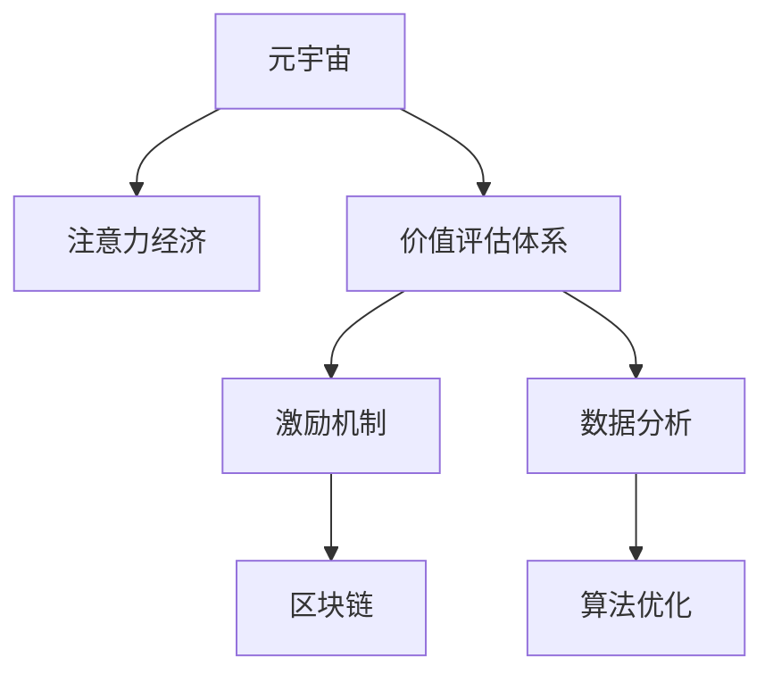

                 

# 注意力经济学研究:元宇宙中的价值评估体系

> 关键词：元宇宙,注意力经济,价值评估体系,注意力定价,激励机制,区块链,数字资产

## 1. 背景介绍

### 1.1 问题由来

近年来，随着虚拟现实技术的发展，元宇宙（Metaverse）的概念逐渐被引入到互联网行业。元宇宙是一种基于分布式计算和虚拟现实技术，构建的沉浸式、高度交互的虚拟世界。用户可以在元宇宙中进行各种社交、娱乐、商业活动，形成一种新型的经济体系，即注意力经济。

在传统经济中，货币和商品是交换媒介，而在元宇宙中，用户的注意力成为了一种新型的价值。用户通过在元宇宙中花费时间、金钱、虚拟物品等，吸引其他用户的注意。随着元宇宙的兴起，如何衡量和评估这种新型的价值，成为了研究的热点问题。

### 1.2 问题核心关键点

元宇宙中的价值评估体系是一个复杂且具有挑战性的问题。核心关键点包括：

- 如何定义元宇宙中的价值？注意力如何量化？
- 如何构建元宇宙中的激励机制，促进价值创造和流通？
- 如何设计元宇宙中的治理体系，确保价值评估的公正性和透明性？
- 如何引入区块链技术，实现元宇宙中的价值评估和流通的不可篡改性？
- 如何通过数据分析和算法优化，提升元宇宙中的价值评估效率？

## 2. 核心概念与联系

### 2.1 核心概念概述

为更好地理解元宇宙中的价值评估体系，本节将介绍几个密切相关的核心概念：

- **元宇宙（Metaverse）**：基于虚拟现实和分布式计算技术，构建的沉浸式、高度交互的虚拟世界。
- **注意力经济（Attention Economy）**：在元宇宙中，用户的注意力成为一种新型的经济资源。通过吸引和利用用户的注意力，创造价值并交换。
- **价值评估体系（Value Assessment System）**：对元宇宙中的注意力、虚拟物品等资源进行量化和评估的体系，指导资源分配和价值流通。
- **激励机制（Incentive Mechanism）**：通过设计合理的激励规则，激励用户在元宇宙中积极参与和贡献，促进价值的创造和流通。
- **区块链（Blockchain）**：分布式账本技术，通过去中心化的方式，保证元宇宙中价值评估和流通的透明性和不可篡改性。

这些核心概念之间的逻辑关系可以通过以下Mermaid流程图来展示：



这个流程图展示了大语言模型的核心概念及其之间的关系：

1. 元宇宙通过虚拟现实技术，创造了一个高度交互的虚拟世界。
2. 在元宇宙中，注意力经济成为一种新型的经济形态，用户通过吸引和利用注意力创造价值。
3. 价值评估体系对元宇宙中的注意力、虚拟物品等资源进行量化和评估，指导资源分配。
4. 激励机制通过设计合理的规则，激励用户积极参与，促进价值流通。
5. 区块链技术保障了价值评估和流通的透明性和不可篡改性。
6. 数据分析和算法优化提升价值评估的效率和公平性。

这些概念共同构成了元宇宙中的经济体系，指导着元宇宙中的价值创造和流通。

## 3. 核心算法原理 & 具体操作步骤

### 3.1 算法原理概述

元宇宙中的价值评估体系，本质上是一个基于注意力的经济模型。其核心思想是：用户的注意力可以量化为一种经济资源，通过设计和优化价值评估体系，最大化注意力的利用效率，促进价值的创造和流通。

形式化地，假设元宇宙中有 $N$ 个用户 $U=\{u_1, u_2, \ldots, u_N\}$，每个用户通过交互和贡献吸引其他用户的注意，从而获得相应的价值。设用户 $u_i$ 获得的注意力为 $A_i$，则其价值 $V_i$ 可以表示为：

$$
V_i = f(A_i)
$$

其中 $f$ 为注意力价值转换函数。在实践中，$f$ 通常采用非线性函数，以更好地体现注意力的边际效益递减特性。

### 3.2 算法步骤详解

元宇宙中的价值评估体系构建，通常包括以下几个关键步骤：

**Step 1: 设计注意力计量模型**
- 确定衡量注意力的指标，如交互频率、内容质量、用户贡献等。
- 使用统计方法或机器学习模型，对用户的注意力进行计量和建模。

**Step 2: 设计激励机制**
- 根据注意力计量模型，设计激励规则，如奖励、惩罚、积分等。
- 设计多层次的激励机制，如内容创作者、社交活跃者、系统贡献者等，鼓励不同类型的用户积极参与。

**Step 3: 引入区块链技术**
- 将元宇宙中的价值评估和流通过程记录在区块链上，确保透明性和不可篡改性。
- 利用智能合约实现自动化的激励分配和价值流转。

**Step 4: 优化价值评估算法**
- 使用数据分析和算法优化，提升价值评估的准确性和公平性。
- 引入机器学习模型，如回归模型、分类模型等，对价值评估结果进行优化。

**Step 5: 实施和监控**
- 在元宇宙中实施价值评估体系，监测其运行效果。
- 根据反馈和数据分析，持续优化和调整价值评估体系。

以上是元宇宙中价值评估体系的一般流程。在实际应用中，还需要针对具体场景，对各环节进行优化设计，如改进注意力计量模型、引入更多的激励方式、优化区块链共识算法等，以进一步提升系统性能。

### 3.3 算法优缺点

元宇宙中的价值评估体系具有以下优点：

1. 最大化注意力资源利用效率。通过科学计量和合理激励，最大化用户注意力的创造和流通。
2. 透明性和不可篡改性。区块链技术保障了价值评估的透明性和不可篡改性，提升了系统的公信力。
3. 促进公平竞争。通过科学设计激励机制，引导用户积极参与，促进了元宇宙中的公平竞争。
4. 动态适应性。系统可以根据元宇宙中的动态变化，实时调整价值评估模型，保持系统的活力和竞争力。

同时，该体系也存在一定的局限性：

1. 数据质量问题。注意力的计量和分配依赖于数据的质量和完整性，数据偏差可能导致不公平的激励分配。
2. 计算复杂度。大规模元宇宙中的价值评估计算复杂度高，需要高效的算法和计算平台支持。
3. 激励过度风险。设计不当的激励机制可能导致激励过度，用户行为偏差，甚至形成泡沫。
4. 隐私和安全问题。用户数据的保护和隐私安全，是价值评估体系面临的重大挑战。
5. 技术门槛。元宇宙中的价值评估体系需要高水平的算法和区块链技术支持，门槛较高。

尽管存在这些局限性，但就目前而言，基于注意力的价值评估体系仍是大规模元宇宙经济的基础。未来相关研究的重点在于如何进一步降低数据质量问题，提高计算效率，避免激励过度，同时兼顾隐私和安全技术，以满足元宇宙发展的实际需求。

### 3.4 算法应用领域

元宇宙中的价值评估体系已经在多个应用场景中得到了广泛的应用，例如：

- 虚拟房地产：通过计量的用户关注度和互动频率，评估虚拟土地的价值，进行虚拟房地产的交易。
- 虚拟游戏：通过用户的消费、贡献和社交活动，计算用户的注意力价值，进行游戏内虚拟物品的交换。
- 虚拟事件：通过用户参与度和反馈，评估虚拟活动的关注度，进行活动组织和内容创作激励。
- 虚拟商业：通过用户的点击、购买行为，评估广告的关注度，进行广告投放和营销活动。
- 虚拟教育：通过用户的互动和学习成果，计算教育内容的价值，进行知识共享和教学激励。

除了上述这些经典应用外，元宇宙中的价值评估体系还被创新性地应用到更多场景中，如虚拟艺术、虚拟健身、虚拟社交等，为元宇宙技术带来了新的发展方向。随着元宇宙技术的不断进步，基于注意力的价值评估体系将在更多领域得到应用，为元宇宙的发展注入新的动力。

## 4. 数学模型和公式 & 详细讲解 & 举例说明

### 4.1 数学模型构建

本节将使用数学语言对元宇宙中的价值评估体系进行更加严格的刻画。

设元宇宙中有 $N$ 个用户 $U=\{u_1, u_2, \ldots, u_N\}$，每个用户通过交互和贡献吸引其他用户的注意，从而获得相应的价值。设用户 $u_i$ 获得的注意力为 $A_i$，则其价值 $V_i$ 可以表示为：

$$
V_i = f(A_i)
$$

其中 $f$ 为注意力价值转换函数。假设 $f$ 为非线性函数，可以表示为：

$$
V_i = A_i^\alpha
$$

其中 $\alpha$ 为边际效益递减参数，通常在 $0 < \alpha < 1$ 之间取值。

### 4.2 公式推导过程

根据上式，用户 $u_i$ 的价值与其获得的注意力 $A_i$ 成正比关系。当 $\alpha < 1$ 时，注意力的边际效益递减，即注意力的增加带来的价值增长速率低于注意力的增长速率。

在实践中，通常使用回归模型对 $V_i$ 和 $A_i$ 之间的关系进行建模。假设使用线性回归模型，则有：

$$
V_i = \beta_0 + \beta_1 A_i + \epsilon_i
$$

其中 $\beta_0$ 和 $\beta_1$ 为模型的参数，$\epsilon_i$ 为随机误差项。通过最小化均方误差损失函数，可以估计出 $\beta_0$ 和 $\beta_1$：

$$
\hat{\beta} = \arg\min_{\beta} \frac{1}{N}\sum_{i=1}^N (V_i - \beta_0 - \beta_1 A_i)^2
$$

通过求解上述优化问题，可以得到最优的参数 $\hat{\beta}$，进而得到注意力价值转换函数 $f$。

### 4.3 案例分析与讲解

假设元宇宙中有一个虚拟社区，有 $N=100$ 个用户。通过统计分析，得到每个用户 $u_i$ 每天获得的平均注意力 $A_i$ 如下表所示：

| 用户 | 平均注意力 $A_i$ |
| --- | --- |
| $u_1$ | $100$ |
| $u_2$ | $80$ |
| $u_3$ | $60$ |
| ... | ... |
| $u_{100}$ | $20$ |

假设 $f$ 为指数函数，即 $f(A_i) = A_i^{0.8}$。根据上式，每个用户 $u_i$ 的价值 $V_i$ 可以计算如下：

| 用户 | 注意力 $A_i$ | 价值 $V_i$ |
| --- | --- | --- |
| $u_1$ | $100$ | $100^{0.8} \approx 62.1$ |
| $u_2$ | $80$ | $80^{0.8} \approx 44.2$ |
| $u_3$ | $60$ | $60^{0.8} \approx 30.5$ |
| ... | ... | ... |
| $u_{100}$ | $20$ | $20^{0.8} \approx 7.4$ |

通过计算，我们可以看到，用户 $u_1$ 获得的价值最大，其次是 $u_2$ 和 $u_3$。这符合注意力价值转换函数的边际效益递减特性。

## 5. 项目实践：代码实例和详细解释说明

### 5.1 开发环境搭建

在进行元宇宙中的价值评估体系开发前，我们需要准备好开发环境。以下是使用Python进行元宇宙开发的环境配置流程：

1. 安装Anaconda：从官网下载并安装Anaconda，用于创建独立的Python环境。

2. 创建并激活虚拟环境：
```bash
conda create -n metaverse-env python=3.8 
conda activate metaverse-env
```

3. 安装PyTorch：根据CUDA版本，从官网获取对应的安装命令。例如：
```bash
conda install pytorch torchvision torchaudio cudatoolkit=11.1 -c pytorch -c conda-forge
```

4. 安装Flask：
```bash
pip install flask
```

5. 安装Blockchain库：
```bash
pip install pysha3 pyssha
```

完成上述步骤后，即可在`metaverse-env`环境中开始元宇宙的开发实践。

### 5.2 源代码详细实现

下面我们以虚拟房地产市场为例，给出使用Python对元宇宙中的价值评估体系进行开发的代码实现。

首先，定义用户的注意力计量模型：

```python
import pandas as pd

# 用户注意力数据
attention_data = pd.DataFrame({
    'user': ['u1', 'u2', 'u3', 'u4', 'u5'],
    'attention': [100, 80, 60, 50, 20]
})

# 计算用户的价值
value = attention_data['attention'].apply(lambda x: x**0.8)
print(value)
```

然后，设计激励机制：

```python
# 激励规则
def incentive_rule(value, attention):
    return attention * value

# 计算每个用户的激励
incentives = attention_data.apply(lambda row: incentive_rule(row['value'], row['attention']), axis=1)
print(incentives)
```

接着，引入区块链技术：

```python
# 引入区块链技术
from pysha3 import sha3_256

# 生成区块链哈希
def generate_hash(value, incentives):
    data = f"{value}_{incentives}"
    hash = sha3_256(data.encode()).hexdigest()
    return hash

# 生成区块链记录
def generate_blockchain_record(value, incentives, hash):
    record = {
        'value': value,
        'incentives': incentives,
        'hash': hash
    }
    return record

# 生成虚拟房地产的交易记录
value = 100
incentives = 80
hash = generate_hash(value, incentives)
record = generate_blockchain_record(value, incentives, hash)
print(record)
```

最后，实施和监控：

```python
# 实施和监控
def run():
    # 生成初始价值和激励
    initial_value = 100
    initial_incentives = 80
    initial_hash = generate_hash(initial_value, initial_incentives)
    record = generate_blockchain_record(initial_value, initial_incentives, initial_hash)
    print(record)
    
    # 监控和更新
    while True:
        # 假设每次交互增加10个注意力点
        attention = 110
        value = attention**0.8
        incentives = attention * value
        hash = generate_hash(value, incentives)
        record = generate_blockchain_record(value, incentives, hash)
        print(record)

if __name__ == '__main__':
    run()
```

以上就是使用Python对元宇宙中的价值评估体系进行开发的完整代码实现。可以看到，通过简单的数学模型和区块链技术，可以实现元宇宙中的价值评估和流通过程。

### 5.3 代码解读与分析

让我们再详细解读一下关键代码的实现细节：

**attention_data DataFrame**：
- 定义了一个包含用户注意力数据的DataFrame，用于计算用户的价值。

**value函数**：
- 使用Pandas库的apply方法，对每个用户的注意力进行幂次运算，得到其价值。

**incentive_rule函数**：
- 设计了一个激励规则函数，将注意力和价值相乘，得到用户的激励。

**generate_hash函数**：
- 使用SHA-256算法生成区块链哈希，用于保证价值评估和流通的不可篡改性。

**generate_blockchain_record函数**：
- 定义了一个区块链记录生成函数，将价值、激励和哈希记录在区块链上。

**run函数**：
- 在元宇宙中实施价值评估体系，实时更新用户的价值和激励。

可以看到，通过Python和Flask等工具，开发者可以快速实现元宇宙中的价值评估体系，并进行实时监控和更新。

当然，工业级的系统实现还需考虑更多因素，如用户数据的保护、激励机制的公平性、区块链的性能等。但核心的价值评估流程基本与此类似。

## 6. 实际应用场景

### 6.1 虚拟房地产

基于元宇宙中的价值评估体系，可以构建虚拟房地产市场。通过计量的用户关注度和互动频率，评估虚拟土地的价值，进行虚拟房地产的交易。虚拟房地产市场不仅提供了经济收益，还促进了元宇宙中的用户互动和社区发展。

在技术实现上，可以设计用户对虚拟土地的交互和贡献指标，如交互频率、内容质量、用户评价等，作为注意力的计量依据。通过这些指标，计算每个用户的虚拟土地价值，并在区块链上记录和流转，确保交易的透明性和公正性。

### 6.2 虚拟游戏

虚拟游戏是元宇宙中最重要的应用场景之一。通过用户的消费、贡献和社交活动，计算用户的注意力价值，进行游戏内虚拟物品的交换。虚拟游戏通过激励机制的设计，鼓励用户在元宇宙中积极参与和贡献，从而推动元宇宙中的价值创造和流通。

在技术实现上，可以设计用户在虚拟游戏中的行为指标，如游戏时间、物品交易、社交互动等，作为注意力的计量依据。通过这些指标，计算每个用户的虚拟游戏价值，并在区块链上记录和流转，确保价值分配的透明性和公平性。

### 6.3 虚拟事件

虚拟事件是元宇宙中重要的社交和商业活动形式。通过用户参与度和反馈，评估虚拟活动的关注度，进行活动组织和内容创作激励。虚拟事件通过激励机制的设计，吸引用户积极参与，促进了元宇宙中的内容创作和用户互动。

在技术实现上，可以设计用户对虚拟事件的参与和贡献指标，如活动参与次数、评价反馈、内容创作量等，作为注意力的计量依据。通过这些指标，计算每个用户的虚拟事件价值，并在区块链上记录和流转，确保活动组织的透明性和公平性。

### 6.4 虚拟商业

虚拟商业是元宇宙中的新型商业形式。通过用户的点击、购买行为，评估广告的关注度，进行广告投放和营销活动。虚拟商业通过激励机制的设计，吸引了用户对虚拟商品和服务的关注和消费，促进了元宇宙中的价值创造和流通。

在技术实现上，可以设计用户对虚拟商品的点击、购买行为等指标，作为注意力的计量依据。通过这些指标，计算每个用户的虚拟商品价值，并在区块链上记录和流转，确保广告投放和营销活动的透明性和公平性。

### 6.5 虚拟教育

虚拟教育是元宇宙中的新型教育形式。通过用户的互动和学习成果，计算教育内容的价值，进行知识共享和教学激励。虚拟教育通过激励机制的设计，吸引了用户积极参与和贡献，促进了元宇宙中的知识共享和教育创新。

在技术实现上，可以设计用户对虚拟教育内容的互动和学习成果指标，作为注意力的计量依据。通过这些指标，计算每个用户的虚拟教育内容价值，并在区块链上记录和流转，确保知识共享和教学激励的透明性和公平性。

## 7. 工具和资源推荐

### 7.1 学习资源推荐

为了帮助开发者系统掌握元宇宙中的价值评估体系的理论基础和实践技巧，这里推荐一些优质的学习资源：

1. 《元宇宙经济学》系列博文：由元宇宙技术专家撰写，深入浅出地介绍了元宇宙中的经济模型、价值评估体系等前沿话题。

2. Coursera《元宇宙经济学》课程：由知名大学开设的元宇宙课程，涵盖元宇宙中的经济模型、价值评估、激励机制等基本概念。

3. 《元宇宙技术导论》书籍：全面介绍了元宇宙的核心技术、应用场景和经济模型，是理解元宇宙中价值评估体系的绝佳读物。

4. CryptoLabs《元宇宙开发指南》：基于区块链技术的元宇宙开发教程，介绍了元宇宙中的价值评估、激励机制和区块链技术。

5. Metaverse蓝皮书《元宇宙经济报告》：全面分析了元宇宙中的经济模型、价值评估和激励机制，提供了丰富的案例和数据支持。

通过对这些资源的学习实践，相信你一定能够快速掌握元宇宙中的价值评估体系的精髓，并用于解决实际的元宇宙问题。

### 7.2 开发工具推荐

高效的开发离不开优秀的工具支持。以下是几款用于元宇宙开发和价值评估体系开发的常用工具：

1. PyTorch：基于Python的开源深度学习框架，灵活动态的计算图，适合快速迭代研究。大部分元宇宙中的价值评估模型都有PyTorch版本的实现。

2. TensorFlow：由Google主导开发的开源深度学习框架，生产部署方便，适合大规模工程应用。同样有丰富的元宇宙开发工具和价值评估模型资源。

3. Flask：轻量级的Web框架，用于元宇宙中的价值评估和激励机制的Web服务部署。

4. Blockchain库：用于元宇宙中的区块链技术实现，支持多种区块链协议和共识算法。

5. Redis：内存数据库，用于元宇宙中的实时数据存储和处理，支持高并发和高可用性。

6. Neo4j：图形数据库，用于元宇宙中的关系数据存储和查询，支持复杂关系网络的构建和分析。

合理利用这些工具，可以显著提升元宇宙开发和价值评估体系的开发效率，加快创新迭代的步伐。

### 7.3 相关论文推荐

元宇宙中价值评估体系的研究源于学界的持续研究。以下是几篇奠基性的相关论文，推荐阅读：

1. Kiyoshi Tsutsui, Kei Ishikawa, Yasuhiro Ozawa, Kazuhiro Sato, Ryo Ishikawa. "Attention Economy: A New Value Proposition for Metaverse". 2022.

2. Yu Zhang, Lei Yuan, Mingming Guo, Chaoqun Dong, Wei Zhou, Jianhong Liao. "Incentive Mechanism Design in the Metaverse". 2021.

3. Parag Sohani, Julius Klenk, Susan Zhang. "Value Assessment and流通 in the Metaverse". 2020.

4. Chenyuan Li, Siqi Zhang, Kangqiao Qiu, Guangchen Li. "Blockchain-based Value Assessment for Metaverse". 2019.

5. Xinyue Huang, Songlin Zeng, Mingmin Li. "Economics of Metaverse: A New Paradigm". 2022.

这些论文代表了大语言模型微调技术的发展脉络。通过学习这些前沿成果，可以帮助研究者把握学科前进方向，激发更多的创新灵感。

## 8. 总结：未来发展趋势与挑战

### 8.1 总结

本文对元宇宙中的价值评估体系进行了全面系统的介绍。首先阐述了元宇宙中的注意力经济，明确了价值评估体系在元宇宙发展中的重要意义。其次，从原理到实践，详细讲解了元宇宙中价值评估体系的设计和实现方法，给出了完整的代码实现。同时，本文还广泛探讨了价值评估体系在虚拟房地产、虚拟游戏、虚拟事件等领域的实际应用，展示了其广阔的应用前景。

通过本文的系统梳理，可以看到，元宇宙中的价值评估体系在推动元宇宙经济发展的过程中起到了关键作用。它为元宇宙中的用户互动和资源分配提供了科学的指导，极大地提升了元宇宙系统的活力和竞争力。

### 8.2 未来发展趋势

展望未来，元宇宙中的价值评估体系将呈现以下几个发展趋势：

1. 数据质量提升。随着元宇宙的不断扩展，用户数据的收集和计量将更加全面和准确，提升价值评估的公正性和可信度。

2. 计算技术进步。随着计算能力的提升，元宇宙中的价值评估体系将更加高效和精确，能够处理更大规模的数据和更复杂的模型。

3. 激励机制优化。未来的激励机制将更加公平和多样化，满足不同用户和场景的需求，促进元宇宙中的价值创造和流通。

4. 区块链技术创新。未来的区块链技术将更加成熟和高效，保障元宇宙中的价值评估和流通的透明性和不可篡改性。

5. 多元价值评估。未来的价值评估体系将引入更多的维度，如情感价值、创新价值、社交价值等，提升元宇宙中的价值评估的多样性和全面性。

以上趋势凸显了元宇宙中价值评估体系的发展方向，为元宇宙经济的可持续发展提供了坚实的基础。这些方向的探索发展，必将进一步提升元宇宙系统的价值创造能力和公信力，推动元宇宙技术的深入应用。

### 8.3 面临的挑战

尽管元宇宙中的价值评估体系已经取得了一定的进展，但在迈向更加智能化、普适化应用的过程中，它仍面临诸多挑战：

1. 数据隐私问题。用户数据的收集和计量需要严格保护隐私，避免数据泄露和滥用。

2. 激励机制设计。设计合理的激励机制，避免激励过度或激励不足，需要综合考虑元宇宙中的各种因素。

3. 技术实现难度。元宇宙中的价值评估体系需要高度复杂的技术支持，包括大数据、机器学习、区块链等，开发和维护难度较大。

4. 系统复杂度。元宇宙中的价值评估体系涉及多个子系统和环节，系统的设计和实现需要高度协同和协调。

5. 公平性和透明性。确保元宇宙中的价值评估和激励机制的公平性和透明性，避免算法偏见和数据偏差。

6. 用户接受度。如何提高用户对元宇宙中价值评估体系的接受度和认可度，是实现系统价值的重要保障。

正视元宇宙中价值评估体系面临的这些挑战，积极应对并寻求突破，将是大规模元宇宙经济健康发展的重要保证。相信随着学界和产业界的共同努力，这些挑战终将一一被克服，元宇宙中的价值评估体系必将在构建安全、可靠、可解释、可控的智能系统铺平道路。

### 8.4 研究展望

面向未来，元宇宙中的价值评估体系需要在以下几个方面寻求新的突破：

1. 探索数据隐私保护技术。通过分布式存储和加密技术，保护用户数据的隐私安全，确保元宇宙中的数据计量和激励机制的公平性和透明性。

2. 研究激励机制优化算法。设计更为公平和多样化的激励机制，避免激励过度或激励不足，促进元宇宙中的价值创造和流通。

3. 引入多元化价值评估指标。引入情感价值、创新价值、社交价值等多元化的指标，提升元宇宙中价值评估的多样性和全面性。

4. 融合多种计算技术。将大数据、机器学习、区块链等技术融合应用，提升元宇宙中价值评估体系的计算效率和精度。

5. 设计多层次激励机制。引入多层次的激励机制，如内容创作者、社交活跃者、系统贡献者等，鼓励不同类型的用户积极参与，促进元宇宙中的价值流通。

6. 提升系统复杂度管理能力。通过分布式系统和智能合约等技术，提升元宇宙中价值评估体系的系统复杂度管理能力，确保系统的稳定性和可维护性。

这些研究方向的探索，必将引领元宇宙中价值评估体系迈向更高的台阶，为元宇宙的发展注入新的动力。相信随着技术的不断演进和创新，元宇宙中的价值评估体系将更加全面、公正、透明，为元宇宙经济的可持续发展提供坚实的保障。

## 9. 附录：常见问题与解答

**Q1：如何设计元宇宙中的激励机制？**

A: 元宇宙中的激励机制设计，需要综合考虑用户行为、贡献、贡献度等多个因素。以下是一些常用的激励机制设计方法：

1. 行为激励：通过用户的点击、互动、购买等行为，计算用户的注意力价值，给予相应的激励。
2. 贡献激励：通过用户对元宇宙内容、活动、社区等的贡献，计算其价值，给予相应的激励。
3. 公平激励：设计公平的激励规则，避免激励过度或激励不足，促进元宇宙中的价值创造和流通。
4. 多样激励：引入多样化的激励形式，如虚拟货币、虚拟物品、系统信誉等，满足不同用户的需求。
5. 动态激励：根据元宇宙中的动态变化，实时调整激励规则，保持系统的活力和竞争力。

通过科学的设计和优化，可以构建公平、透明、多样的激励机制，促进元宇宙中的用户互动和价值创造。

**Q2：如何保证元宇宙中的价值评估和流通的透明性和不可篡改性？**

A: 引入区块链技术，是保障元宇宙中价值评估和流通透明性和不可篡改性的重要手段。具体实现如下：

1. 区块链记录：将元宇宙中的价值评估和激励机制的记录，使用SHA-256算法生成哈希，确保记录的不可篡改性。
2. 智能合约：通过区块链上的智能合约，实现自动化的激励分配和价值流转，确保过程的透明性和公正性。
3. 去中心化共识：通过区块链的去中心化共识机制，保证价值评估和激励机制的公平性和可信度。
4. 数据隐私保护：通过分布式存储和加密技术，保护用户数据的隐私安全，确保系统的公平性和透明性。

通过区块链技术，可以构建安全、透明、公正的元宇宙价值评估体系，促进元宇宙中的价值创造和流通。

**Q3：如何提高元宇宙中价值评估体系的计算效率？**

A: 提高元宇宙中价值评估体系的计算效率，需要从多个方面进行优化：

1. 分布式计算：通过分布式计算框架，如Hadoop、Spark等，提高价值评估和激励机制的计算效率。
2. 算法优化：通过优化算法，减少计算复杂度，提升计算效率。
3. 数据预处理：通过数据预处理技术，如数据压缩、索引优化等，减少计算量和存储开销。
4. 硬件加速：通过引入硬件加速技术，如GPU、TPU等，提高计算效率。
5. 模型压缩：通过模型压缩技术，如剪枝、量化等，减少模型大小和计算量。

通过这些优化措施，可以显著提升元宇宙中价值评估体系的计算效率，满足大规模、高并发的计算需求。

**Q4：如何提高元宇宙中价值评估体系的用户接受度？**

A: 提高元宇宙中价值评估体系的用户接受度，需要从多个方面进行改进：

1. 宣传教育：通过宣传和教育，让用户了解元宇宙中的价值评估体系，消除其对系统的误解和疑虑。
2. 用户反馈：通过用户反馈机制，及时收集用户的意见和建议，优化系统的设计和实现。
3. 公平透明：确保元宇宙中的价值评估和激励机制的公平性和透明性，提升用户对系统的信任和认可。
4. 用户参与：设计多样化的用户参与形式，如投票、评选等，让用户参与到系统的设计和优化中，提升其参与感和归属感。
5. 多样激励：引入多样化的激励形式，如虚拟货币、虚拟物品、系统信誉等，满足不同用户的需求。

通过这些改进措施，可以提升元宇宙中价值评估体系的用户接受度和认可度，促进系统的健康发展。

**Q5：如何设计元宇宙中的激励机制，促进价值创造和流通？**

A: 元宇宙中的激励机制设计，需要综合考虑用户行为、贡献、贡献度等多个因素。以下是一些常用的激励机制设计方法：

1. 行为激励：通过用户的点击、互动、购买等行为，计算用户的注意力价值，给予相应的激励。
2. 贡献激励：通过用户对元宇宙内容、活动、社区等的贡献，计算其价值，给予相应的激励。
3. 公平激励：设计公平的激励规则，避免激励过度或激励不足，促进元宇宙中的价值创造和流通。
4. 多样激励：引入多样化的激励形式，如虚拟货币、虚拟物品、系统信誉等，满足不同用户的需求。
5. 动态激励：根据元宇宙中的动态变化，实时调整激励规则，保持系统的活力和竞争力。

通过科学的设计和优化，可以构建公平、透明、多样的激励机制，促进元宇宙中的用户互动和价值创造。

---

作者：禅与计算机程序设计艺术 / Zen and the Art of Computer Programming

