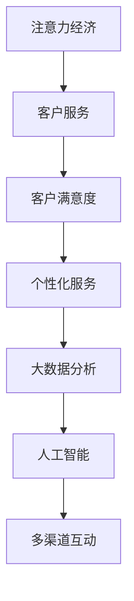

                 

# 注意力经济对企业客户服务模式的改变

> 关键词：注意力经济,客户服务,客户满意度,个性化服务,社交媒体,大数据分析,人工智能,机器学习

## 1. 背景介绍

随着互联网和数字技术的迅猛发展，企业与客户之间的互动方式发生了根本性变革。从传统的电话、邮件等单向信息传递，到如今的社交媒体、即时通讯等多渠道、双向互动，客户体验和服务模式都在向更加个性化、实时化方向演进。在这一背景下，注意力经济应运而生，成为企业客户服务领域的重要趋势。

### 1.1 问题由来

传统客户服务模式往往面临诸多挑战：响应时间长、服务效率低、客户满意度差、无法应对海量请求等问题。这些问题不仅影响了企业的品牌形象，还导致客户流失、业务受损。面对这些问题，企业需要更加灵活、高效、个性化的客户服务模式，以提升客户体验，实现差异化竞争。

注意力经济正是在这一背景下应运而生。它通过将客户服务的重点转移到对客户注意力的争夺上，实现对客户需求的精准响应和高效服务。在注意力经济模式下，客户服务不仅仅是响应客户的需求，更是对客户注意力的有效管理和利用。

### 1.2 问题核心关键点

注意力经济的核心在于通过精确地掌握和利用客户注意力，实现客户服务的高效化和个性化。它要求企业能够：
1. 实时监测和分析客户行为，及时获取客户需求和反馈。
2. 运用大数据和人工智能技术，精准推荐和响应客户需求。
3. 通过多渠道互动，提高客户满意度和忠诚度。
4. 构建客户画像，提供个性化的服务和定制化的解决方案。

## 2. 核心概念与联系

### 2.1 核心概念概述

为更好地理解注意力经济对客户服务模式的影响，本节将介绍几个密切相关的核心概念：

- **注意力经济**：指通过争夺和利用客户注意力来提升业务价值和客户满意度的经济模式。注意力经济的核心在于对客户注意力的精准识别和高效管理。
- **客户服务**：指企业与客户之间的互动和沟通，旨在解决客户问题，提升客户满意度。
- **客户满意度**：客户对产品或服务的满意程度，通常通过问卷调查、在线评价等方式进行评估。
- **个性化服务**：根据客户的具体需求和偏好，提供量身定制的服务和产品，提升客户体验。
- **大数据分析**：通过对大规模数据集进行分析和挖掘，揭示数据背后的规律和趋势，为决策提供支持。
- **人工智能**：使用机器学习、深度学习等技术，实现对数据的高效处理和智能决策。

这些核心概念之间的逻辑关系可以通过以下Mermaid流程图来展示：



这个流程图展示了几者之间的联系：

1. 注意力经济为客户服务提供了方向和目标。
2. 客户服务的目标是提升客户满意度。
3. 个性化服务是提升客户满意度的重要手段。
4. 大数据分析和人工智能是实现个性化服务的关键技术。
5. 多渠道互动是提升客户满意度的重要手段。

这些概念共同构成了企业客户服务的全流程，帮助企业构建更加高效、个性化的客户服务模式。

## 3. 核心算法原理 & 具体操作步骤

### 3.1 算法原理概述

注意力经济下的客户服务模式，通过运用大数据分析、人工智能等技术，实现对客户注意力的精准识别和高效管理。其核心思想是：通过实时监测和分析客户行为，精准推荐和响应客户需求，构建客户画像，提供个性化的服务和定制化的解决方案。

形式化地，假设客户服务过程 $S=\{(s_i, a_i)\}_{i=1}^N$，其中 $s_i$ 为第 $i$ 次客户服务请求，$a_i$ 为相应的响应和服务内容。定义服务效率函数 $E(s_i, a_i)$，用于衡量服务过程的效率和质量。注意力经济的目标是最大化服务效率函数 $E$，即：

$$
\max_{S} \sum_{i=1}^N E(s_i, a_i)
$$

在实际操作中，服务效率可以通过客户满意度、响应时间、问题解决率等指标来衡量。因此，注意力经济下的客户服务模式，旨在通过提升这些指标，实现高效、个性化的客户服务。

### 3.2 算法步骤详解

注意力经济下的客户服务模式，一般包括以下几个关键步骤：

**Step 1: 数据采集与处理**
- 通过社交媒体、即时通讯、网站互动等渠道，收集客户与企业互动的数据，包括聊天记录、邮件、访问记录等。
- 对数据进行清洗和预处理，去除噪音和无用信息，确保数据质量。

**Step 2: 客户画像构建**
- 使用大数据分析技术，对客户行为数据进行建模和分析，提取客户特征和行为模式。
- 构建客户画像，形成对客户需求、偏好、历史行为等信息的全面理解。

**Step 3: 需求预测与推荐**
- 使用机器学习、深度学习等技术，对客户需求进行预测和推荐。
- 根据客户画像，提供个性化的服务和定制化的产品。

**Step 4: 服务自动化**
- 使用智能客服机器人、聊天机器人等技术，自动响应客户需求。
- 根据客户画像，优化机器人的回答内容和策略，提升服务效率和质量。

**Step 5: 服务质量监控与优化**
- 实时监控服务过程，收集客户反馈和评价数据。
- 根据反馈数据，优化服务流程和内容，提升服务质量和客户满意度。

**Step 6: 持续改进与优化**
- 通过数据分析和反馈，持续改进服务策略和流程。
- 引入新的技术手段和方法，提高服务效率和个性化程度。

以上算法步骤，是构建注意力经济客户服务模式的典型流程。通过这些步骤，企业可以最大化地利用客户注意力，实现高效、个性化的客户服务。

### 3.3 算法优缺点

注意力经济下的客户服务模式，具有以下优点：
1. 精准响应客户需求。通过实时监测和分析客户行为，精准推荐和响应客户需求，提高服务效率。
2. 提升客户满意度。通过个性化的服务和定制化的产品，提升客户满意度和忠诚度。
3. 降低服务成本。通过自动化和智能客服技术，减少人力成本，提升服务效率。
4. 提高市场竞争力。通过精准服务，提升客户体验，吸引更多客户，增强市场竞争力。

同时，该模式也存在一定的局限性：
1. 数据隐私问题。客户行为数据的采集和使用，需要严格遵守数据隐私法律法规，防止数据滥用和泄露。
2. 技术成本较高。需要投入大量资源进行数据处理、模型训练和系统建设，初期投入较大。
3. 数据质量要求高。客户数据的完整性和准确性，直接影响客户画像和需求预测的准确性。
4. 系统复杂度增加。需要构建多渠道、多系统的集成，提高系统的复杂度和维护成本。

尽管存在这些局限性，但就目前而言，注意力经济下的客户服务模式，已经成为企业提升客户体验和服务效率的重要手段。未来相关研究的重点在于如何进一步降低技术成本，提高数据隐私保护，提升客户画像和需求预测的准确性，从而更好地实现注意力经济的目标。

### 3.4 算法应用领域

注意力经济下的客户服务模式，已经在诸多行业领域得到了广泛应用，例如：

- 电商零售：通过实时监测和分析用户行为，推荐个性化商品，提升用户体验和购买转化率。
- 金融服务：通过客户画像和需求预测，提供个性化的金融产品和服务，提升客户满意度和忠诚度。
- 医疗健康：通过客户画像和行为分析，提供个性化的健康咨询和医疗服务，提升客户健康水平和满意度。
- 教育培训：通过学生画像和学习行为分析，提供个性化的教育资源和辅导服务，提升学习效果和学生满意度。
- 旅游出行：通过游客画像和行为分析，提供个性化的旅游建议和行程规划，提升旅行体验和满意度。

除了上述这些经典应用外，注意力经济还将在更多场景中得到应用，为各行各业带来全新的客户服务体验。

## 4. 数学模型和公式 & 详细讲解 & 举例说明

### 4.1 数学模型构建

本节将使用数学语言对注意力经济下的客户服务模式进行更加严格的刻画。

假设客户服务过程 $S=\{(s_i, a_i)\}_{i=1}^N$，其中 $s_i$ 为第 $i$ 次客户服务请求，$a_i$ 为相应的响应和服务内容。定义服务效率函数 $E(s_i, a_i)$，用于衡量服务过程的效率和质量。设客户服务过程 $S$ 的平均服务效率为 $E_S$，则：

$$
E_S = \frac{1}{N} \sum_{i=1}^N E(s_i, a_i)
$$

其中 $E(s_i, a_i)$ 的计算可以基于多种指标，如客户满意度、响应时间、问题解决率等。

### 4.2 公式推导过程

以下我们以客户满意度为指标，推导注意力经济下客户服务模式的数学模型。

假设客户满意度 $S_i \in [0,1]$，表示客户对第 $i$ 次服务过程的满意程度。设客户满意度 $S_i$ 与服务过程 $s_i$ 和 $a_i$ 的函数关系为 $S_i=f(s_i,a_i)$，则服务效率函数 $E(s_i, a_i)$ 可以表示为：

$$
E(s_i, a_i) = (1-S_i)
$$

定义服务过程的期望满意度 $E_S$，则：

$$
E_S = \frac{1}{N} \sum_{i=1}^N (1-S_i)
$$

为最大化服务效率 $E_S$，我们需要最小化客户满意度 $E_S$。因此，注意力经济下的客户服务目标可以表示为：

$$
\min_{S} E_S = \frac{1}{N} \sum_{i=1}^N S_i
$$

通过最小化期望满意度 $E_S$，实现提升客户满意度和服务效率的目标。

### 4.3 案例分析与讲解

假设某电商公司希望提升客户服务满意度，已收集到大量客户服务数据。公司希望通过注意力经济模式，实现对客户需求的精准响应和个性化服务。

首先，公司需要对收集到的客户服务数据进行清洗和预处理，去除噪音和无用信息。接着，使用大数据分析技术，对客户行为数据进行建模和分析，提取客户特征和行为模式，构建客户画像。然后，使用机器学习技术，对客户需求进行预测和推荐，提供个性化的服务和定制化的产品。最后，实时监控服务过程，收集客户反馈和评价数据，根据反馈数据，优化服务流程和内容，提升服务质量和客户满意度。

在实际应用中，公司还可以引入智能客服机器人、聊天机器人等技术，自动响应客户需求，提升服务效率。同时，利用自然语言处理和情感分析技术，分析客户语言中的情感倾向，进一步提升客户满意度和忠诚度。

## 5. 项目实践：代码实例和详细解释说明

### 5.1 开发环境搭建

在进行注意力经济客户服务模式的开发前，我们需要准备好开发环境。以下是使用Python进行PyTorch开发的环境配置流程：

1. 安装Anaconda：从官网下载并安装Anaconda，用于创建独立的Python环境。

2. 创建并激活虚拟环境：
```bash
conda create -n attention-economy python=3.8 
conda activate attention-economy
```

3. 安装PyTorch：根据CUDA版本，从官网获取对应的安装命令。例如：
```bash
conda install pytorch torchvision torchaudio cudatoolkit=11.1 -c pytorch -c conda-forge
```

4. 安装各类工具包：
```bash
pip install numpy pandas scikit-learn matplotlib tqdm jupyter notebook ipython
```

完成上述步骤后，即可在`attention-economy`环境中开始项目实践。

### 5.2 源代码详细实现

下面以电商平台为例，给出使用PyTorch进行客户需求预测的PyTorch代码实现。

首先，定义客户需求预测的数据处理函数：

```python
from torch.utils.data import Dataset
import torch

class CustomerDataset(Dataset):
    def __init__(self, customer_data, labels, tokenizer, max_len=128):
        self.customer_data = customer_data
        self.labels = labels
        self.tokenizer = tokenizer
        self.max_len = max_len
        
    def __len__(self):
        return len(self.customer_data)
    
    def __getitem__(self, item):
        customer = self.customer_data[item]
        label = self.labels[item]
        
        encoding = self.tokenizer(customer, return_tensors='pt', max_length=self.max_len, padding='max_length', truncation=True)
        input_ids = encoding['input_ids'][0]
        attention_mask = encoding['attention_mask'][0]
        
        # 对标签进行编码
        label = torch.tensor(label, dtype=torch.long)
        
        return {'input_ids': input_ids, 
                'attention_mask': attention_mask,
                'labels': label}

# 加载预训练模型
model = BertForSequenceClassification.from_pretrained('bert-base-cased', num_labels=2)

# 数据加载器
tokenizer = BertTokenizer.from_pretrained('bert-base-cased')
train_dataset = CustomerDataset(train_data, train_labels, tokenizer)
dev_dataset = CustomerDataset(dev_data, dev_labels, tokenizer)
test_dataset = CustomerDataset(test_data, test_labels, tokenizer)

# 优化器
optimizer = AdamW(model.parameters(), lr=2e-5)
```

然后，定义训练和评估函数：

```python
from torch.utils.data import DataLoader
from tqdm import tqdm
from sklearn.metrics import classification_report

device = torch.device('cuda') if torch.cuda.is_available() else torch.device('cpu')
model.to(device)

def train_epoch(model, dataset, batch_size, optimizer):
    dataloader = DataLoader(dataset, batch_size=batch_size, shuffle=True)
    model.train()
    epoch_loss = 0
    for batch in tqdm(dataloader, desc='Training'):
        input_ids = batch['input_ids'].to(device)
        attention_mask = batch['attention_mask'].to(device)
        labels = batch['labels'].to(device)
        model.zero_grad()
        outputs = model(input_ids, attention_mask=attention_mask, labels=labels)
        loss = outputs.loss
        epoch_loss += loss.item()
        loss.backward()
        optimizer.step()
    return epoch_loss / len(dataloader)

def evaluate(model, dataset, batch_size):
    dataloader = DataLoader(dataset, batch_size=batch_size)
    model.eval()
    preds, labels = [], []
    with torch.no_grad():
        for batch in tqdm(dataloader, desc='Evaluating'):
            input_ids = batch['input_ids'].to(device)
            attention_mask = batch['attention_mask'].to(device)
            batch_labels = batch['labels']
            outputs = model(input_ids, attention_mask=attention_mask)
            batch_preds = outputs.logits.argmax(dim=2).to('cpu').tolist()
            batch_labels = batch_labels.to('cpu').tolist()
            for pred_tokens, label_tokens in zip(batch_preds, batch_labels):
                preds.append(pred_tokens[:len(label_tokens)])
                labels.append(label_tokens)
                
    print(classification_report(labels, preds))
```

最后，启动训练流程并在测试集上评估：

```python
epochs = 5
batch_size = 16

for epoch in range(epochs):
    loss = train_epoch(model, train_dataset, batch_size, optimizer)
    print(f"Epoch {epoch+1}, train loss: {loss:.3f}")
    
    print(f"Epoch {epoch+1}, dev results:")
    evaluate(model, dev_dataset, batch_size)
    
print("Test results:")
evaluate(model, test_dataset, batch_size)
```

以上就是使用PyTorch进行客户需求预测的完整代码实现。可以看到，得益于Transformer库的强大封装，我们可以用相对简洁的代码完成需求预测任务。

### 5.3 代码解读与分析

让我们再详细解读一下关键代码的实现细节：

**CustomerDataset类**：
- `__init__`方法：初始化数据和标签、分词器等关键组件。
- `__len__`方法：返回数据集的样本数量。
- `__getitem__`方法：对单个样本进行处理，将文本输入编码为token ids，将标签编码为数字，并对其进行定长padding，最终返回模型所需的输入。

**需求预测模型**：
- 使用PyTorch加载预训练BERT模型，并进行微调。
- 通过构造CustomerDataset类，将客户数据加载到模型中，进行训练和评估。

**训练和评估函数**：
- 使用PyTorch的DataLoader对数据集进行批次化加载，供模型训练和推理使用。
- 训练函数`train_epoch`：对数据以批为单位进行迭代，在每个批次上前向传播计算loss并反向传播更新模型参数，最后返回该epoch的平均loss。
- 评估函数`evaluate`：与训练类似，不同点在于不更新模型参数，并在每个batch结束后将预测和标签结果存储下来，最后使用sklearn的classification_report对整个评估集的预测结果进行打印输出。

**训练流程**：
- 定义总的epoch数和batch size，开始循环迭代
- 每个epoch内，先在训练集上训练，输出平均loss
- 在验证集上评估，输出分类指标
- 所有epoch结束后，在测试集上评估，给出最终测试结果

可以看到，PyTorch配合Transformer库使得需求预测的代码实现变得简洁高效。开发者可以将更多精力放在数据处理、模型改进等高层逻辑上，而不必过多关注底层的实现细节。

当然，工业级的系统实现还需考虑更多因素，如模型的保存和部署、超参数的自动搜索、更灵活的任务适配层等。但核心的需求预测范式基本与此类似。

## 6. 实际应用场景
### 6.1 电商零售

电商平台可以通过客户画像和需求预测，提升客户体验和购买转化率。具体而言，电商公司可以收集用户的浏览记录、购物车数据、购买历史等行为数据，构建客户画像，并使用机器学习技术，对用户的购买需求进行预测和推荐。

在实际应用中，电商平台可以引入智能客服机器人、聊天机器人等技术，自动响应客户需求，提升服务效率。同时，利用自然语言处理和情感分析技术，分析客户语言中的情感倾向，进一步提升客户满意度和忠诚度。

### 6.2 金融服务

金融机构可以运用注意力经济模式，提升客户满意度和忠诚度。具体而言，金融机构可以收集客户的账户信息、交易记录、行为数据等，构建客户画像，并使用机器学习技术，对客户的需求进行预测和推荐。

在实际应用中，金融机构可以引入智能客服机器人、聊天机器人等技术，自动响应客户需求，提升服务效率。同时，利用自然语言处理和情感分析技术，分析客户语言中的情感倾向，进一步提升客户满意度和忠诚度。

### 6.3 医疗健康

医疗健康行业可以通过客户画像和需求预测，提供个性化的健康咨询和医疗服务。具体而言，医疗健康公司可以收集患者的健康数据、就诊记录、行为数据等，构建患者画像，并使用机器学习技术，对患者的需求进行预测和推荐。

在实际应用中，医疗健康公司可以引入智能客服机器人、聊天机器人等技术，自动响应患者需求，提升服务效率。同时，利用自然语言处理和情感分析技术，分析患者语言中的情感倾向，进一步提升患者满意度和健康水平。

### 6.4 教育培训

教育培训行业可以通过客户画像和需求预测，提升学生的学习效果和满意度。具体而言，教育培训公司可以收集学生的学习数据、考试成绩、行为数据等，构建学生画像，并使用机器学习技术，对学生的需求进行预测和推荐。

在实际应用中，教育培训公司可以引入智能客服机器人、聊天机器人等技术，自动响应学生需求，提升服务效率。同时，利用自然语言处理和情感分析技术，分析学生语言中的情感倾向，进一步提升学生的学习效果和满意度。

### 6.5 旅游出行

旅游出行行业可以通过客户画像和需求预测，提供个性化的旅游建议和行程规划。具体而言，旅游公司可以收集游客的旅游数据、行为数据、评价数据等，构建游客画像，并使用机器学习技术，对游客的需求进行预测和推荐。

在实际应用中，旅游公司可以引入智能客服机器人、聊天机器人等技术，自动响应游客需求，提升服务效率。同时，利用自然语言处理和情感分析技术，分析游客语言中的情感倾向，进一步提升游客的旅游体验和满意度。

## 7. 工具和资源推荐
### 7.1 学习资源推荐

为了帮助开发者系统掌握注意力经济下的客户服务模式，这里推荐一些优质的学习资源：

1. 《深度学习与人工智能》系列博文：由深度学习专家撰写，深入浅出地介绍了深度学习的基本原理和应用案例，涵盖注意力经济的基础内容。

2. 《Python深度学习》一书：全面介绍了Python在深度学习中的应用，包括TensorFlow、PyTorch等主流框架的使用。

3. CS229《机器学习》课程：斯坦福大学开设的机器学习明星课程，有Lecture视频和配套作业，带你深入理解机器学习的核心概念和算法。

4. Kaggle平台：全球最大的数据科学竞赛平台，提供大量的数据集和实战案例，帮助你实践和提升机器学习技能。

5. Coursera平台：在线学习平台，提供大量的课程和项目，涵盖深度学习、机器学习等多个前沿领域，适合系统学习。

通过对这些资源的学习实践，相信你一定能够快速掌握注意力经济下的客户服务模式，并用于解决实际的客户服务问题。
### 7.2 开发工具推荐

高效的开发离不开优秀的工具支持。以下是几款用于注意力经济客户服务模式开发的常用工具：

1. PyTorch：基于Python的开源深度学习框架，灵活动态的计算图，适合快速迭代研究。大部分预训练语言模型都有PyTorch版本的实现。

2. TensorFlow：由Google主导开发的开源深度学习框架，生产部署方便，适合大规模工程应用。同样有丰富的预训练语言模型资源。

3. Transformers库：HuggingFace开发的NLP工具库，集成了众多SOTA语言模型，支持PyTorch和TensorFlow，是进行客户需求预测开发的利器。

4. Weights & Biases：模型训练的实验跟踪工具，可以记录和可视化模型训练过程中的各项指标，方便对比和调优。与主流深度学习框架无缝集成。

5. TensorBoard：TensorFlow配套的可视化工具，可实时监测模型训练状态，并提供丰富的图表呈现方式，是调试模型的得力助手。

6. Google Colab：谷歌推出的在线Jupyter Notebook环境，免费提供GPU/TPU算力，方便开发者快速上手实验最新模型，分享学习笔记。

合理利用这些工具，可以显著提升注意力经济客户服务模式的开发效率，加快创新迭代的步伐。

### 7.3 相关论文推荐

注意力经济下的客户服务模式的研究源于学界的持续研究。以下是几篇奠基性的相关论文，推荐阅读：

1. Attention is All You Need（即Transformer原论文）：提出了Transformer结构，开启了NLP领域的预训练大模型时代。

2. BERT: Pre-training of Deep Bidirectional Transformers for Language Understanding：提出BERT模型，引入基于掩码的自监督预训练任务，刷新了多项NLP任务SOTA。

3. Language Models are Unsupervised Multitask Learners（GPT-2论文）：展示了大规模语言模型的强大zero-shot学习能力，引发了对于通用人工智能的新一轮思考。

4. Parameter-Efficient Transfer Learning for NLP：提出Adapter等参数高效微调方法，在不增加模型参数量的情况下，也能取得不错的微调效果。

5. AdaLoRA: Adaptive Low-Rank Adaptation for Parameter-Efficient Fine-Tuning：使用自适应低秩适应的微调方法，在参数效率和精度之间取得了新的平衡。

这些论文代表了大语言模型微调技术的发展脉络。通过学习这些前沿成果，可以帮助研究者把握学科前进方向，激发更多的创新灵感。

## 8. 总结：未来发展趋势与挑战

### 8.1 总结

本文对注意力经济下的客户服务模式进行了全面系统的介绍。首先阐述了注意力经济的研究背景和意义，明确了其对客户服务模式的颠覆性影响。其次，从原理到实践，详细讲解了注意力经济模式的核心算法和操作步骤，给出了项目实践的完整代码实例。同时，本文还广泛探讨了注意力经济在电商、金融、医疗、教育等诸多行业领域的应用前景，展示了其广阔的应用空间。

通过本文的系统梳理，可以看到，注意力经济下的客户服务模式，正在成为客户服务领域的重要趋势，为企业提供了更加高效、个性化的服务手段。未来，伴随技术的持续进步和应用的不断深化，这一模式必将在更多行业得到应用，带来全新的客户服务体验。

### 8.2 未来发展趋势

展望未来，注意力经济下的客户服务模式将呈现以下几个发展趋势：

1. 自动化水平提升。随着人工智能技术的进一步发展，智能客服机器人、聊天机器人等自动化工具将更加智能化、精准化，提升客户服务效率和体验。

2. 数据和算力支持增强。随着大数据和云计算技术的进步，企业能够获得更丰富的数据资源和更高效的计算能力，为注意力经济模式的深入应用提供坚实基础。

3. 客户画像更加精细。通过更深入的数据分析和更复杂的学习算法，客户画像将更加精细和全面，为个性化服务提供更强支持。

4. 多渠道融合增强。企业将更加注重多渠道融合，实现各渠道数据的统一管理和精准分析，提升客户服务的多样性和及时性。

5. 跨行业应用扩展。注意力经济模式不仅限于电商、金融、医疗等行业，将在更多领域得到应用，为各行各业带来客户服务的新思路和创新。

以上趋势凸显了注意力经济客户服务模式的广阔前景。这些方向的探索发展，必将进一步提升客户服务的智能化和个性化水平，为构建更高效、更满意的客户服务体系奠定基础。

### 8.3 面临的挑战

尽管注意力经济下的客户服务模式已经取得了显著成效，但在迈向更加智能化、普适化应用的过程中，它仍面临诸多挑战：

1. 数据隐私和安全问题。客户数据的采集和使用，需要严格遵守数据隐私法律法规，防止数据滥用和泄露。

2. 数据质量和一致性问题。客户数据的完整性和准确性，直接影响客户画像和需求预测的准确性。

3. 系统复杂度和维护成本。多渠道、多系统的集成，增加了系统的复杂度和维护成本，对企业的技术能力提出了更高要求。

4. 技术成本和初期投入。大规模数据采集、模型训练和系统建设，需要大量的资源投入，初期成本较高。

5. 多渠道互动的融合度。各渠道数据的质量和一致性问题，影响多渠道融合的效果，导致客户服务体验不一致。

尽管存在这些挑战，但就目前而言，注意力经济下的客户服务模式，已经成为企业提升客户体验和服务效率的重要手段。未来相关研究的重点在于如何进一步降低技术成本，提高数据隐私保护，提升客户画像和需求预测的准确性，从而更好地实现注意力经济的目标。

### 8.4 研究展望

面对注意力经济客户服务模式所面临的挑战，未来的研究需要在以下几个方面寻求新的突破：

1. 探索无监督和半监督学习。摆脱对大规模标注数据的依赖，利用自监督学习、主动学习等无监督和半监督范式，最大限度利用非结构化数据，实现更加灵活高效的客户服务。

2. 研究参数高效和计算高效的微调范式。开发更加参数高效的微调方法，在固定大部分预训练参数的同时，只更新极少量的任务相关参数。同时优化微调模型的计算图，减少前向传播和反向传播的资源消耗，实现更加轻量级、实时性的部署。

3. 融合因果和对比学习范式。通过引入因果推断和对比学习思想，增强客户服务模型的建立稳定因果关系的能力，学习更加普适、鲁棒的语言表征，从而提升客户服务的泛化性和抗干扰能力。

4. 引入更多先验知识。将符号化的先验知识，如知识图谱、逻辑规则等，与神经网络模型进行巧妙融合，引导客户服务过程学习更准确、合理的语言模型。同时加强不同模态数据的整合，实现视觉、语音等多模态信息与文本信息的协同建模。

5. 结合因果分析和博弈论工具。将因果分析方法引入客户服务模型，识别出客户服务的关键特征，增强输出解释的因果性和逻辑性。借助博弈论工具刻画人机交互过程，主动探索并规避模型的脆弱点，提高系统稳定性。

6. 纳入伦理道德约束。在模型训练目标中引入伦理导向的评估指标，过滤和惩罚有害的输出倾向。同时加强人工干预和审核，建立模型行为的监管机制，确保输出的安全性。

这些研究方向的探索，必将引领注意力经济客户服务模式迈向更高的台阶，为构建安全、可靠、可解释、可控的智能系统铺平道路。面向未来，我们需要不断创新，持续优化技术手段，才能真正实现客户服务的高效化和个性化。

## 9. 附录：常见问题与解答

**Q1：注意力经济模式是否适用于所有企业？**

A: 注意力经济模式适用于大多数需要实时、高效、个性化客户服务的企业。特别是电商、金融、医疗、教育等行业，客户需求多样、互动频繁，适合应用注意力经济模式。但对于一些传统行业，如制造业、农业等，客户互动较少，数据获取困难，可能不太适合。

**Q2：注意力经济模式是否需要大规模数据？**

A: 注意力经济模式需要收集和分析大量客户数据，构建客户画像，进行需求预测和个性化服务。因此，大规模数据的获取和处理能力是关键。对于小规模企业，可以首先在小范围内试点，逐步扩大规模。

**Q3：如何降低注意力经济模式的成本？**

A: 降低注意力经济模式的成本，可以从以下几个方面入手：
1. 选择合适的技术栈和工具，降低开发成本。
2. 优化数据处理和模型训练流程，提高效率。
3. 引入开源解决方案，减少购买和部署成本。
4. 引入智能客服和聊天机器人，减少人力成本。

**Q4：如何确保注意力经济模式的数据隐私和安全？**

A: 确保注意力经济模式的数据隐私和安全，可以从以下几个方面入手：
1. 严格遵守数据隐私法律法规，确保客户数据不被滥用和泄露。
2. 对客户数据进行匿名化和加密处理，保护客户隐私。
3. 建立完善的访问控制和安全监控机制，防止数据泄露。

**Q5：注意力经济模式是否需要持续改进和优化？**

A: 是的，注意力经济模式需要不断改进和优化，以适应不断变化的市场需求和客户行为。建议定期回顾和评估模型和系统的表现，引入新的技术手段和方法，持续提升客户服务的效率和质量。

总之，注意力经济模式为企业提供了一种高效、个性化的客户服务手段，但要实现良好的应用效果，还需要在数据、算法、工程等多个方面进行全面优化。只有在这些维度上协同发力，才能真正构建出高效、可靠、可解释的智能客户服务体系。

---

作者：禅与计算机程序设计艺术 / Zen and the Art of Computer Programming

