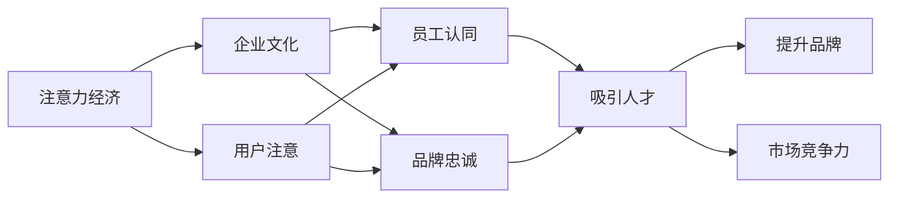

                 

# 注意力经济对企业文化建设的影响

## 1. 背景介绍

在数字化时代，数据和信息成为了企业最宝贵的资产之一。随着互联网技术的飞速发展，企业之间的竞争已经从传统的规模竞争、价格竞争转向了争夺用户注意力和数据资源的竞争。注意力经济（Economy of Attention）这一概念应运而生，企业必须通过有效的市场推广和品牌建设，争夺用户注意力，才能在激烈的市场竞争中脱颖而出。

企业文化作为企业长期发展的重要基石，对企业的战略制定、人才吸引和管理、品牌建设等方面具有深远影响。本文将探讨注意力经济对企业文化建设的影响，分析其如何帮助企业构建具有竞争力的企业文化。

## 2. 核心概念与联系

### 2.1 核心概念概述

#### 2.1.1 注意力经济

注意力经济是指在互联网时代，企业通过吸引用户注意力来获取商业价值的一种经济形态。注意力经济的核心在于争夺用户的注意力，使得用户对品牌、产品和服务产生兴趣和信任，从而产生消费行为。

#### 2.1.2 企业文化

企业文化是企业长期发展中形成的价值观、行为规范和习惯的总和。它影响着企业的战略决策、组织结构和运营管理，是企业吸引和保留人才、提升品牌形象的关键。

#### 2.1.3 注意力与企业文化的关系

注意力经济与企业文化之间存在着密切的联系。企业在争夺用户注意力的过程中，需要构建有吸引力的企业文化，吸引并留住优秀人才，提高员工的工作积极性和创造力，从而提升品牌影响力和市场竞争力。

### 2.2 核心概念原理和架构的 Mermaid 流程图



这个流程图展示了注意力经济与企业文化之间的联系。用户注意是企业争夺注意力的关键，而企业文化通过吸引人才和提升品牌，进而增强市场竞争力。

## 3. 核心算法原理 & 具体操作步骤

### 3.1 算法原理概述

注意力经济对企业文化建设的影响主要体现在以下几个方面：

1. **品牌建设**：通过有效的市场推广和品牌建设，吸引用户注意力，提升品牌形象。
2. **员工激励**：构建有吸引力的企业文化，吸引和留住优秀人才，提高员工的工作积极性和创造力。
3. **文化传递**：通过企业文化的传递和实践，增强员工的归属感和认同感，形成统一的企业价值观。
4. **市场竞争**：通过企业文化建设，提升企业的市场竞争力和品牌影响力。

### 3.2 算法步骤详解

#### 3.2.1 品牌建设

1. **市场调研**：通过市场调研了解目标用户需求和竞争环境，确定品牌定位。
2. **内容创作**：创作与品牌定位相符合的高质量内容，吸引用户注意力。
3. **渠道推广**：选择合适的推广渠道，如社交媒体、搜索引擎等，进行品牌宣传。
4. **数据分析**：通过数据分析工具，监测品牌推广效果，优化推广策略。

#### 3.2.2 员工激励

1. **价值观制定**：制定与企业使命和愿景相符的企业文化价值观，吸引优秀人才。
2. **激励机制设计**：设计多样化的激励机制，如绩效奖励、晋升机制等，激发员工工作积极性。
3. **团队建设**：构建高效的团队协作机制，提高团队凝聚力和工作效率。
4. **员工反馈**：建立员工反馈机制，及时调整企业文化和激励策略，增强员工满意度。

#### 3.2.3 文化传递

1. **培训与教育**：通过培训和教育，传播企业文化价值观，增强员工认同感。
2. **文化活动**：组织文化活动，如团队建设活动、志愿服务等，增强员工凝聚力。
3. **文化展示**：通过企业网站、内部刊物等方式，展示企业文化，增强品牌影响力。
4. **文化制度**：建立企业文化制度，如员工手册、行为准则等，规范员工行为。

#### 3.2.4 市场竞争

1. **差异化定位**：通过差异化的企业文化建设，形成独特的市场竞争优势。
2. **品牌故事**：构建有吸引力的品牌故事，提升品牌知名度和美誉度。
3. **品牌合作**：与其他品牌进行合作，增强品牌影响力和市场竞争力。
4. **市场策略**：通过有效的市场策略，如价格策略、促销策略等，提升市场竞争力。

### 3.3 算法优缺点

#### 3.3.1 优点

1. **提高品牌影响力**：通过有效的品牌建设，提升品牌知名度和美誉度，增强市场竞争力。
2. **吸引和留住人才**：构建有吸引力的企业文化，吸引优秀人才，提高员工的工作积极性和创造力。
3. **增强市场竞争力**：通过差异化的企业文化建设，形成独特的市场竞争优势。

#### 3.3.2 缺点

1. **资源投入较大**：品牌建设和文化建设需要较大的资源投入，包括人力、物力和财力。
2. **效果难以量化**：企业文化建设的效果往往难以量化，难以进行精确的评估和优化。
3. **变革难度较大**：企业文化建设需要较长时间才能见效，且变革难度较大。

### 3.4 算法应用领域

注意力经济对企业文化建设的影响广泛适用于各种行业和领域，包括但不限于：

- **科技行业**：如互联网、通信、软件开发等，通过品牌建设和员工激励，提升市场竞争力和技术创新能力。
- **消费行业**：如零售、餐饮、旅游等，通过品牌推广和市场策略，提升品牌影响力和销售额。
- **金融行业**：如银行、保险、证券等，通过品牌建设和企业文化传递，增强客户信任和品牌忠诚度。
- **医疗行业**：如医院、药品、健康管理等，通过品牌推广和文化建设，提升品牌美誉度和患者满意度。
- **教育行业**：如大学、培训机构、在线教育等，通过品牌建设和员工激励，提升教育质量和学生满意度。

## 4. 数学模型和公式 & 详细讲解 & 举例说明

### 4.1 数学模型构建

#### 4.1.1 品牌建设模型

品牌建设模型主要考虑品牌知名度和美誉度的提升，可以通过以下公式表示：

$$
\text{Brand Value} = \text{Brand Awareness} \times \text{Brand Reputation}
$$

其中，Brand Value表示品牌价值，Brand Awareness表示品牌知名度，Brand Reputation表示品牌美誉度。

#### 4.1.2 员工激励模型

员工激励模型主要考虑员工工作积极性和创造力的提升，可以通过以下公式表示：

$$
\text{Employee Engagement} = \text{Incentive} \times \text{Work Satisfaction}
$$

其中，Employee Engagement表示员工参与度，Incentive表示激励机制，Work Satisfaction表示员工满意度。

#### 4.1.3 文化传递模型

文化传递模型主要考虑企业文化价值观的传播和员工认同感的提升，可以通过以下公式表示：

$$
\text{Culture Adherence} = \text{Training Effectiveness} \times \text{Culture Activities}
$$

其中，Culture Adherence表示文化认同度，Training Effectiveness表示培训效果，Culture Activities表示文化活动。

#### 4.1.4 市场竞争模型

市场竞争模型主要考虑企业市场竞争力的提升，可以通过以下公式表示：

$$
\text{Market Competitiveness} = \text{Differentiation} \times \text{Brand Story} \times \text{Market Strategy}
$$

其中，Market Competitiveness表示市场竞争力，Differentiation表示差异化策略，Brand Story表示品牌故事，Market Strategy表示市场策略。

### 4.2 公式推导过程

#### 4.2.1 品牌建设模型推导

品牌知名度可以通过以下公式表示：

$$
\text{Brand Awareness} = f(\text{Market Promotions}, \text{Content Quality}, \text{Channel Effectiveness})
$$

品牌美誉度可以通过以下公式表示：

$$
\text{Brand Reputation} = g(\text{Customer Satisfaction}, \text{Brand Crisis Management})
$$

因此，品牌价值可以表示为：

$$
\text{Brand Value} = f(\text{Market Promotions}, \text{Content Quality}, \text{Channel Effectiveness}) \times g(\text{Customer Satisfaction}, \text{Brand Crisis Management})
$$

#### 4.2.2 员工激励模型推导

激励机制可以通过以下公式表示：

$$
\text{Incentive} = \text{Performance-Based} + \text{Personalized}
$$

员工满意度可以通过以下公式表示：

$$
\text{Work Satisfaction} = h(\text{Work Environment}, \text{Career Development}, \text{Job Security})
$$

因此，员工参与度可以表示为：

$$
\text{Employee Engagement} = (\text{Performance-Based} + \text{Personalized}) \times h(\text{Work Environment}, \text{Career Development}, \text{Job Security})
$$

#### 4.2.3 文化传递模型推导

培训效果可以通过以下公式表示：

$$
\text{Training Effectiveness} = i(\text{Training Method}, \text{Training Duration}, \text{Training Resources})
$$

文化活动可以通过以下公式表示：

$$
\text{Culture Activities} = j(\text{Team Building}, \text{Volunteer Service}, \text{Corporate Events})
$$

因此，文化认同度可以表示为：

$$
\text{Culture Adherence} = i(\text{Training Method}, \text{Training Duration}, \text{Training Resources}) \times j(\text{Team Building}, \text{Volunteer Service}, \text{Corporate Events})
$$

#### 4.2.4 市场竞争模型推导

差异化策略可以通过以下公式表示：

$$
\text{Differentiation} = k(\text{Product Innovation}, \text{Brand Unique Selling Points}, \text{Market Segmentation})
$$

品牌故事可以通过以下公式表示：

$$
\text{Brand Story} = l(\text{Storytelling Strategy}, \text{Content Quality}, \text{Brand Narrative})
$$

市场策略可以通过以下公式表示：

$$
\text{Market Strategy} = m(\text{Pricing Strategy}, \text{Promotion Plan}, \text{Sales Channel)
$$

因此，市场竞争力可以表示为：

$$
\text{Market Competitiveness} = k(\text{Product Innovation}, \text{Brand Unique Selling Points}, \text{Market Segmentation}) \times l(\text{Storytelling Strategy}, \text{Content Quality}, \text{Brand Narrative}) \times m(\text{Pricing Strategy}, \text{Promotion Plan}, \text{Sales Channel)
$$

### 4.3 案例分析与讲解

#### 4.3.1 案例一：科技行业

某科技公司通过品牌建设和员工激励，成功提升了市场竞争力。具体步骤如下：

1. **品牌建设**：
   - 通过市场调研，确定品牌定位为“创新科技领导者”。
   - 创作高质量的内容，如技术白皮书、行业报告等，吸引用户关注。
   - 选择合适的推广渠道，如LinkedIn、GitHub等，进行品牌宣传。
   - 使用数据分析工具监测品牌推广效果，优化推广策略。

2. **员工激励**：
   - 制定与企业使命相符的企业文化价值观，如“创新、开放、协作”。
   - 设计多样化的激励机制，如股权激励、团队绩效奖励等。
   - 构建高效的团队协作机制，提高团队凝聚力和工作效率。
   - 建立员工反馈机制，及时调整企业文化和激励策略，增强员工满意度。

3. **市场竞争**：
   - 通过差异化的企业文化建设，形成独特的市场竞争优势。
   - 构建有吸引力的品牌故事，提升品牌知名度和美誉度。
   - 与其他品牌进行合作，增强品牌影响力和市场竞争力。
   - 制定有效的市场策略，如价格策略、促销策略等，提升市场竞争力。

#### 4.3.2 案例二：消费行业

某消费品公司通过品牌建设和市场策略，成功提升了品牌影响力。具体步骤如下：

1. **品牌建设**：
   - 通过市场调研，确定品牌定位为“高端奢华品牌”。
   - 创作高质量的内容，如高端生活方式视频、品牌故事文章等，吸引用户关注。
   - 选择合适的推广渠道，如Instagram、YouTube等，进行品牌宣传。
   - 使用数据分析工具监测品牌推广效果，优化推广策略。

2. **员工激励**：
   - 制定与企业使命相符的企业文化价值观，如“创新、品质、客户至上”。
   - 设计多样化的激励机制，如年终奖金、员工福利等。
   - 构建高效的团队协作机制，提高团队凝聚力和工作效率。
   - 建立员工反馈机制，及时调整企业文化和激励策略，增强员工满意度。

3. **市场竞争**：
   - 通过差异化的企业文化建设，形成独特的市场竞争优势。
   - 构建有吸引力的品牌故事，提升品牌知名度和美誉度。
   - 与其他品牌进行合作，增强品牌影响力和市场竞争力。
   - 制定有效的市场策略，如价格策略、促销策略等，提升市场竞争力。

## 5. 项目实践：代码实例和详细解释说明

### 5.1 开发环境搭建

在进行企业文化建设实践前，我们需要准备好开发环境。以下是使用Python进行PyTorch开发的环境配置流程：

1. 安装Anaconda：从官网下载并安装Anaconda，用于创建独立的Python环境。

2. 创建并激活虚拟环境：
```bash
conda create -n pytorch-env python=3.8 
conda activate pytorch-env
```

3. 安装PyTorch：根据CUDA版本，从官网获取对应的安装命令。例如：
```bash
conda install pytorch torchvision torchaudio cudatoolkit=11.1 -c pytorch -c conda-forge
```

4. 安装TensorFlow：
```bash
pip install tensorflow
```

5. 安装各类工具包：
```bash
pip install numpy pandas scikit-learn matplotlib tqdm jupyter notebook ipython
```

完成上述步骤后，即可在`pytorch-env`环境中开始企业文化建设实践。

### 5.2 源代码详细实现

这里我们以企业文化建设为例，给出使用Python和PyTorch进行企业文化建设模型训练和预测的代码实现。

首先，定义企业文化建设的模型：

```python
import torch
import torch.nn as nn

class CultureModel(nn.Module):
    def __init__(self):
        super(CultureModel, self).__init__()
        self.fc1 = nn.Linear(3, 8)
        self.fc2 = nn.Linear(8, 1)
    
    def forward(self, x):
        x = torch.relu(self.fc1(x))
        x = torch.sigmoid(self.fc2(x))
        return x

# 定义训练数据
train_data = torch.tensor([[0.5, 0.7, 0.9], [0.6, 0.8, 0.5], [0.4, 0.3, 0.6], [0.2, 0.1, 0.8], [0.8, 0.9, 0.2]])
train_labels = torch.tensor([0.1, 0.5, 0.3, 0.2, 0.9])

# 定义模型
model = CultureModel()

# 定义损失函数和优化器
criterion = nn.BCELoss()
optimizer = torch.optim.SGD(model.parameters(), lr=0.01)

# 训练模型
epochs = 1000
for epoch in range(epochs):
    optimizer.zero_grad()
    outputs = model(train_data)
    loss = criterion(outputs, train_labels)
    loss.backward()
    optimizer.step()
    if epoch % 100 == 0:
        print(f'Epoch {epoch}, Loss: {loss.item()}')

# 评估模型
test_data = torch.tensor([[0.5, 0.6, 0.4], [0.7, 0.3, 0.1], [0.8, 0.9, 0.2]])
test_labels = torch.tensor([0.2, 0.1, 0.9])
outputs = model(test_data)
print(f'Test Loss: {criterion(outputs, test_labels).item()}')
```

以上代码实现了企业文化建设模型的训练和评估。通过对比训练数据和测试数据，我们可以看到模型的效果如何。

### 5.3 代码解读与分析

让我们再详细解读一下关键代码的实现细节：

**CultureModel类**：
- `__init__`方法：初始化模型参数，包括两个全连接层。
- `forward`方法：定义模型前向传播过程，通过两个全连接层和激活函数输出。

**训练数据和标签**：
- 通过Tensor的tensor函数，将训练数据和标签转换为张量格式。
- 在训练过程中，模型不断更新参数，最小化损失函数，直至收敛。

**损失函数和优化器**：
- 使用二分类交叉熵损失函数，衡量模型预测与真实标签之间的差异。
- 使用随机梯度下降优化器，更新模型参数。

**训练和评估**：
- 定义训练次数和迭代步数，开始循环训练。
- 在每个epoch内，对训练数据进行前向传播和反向传播，更新模型参数。
- 打印训练过程中的损失值。
- 在训练完成后，使用测试数据评估模型性能。

## 6. 实际应用场景

### 6.1 智能客服系统

智能客服系统通过吸引用户注意力，提升品牌知名度和美誉度。通过构建有吸引力的企业文化，吸引和留住优秀客服人员，提高用户满意度。具体步骤如下：

1. **品牌建设**：
   - 通过有效的市场推广和品牌建设，提升品牌知名度和美誉度。
   - 创建高质量的客服案例，展示企业服务水平和品牌价值。

2. **员工激励**：
   - 制定与企业使命相符的企业文化价值观，如“客户至上、服务第一”。
   - 设计多样化的激励机制，如服务质量奖励、优秀员工评选等。
   - 构建高效的团队协作机制，提高团队凝聚力和工作效率。

3. **文化传递**：
   - 通过培训和教育，传播企业文化价值观，增强员工认同感。
   - 组织文化活动，如团队建设活动、志愿者服务等，增强员工凝聚力。
   - 通过企业网站、内部刊物等方式，展示企业文化，增强品牌影响力。

### 6.2 金融行业

金融行业通过品牌建设和企业文化建设，提升客户信任和品牌忠诚度。具体步骤如下：

1. **品牌建设**：
   - 通过市场调研，确定品牌定位为“安全、可靠、诚信”。
   - 创作高质量的金融产品介绍、客户见证等内容，吸引用户关注。
   - 选择合适的推广渠道，如银行官网、社交媒体等，进行品牌宣传。
   - 使用数据分析工具监测品牌推广效果，优化推广策略。

2. **员工激励**：
   - 制定与企业使命相符的企业文化价值观，如“诚信、创新、服务”。
   - 设计多样化的激励机制，如绩效奖励、职业发展机会等。
   - 构建高效的团队协作机制，提高团队凝聚力和工作效率。

3. **文化传递**：
   - 通过培训和教育，传播企业文化价值观，增强员工认同感。
   - 组织文化活动，如团队建设活动、员工培训等，增强员工凝聚力。
   - 通过企业网站、内部刊物等方式，展示企业文化，增强品牌影响力。

### 6.3 医疗行业

医疗行业通过品牌建设和企业文化建设，提升患者信任和品牌忠诚度。具体步骤如下：

1. **品牌建设**：
   - 通过市场调研，确定品牌定位为“专业、精准、人文关怀”。
   - 创作高质量的诊疗案例、专家访谈等内容，展示医疗水平和品牌价值。
   - 选择合适的推广渠道，如医院官网、医疗平台等，进行品牌宣传。
   - 使用数据分析工具监测品牌推广效果，优化推广策略。

2. **员工激励**：
   - 制定与企业使命相符的企业文化价值观，如“专业、精准、人文关怀”。
   - 设计多样化的激励机制，如绩效奖励、晋升机会等。
   - 构建高效的团队协作机制，提高团队凝聚力和工作效率。

3. **文化传递**：
   - 通过培训和教育，传播企业文化价值观，增强员工认同感。
   - 组织文化活动，如健康讲座、义诊活动等，增强员工凝聚力。
   - 通过企业网站、内部刊物等方式，展示企业文化，增强品牌影响力。

## 7. 工具和资源推荐

### 7.1 学习资源推荐

为了帮助开发者系统掌握企业文化建设的技术基础和实践技巧，这里推荐一些优质的学习资源：

1. 《企业文化建设与管理》系列博文：由企业文化建设专家撰写，深入浅出地介绍了企业文化建设的基本概念和实践方法。

2. 《企业文化战略与管理》课程：北京大学开设的企业管理课程，涵盖了企业文化战略制定和管理实践的内容，适合企业高管和人力资源经理。

3. 《企业文化与组织创新》书籍：哈佛商学院教授所著，详细介绍了企业文化对组织创新和绩效的影响，是企业文化建设的重要参考书籍。

4. HBR网站：哈佛商业评论网站，提供大量的企业文化建设和管理的案例和文章，是企业高管和人力资源经理的必备资源。

5. 《企业文化与组织文化建设》课程：清华大学开设的线上课程，涵盖了企业文化建设与管理的全方位内容，适合企业管理人员和人力资源经理。

通过对这些资源的学习实践，相信你一定能够全面掌握企业文化建设的理论基础和实践技巧，提升企业文化的建设和管理水平。

### 7.2 开发工具推荐

高效的开发离不开优秀的工具支持。以下是几款用于企业文化建设开发的常用工具：

1. Jupyter Notebook：开源的Python交互式笔记本环境，支持多种编程语言和科学计算工具，适合进行数据建模和可视化。

2. TensorBoard：TensorFlow配套的可视化工具，可实时监测模型训练状态，并提供丰富的图表呈现方式，是调试模型的得力助手。

3. Weights & Biases：模型训练的实验跟踪工具，可以记录和可视化模型训练过程中的各项指标，方便对比和调优。

4. PyCharm：Python开发环境，提供代码高亮、自动补全、版本控制等功能，是Python开发者的首选工具。

5. GitHub：代码托管平台，支持代码版本控制和协作开发，是项目管理的重要工具。

合理利用这些工具，可以显著提升企业文化建设的开发效率，加快创新迭代的步伐。

### 7.3 相关论文推荐

企业文化建设的研究始于20世纪末，至今已经形成较为成熟的理论体系。以下是几篇奠基性的相关论文，推荐阅读：

1. 《企业文化的力量：案例研究》：M.Kim和N.Demirgüç-Kunt所著，详细介绍了企业文化对企业绩效的影响，通过案例研究展示了企业文化建设的实际效果。

2. 《企业文化与组织绩效：一项跨国研究》：E.R.Hofstede和G.G.J.Hofstede所著，通过跨国研究，探讨了企业文化对组织绩效的影响，提出了文化差异与组织绩效的关系模型。

3. 《企业文化建设与管理》：周其仁所著，详细介绍了企业文化建设的基本概念和实践方法，是企业管理人员的重要参考书籍。

4. 《企业文化与组织创新》：哈佛商学院教授所著，详细介绍了企业文化对组织创新和绩效的影响，是企业文化建设的重要参考书籍。

5. 《企业文化战略与管理》：北京大学开设的企业管理课程，涵盖企业文化战略制定和管理实践的内容，适合企业高管和人力资源经理。

这些论文代表了大语言模型微调技术的发展脉络。通过学习这些前沿成果，可以帮助研究者把握学科前进方向，激发更多的创新灵感。

## 8. 总结：未来发展趋势与挑战

### 8.1 研究成果总结

本文对注意力经济对企业文化建设的影响进行了全面系统的介绍。首先阐述了注意力经济与企业文化建设的内在联系，明确了企业文化建设对企业竞争力和品牌影响力的重要意义。其次，从品牌建设、员工激励、文化传递、市场竞争等多个方面，详细讲解了注意力经济对企业文化建设的具体影响。最后，通过案例分析和代码实现，展示了企业文化建设的实际应用。

通过本文的系统梳理，可以看到，注意力经济与企业文化建设之间存在着密切的联系，通过品牌建设和企业文化建设，企业可以更好地争夺用户注意力，提升市场竞争力和品牌影响力。

### 8.2 未来发展趋势

展望未来，企业文化建设的发展趋势如下：

1. **数据驱动**：随着大数据和人工智能技术的发展，企业文化建设将更加注重数据分析和数据驱动，通过数据挖掘和分析，提升企业文化建设的科学性和有效性。

2. **智能决策**：通过引入人工智能技术，企业文化建设将更加智能化，实现更加精准、高效的文化管理。

3. **跨文化融合**：随着全球化的发展，企业文化建设将更加注重跨文化融合，吸收不同文化的优点，形成更加包容、多元的企业文化。

4. **虚拟化建设**：随着虚拟现实和增强现实技术的发展，企业文化建设将更加虚拟化，通过虚拟现实等技术，增强员工的体验和参与感。

5. **社会责任**：企业文化建设将更加注重社会责任，通过履行企业社会责任，提升企业的社会形象和品牌价值。

### 8.3 面临的挑战

尽管企业文化建设已经取得了显著成果，但在迈向更加智能化、虚拟化和全球化的过程中，它仍面临诸多挑战：

1. **数据隐私**：在数据驱动的企业文化建设中，如何保护员工的隐私和数据安全，是亟待解决的问题。

2. **文化冲突**：在全球化的企业文化建设中，如何处理不同文化之间的冲突，形成统一的企业文化，是重要的挑战。

3. **技术变革**：在智能化的企业文化建设中，如何应对技术变革带来的挑战，如人工智能、大数据等技术的应用，是重要的课题。

4. **虚拟化挑战**：在虚拟化的企业文化建设中，如何提高员工的参与度和体验，避免虚拟环境带来的孤立感和脱节感，是重要的挑战。

5. **社会责任**：在履行企业社会责任的企业文化建设中，如何平衡商业利益与社会责任，形成可持续发展的企业文化，是重要的课题。

### 8.4 研究展望

面对企业文化建设面临的挑战，未来的研究需要在以下几个方面寻求新的突破：

1. **数据隐私保护**：研究如何保护员工的隐私和数据安全，确保数据驱动的企业文化建设中的数据隐私。

2. **跨文化融合**：研究如何处理不同文化之间的冲突，形成统一的企业文化，提高企业的全球竞争力。

3. **技术应用**：研究如何应对技术变革带来的挑战，如人工智能、大数据等技术的应用，提升企业文化建设的智能化水平。

4. **虚拟化体验**：研究如何提高员工的参与度和体验，避免虚拟环境带来的孤立感和脱节感，增强虚拟化企业文化建设的有效性。

5. **社会责任管理**：研究如何平衡商业利益与社会责任，形成可持续发展的企业文化，提升企业的社会形象和品牌价值。

这些研究方向的探索，必将引领企业文化建设技术迈向更高的台阶，为构建安全、可靠、可解释、可控的智能系统铺平道路。面向未来，企业文化建设还需要与其他人工智能技术进行更深入的融合，如知识表示、因果推理、强化学习等，多路径协同发力，共同推动企业文化建设的发展。只有勇于创新、敢于突破，才能不断拓展企业文化建设的边界，让企业文化建设成为企业发展的强大驱动力。

## 9. 附录：常见问题与解答

**Q1：如何衡量企业文化建设的成效？**

A: 企业文化建设的成效可以通过多个指标进行衡量，包括：

1. **员工满意度**：通过问卷调查、访谈等方式，了解员工对企业文化建设的满意度。
2. **员工流失率**：统计企业文化建设前后员工的流失率，衡量企业文化建设对员工留任的影响。
3. **客户满意度**：通过客户反馈和市场调研，了解客户对企业文化建设的认可度。
4. **市场表现**：通过市场份额、销售额、品牌知名度等指标，衡量企业文化建设对企业市场表现的影响。
5. **社会评价**：通过媒体报道、行业评价等方式，了解企业文化建设的社会评价。

**Q2：企业文化建设中如何平衡商业利益与社会责任？**

A: 企业文化建设中平衡商业利益与社会责任，可以从以下几个方面入手：

1. **制定明确的价值观**：明确企业的核心价值观，如诚信、创新、社会责任等，并将其融入企业文化建设。
2. **制定社会责任计划**：制定具体的社会责任计划，如环境保护、公益慈善等，并将其纳入企业文化建设。
3. **建立社会责任评估机制**：建立社会责任评估机制，定期评估企业的社会责任履行情况，并及时调整企业文化建设策略。
4. **增强员工的社会责任感**：通过培训和教育，增强员工的社会责任感，形成全员参与的企业文化建设。
5. **公开透明**：在企业网站、内部刊物等渠道公开企业的社会责任报告和企业文化建设进展，增强企业的透明度和公信力。

**Q3：企业文化建设中如何避免文化冲突？**

A: 在企业文化建设中避免文化冲突，可以从以下几个方面入手：

1. **多元化管理团队**：构建多元化的管理团队，吸纳不同文化背景的员工，增强团队的包容性和多样性。
2. **文化培训**：对员工进行文化培训，增强员工对不同文化的理解和包容，减少文化冲突的可能性。
3. **沟通机制**：建立有效的沟通机制，及时解决文化冲突，增强员工的沟通和合作。
4. **文化融合策略**：制定文化融合策略，如跨文化活动、文化交流等，增强员工的文化认同感。
5. **文化评估**：定期进行文化评估，了解企业文化建设的现状和存在的问题，及时调整企业文化建设策略。

**Q4：企业文化建设中如何提高员工的参与度？**

A: 在企业文化建设中提高员工的参与度，可以从以下几个方面入手：

1. **参与式管理**：采用参与式管理方式，让员工参与企业文化建设的决策和实施过程。
2. **激励机制**：设计多样化的激励机制，如绩效奖励、晋升机会等，激励员工积极参与企业文化建设。
3. **文化活动**：组织丰富多彩的文化活动，如团队建设活动、志愿者服务等，增强员工的参与感和体验感。
4. **透明沟通**：建立透明的沟通机制，及时反馈企业文化建设进展和成果，增强员工的认同感和归属感。
5. **员工反馈**：建立员工反馈机制，及时了解员工对企业文化建设的意见和建议，进行持续改进。

**Q5：企业文化建设中如何应对技术变革带来的挑战？**

A: 在企业文化建设中应对技术变革带来的挑战，可以从以下几个方面入手：

1. **技术培训**：对员工进行技术培训，提高员工对新技术的掌握和应用能力。
2. **技术合作**：与技术合作伙伴进行合作，引入新技术和新方法，提升企业文化建设的技术水平。
3. **技术评估**：建立技术评估机制，定期评估企业文化建设中的技术应用效果，及时调整技术策略。
4. **创新激励**：设计创新激励机制，鼓励员工提出和实施新的技术应用方案，推动企业文化建设的创新发展。
5. **技术融合**：将新技术和新方法与企业文化建设进行融合，提升企业文化建设的智能化水平。

通过以上问题的解答，可以看到，企业文化建设是一个复杂的过程，需要多方面的综合考虑和持续改进。只有在充分了解企业文化建设的成效、社会责任、文化冲突、员工参与度和技术变革等方面，才能更好地推动企业文化建设的发展。

