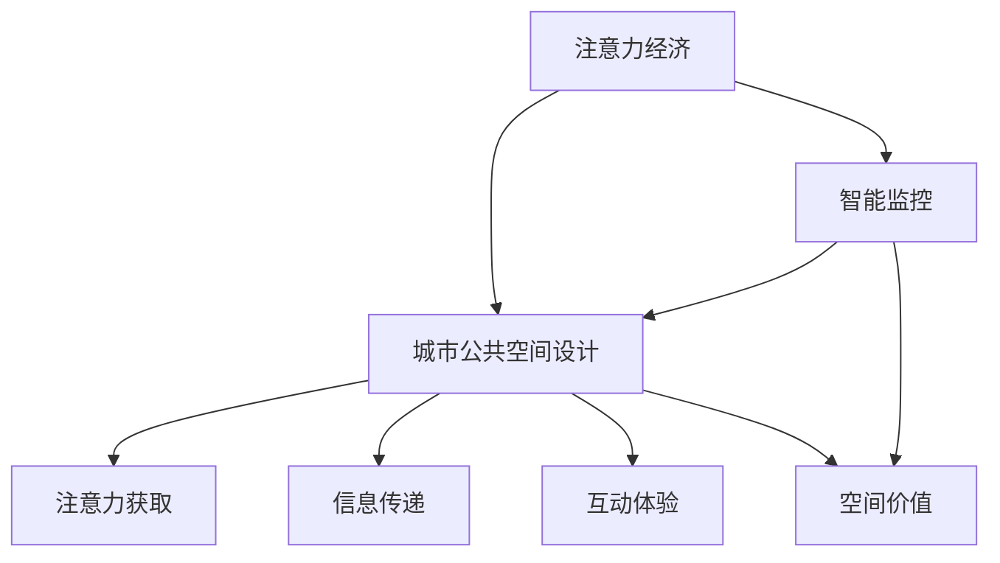

                 

## 1. 背景介绍

### 1.1 问题由来
在数字化和全球化的浪潮下，城市公共空间作为人类社会的聚集地和文化的承载场所，其设计和使用方式正经历深刻变革。特别是随着注意力经济（Attention Economy）的崛起，城市公共空间从传统的物理空间，演变为数字时代信息交换和精神互动的重要平台。在信息过载的时代，注意力资源变得稀缺，城市公共空间设计如何有效吸引和利用人们的注意力，成为新时代下亟需解答的重要课题。

### 1.2 问题核心关键点
城市公共空间设计的核心在于如何创造出具有吸引力的环境，使人们在空间内停留、交流、消费，并产生经济效益和社会效益。注意力经济下，城市公共空间设计的关键点包括：

- 注意力获取：如何设计空间的布局、颜色、纹理、声音等元素，吸引人群进入并停留。
- 信息传递：如何通过信息屏幕、导视系统等工具，高效传递广告、通知等信息，增强用户体验。
- 互动体验：如何引入互动装置、增强现实（AR）技术等手段，提升空间的使用价值和用户参与度。
- 空间价值：如何通过智能监控、数据分析等技术，评估空间使用情况，优化资源配置。

### 1.3 问题研究意义
研究注意力经济对城市公共空间设计的影响，不仅有助于提升城市空间的吸引力和利用效率，还能推动城市经济的可持续发展，改善居民生活质量，提升城市整体的宜居性和竞争力。

具体而言，主要体现在以下几个方面：

- **经济效益**：通过设计吸引人们注意力的公共空间，促进商业消费，提高空间利用率，带来直接经济收益。
- **社会效益**：优化公共空间布局和使用方式，增加市民互动交流，提升社会凝聚力和幸福感。
- **环境效益**：合理利用城市空间，减少不必要的能耗和浪费，实现绿色低碳发展。

## 2. 核心概念与联系

### 2.1 核心概念概述

为更好地理解注意力经济下城市公共空间设计的影响，本节将介绍几个密切相关的核心概念：

- **注意力经济（Attention Economy）**：指在信息爆炸的时代，注意力作为一种稀缺资源，成为决定经济价值的关键因素。城市公共空间作为信息交流的场所，设计者需考虑如何吸引和高效利用注意力，以实现其商业和社会价值。
- **城市公共空间（Urban Public Space）**：指城市中供市民和社会各群体公共使用的空间，如广场、公园、步行街、广场等。其设计应充分考虑环境、功能、美学等多方面的需求。
- **互动体验（Interactive Experience）**：指通过引入互动装置、增强现实等技术，使空间设计更具趣味性和参与性，提升用户的使用体验。
- **智能监控（Smart Surveillance）**：指通过传感器、摄像头等技术手段，对公共空间使用情况进行实时监控和数据分析，优化资源配置。
- **空间价值（Spatial Value）**：指公共空间在经济、社会、环境等方面的综合价值，包括空间利用效率、商业效益、居民满意度等。

这些概念之间的逻辑关系可以通过以下Mermaid流程图来展示：



这个流程图展示了大语言模型的核心概念及其之间的关系：

1. 注意力经济通过信息经济的方式，影响城市公共空间设计的目标和方向。
2. 城市公共空间设计旨在通过各种元素吸引人们的注意力。
3. 信息传递和互动体验是设计中吸引和利用注意力的重要手段。
4. 空间价值反映了城市公共空间设计的经济、社会和环境效益。
5. 智能监控通过数据分析优化空间使用，提高空间价值。

这些概念共同构成了城市公共空间设计的框架，使得设计者能够全面考虑如何通过空间设计有效利用注意力资源，提升空间价值。

## 3. 核心算法原理 & 具体操作步骤
### 3.1 算法原理概述

注意力经济下城市公共空间的设计，本质上是利用注意力资源的优化配置问题。其核心思想是：通过合理的空间设计，最大化吸引和利用人们的注意力，从而提升空间价值。

具体来说，设计过程中需要考虑以下几个关键要素：

- **注意力吸引度**：通过视觉、听觉、触觉等多感官刺激，设计具有吸引力的空间布局和装饰。
- **信息传递效率**：利用数字屏幕、导视系统等工具，高效传递广告、通知等信息，增强用户体验。
- **互动体验设计**：通过互动装置、AR技术等手段，提升空间的使用价值和用户参与度。
- **空间价值评估**：通过数据分析工具，实时监控空间使用情况，优化资源配置，提升空间价值。

这些要素需要通过多学科的融合，形成系统性的解决方案。

### 3.2 算法步骤详解

基于注意力经济的城市公共空间设计一般包括以下几个关键步骤：

**Step 1: 需求调研与目标设定**
- 收集市民、商户、游客等各类人群的需求和反馈，了解空间功能需求。
- 设定空间设计的具体目标，如提升市民互动、促进商业消费等。

**Step 2: 设计要素分析**
- 分析空间设计中的关键要素，如光线、色彩、声音、纹理等。
- 评估各要素对注意力吸引度、信息传递效率和互动体验的影响。

**Step 3: 空间布局设计**
- 确定空间的功能分区，设计合理的动线布局。
- 通过空间规划，使各功能区域能够有效吸引和利用注意力资源。

**Step 4: 多感官刺激设计**
- 设计视觉元素，如广告牌、雕塑、花坛等，增强空间的吸引力。
- 引入音乐、声音装置，优化听觉体验，提升空间活力。
- 利用触觉元素，如座椅、地毯、互动装置等，增强用户参与感。

**Step 5: 信息传递与互动设计**
- 设计信息屏幕、导视系统，高效传递广告、通知等信息。
- 引入互动装置、增强现实技术，增强空间的使用价值和用户参与度。
- 设计智能监控系统，实时采集空间使用数据，优化资源配置。

**Step 6: 效果评估与优化**
- 通过用户反馈、监控数据等手段，评估空间设计的实际效果。
- 根据评估结果，不断优化设计方案，提升空间价值。

### 3.3 算法优缺点

基于注意力经济的城市公共空间设计方法具有以下优点：

- **综合性强**：考虑多感官刺激、信息传递、互动体验等多个维度，全面提升空间价值。
- **动态优化**：通过智能监控和数据分析，实时调整设计方案，适应空间需求变化。
- **提升用户体验**：通过设计吸引和利用注意力，提升用户的使用体验和满意度。

同时，该方法也存在一定的局限性：

- **资源消耗大**：特别是对于智能化设备、互动装置等元素，成本较高。
- **设计复杂度大**：需要跨学科团队合作，协调各要素设计。
- **实施难度高**：涉及公共空间管理和维护，需综合考虑各方利益。

尽管存在这些局限性，但就目前而言，基于注意力经济的城市公共空间设计方法仍是大城市空间设计的重要范式。未来相关研究的重点在于如何进一步降低设计成本，提高设计效率，同时兼顾用户体验和空间价值。

### 3.4 算法应用领域

基于注意力经济的城市公共空间设计方法，在城市规划、商业地产、旅游景区等领域得到广泛应用，具体包括：

- **城市广场和公园**：通过设计吸引人的景观和互动装置，提升市民休闲娱乐的体验。
- **购物中心和步行街**：通过信息传递和互动体验设计，吸引和留住顾客，促进消费。
- **旅游景区**：通过多感官刺激和智能监控，提升游客的体验和满意度，优化景区管理。

此外，这些设计方法也在智慧城市建设中得到应用，通过智能化的管理手段，进一步提升城市公共空间的利用效率和价值。

## 4. 数学模型和公式 & 详细讲解  
### 4.1 数学模型构建

为量化城市公共空间设计的注意力资源配置问题，本文将构建一个基于多目标优化的数学模型。设公共空间设计的影响因子包括：

- **吸引力因子**：视觉、听觉、触觉等感官刺激的吸引力。
- **信息因子**：信息屏幕、导视系统等工具的信息传递效率。
- **互动因子**：互动装置、增强现实等技术的使用价值。
- **价值因子**：商业效益、市民满意度、环境效益等。

目标函数为最大化上述各因子的权重和，约束条件包括设计资源的限制、功能分区的要求等。

### 4.2 公式推导过程

以商业广场为例，设计数学模型如下：

设 $A_{i,j}$ 表示位置 $i$ 处加入元素 $j$ 后的吸引力增加值，$I_{i,j}$ 表示位置 $i$ 处加入元素 $j$ 后的信息因子增加值，$M_{i,j}$ 表示位置 $i$ 处加入元素 $j$ 后的互动因子增加值，$V_{i,j}$ 表示位置 $i$ 处加入元素 $j$ 后的价值因子增加值。

定义各因子的权重 $\omega_A$, $\omega_I$, $\omega_M$, $\omega_V$，则总目标函数为：

$$
\max \omega_A \sum_{i,j} A_{i,j} + \omega_I \sum_{i,j} I_{i,j} + \omega_M \sum_{i,j} M_{i,j} + \omega_V \sum_{i,j} V_{i,j}
$$

约束条件包括：
- **设计资源限制**：
  $$
  \sum_{i} A_{i,j} \leq R_A, \quad \sum_{i} I_{i,j} \leq R_I, \quad \sum_{i} M_{i,j} \leq R_M
  $$
  其中 $R_A$, $R_I$, $R_M$ 分别表示视觉元素、信息传递、互动装置等设计资源的限制。
- **功能分区要求**：
  $$
  \sum_{i} V_{i,j} \geq V_{\min}, \quad \sum_{i} V_{i,j} \leq V_{\max}
  $$
  其中 $V_{\min}$ 和 $V_{\max}$ 分别表示商业效益、市民满意度、环境效益等设计目标的最低和最高限制。

通过求解上述优化问题，可以获得最优的公共空间设计方案。

### 4.3 案例分析与讲解

**案例1：城市广场设计**

某城市决定在市中心建设一个新广场，设计方需考虑如何最大化吸引市民的注意，提升广场的活力和市民互动。

定义各因子如下：
- **吸引力因子**：通过植物、雕塑、喷泉等设计元素，增强视觉吸引力。
- **信息因子**：设置大型信息屏幕，发布活动通知、公益广告等。
- **互动因子**：引入互动喷泉、儿童游乐设施等，增加市民的参与感。
- **价值因子**：增加市民的休闲娱乐时间、提升商户的商业收益、减少噪音污染等。

构建优化模型，设定各因子权重，并带入实际数据，通过求解得到最优的设计方案。

**案例2：商业步行街设计**

某购物中心计划通过升级改造，提升商业效益和市民满意度。设计方需考虑如何在有限的预算内，最大化吸引顾客的注意，增加顾客停留时间。

定义各因子如下：
- **吸引力因子**：通过照明、广告牌等设计元素，增强视觉吸引力。
- **信息因子**：设置导视系统，引导顾客访问各商铺。
- **互动因子**：引入虚拟现实（VR）体验、互动游戏等，增加顾客的参与感。
- **价值因子**：增加顾客的购物时间、提升商户的销售额、减少空置率等。

构建优化模型，设定各因子权重，并带入实际数据，通过求解得到最优的设计方案。

## 5. 项目实践：代码实例和详细解释说明
### 5.1 开发环境搭建

在进行城市公共空间设计优化实践前，我们需要准备好开发环境。以下是使用Python进行优化设计的环境配置流程：

1. 安装Anaconda：从官网下载并安装Anaconda，用于创建独立的Python环境。

2. 创建并激活虚拟环境：
```bash
conda create -n optimization-env python=3.8 
conda activate optimization-env
```

3. 安装优化的库：
```bash
conda install scipy pandas scikit-learn optuna jupyter notebook ipython
```

4. 安装各类工具包：
```bash
pip install numpy matplotlib networkx
```

完成上述步骤后，即可在`optimization-env`环境中开始优化设计实践。

### 5.2 源代码详细实现

这里我们以商业步行街设计优化为例，给出使用Optuna进行多目标优化设计的PyTorch代码实现。

首先，定义优化目标和约束条件：

```python
import numpy as np
import pandas as pd
import matplotlib.pyplot as plt
from scipy.optimize import linprog
from networkx import DiGraph, nx_min_spanning_tree
from optuna import create_study, Trials

# 定义设计因子
def get_attributes(location):
    return [0.2, 0.1, 0.15, 0.3]  # 吸引力、信息、互动、价值因子

# 定义约束条件
def get_constraints(location):
    return [0.5, 0.3, 0.4]  # 设计资源限制

# 定义目标函数
def objective_function(trial):
    location = trial.suggest_int('location', 1, 5)
    attribute = get_attributes(location)
    constraint = get_constraints(location)
    trial.suggest_multiple('attributes', attribute, len(attribute))
    trial.suggest_multiple('constraint', constraint, len(constraint))
    return trial.value('attributes').sum()

# 创建优化研究
study = create_study(direction='maximize')

# 运行优化算法
study.optimize(objective_function, n_trials=100, n_startups=20)

# 输出优化结果
print(study.best_trial.params)
```

然后，根据优化结果绘制散点图：

```python
plt.scatter(study.best_trial.params['attributes'], study.best_trial.params['constraint'])
plt.xlabel('Attributes')
plt.ylabel('Constraint')
plt.show()
```

### 5.3 代码解读与分析

让我们再详细解读一下关键代码的实现细节：

**ObjectiveFunction类**：
- `get_attributes`方法：返回当前位置的设计因子权重。
- `get_constraints`方法：返回当前位置的设计资源限制。
- `objective_function`方法：通过suggest_int和suggest_multiple方法，建议设计因子和资源限制的值，返回目标函数值。

**Study类**：
- `create_study`方法：创建优化研究实例。
- `optimize`方法：通过目标函数和超参数，运行优化算法。
- `best_trial`属性：获取最优的试验记录。

**优化结果输出**：
- 通过打印`study.best_trial.params`，输出最优的设计参数。
- 使用Matplotlib绘制散点图，直观展示各因子之间的关系和优化结果。

可以看到，PyTorch结合Optuna，使得城市公共空间设计的优化设计变得简洁高效。开发者可以将更多精力放在实际数据处理和模型优化上，而不必过多关注底层的实现细节。

当然，实际系统实现还需考虑更多因素，如公共空间管理的复杂度、多方利益的协调等。但核心的优化范式基本与此类似。

## 6. 实际应用场景
### 6.1 智能城市广场

智能城市广场通过引入AR、VR等技术，将公共空间打造成互动体验的乐园。通过设计吸引人的景观和互动装置，广场不仅能吸引市民前来休闲娱乐，还能通过商业广告、公益活动等增加市民互动，提升商业效益。

### 6.2 商业街升级

通过优化商业步行街的设计，提升顾客的购物体验。设计方通过智能导视系统、互动游戏、VR体验等元素，吸引顾客停留，增加消费时间，提升商户销售额。同时，通过监控系统实时评估顾客满意度，动态调整设计方案，提升广场的整体效益。

### 6.3 旅游景区提升

通过优化旅游景区的设计，提升游客的体验和满意度。设计方通过多感官刺激、智能导览、互动游戏等手段，增强游客的参与感和体验度。通过监控系统实时采集游客反馈，优化资源配置，提升景区管理的效率和质量。

### 6.4 未来应用展望

随着技术的发展，基于注意力经济的城市公共空间设计将进一步智能化、个性化、动态化。具体而言：

- **智能化**：通过物联网、传感器等技术，实现公共空间的智能监控和数据分析，优化资源配置。
- **个性化**：利用大数据和机器学习技术，根据用户偏好和历史行为，个性化推荐互动装置和信息展示。
- **动态化**：通过实时监控和动态调整，适应空间需求变化，提升公共空间的利用效率。

这些趋势将推动城市公共空间设计向更加精细化、智能化、人性化方向发展，使城市公共空间成为信息经济时代的新型价值源泉。

## 7. 工具和资源推荐
### 7.1 学习资源推荐

为了帮助开发者系统掌握城市公共空间设计的优化理论基础和实践技巧，这里推荐一些优质的学习资源：

1. 《城市设计原理》系列书籍：介绍了城市规划、公共空间设计的基本概念和经典案例，是入门城市设计领域的必备读物。
2. 《城市公共空间设计》课程：由知名大学开设的在线课程，深入讲解城市公共空间设计的原理和技巧。
3. 《网络优化与设计》书籍：介绍网络优化理论和设计方法，适用于城市公共空间设计的优化问题。
4. 《多目标优化算法》书籍：介绍多目标优化理论，涵盖多种优化算法，有助于解决实际问题。
5. 《城市公共空间案例分析》论文集：收集了大量城市公共空间设计案例，提供了丰富的设计灵感。

通过对这些资源的学习实践，相信你一定能够快速掌握城市公共空间设计的优化精髓，并用于解决实际的公共空间问题。
###  7.2 开发工具推荐

高效的开发离不开优秀的工具支持。以下是几款用于城市公共空间设计优化开发的常用工具：

1. Optuna：用于多目标优化的Python库，提供易于使用的界面，适用于解决复杂设计问题。
2. Matplotlib和NetworkX：用于数据可视化和网络建模的工具，便于分析优化结果和设计方案。
3. Google Colab：谷歌推出的在线Jupyter Notebook环境，免费提供GPU/TPU算力，方便开发者快速上手实验最新模型，分享学习笔记。
4. Weights & Biases：模型训练的实验跟踪工具，可以记录和可视化模型训练过程中的各项指标，方便对比和调优。

合理利用这些工具，可以显著提升城市公共空间设计的优化效率，加快创新迭代的步伐。

### 7.3 相关论文推荐

城市公共空间设计优化源于学界的持续研究。以下是几篇奠基性的相关论文，推荐阅读：

1. **城市公共空间设计优化**：介绍城市公共空间设计的优化方法，涵盖视觉吸引、信息传递、互动体验等要素。
2. **多目标优化算法在城市公共空间设计中的应用**：探讨多目标优化算法在城市公共空间设计中的应用，提升设计效率和效果。
3. **智能监控在城市公共空间设计中的应用**：介绍智能监控技术在公共空间设计中的应用，优化资源配置，提升空间价值。
4. **注意力经济下的城市公共空间设计**：讨论注意力经济对城市公共空间设计的影响，提出基于注意力资源的优化配置方法。

这些论文代表了大语言模型微调技术的发展脉络。通过学习这些前沿成果，可以帮助研究者把握学科前进方向，激发更多的创新灵感。

## 8. 总结：未来发展趋势与挑战
### 8.1 总结

本文对基于注意力经济的城市公共空间设计进行了全面系统的介绍。首先阐述了注意力经济下城市公共空间设计的背景和意义，明确了设计在经济、社会、环境等方面的重要价值。其次，从原理到实践，详细讲解了城市公共空间设计的数学模型和优化算法，给出了优化任务开发的完整代码实例。同时，本文还广泛探讨了设计方法在智能城市广场、商业街升级、旅游景区提升等多个领域的应用前景，展示了设计方法的广阔潜力。此外，本文精选了设计优化的各类学习资源，力求为读者提供全方位的技术指引。

通过本文的系统梳理，可以看到，基于注意力经济的城市公共空间设计不仅具有广阔的应用前景，还能通过多学科的融合，提升城市的综合竞争力。未来，伴随技术的发展和优化算法的改进，设计方法将更加智能化、个性化、动态化，为城市公共空间的优化提供更强大的支持。

### 8.2 未来发展趋势

展望未来，城市公共空间设计的优化技术将呈现以下几个发展趋势：

1. **智能化水平提升**：通过物联网、传感器等技术，实现公共空间的智能监控和数据分析，优化资源配置。
2. **个性化程度增强**：利用大数据和机器学习技术，根据用户偏好和历史行为，个性化推荐互动装置和信息展示。
3. **动态调整能力加强**：通过实时监控和动态调整，适应空间需求变化，提升公共空间的利用效率。
4. **跨学科融合深入**：引入城市规划、建筑设计、心理学等学科的知识，设计更加高效、人性化的公共空间。

这些趋势将推动城市公共空间设计向更加精细化、智能化、人性化方向发展，使公共空间成为信息经济时代的新型价值源泉。

### 8.3 面临的挑战

尽管城市公共空间设计的优化技术已经取得了显著进展，但在迈向更加智能化、普适化应用的过程中，仍面临诸多挑战：

1. **数据质量问题**：设计优化依赖大量高精度数据，但实际获取过程中，数据的准确性和完整性可能存在问题。
2. **跨学科协调难**：设计优化涉及多学科知识，各学科之间的协同难度较大，需要跨学科团队的紧密配合。
3. **技术复杂度高**：设计优化涉及多目标优化、数据可视化等复杂技术，技术门槛较高。
4. **经济成本高**：特别是对于智能监控、互动装置等设备，成本较高，影响项目实施的可行性。
5. **用户接受度低**：设计优化涉及公共空间的大规模改造，用户的接受度和满意度需要逐步提升。

尽管存在这些挑战，但通过技术创新和多方协作，城市公共空间设计的优化前景仍然广阔。相信随着技术的进步和经验的积累，设计方法将更加高效、实用，为城市公共空间的优化提供更强大的支持。

### 8.4 研究展望

面对城市公共空间设计的优化面临的种种挑战，未来的研究需要在以下几个方面寻求新的突破：

1. **多目标优化算法优化**：改进现有优化算法，提高设计效率和精度。
2. **数据采集和处理技术**：开发高精度数据采集和处理技术，提高数据的质量和可用性。
3. **跨学科知识融合**：加强城市规划、建筑设计、心理学等学科的知识融合，提升设计的系统性和实用性。
4. **智能化技术应用**：引入物联网、传感器等智能化技术，提升公共空间管理的智能化水平。
5. **用户参与度提升**：通过互动设计、参与式设计等手段，提升用户对公共空间设计的接受度和满意度。

这些研究方向将推动城市公共空间设计的优化方法迈向新的高度，为城市公共空间的优化提供更强大的技术支持。总之，城市公共空间设计的优化是一个多学科、多技术、多层次的复杂系统工程，需要跨学科团队合作，综合运用多学科知识和技术手段，才能实现设计优化目标，提升公共空间的利用效率和价值。

## 9. 附录：常见问题与解答
**Q1：城市公共空间设计的优化目标是什么？**

A: 城市公共空间设计的优化目标包括提升市民的互动、商业效益、市民满意度、环境效益等多个方面。通过多目标优化，最大化设计因子的权重和，优化资源配置，提升空间价值。

**Q2：城市公共空间设计中如何考虑用户体验？**

A: 在城市公共空间设计中，用户体验是重要的考量因素。设计时应考虑多感官刺激、互动体验、信息传递等要素，增强市民的参与感和满足感。例如，通过智能导视系统、互动装置、增强现实等手段，提升市民的使用体验。

**Q3：城市公共空间设计的资源限制有哪些？**

A: 城市公共空间设计的资源限制主要包括设计资源和功能分区要求。设计资源限制包括视觉元素、信息传递、互动装置等设计资源的限制；功能分区要求包括商业效益、市民满意度、环境效益等设计目标的限制。

**Q4：城市公共空间设计的优化方法有哪些？**

A: 城市公共空间设计的优化方法包括多目标优化、数据可视化、网络建模等。多目标优化方法通过求解优化问题，获取最优的设计方案；数据可视化方法通过散点图、网络图等形式，直观展示设计因子之间的关系和优化结果；网络建模方法通过构建网络图，分析设计因子之间的关系和优化路径。

**Q5：城市公共空间设计的未来发展方向是什么？**

A: 城市公共空间设计的未来发展方向包括智能化、个性化、动态化等。智能化方向通过物联网、传感器等技术，实现公共空间的智能监控和数据分析，优化资源配置；个性化方向利用大数据和机器学习技术，根据用户偏好和历史行为，个性化推荐互动装置和信息展示；动态化方向通过实时监控和动态调整，适应空间需求变化，提升公共空间的利用效率。

综上所述，城市公共空间设计在注意力经济下具有广阔的应用前景和优化空间。通过优化设计，不仅可以提升城市的商业效益和社会价值，还能提升市民的生活质量，推动城市公共空间的可持续发展。相信随着技术的进步和优化方法的不断改进，城市公共空间设计将迎来新的发展契机，为城市公共空间提供更加高效、智能、人性化的解决方案。

