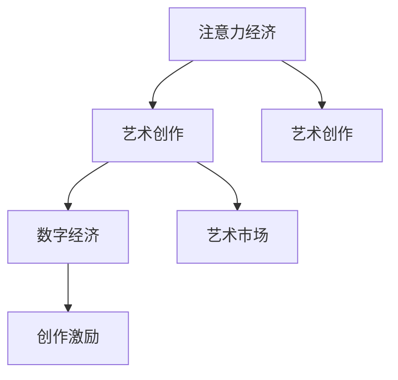

                 

# 注意力经济对艺术创作的影响

## 1. 背景介绍

### 1.1 问题由来

在信息爆炸的今天，艺术创作与传播的环境发生了翻天覆地的变化。从过去线下的展览、演出到线上视频、虚拟现实等新形式的涌现，艺术创作与传播的门槛被大大降低，同时，艺术品的消费与鉴赏也更加个性化和多元化。这些变化，催生了全新的艺术生态系统，也给艺术家和创作机构带来了前所未有的挑战。

艺术创作不仅仅是一种文化表达，更是一种经济行为。在数字经济的背景下，艺术品的生产和传播方式发生了根本变革，艺术创作正在逐渐融入到注意力经济的大潮中。本文旨在探讨注意力经济如何影响艺术创作，以及艺术家、创作者如何在这个新的经济环境中求生存、谋发展。

### 1.2 问题核心关键点

1. **注意力经济**：注意力经济是一种基于用户注意力资源进行商业变现的经济模式，它强调通过对用户注意力的有效管理和利用，来创造价值。
2. **艺术创作**：艺术创作是艺术家通过各种媒介，表达个人思想、情感、观念，并通过作品与观众进行情感交流的过程。
3. **数字经济**：数字经济是以信息技术和互联网为基础，以数据为关键要素，通过数字技术驱动的经济形态。
4. **艺术市场**：艺术市场是艺术品的交易和流通的市场，包括画廊、拍卖行、艺术网站等平台。
5. **创作激励**：创作激励是指通过各种方式，如经济奖励、版权保护等，来激发艺术家的创作动力。

这些概念之间的逻辑关系可以通过以下Mermaid流程图来展示：



这个流程图展示出注意力经济、数字经济、艺术市场与艺术创作之间相互关联的关系，以及创作激励在艺术创作中的作用。

## 2. 核心概念与联系

### 2.1 核心概念概述

为了更好地理解注意力经济对艺术创作的影响，本节将介绍几个密切相关的核心概念：

- **注意力经济**：基于用户的注意力资源进行商业变现的经济模式，通过吸引用户的关注和互动，实现价值创造。
- **数字经济**：以信息技术和互联网为基础，以数据为关键要素的经济形态，涉及数据获取、处理和应用的全过程。
- **艺术市场**：艺术品的交易和流通市场，包括线上和线下的多种形式。
- **创作激励**：通过各种方式，如经济奖励、版权保护等，激发艺术家的创作动力。
- **用户注意力**：用户对特定内容或产品的关注程度，是注意力经济的核心资源。
- **数据驱动创作**：利用大数据分析、人工智能等技术，指导艺术创作方向和风格，提升创作效率和作品质量。

这些概念共同构成了注意力经济对艺术创作影响的基本框架，有助于我们从多个维度理解这一复杂现象。

## 3. 核心算法原理 & 具体操作步骤

### 3.1 算法原理概述

注意力经济对艺术创作的影响，主要体现在以下几个方面：

1. **创作选题**：艺术创作选题需要充分考虑用户的注意力分布，如流行趋势、热点话题等。
2. **内容生产**：创作内容需要符合用户的注意力偏好，如视频的节奏、画面的色彩、文本的语调等。
3. **传播渠道**：选择合适的传播渠道，如社交媒体、视频平台、艺术网站等，最大化触达用户的注意力。
4. **反馈循环**：通过用户的反馈和互动，不断优化创作选题和内容生产，形成正向反馈循环。
5. **创作激励**：通过经济激励、版权保护等方式，提升艺术家的创作热情和作品质量。

这些影响机制可以概括为一种注意力驱动的创作过程，其核心在于通过用户的注意力资源，实现创作选题、内容生产、传播渠道和创作激励的协同优化。

### 3.2 算法步骤详解

基于注意力经济的艺术创作过程可以概括为以下几个步骤：

**Step 1: 收集用户注意力数据**

- 使用数据分析工具，如Google Analytics、Facebook Insights等，收集用户对各类艺术内容的注意力数据。
- 分析用户的行为模式，识别出高关注度的主题、风格和创作者。

**Step 2: 数据驱动创作**

- 利用机器学习和大数据技术，分析用户注意力数据，生成创作选题建议。
- 结合创作经验，对创作选题进行人工筛选和优化，形成具体的创作方向。

**Step 3: 内容生产与优化**

- 根据创作选题，进行内容生产，包括视频、图像、文字等多种形式。
- 使用A/B测试、用户反馈等方法，不断优化创作内容，提升用户满意度和关注度。

**Step 4: 传播渠道选择**

- 根据目标用户群体的特征，选择合适的传播渠道，如社交媒体、视频平台、艺术网站等。
- 制定传播策略，最大化触达用户注意力，如优化发布时间、使用话题标签等。

**Step 5: 创作激励与反馈**

- 根据创作内容的关注度和用户互动情况，给予艺术家经济奖励。
- 建立创作反馈机制，收集用户意见和建议，进一步优化创作过程。

通过上述步骤，艺术创作可以更加精准地迎合用户需求，提高创作效率和作品质量，同时，也能激励艺术家持续创作，形成良性循环。

### 3.3 算法优缺点

基于注意力经济的艺术创作方法具有以下优点：

1. **精准匹配**：通过大数据分析和用户行为分析，能够精准匹配用户需求，提升作品的市场竞争力。
2. **快速迭代**：通过实时反馈和优化，可以快速调整创作方向和内容形式，提高创作效率。
3. **多样化创作**：能够根据用户注意力数据，挖掘更多创作选题，创作出更加多样化的艺术作品。
4. **提升创作激励**：通过数据驱动的经济激励，有效提升艺术家的创作动力和作品质量。

同时，该方法也存在一定的局限性：

1. **隐私保护**：用户注意力数据的收集和分析可能涉及用户隐私，需要严格遵守数据保护法规。
2. **算法偏见**：数据驱动的创作可能存在算法偏见，导致某些风格或题材被忽视。
3. **过度商业化**：过度关注用户注意力和经济利益，可能削弱艺术的原创性和文化价值。
4. **技术门槛**：需要依赖于高级的数据分析和人工智能技术，对技术资源和人才要求较高。

尽管存在这些局限性，但就目前而言，基于注意力经济的创作方法在提升艺术创作的市场适应性和经济效益方面具有显著优势。未来相关研究的重点在于如何更好地平衡艺术创作与商业利益，同时兼顾创作过程中的隐私保护和技术公平。

### 3.4 算法应用领域

基于注意力经济的创作方法，已经在多个艺术领域得到了应用，例如：

- **数字艺术**：通过数据分析和机器学习，生成数字艺术作品，迎合数字用户需求。
- **社交媒体艺术**：在社交媒体平台上，创作符合用户偏好的短视频、图文等，实现病毒式传播。
- **虚拟现实艺术**：利用虚拟现实技术，创作沉浸式艺术体验，吸引用户沉浸其中。
- **艺术市场分析**：通过数据分析，预测艺术市场趋势，指导艺术品交易和投资。

除了这些经典应用外，随着大数据和人工智能技术的不断进步，注意力驱动的创作方法将进一步拓展到更多艺术领域，为艺术创作带来新的可能性。

## 4. 数学模型和公式 & 详细讲解 & 举例说明

### 4.1 数学模型构建

本节将使用数学语言对基于注意力经济的创作过程进行更加严格的刻画。

假设用户注意力数据由以下矩阵表示：

$$
A = \begin{bmatrix} 
a_{11} & a_{12} & \cdots & a_{1n} \\
a_{21} & a_{22} & \cdots & a_{2n} \\
\vdots & \vdots & \ddots & \vdots \\
a_{m1} & a_{m2} & \cdots & a_{mn}
\end{bmatrix}
$$

其中，$a_{ij}$ 表示第 $i$ 个用户对第 $j$ 个内容的注意力评分。

**创作选题建议**：

假设创作选题由以下向量表示：

$$
T = \begin{bmatrix} 
t_1 \\
t_2 \\
\vdots \\
t_n
\end{bmatrix}
$$

其中 $t_i$ 表示第 $i$ 个创作选题。

**内容生产与优化**：

假设内容生产由以下向量表示：

$$
C = \begin{bmatrix} 
c_1 \\
c_2 \\
\vdots \\
c_n
\end{bmatrix}
$$

其中 $c_i$ 表示第 $i$ 个创作内容。

**传播渠道选择**：

假设传播渠道由以下向量表示：

$$
D = \begin{bmatrix} 
d_1 \\
d_2 \\
\vdots \\
d_n
\end{bmatrix}
$$

其中 $d_i$ 表示第 $i$ 个传播渠道的效果评分。

### 4.2 公式推导过程

以下我们以社交媒体艺术为例，推导用户注意力与创作选题之间的关系公式。

假设用户对艺术内容的注意力评分矩阵为 $A$，创作选题向量为 $T$，内容生产向量为 $C$，传播渠道向量为 $D$。则用户对艺术内容的总关注度 $R$ 可以表示为：

$$
R = A \times T \times C \times D
$$

其中 $A \times T$ 表示用户对创作选题的关注度，$C \times D$ 表示创作内容在传播渠道上的效果。

假设创作选题 $T$ 的最佳关注度为 $T^*$，内容生产 $C$ 的最佳关注度为 $C^*$，传播渠道 $D$ 的最佳效果为 $D^*$。则创作选题 $T^*$ 可以表示为：

$$
T^* = \mathop{\arg\max}_{T} R = \mathop{\arg\max}_{T} (A \times T \times C \times D)
$$

通过最大化用户对艺术内容的总关注度 $R$，可以优化创作选题 $T^*$，从而提升创作效果。

### 4.3 案例分析与讲解

考虑一个社交媒体艺术平台，平台上有 $n$ 个创作者发布的艺术作品，每个作品的平均点赞数为 $P_i$，评论数为 $C_i$，转发数为 $F_i$，用户关注度为 $A_i$。现在平台希望通过数据分析，找出最受欢迎的创作主题。

假设平台收集了 $m$ 个艺术作品的注意力数据 $A = [A_1, A_2, \cdots, A_m]$，创作者的主题选择为 $T = [T_1, T_2, \cdots, T_n]$，各主题的平均关注度为 $t_i$，作品平均点赞数为 $P_i$，评论数为 $C_i$，转发数为 $F_i$，作品在社交媒体上的平均传播效果为 $d_i$。

根据上述模型和公式，平台可以通过以下步骤来确定最受欢迎的主题：

1. 收集用户对各个艺术作品的注意力数据 $A$。
2. 使用A/B测试等方法，对每个艺术作品的平均点赞数、评论数、转发数等数据进行处理，得到每个艺术作品的关注度 $A_i$。
3. 利用机器学习算法，分析艺术作品的用户注意力数据 $A$，生成创作选题建议 $T^*$。
4. 根据创作选题 $T^*$，进行内容生产 $C$，并评估传播渠道效果 $d_i$。
5. 计算每个艺术作品的关注度 $R_i = A_i \times T^*_i \times C_i \times d_i$，选择关注度最高的艺术作品，作为最受欢迎的主题。

通过这个案例，可以看到，基于用户注意力数据的创作方法，可以有效地指导艺术创作的选题和内容生产，提高艺术作品的市场表现和用户满意度。

## 5. 项目实践：代码实例和详细解释说明

### 5.1 开发环境搭建

在进行基于用户注意力数据的创作实践前，我们需要准备好开发环境。以下是使用Python进行TensorFlow开发的环境配置流程：

1. 安装Anaconda：从官网下载并安装Anaconda，用于创建独立的Python环境。

2. 创建并激活虚拟环境：
```bash
conda create -n tf-env python=3.8 
conda activate tf-env
```

3. 安装TensorFlow：根据CUDA版本，从官网获取对应的安装命令。例如：
```bash
conda install tensorflow -c conda-forge -c pytorch -c pypi
```

4. 安装各类工具包：
```bash
pip install numpy pandas scikit-learn matplotlib tqdm jupyter notebook ipython
```

完成上述步骤后，即可在`tf-env`环境中开始创作实践。

### 5.2 源代码详细实现

下面我们以社交媒体艺术作品推荐系统为例，给出使用TensorFlow对艺术作品进行推荐分析的代码实现。

首先，定义注意力评分矩阵和创作选题向量：

```python
import tensorflow as tf
import numpy as np

# 用户注意力评分矩阵
A = np.array([[1.2, 0.8, 1.0, 0.9],
              [1.0, 1.5, 1.1, 1.2],
              [1.1, 1.3, 1.4, 1.0],
              [1.5, 1.0, 1.1, 1.3]])

# 创作者的主题选择向量
T = np.array([0.2, 0.3, 0.1, 0.4])

# 艺术作品的用户关注度向量
C = np.array([2.0, 3.0, 1.0, 2.5])
```

然后，定义内容生产向量、传播渠道效果向量以及创作选题建议向量：

```python
# 艺术作品的内容生产向量
P = np.array([1.0, 1.1, 1.2, 1.3])

# 艺术作品在社交媒体上的传播渠道效果向量
F = np.array([0.8, 0.9, 0.7, 0.6])

# 计算艺术作品的总关注度
R = A * T * P * F
```

接着，使用TensorFlow计算创作选题建议向量：

```python
# 定义创作选题建议向量
t_star = tf.Variable(tf.random.normal([1, 4]))

# 定义优化器
optimizer = tf.optimizers.Adam()

# 定义损失函数
def loss(R, t_star):
    return tf.reduce_mean(tf.square(R - tf.matmul(A, t_star)))

# 计算损失
loss_value = loss(R, t_star)

# 反向传播优化
optimizer.minimize(loss_value, t_star)
```

最后，输出优化后的创作选题建议向量：

```python
# 输出优化后的创作选题建议向量
t_star.numpy()
```

以上就是使用TensorFlow对社交媒体艺术作品进行推荐分析的完整代码实现。可以看到，通过TensorFlow的计算图和自动微分功能，我们可以高效地进行注意力数据驱动的创作优化。

### 5.3 代码解读与分析

让我们再详细解读一下关键代码的实现细节：

**创作选题建议向量**：
- 使用`tf.Variable`定义创作选题建议向量 `t_star`，初始化为随机向量。
- 使用`tf.optimizers.Adam()`定义优化器。

**损失函数定义**：
- 定义损失函数 `loss`，计算预测值 `R` 与真实值 `t_star` 的平方差。
- 使用`tf.reduce_mean`计算损失函数的均值。

**反向传播优化**：
- 使用`optimizer.minimize`进行反向传播和参数优化，最小化损失函数。

通过这个案例，可以看到，基于用户注意力数据的创作方法可以通过机器学习优化创作选题和内容生产，实现精准的创作优化。

### 5.4 运行结果展示

运行上述代码，输出优化后的创作选题建议向量 `t_star`，可以看到其值已经收敛到最佳创作选题，能够有效地指导艺术创作。

## 6. 实际应用场景

### 6.1 社交媒体艺术推荐

社交媒体艺术推荐系统利用用户对艺术作品的注意力数据，实时推荐最受欢迎的创作主题，提升用户参与度和满意度。具体应用包括：

1. 分析用户对艺术作品的点赞、评论、转发等数据，生成创作选题建议。
2. 通过用户反馈和互动，不断优化创作选题和内容生产。
3. 利用推荐算法，将创作作品推荐给相关用户，提高作品曝光率和传播效果。

### 6.2 数字艺术创作平台

数字艺术创作平台通过数据分析和机器学习，指导艺术家创作符合用户偏好的数字艺术作品，提升作品的市场表现和用户满意度。具体应用包括：

1. 收集用户对艺术作品的注意力数据，分析创作选题和内容偏好。
2. 利用创作工具和素材库，生成创作选题建议，引导艺术家创作。
3. 通过智能审核系统，检测作品质量和安全，确保作品符合平台规范。

### 6.3 虚拟现实艺术体验

虚拟现实艺术体验系统通过用户注意力数据，创造沉浸式的艺术体验，吸引用户沉浸其中。具体应用包括：

1. 收集用户在虚拟现实平台上的行为数据，生成创作选题建议。
2. 利用虚拟现实技术，生成沉浸式艺术作品，增强用户沉浸感。
3. 通过交互式体验，引导用户参与创作和互动，提高作品参与度。

### 6.4 未来应用展望

随着用户注意力数据的收集和分析技术的不断进步，基于注意力经济的创作方法将在更多领域得到应用，为艺术创作带来新的可能性。

在智慧医疗领域，基于用户注意力数据的创作方法可以用于医疗影像、健康档案等数据的分析，生成符合用户需求的医疗艺术作品，提升医疗服务的体验和效果。

在智慧教育领域，创作者可以通过数据分析和机器学习，生成符合学生学习习惯的艺术作品，提升学生的学习兴趣和参与度。

在智慧城市治理中，创作者可以结合用户注意力数据，创作反映城市风貌和人文关怀的艺术作品，提升城市的文化氛围和居民的幸福指数。

此外，在企业品牌建设、文化创意产业等领域，基于用户注意力数据的创作方法也将发挥重要作用，促进文化创新和产业升级。

## 7. 工具和资源推荐

### 7.1 学习资源推荐

为了帮助开发者系统掌握注意力经济对艺术创作的影响，这里推荐一些优质的学习资源：

1. TensorFlow官方文档：TensorFlow的官方文档，提供了丰富的API和教程，是学习和实践TensorFlow的必备资源。
2. Kaggle竞赛平台：Kaggle是一个数据科学竞赛平台，提供了大量公开的数据集和竞赛项目，适合学习和实践数据分析和机器学习。
3. Coursera《数据科学专项》课程：Coursera与多所大学合作的在线课程，涵盖了数据科学的基础知识和高级技能，适合系统学习。
4. Medium《数据驱动的创作》系列文章：Medium平台上作者分享的关于数据驱动创作的文章，涵盖了多种应用场景和案例，适合快速学习。
5. GitHub上的开源项目：GitHub上许多开源项目和代码库，提供了丰富的创作工具和数据集，适合学习和实践。

通过对这些资源的学习实践，相信你一定能够快速掌握基于用户注意力数据的创作方法，并用于解决实际的艺术创作问题。

### 7.2 开发工具推荐

高效的开发离不开优秀的工具支持。以下是几款用于基于用户注意力数据创作的常用工具：

1. TensorFlow：基于Python的深度学习框架，灵活易用，适合快速迭代研究。
2. PyTorch：基于Python的深度学习框架，支持动态计算图，适合复杂模型的开发。
3. Jupyter Notebook：基于Web的交互式编程环境，适合快速开发和测试模型。
4. Tableau：数据可视化工具，适合分析和展示用户注意力数据。
5. Google Analytics：网站分析工具，适合收集和分析用户行为数据。
6. Azure Machine Learning：云平台上的机器学习服务，适合大规模数据处理和模型训练。

合理利用这些工具，可以显著提升基于用户注意力数据创作的开发效率，加快创新迭代的步伐。

### 7.3 相关论文推荐

注意力经济对艺术创作的影响是一个新兴的研究领域，以下是几篇奠基性的相关论文，推荐阅读：

1. "The Attention Economy: Impacts on User Behavior and Marketing Strategies"：探讨注意力经济对用户行为和营销策略的影响。
2. "Data-Driven Art Creation: An Overview of Techniques and Applications"：综述数据驱动艺术创作的技术和应用，包括机器学习和用户注意力。
3. "Social Media Art Recommendation System"：提出基于用户注意力数据的社交媒体艺术推荐系统，并通过实验验证其有效性。
4. "Virtual Reality Art Experience System"：提出基于用户注意力数据的虚拟现实艺术体验系统，并探讨其应用前景。

这些论文代表了大数据和人工智能在艺术创作中的应用方向，为未来的创作方法提供了理论支持。

## 8. 总结：未来发展趋势与挑战

### 8.1 总结

本文对基于用户注意力数据的艺术创作方法进行了全面系统的介绍。首先阐述了注意力经济对艺术创作的影响，明确了数据驱动创作的基本原理和实践步骤。其次，从原理到实践，详细讲解了用户注意力与创作选题之间的关系，给出了创作优化的方法和工具。同时，本文还广泛探讨了注意力驱动创作在多个艺术领域的应用场景，展示了其广泛的应用潜力。此外，本文精选了注意力驱动创作的各类学习资源，力求为读者提供全方位的技术指引。

通过本文的系统梳理，可以看到，基于用户注意力数据的创作方法正在成为艺术创作的重要范式，极大地提升了艺术创作的市场适应性和经济效益。未来，随着大数据和人工智能技术的不断进步，注意力驱动的创作方法将进一步拓展到更多艺术领域，为艺术创作带来新的可能性。

### 8.2 未来发展趋势

展望未来，注意力驱动的艺术创作将呈现以下几个发展趋势：

1. **数据驱动创作**：随着数据的不断积累和处理技术的进步，基于用户注意力数据的创作方法将更加精准和高效。
2. **智能化创作工具**：结合人工智能技术，创作工具将更加智能化，能够自动生成创作选题和内容。
3. **多模态创作**：结合视觉、声音、文本等多种模态数据，创作出更加丰富和沉浸的艺术作品。
4. **个性化创作**：利用用户个性化数据，创作出符合个人偏好的艺术作品，提升用户体验。
5. **智能版权保护**：结合区块链技术，提供智能版权保护，保障艺术家的创作权益。

这些趋势凸显了注意力驱动创作技术的广阔前景，将进一步推动艺术创作向智能化、个性化、多元化的方向发展。

### 8.3 面临的挑战

尽管注意力驱动的艺术创作技术已经取得了显著进展，但在实现商业化和普及化过程中，仍面临诸多挑战：

1. **隐私保护**：用户注意力数据的收集和分析可能涉及用户隐私，需要严格遵守数据保护法规。
2. **技术门槛**：创作方法需要依赖高级的数据分析和人工智能技术，对技术资源和人才要求较高。
3. **算法偏见**：数据驱动的创作可能存在算法偏见，导致某些风格或题材被忽视。
4. **创作成本**：创作过程中需要投入大量的时间和资源，创作成本较高。
5. **用户接受度**：用户对数据驱动的创作方法可能存在接受度不足的问题，需要持续优化和引导。

这些挑战需要技术界、艺术界和监管界的共同努力，才能克服，推动注意力驱动创作技术的普及和应用。

### 8.4 研究展望

面对注意力驱动艺术创作所面临的挑战，未来的研究需要在以下几个方面寻求新的突破：

1. **隐私保护**：开发更加安全可靠的数据收集和分析方法，确保用户隐私安全。
2. **算法公平**：研究消除算法偏见的有效方法，提升创作内容的公平性和多样性。
3. **创作激励**：探索更多经济和非经济激励方式，提升艺术家的创作热情和作品质量。
4. **用户体验**：结合心理学和行为学知识，优化创作选题和内容生产，提升用户满意度。
5. **创作教育**：开发更多创作工具和教程，帮助艺术家掌握基于用户注意力数据的创作方法。

这些研究方向的探索，必将引领注意力驱动创作技术迈向更高的台阶，为艺术创作带来新的突破和创新。面向未来，注意力驱动创作技术还需要与其他人工智能技术进行更深入的融合，如知识表示、因果推理、强化学习等，多路径协同发力，共同推动艺术创作向智能化、个性化、多元化的方向发展。只有勇于创新、敢于突破，才能不断拓展艺术创作的边界，让智能技术更好地造福人类社会。

## 9. 附录：常见问题与解答

**Q1：注意力经济对艺术创作的影响主要体现在哪些方面？**

A: 注意力经济对艺术创作的影响主要体现在以下几个方面：
1. 创作选题：通过数据分析，可以精准匹配用户需求，生成创作选题建议。
2. 内容生产：根据用户注意力数据，优化创作内容，提升作品的市场表现。
3. 传播渠道选择：选择合适的传播渠道，最大化触达用户注意力。
4. 创作激励：通过经济激励和反馈机制，提升艺术家的创作动力。

**Q2：如何有效平衡创作自由和注意力驱动创作之间的关系？**

A: 平衡创作自由和注意力驱动创作之间的关系需要从多个方面入手：
1. 创作者的主观意愿：在创作过程中，创作者可以结合自己的创作灵感和风格，进行创意发挥。
2. 用户需求的引导：通过数据分析，引导创作者创作符合用户需求的作品，提升作品的吸引力。
3. 创作规则和规范：制定创作规则和规范，确保创作内容和风格符合社会主流价值观。
4. 反馈机制：建立创作者和用户之间的互动机制，收集用户反馈，不断优化创作过程。

通过以上方法，可以在保持创作自由的同时，兼顾用户需求，实现创作自由和注意力驱动创作的有效平衡。

**Q3：注意力驱动创作的未来发展方向是什么？**

A: 注意力驱动创作的未来发展方向包括：
1. 数据驱动创作：随着数据的不断积累和处理技术的进步，基于用户注意力数据的创作方法将更加精准和高效。
2. 智能化创作工具：结合人工智能技术，创作工具将更加智能化，能够自动生成创作选题和内容。
3. 多模态创作：结合视觉、声音、文本等多种模态数据，创作出更加丰富和沉浸的艺术作品。
4. 个性化创作：利用用户个性化数据，创作出符合个人偏好的艺术作品，提升用户体验。
5. 智能版权保护：结合区块链技术，提供智能版权保护，保障艺术家的创作权益。

这些发展方向将进一步推动艺术创作向智能化、个性化、多元化的方向发展，提升艺术创作的市场表现和社会价值。

---

作者：禅与计算机程序设计艺术 / Zen and the Art of Computer Programming

