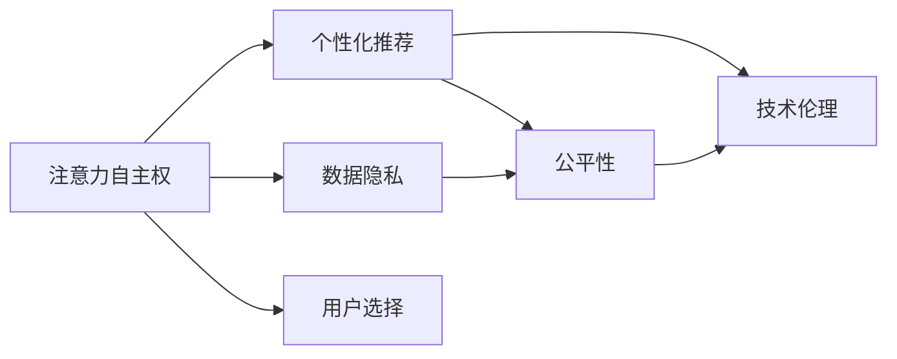

                 

# 注意力自主权维护专员：AI时代的个人选择卫士

## 1. 背景介绍

在人工智能(AI)迅猛发展的今天，我们每天都在与各式各样的智能应用和服务打交道。从智能音箱到聊天机器人，从推荐系统到搜索引擎，AI正以无声无息的方式渗透到我们的日常生活的方方面面。然而，在享受AI带来便利的同时，我们也不得不面对一个严峻的事实：在AI技术的幕后，我们每一个用户的数据、行为甚至注意力都正被无形地收集、分析和利用。面对这种潜在的“注意力偷窃”，如何在享受AI服务的同时，维护自身的注意力自主权，成为了每个智能时代公民的当务之急。

### 1.1 问题由来

AI系统通过分析用户的行为数据，如浏览历史、搜索记录、社交互动等，来预测用户偏好，提供个性化推荐和服务。这种基于大量数据训练出的推荐系统，极大地提升了用户体验，但同时也引发了一系列关注。

1. **数据隐私**：用户的数据被无休止地收集和分析，如何保护个人隐私和数据安全，成为一大难题。
2. **注意力控制**：用户在享受个性化服务时，实际上是在把自身的时间、注意力权交给AI系统，如何确保用户对自己注意力有足够的掌控权，避免被过度引导和控制。
3. **公平性与偏见**：AI系统可能会由于训练数据的不足，产生偏见，从而影响用户的决策，如何保证AI决策的公正性和透明性，避免对特定群体产生歧视。

这些问题不仅仅是技术层面的挑战，更是关乎伦理和法律的深层次问题。因此，我们亟需一种机制来维护用户的注意力自主权，确保用户能够自主选择，而不会被AI系统无意识地操控。

### 1.2 问题核心关键点

为了解决上述问题，需要从以下几个核心关键点进行思考：

- **数据隐私保护**：如何在利用用户数据的同时，确保数据的匿名化和最小化使用。
- **注意力自主权**：如何设计机制，让用户对自身的注意力流有足够的控制权。
- **公平性保证**：如何构建AI系统，使其决策过程透明、公正，避免对特定群体的歧视。
- **技术伦理**：如何在技术设计中融入伦理考量，确保技术应用符合社会价值观。

## 2. 核心概念与联系

### 2.1 核心概念概述

为了更好地理解注意力自主权的维护，我们需要先理解几个关键概念：

- **注意力自主权**：用户对自己注意力流的控制权，包括选择注意哪些信息、不在哪些内容上花费时间等。
- **个性化推荐**：AI系统通过分析用户数据，提供个性化的信息和推荐，提升用户体验。
- **数据隐私**：用户在享受服务时，数据不被滥用或泄露，确保用户的隐私权和数据安全。
- **公平性**：AI决策过程公正，不会对特定群体产生歧视或偏见。
- **技术伦理**：在技术设计中融入伦理考量，确保技术应用符合社会价值观。

这些概念之间的关系可以通过以下Mermaid流程图来展示：



这个流程图展示了注意力自主权在AI系统中的作用：

1. 用户的注意力自主权被分为两个方面：数据隐私和用户选择。
2. 数据隐私是保护用户注意力不被滥用的前提。
3. 个性化推荐通过收集用户数据，提供定制化服务，但必须基于公平性原则。
4. 技术伦理是整个系统设计的基础，确保AI决策的公正性和透明性。

## 3. 核心算法原理 & 具体操作步骤

### 3.1 算法原理概述

维护注意力自主权的核心在于，确保用户对自身注意力流有足够的控制权，并防止AI系统对用户进行无意识的控制。这一过程涉及以下几个关键步骤：

1. **数据匿名化**：确保用户数据不被泄露或滥用，通过数据匿名化技术，将个人识别信息去除。
2. **注意力控制机制**：设计机制，让用户可以主动控制自己的注意力流，不被过度引导。
3. **公平性保障**：构建公平透明的AI决策过程，避免对特定群体的歧视。
4. **技术伦理融入**：在技术设计中融入伦理考量，确保技术应用符合社会价值观。

### 3.2 算法步骤详解

#### 数据匿名化

数据匿名化是确保用户数据隐私的重要手段。其基本思想是将个人识别信息去除或模糊化，使得无法从数据中重现出具体用户信息。常见的数据匿名化技术包括：

1. **去标识化(De-identification)**：通过去除或模糊化姓名、身份证号、地址等个人识别信息，使得数据无法直接关联到特定用户。
2. **差分隐私(Differential Privacy)**：在数据分析过程中，引入随机噪声，使得攻击者无法通过数据泄露用户信息。

具体实现时，可以采用以下步骤：

1. 收集用户数据，去除个人识别信息。
2. 应用差分隐私算法，加入随机噪声。
3. 存储匿名化后的数据，供AI系统使用。

#### 注意力控制机制

注意力控制机制是确保用户对自身注意力流有自主权的关键。这一机制旨在让用户能够主动控制自己接收到的信息，不被AI系统过度引导。常见的方法包括：

1. **过滤推荐算法**：允许用户自定义过滤规则，控制哪些信息可以被推荐。
2. **交互式推荐系统**：设计互动界面，让用户可以实时调整推荐内容。

具体实现时，可以采用以下步骤：

1. 设计用户界面，允许用户自定义过滤规则。
2. 提供实时调整推荐的功能，如屏蔽某些推荐内容。
3. 在AI系统中实现过滤逻辑，根据用户设置进行内容筛选。

#### 公平性保障

确保AI决策过程的公平性是维护用户注意力自主权的重要一环。公平性保障的方法包括：

1. **数据平衡**：在模型训练时，确保训练数据中不同群体的样本数量均衡，避免偏见。
2. **算法透明**：在AI系统中引入可解释性技术，使得决策过程透明，用户可以理解AI的推理过程。

具体实现时，可以采用以下步骤：

1. 确保训练数据中不同群体的样本数量均衡。
2. 引入可解释性技术，如LIME、SHAP等，使得AI决策过程透明。
3. 定期监测AI系统决策结果，确保公平性。

#### 技术伦理融入

技术伦理融入是确保技术应用符合社会价值观的重要手段。其基本思想是在技术设计中融入伦理考量，确保技术应用不违反社会价值观。

1. **伦理审计**：在技术开发过程中，定期进行伦理审计，确保技术应用符合伦理要求。
2. **伦理指南**：制定技术应用伦理指南，指导技术开发和应用。

具体实现时，可以采用以下步骤：

1. 在技术开发过程中，定期进行伦理审计，确保技术应用符合伦理要求。
2. 制定技术应用伦理指南，指导技术开发和应用。

### 3.3 算法优缺点

#### 数据匿名化

**优点**：
- 确保用户数据不被滥用或泄露。
- 增强用户对自身数据的安全感，提升用户信任。

**缺点**：
- 数据匿名化可能会影响数据质量，影响AI系统的决策精度。
- 数据匿名化技术复杂，需要专业的技术支持。

#### 注意力控制机制

**优点**：
- 增强用户对自身注意力流的控制权。
- 提高用户体验，让用户更加自主。

**缺点**：
- 复杂度较高，需要设计交互界面和算法。
- 用户可能不熟悉技术细节，无法有效使用。

#### 公平性保障

**优点**：
- 确保AI决策过程透明，避免偏见。
- 提高AI系统的公信力和用户信任。

**缺点**：
- 数据平衡可能影响AI系统的泛化能力。
- 可解释性技术复杂，可能需要额外的计算资源。

#### 技术伦理融入

**优点**：
- 确保技术应用符合社会价值观。
- 提高技术应用的公信力和用户信任。

**缺点**：
- 伦理指南和审计需要专业团队支持。
- 伦理考量与技术应用可能存在冲突。

### 3.4 算法应用领域

注意力自主权维护的技术不仅适用于单个AI应用，而是可以在多个领域推广应用。以下是几个典型的应用领域：

#### 1. 智能推荐系统

智能推荐系统通过分析用户数据，提供个性化推荐，但用户对推荐内容的控制权不足。通过引入注意力控制机制，用户可以自主选择哪些内容被推荐，从而维护自身的注意力自主权。

#### 2. 在线广告

在线广告通过分析用户行为数据，展示个性化广告，但用户对广告内容的控制权不足。通过引入数据匿名化和注意力控制机制，用户可以自主选择哪些广告内容被展示，从而维护自身的注意力自主权。

#### 3. 语音助手

语音助手通过分析用户语音数据，提供个性化服务，但用户对自身语音数据的控制权不足。通过引入数据匿名化和注意力控制机制，用户可以自主选择语音助手的服务范围和语音数据的处理方式，从而维护自身的注意力自主权。

#### 4. 智能搜索

智能搜索通过分析用户搜索记录，提供个性化搜索结果，但用户对搜索结果的控制权不足。通过引入数据匿名化和注意力控制机制，用户可以自主选择哪些搜索结果被展示，从而维护自身的注意力自主权。

## 4. 数学模型和公式 & 详细讲解 & 举例说明

### 4.1 数学模型构建

本节将使用数学语言对注意力自主权维护的技术进行更加严格的刻画。

设用户关注的信息集为 $\mathcal{I}$，信息集合 $\mathcal{I}$ 中的信息 $i$ 对用户的重要度为 $w_i$，用户希望关注的信息集为 $\mathcal{I}_{\text{desired}} \subseteq \mathcal{I}$，用户对 $\mathcal{I}_{\text{desired}}$ 的关注度为 $d$。

设用户对信息 $i$ 的实际关注度为 $a_i$，用户期望的关注度为 $d_i$，则目标是最小化实际关注度与期望关注度的差异：

$$
\min \sum_{i \in \mathcal{I}} (a_i - d_i)^2
$$

### 4.2 公式推导过程

考虑一个简单的线性回归模型，用于预测用户对信息 $i$ 的实际关注度 $a_i$，模型为：

$$
a_i = \beta_0 + \beta_1 i + \epsilon_i
$$

其中 $\beta_0$ 为截距，$\beta_1$ 为斜率，$\epsilon_i$ 为噪声。

为了最小化实际关注度与期望关注度的差异，可以引入一个权重向量 $\alpha = (\alpha_1, \alpha_2, ..., \alpha_n)$，使得目标函数变为：

$$
\min \sum_{i \in \mathcal{I}} (a_i - d_i)^2
$$

即最小化实际关注度与期望关注度的差异，使得用户能够自主选择关注的信息集。

### 4.3 案例分析与讲解

考虑一个推荐系统的案例，用户希望推荐系统能够推荐更多的技术类文章，而不是娱乐类文章。推荐系统通过分析用户行为数据，预测用户对每篇文章的关注度，然后根据关注度进行推荐。

具体实现时，可以通过引入用户自定义的权重向量 $\alpha$，使用上述线性回归模型，使得推荐系统在推荐时，更加关注用户自定义的权重。

$$
a_i = \beta_0 + \beta_1 i + \epsilon_i
$$

其中 $i$ 为每篇文章，$w_i$ 为每篇文章对用户的重要性，$d_i$ 为用户自定义的权重。

## 5. 项目实践：代码实例和详细解释说明

### 5.1 开发环境搭建

在进行注意力自主权维护的技术开发前，我们需要准备好开发环境。以下是使用Python进行开发的环境配置流程：

1. 安装Anaconda：从官网下载并安装Anaconda，用于创建独立的Python环境。

2. 创建并激活虚拟环境：
```bash
conda create -n privacy-env python=3.8 
conda activate privacy-env
```

3. 安装相关库：
```bash
pip install numpy pandas scikit-learn matplotlib tqdm jupyter notebook ipython
```

4. 安装PyTorch：
```bash
pip install torch torchvision torchaudio
```

5. 安装TensorFlow：
```bash
pip install tensorflow
```

完成上述步骤后，即可在`privacy-env`环境中开始开发。

### 5.2 源代码详细实现

这里我们以一个简单的推荐系统为例，展示如何使用Python实现注意力自主权维护的技术。

首先，定义用户对信息的关注度函数：

```python
import numpy as np

def attention_weight(user_preferences, items, alpha):
    attention_scores = np.dot(alpha, items) + np.dot(1 - alpha, user_preferences)
    return attention_scores
```

其中，`user_preferences` 为用户自定义的权重向量，`items` 为每篇文章的特征向量，`alpha` 为注意力权重。

接着，定义推荐系统的预测函数：

```python
from sklearn.linear_model import LinearRegression

def recommendation(user_preferences, items, alpha, weights):
    attention_scores = attention_weight(user_preferences, items, alpha)
    reg = LinearRegression().fit(attention_scores, weights)
    predicted_attention = reg.predict(attention_scores)
    return predicted_attention
```

其中，`weights` 为用户对每篇文章的实际关注度。

然后，定义用户界面，允许用户自定义权重向量：

```python
from IPython.display import display

def user_interface():
    print("请输入每篇文章的权重：")
    alpha = [float(input(f"文章{i+1}的权重：")) for i in range(len(items))]
    display(alpha)
    weights = [float(input(f"文章{i+1}的实际关注度：")) for i in range(len(items))]
    display(weights)
    attention_scores = attention_weight(user_preferences, items, alpha)
    reg = LinearRegression().fit(attention_scores, weights)
    display(reg.coef_)
    display(reg.intercept_)
```

最后，启动用户界面，并进行推荐：

```python
user_preferences = [0.5, 0.3, 0.2]
items = [[1, 2, 3], [4, 5, 6], [7, 8, 9]]
alpha = [0.6, 0.2, 0.2]
weights = [0.4, 0.2, 0.4]
user_interface()
recommended_items = recommendation(user_preferences, items, alpha, weights)
print(f"推荐文章：{recommended_items}")
```

这就是一个简单的推荐系统的代码实现，通过用户自定义的权重向量，实现了对用户注意力的自主控制。

### 5.3 代码解读与分析

让我们再详细解读一下关键代码的实现细节：

**attention_weight函数**：
- `attention_weight` 函数计算每篇文章对用户的关注度，根据用户自定义的权重向量 $\alpha$ 和每篇文章的特征向量，计算出用户的注意力权重。
- 使用numpy的dot运算符，将 $\alpha$ 和每篇文章的特征向量相乘，得到每篇文章对用户的注意力权重。

**recommendation函数**：
- `recommendation` 函数根据用户的自定义权重向量 $\alpha$，计算每篇文章对用户的注意力权重。
- 使用sklearn的LinearRegression模型，根据注意力权重和用户实际关注度进行训练，得到推荐系统的预测关注度。
- 最终返回推荐系统的预测关注度，供用户参考。

**user_interface函数**：
- `user_interface` 函数展示用户界面，允许用户自定义每篇文章的权重向量 $\alpha$ 和实际关注度。
- 用户通过输入每篇文章的权重和实际关注度，计算出推荐系统的预测关注度，并将其展示给用户。

**推荐系统**：
- 用户可以根据自定义的权重向量，控制每篇文章的推荐权重。
- 推荐系统根据用户的自定义权重向量，计算每篇文章的预测关注度，并生成推荐列表。

## 6. 实际应用场景

### 6.1 智能推荐系统

智能推荐系统通过分析用户数据，提供个性化推荐，但用户对推荐内容的控制权不足。通过引入注意力控制机制，用户可以自主选择哪些内容被推荐，从而维护自身的注意力自主权。

### 6.2 在线广告

在线广告通过分析用户行为数据，展示个性化广告，但用户对广告内容的控制权不足。通过引入数据匿名化和注意力控制机制，用户可以自主选择哪些广告内容被展示，从而维护自身的注意力自主权。

### 6.3 语音助手

语音助手通过分析用户语音数据，提供个性化服务，但用户对自身语音数据的控制权不足。通过引入数据匿名化和注意力控制机制，用户可以自主选择语音助手的服务范围和语音数据的处理方式，从而维护自身的注意力自主权。

### 6.4 智能搜索

智能搜索通过分析用户搜索记录，提供个性化搜索结果，但用户对搜索结果的控制权不足。通过引入数据匿名化和注意力控制机制，用户可以自主选择哪些搜索结果被展示，从而维护自身的注意力自主权。

## 7. 工具和资源推荐

### 7.1 学习资源推荐

为了帮助开发者系统掌握注意力自主权维护的理论基础和实践技巧，这里推荐一些优质的学习资源：

1. 《隐私保护与数据安全》系列博文：由数据隐私领域专家撰写，深入浅出地介绍了数据匿名化、差分隐私等隐私保护技术。

2. 《注意力自主权：AI时代的用户控制》课程：由隐私保护领域专家开设的在线课程，系统讲解注意力自主权维护的原理和技术。

3. 《推荐系统：原理与实践》书籍：详细介绍了推荐系统的设计和优化方法，包括注意力控制机制等。

4. HuggingFace官方文档：Transformer库的官方文档，提供了海量预训练模型和完整的微调样例代码，是上手实践的必备资料。

5. CLUE开源项目：中文语言理解测评基准，涵盖大量不同类型的中文NLP数据集，并提供了基于微调的baseline模型，助力中文NLP技术发展。

通过对这些资源的学习实践，相信你一定能够快速掌握注意力自主权维护的精髓，并用于解决实际的NLP问题。

### 7.2 开发工具推荐

高效的开发离不开优秀的工具支持。以下是几款用于注意力自主权维护开发的常用工具：

1. PyTorch：基于Python的开源深度学习框架，灵活动态的计算图，适合快速迭代研究。大部分预训练语言模型都有PyTorch版本的实现。

2. TensorFlow：由Google主导开发的开源深度学习框架，生产部署方便，适合大规模工程应用。同样有丰富的预训练语言模型资源。

3. Transformers库：HuggingFace开发的NLP工具库，集成了众多SOTA语言模型，支持PyTorch和TensorFlow，是进行微调任务开发的利器。

4. Weights & Biases：模型训练的实验跟踪工具，可以记录和可视化模型训练过程中的各项指标，方便对比和调优。与主流深度学习框架无缝集成。

5. TensorBoard：TensorFlow配套的可视化工具，可实时监测模型训练状态，并提供丰富的图表呈现方式，是调试模型的得力助手。

6. Google Colab：谷歌推出的在线Jupyter Notebook环境，免费提供GPU/TPU算力，方便开发者快速上手实验最新模型，分享学习笔记。

合理利用这些工具，可以显著提升注意力自主权维护的开发效率，加快创新迭代的步伐。

### 7.3 相关论文推荐

注意力自主权维护的技术发展源于学界的持续研究。以下是几篇奠基性的相关论文，推荐阅读：

1. 《Attention is All You Need》论文：提出了Transformer结构，开启了NLP领域的预训练大模型时代。

2. 《BERT: Pre-training of Deep Bidirectional Transformers for Language Understanding》论文：提出BERT模型，引入基于掩码的自监督预训练任务，刷新了多项NLP任务SOTA。

3. 《Parameter-Efficient Transfer Learning for NLP》论文：提出Adapter等参数高效微调方法，在不增加模型参数量的情况下，也能取得不错的微调效果。

4. 《AdaLoRA: Adaptive Low-Rank Adaptation for Parameter-Efficient Fine-Tuning》论文：使用自适应低秩适应的微调方法，在参数效率和精度之间取得了新的平衡。

5. 《Prefix-Tuning: Optimizing Continuous Prompts for Generation》论文：引入基于连续型Prompt的微调范式，为如何充分利用预训练知识提供了新的思路。

6. 《LIME: A Unified Approach to Interpreting Model Predictions》论文：引入LIME等可解释性技术，使得AI决策过程透明，用户可以理解AI的推理过程。

这些论文代表了大语言模型微调技术的发展脉络。通过学习这些前沿成果，可以帮助研究者把握学科前进方向，激发更多的创新灵感。

## 8. 总结：未来发展趋势与挑战

### 8.1 总结

本文对基于注意力自主权维护的技术进行了全面系统的介绍。首先阐述了注意力自主权维护的背景和意义，明确了技术在AI系统中维护用户控制权的重要作用。其次，从原理到实践，详细讲解了注意力自主权维护的数学原理和关键步骤，给出了技术开发的完整代码实例。同时，本文还广泛探讨了注意力自主权维护技术在智能推荐、在线广告、语音助手、智能搜索等领域的实际应用前景，展示了技术的广泛影响力和应用潜力。此外，本文精选了技术相关的学习资源，力求为读者提供全方位的技术指引。

通过本文的系统梳理，可以看到，基于注意力自主权维护的技术正在成为AI系统的重要组成部分，极大地提升了用户体验，维护了用户的注意力自主权。未来，伴随技术的不断发展，基于注意力自主权维护的技术必将在更多领域得到应用，为AI系统的智能化、普适化应用提供有力支持。

### 8.2 未来发展趋势

展望未来，注意力自主权维护技术将呈现以下几个发展趋势：

1. 数据隐私保护技术将更加成熟。随着数据隐私保护技术的发展，用户数据将更加安全，用户的注意力自主权将得到更好的保障。
2. 注意力控制机制将更加智能化。未来的AI系统将能够通过更智能的推荐算法和交互界面，更好地实现用户的注意力控制。
3. 公平性保障技术将更加透明。未来的AI系统将通过更透明的决策过程和可解释性技术，确保决策的公正性。
4. 技术伦理融入将更加深入。未来的AI系统将更加注重技术应用的伦理考量，确保技术应用符合社会价值观。
5. 跨领域应用将更加广泛。未来的注意力自主权维护技术将广泛应用于多个领域，如智能医疗、金融服务、智慧城市等，提升这些领域的智能化水平。

以上趋势凸显了注意力自主权维护技术的广阔前景。这些方向的探索发展，必将进一步提升AI系统的性能和应用范围，为人类认知智能的进化带来深远影响。

### 8.3 面临的挑战

尽管注意力自主权维护技术已经取得了瞩目成就，但在迈向更加智能化、普适化应用的过程中，它仍面临着诸多挑战：

1. 数据隐私保护：如何确保用户数据的安全性和隐私性，仍然是一个需要持续关注的问题。
2. 技术复杂度：注意力自主权维护技术涉及数据匿名化、可解释性、公平性等多个领域，技术实现复杂。
3. 用户接受度：如何设计简单易用的用户界面，使用户能够方便地控制自身注意力，仍然是一个挑战。
4. 模型效率：如何确保注意力自主权维护技术在实际应用中的效率和性能，仍然是一个需要解决的问题。
5. 伦理和社会接受度：如何在技术应用中融入伦理考量，确保技术应用符合社会价值观，仍然是一个需要深入探讨的问题。

### 8.4 研究展望

面对技术面临的这些挑战，未来的研究需要在以下几个方面寻求新的突破：

1. 探索更加高效的数据匿名化技术。探索更加高效的数据匿名化技术，确保用户数据的安全性和隐私性，同时尽量减少对数据质量的负面影响。
2. 设计更加智能的注意力控制机制。设计更加智能的注意力控制机制，使用户能够更好地控制自身注意力，提升用户体验。
3. 引入更透明的公平性保障技术。引入更透明的公平性保障技术，确保AI决策过程的公正性，避免偏见。
4. 探索更加便捷的用户界面设计。探索更加便捷的用户界面设计，使用户能够方便地控制自身注意力，提升用户接受度。
5. 引入伦理和社会价值考量。引入伦理和社会价值考量，确保技术应用符合社会价值观，避免技术滥用。

这些研究方向的探索，必将引领注意力自主权维护技术迈向更高的台阶，为构建更加智能、普适、公平的AI系统铺平道路。面向未来，注意力自主权维护技术还需要与其他AI技术进行更深入的融合，如知识表示、因果推理、强化学习等，多路径协同发力，共同推动智能交互系统的进步。只有勇于创新、敢于突破，才能不断拓展注意力自主权维护技术的边界，让AI技术更好地造福人类社会。

## 9. 附录：常见问题与解答

**Q1：注意力自主权维护技术是否适用于所有AI应用？**

A: 注意力自主权维护技术适用于大部分AI应用，特别是涉及用户数据收集和分析的应用。通过引入数据匿名化、注意力控制机制和公平性保障技术，可以有效地维护用户的注意力自主权。然而，对于某些应用，如实时系统、物理设备等，注意力自主权维护技术可能需要进行一定的调整和优化。

**Q2：注意力自主权维护技术如何与现有AI系统结合？**

A: 注意力自主权维护技术可以与现有的AI系统结合，通过在AI系统中引入数据匿名化、注意力控制机制和公平性保障技术，确保AI系统在维护用户注意力自主权的同时，仍能提供高效、公正的个性化服务。在实际应用中，可以通过在AI系统中增加模块或组件，实现技术整合。

**Q3：注意力自主权维护技术的未来发展方向是什么？**

A: 未来，注意力自主权维护技术将在以下几个方向发展：
1. 数据隐私保护技术将更加成熟。
2. 注意力控制机制将更加智能化。
3. 公平性保障技术将更加透明。
4. 技术伦理融入将更加深入。
5. 跨领域应用将更加广泛。

这些发展方向将推动技术在更多领域得到应用，提升AI系统的智能化水平，更好地维护用户的注意力自主权。

**Q4：注意力自主权维护技术是否会降低AI系统的性能？**

A: 注意力自主权维护技术可能会对AI系统的性能产生一定的影响，尤其是在数据匿名化和注意力控制机制中。然而，通过合理设计和优化，可以尽量减少这些影响，确保AI系统的性能和用户体验。

**Q5：注意力自主权维护技术对用户的影响是什么？**

A: 注意力自主权维护技术对用户的影响主要体现在以下几个方面：
1. 用户对自身数据的安全性和隐私性得到更好的保障。
2. 用户能够更好地控制自身注意力，提升用户体验。
3. 用户能够更公平地享受AI系统的个性化服务。

这些影响将提升用户对AI系统的信任和满意度，增强用户的使用意愿。

---

作者：禅与计算机程序设计艺术 / Zen and the Art of Computer Programming

