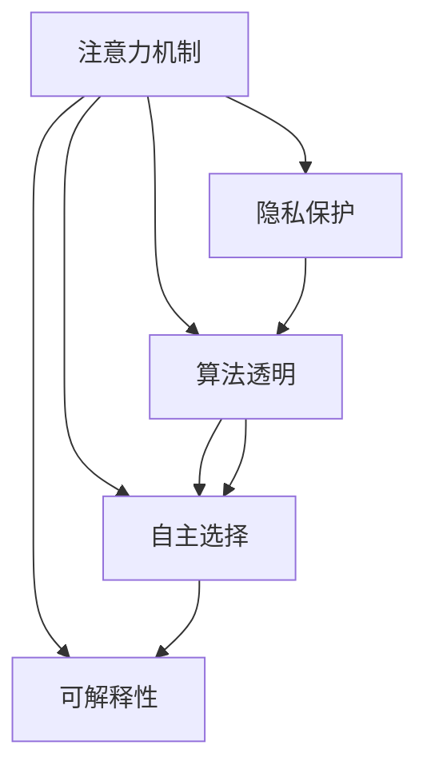

                 

# 注意力自主权维护器：AI时代的个人选择卫士

> 关键词：
- 人工智能
- 注意力机制
- 自主选择
- 个人隐私
- 数据保护
- 算法透明
- 伦理决策

## 1. 背景介绍

### 1.1 问题由来

随着人工智能技术的迅猛发展，算法已渗透到我们生活的方方面面。智能推荐系统、智能搜索、个性化广告、智能客服等应用在提高我们生活便利性的同时，也不可避免地涉及我们的个人信息和行为习惯。这些算法不仅从数据中学习我们的偏好，甚至有时还预测我们的行为，引发了关于个人隐私保护和自主选择的广泛讨论。

越来越多的研究表明，用户对于算法的“幕后”决策机制一无所知，且很难对其进行控制。这不仅让人们对于算法的决策过程失去了一定的“自主权”，也对个人的隐私保护构成了潜在的风险。因此，如何维护用户的注意力自主权，保障算法的透明度和可解释性，成为AI时代必须面对的重要问题。

### 1.2 问题核心关键点

目前，研究重点主要集中在如何利用算法自主性、透明性和可解释性，来实现对用户注意力和选择的控制。这些问题核心关键点如下：

- 用户如何主动干预和控制算法行为？
- 算法是否应该透明，用户是否可以访问和解释其决策过程？
- 如何平衡算法的性能与用户的隐私和自由？

本博客将重点探讨注意力机制，作为一种提升算法透明性和可解释性的技术手段，如何在AI时代维护用户的选择自由，从而构建一个更加公平、公正的数字社会。

## 2. 核心概念与联系

### 2.1 核心概念概述

为更好地理解如何利用注意力机制维护用户的注意力自主权，本节将介绍几个密切相关的核心概念：

- **注意力机制（Attention Mechanism）**：一种机制，用于在输入序列中动态分配注意力权重，重点关注与当前任务相关的部分，忽略其他无关部分。广泛应用于机器翻译、文本摘要、语音识别等领域，能够提升算法的精度和效率。

- **自主选择（Autonomy）**：用户对自己决策的掌控程度，包括自主获取信息、做出选择、控制行为的能力。在AI时代，如何通过技术手段增强用户的自主选择，成为了维护用户注意力的关键。

- **隐私保护（Privacy Protection）**：保护个人数据不被未授权访问和使用，确保用户数据在处理过程中的安全性和保密性。隐私保护是实现用户自主选择的先决条件。

- **算法透明（Algorithm Transparency）**：算法决策过程的公开透明，用户可以访问和理解算法如何做出决策。透明性是提升用户信任和自主性的重要手段。

- **可解释性（Explainability）**：算法决策的可解释程度，即用户可以理解算法做出的具体决策和推理过程。可解释性是构建可信AI系统的基础。

这些核心概念之间的逻辑关系可以通过以下Mermaid流程图来展示：



这个流程图展示了几项核心概念及其之间的关系：

1. 注意力机制通过动态分配关注重点，帮助用户控制和理解算法决策。
2. 隐私保护和算法透明是实现自主选择的前提条件。
3. 可解释性是提升用户对算法信任和自主性的关键手段。

## 3. 核心算法原理 & 具体操作步骤
### 3.1 算法原理概述

注意力机制的原理在于通过在输入序列中动态分配注意力权重，使模型能够集中关注与当前任务相关的部分，忽略其他无关部分。在AI系统中，这种机制可以有效提升模型的泛化能力、提升决策的精确度，并增强模型的可解释性。

注意力机制一般由三个核心组件构成：

- **注意力头**：对输入序列中的每个元素进行编码，生成一系列的注意力分数。
- **注意力向量**：通过多头注意力机制，结合多组注意力头生成综合的注意力向量。
- **注意力权重**：根据注意力向量计算出权重矩阵，确定输入序列中每个元素的重要性。

这些组件共同作用，使模型能够根据当前任务需求动态调整注意力，提升决策的准确性和效率。

### 3.2 算法步骤详解

1. **输入预处理**：将原始输入序列转化为模型能够处理的向量形式。例如，将文本转化为词嵌入向量，将图像转化为卷积特征向量等。

2. **注意力计算**：计算每个注意力头对输入序列中每个元素的注意力分数。一般通过点积或softmax函数计算得到。

3. **多头注意力合并**：将多个注意力头的输出进行合并，得到综合的注意力向量。

4. **权重计算**：根据注意力向量计算出权重矩阵，确定输入序列中每个元素的重要性。

5. **结果输出**：将输入序列中加权后的元素作为模型输出的特征表示。

### 3.3 算法优缺点

注意力机制在AI系统中具有以下优点：

- 提升了模型对输入序列的关注能力和决策精度。
- 增强了模型的可解释性，使得决策过程更加透明和可理解。
- 有助于提升模型的泛化能力，增强其在复杂环境下的适应性。

但同时，注意力机制也存在以下缺点：

- 计算复杂度高，特别是在大规模数据集上，需要大量的计算资源。
- 对于注意力分配的解释存在争议，不同的应用场景可能需要不同的解释方法。
- 过多的注意力机制可能导致模型过度关注某些无关信息，引发过拟合问题。

### 3.4 算法应用领域

注意力机制不仅在机器翻译、文本摘要等典型NLP任务中发挥了重要作用，还在图像识别、语音识别、视频处理等多个领域得到了广泛应用。通过提升算法的泛化能力和决策精度，显著提升了AI系统的性能和可靠性。

在未来，随着AI系统的普及和深化，注意力机制将在更多的领域得到应用，帮助用户更好地理解和管理他们的注意力自主权，提升AI系统的公平性和公正性。

## 4. 数学模型和公式 & 详细讲解 & 举例说明

### 4.1 数学模型构建

注意力机制的数学模型主要包含两个部分：注意力分数的计算和注意力向量的合并。

- 注意力分数计算公式：
$$
\text{Attention Score}(i,j) = \text{softmax}(\text{Score}(i,j))
$$
其中，$\text{Score}(i,j)$ 表示输入序列中第 $i$ 个元素和第 $j$ 个元素之间的注意力分数，$\text{softmax}$ 函数将分数归一化为概率分布。

- 注意力向量计算公式：
$$
\text{Attention Vector} = \text{Weight} \times \text{Input Vector}
$$
其中，$\text{Weight}$ 是注意力向量，表示输入序列中各个元素的重要性权重。

### 4.2 公式推导过程

以一个简单的单头注意力计算为例，推导其计算过程。

假设输入序列为 $x_1, x_2, ..., x_n$，注意力分数矩阵为 $S_{ij}$，注意力向量为 $A_j$。则单头注意力计算公式为：
$$
A_j = \text{softmax}(S_{ij}) \times x_i
$$
这里 $S_{ij}$ 可以通过点积计算得到：
$$
S_{ij} = x_i \cdot x_j^T
$$
因此，最终的注意力向量 $A_j$ 可以表示为：
$$
A_j = \text{softmax}(x_i \cdot x_j^T) \times x_i
$$

### 4.3 案例分析与讲解

以机器翻译任务为例，分析注意力机制的具体应用：

- **输入序列**：输入的源语言文本序列 $x = (x_1, x_2, ..., x_n)$。
- **目标序列**：输出目标语言文本序列 $y = (y_1, y_2, ..., y_m)$。
- **注意力机制**：计算源语言文本序列中每个词和目标语言文本序列中每个词的注意力分数，生成综合的注意力向量，用于指导机器翻译模型的决策过程。

假设模型当前要翻译的单词是 $x_i$，其与目标语言中每个单词 $y_j$ 的注意力分数计算公式为：
$$
\text{Attention Score}(i,j) = \text{softmax}(W_k(x_i) \cdot W_k^T(y_j))
$$
其中 $W_k$ 表示第 $k$ 层的线性变换，$x_i$ 和 $y_j$ 分别表示源语言和目标语言中的单词。

将注意力分数矩阵 $S_{ij}$ 和输入向量 $x_i$ 通过上述公式计算，得到注意力向量 $A_j$，用于指导模型生成下一个目标单词 $y_j$。

## 5. 项目实践：代码实例和详细解释说明
### 5.1 开发环境搭建

在进行注意力机制的应用实践前，我们需要准备好开发环境。以下是使用Python进行TensorFlow开发的环境配置流程：

1. 安装Anaconda：从官网下载并安装Anaconda，用于创建独立的Python环境。

2. 创建并激活虚拟环境：
```bash
conda create -n tf-env python=3.8 
conda activate tf-env
```

3. 安装TensorFlow：根据CUDA版本，从官网获取对应的安装命令。例如：
```bash
conda install tensorflow-gpu=2.8 -c conda-forge
```

4. 安装Flax：
```bash
pip install flax
```

5. 安装各类工具包：
```bash
pip install numpy pandas scikit-learn matplotlib tqdm jupyter notebook ipython
```

完成上述步骤后，即可在`tf-env`环境中开始注意力机制的应用实践。

### 5.2 源代码详细实现

下面以一个简单的注意力机制为例，使用TensorFlow实现并解释其代码实现。

```python
import tensorflow as tf
import flax

class Attention(tf.keras.layers.Layer):
    def __init__(self, num_heads, d_model, dropout=0.1):
        super(Attention, self).__init__()
        self.num_heads = num_heads
        self.d_model = d_model
        self.dropout = dropout
        self.depth = d_model // num_heads
        self.wq = tf.keras.layers.Dense(d_model)
        self.wk = tf.keras.layers.Dense(d_model)
        self.wv = tf.keras.layers.Dense(d_model)
        self.dense = tf.keras.layers.Dense(d_model)
        
    def split_heads(self, x, batch_size):
        x = tf.reshape(x, (batch_size, -1, self.num_heads, self.depth))
        return tf.transpose(x, perm=[0, 2, 1, 3])
    
    def call(self, inputs):
        batch_size = tf.shape(inputs)[0]
        query = self.wq(inputs)
        key = self.wk(inputs)
        value = self.wv(inputs)
        
        query = self.split_heads(query, batch_size)
        key = self.split_heads(key, batch_size)
        value = self.split_heads(value, batch_size)
        
        scaled_attention = tf.matmul(query, key, transpose_b=True)
        scaled_attention = scaled_attention / tf.math.sqrt(tf.cast(self.depth, tf.float32))
        
        attention_weights = tf.nn.softmax(scaled_attention, axis=-1)
        attention_weights = tf.keras.layers.Dropout(self.dropout)(attention_weights)
        
        context_layer = tf.matmul(attention_weights, value)
        context_layer = tf.keras.layers.Dropout(self.dropout)(context_layer)
        
        context_layer = tf.transpose(context_layer, perm=[0, 2, 1, 3])
        context_layer = tf.reshape(context_layer, (batch_size, -1, self.d_model))
        
        output = self.dense(context_layer)
        return output, attention_weights

# 构建一个简单的多层注意力模型
class MultiHeadAttention(tf.keras.layers.Layer):
    def __init__(self, num_heads, d_model, dropout=0.1):
        super(MultiHeadAttention, self).__init__()
        self.layers = [Attention(num_heads, d_model, dropout) for _ in range(3)]
        self.final_dense = tf.keras.layers.Dense(d_model)
        
    def call(self, inputs):
        output = inputs
        for layer in self.layers:
            output, attention_weights = layer(output)
            output = output + attention_weights
        
        output = self.final_dense(output)
        return output
```

这里我们实现了一个简单的多头注意力机制，其中包含了三个头，每层的输出维度为64。在代码中，首先定义了注意力层的参数，包括注意力头的数量、输入维度等。然后，通过`split_heads`方法将输入向量拆分为多个头的注意力表示，再通过`softmax`函数计算注意力权重，并将权重应用到值向量上，生成最终输出的注意力向量。

### 5.3 代码解读与分析

让我们再详细解读一下关键代码的实现细节：

**Attention类**：
- `__init__`方法：初始化注意力层的参数，包括注意力头数、输入维度、dropout等。
- `split_heads`方法：将输入向量拆分为多个头的注意力表示。
- `call`方法：计算注意力分数、权重和输出向量。

**MultiHeadAttention类**：
- `__init__`方法：初始化多个注意力层的参数。
- `call`方法：对多个注意力层进行堆叠，输出最终的注意力向量。

这里实现的注意力机制较为简单，实际上，在实际应用中，多头注意力机制可能会更复杂，包含了更多的注意力头和层数。但核心思想与上述示例一致，即通过计算注意力分数和权重，动态分配注意力资源，使模型能够更加关注与当前任务相关的部分。

## 6. 实际应用场景

### 6.1 智能推荐系统

智能推荐系统广泛应用在电商、社交媒体、内容分发平台等领域，通过学习用户的行为数据，预测用户的兴趣，推荐相关商品或内容。然而，用户对于推荐系统的决策过程知之甚少，缺乏一定的“自主权”。

通过引入注意力机制，智能推荐系统可以更加透明地向用户展示推荐依据，让用户知道系统为什么推荐某个商品或内容。用户可以根据系统的推荐依据，自行调整他们的偏好，从而提升系统的推荐效果，增强用户的满意度和信任感。

### 6.2 智能客服系统

智能客服系统能够帮助企业提高服务效率，提升客户满意度。通过引入注意力机制，客服系统可以更加关注用户的当前问题，忽略其他无关信息，提升回答的准确性和及时性。

用户可以根据系统的回答，自行调整问题的描述，使系统更好地理解他们的需求。例如，用户可以在输入中使用特定的关键词或短语，使系统更加关注其问题的某些部分。这不仅提升了用户体验，也增强了系统的自主性和可解释性。

### 6.3 自然语言处理

自然语言处理（NLP）是AI领域的重要应用之一，包括机器翻译、文本摘要、问答系统等任务。通过引入注意力机制，NLP模型可以更好地理解输入文本的上下文关系，提升模型的泛化能力和决策精度。

例如，在机器翻译中，注意力机制可以帮助模型更好地关注源语言中的关键信息，生成更加流畅和准确的翻译结果。在文本摘要中，注意力机制可以帮助模型抓住文本中的重要信息，生成更加精炼和有用的摘要。

### 6.4 未来应用展望

随着注意力机制的不断发展和应用，其在AI时代维护用户注意力自主权方面将发挥越来越重要的作用。以下是几个可能的未来应用方向：

1. **增强可解释性**：通过更加详细的注意力权重和解释，帮助用户理解算法的决策过程，提升系统的透明性和可解释性。
2. **用户交互**：通过用户与系统的交互，动态调整注意力分配，提升系统的自主性和灵活性。
3. **隐私保护**：通过控制用户关注的信息，保护用户的隐私和数据安全。
4. **个性化推荐**：通过动态调整注意力分配，提升推荐系统的个性化和精准度。

总之，注意力机制在AI时代具有广阔的应用前景，通过提升系统的透明性和可解释性，维护用户的注意力自主权，构建一个更加公平、公正的数字社会。

## 7. 工具和资源推荐
### 7.1 学习资源推荐

为了帮助开发者系统掌握注意力机制的理论基础和实践技巧，这里推荐一些优质的学习资源：

1. **《Neural Information Processing Systems》**：机器学习领域的顶级会议，每年都有大量关于注意力机制的研究论文，帮助理解最新的前沿进展。
2. **《Attention is All You Need》**：Transformer模型的原论文，详细介绍了注意力机制的原理和应用。
3. **Flax官方文档**：Flax是一个高性能的TensorFlow库，用于构建和训练神经网络模型，提供了大量的教程和示例代码，适合学习注意力机制的实现。
4. **HuggingFace官方博客**：HuggingFace是NLP领域的知名社区，提供了大量关于注意力机制的博客和实践指南，帮助理解实际应用中的注意机制。
5. **Deep Learning Specialization**：由Coursera提供的深度学习课程，包含了多个关于注意力机制的视频和作业，适合系统学习注意力机制的原理和应用。

通过对这些资源的学习实践，相信你一定能够快速掌握注意力机制的精髓，并用于解决实际的AI问题。

### 7.2 开发工具推荐

高效的开发离不开优秀的工具支持。以下是几款用于注意力机制开发的常用工具：

1. **TensorFlow**：由Google主导开发的开源深度学习框架，生产部署方便，适合大规模工程应用。
2. **Flax**：Flax是一个高性能的TensorFlow库，用于构建和训练神经网络模型，适合学习注意力机制的实现。
3. **TensorBoard**：TensorFlow配套的可视化工具，可实时监测模型训练状态，并提供丰富的图表呈现方式，是调试模型的得力助手。
4. **Weights & Biases**：模型训练的实验跟踪工具，可以记录和可视化模型训练过程中的各项指标，方便对比和调优。
5. **PyTorch**：基于Python的开源深度学习框架，灵活动态的计算图，适合快速迭代研究。

合理利用这些工具，可以显著提升注意力机制的开发效率，加快创新迭代的步伐。

### 7.3 相关论文推荐

注意力机制的发展源于学界的持续研究。以下是几篇奠基性的相关论文，推荐阅读：

1. **Attention is All You Need**：Transformer模型的原论文，提出了注意力机制的基本框架，奠定了注意力机制在NLP领域的应用基础。
2. **Towards Explainable Deep Learning**：论文探讨了深度学习的可解释性问题，详细介绍了注意力机制在提升模型可解释性方面的应用。
3. **Dynamic Attention for Recommendation Systems**：论文研究了动态注意力机制在推荐系统中的应用，提升了推荐系统的个性化和精准度。
4. **Self-Attention Mechanism in Natural Language Processing**：论文详细介绍了注意力机制在NLP领域的应用，包括机器翻译、文本摘要等任务。
5. **Neuro-Symbolic Learning**：论文探讨了神经网络和符号逻辑的结合，通过引入注意力机制，增强了模型的可解释性和鲁棒性。

这些论文代表了大注意力机制的发展脉络。通过学习这些前沿成果，可以帮助研究者把握学科前进方向，激发更多的创新灵感。

## 8. 总结：未来发展趋势与挑战

### 8.1 总结

本文对注意力机制在大语言模型中的应用进行了全面系统的介绍。首先阐述了注意力机制的原理和作用，明确了其在大语言模型中的应用价值。其次，从原理到实践，详细讲解了注意力机制的数学模型和计算步骤，给出了注意力机制的代码实现。同时，本文还广泛探讨了注意力机制在智能推荐系统、智能客服系统、自然语言处理等多个领域的应用前景，展示了注意力机制的广泛应用价值。

通过本文的系统梳理，可以看到，注意力机制在AI时代具有重要的应用价值，不仅提升了模型的泛化能力和决策精度，还增强了模型的透明性和可解释性。在未来，随着注意力机制的不断发展和应用，其在维护用户注意力自主权方面将发挥越来越重要的作用。

### 8.2 未来发展趋势

展望未来，注意力机制的发展将呈现以下几个趋势：

1. **多样化的注意力机制**：随着应用场景的多样化，将出现更多形式的注意力机制，如多头注意力、自适应注意力等，提升模型的泛化能力和决策精度。
2. **与更多技术融合**：注意力机制将与其他AI技术进行更深入的融合，如知识表示、因果推理、强化学习等，提升模型的综合性能和应用范围。
3. **隐私保护**：随着用户隐私意识的增强，如何通过注意力机制保护用户隐私，将成为重要的研究方向。
4. **实时性**：在实时性要求较高的应用场景中，如智能客服、实时推荐等，如何通过注意力机制提升系统的实时性和响应速度，将是重要的优化方向。
5. **跨领域应用**：在更多领域，如医疗、金融等，如何通过注意力机制提升模型的泛化能力和决策精度，将是重要的研究方向。

以上趋势凸显了注意力机制在AI时代的广阔前景，这些方向的探索发展，必将进一步提升AI系统的性能和可靠性，构建一个更加公平、公正的数字社会。

### 8.3 面临的挑战

尽管注意力机制在大语言模型中已经取得了显著成果，但在其应用过程中，仍然面临诸多挑战：

1. **计算复杂度高**：注意力机制的计算复杂度较高，特别是在大规模数据集上，需要大量的计算资源。
2. **注意力分配争议**：对于注意力分配的解释存在争议，不同的应用场景可能需要不同的解释方法。
3. **过拟合问题**：过多的注意力机制可能导致模型过度关注某些无关信息，引发过拟合问题。
4. **数据隐私问题**：在数据驱动的推荐系统中，如何保护用户隐私，防止数据泄露，将是重要的挑战。
5. **系统透明性**：如何通过注意力机制提升系统的透明性和可解释性，增强用户对系统的信任，将是重要的研究方向。

### 8.4 研究展望

面对注意力机制面临的这些挑战，未来的研究需要在以下几个方面寻求新的突破：

1. **优化计算复杂度**：开发更加高效的计算模型，减少注意力机制的计算复杂度，提升系统的实时性和响应速度。
2. **多模态注意力机制**：将视觉、语音等多模态信息与文本信息进行融合，提升模型的综合感知能力。
3. **动态注意力机制**：根据用户行为和环境变化动态调整注意力分配，提升模型的灵活性和适应性。
4. **隐私保护机制**：设计更加安全的数据保护机制，防止数据泄露和隐私泄露。
5. **可解释性增强**：通过更多的解释方法和技术手段，提升模型的透明性和可解释性，增强用户对系统的信任。

这些研究方向将进一步推动注意力机制的深入发展和应用，为构建一个更加公平、公正的数字社会贡献力量。

## 9. 附录：常见问题与解答

**Q1：注意力机制是否只适用于深度学习模型？**

A: 注意力机制最初是用于深度学习模型的，但在其他机器学习算法中也得到了应用。例如，在决策树和线性回归中，注意力机制也可以用来提高模型的性能和泛化能力。

**Q2：注意力机制是否可以用于所有类型的NLP任务？**

A: 注意力机制可以应用于多种NLP任务，如机器翻译、文本摘要、问答系统等。但不同任务中的注意力机制实现方式可能有所不同，需要根据具体任务进行调整。

**Q3：注意力机制如何防止过拟合？**

A: 注意力机制可以通过多种方式防止过拟合，例如引入正则化、动态调整注意力分配等。还可以结合其他技术手段，如Dropout、Early Stopping等，进一步提升模型的泛化能力。

**Q4：注意力机制是否能够提升系统的透明性和可解释性？**

A: 是的，注意力机制可以提升系统的透明性和可解释性。通过展示注意力权重，用户可以理解系统的决策依据，提升对系统的信任和理解。

**Q5：注意力机制是否能够保护用户隐私？**

A: 在推荐系统和智能客服系统中，注意力机制可以通过控制用户关注的信息，保护用户的隐私和数据安全。但需要注意，模型的训练和应用过程中也需要采取数据保护措施。

---

作者：禅与计算机程序设计艺术 / Zen and the Art of Computer Programming

