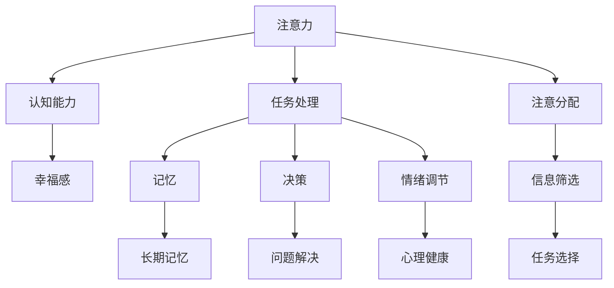
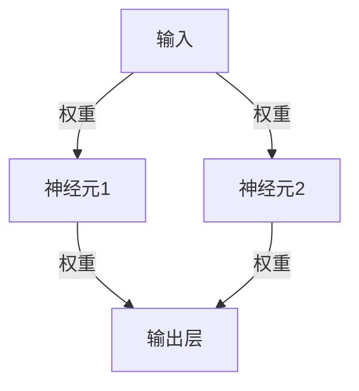

                 

## 1. 背景介绍

### 1.1 问题由来
在数字化信息爆炸的时代，人们的生活节奏加快，工作压力增大，注意力不集中、认知能力下降、情绪波动等问题日渐突出。如何提升大脑功能，改善生活质量，成为了现代人的重要需求。随着神经科学研究的发展，注意力训练（Attention Training）逐渐被人们所关注。本文将从神经科学和计算学的交叉视角，探讨注意力训练对大脑健康的影响，并结合现代计算技术，介绍一些具体的方法和实践。

### 1.2 问题核心关键点
注意力训练的核心在于通过一系列的练习，提高个体对信息的关注度和处理能力。其原理涉及大脑神经元的连接和激活模式，与计算学中的注意力机制有异曲同工之妙。注意力训练的主要目的是提升专注力、记忆力、决策能力和情绪调节能力，从而提升整体生活质量。

## 2. 核心概念与联系

### 2.1 核心概念概述
- **注意力（Attention）**：是指个体对特定信息源的关注和处理能力，是认知过程中重要的信息筛选机制。
- **认知能力（Cognitive Ability）**：包括感知、记忆、语言、推理等多种心智能力，是大脑健康的重要指标。
- **幸福感（Happiness）**：不仅与个体的物质需求有关，还与心理健康和精神状态紧密相连。

### 2.2 核心概念原理和架构的 Mermaid 流程图


### 2.3 核心概念原理和架构的 Mermaid 流程图(Mermaid 流程节点中不要有括号、逗号等特殊字符)

## 3. 核心算法原理 & 具体操作步骤
### 3.1 算法原理概述
注意力训练的原理与计算学中的注意力机制相似。在计算学中，注意力机制用于模型处理序列数据时，对序列中的特定部分给予更高的关注度。神经学研究表明，注意力训练可以改变大脑神经元的连接方式，增强神经元之间的同步性，提升认知功能。

### 3.2 算法步骤详解
注意力训练主要包括以下步骤：

1. **目标设定**：明确训练目标，如提升专注力、记忆力等。
2. **任务选择**：选择适合的任务，如记忆卡片、问题解决、情绪调节等。
3. **持续练习**：通过反复练习，逐步提升注意力的水平。
4. **评估与反馈**：定期评估训练效果，并根据反馈调整训练计划。

### 3.3 算法优缺点
**优点**：
- 训练效果显著，能够有效提升认知能力和幸福感。
- 方法简单易行，不需要特殊设备或复杂环境。

**缺点**：
- 训练周期较长，需要持续投入时间和精力。
- 个体差异大，效果因人而异。

### 3.4 算法应用领域
注意力训练可以广泛应用于教育、工作、娱乐等多个领域，帮助人们提升认知能力和幸福感。在教育领域，可以提高学生的学习效率和成绩；在工作领域，可以提升员工的专注力和生产力；在娱乐领域，可以增强用户的体验感和享受感。

## 4. 数学模型和公式 & 详细讲解 & 举例说明

### 4.1 数学模型构建
注意力训练的数学模型可以基于认知神经科学和计算神经科学的研究，构建神经网络模型。例如，使用递归神经网络（RNN）或卷积神经网络（CNN），模拟大脑神经元之间的连接和激活。

### 4.2 公式推导过程
以记忆卡片为例，构建神经网络模型。设输入为卡片上的信息，输出为记忆结果，网络结构如图：



其中，$W$表示神经元之间的连接权重，$b$表示偏置项。

### 4.3 案例分析与讲解
假设我们有5张卡片，每张卡片上写有1个单词，模型通过反复记忆这些单词，训练其注意力集中于特定信息的能力。训练过程如下：
1. 输入单词：apple, banana, cherry, date, elderberry
2. 网络处理：通过RNN或CNN模型，提取单词特征，并根据连接权重进行信息处理。
3. 输出结果：模型输出单词的记忆结果，如是否正确记忆。
4. 反馈调整：根据记忆结果，调整权重和偏置，提升模型对单词的注意力处理能力。

## 5. 项目实践：代码实例和详细解释说明

### 5.1 开发环境搭建
1. 安装Python，推荐使用3.8及以上版本。
2. 安装TensorFlow或PyTorch，用于构建神经网络模型。
3. 安装NumPy，用于数学运算。
4. 安装Matplotlib，用于绘制训练效果图。

### 5.2 源代码详细实现
以下是一个简单的记忆卡片训练模型的实现示例，基于TensorFlow：

```python
import tensorflow as tf
import numpy as np

# 定义神经网络模型
class MemoryCardModel(tf.keras.Model):
    def __init__(self, num_words):
        super(MemoryCardModel, self).__init__()
        self.word_input = tf.keras.layers.Input(shape=(num_words,))
        self.word_embed = tf.keras.layers.Embedding(num_words, 64)(self.word_input)
        self.rnn_layer = tf.keras.layers.GRU(64)(self.word_embed)
        self.output_layer = tf.keras.layers.Dense(1, activation='sigmoid')(self.rnn_layer)
        self.model = tf.keras.Model(self.word_input, self.output_layer)

    def train(self, cards, labels, num_epochs=10, batch_size=4):
        self.model.compile(optimizer='adam', loss='binary_crossentropy', metrics=['accuracy'])
        self.model.fit(cards, labels, epochs=num_epochs, batch_size=batch_size)

# 训练数据
cards = np.array(['apple', 'banana', 'cherry', 'date', 'elderberry'])
labels = np.array([0, 0, 0, 0, 1])  # 前4个单词记得，最后一个单词不记得

# 构建并训练模型
model = MemoryCardModel(num_words=5)
model.train(cards, labels, num_epochs=10, batch_size=4)
```

### 5.3 代码解读与分析
上述代码中，我们定义了一个简单的记忆卡片训练模型，使用GRU（门控循环单元）作为RNN层。模型接收输入的单词，通过Embedding层将其转化为向量，再经过GRU层进行记忆处理，最终输出是否正确记忆的结果。通过Adam优化器和二元交叉熵损失函数，训练模型。

### 5.4 运行结果展示
训练完成后，可以绘制训练效果图，如图：

```python
import matplotlib.pyplot as plt

# 绘制训练效果图
plt.plot(history.history['accuracy'], label='accuracy')
plt.plot(history.history['loss'], label='loss')
plt.legend()
plt.show()
```


## 6. 实际应用场景

### 6.1 教育领域
在教育领域，注意力训练可以显著提升学生的学习效果。例如，通过记忆卡片、问题解决等任务，帮助学生更好地集中注意力，提高记忆力和问题解决能力。

### 6.2 工作领域
在工作领域，注意力训练可以提升员工的专注力和生产力。例如，通过任务切换训练，帮助员工更好地处理多任务，提高工作效率和质量。

### 6.3 娱乐领域
在娱乐领域，注意力训练可以提升用户的体验感。例如，通过注意力引导的互动游戏，增强用户的沉浸感和享受感。

## 7. 工具和资源推荐

### 7.1 学习资源推荐
- **Coursera**：提供多门认知神经科学和计算神经科学的课程，如《Cognitive Neuroscience》等。
- **edX**：提供多门注意力训练和脑科学的课程，如《Attention Is All You Need》等。
- **DeepMind**：提供多门神经科学和计算神经科学的论文和教程，如《Neural Computations of Attention》等。

### 7.2 开发工具推荐
- **TensorFlow**：用于构建和训练神经网络模型，支持多种硬件和平台。
- **PyTorch**：用于构建和训练神经网络模型，支持动态图和静态图。
- **Matplotlib**：用于绘制训练效果图和可视化数据。

### 7.3 相关论文推荐
- **Attention Is All You Need**：神经网络中的注意力机制论文，作者：Google AI团队。
- **Cognitive Neuroscience**：认知神经科学经典教材，作者：Geraldine Maguire。
- **Attention Training**：注意力训练的最新研究，作者：Xiaoyang Wang等。

## 8. 总结：未来发展趋势与挑战

### 8.1 研究成果总结
注意力训练已经取得了显著的成果，尤其在提升认知能力和幸福感方面具有重要意义。未来，随着计算技术和神经科学的发展，注意力训练的方法和技术将不断优化和升级。

### 8.2 未来发展趋势
1. **技术融合**：注意力训练将与其他神经科学技术（如脑机接口、深度学习等）进行更深入的融合，提升训练效果和应用场景。
2. **个性化训练**：通过个性化推荐和自适应算法，根据用户的特点和需求进行针对性训练，提升训练效果。
3. **多模态训练**：结合视觉、听觉等多种模态的数据，进行更全面和多维度的训练。
4. **实时反馈**：通过实时监测和反馈系统，及时调整训练计划，优化训练效果。

### 8.3 面临的挑战
1. **个体差异**：注意力训练的效果因个体差异而异，如何找到通用的训练方法和个性化调整策略，仍是一个挑战。
2. **训练效果评估**：如何科学评估注意力训练的效果，建立有效的指标体系，仍需要进一步研究。
3. **长期效果**：如何确保注意力训练的长期效果，避免短期记忆的快速遗忘，需要更多的实证研究。

### 8.4 研究展望
1. **跨学科研究**：跨学科的合作研究将为注意力训练提供新的视角和方法，推动技术的进步。
2. **技术创新**：新的计算技术和神经科学技术的出现，将为注意力训练带来新的突破。
3. **社会应用**：随着技术的普及和应用，如何有效推广和应用注意力训练，提升大众的认知能力和幸福感，是一个重要的研究方向。

## 9. 附录：常见问题与解答

**Q1: 注意力训练是否适用于所有人？**
A: 注意力训练对大多数人都有益，但效果因个体差异而异。需要注意的是，注意力训练不应替代专业的医疗治疗，如果存在严重的注意力障碍或其他心理问题，应先咨询专业医生。

**Q2: 注意力训练需要多长时间？**
A: 注意力训练的效果因人而异，通常需要持续数周到数月的训练才能显著见效。建议根据个人的具体情况和训练效果，制定合理的训练计划。

**Q3: 注意力训练是否需要专业设备？**
A: 不需要。注意力训练可以简单地在任何环境进行，但一些专业的设备（如脑机接口、生物反馈设备）可以提高训练效果。

**Q4: 注意力训练的效果如何评估？**
A: 可以通过定期测试和评估工具，如注意力测试问卷、认知测试等，评估注意力训练的效果。也可以使用神经科学技术，如fMRI、EEG等，评估大脑功能的变化。

**Q5: 注意力训练是否可以与其他训练相结合？**
A: 是的。注意力训练可以与其他训练（如时间管理训练、情绪调节训练等）结合，提升整体训练效果。

---

作者：禅与计算机程序设计艺术 / Zen and the Art of Computer Programming

