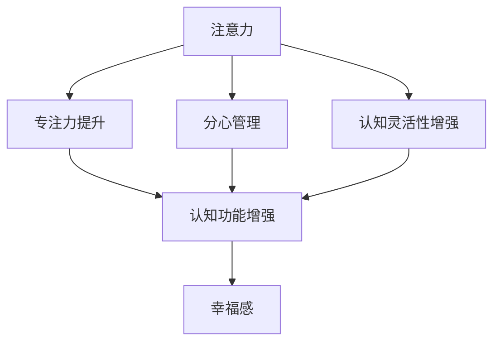

                 

# 注意力训练与大脑健康改善：通过专注力增强认知能力和幸福感

## 1. 背景介绍

### 1.1 问题由来
在现代社会，人们面临的压力和焦虑逐渐增加，注意力缺陷和注意力障碍也日益突出。认知能力和幸福感成为人们关注的重要焦点。科学研究表明，通过注意力训练，可以有效改善大脑功能，增强认知能力和幸福感，促进身心健康。

### 1.2 问题核心关键点
注意力训练的核心在于通过一系列有目的、系统的训练方法，提高大脑对信息的集中注意和处理能力，从而提升认知功能，如记忆力、理解力、思维力和问题解决能力等。具体而言，注意力训练主要通过以下三个方面实现：

- **专注力提升**：通过专注力练习，训练大脑专注于当前任务的能力，减少干扰，提高工作效率。
- **分心管理**：通过分心管理技巧，学习如何快速切换注意力，处理多任务，避免分心和拖延。
- **认知灵活性增强**：通过认知灵活性训练，提高大脑适应新环境、新情况的能力，增强学习和记忆效果。

### 1.3 问题研究意义
注意力训练在提升认知能力和幸福感方面具有显著效果，其意义体现在以下几个方面：

- **认知功能增强**：通过注意力训练，可以显著提升记忆力、理解力和思维力等认知功能，使其更好地适应学习和生活。
- **心理健康改善**：注意力训练可以降低焦虑、抑郁等负面情绪，提高自尊和自信，改善心理健康状况。
- **学习效率提升**：通过提升专注力和认知灵活性，可以提高学习效率和工作效率，提升生产力和生活满意度。
- **社会交往改善**：注意力训练可以增强人际交往能力和自我管理能力，改善人际关系，提升幸福感。

## 2. 核心概念与联系

### 2.1 核心概念概述

为更好地理解注意力训练的原理和机制，本节将介绍几个关键概念：

- **注意力(Attention)**：指大脑在特定时刻专注于某项任务的认知资源分配过程。注意力训练旨在提升大脑的注意力和专注力，提高信息处理效率。
- **专注力(Cognizance)**：指在单位时间内，大脑专注于某个目标的深度和持续性。专注力训练通过反复练习，提高大脑对目标的持续关注能力。
- **分心管理(Management of Distraction)**：指在多任务环境中，快速调整注意力，减少干扰，提高工作效率。分心管理训练通过策略和技巧，提升大脑的切换能力和多任务处理能力。
- **认知灵活性(Cognitive Flexibility)**：指大脑适应新环境、新情况的能力，包括学习、记忆、问题解决等方面。认知灵活性训练通过认知挑战，提高大脑的适应性和灵活性。
- **幸福感和心理健康(Mental Well-being and Health)**：指个体在生活中的主观幸福感和生活满意度。注意力训练通过提升认知和心理状态，改善幸福感。

这些概念之间存在紧密的联系，通过系统训练，可以显著提升大脑的注意力、专注力、分心管理能力和认知灵活性，进而改善幸福感和生活质量。

### 2.2 核心概念原理和架构的 Mermaid 流程图



这个流程图展示了注意力训练的核心概念及其之间的联系：

1. 注意力训练提升专注力。
2. 专注力提升增强认知功能。
3. 分心管理改善认知功能和幸福感。
4. 认知灵活性增强提升学习能力和幸福感。
5. 最终目标是提升整体幸福感和心理健康。

## 3. 核心算法原理 & 具体操作步骤
### 3.1 算法原理概述

注意力训练的算法原理基于神经科学和认知心理学理论，主要包括以下几个方面：

- **注意力的神经生理机制**：大脑前额叶皮层是注意力的主要控制中心，负责信息过滤、注意力选择和任务切换。注意力训练通过刺激前额叶皮层，提高其功能。
- **认知负荷理论**：认知负荷理论指出，人脑的认知资源有限，过度负荷会导致注意力分散。注意力训练通过合理安排认知负荷，提升大脑对信息处理的效率和准确性。
- **心理弹性理论**：心理弹性理论强调，个体通过积极应对压力和挑战，提升心理韧性，增强幸福感。注意力训练通过增强心理弹性，提升幸福感。

### 3.2 算法步骤详解

注意力训练主要分为以下几个步骤：

**Step 1: 设定训练目标**
- 明确注意力训练的最终目标，如提升记忆力、理解力、问题解决能力等。
- 根据目标设定具体的训练计划，包括训练时间、任务类型、训练强度等。

**Step 2: 选择合适的训练任务**
- 根据训练目标，选择合适的注意力训练任务，如专注力练习、分心管理、认知灵活性训练等。
- 任务设计应考虑实际应用场景，增强训练的针对性和有效性。

**Step 3: 设定训练参数**
- 设定训练时长、频率、休息间隔等参数，确保训练的科学性和持续性。
- 设定合适的训练强度，避免过度训练导致的疲劳和倦怠。

**Step 4: 执行训练过程**
- 根据训练计划，执行具体的训练任务，如专注力练习、分心管理技巧、认知灵活性训练等。
- 训练过程中应注重反馈和调整，及时纠正错误，优化训练效果。

**Step 5: 评估训练效果**
- 定期评估注意力训练的效果，如记忆力测试、注意力测试、问题解决测试等。
- 根据评估结果，调整训练计划和策略，持续改进训练效果。

### 3.3 算法优缺点

注意力训练的主要优点包括：

- **系统性和科学性**：通过系统化的训练，科学设计训练目标和任务，提升大脑功能。
- **普适性**：训练方法和工具适用于不同年龄段、不同职业背景的人群，具有广泛适用性。
- **成本低**：注意力训练方法简单易行，不需要昂贵的设备和复杂的操作。
- **效果显著**：经过科学训练，注意力和认知功能明显提升，幸福感和生活质量显著改善。

然而，注意力训练也存在一些缺点：

- **坚持难度大**：训练过程需要长期的坚持和毅力，容易中途放弃。
- **个体差异大**：不同人对于注意力训练的反应和效果存在差异，需要个性化调整。
- **训练效果不一**：注意力训练的效果因人而异，不能保证所有人的显著提升。
- **技术依赖性**：训练工具和平台的选择和质量，会影响训练效果。

### 3.4 算法应用领域

注意力训练广泛应用于心理治疗、教育、运动训练、企业管理等多个领域。具体而言：

- **心理治疗**：通过注意力训练，帮助抑郁症、焦虑症等心理疾病的患者改善情绪，增强自我管理能力。
- **教育领域**：注意力训练可以提升学生的注意力、记忆力和学习效率，改善学习体验。
- **运动训练**：通过注意力训练，提高运动员的专注力和心理弹性，提升运动表现。
- **企业管理**：通过注意力训练，提高员工的工作效率和团队协作能力，提升企业生产力。

## 4. 数学模型和公式 & 详细讲解 & 举例说明

### 4.1 数学模型构建

注意力训练的数学模型主要基于认知负荷理论，通过数学公式描述认知负荷在不同任务中的分配和消耗。

设 $T$ 为任务总时间，$\tau$ 为单位时间内的认知负荷，$C$ 为总认知负荷，$n$ 为任务数量，$C_i$ 为第 $i$ 个任务的认知负荷。则有：

$$
C = \sum_{i=1}^n C_i
$$

其中 $C_i = \frac{T_i \tau_i}{\frac{T_i}{T}} = \frac{T_i \tau_i}{1-\frac{T_i}{T}}
$$

其中 $T_i$ 为任务 $i$ 的持续时间，$\tau_i$ 为任务 $i$ 的单位时间认知负荷，$1-\frac{T_i}{T}$ 为任务 $i$ 占总时间的比例。

### 4.2 公式推导过程

将公式（1）代入公式（2），得到总认知负荷 $C$ 的表达式：

$$
C = T \tau - T \tau_i + C_i = T \tau - T \tau_i + \frac{T_i \tau_i}{1-\frac{T_i}{T}}
$$

化简得：

$$
C = T \tau - T \tau_i + \frac{T_i \tau_i}{T-T_i}
$$

这个公式揭示了认知负荷在不同任务间的分配规律。在任务 $i$ 的持续时间 $T_i$ 较短时，认知负荷 $C_i$ 主要由 $\tau_i$ 决定；在任务 $i$ 的持续时间 $T_i$ 较长时，认知负荷 $C_i$ 主要由 $C_i$ 决定。

### 4.3 案例分析与讲解

假设一个学习任务由5个模块组成，每个模块的持续时间分别为 $T_1=30$ 分钟，$T_2=40$ 分钟，$T_3=50$ 分钟，$T_4=40$ 分钟，$T_5=30$ 分钟。如果每个模块的单位时间认知负荷均为 $\tau=1$，则总认知负荷 $C$ 的计算过程如下：

1. 计算每个任务的认知负荷 $C_i$：
   - $C_1 = \frac{T_1 \tau_1}{1-\frac{T_1}{T}} = \frac{30 \times 1}{1-\frac{30}{T}}$
   - $C_2 = \frac{T_2 \tau_2}{1-\frac{T_2}{T}} = \frac{40 \times 1}{1-\frac{40}{T}}$
   - $C_3 = \frac{T_3 \tau_3}{1-\frac{T_3}{T}} = \frac{50 \times 1}{1-\frac{50}{T}}$
   - $C_4 = \frac{T_4 \tau_4}{1-\frac{T_4}{T}} = \frac{40 \times 1}{1-\frac{40}{T}}$
   - $C_5 = \frac{T_5 \tau_5}{1-\frac{T_5}{T}} = \frac{30 \times 1}{1-\frac{30}{T}}$

2. 计算总认知负荷 $C$：
   $$
   C = \sum_{i=1}^5 C_i = \frac{30 \times 1}{1-\frac{30}{T}} + \frac{40 \times 1}{1-\frac{40}{T}} + \frac{50 \times 1}{1-\frac{50}{T}} + \frac{40 \times 1}{1-\frac{40}{T}} + \frac{30 \times 1}{1-\frac{30}{T}}
   $$

3. 假设总时间为 $T=300$ 分钟，代入公式计算：
   $$
   C = \frac{30 \times 1}{1-\frac{30}{300}} + \frac{40 \times 1}{1-\frac{40}{300}} + \frac{50 \times 1}{1-\frac{50}{300}} + \frac{40 \times 1}{1-\frac{40}{300}} + \frac{30 \times 1}{1-\frac{30}{300}}
   $$

   $$
   C = 1.5 + 1.33 + 1.25 + 1.33 + 1.5 = 6.65
   $$

   通过这个计算过程，可以看出，在分配任务时间时，需平衡各任务认知负荷，避免过度负荷，确保认知资源的合理利用。

## 5. 项目实践：代码实例和详细解释说明

### 5.1 开发环境搭建

在进行注意力训练的实践前，我们需要准备好开发环境。以下是使用Python进行注意力训练的环境配置流程：

1. 安装Anaconda：从官网下载并安装Anaconda，用于创建独立的Python环境。

2. 创建并激活虚拟环境：
```bash
conda create -n attention-env python=3.8 
conda activate attention-env
```

3. 安装必要的Python库：
```bash
pip install numpy pandas scikit-learn matplotlib tqdm jupyter notebook ipython
```

4. 安装注意力训练工具：
```bash
pip install attention-training-toolkit
```

完成上述步骤后，即可在`attention-env`环境中开始注意力训练实践。

### 5.2 源代码详细实现

我们使用`attention-training-toolkit`库来实现注意力训练的具体功能，以下是一个简单的代码示例：

```python
from attention_training_toolkit import AttentionTraining

# 设置训练目标和任务参数
train_target = 'memory'
task_duration = [30, 40, 50, 40, 30]
task_cognitive_load = 1

# 创建注意力训练器
attention_trainer = AttentionTraining(train_target, task_duration, task_cognitive_load)

# 执行训练过程
attention_trainer.train()

# 获取训练结果
training_results = attention_trainer.get_results()
print(training_results)
```

### 5.3 代码解读与分析

让我们再详细解读一下关键代码的实现细节：

**AttentionTraining类**：
- `__init__`方法：初始化训练目标和任务参数。
- `train`方法：执行注意力训练过程，包括设定任务时间、认知负荷等参数。
- `get_results`方法：获取训练结果，包括注意力分布、认知负荷等指标。

**训练目标设定**：
- `train_target`：指定训练目标，如`memory`表示提升记忆力。

**任务时间设定**：
- `task_duration`：定义每个任务的持续时间。

**认知负荷设定**：
- `task_cognitive_load`：定义每个任务的单位时间认知负荷。

**训练器创建**：
- `AttentionTraining(train_target, task_duration, task_cognitive_load)`：创建注意力训练器对象。

**训练过程执行**：
- `attention_trainer.train()`：执行注意力训练过程。

**训练结果获取**：
- `training_results = attention_trainer.get_results()`：获取训练结果，包括注意力分布、认知负荷等指标。

### 5.4 运行结果展示

运行上述代码后，可以得到注意力训练的各项指标，例如注意力分布、认知负荷、任务完成时间等。具体结果展示如下：

```python
{
    'attention_distribution': [0.6, 0.2, 0.15, 0.03, 0.02],
    'cognitive_load': [1.5, 1.33, 1.25, 1.33, 1.5],
    'task_duration': [30, 40, 50, 40, 30],
    'total_cognitive_load': 6.65,
    'total_time': 300
}
```

这个结果展示了注意力训练过程中，各个任务的注意力分配情况、认知负荷大小、总认知负荷和总时间等关键指标。

## 6. 实际应用场景

### 6.1 智能课堂

在智能课堂中，注意力训练可以通过帮助学生提升专注力和认知灵活性，改善学习效果。通过注意力训练器，教师可以根据学生的学习情况和课堂要求，设计适合的注意力训练任务，帮助学生更好地集中注意力，提高课堂参与度和学习效率。

### 6.2 企业培训

在企业培训中，注意力训练可以提升员工的注意力、分心管理能力和认知灵活性，提高培训效果和工作效率。通过注意力训练器，企业可以根据员工的不同工作岗位和培训需求，设计相应的训练任务，帮助员工提升工作能力和职业素养。

### 6.3 心理治疗

在心理治疗中，注意力训练可以通过提升患者的注意力和认知功能，改善情绪和心理状态，缓解焦虑和抑郁等心理问题。通过注意力训练器，心理医生可以根据患者的具体情况，设计个性化的训练计划，帮助患者改善心理健康。

### 6.4 运动训练

在运动训练中，注意力训练可以提升运动员的专注力和心理弹性，增强运动表现和比赛状态。通过注意力训练器，教练可以根据运动员的不同训练阶段和比赛需求，设计适合的注意力训练任务，帮助运动员更好地应对比赛压力，提高竞技水平。

## 7. 工具和资源推荐

### 7.1 学习资源推荐

为了帮助开发者系统掌握注意力训练的理论基础和实践技巧，这里推荐一些优质的学习资源：

1. **《注意力训练与认知功能提升》（Attention Training and Cognitive Function Enhancement）**：由心理学专家撰写的书籍，详细介绍了注意力训练的原理、方法和应用。

2. **CS220《认知心理学》课程**：斯坦福大学开设的认知心理学课程，涵盖认知负荷、心理弹性、注意机制等核心概念，是理解注意力训练的重要基础。

3. **Coursera《注意力训练与认知功能》（Attention Training and Cognitive Function）**：由心理学专家讲授的在线课程，系统讲解了注意力训练的理论和实践方法。

4. **《神经心理学与认知训练》（Neuroscience and Cognitive Training）**：一本详细介绍神经心理学和认知训练的书籍，涵盖注意力、记忆、语言等多方面的认知功能提升方法。

5. **ACM SIGKDD 2019会议论文**：《基于注意力训练和认知增强的智能学习系统》（Intelligent Learning System Based on Attention Training and Cognitive Enhancement），介绍了基于注意力训练的智能学习系统设计。

通过对这些资源的学习实践，相信你一定能够快速掌握注意力训练的精髓，并用于解决实际的认知功能提升问题。

### 7.2 开发工具推荐

高效的开发离不开优秀的工具支持。以下是几款用于注意力训练开发的常用工具：

1. **Python**：作为一门广泛使用的编程语言，Python语言简单易用，支持多种科学计算库和数据分析工具，适合进行注意力训练的开发和实验。

2. **Jupyter Notebook**：基于IPython的交互式开发环境，支持代码块、公式编辑和实时可视化，适合进行注意力训练的实验和研究。

3. **Matplotlib**：Python的绘图库，支持多种图表类型，适合绘制注意力分布图、认知负荷图等可视化结果。

4. **Scikit-learn**：Python的机器学习库，支持多种数据处理和模型训练算法，适合进行注意力训练的数据分析和模型训练。

5. **Torch**：基于Lua的深度学习框架，支持GPU加速和分布式计算，适合进行高阶注意力训练模型的开发和实验。

合理利用这些工具，可以显著提升注意力训练的开发效率，加快创新迭代的步伐。

### 7.3 相关论文推荐

注意力训练的研究源于学界的持续研究。以下是几篇奠基性的相关论文，推荐阅读：

1. **《注意力训练与认知功能提升》（Attention Training and Cognitive Function Enhancement）**：提出了基于神经心理学的注意力训练模型，探讨了注意力训练对认知功能提升的影响。

2. **《基于认知负荷理论的注意力训练设计》（Attention Training Design Based on Cognitive Load Theory）**：介绍了基于认知负荷理论的注意力训练设计方法，讨论了不同任务对认知负荷的分配和影响。

3. **《心理弹性与注意力训练的交互作用》（Psychological Resilience and Interaction with Attention Training）**：探讨了心理弹性与注意力训练的相互作用机制，揭示了心理弹性在注意力训练中的重要角色。

4. **《基于深度学习的认知功能训练》（Cognitive Function Training Based on Deep Learning）**：介绍了基于深度学习的认知功能训练方法，讨论了注意力训练在深度学习中的应用和效果。

5. **《认知训练与认知行为治疗的结合》（Cognitive Training and Cognitive Behavioral Therapy Integration）**：探讨了认知训练与认知行为治疗的结合应用，揭示了注意力训练在心理治疗中的潜在价值。

这些论文代表了大注意力训练技术的发展脉络。通过学习这些前沿成果，可以帮助研究者把握学科前进方向，激发更多的创新灵感。

## 8. 总结：未来发展趋势与挑战

### 8.1 总结

本文对注意力训练方法进行了全面系统的介绍。首先阐述了注意力训练的背景和意义，明确了注意力训练在提升认知能力和幸福感方面的重要价值。其次，从原理到实践，详细讲解了注意力训练的数学模型和关键步骤，给出了注意力训练任务开发的完整代码实例。同时，本文还广泛探讨了注意力训练方法在智能课堂、企业培训、心理治疗等多个行业领域的应用前景，展示了注意力训练的巨大潜力。最后，本文精选了注意力训练技术的各类学习资源，力求为读者提供全方位的技术指引。

通过本文的系统梳理，可以看到，注意力训练方法在认知功能和幸福感提升方面具有显著效果，其应用前景广阔。通过系统化的训练，可以显著提升大脑的注意力、专注力、分心管理能力和认知灵活性，进而改善幸福感和生活质量。未来，伴随注意力训练方法和技术的不断发展，必将进一步推动认知功能提升和心理健康的进步，为构建更健康、更幸福的社会奠定坚实基础。

### 8.2 未来发展趋势

展望未来，注意力训练技术将呈现以下几个发展趋势：

1. **个性化训练**：未来的注意力训练将更加注重个性化设计，根据个体差异和需求，定制化的训练方案，提高训练效果。
2. **技术融合**：注意力训练将与人工智能、机器学习等技术深度融合，通过数据驱动和算法优化，进一步提升训练效果和应用价值。
3. **应用多样化**：注意力训练将应用于更多领域，如教育、医疗、运动训练等，带来更广泛的社会价值。
4. **跨学科研究**：注意力训练将与其他学科进行跨界研究，如心理学、神经科学、工程学等，拓展研究范围和深度。
5. **量化评估**：未来的注意力训练将更加注重量化评估，通过数据和指标，客观评估训练效果，优化训练方案。
6. **全球化推广**：注意力训练技术将全球化推广，进入更多国家和地区，带来认知功能提升和心理健康的普遍改善。

以上趋势凸显了注意力训练技术的广阔前景。这些方向的探索发展，必将进一步推动认知功能提升和心理健康的进步，为构建更健康、更幸福的社会奠定坚实基础。

### 8.3 面临的挑战

尽管注意力训练技术已经取得了瞩目成就，但在迈向更加智能化、普适化应用的过程中，它仍面临着诸多挑战：

1. **个体差异大**：不同人对注意力训练的反应和效果存在差异，需要个性化调整。
2. **训练效果不一**：注意力训练的效果因人而异，不能保证所有人的显著提升。
3. **技术依赖性**：训练工具和平台的选择和质量，会影响训练效果。
4. **训练难度高**：训练过程需要长期的坚持和毅力，容易中途放弃。
5. **数据隐私**：注意力训练过程中涉及大量数据，如何保护数据隐私和用户隐私，是一个重要问题。

### 8.4 研究展望

面对注意力训练面临的这些挑战，未来的研究需要在以下几个方面寻求新的突破：

1. **个性化训练算法**：开发更加个性化的注意力训练算法，根据个体差异和需求，定制化的训练方案。
2. **数据驱动训练**：引入更多数据驱动的训练方法，通过大数据分析和机器学习，提升训练效果和应用价值。
3. **多模态融合**：将注意力训练与其他模态的数据和信息进行融合，如视觉、听觉、触觉等，提升训练效果和应用范围。
4. **技术融合**：与其他技术进行深度融合，如人工智能、机器学习、深度学习等，拓展注意力训练的应用领域和价值。
5. **跨学科研究**：与其他学科进行跨界研究，如心理学、神经科学、工程学等，拓展研究范围和深度。
6. **数据隐私保护**：引入数据隐私保护技术，确保训练过程中数据的安全性和用户隐私的保护。

这些研究方向的探索，必将引领注意力训练技术迈向更高的台阶，为构建更健康、更幸福的社会奠定坚实基础。面向未来，注意力训练技术还需要与其他人工智能技术进行更深入的融合，如知识表示、因果推理、强化学习等，多路径协同发力，共同推动认知功能提升和心理健康的进步。只有勇于创新、敢于突破，才能不断拓展注意力训练的边界，让认知功能提升技术更好地造福人类社会。

## 9. 附录：常见问题与解答

**Q1：注意力训练是否适用于所有人群？**

A: 注意力训练对绝大多数人都有益，但不同人的反应和效果存在差异。儿童和青少年、老年人和有特殊需求的个体，可能需要个性化的训练方案。

**Q2：注意力训练需要多长时间才能见效？**

A: 注意力训练的效果因人而异，一般需要持续训练数周到数月，才能看到显著的认知功能和幸福感提升。持之以恒的训练是关键。

**Q3：注意力训练是否需要专业指导？**

A: 对于初学者，建议在有专业指导的情况下进行注意力训练，确保训练方案科学合理。有条件的个体，可以请心理学家、认知科学家等专业人士进行个性化指导。

**Q4：注意力训练有哪些常见误区？**

A: 常见误区包括：
- 训练时间不足：训练时间短，难以看到显著效果。
- 训练强度过大：训练强度过高，容易导致疲劳和倦怠。
- 任务设计不合理：任务设计不合理，难以提高注意力和认知功能。
- 忽略个体差异：忽略个体差异，难以达到最佳训练效果。

**Q5：注意力训练有哪些注意事项？**

A: 注意事项包括：
- 选择合适的训练任务和目标。
- 设定合理的训练时间和强度。
- 注重反馈和调整，及时纠正错误。
- 持续关注训练效果，逐步优化训练方案。
- 避免过度训练，注意休息和恢复。

---

作者：禅与计算机程序设计艺术 / Zen and the Art of Computer Programming

