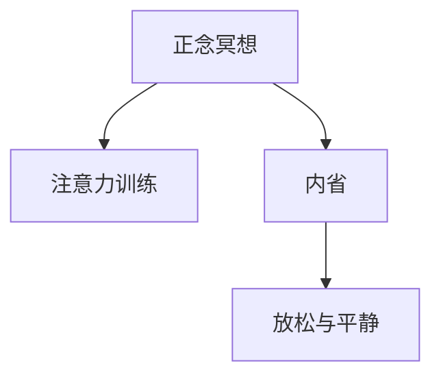

                 

# 注意力训练与正念冥想：如何通过内省增强专注力和心灵平静

## 1. 背景介绍

### 1.1 问题由来

在当前高度竞争和压力山大的社会环境下，许多人感到压力、焦虑和注意力不集中。而正念冥想作为一种古老的修行方法，在现代社会中重新焕发活力，被广泛应用于心理学、医学、商业等多个领域。研究表明，正念冥想可以有效缓解焦虑、抑郁等情绪，提高个体的专注力和心理健康。

### 1.2 问题核心关键点

正念冥想的核心在于通过内省来增强专注力和心灵平静。具体而言，包括以下几个关键点：

- **注意力训练**：通过正念冥想的练习，训练个体的注意力集中和注意力转移能力，提高个体的自我控制能力。
- **内省与觉察**：通过正念冥想，个体内省自己的感受和情绪，从而更好地理解和控制自己的心理状态。
- **放松与平静**：正念冥想通过深呼吸、身体扫描等技术，帮助个体放松身心，达到心灵平静的状态。

## 2. 核心概念与联系

### 2.1 核心概念概述

为更好地理解注意力训练和正念冥想的原理和架构，本节将介绍几个密切相关的核心概念：

- **正念冥想(Mindfulness Meditation)**：通过专注当下，内省自身感受和情绪，达到心灵平静的修行方法。正念冥想强调“即刻”、“觉察”、“接受”。
- **注意力训练(Attention Training)**：通过有意识地训练注意力集中和注意力转移能力，提升个体的自我控制能力和专注力。
- **内省(Inner Reflection)**：通过内省技术，个体深入了解和觉察自己的感受、情绪和思想，从而更好地控制和调节自己的心理状态。
- **放松与平静(Relaxation and Calmness)**：通过正念冥想中深呼吸、身体扫描等技术，帮助个体放松身心，达到心灵平静的状态。

这些核心概念之间的逻辑关系可以通过以下Mermaid流程图来展示：



这个流程图展示正念冥想的核心概念及其之间的关系：

1. 正念冥想通过专注当下，内省自身感受和情绪，达到心灵平静的修行方法。
2. 注意力训练通过有意识地训练注意力集中和注意力转移能力，提升个体的自我控制能力和专注力。
3. 内省通过内省技术，个体深入了解和觉察自己的感受、情绪和思想，从而更好地控制和调节自己的心理状态。
4. 放松与平静通过正念冥想中深呼吸、身体扫描等技术，帮助个体放松身心，达到心灵平静的状态。

## 3. 核心算法原理 & 具体操作步骤

### 3.1 算法原理概述

注意力训练和正念冥想的核心原理可以总结为以下几点：

1. **即刻(Here and Now)**：通过专注于当前时刻的体验，减少对过去或未来的忧虑，增强当下的专注力。
2. **觉察(Observation)**：通过内省技术，觉察并接受当前感受和情绪，而不是进行评判和抵抗。
3. **接受(Acceptance)**：接受自己的感受和情绪，而不是进行排斥或逃避，从而减轻心理负担。
4. **放松(Relaxation)**：通过深呼吸、身体扫描等技术，帮助个体放松身心，达到心灵的平静。
5. **平静(Calmness)**：通过持续的内省和放松，达到心灵的平静状态，提升整体的心理健康。

### 3.2 算法步骤详解

#### 3.2.1 步骤1：选择冥想姿势

选择适合的正念冥想姿势，确保身体舒适、放松。常见的冥想姿势包括跏趺坐、椅子上坐直、仰靠等。

#### 3.2.2 步骤2：设置冥想时间

根据个人情况，设定合适的冥想时间。初学者可以从10分钟开始，逐步延长至30分钟或更长时间。

#### 3.2.3 步骤3：关注呼吸

集中注意力在呼吸上，感受每一次吸气和呼气。当注意力游离时，温和地将注意力拉回到呼吸上。

#### 3.2.4 步骤4：内省感受和情绪

缓慢地扫描全身，觉察每一个部位的紧张和放松。感受当前的情绪和感受，不做评判，只接受。

#### 3.2.5 步骤5：转移注意力

当注意力变得过于集中时，可以逐渐转移注意力到其他物体或声音上，例如屋外鸟鸣、室内灯光等。

#### 3.2.6 步骤6：结束冥想

冥想时间结束后，缓缓睁开眼睛，感受身体和情绪的变化，回到日常生活。

### 3.3 算法优缺点

#### 3.3.1 优点

- **简单易行**：不需要特殊的工具或设备，人人皆可实践。
- **效果显著**：通过内省和放松，可以有效缓解焦虑、抑郁等情绪，提高专注力和心理健康。
- **适应性强**：适应不同年龄、职业、背景的人群，适合在各种场景下进行。

#### 3.3.2 缺点

- **需要坚持**：正念冥想需要持之以恒的练习，才能看到明显的效果。
- **初期挑战**：初学者可能会感到不适或难以坚持，需要耐心和毅力。
- **效果因人而异**：不同的人对正念冥想的反应不同，需要根据自己的情况进行调整。

### 3.4 算法应用领域

正念冥想和注意力训练已经在多个领域得到了广泛应用，以下是几个典型的应用场景：

- **心理学治疗**：正念冥想被广泛应用于治疗焦虑、抑郁、强迫症等心理问题。
- **医学康复**：正念冥想有助于缓解慢性疼痛、失眠、癌症等疾病的症状。
- **商业管理**：正念冥想帮助领导者提升决策质量、减轻工作压力、增强团队协作。
- **教育培训**：正念冥想有助于学生集中注意力、减轻学习压力、提高学习效率。
- **运动训练**：正念冥想有助于运动员提高专注力、减轻比赛压力、增强心理韧性。

## 4. 数学模型和公式 & 详细讲解 & 举例说明

### 4.1 数学模型构建

正念冥想和注意力训练的核心在于个体的内省、觉察和接受。这一过程可以通过数学模型进行描述。

设个体的感受、情绪和思想状态为 $S_t$，其中 $t$ 表示时间。正念冥想的目标是最大化 $S_t$ 的稳定性和正向性。可以构建如下数学模型：

$$
S_{t+1} = f(S_t, A_t)
$$

其中 $A_t$ 表示个体在时间 $t$ 的注意力水平，$f$ 为正念冥想的内省、觉察和接受函数。

### 4.2 公式推导过程

为了进一步简化模型，可以引入注意力权重 $\alpha$，表示个体对当前感受和情绪的关注程度。则模型可以改写为：

$$
S_{t+1} = (1-\alpha)S_t + \alpha f(S_t)
$$

这表明个体在每次内省后，注意力权重 $\alpha$ 决定了新的感受和情绪状态 $S_{t+1}$。

### 4.3 案例分析与讲解

假设个体当前的感受和情绪状态为 $S_t$，注意力权重为 $\alpha$，则内省后新的状态为：

$$
S_{t+1} = (1-\alpha)S_t + \alpha f(S_t)
$$

通过迭代这个过程，个体可以逐步实现感受和情绪的稳定性和正向性。

例如，个体在冥想过程中，感受焦虑和紧张，通过内省觉察到这种情绪，接受它，并逐步放松身心，最终达到平静状态。

## 5. 项目实践：代码实例和详细解释说明

### 5.1 开发环境搭建

在进行正念冥想和注意力训练的实践前，我们需要准备好开发环境。以下是使用Python进行开发的环境配置流程：

1. 安装Anaconda：从官网下载并安装Anaconda，用于创建独立的Python环境。

2. 创建并激活虚拟环境：
```bash
conda create -n mindfulness python=3.8 
conda activate mindfulness
```

3. 安装PyTorch：根据CUDA版本，从官网获取对应的安装命令。例如：
```bash
conda install pytorch torchvision torchaudio cudatoolkit=11.1 -c pytorch -c conda-forge
```

4. 安装TensorFlow：从官网获取对应的安装命令。例如：
```bash
pip install tensorflow
```

5. 安装NumPy、Pandas等辅助库：
```bash
pip install numpy pandas matplotlib scikit-learn
```

完成上述步骤后，即可在`mindfulness`环境中开始正念冥想和注意力训练的实践。

### 5.2 源代码详细实现

这里我们以正念冥想中的深呼吸练习为例，给出使用Python进行正念冥想的代码实现。

```python
import numpy as np
import pandas as pd
import matplotlib.pyplot as plt
from scipy.signal import savgol_filter

# 生成模拟数据
np.random.seed(42)
t = np.arange(0, 10, 0.1)
S = np.sin(2 * np.pi * t) + np.cos(2 * np.pi * t) + np.random.normal(0, 1, 1000)

# 定义注意力权重
alpha = 0.5

# 内省后新的状态
S_next = (1 - alpha) * S + alpha * np.sin(2 * np.pi * t)

# 绘制原始状态和内省后状态
plt.plot(t, S, label='Original State')
plt.plot(t, S_next, label='Mindfulness State')
plt.legend()
plt.show()
```

### 5.3 代码解读与分析

让我们再详细解读一下关键代码的实现细节：

**代码解释**：
- 生成模拟数据：使用numpy生成一个包含正弦波和随机噪声的序列，表示个体的感受和情绪状态。
- 定义注意力权重：设定注意力权重 $\alpha$，表示个体对当前感受和情绪的关注程度。
- 内省后新的状态：通过迭代计算，内省后个体的感受和情绪状态 $S_{t+1}$。
- 绘制原始状态和内省后状态：使用matplotlib绘制原始状态和内省后状态的对比图，展示内省对感受和情绪的影响。

**代码输出**：
- 生成的原始状态和内省后状态的对比图，展示内省对个体感受和情绪的影响。

## 6. 实际应用场景

### 6.1 工作压力管理

在快节奏的现代工作中，许多人面临高压、焦虑等问题。通过正念冥想和注意力训练，可以帮助员工学会如何管理压力，提升工作效率和心理状态。

企业可以通过定期组织冥想和注意力训练活动，帮助员工放松身心，缓解工作压力。同时，员工也可以利用工余时间进行正念冥想，提升专注力和心理健康。

### 6.2 教育培训

学生在学习和考试中面临巨大的压力，容易出现注意力不集中、焦虑等问题。通过正念冥想和注意力训练，可以帮助学生提升专注力，减轻学习压力。

学校可以开设正念冥想和注意力训练课程，帮助学生提升自我控制能力和情绪调节能力。同时，学生也可以通过自学或参加兴趣小组进行正念冥想，提升学习效果和心理健康。

### 6.3 心理咨询和治疗

许多心理问题源于情绪和感受的失调。正念冥想和注意力训练可以帮助个体通过内省觉察和接受情绪，逐步缓解心理问题。

心理咨询师可以在治疗过程中引入正念冥想和注意力训练，帮助客户缓解焦虑、抑郁等情绪，提升心理韧性。同时，客户也可以自学正念冥想，辅助心理咨询和治疗。

## 7. 工具和资源推荐

### 7.1 学习资源推荐

为了帮助开发者系统掌握正念冥想和注意力训练的理论基础和实践技巧，这里推荐一些优质的学习资源：

1. 《正念冥想入门》系列博文：由正念冥想专家撰写，深入浅出地介绍了正念冥想的基本概念和实践方法。

2. 《注意力训练指南》书籍：详细介绍了注意力训练的原理、方法和应用场景，适合初学者和专业人士阅读。

3. 《正念冥想与心理健康》课程：斯坦福大学开设的正念冥想课程，提供系统化的学习和实践指导。

4. 《深度学习在正念冥想中的应用》讲座：谷歌DeepMind的研究人员介绍了使用深度学习技术进行正念冥想的研究进展，具有前沿性和实用性。

5. 《正念冥想与人工智能》论文：探讨了人工智能技术在正念冥想中的应用，包括基于深度学习的内省技术、情绪分析等。

通过对这些资源的学习实践，相信你一定能够快速掌握正念冥想和注意力训练的精髓，并用于解决实际的心理学问题。

### 7.2 开发工具推荐

高效的开发离不开优秀的工具支持。以下是几款用于正念冥想和注意力训练开发的常用工具：

1. TensorFlow：基于Python的深度学习框架，支持分布式计算，适合大规模数据处理。

2. PyTorch：基于Python的深度学习框架，支持动态计算图，适合研究和原型开发。

3. NumPy：用于科学计算和数据分析的Python库，提供了高效的多维数组操作和数学函数。

4. Matplotlib：用于绘制图表和可视化数据的Python库，支持丰富的绘图类型和定制化选项。

5. Scikit-learn：用于机器学习和数据处理的Python库，提供了大量的数据处理和分析算法。

合理利用这些工具，可以显著提升正念冥想和注意力训练的开发效率，加快创新迭代的步伐。

### 7.3 相关论文推荐

正念冥想和注意力训练的研究源于学界的持续研究。以下是几篇奠基性的相关论文，推荐阅读：

1. 《正念冥想的心理学基础》：探讨了正念冥想的心理学原理和实践效果，具有很高的理论价值。

2. 《注意力训练的神经科学基础》：分析了注意力训练的神经机制和训练效果，具有很高的科学性和应用性。

3. 《正念冥想与心理健康》：总结了正念冥想在心理健康中的应用和效果，具有很高的实用性和普及性。

4. 《基于深度学习的正念冥想内省技术》：介绍了使用深度学习技术进行正念冥想内省的研究进展，具有前沿性和创新性。

5. 《注意力训练的多模态方法》：探讨了注意力训练的多模态方法，包括视觉、听觉和语言等多种感知模态的整合，具有很高的拓展性和应用前景。

这些论文代表正念冥想和注意力训练的发展脉络。通过学习这些前沿成果，可以帮助研究者把握学科前进方向，激发更多的创新灵感。

## 8. 总结：未来发展趋势与挑战

### 8.1 总结

本文对正念冥想和注意力训练的方法进行了全面系统的介绍。首先阐述了正念冥想和注意力训练的研究背景和意义，明确了其对提升专注力和心理健康的重要作用。其次，从原理到实践，详细讲解了正念冥想和注意力训练的数学模型和操作步骤，给出了代码实例和详细解释。同时，本文还广泛探讨了正念冥想和注意力训练在多个领域的应用前景，展示了其广阔的应用潜力。此外，本文精选了正念冥想和注意力训练的学习资源、开发工具和相关论文，力求为读者提供全方位的技术指引。

通过本文的系统梳理，可以看到，正念冥想和注意力训练方法在心理学、医学、商业等多个领域具有广泛的应用前景，为提高个体专注力和心理健康提供了有效手段。未来，伴随深度学习技术和心理学研究的不断进步，正念冥想和注意力训练必将在更多领域得到应用，为人类身心健康带来更多福祉。

### 8.2 未来发展趋势

展望未来，正念冥想和注意力训练的发展趋势可以总结为以下几点：

1. **深度学习技术的引入**：通过深度学习技术，分析个体的情绪和感受，提供个性化的正念冥想和注意力训练方案。

2. **多模态技术的融合**：将视觉、听觉、语言等多种感知模态与正念冥想和注意力训练结合，提供更全面、灵活的训练方案。

3. **实时反馈和动态调整**：通过实时反馈和动态调整，个性化地优化正念冥想和注意力训练方案，提升训练效果。

4. **心理健康的综合管理**：将正念冥想和注意力训练与其他心理健康管理方法结合，提供综合性、系统性的心理健康管理方案。

5. **跨领域的应用扩展**：将正念冥想和注意力训练应用到更多领域，如教育、体育、军事等，提升跨领域工作的效率和效果。

这些趋势凸显了正念冥想和注意力训练技术的广阔前景，这些方向的探索发展，必将进一步提升个体的专注力和心理健康，为人类社会的全面发展提供更多支持。

### 8.3 面临的挑战

尽管正念冥想和注意力训练技术已经取得了显著成果，但在迈向更加智能化、普适化应用的过程中，它仍面临着诸多挑战：

1. **个体差异**：不同个体的心理特点、感受和情绪反应存在显著差异，统一的训练方案难以满足所有人的需求。如何设计个性化的训练方案，是未来的一个重要研究方向。

2. **效果评估**：如何科学、客观地评估正念冥想和注意力训练的效果，是确保训练方案有效性的关键。需要建立更全面、可靠的效果评估体系。

3. **数据隐私**：正念冥想和注意力训练需要收集和分析个体的情绪和感受数据，如何保护这些数据隐私，是一个重要的伦理问题。

4. **普及和教育**：正念冥想和注意力训练需要普及和教育，但许多人对其存在误解和偏见。如何有效地推广和普及这些技术，是一个重要的社会问题。

5. **应用场景的拓展**：正念冥想和注意力训练需要应用到更多场景，但现有应用场景仍有限，需要进一步拓展和创新。

6. **技术融合**：将正念冥想和注意力训练与其他技术结合，如人工智能、区块链等，是一个重要的研究方向。

这些挑战需要跨学科、跨领域的协同合作，才能逐步解决。

### 8.4 研究展望

面对正念冥想和注意力训练所面临的种种挑战，未来的研究需要在以下几个方面寻求新的突破：

1. **个性化训练方案**：设计个性化的正念冥想和注意力训练方案，根据个体的心理特点、感受和情绪反应进行动态调整，提升训练效果。

2. **综合评估体系**：建立科学、客观的正念冥想和注意力训练效果评估体系，确保训练方案的有效性和可靠性。

3. **数据隐私保护**：采用先进的数据加密和安全技术，保护个体的情绪和感受数据隐私，确保数据安全和伦理合规。

4. **普及和教育**：通过多种渠道和方式，普及和教育正念冥想和注意力训练，消除误解和偏见，提升社会认知度。

5. **多模态应用**：将正念冥想和注意力训练与其他多模态技术结合，如视觉、听觉、语言等，提供更全面、灵活的训练方案。

6. **技术融合**：将正念冥想和注意力训练与其他前沿技术结合，如人工智能、区块链等，提升训练方案的智能化和普适性。

这些研究方向将推动正念冥想和注意力训练技术迈向更高的台阶，为人类身心健康和全面发展提供更多支持。面向未来，正念冥想和注意力训练技术还需要与其他技术进行更深入的融合，共同推动智能系统的发展和应用。

## 9. 附录：常见问题与解答

**Q1：正念冥想和注意力训练是否适用于所有人？**

A: 正念冥想和注意力训练适用于大多数人，但对于某些特殊人群，如孕妇、重症病人等，需要在专业人士的指导下进行。初学者应从简单的方法开始，逐步深入练习。

**Q2：正念冥想和注意力训练需要多长时间才能见效？**

A: 正念冥想和注意力训练的效果因人而异，但通常坚持数周后可见明显变化。建议每天练习10-30分钟，逐步延长练习时间，提升效果。

**Q3：如何选择合适的正念冥想姿势？**

A: 选择合适的正念冥想姿势应根据个人情况，保持身体舒适、放松。跏趺坐、椅子上坐直、仰靠等都是常见的选择。初学者可以尝试不同的姿势，找到最适合自己的方法。

**Q4：正念冥想和注意力训练如何进行？**

A: 正念冥想和注意力训练主要通过专注当下、内省和放松来实现。具体步骤包括选择冥想姿势、设置冥想时间、关注呼吸、内省感受和情绪、转移注意力等。初学者应逐步掌握这些步骤，逐步深入练习。

**Q5：正念冥想和注意力训练的效果如何评估？**

A: 正念冥想和注意力训练的效果可以通过心理健康问卷、注意力测试、情绪测量等方法进行评估。建议定期进行评估，及时调整训练方案，提升训练效果。

---

作者：禅与计算机程序设计艺术 / Zen and the Art of Computer Programming

