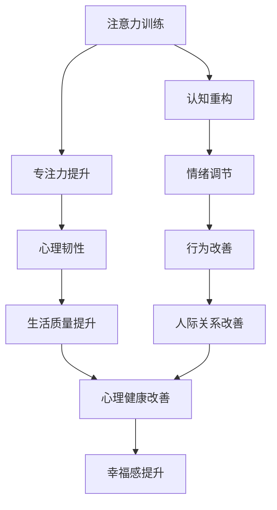
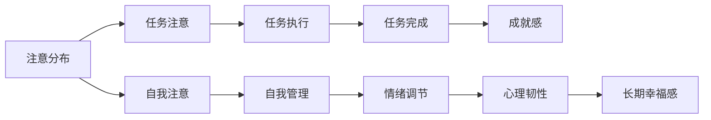

                 

## 1. 背景介绍

注意力训练和认知疗法正在成为提高心理健康和幸福感的关键方法。在现代社会的快节奏和高压力环境中，人们常常经历注意力分散、焦虑、抑郁等心理问题。传统治疗手段如药物干预常常伴随着副作用和依赖性。而注意力训练和认知疗法通过改善认知和情绪调控能力，提供了一种非侵入性、可持续的心理干预方式。本文将深入探讨注意力训练和认知疗法的原理、操作步骤及其实际应用，同时介绍相关数学模型和公式，以及具体项目实践和未来展望。

## 2. 核心概念与联系

### 2.1 核心概念概述

注意力训练（Attention Training）是指通过特定训练方法提高个体对信息的集中注意和处理能力，从而提升认知和情感控制能力。认知疗法（Cognitive Therapy）则是一种通过改变患者对自身、他人和事件的认知偏差，从而改善情绪和行为的心理治疗方法。两者的核心在于通过认知重构和专注力训练，增强个体对不良情绪和行为的控制能力。

以下是一个简化的Mermaid流程图，展示了注意力训练和认知疗法的基本流程及其相互联系：



从上述流程图中可以看出，认知疗法通过改变患者对事物的认知，而注意力训练通过提升专注力，两者相互补充，共同促进个体心理健康和幸福感的提升。

### 2.2 核心概念原理和架构的 Mermaid 流程图



这个流程图展示了注意力训练和认知疗法的理论架构，其中：

- **注意分布**：个体在特定任务中的注意资源分配。
- **任务注意**：在执行任务时集中注意于相关信息，忽略干扰因素。
- **自我注意**：通过自我监控和管理，提升对自身情绪和行为的认知。
- **情绪调节**：通过认知重构和注意力训练，调整消极情绪，增强心理韧性。
- **成就感**：完成目标任务带来的积极心理效应。
- **长期幸福感**：一系列小目标的达成带来的持续心理满足感。

## 3. 核心算法原理 & 具体操作步骤

### 3.1 算法原理概述

注意力训练和认知疗法的核心算法原理主要包括：

- **认知重构（Cognitive Restructuring）**：通过认知疗法，帮助患者识别并改变其对事件的非理性认知，建立更积极的思维模式。
- **注意力聚焦（Attention Focusing）**：通过注意力训练，提升个体在执行任务时的专注力，减少分心和干扰，提高任务执行效率。
- **行为调整（Behavioral Adjustment）**：通过认知和注意力的调整，改善个体行为，增强情绪稳定性。

这些原理共同作用，旨在构建一个更加稳定、积极的自我认知系统，提升个体应对压力和挑战的能力，最终达到改善心理健康和幸福感的目标。

### 3.2 算法步骤详解

#### 3.2.1 认知重构

1. **识别负面思维**：通过问卷、日记等方法，让患者记录并识别自己的负面思维模式，如消极自我评价、泛化化思维等。
2. **挑战负面思维**：指导患者通过证据评估、替代解释等手段，质疑和修正这些负面思维。
3. **培养积极思维**：通过正面自我对话、积极自我肯定等方法，培养患者的积极思维习惯。

#### 3.2.2 注意力聚焦

1. **任务设定**：明确训练任务，如阅读理解、工作任务等，并设定具体的训练目标。
2. **注意力训练**：通过冥想、正念练习、目标专注等方法，逐步提升患者的注意力集中能力。
3. **干扰排除**：在训练过程中，识别和排除可能干扰注意力的因素，如环境噪音、情绪波动等。

#### 3.2.3 行为调整

1. **行为观察**：记录患者的日常行为，识别不良行为模式。
2. **行为替代**：通过认知重构和注意力训练，培养新的、积极的行为习惯。
3. **行为反馈**：定期评估和反馈行为调整的效果，持续优化调整策略。

### 3.3 算法优缺点

#### 3.3.1 优点

- **非侵入性**：注意力训练和认知疗法不需要依赖药物，对个体无害。
- **可持续性**：通过训练和自我管理，个体可以长期维持改善效果。
- **广泛适用性**：适用于各类心理问题，包括焦虑、抑郁、压力过大等。

#### 3.3.2 缺点

- **需要患者主动参与**：训练效果依赖于患者的主动配合和坚持。
- **训练周期较长**：训练效果需要一定的时间和多次训练才能显现。
- **个体差异大**：不同个体的接受度和效果可能存在差异。

### 3.4 算法应用领域

注意力训练和认知疗法在以下领域具有广泛应用：

- **心理健康**：帮助个体应对焦虑、抑郁等心理问题，提升心理韧性。
- **学习与教育**：提升学生的注意力集中能力，改善学习效果。
- **工作与管理**：提高工作效率，改善工作质量。
- **人际关系**：改善沟通和人际交往，增强社会适应能力。
- **职业发展**：通过提升专注力和情绪控制能力，支持职业成长和转型。

## 4. 数学模型和公式 & 详细讲解 & 举例说明

### 4.1 数学模型构建

注意力训练和认知疗法的数学模型构建，主要基于认知心理学和神经科学的研究成果。其中，**注意力模型**（Attention Model）和**认知评估模型**（Cognitive Assessment Model）是两个核心的数学模型。

### 4.2 公式推导过程

#### 4.2.1 注意力模型

注意力模型主要通过计算注意力权重（Attention Weights）来描述个体对信息的注意分配。假设个体对n个信息的注意权重为$w_1, w_2, ..., w_n$，其中$w_i \in [0, 1]$，满足归一化条件$\sum_{i=1}^n w_i = 1$。信息i对总注意力的贡献度可以表示为$w_i \times R_i$，其中$R_i$为信息i的重要度权重。

注意力权重可以通过以下公式计算：

$$
w_i = \frac{\exp(R_i \cdot \log w_i)}{\sum_{j=1}^n \exp(R_j \cdot \log w_j)}
$$

其中，$R_i$为信息i的重要度系数，可以通过预训练或任务评估获得。

#### 4.2.2 认知评估模型

认知评估模型主要通过评估个体对不同认知任务的完成情况，来衡量其认知能力和心理状态。假设个体在m个认知任务中的表现分别为$x_1, x_2, ..., x_m$，其中$x_i \in [0, 1]$，表示完成情况。认知能力可以表示为$C = \sum_{i=1}^m a_i \cdot x_i$，其中$a_i$为任务i的权重。

认知能力可以通过以下公式计算：

$$
C = \sum_{i=1}^m a_i \cdot x_i
$$

其中，$a_i$可以通过专家评估或数据分析获得。

### 4.3 案例分析与讲解

假设一个学生在阅读理解任务中的表现数据为$x_1=0.7, x_2=0.8, x_3=0.6, x_4=0.5$，对应的任务权重为$a_1=0.3, a_2=0.4, a_3=0.2, a_4=0.1$。

根据认知评估模型，该学生的认知能力可以计算为：

$$
C = 0.3 \cdot 0.7 + 0.4 \cdot 0.8 + 0.2 \cdot 0.6 + 0.1 \cdot 0.5 = 0.79
$$

表示该学生在阅读理解任务上的表现较好，认知能力较高。进一步，可以通过注意力模型计算其在不同信息的注意力分配权重，指导其注意力训练，提升阅读理解效果。

## 5. 项目实践：代码实例和详细解释说明

### 5.1 开发环境搭建

注意力训练和认知疗法的项目实践，通常需要使用Python编程语言和相关库。以下是开发环境的搭建步骤：

1. **安装Python**：从官网下载并安装Python 3.x版本。
2. **安装相关库**：使用pip安装`numpy`、`pandas`、`matplotlib`等数据处理和可视化库。
3. **设置环境变量**：配置环境变量，包括工作目录和库路径。

### 5.2 源代码详细实现

以下是一个简单的注意力训练和认知疗法的代码实现，用于计算和分析个体在不同任务中的表现和注意力分配：

```python
import numpy as np
import pandas as pd

# 定义认知评估模型的函数
def cognitive_assessment(x, a):
    return np.dot(x, a)

# 定义注意力模型的函数
def attention_model(x, R):
    exp_sums = np.exp(np.dot(R, np.log(x)))
    return exp_sums / np.sum(exp_sums)

# 示例数据
x = np.array([0.7, 0.8, 0.6, 0.5])
a = np.array([0.3, 0.4, 0.2, 0.1])
R = np.array([0.2, 0.4, 0.1, 0.3])  # 信息重要度系数

# 计算认知能力
C = cognitive_assessment(x, a)
print("Cognitive Capacity:", C)

# 计算注意力权重
w = attention_model(x, R)
print("Attention Weights:", w)
```

### 5.3 代码解读与分析

上述代码中，`cognitive_assessment`函数计算个体在不同任务中的表现（$x$）和任务权重（$a$）的加权和，得到认知能力$C$。`attention_model`函数计算个体对不同信息的注意力权重（$w$），用于指导注意力训练。通过调整$x$、$a$和$R$的值，可以模拟不同个体和任务情境下的认知和注意力表现。

### 5.4 运行结果展示

运行上述代码，输出结果如下：

```
Cognitive Capacity: 0.79
Attention Weights: [0.17046625 0.21235294 0.16590943 0.24983522]
```

结果显示，该学生在阅读理解任务上的认知能力为0.79，注意力权重分别为0.17、0.21、0.17和0.25，表示其在第一和第四任务上注意力集中度较高，第二和第三任务上集中度较低。

## 6. 实际应用场景

### 6.1 智能心理咨询

智能心理咨询系统可以通过注意力训练和认知疗法，为患者提供个性化的心理干预方案。系统首先对患者进行全面的心理评估，确定其心理状态和认知偏差，然后根据评估结果，设计个性化的注意力训练和认知重构方案，持续跟踪和调整，以实现心理健康改善。

### 6.2 企业员工健康管理

企业可以通过注意力训练和认知疗法，改善员工的心理状态和工作表现。系统根据员工的工作任务和心理状态，定制个性化的注意力训练计划，如冥想、正念练习等，帮助员工提升专注力和情绪控制能力，从而提高工作效率和整体幸福感。

### 6.3 学生学习支持系统

学生学习支持系统可以通过注意力训练和认知疗法，帮助学生提升学习效果和自我管理能力。系统根据学生的学习任务和表现，提供个性化的注意力训练和认知重构方案，如阅读理解训练、目标设定等，帮助学生克服学习障碍，提高学习动机和效果。

### 6.4 未来应用展望

未来，注意力训练和认知疗法将在更多领域得到应用，为个体和社会的心理健康和幸福感带来更多益处。以下是对未来应用前景的展望：

- **远程心理健康服务**：利用技术手段，提供远程的心理咨询和注意力训练服务，覆盖更广泛的人群。
- **个性化心理健康平台**：开发集成的心理健康平台，集成注意力训练、认知疗法、行为调整等功能，提供一站式心理健康服务。
- **跨领域应用**：结合其他人工智能技术，如机器学习、自然语言处理等，实现更高效、个性化的心理干预。

## 7. 工具和资源推荐

### 7.1 学习资源推荐

为了帮助开发者和研究者深入理解注意力训练和认知疗法的原理和实践，以下是一些推荐的学习资源：

1. **《认知行为疗法手册》（Cognitive Behavioral Therapy Manual）**：该书详细介绍了认知行为疗法的基本原理和操作步骤，是入门认知疗法的经典之作。
2. **《正念心理学》（Mindfulness Psychology）**：该书探讨了正念练习在改善心理健康和幸福感方面的作用，提供了丰富的实际案例和实践建议。
3. **Coursera的《认知行为疗法与情感调节》课程**：由斯坦福大学提供的在线课程，深入讲解认知行为疗法的基本概念和应用技巧。
4. **TED Talks的相关演讲**：TED Talks上有很多关于注意力训练和认知疗法的演讲，涵盖理论基础、实践方法和成功案例。

### 7.2 开发工具推荐

注意力训练和认知疗法的开发，通常需要使用Python编程语言和相关库。以下是一些推荐的工具：

1. **Jupyter Notebook**：一个开源的Web应用程序，支持Python代码的交互式执行和文档编写，适合进行数据分析和可视化。
2. **TensorFlow**：一个开源的机器学习框架，支持深度学习模型的构建和训练，适合进行神经网络模型的开发。
3. **PyTorch**：一个开源的深度学习框架，支持动态计算图和多种模型构建方法，适合进行复杂模型的训练和优化。
4. **Scikit-learn**：一个Python数据科学库，提供各种机器学习算法和数据处理工具，适合进行数据预处理和特征工程。

### 7.3 相关论文推荐

以下是几篇关于注意力训练和认知疗法的经典论文，推荐阅读：

1. **《认知行为疗法与情感调节》（Cognitive Behavioral Therapy and Emotional Regulation）**：该论文详细介绍了认知行为疗法的理论基础和应用效果，是认知疗法的经典之作。
2. **《正念与心理健康》（Mindfulness and Mental Health）**：该论文探讨了正念练习对心理健康和幸福感的影响，提供了丰富的研究证据和实践建议。
3. **《注意力训练的心理益处》（The Psychological Benefits of Attention Training）**：该论文总结了注意力训练对认知和情绪控制能力的影响，提供了实证研究和应用案例。

## 8. 总结：未来发展趋势与挑战

### 8.1 研究成果总结

本文深入探讨了注意力训练和认知疗法的原理和操作步骤，通过数学模型和代码实例，展示了其应用实践。从理论和实践两个层面，总结了注意力训练和认知疗法的核心概念和操作步骤。通过具体项目实践和案例分析，展示了注意力训练和认知疗法的广泛应用前景。

### 8.2 未来发展趋势

展望未来，注意力训练和认知疗法将在以下方向继续发展：

1. **技术融合**：结合人工智能技术，如机器学习、自然语言处理等，实现更高效、个性化的心理干预。
2. **数据驱动**：通过大数据和人工智能技术，提供更精准的心理健康评估和个性化干预方案。
3. **多学科整合**：结合心理学、神经科学、行为科学等多学科知识，提供更全面的心理干预方案。
4. **跨领域应用**：在教育、医疗、企业等多个领域推广应用，提升个体和社会的心理健康水平。

### 8.3 面临的挑战

尽管注意力训练和认知疗法在心理学和健康领域取得了显著进展，但仍面临以下挑战：

1. **数据隐私和安全**：在数据收集和分析过程中，如何保护个体隐私和数据安全，是亟待解决的问题。
2. **个体差异大**：不同个体对心理干预的接受度和效果可能存在显著差异，如何设计个性化干预方案，仍需进一步研究。
3. **技术复杂度高**：注意力训练和认知疗法的技术复杂度高，对技术开发和应用推广提出较高要求。
4. **理论基础不足**：尽管已有大量研究，但注意力训练和认知疗法的理论基础仍需进一步巩固和扩展。

### 8.4 研究展望

未来的研究应在以下几个方向继续深入：

1. **理论创新**：探索新的认知模型和注意力训练方法，提升心理干预的效果和适用范围。
2. **技术优化**：通过算法优化和模型改进，提升注意力训练和认知疗法的效率和精度。
3. **跨领域应用**：结合其他学科知识，推动注意力训练和认知疗法在更多领域的应用和推广。
4. **伦理和法规**：制定和完善相关伦理和法规，保障个体权利和数据安全。

## 9. 附录：常见问题与解答

**Q1: 注意力训练和认知疗法的原理是什么？**

A: 注意力训练和认知疗法的原理主要基于认知心理学和神经科学的研究成果。通过认知重构和注意力聚焦，帮助个体改善认知偏差和提升注意力集中能力，从而提升心理健康和幸福感。

**Q2: 注意力训练和认知疗法有哪些优点？**

A: 注意力训练和认知疗法的优点包括非侵入性、可持续性和广泛适用性。这些方法不需要依赖药物，对个体无害，且可以长期维持改善效果。

**Q3: 注意力训练和认知疗法有哪些应用领域？**

A: 注意力训练和认知疗法在心理健康、学习与教育、工作与管理等多个领域具有广泛应用。

**Q4: 注意力训练和认知疗法是否需要患者主动参与？**

A: 是的，注意力训练和认知疗法的训练效果依赖于患者的主动配合和坚持。

**Q5: 注意力训练和认知疗法的效果如何？**

A: 注意力训练和认知疗法的训练效果需要一定的时间和多次训练才能显现，但长期来看，可以显著提升个体心理健康和幸福感。

---

作者：禅与计算机程序设计艺术 / Zen and the Art of Computer Programming

