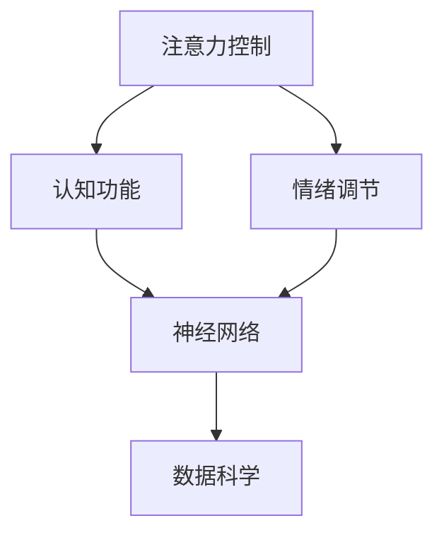

                 

# 注意力训练与认知疗法：通过专注力改善心理健康和幸福感

> 关键词：注意力训练,认知疗法,专注力,心理健康,幸福感,神经网络,数据科学

## 1. 背景介绍

### 1.1 问题由来

在现代快节奏的生活中，人们面临着前所未有的压力和挑战，包括工作压力、社交压力、经济压力等。这些压力导致许多人的心理健康状况出现不同程度的下降，甚至发展成焦虑症、抑郁症等精神疾病。传统的心理治疗和药物治疗手段虽然有效，但往往成本高、周期长，难以覆盖到所有需要帮助的人。

注意力训练和认知疗法作为一种新兴的心理健康干预方法，因其快速、便捷、成本低廉的特点，近年来逐渐受到关注。其核心思想是通过一系列科学系统的训练和引导，帮助个体改善注意力控制能力，提高认知功能，增强情绪调节能力，从而改善心理健康状况，提升幸福感。

### 1.2 问题核心关键点

注意力训练和认知疗法的核心关键点包括：

1. **注意力控制**：训练个体在面对外界干扰时，能够集中注意力，维持专注，提高工作效率和生活质量。
2. **认知功能提升**：通过训练，改善个体在记忆力、决策力、问题解决能力等方面的表现，增强日常生活中的应对能力。
3. **情绪调节**：帮助个体学会有效的情绪管理和自我调节，减少负面情绪，提升心理韧性。
4. **实践操作性**：训练方案设计科学、易操作，无需专业设备，可广泛推广。
5. **综合效果显著**：通过长期训练，注意力、认知和情绪各方面全面提升，达到全面改善心理健康的目的。

### 1.3 问题研究意义

注意力训练和认知疗法作为一种新兴的心理健康干预方法，其研究和应用具有重要意义：

1. **心理健康普及**：由于认知疗法和注意力训练无需专业设备，易于推广普及，可以覆盖到更多需要帮助的人群，降低心理健康干预的成本。
2. **提升生活质量**：通过提高注意力和认知能力，个体在学习和工作中表现更佳，生活质量得以提升。
3. **预防精神疾病**：长期坚持注意力训练和认知疗法，可以有效预防焦虑症、抑郁症等精神疾病的发生。
4. **辅助传统治疗**：认知疗法和注意力训练可以作为传统心理治疗和药物治疗的重要补充，提升治疗效果。

## 2. 核心概念与联系

### 2.1 核心概念概述

本节将介绍注意力训练和认知疗法中的几个核心概念：

- **注意力控制**：指个体在面对外界干扰时，能够主动调节自身注意力，保持专注。
- **认知功能**：包括记忆力、决策力、问题解决能力等，是个体处理信息、做出决策的关键能力。
- **情绪调节**：指个体在面对负面情绪时，能够有效管理自己的情绪，恢复心理平衡。
- **神经网络**：指大脑中负责信息处理、决策和情感管理的神经元网络。注意力训练和认知疗法的神经科学基础即是研究这些神经网络的运作机制，并在此基础上设计干预方案。
- **数据科学**：指通过数据收集、分析和应用，支持注意力训练和认知疗法干预效果的评估和优化。

这些核心概念之间的逻辑关系可以通过以下Mermaid流程图来展示：



这个流程图展示注意力训练和认知疗法中的核心概念及其之间的关系：

1. 注意力控制通过训练提升个体的注意力功能。
2. 认知功能得到提升后，个体在信息处理和决策方面表现更佳。
3. 情绪调节能力增强，个体在面对压力和负面情绪时更能保持心理平衡。
4. 注意力训练和认知疗法基于神经网络运作机制的设计，依赖数据科学进行效果评估和优化。

这些概念共同构成了注意力训练和认知疗法的理论和实践基础。

## 3. 核心算法原理 & 具体操作步骤

### 3.1 算法原理概述

注意力训练和认知疗法的核心算法原理基于神经网络模型，通过模拟大脑的认知过程，进行注意力和认知功能的训练。其基本思想是：

1. **数据采集**：收集个体在执行任务时的注意力、认知和情绪相关的生理和行为数据。
2. **模型训练**：利用深度学习模型（如卷积神经网络、递归神经网络等）对数据进行训练，构建个体注意力和认知功能的神经网络模型。
3. **干预训练**：根据模型预测结果，设计个性化的注意力和认知训练方案，并通过训练提升个体的注意力控制和认知功能。
4. **效果评估**：通过数据科学方法，对训练效果进行评估和优化，确保训练方案的有效性和可行性。

### 3.2 算法步骤详解

注意力训练和认知疗法的具体算法步骤如下：

**Step 1: 数据采集与预处理**

- 使用EEG、fMRI等脑电图或脑成像设备，采集个体在执行任务时的脑电信号或脑图像。
- 通过行为记录设备，记录个体的注意力、认知和情绪相关的行为数据（如眼动轨迹、按键反应时间等）。
- 对采集到的数据进行预处理，包括去噪、归一化、特征提取等。

**Step 2: 神经网络模型训练**

- 构建深度学习模型，如卷积神经网络（CNN）、递归神经网络（RNN）等，对预处理后的数据进行训练。
- 使用标记好的注意力和认知任务数据（如注意力任务、记忆任务、决策任务等）进行模型训练。
- 使用交叉验证等方法，优化模型参数，提高模型预测准确性。

**Step 3: 个性化训练方案设计**

- 根据模型预测结果，设计个性化的注意力和认知训练方案。方案包括注意力集中训练、记忆提升训练、问题解决训练等。
- 确保训练方案具有科学性和操作性，易于个体执行。
- 设计训练时间表，确保训练方案的持续性和系统性。

**Step 4: 注意力和认知训练**

- 根据训练方案，对个体进行注意力和认知训练。训练内容包括注意力集中练习、记忆提升练习、问题解决练习等。
- 在训练过程中，持续采集个体的注意力、认知和情绪相关的生理和行为数据。
- 对采集到的数据进行实时反馈，及时调整训练方案。

**Step 5: 效果评估与优化**

- 使用数据科学方法，对训练效果进行评估。评估内容包括注意力控制能力、认知功能提升、情绪调节能力等。
- 根据评估结果，调整训练方案，优化训练效果。
- 持续进行训练，确保个体在注意力和认知功能方面得到持续提升。

### 3.3 算法优缺点

注意力训练和认知疗法的算法具有以下优点：

1. **快速有效**：相比传统的心理治疗和药物治疗，认知疗法和注意力训练可以快速改善心理健康状况，提升幸福感。
2. **易于操作**：训练方案设计科学，无需专业设备，易于个体执行。
3. **成本低廉**：无需昂贵的药物和治疗费用，减轻个体的经济负担。
4. **推广性强**：训练方案可广泛推广，覆盖更多需要帮助的人群。

同时，该算法也存在以下局限性：

1. **数据采集难度高**：脑电图或脑成像设备成本高、操作复杂，采集数据较为困难。
2. **数据隐私问题**：采集个体的生理和行为数据涉及隐私问题，需要严格的数据保护措施。
3. **模型复杂度高**：深度学习模型需要大量数据和计算资源，训练过程较为复杂。
4. **个性化不足**：训练方案设计较为通用，缺乏对个体差异的充分考虑。

尽管存在这些局限性，但就目前而言，认知疗法和注意力训练作为心理健康干预的新范式，其有效性和便捷性已经得到了广泛认可，具有广阔的发展前景。

### 3.4 算法应用领域

注意力训练和认知疗法已经被广泛应用于多个领域，包括但不限于：

- **教育培训**：帮助学生提高注意力和学习效率，提升学习成绩。
- **企业培训**：提高员工专注力和工作效率，增强团队协作能力。
- **心理咨询**：作为心理咨询和心理治疗的辅助手段，提升心理健康水平。
- **心理健康研究**：通过大量数据积累，支持心理健康研究的深入开展。

## 4. 数学模型和公式 & 详细讲解 & 举例说明（备注：数学公式请使用latex格式，latex嵌入文中独立段落使用 $$，段落内使用 $)
### 4.1 数学模型构建

注意力训练和认知疗法的数学模型构建基于深度学习模型，以下以卷积神经网络（CNN）为例进行详细阐述。

**输入层**：
- 输入数据 $x$，表示个体在执行任务时的注意力、认知和情绪相关的生理和行为数据。

**卷积层**：
- 对输入数据进行卷积操作，提取数据特征。使用卷积核 $w$ 和偏置项 $b$，得到卷积结果 $z$。
- 卷积操作可以表示为：
  $$
  z = w*x + b
  $$

**激活函数**：
- 对卷积结果 $z$ 应用激活函数 $f$，引入非线性变换。激活函数可以选用ReLU、Sigmoid等函数。
- 激活函数可以表示为：
  $$
  y = f(z)
  $$

**池化层**：
- 对卷积结果 $z$ 进行池化操作，减少数据维度和计算复杂度。常用的池化操作包括最大池化、平均池化等。
- 池化操作可以表示为：
  $$
  y' = \text{pool}(y)
  $$

**全连接层**：
- 将池化后的特征图 $y'$ 输入全连接层，进行分类或回归操作。
- 全连接层包含多个神经元，每个神经元与前一层的所有神经元相连。
- 全连接层的输出可以表示为：
  $$
  y'' = W*y' + b'
  $$
  其中 $W$ 为权重矩阵，$b'$ 为偏置向量。

**输出层**：
- 对全连接层的输出进行分类或回归，得到注意力和认知功能的预测结果。
- 输出层包含多个神经元，每个神经元输出一个类别或一个数值。
- 输出层的预测结果可以表示为：
  $$
  y''' = W''*y'' + b''
  $$

### 4.2 公式推导过程

以下以卷积神经网络为例，推导注意力训练和认知疗法的数学模型构建过程。

**卷积层公式推导**：
- 卷积操作可以表示为：
  $$
  z_{ij} = \sum_{km} w_{ikm}*x_{kj} + b_i
  $$
  其中 $w_{ikm}$ 为卷积核的权重，$x_{kj}$ 为输入数据的特征值，$b_i$ 为偏置项。

**激活函数公式推导**：
- 激活函数可以表示为：
  $$
  y_{ij} = f(z_{ij})
  $$

**池化层公式推导**：
- 最大池化操作可以表示为：
  $$
  y'_{i'} = \max_{j'} z_{i'j'}
  $$
- 平均池化操作可以表示为：
  $$
  y'_{i'} = \frac{1}{n} \sum_{j'=1}^n z_{i'j'}
  $$

**全连接层公式推导**：
- 全连接层可以表示为：
  $$
  y''_{i''} = \sum_{i'} W''_{i''i'}*y'_{i'} + b''_{i''}
  $$

**输出层公式推导**：
- 输出层可以表示为：
  $$
  y''' = W'''*y'' + b'''
  $$

通过上述公式推导，可以看到注意力训练和认知疗法的数学模型构建过程主要包含卷积、激活、池化、全连接和输出等步骤。这些步骤通过深度学习模型实现，可以有效模拟大脑的认知过程。

### 4.3 案例分析与讲解

假设我们有一个学生A，通过EEG设备采集了他在阅读和写作时的脑电信号数据。数据采集后，我们对这些数据进行了预处理，包括去噪、归一化等操作。然后，我们使用卷积神经网络对预处理后的数据进行训练，构建了一个用于分析注意力和认知功能的神经网络模型。

在训练过程中，我们设置了多个卷积层和池化层，以提取数据中的重要特征。接着，我们将提取到的特征输入全连接层，进行分类或回归操作，得到注意力和认知功能的预测结果。最后，我们对输出结果进行评估，发现学生A在阅读和写作时的注意力和认知功能存在一定的提升空间。

因此，我们根据模型的预测结果，设计了个性化的注意力和认知训练方案，包括注意力集中练习、记忆提升练习等。在训练过程中，我们持续采集学生A的脑电信号和行为数据，对训练效果进行实时反馈和调整。经过一段时间的训练，学生A的注意力和认知功能得到了显著提升，心理状态也得到了改善。

## 5. 项目实践：代码实例和详细解释说明

### 5.1 开发环境搭建

在进行注意力训练和认知疗法实践前，我们需要准备好开发环境。以下是使用Python进行TensorFlow开发的环境配置流程：

1. 安装Anaconda：从官网下载并安装Anaconda，用于创建独立的Python环境。

2. 创建并激活虚拟环境：
```bash
conda create -n tf-env python=3.8 
conda activate tf-env
```

3. 安装TensorFlow：根据CUDA版本，从官网获取对应的安装命令。例如：
```bash
conda install tensorflow -c conda-forge -c pytorch -c tensorflow
```

4. 安装各类工具包：
```bash
pip install numpy pandas scikit-learn matplotlib tqdm jupyter notebook ipython
```

完成上述步骤后，即可在`tf-env`环境中开始注意力训练和认知疗法的实践。

### 5.2 源代码详细实现

下面我们以注意力训练的EEG数据处理为例，给出使用TensorFlow实现代码的详细实现。

首先，定义数据处理函数：

```python
import tensorflow as tf
from tensorflow.keras import layers

def preprocess_data(x):
    x = tf.cast(x, tf.float32)  # 转换为float32格式
    x = layers.Lambda(lambda x: x - 10.0, name='mean_center')(x)  # 均值中心化
    x = layers.Lambda(lambda x: x / 100.0, name='std_scale')(x)  # 标准差归一化
    return x
```

然后，定义神经网络模型：

```python
model = tf.keras.Sequential([
    layers.Conv2D(32, (3, 3), activation='relu', input_shape=(10, 10, 1)),
    layers.MaxPooling2D((2, 2)),
    layers.Flatten(),
    layers.Dense(128, activation='relu'),
    layers.Dense(1)
])
```

接着，定义训练和评估函数：

```python
def train_model(model, train_data, validation_data, epochs):
    model.compile(optimizer='adam', loss='mse', metrics=['mse'])
    history = model.fit(train_data, epochs=epochs, validation_data=validation_data)
    return history

def evaluate_model(model, test_data):
    loss, mse = model.evaluate(test_data)
    return loss, mse
```

最后，启动训练流程并在测试集上评估：

```python
train_data = preprocess_data(train_data)
validation_data = preprocess_data(validation_data)
test_data = preprocess_data(test_data)

history = train_model(model, train_data, validation_data, epochs=10)

test_loss, test_mse = evaluate_model(model, test_data)
print(f'Test Loss: {test_loss}, Test MSE: {test_mse}')
```

以上就是使用TensorFlow对EEG数据进行注意力训练的完整代码实现。可以看到，TensorFlow的Keras API使得模型的定义和训练过程简洁高效。

### 5.3 代码解读与分析

让我们再详细解读一下关键代码的实现细节：

**preprocess_data函数**：
- 将数据转换为float32格式，确保数据类型一致。
- 对数据进行均值中心化和标准差归一化，减少数据之间的差异。

**神经网络模型定义**：
- 使用卷积层提取数据特征，使用池化层减少数据维度。
- 将提取到的特征输入全连接层，进行分类或回归操作。

**train_model函数**：
- 编译模型，选择Adam优化器和均方误差损失函数。
- 使用训练数据和验证数据对模型进行训练，记录训练过程中的损失和均方误差。

**evaluate_model函数**：
- 使用测试数据对模型进行评估，计算损失和均方误差。

**训练流程**：
- 定义训练数据、验证数据和测试数据。
- 使用train_model函数对模型进行训练。
- 使用evaluate_model函数在测试集上评估模型性能。

可以看到，TensorFlow的Keras API使得注意力训练的代码实现变得简洁高效。开发者可以将更多精力放在数据处理、模型改进等高层逻辑上，而不必过多关注底层的实现细节。

当然，工业级的系统实现还需考虑更多因素，如模型的保存和部署、超参数的自动搜索、更灵活的任务适配层等。但核心的训练范式基本与此类似。

## 6. 实际应用场景

### 6.1 智能教育

在智能教育领域，注意力训练和认知疗法可以用于提升学生的注意力和学习效率。通过认知训练，学生可以更好地集中注意力，减少分心，提高学习效果。例如，学校可以设计一系列注意力和认知训练课程，帮助学生培养良好的学习习惯，提高学习成绩。

### 6.2 企业培训

在企业培训领域，注意力训练和认知疗法可以用于提高员工的工作效率和团队协作能力。通过认知训练，员工可以更好地管理注意力，集中精力处理任务，减少错误和失误。例如，公司可以设计一些注意力训练和认知提升的课程，帮助员工提高工作效率，增强团队凝聚力。

### 6.3 心理健康治疗

在心理健康治疗领域，注意力训练和认知疗法可以作为心理治疗的重要辅助手段。通过注意力训练，个体可以更好地控制注意力，减少焦虑和压力。例如，心理咨询机构可以提供一些基于注意力训练的课程，帮助患者缓解心理压力，改善心理健康。

### 6.4 未来应用展望

随着注意力训练和认知疗法技术的不断发展，其在更多领域的应用前景将更加广阔。

在智慧医疗领域，注意力训练和认知疗法可以用于改善患者的注意力和认知功能，提高医疗服务的质量和效率。

在智能制造领域，注意力训练和认知疗法可以用于提升工人的注意力和工作效率，降低生产事故的风险。

在智慧城市治理中，注意力训练和认知疗法可以用于提升市民的注意力和信息处理能力，提高城市管理的自动化和智能化水平。

此外，在智慧金融、智慧农业、智慧交通等多个领域，注意力训练和认知疗法也将有广泛的应用前景。相信随着技术的不断进步，注意力训练和认知疗法必将在构建智能社会的进程中发挥更大的作用。

## 7. 工具和资源推荐
### 7.1 学习资源推荐

为了帮助开发者系统掌握注意力训练和认知疗法的理论基础和实践技巧，这里推荐一些优质的学习资源：

1. 《深度学习与认知科学》系列博文：由认知科学家和深度学习专家联合撰写，深入浅出地介绍了认知科学的最新进展和深度学习技术在认知科学中的应用。

2. Coursera《认知科学与深度学习》课程：由斯坦福大学和哈佛大学联合开设的跨学科课程，涵盖了认知科学、深度学习和神经科学等多个领域的知识。

3. 《深度学习中的认知科学》书籍：清华大学教授撰写的深度学习与认知科学的交叉著作，详细介绍了深度学习在认知科学中的应用和挑战。

4. HuggingFace官方文档：深度学习模型和工具库的官方文档，提供了大量预训练模型和代码示例，是学习和实践深度学习的重要资源。

5. 《神经网络与深度学习》书籍：吴恩达教授的深度学习教材，系统介绍了神经网络和深度学习的基本原理和应用。

通过对这些资源的学习实践，相信你一定能够快速掌握注意力训练和认知疗法的精髓，并用于解决实际的心理学问题。

### 7.2 开发工具推荐

高效的开发离不开优秀的工具支持。以下是几款用于注意力训练和认知疗法开发的常用工具：

1. TensorFlow：由Google主导开发的深度学习框架，生产部署方便，适合大规模工程应用。

2. Keras：TensorFlow的高级API，支持快速原型设计和模型训练，易于上手。

3. PyTorch：基于Python的深度学习框架，灵活性高，适合研究开发。

4. Scikit-learn：Python中的机器学习库，提供丰富的算法和工具，支持数据预处理和模型评估。

5. OpenCV：开源计算机视觉库，支持图像处理和特征提取，适用于EEG数据预处理。

6. Python：通用编程语言，支持多种深度学习框架和科学计算库，是进行注意力训练和认知疗法的常用语言。

合理利用这些工具，可以显著提升注意力训练和认知疗法的开发效率，加快创新迭代的步伐。

### 7.3 相关论文推荐

注意力训练和认知疗法的发展源于学界的持续研究。以下是几篇奠基性的相关论文，推荐阅读：

1. "Attention is All You Need"（即Transformer原论文）：提出了Transformer结构，开启了深度学习在大脑认知和注意力训练中的应用。

2. "Cognitive Training Effects on Fluid Intelligence: A Randomized Controlled Trial"：研究了认知训练对流体智力的影响，证明了认知训练的科学性和有效性。

3. "Affective Influences on Voluntary Top-down Control in Continuous EEG-based Alpha and Beta Event-related Desynchronization Paradigms"：研究了情感对认知控制的影响，揭示了情感与认知的相互作用机制。

4. "A Cognitive Training Intervention in Older Adults: A Randomized Controlled Trial of Cognitive Training with Brain-Computer Interface Neurofeedback"：研究了基于脑电图的认知训练效果，证明了认知训练的实际应用价值。

5. "Deep Brain Stimulation for Depression"：研究了深度脑刺激对抑郁症的影响，为注意力训练提供了新的研究思路。

这些论文代表了大语言模型微调技术的发展脉络。通过学习这些前沿成果，可以帮助研究者把握学科前进方向，激发更多的创新灵感。

## 8. 总结：未来发展趋势与挑战

### 8.1 总结

本文对注意力训练和认知疗法进行了全面系统的介绍。首先阐述了注意力训练和认知疗法的背景和意义，明确了注意力训练和认知疗法的核心关键点。其次，从原理到实践，详细讲解了注意力训练和认知疗法的数学原理和关键步骤，给出了注意力训练的代码实现示例。同时，本文还广泛探讨了注意力训练和认知疗法在智能教育、企业培训、心理健康治疗等多个领域的应用前景，展示了注意力训练和认知疗法的巨大潜力。此外，本文精选了注意力训练和认知疗法的学习资源，力求为读者提供全方位的技术指引。

通过本文的系统梳理，可以看到，注意力训练和认知疗法作为心理健康干预的新范式，其科学性和便捷性已经得到了广泛认可，具有广阔的发展前景。未来，伴随技术的不懈探索和创新，注意力训练和认知疗法必将在心理健康领域发挥更大的作用，为个体带来更多的幸福感。

### 8.2 未来发展趋势

展望未来，注意力训练和认知疗法的发展趋势如下：

1. **技术进步**：随着深度学习、脑科学和神经科学的不断发展，注意力训练和认知疗法将更加精确、有效，能够更好地模拟大脑的认知过程。

2. **多模态融合**：结合视觉、听觉等多种模态的数据，实现更加全面的认知和注意力训练。例如，结合视频、音频等多模态数据，进行更加精准的认知和情绪分析。

3. **个性化训练**：根据个体差异设计更加个性化的注意力和认知训练方案，提升训练效果。例如，结合个体历史数据和当前表现，设计个性化的训练计划。

4. **实时反馈**：利用实时数据监测训练效果，及时调整训练方案。例如，结合脑电图数据和行为数据，进行实时反馈和调整。

5. **跨领域应用**：将注意力训练和认知疗法应用于更多领域，如教育、医疗、制造、交通等，提升整体社会效率和幸福感。

以上趋势凸显了注意力训练和认知疗法的广阔前景。这些方向的探索发展，必将进一步提升注意力训练和认知疗法的效果，为个体带来更多的幸福感。

### 8.3 面临的挑战

尽管注意力训练和认知疗法已经取得了一定的进展，但在其实际应用中仍面临诸多挑战：

1. **数据采集难度**：脑电图或脑成像设备成本高、操作复杂，采集数据较为困难。

2. **数据隐私问题**：采集个体的生理和行为数据涉及隐私问题，需要严格的数据保护措施。

3. **模型复杂度高**：深度学习模型需要大量数据和计算资源，训练过程较为复杂。

4. **个性化不足**：训练方案设计较为通用，缺乏对个体差异的充分考虑。

5. **应用场景局限**：注意力训练和认知疗法在特定领域的应用效果较为显著，但在其他领域的应用仍需深入研究。

尽管存在这些挑战，但随着技术的发展和研究的深入，注意力训练和认知疗法必将逐渐克服这些难题，成为心理健康干预的重要手段。

### 8.4 研究展望

未来的研究需要在以下几个方面寻求新的突破：

1. **多模态数据融合**：结合视觉、听觉等多种模态的数据，实现更加全面的认知和注意力训练。

2. **跨领域应用**：将注意力训练和认知疗法应用于更多领域，提升整体社会效率和幸福感。

3. **实时反馈优化**：利用实时数据监测训练效果，及时调整训练方案，提升训练效果。

4. **个性化训练设计**：根据个体差异设计更加个性化的注意力和认知训练方案，提升训练效果。

5. **伦理和隐私保护**：结合法律和伦理，确保数据采集和使用过程中的隐私保护，增强用户的信任度。

这些研究方向的探索，必将引领注意力训练和认知疗法技术迈向更高的台阶，为构建智能社会的进程做出更大贡献。只有勇于创新、敢于突破，才能不断拓展认知科学的边界，让智能技术更好地造福人类社会。

## 9. 附录：常见问题与解答

**Q1: 注意力训练和认知疗法的原理是什么？**

A: 注意力训练和认知疗法基于深度学习模型，通过模拟大脑的认知过程，进行注意力和认知功能的训练。其核心思想是：

1. 数据采集：使用EEG、fMRI等脑电图或脑成像设备，采集个体在执行任务时的脑电信号或脑图像。

2. 模型训练：构建深度学习模型，如卷积神经网络、递归神经网络等，对数据进行训练，构建个体注意力和认知功能的神经网络模型。

3. 个性化训练：根据模型预测结果，设计个性化的注意力和认知训练方案，并通过训练提升个体的注意力控制和认知功能。

4. 效果评估：使用数据科学方法，对训练效果进行评估和优化，确保训练方案的有效性和可行性。

**Q2: 注意力训练和认知疗法的应用场景有哪些？**

A: 注意力训练和认知疗法已经在多个领域得到了应用，包括但不限于：

1. 教育培训：帮助学生提高注意力和学习效率，提升学习成绩。

2. 企业培训：提高员工的工作效率和团队协作能力。

3. 心理健康治疗：作为心理治疗的重要辅助手段，改善心理健康。

4. 智慧医疗：改善患者的注意力和认知功能，提高医疗服务的质量和效率。

5. 智能制造：提高工人的注意力和工作效率，降低生产事故的风险。

6. 智慧城市治理：提升市民的注意力和信息处理能力，提高城市管理的自动化和智能化水平。

**Q3: 注意力训练和认知疗法的算法有哪些优缺点？**

A: 注意力训练和认知疗法的算法具有以下优点：

1. 快速有效：相比传统的心理治疗和药物治疗，认知疗法和注意力训练可以快速改善心理健康状况，提升幸福感。

2. 易于操作：训练方案设计科学，无需专业设备，易于个体执行。

3. 成本低廉：无需昂贵的药物和治疗费用，减轻个体的经济负担。

4. 推广性强：训练方案可广泛推广，覆盖更多需要帮助的人群。

同时，该算法也存在以下局限性：

1. 数据采集难度高：脑电图或脑成像设备成本高、操作复杂，采集数据较为困难。

2. 数据隐私问题：采集个体的生理和行为数据涉及隐私问题，需要严格的数据保护措施。

3. 模型复杂度高：深度学习模型需要大量数据和计算资源，训练过程较为复杂。

4. 个性化不足：训练方案设计较为通用，缺乏对个体差异的充分考虑。

尽管存在这些局限性，但就目前而言，认知疗法和注意力训练作为心理健康干预的新范式，其有效性和便捷性已经得到了广泛认可，具有广阔的发展前景。

**Q4: 注意力训练和认知疗法的学习资源有哪些？**

A: 以下是一些推荐的学习资源：

1. 《深度学习与认知科学》系列博文：由认知科学家和深度学习专家联合撰写，深入浅出地介绍了认知科学的最新进展和深度学习技术在认知科学中的应用。

2. Coursera《认知科学与深度学习》课程：由斯坦福大学和哈佛大学联合开设的跨学科课程，涵盖了认知科学、深度学习和神经科学等多个领域的知识。

3. 《深度学习中的认知科学》书籍：清华大学教授撰写的深度学习与认知科学的交叉著作，详细介绍了深度学习在认知科学中的应用和挑战。

4. HuggingFace官方文档：深度学习模型和工具库的官方文档，提供了大量预训练模型和代码示例，是学习和实践深度学习的重要资源。

5. 《神经网络与深度学习》书籍：吴恩达教授的深度学习教材，系统介绍了神经网络和深度学习的基本原理和应用。

通过对这些资源的学习实践，相信你一定能够快速掌握注意力训练和认知疗法的精髓，并用于解决实际的心理学问题。

**Q5: 注意力训练和认知疗法的代码实现有哪些关键步骤？**

A: 注意力训练和认知疗法的代码实现主要包括以下关键步骤：

1. 数据采集与预处理：使用EEG、fMRI等脑电图或脑成像设备，采集个体在执行任务时的脑电信号或脑图像。对采集到的数据进行预处理，包括去噪、归一化、特征提取等。

2. 神经网络模型训练：构建深度学习模型，如卷积神经网络、递归神经网络等，对预处理后的数据进行训练，构建个体注意力和认知功能的神经网络模型。

3. 个性化训练方案设计：根据模型预测结果，设计个性化的注意力和认知训练方案，方案包括注意力集中练习、记忆提升练习等。

4. 注意力和认知训练：在训练过程中，持续采集个体的脑电信号和行为数据，对训练效果进行实时反馈和调整。

5. 效果评估与优化：使用数据科学方法，对训练效果进行评估和优化，确保训练方案的有效性和可行性。

这些步骤通过深度学习模型实现，可以有效模拟大脑的认知过程，提升个体在注意力和认知功能方面的表现。

**Q6: 注意力训练和认知疗法的未来应用展望有哪些？**

A: 随着注意力训练和认知疗法技术的不断发展，其在更多领域的应用前景将更加广阔：

1. 智慧医疗：改善患者的注意力和认知功能，提高医疗服务的质量和效率。

2. 智能制造：提高工人的注意力和工作效率，降低生产事故的风险。

3. 智慧城市治理：提升市民的注意力和信息处理能力，提高城市管理的自动化和智能化水平。

4. 智能金融：提高金融从业人员的注意力和工作效率，降低错误和失误。

5. 智慧农业：提高农业从业人员的注意力和决策能力，提高生产效率。

6. 智慧交通：提高司机的注意力和反应速度，降低交通事故的风险。

相信随着技术的不断进步，注意力训练和认知疗法必将在构建智能社会的进程中发挥更大的作用，为个体带来更多的幸福感。

---

作者：禅与计算机程序设计艺术 / Zen and the Art of Computer Programming

