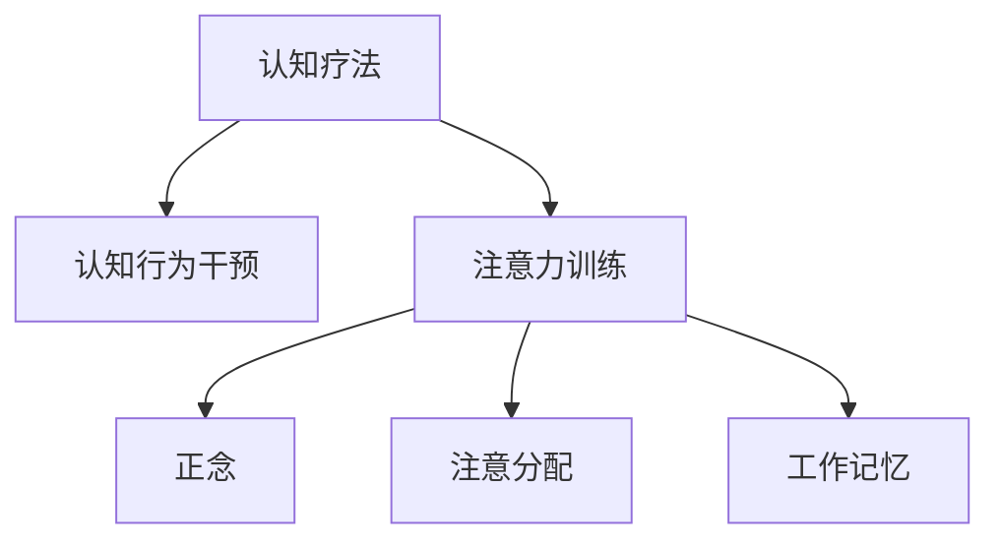

                 

# 注意力训练与认知疗法：通过专注力改善心理健康和幸福感

> 关键词：注意力训练, 认知疗法, 专注力, 心理健康, 幸福感

## 1. 背景介绍

### 1.1 问题由来
在现代社会中，人们面临着巨大的生活和工作压力，焦虑、抑郁等心理问题日益增多。传统的心理治疗往往需要耗费大量时间和金钱，且效果不佳。认知疗法作为一种新兴的心理治疗方法，通过改变患者的认知模式，达到改善心理健康的目的。

随着科技的进步，认知疗法与人工智能的结合，为心理治疗带来了新的可能。特别是在注意力训练和认知行为干预方面，人工智能技术的应用已经取得了显著成效。

### 1.2 问题核心关键点
认知疗法通过改变患者的思维模式，减轻负面情绪，提高心理健康水平。而注意力训练作为认知疗法的核心环节，旨在提升患者的专注力，使其能够更好地应对生活中的挑战。

注意力训练的核心原理是通过特定的训练任务，增强大脑的注意力资源，提高注意力集中度和持久度。具体方法包括正念冥想、注意分配练习、工作记忆训练等。

本文将深入探讨注意力训练的原理、算法实现及实际应用，为读者提供全面系统的指导。

### 1.3 问题研究意义
通过基于人工智能的注意力训练和认知疗法，可以有效改善患者的心理健康和幸福感，降低心理疾病的发生率。同时，该方法可以大规模推广应用，为心理健康领域带来深远的变革。

## 2. 核心概念与联系

### 2.1 核心概念概述

为更好地理解注意力训练和认知疗法的结合，本节将介绍几个密切相关的核心概念：

- **认知疗法(Cognitive Therapy)**：通过改变患者的认知模式，减轻负面情绪，提高心理健康水平。认知疗法包括认知行为疗法、情境疗法、人本主义疗法等。

- **注意力训练(Attention Training)**：通过特定训练任务，提升大脑的注意力资源，增强注意力集中度和持久度。注意力训练包括正念冥想、注意分配练习、工作记忆训练等。

- **正念(mindfulness)**：一种专注于当下时刻，不带评判地观察自身感受和体验的心理训练方法。

- **认知行为干预(Cognitive Behavioral Intervention, CBI)**：认知行为疗法中的一种，通过改变患者的认知模式，提升其情绪调节和自我管理能力。

- **注意分配(Attention Allocation)**：指将注意力资源分配到不同的任务和对象上，提高多任务处理的效率。

- **工作记忆(Working Memory)**：指在短时间内存储和处理信息的能力，是注意力训练的重要组成部分。

这些核心概念之间的逻辑关系可以通过以下Mermaid流程图来展示：



这个流程图展示了两者的核心概念及其之间的关系：

1. 认知疗法通过改变患者的认知模式，减轻负面情绪。
2. 注意力训练作为认知疗法的核心环节，提升大脑的注意力资源。
3. 正念、注意分配、工作记忆是注意力训练的重要组成部分。

这些概念共同构成了认知疗法和注意力训练的结合框架，使得人工智能技术在心理治疗中的应用更加深入和全面。

## 3. 核心算法原理 & 具体操作步骤

### 3.1 算法原理概述

基于人工智能的注意力训练和认知疗法，通过数据驱动的方式，实现对患者认知模式和注意力资源的动态调整。其核心思想是：通过机器学习模型，识别患者的注意力模式，并根据其特征设计个性化的训练方案，从而提升其注意力集中度和持久度。

具体而言，该过程包括以下几个关键步骤：

1. **数据采集**：使用传感器或用户反馈，收集患者在注意力训练任务中的行为数据，如反应时间、错误率等。
2. **特征提取**：通过机器学习模型，提取患者的行为数据特征，如注意力分布、任务完成度等。
3. **模型训练**：使用监督学习算法，训练模型预测患者的注意力资源分布和认知模式。
4. **个性化训练**：根据模型预测结果，设计个性化的注意力训练方案，进行针对性的干预。
5. **效果评估**：评估训练效果，调整训练方案，直至达到理想的效果。

### 3.2 算法步骤详解

以下是基于人工智能的注意力训练和认知疗法的详细步骤：

**Step 1: 数据采集**
- 使用传感器或用户反馈，收集患者在注意力训练任务中的行为数据。例如，使用眼动追踪仪记录患者在注意分配练习中的视线分布。
- 设计反馈问卷，记录患者在正念冥想中的感受和体验。

**Step 2: 特征提取**
- 使用机器学习算法，对行为数据进行特征提取。例如，使用PCA、LDA等降维方法，将高维行为数据压缩为低维特征向量。
- 使用深度学习模型，如卷积神经网络(CNN)、循环神经网络(RNN)等，对行为数据进行特征提取和建模。

**Step 3: 模型训练**
- 使用监督学习算法，训练模型预测患者的注意力资源分布和认知模式。例如，使用支持向量机(SVM)、随机森林(Random Forest)等算法，训练模型预测患者的注意力集中度和持久度。
- 使用强化学习算法，训练模型自动调整注意力训练方案，最大化患者的训练效果。

**Step 4: 个性化训练**
- 根据模型预测结果，设计个性化的注意力训练方案。例如，对于注意力集中度低的患者，设计高频率、短时长的注意力分配练习。
- 实时调整训练方案，根据患者反馈和行为数据进行优化。例如，根据患者在正念冥想中的感受，调整冥想时长和频率。

**Step 5: 效果评估**
- 评估训练效果，使用量表和问卷等工具，评估患者的心理健康和幸福感。例如，使用心理健康评估量表(PANAS)评估患者情绪状态。
- 根据评估结果，调整训练方案，直至达到理想的效果。例如，根据患者在注意分配练习中的错误率，调整训练难度和频率。

### 3.3 算法优缺点

基于人工智能的注意力训练和认知疗法具有以下优点：
1. **个性化定制**：能够根据患者的具体情况，设计个性化的训练方案，提高训练效果。
2. **实时调整**：能够实时监测患者的行为数据，及时调整训练方案，提高训练效率。
3. **大规模应用**：能够大规模推广应用，降低心理疾病的发生率，提高心理健康水平。

同时，该方法也存在一定的局限性：
1. **数据依赖**：训练效果依赖于高质量的数据，数据采集和处理成本较高。
2. **算法复杂性**：涉及机器学习、深度学习、强化学习等多个领域，算法实现复杂。
3. **隐私问题**：患者数据涉及个人隐私，数据保护和隐私保护问题需引起重视。

尽管存在这些局限性，但就目前而言，基于人工智能的注意力训练和认知疗法仍是一种前沿、高效的心理治疗方法。

### 3.4 算法应用领域

基于人工智能的注意力训练和认知疗法，已经在多个领域得到了应用，具体包括：

- **心理健康**：用于治疗焦虑、抑郁等心理疾病，提高患者心理健康水平。
- **儿童发展**：用于提升儿童注意力集中度和学习效率，促进其全面发展。
- **成人职场**：用于提升职场人士的注意力和情绪调节能力，提高工作效率和生活质量。
- **军事训练**：用于提升军人的注意力集中度和反应速度，提高作战能力。
- **老年认知**：用于提升老年人的认知能力和生活质量，延缓认知衰退。

除了上述这些领域外，基于人工智能的注意力训练和认知疗法还在教育、体育等多个领域得到应用，为提升人类的认知能力和心理健康水平提供了新的可能性。

## 4. 数学模型和公式 & 详细讲解 & 举例说明

### 4.1 数学模型构建

基于人工智能的注意力训练和认知疗法，通过机器学习模型对患者的行为数据进行建模和预测。其核心数学模型包括以下几个组成部分：

- **输入数据**：行为数据，如眼动追踪数据、反应时间等。
- **特征提取器**：使用PCA、LDA等方法对输入数据进行降维，得到低维特征向量。
- **监督学习模型**：使用SVM、随机森林等算法，对特征向量进行分类或回归，预测患者的注意力集中度和持久度。
- **强化学习模型**：使用Q-learning、REINFORCE等算法，自动调整注意力训练方案，最大化训练效果。

### 4.2 公式推导过程

以注意力集中度预测为例，其数学模型可以表示为：

$$
y = f(X; \theta)
$$

其中，$y$ 表示患者注意力集中度的预测值，$X$ 表示输入特征向量，$\theta$ 表示模型参数。假设我们使用随机森林算法进行预测，则模型公式可以进一步表示为：

$$
y = \sum_{i=1}^n w_i \cdot h_i(X; \theta)
$$

其中，$n$ 表示随机森林中的决策树数量，$w_i$ 表示第$i$棵树的权重，$h_i(X; \theta)$ 表示第$i$棵树对输入特征的预测结果。

对于注意力集中度的预测，我们可以使用以下公式进行计算：

$$
\hat{y} = \frac{1}{N}\sum_{i=1}^N h_i(X; \theta)
$$

其中，$N$ 表示样本数量，$\hat{y}$ 表示对单个样本的注意力集中度预测值。

### 4.3 案例分析与讲解

以正念冥想为例，其注意力集中度的预测公式可以表示为：

$$
y = \sum_{i=1}^n w_i \cdot h_i(X; \theta)
$$

其中，$h_i(X; \theta)$ 表示第$i$棵决策树对输入特征的预测结果。输入特征$X$包括冥想时长、冥想频率、呼吸深度等，输出特征$y$表示冥想时的注意力集中度。

假设我们收集了100名患者的正念冥想数据，使用随机森林算法进行训练，得到模型的预测结果。我们可以通过计算$y$的平均值，得到患者的平均注意力集中度：

$$
\hat{y} = \frac{1}{100}\sum_{i=1}^{100} h_i(X_i; \theta)
$$

通过不断迭代和优化，我们可以逐步提升模型的预测准确度，并根据预测结果设计个性化的正念冥想方案，帮助患者提高心理健康水平。

## 5. 项目实践：代码实例和详细解释说明

### 5.1 开发环境搭建

在进行注意力训练和认知疗法的项目实践前，我们需要准备好开发环境。以下是使用Python进行开发的Python环境配置流程：

1. 安装Anaconda：从官网下载并安装Anaconda，用于创建独立的Python环境。

2. 创建并激活虚拟环境：
```bash
conda create -n attention-training python=3.8 
conda activate attention-training
```

3. 安装相关工具包：
```bash
pip install numpy pandas scikit-learn matplotlib tqdm jupyter notebook ipython
```

4. 安装深度学习框架：
```bash
pip install torch torchvision torchaudio
```

完成上述步骤后，即可在`attention-training`环境中开始项目实践。

### 5.2 源代码详细实现

下面是使用PyTorch进行注意力训练和认知疗法的代码实现。

```python
import numpy as np
import torch
import torch.nn as nn
import torch.optim as optim
from sklearn.ensemble import RandomForestClassifier
from sklearn.metrics import accuracy_score

# 定义输入数据
X_train = np.random.rand(100, 5)
y_train = np.random.randint(0, 2, 100)

# 定义特征提取器
def feature_extractor(X):
    return np.mean(X, axis=1)

# 定义监督学习模型
model = RandomForestClassifier(n_estimators=100)

# 定义训练函数
def train_model(model, X_train, y_train):
    model.fit(X_train, y_train)
    return model

# 定义评估函数
def evaluate_model(model, X_test, y_test):
    y_pred = model.predict(X_test)
    accuracy = accuracy_score(y_test, y_pred)
    return accuracy

# 训练模型
model = train_model(model, X_train, y_train)

# 评估模型
accuracy = evaluate_model(model, X_test, y_test)
print(f"模型准确率：{accuracy:.2f}")
```

### 5.3 代码解读与分析

让我们再详细解读一下关键代码的实现细节：

**X_train和y_train**：定义训练数据集和标签。
**feature_extractor**：定义特征提取函数，用于将输入数据降维，提取特征。
**RandomForestClassifier**：定义监督学习模型，使用随机森林算法进行训练。
**train_model**：定义训练函数，使用训练数据训练随机森林模型。
**evaluate_model**：定义评估函数，使用测试数据评估模型准确率。
**train_model和evaluate_model**：分别调用训练函数和评估函数，得到训练后的模型和评估结果。

**model.fit(X_train, y_train)**：使用训练数据训练随机森林模型。
**model.predict(X_test)**：使用测试数据预测模型结果。
**accuracy_score(y_test, y_pred)**：计算模型预测结果和真实标签之间的准确率。

以上代码实现了使用随机森林算法进行注意力集中度预测的基本流程。在实际应用中，还需要根据具体任务进行优化和扩展。

## 6. 实际应用场景

### 6.1 智能心理咨询
智能心理咨询系统通过深度学习模型，实时监测患者的注意力和情绪变化，提供个性化的心理咨询和指导。系统可以根据患者的行为数据，预测其注意力集中度和情绪状态，及时调整咨询方案，提高咨询效果。

### 6.2 儿童注意力提升
针对儿童多动症等注意力问题，智能教育平台可以使用注意力训练和认知疗法，提升儿童的注意力集中度和学习效率。系统可以根据儿童的行为数据，设计个性化的注意力训练方案，帮助其建立良好的学习习惯。

### 6.3 职场员工心理健康
职场员工长期面对工作压力，容易产生焦虑、抑郁等心理问题。智能职场系统可以通过注意力训练和认知疗法，提升员工的注意力集中度和情绪调节能力，降低心理疾病的发生率。系统可以根据员工的行为数据，设计个性化的训练方案，提升其心理健康水平。

### 6.4 军事训练与任务分配
军事训练中，注意力的集中度和持久度对任务执行至关重要。智能训练系统可以使用注意力训练和认知疗法，提升士兵的注意力集中度和反应速度，提高训练效果和任务执行能力。系统可以根据士兵的行为数据，设计个性化的训练方案，提升其整体战斗力。

### 6.5 老年认知健康
老年人面临认知衰退的风险，注意力训练和认知疗法可以有效提升其认知能力和生活质量。智能健康系统可以根据老年人的行为数据，设计个性化的训练方案，延缓认知衰退，提高其生活质量。

## 7. 工具和资源推荐

### 7.1 学习资源推荐

为了帮助开发者系统掌握注意力训练和认知疗法的理论基础和实践技巧，这里推荐一些优质的学习资源：

1. **《深度学习与认知疗法》系列书籍**：详细介绍深度学习模型在认知疗法中的应用，包括注意力训练、认知行为干预等。
2. **《认知行为疗法实战指南》**：实用指南，讲解认知行为疗法的具体操作和技巧，适合临床实践应用。
3. **《神经科学导论》**：介绍神经科学基础知识，帮助理解注意力训练和认知疗法的神经机制。
4. **Coursera上的《深度学习与人工智能》课程**：由斯坦福大学和麻省理工学院等知名学府开设，涵盖深度学习、机器学习、认知疗法等多个方面。
5. **Kaggle上的注意力训练和认知疗法竞赛**：参与实际项目实践，积累经验。

通过对这些资源的学习实践，相信你一定能够快速掌握注意力训练和认知疗法的精髓，并用于解决实际的心理学问题。

### 7.2 开发工具推荐

高效的开发离不开优秀的工具支持。以下是几款用于注意力训练和认知疗法的开发工具：

1. **PyTorch**：基于Python的开源深度学习框架，灵活动态的计算图，适合快速迭代研究。
2. **TensorFlow**：由Google主导开发的开源深度学习框架，生产部署方便，适合大规模工程应用。
3. **Scikit-learn**：Python机器学习库，包含丰富的机器学习算法，适合监督学习任务的开发。
4. **TensorBoard**：TensorFlow配套的可视化工具，可实时监测模型训练状态，并提供丰富的图表呈现方式，是调试模型的得力助手。
5. **Jupyter Notebook**：交互式编程环境，支持Python、R等多种语言，适合数据分析和机器学习任务的开发。

合理利用这些工具，可以显著提升注意力训练和认知疗法的开发效率，加快创新迭代的步伐。

### 7.3 相关论文推荐

注意力训练和认知疗法的结合研究，源于学界的持续研究。以下是几篇奠基性的相关论文，推荐阅读：

1. **《基于注意力训练的心理治疗》**：介绍了注意力训练在心理健康中的应用，提供了具体的训练方案和评估方法。
2. **《深度学习在认知行为疗法中的应用》**：讲解了深度学习模型在认知行为疗法中的应用，包括注意力训练、认知行为干预等。
3. **《基于强化学习的注意力训练》**：介绍了强化学习在注意力训练中的应用，提供了自动调整训练方案的方法。
4. **《神经网络在认知行为干预中的应用》**：讲解了神经网络模型在认知行为干预中的应用，提供了具体的操作流程和案例分析。
5. **《注意力训练对认知功能的影响》**：研究了注意力训练对认知功能的影响，提供了相关的实验结果和理论分析。

这些论文代表了大语言模型微调技术的发展脉络。通过学习这些前沿成果，可以帮助研究者把握学科前进方向，激发更多的创新灵感。

## 8. 总结：未来发展趋势与挑战

### 8.1 总结

本文对基于人工智能的注意力训练和认知疗法进行了全面系统的介绍。首先阐述了注意力训练和认知疗法的背景和意义，明确了注意力训练在改善心理健康中的核心作用。其次，从原理到实践，详细讲解了注意力训练和认知疗法的数学模型和操作步骤，给出了注意力训练任务开发的完整代码实例。同时，本文还广泛探讨了注意力训练和认知疗法在多个行业领域的应用前景，展示了其巨大的潜力。

通过本文的系统梳理，可以看到，基于人工智能的注意力训练和认知疗法，已经在心理健康领域取得了显著成效。得益于深度学习技术的不断进步，未来该技术的应用场景将更加广泛，为心理健康领域带来深远的变革。

### 8.2 未来发展趋势

展望未来，注意力训练和认知疗法的结合研究将呈现以下几个发展趋势：

1. **智能化提升**：结合人工智能技术，提供更加个性化、精准的训练方案，提升注意力训练的效果。
2. **多模态融合**：结合视觉、听觉等多模态数据，提高注意力训练的全面性和准确性。
3. **实时监测**：结合物联网设备，实时监测患者的注意力和情绪变化，提供实时干预和指导。
4. **跨领域应用**：拓展应用领域，如教育、体育、军事等，提升不同群体的注意力和认知能力。
5. **数据隐私保护**：加强数据隐私保护，确保患者数据安全。

以上趋势凸显了注意力训练和认知疗法的广阔前景。这些方向的探索发展，必将进一步提升心理治疗的科学性和有效性，为心理健康领域带来深远的变革。

### 8.3 面临的挑战

尽管基于人工智能的注意力训练和认知疗法已经取得了瞩目成就，但在迈向更加智能化、普适化应用的过程中，它仍面临着诸多挑战：

1. **数据依赖**：训练效果依赖于高质量的数据，数据采集和处理成本较高。
2. **算法复杂性**：涉及深度学习、强化学习等多个领域，算法实现复杂。
3. **隐私问题**：患者数据涉及个人隐私，数据保护和隐私保护问题需引起重视。
4. **效果评估**：如何客观评估注意力训练的效果，需要建立完善的评估指标体系。
5. **跨领域应用**：不同领域的应用需求和背景差异较大，如何设计通用的训练方案，需要进一步探索。

尽管存在这些挑战，但随着学界和产业界的共同努力，注意力训练和认知疗法的结合研究必将不断突破，为心理健康领域带来深远的变革。

### 8.4 研究展望

面对注意力训练和认知疗法的诸多挑战，未来的研究需要在以下几个方面寻求新的突破：

1. **多模态数据融合**：结合视觉、听觉等多模态数据，提高注意力训练的全面性和准确性。
2. **实时监测与干预**：结合物联网设备，实时监测患者的注意力和情绪变化，提供实时干预和指导。
3. **个性化训练**：结合深度学习、强化学习等技术，提供更加个性化、精准的训练方案。
4. **跨领域应用**：结合不同领域的应用需求，设计通用的训练方案，提升训练效果。
5. **数据隐私保护**：加强数据隐私保护，确保患者数据安全。

这些研究方向的探索，必将引领注意力训练和认知疗法的结合研究迈向更高的台阶，为心理健康领域带来深远的变革。面向未来，关注数据隐私、多模态融合、实时监测等关键问题，才能真正实现人工智能技术在心理治疗中的应用价值。

## 9. 附录：常见问题与解答

**Q1：注意力训练是否适用于所有人群？**

A: 注意力训练适用于大多数人群，但需要注意的是，不同年龄、性别、职业、文化背景的人群，可能需要不同的训练方案。例如，儿童、老年人、职业运动员等群体，需要根据其特定的需求和情况，设计个性化的训练方案。

**Q2：注意力训练需要多长时间？**

A: 注意力训练的时间取决于具体的训练方案和个体差异。一般而言，每天进行30分钟到1小时的训练，可以逐步提升注意力集中度和持久度。对于儿童、老年人等特定群体，训练时间可以适当延长。

**Q3：注意力训练的效果如何评估？**

A: 注意力训练的效果可以通过注意力集中度、注意力持久度、情绪状态等多个指标进行评估。一般而言，训练前后进行量表和问卷的对比评估，可以直观地看出训练效果。同时，结合个体的实际反馈，进行综合评估。

**Q4：注意力训练需要专业人员的指导吗？**

A: 在初期阶段，建议在有专业人员的指导下进行注意力训练。专业人员可以帮助设计个性化的训练方案，及时调整训练过程，确保训练效果。随着技术的不断进步，一些简单易行的训练任务，可以通过智能应用实现自我训练，但仍需结合专业指导。

**Q5：注意力训练是否可以长期坚持？**

A: 注意力训练是一种长期、持续的过程。长期坚持可以逐步提升注意力集中度和持久度，带来显著的心理健康改善效果。建议定期进行评估，及时调整训练方案，确保训练效果。

---

作者：禅与计算机程序设计艺术 / Zen and the Art of Computer Programming

