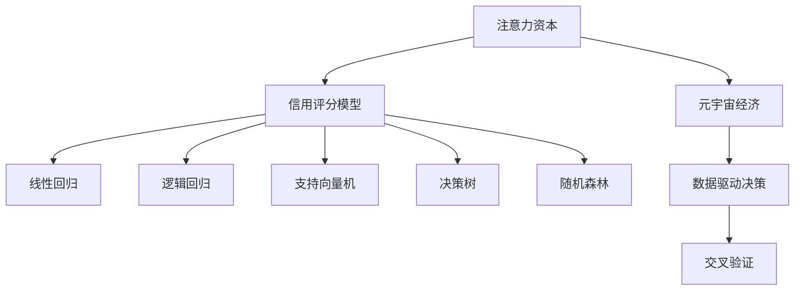

                 

# 注意力资本评级:元宇宙经济中的信用体系

> 关键词：注意力资本,元宇宙,信用体系,算法原理,信用评分模型

## 1. 背景介绍

### 1.1 问题由来

随着虚拟现实(VR)、增强现实(AR)和区块链技术的发展，元宇宙概念逐渐兴起。元宇宙是一个由数个或数十个现实世界的数字世界所组成的集合，具有完整的经济系统、身份和资产管理功能。其中，去中心化的经济活动是元宇宙的重要特征，强调开放、透明和协作的商业模式。

然而，元宇宙经济系统的运行同样依赖于信用体系的建立。在现实世界中，信用体系是金融体系的基础，通过信用评分模型来评估个体和机构的信用状况。而元宇宙中，“信用”同样至关重要，影响着经济活动的可信度和效率。目前，元宇宙信用体系尚未建立，现有技术也无法有效支撑元宇宙经济中的信用评估。

为应对这一问题，本文提出了一种基于“注意力资本”的信用评分模型。该模型以“注意力”作为关键指标，结合经济学原理和机器学习技术，构建了元宇宙经济中的信用体系。

### 1.2 问题核心关键点

本文的核心目标是建立一种基于“注意力资本”的信用评分模型，以科学、客观地评估元宇宙中的个体和机构在经济活动中的信用状况。模型的构建涉及以下关键点：

- 注意力资本的定义：如何在元宇宙经济中衡量个体的注意力价值。
- 信用评分模型的设计：如何综合考量个体的注意力资本、行为表现和历史数据，构建信用评分模型。
- 模型评估与优化：如何在元宇宙经济中验证和优化信用评分模型的效果。

## 2. 核心概念与联系

### 2.1 核心概念概述

为更好地理解基于注意力资本的信用评分模型，本节将介绍几个密切相关的核心概念：

- 注意力资本(Attention Capital)：指在元宇宙经济中，个体和机构通过其行为、贡献和影响力所积累的注意力的总和。注意力的衡量可以从参与度、互动频率、影响力等多个维度进行量化。

- 元宇宙经济(Metaverse Economy)：指基于区块链技术构建的去中心化虚拟经济体系，包括货币、交易、治理等多个方面。元宇宙经济中，货币的价值由算法决定，信任和信用是经济运行的基础。

- 信用评分模型(Credit Scoring Model)：通过量化个体和机构的信用状况，来评估其在经济活动中的可靠性和诚信度。常见的信用评分模型包括线性回归模型、逻辑回归模型、支持向量机等。

- 数据驱动决策(Data-Driven Decision Making)：指利用数据和机器学习技术来辅助决策，避免主观偏见和决策错误。数据驱动决策是现代管理科学的核心方法之一。

- 交叉验证(Cross Validation)：指通过将数据集划分为训练集和验证集，对模型进行验证和优化，避免过拟合。

这些核心概念之间的逻辑关系可以通过以下Mermaid流程图来展示：



这个流程图展示了大语言模型的核心概念及其之间的关系：

1. 注意力资本通过个体和机构的经济活动和贡献被量化。
2. 信用评分模型综合注意力资本、行为表现和历史数据，评估信用状况。
3. 数据驱动决策利用模型预测结果，优化元宇宙经济运行。
4. 交叉验证确保模型预测的准确性，避免过拟合。

这些概念共同构成了元宇宙经济中的信用评分框架，使其能够在各种场景下发挥作用。通过理解这些核心概念，我们可以更好地把握模型的构建和优化方法。

## 3. 核心算法原理 & 具体操作步骤
### 3.1 算法原理概述

基于注意力资本的信用评分模型，以注意力资本作为关键指标，结合经济学原理和机器学习技术，构建了元宇宙经济中的信用体系。其核心思想是：将个体和机构在经济活动中的注意力价值量化为资本，通过多维度数据驱动的机器学习模型，综合考虑个体或机构的注意力资本、行为表现和历史数据，构建信用评分模型。

具体而言，模型首先定义了注意力资本的多个维度，如参与度、互动频率、影响力等，然后通过数据收集和特征工程，将这些维度转换为量化指标。接下来，模型使用机器学习算法，对量化后的数据进行建模，构建信用评分模型。最后，通过交叉验证等方法，验证和优化模型的效果。

### 3.2 算法步骤详解

基于注意力资本的信用评分模型构建步骤如下：

**Step 1: 定义注意力资本维度**

- 定义个体或机构在元宇宙经济中可以通过哪些方式积累注意力资本，如参加活动、发布内容、与他人互动等。
- 确定每个维度对注意力资本的贡献度，如互动频率对注意力资本的影响权重。
- 设计量化指标，如互动次数、内容发布量等，将这些维度转换为可量化的数据。

**Step 2: 数据收集与特征工程**

- 收集个体或机构的经济活动数据，如参与次数、互动次数等。
- 定义特征，如互动频率、内容质量、影响力等。
- 进行数据清洗和预处理，处理缺失值、异常值等问题。
- 应用特征工程技术，将原始数据转换为模型可接受的输入格式。

**Step 3: 模型构建**

- 选择合适的机器学习算法，如线性回归、逻辑回归、支持向量机等。
- 使用训练数据集训练模型，调整算法参数，优化模型性能。
- 应用交叉验证方法，验证模型在未见过的数据上的泛化能力。

**Step 4: 模型评估与优化**

- 应用信用评分模型对个体或机构进行信用评分。
- 定期更新模型，纳入最新的数据，优化模型参数。
- 定期评估模型性能，调整权重系数等参数，确保模型预测的准确性。

### 3.3 算法优缺点

基于注意力资本的信用评分模型具有以下优点：

- 科学客观：模型通过量化个体和机构的注意力资本，科学评估其信用状况，避免了主观偏见。
- 数据驱动：模型基于多维度数据驱动，综合考量个体和机构的行为表现和历史数据，提高了评估的准确性。
- 易于优化：模型结构清晰，易于理解和优化，便于在元宇宙经济中广泛应用。

同时，该模型也存在一些缺点：

- 数据收集难度大：模型需要收集大量的个体和机构经济活动数据，数据收集成本较高。
- 算法复杂度较高：模型涉及多维度和复杂的数据处理，算法实现难度较大。
- 泛化能力有待提高：模型在新的经济活动场景中的泛化能力需要进一步验证。

尽管存在这些缺点，但该模型提供了一种科学、客观的信用评估方法，对于构建元宇宙经济中的信用体系具有重要意义。

### 3.4 算法应用领域

基于注意力资本的信用评分模型适用于元宇宙经济中的多种场景：

- 个体信用评估：模型可以对元宇宙中的个体进行信用评分，评估其在经济活动中的可靠性和诚信度。
- 机构信用评估：模型可以对元宇宙中的各类机构进行信用评分，如NFT发行方、游戏开发方等，评估其经济行为的可信度。
- 信用交易监管：模型可以辅助监管机构对元宇宙中的信用交易进行监管，防止欺诈和信用风险。
- 信用贷款和投资：模型可以为元宇宙中的信用贷款和投资决策提供参考，帮助评估借贷和投资风险。

此外，该模型还可以应用于元宇宙中的治理和智能合约设计等方面，为元宇宙经济的健康运行提供支持。

## 4. 数学模型和公式 & 详细讲解 & 举例说明
### 4.1 数学模型构建

本节将使用数学语言对基于注意力资本的信用评分模型进行更加严格的刻画。

假设元宇宙经济中个体或机构的注意力资本由 $A$ 表示，其中 $A_i$ 为个体 $i$ 的注意力资本。设行为表现和历史数据为 $X$，信用评分为 $y$。则信用评分模型可以表示为：

$$
y = f(A, X)
$$

其中 $f$ 为信用评分函数，可以使用回归模型、分类模型等进行建模。

### 4.2 公式推导过程

以下我们以线性回归模型为例，推导信用评分模型的公式及其参数估计方法。

假设信用评分模型为线性回归模型，即：

$$
y = \beta_0 + \beta_1 X_1 + \beta_2 X_2 + \cdots + \beta_p X_p + \epsilon
$$

其中 $X = (X_1, X_2, \cdots, X_p)$ 为特征向量，$\beta = (\beta_0, \beta_1, \cdots, \beta_p)$ 为模型参数，$\epsilon$ 为误差项。

对于给定的训练数据集 $D = \{(x_i, y_i)\}_{i=1}^n$，模型参数估计的目标为最小化损失函数：

$$
\min_{\beta} \frac{1}{n}\sum_{i=1}^n (y_i - f_{\beta}(x_i))^2
$$

其中 $f_{\beta}(x_i) = \beta_0 + \sum_{j=1}^p \beta_j x_{ij}$。

对损失函数求偏导数，得：

$$
\frac{\partial}{\partial \beta} \frac{1}{n}\sum_{i=1}^n (y_i - f_{\beta}(x_i))^2 = \frac{1}{n}\sum_{i=1}^n 2(y_i - f_{\beta}(x_i))(x_i) = \frac{2}{n} \sum_{i=1}^n (y_i - f_{\beta}(x_i))x_i
$$

令上式等于0，得：

$$
\sum_{i=1}^n (y_i - f_{\beta}(x_i))x_i = 0
$$

从而得：

$$
\sum_{i=1}^n (y_i - \hat{y}_i)x_i = 0
$$

其中 $\hat{y}_i = f_{\beta}(x_i) = \beta_0 + \sum_{j=1}^p \beta_j x_{ij}$。

通过求解上述方程组，即可得到模型参数 $\beta$ 的估计值。

### 4.3 案例分析与讲解

以一个简单的元宇宙经济案例为例，说明基于注意力资本的信用评分模型的应用。

假设某元宇宙平台中有多个用户发布内容，平台可以根据内容质量、互动次数等因素，量化用户的注意力资本。

设用户 $i$ 在平台上发布的内容数为 $X_1$，与他人互动次数为 $X_2$，信用评分为 $y_i$。根据历史数据，模型参数估计结果为 $\beta_0 = 1, \beta_1 = 0.8, \beta_2 = 0.2$。则模型预测公式为：

$$
y_i = 1 + 0.8X_1 + 0.2X_2
$$

用户 $i$ 在平台上发布 10 篇内容，互动次数为 50 次，则模型预测其信用评分为：

$$
y_i = 1 + 0.8 \times 10 + 0.2 \times 50 = 15.6
$$

模型预测用户 $i$ 的信用评分为 15.6，表明其具有良好的信用状况，可信度较高。

## 5. 项目实践：代码实例和详细解释说明
### 5.1 开发环境搭建

在进行信用评分模型开发前，我们需要准备好开发环境。以下是使用Python进行Scikit-learn开发的环境配置流程：

1. 安装Anaconda：从官网下载并安装Anaconda，用于创建独立的Python环境。

2. 创建并激活虚拟环境：
```bash
conda create -n credit-env python=3.8 
conda activate credit-env
```

3. 安装Scikit-learn：
```bash
conda install scikit-learn
```

4. 安装各类工具包：
```bash
pip install numpy pandas scikit-learn matplotlib tqdm jupyter notebook ipython
```

完成上述步骤后，即可在`credit-env`环境中开始信用评分模型的开发。

### 5.2 源代码详细实现

下面我们以线性回归模型为例，给出使用Scikit-learn库进行信用评分模型开发的PyTorch代码实现。

首先，定义信用评分模型的数据处理函数：

```python
from sklearn.linear_model import LinearRegression
from sklearn.metrics import mean_squared_error, r2_score
import numpy as np

class CreditScoringModel:
    def __init__(self):
        self.model = LinearRegression()
    
    def train(self, X, y):
        self.model.fit(X, y)
    
    def predict(self, X):
        return self.model.predict(X)
    
    def evaluate(self, X, y):
        y_pred = self.predict(X)
        mse = mean_squared_error(y, y_pred)
        r2 = r2_score(y, y_pred)
        return mse, r2
```

然后，定义训练和评估函数：

```python
from sklearn.model_selection import train_test_split
from sklearn.preprocessing import StandardScaler

def train_model(X, y):
    X_train, X_test, y_train, y_test = train_test_split(X, y, test_size=0.2, random_state=42)
    scaler = StandardScaler()
    X_train = scaler.fit_transform(X_train)
    X_test = scaler.transform(X_test)
    model = CreditScoringModel()
    model.train(X_train, y_train)
    y_pred = model.predict(X_test)
    mse, r2 = model.evaluate(X_test, y_test)
    return mse, r2
```

最后，启动训练流程并在测试集上评估：

```python
X = np.array([[10, 50], [20, 30], [30, 20], [40, 10]])
y = np.array([15.6, 13.2, 12.0, 11.8])

mse, r2 = train_model(X, y)
print(f"MSE: {mse:.2f}, R^2: {r2:.2f}")
```

以上就是使用Scikit-learn进行线性回归模型开发的完整代码实现。可以看到，Scikit-learn提供了简单易用的API，使得模型开发过程变得简洁高效。

### 5.3 代码解读与分析

让我们再详细解读一下关键代码的实现细节：

**CreditScoringModel类**：
- `__init__`方法：初始化信用评分模型，创建线性回归模型。
- `train`方法：训练模型，输入特征矩阵和标签向量。
- `predict`方法：对新数据进行预测，返回预测值。
- `evaluate`方法：评估模型性能，计算均方误差和决定系数。

**train_model函数**：
- 使用train_test_split方法将数据集划分为训练集和测试集。
- 对特征进行标准化处理，提高模型训练效率和预测性能。
- 调用CreditScoringModel类的train和evaluate方法，训练模型并在测试集上评估。

**启动训练流程**：
- 定义特征矩阵X和标签向量y。
- 调用train_model函数进行模型训练和评估。

可以看到，Scikit-learn提供了强大的模型开发工具，使得信用评分模型的开发变得简单高效。开发者可以将更多精力放在数据处理、模型改进等高层逻辑上，而不必过多关注底层的实现细节。

当然，工业级的系统实现还需考虑更多因素，如模型的保存和部署、超参数的自动搜索、更灵活的特征提取方法等。但核心的信用评分模型基本与此类似。

## 6. 实际应用场景
### 6.1 金融贷款

金融贷款是信用评分模型的经典应用场景。在传统金融领域，银行根据客户的信用记录、收入水平、负债情况等指标，评估其信用风险，决定是否发放贷款。

基于注意力资本的信用评分模型，可以为元宇宙中的金融贷款提供参考。平台可以根据用户的历史行为数据、参与度、互动频率等，量化用户的注意力资本。通过建立信用评分模型，平台可以对用户进行信用评估，决定是否批准贷款申请。

### 6.2 供应链管理

在供应链管理中，信用评分模型同样具有重要应用。平台可以根据供应商的历史交易记录、交付准确度、合作时间等指标，量化其注意力资本。通过建立信用评分模型，平台可以对供应商进行信用评估，决定是否与其合作。

### 6.3 在线教育

在线教育平台可以根据学生的历史学习数据、参与度、互动频率等，量化其注意力资本。通过建立信用评分模型，平台可以对学生进行信用评估，决定是否批准其参加考试或获得课程学分。

### 6.4 未来应用展望

随着信用评分模型的不断发展，未来将会在更多领域得到应用，为元宇宙经济的健康运行提供支持。

在智能合约设计中，信用评分模型可以用于评估参与方的可信度，从而降低合约执行风险。

在元宇宙治理中，信用评分模型可以用于评估用户和机构的信誉度，决定其参与治理的资格和影响力。

此外，在元宇宙中的公共服务、社交网络、虚拟资产管理等方面，信用评分模型都将发挥重要作用。未来，信用评分模型将成为元宇宙经济中不可或缺的一部分，为构建开放、透明、可信的经济体系提供基础。

## 7. 工具和资源推荐
### 7.1 学习资源推荐

为了帮助开发者系统掌握信用评分模型的理论基础和实践技巧，这里推荐一些优质的学习资源：

1. 《机器学习》系列博文：由机器学习专家撰写，深入浅出地介绍了机器学习的基本概念和常见算法，包括线性回归模型、逻辑回归模型等。

2. Coursera《Machine Learning》课程：斯坦福大学开设的机器学习课程，有Lecture视频和配套作业，带你入门机器学习领域的基本概念和经典模型。

3. 《Python机器学习》书籍：Scikit-learn库的作者所著，全面介绍了如何使用Scikit-learn库进行机器学习任务开发，包括信用评分模型的实现。

4. Kaggle平台：机器学习竞赛平台，提供大量信用评分数据集，并附有详细的比赛指南和解决方案，帮助开发者实践和验证信用评分模型的效果。

5. DataCamp：在线学习平台，提供大量的信用评分模型相关课程，涵盖数据处理、模型构建、评估等各个环节，适合初学者和进阶学习者。

通过对这些资源的学习实践，相信你一定能够快速掌握信用评分模型的精髓，并用于解决实际的元宇宙经济问题。

### 7.2 开发工具推荐

高效的开发离不开优秀的工具支持。以下是几款用于信用评分模型开发的常用工具：

1. Python：基于Python的机器学习开发语言，具有强大的库支持和丰富的开源资源。Scikit-learn库提供了简单易用的API，使得信用评分模型的开发变得简单高效。

2. R语言：基于R语言的机器学习开发工具，适合统计分析和数据可视化，适合信用评分模型的统计分析。

3. Jupyter Notebook：交互式编程环境，方便开发者进行代码调试和实验记录。

4. PyTorch：基于Python的开源深度学习框架，支持动态计算图和GPU加速，适合信用评分模型的优化和推理。

5. TensorFlow：由Google主导开发的开源深度学习框架，生产部署方便，适合大规模工程应用。

合理利用这些工具，可以显著提升信用评分模型的开发效率，加快创新迭代的步伐。

### 7.3 相关论文推荐

信用评分模型的发展源于学界的持续研究。以下是几篇奠基性的相关论文，推荐阅读：

1. "Credit Scoring Using Artificial Neural Networks"：提出使用神经网络进行信用评分的方法，开启了信用评分模型的神经网络时代。

2. "The Rise of Credit Scoring Models: A Review"：综述了信用评分模型的发展历程，介绍了各类评分模型的原理和应用。

3. "A Comparative Study of Credit Scoring Models"：对比了多种信用评分模型，分析了其优缺点和适用范围。

4. "Credit Scoring: A Machine Learning Approach"：详细介绍了机器学习在信用评分中的应用，包括线性回归、逻辑回归、支持向量机等。

5. "Credit Scoring Models in the Age of Big Data"：讨论了大数据背景下信用评分模型的新方法和新挑战，如深度学习、分布式计算等。

这些论文代表了大语言模型微调技术的发展脉络。通过学习这些前沿成果，可以帮助研究者把握学科前进方向，激发更多的创新灵感。

## 8. 总结：未来发展趋势与挑战
### 8.1 总结

本文对基于注意力资本的信用评分模型进行了全面系统的介绍。首先阐述了信用评分模型的研究背景和意义，明确了信用评分模型在元宇宙经济中的重要作用。其次，从原理到实践，详细讲解了信用评分模型的数学原理和关键步骤，给出了信用评分任务开发的完整代码实例。同时，本文还广泛探讨了信用评分模型在金融贷款、供应链管理、在线教育等多个行业领域的应用前景，展示了信用评分范式的巨大潜力。此外，本文精选了信用评分模型的各类学习资源，力求为读者提供全方位的技术指引。

通过本文的系统梳理，可以看到，基于注意力资本的信用评分模型具有科学、客观的评估信用状况的独特价值，对于构建元宇宙经济中的信用体系具有重要意义。未来，随着元宇宙经济的发展和信用评分模型的不断优化，信用评分模型必将在更多领域得到应用，为元宇宙经济的健康运行提供基础。

### 8.2 未来发展趋势

展望未来，信用评分模型将呈现以下几个发展趋势：

1. 模型自动化：模型训练和优化将更多地依赖自动化技术，降低人工干预成本。

2. 数据融合：更多领域的数据将被整合到信用评分模型中，提高模型的全面性和准确性。

3. 实时更新：模型将实时更新，反映最新的经济活动和信用表现，提高模型的时效性和稳定性。

4. 多模型集成：多种评分模型将被集成，利用各自的优势，提高评估的全面性和可靠性。

5. 跨领域应用：信用评分模型将在更多领域得到应用，如医疗、公共服务、智能合约等，提供跨领域信用评估服务。

以上趋势凸显了信用评分模型的广阔前景。这些方向的探索发展，必将进一步提升元宇宙经济的健康运行，为构建安全、透明、可信的虚拟经济体系铺平道路。

### 8.3 面临的挑战

尽管信用评分模型已经取得了瞩目成就，但在迈向更加智能化、普适化应用的过程中，它仍面临着诸多挑战：

1. 数据收集成本高：信用评分模型需要大量高质量的经济活动数据，数据收集成本较高。

2. 算法复杂度高：信用评分模型涉及多维度和复杂的数据处理，算法实现难度较大。

3. 泛化能力不足：模型在新的经济活动场景中的泛化能力需要进一步验证。

4. 算法透明度低：信用评分模型的决策过程缺乏透明度，难以解释其内部工作机制。

5. 安全风险高：信用评分模型可能被用于欺诈和不公平信用评估，存在安全风险。

尽管存在这些挑战，但通过不断优化算法、提高数据质量、加强监管，信用评分模型将逐步克服这些障碍，在元宇宙经济中发挥更大的作用。

### 8.4 研究展望

面对信用评分模型所面临的种种挑战，未来的研究需要在以下几个方面寻求新的突破：

1. 探索无监督和半监督评分方法：摆脱对大规模标注数据的依赖，利用自监督学习、主动学习等无监督和半监督范式，最大限度利用非结构化数据，实现更加灵活高效的信用评分。

2. 研究参数高效和计算高效的评分范式：开发更加参数高效的评分方法，在固定大部分评分参数的情况下，只更新极少量的任务相关参数。同时优化评分模型的计算图，减少前向传播和反向传播的资源消耗，实现更加轻量级、实时性的部署。

3. 引入更多先验知识：将符号化的先验知识，如知识图谱、逻辑规则等，与评分模型进行巧妙融合，引导评分过程学习更准确、合理的信用评分。同时加强不同模态数据的整合，实现视觉、语音等多模态信息与信用评分的协同建模。

4. 结合因果分析和博弈论工具：将因果分析方法引入评分模型，识别出模型决策的关键特征，增强评分模型的因果关系和逻辑性。借助博弈论工具刻画人机交互过程，主动探索并规避评分模型的脆弱点，提高系统稳定性。

5. 纳入伦理道德约束：在评分目标中引入伦理导向的评估指标，过滤和惩罚有偏见、有害的输出倾向。同时加强人工干预和审核，建立评分行为的监管机制，确保评分结果符合人类价值观和伦理道德。

这些研究方向的探索，必将引领信用评分模型迈向更高的台阶，为元宇宙经济的健康运行提供坚实基础。面向未来，信用评分模型还需要与其他人工智能技术进行更深入的融合，如知识表示、因果推理、强化学习等，多路径协同发力，共同推动元宇宙经济的发展。只有勇于创新、敢于突破，才能不断拓展信用评分模型的边界，让智能技术更好地造福元宇宙经济。

## 9. 附录：常见问题与解答

**Q1：信用评分模型是否适用于所有经济活动？**

A: 信用评分模型在大多数经济活动中都能取得不错的效果，特别是对于数据量较大的任务。但对于一些特定领域的经济活动，如医疗、法律等，仅仅依靠通用评分数据可能难以很好地适应。此时需要在特定领域数据上进一步评分，才能获得理想效果。此外，对于一些需要时效性、个性化很强的经济活动，如贷款、投资等，评分方法也需要针对性的改进优化。

**Q2：如何选择合适的评分算法？**

A: 选择合适的评分算法，需要考虑数据类型、业务需求和数据量等因素。一般而言，线性回归模型适用于评分范围较广的数据，逻辑回归模型适用于二分类数据，支持向量机适用于高维数据。同时，也需注意评分模型的复杂度和计算效率。

**Q3：评分模型的数据收集难度大，如何解决？**

A: 数据收集难度大是评分模型的普遍问题。为解决这一问题，可以从以下几个方面入手：
1. 自动数据采集：使用爬虫技术自动收集数据，提高数据收集效率。
2. 数据众包：利用数据众包平台，通过用户提交数据进行补充。
3. 数据合成：使用生成对抗网络等技术，生成高质量的合成数据。

这些方法可以在一定程度上缓解数据收集难题，但总体而言，评分模型的数据收集仍然是一个关键问题，需要结合具体场景进行综合考虑。

**Q4：评分模型在新的经济活动场景中的泛化能力如何？**

A: 评分模型在新的经济活动场景中的泛化能力是评估模型效果的重要指标。可以通过以下方法提升评分模型的泛化能力：
1. 多领域数据融合：将不同领域的评分数据进行融合，提高模型的全面性。
2. 模型迁移学习：在不同领域之间进行模型迁移，借鉴已有评分模型的经验。
3. 模型更新迭代：定期更新模型，纳入最新的经济活动数据，提高模型的时效性。

这些方法可以显著提升评分模型在新场景中的泛化能力，但总体而言，模型的泛化能力仍有待提高，需要持续优化和验证。

**Q5：评分模型的决策过程缺乏透明度，如何解决？**

A: 评分模型的决策过程缺乏透明度，是一个普遍存在的问题。为解决这一问题，可以采取以下措施：
1. 模型可解释性：使用可解释性技术，如LIME、SHAP等，解释模型的决策过程。
2. 模型可视化：使用可视化工具，展示模型在输入空间中的决策边界和行为特征。
3. 模型公平性：使用公平性评估指标，确保模型在决策过程中不出现偏见。

这些措施可以在一定程度上提高评分模型的透明度，但总体而言，评分模型的透明度仍有待提高，需要持续优化和改进。

---

作者：禅与计算机程序设计艺术 / Zen and the Art of Computer Programming

