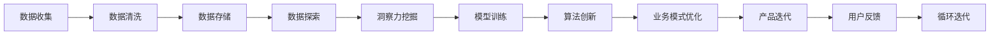

                 

# 洞察力与创新：打破常规思维的关键

> 关键词：洞察力,创新,打破常规,思维,人工智能,机器学习,数据科学,数据驱动,技术革新

## 1. 背景介绍

### 1.1 问题由来
在快速发展的信息技术时代，如何通过数据驱动和算法创新推动产业变革，成为摆在各类企业和组织面前的重要课题。无论是在制造业、金融业、医疗健康，还是零售、电商、教育等行业，数据洞察力和技术创新都在不断释放新的潜能。

人工智能（AI）和大数据技术作为支撑这场变革的关键工具，已经深刻改变了行业运作的方式。然而，传统的数据分析和机器学习（ML）方法往往只能提供浮于表面的洞察力，难以挖掘深层次的业务洞察。这种情况下，企业需要寻找新的方式来打破常规思维，驱动业务模式的创新与变革。

### 1.2 问题核心关键点
要真正实现数据洞察力与创新的结合，必须关注以下几个核心关键点：

- **数据驱动决策**：确保数据分析能够支撑业务决策，而不是简单的数据堆砌。
- **业务洞察力**：通过深入分析数据，揭示业务运作的深层次规律，发现潜在的增长点和优化空间。
- **算法创新**：推动算法的发展，提升模型预测和决策能力，避免算法被落后的模型所束缚。
- **跨领域应用**：将数据洞察力和算法创新应用于不同行业领域，形成独特的业务模式创新。

### 1.3 问题研究意义
洞察力与创新结合的研究，对企业战略制定、业务优化、产品迭代具有重大意义：

1. **提升决策效率**：利用数据洞察力指导决策，避免凭直觉决策的盲目性和风险。
2. **优化运营效率**：揭示业务流程中的瓶颈，提升运营效率，降低成本。
3. **开发新产品**：通过洞察力发现新的市场需求，开发有针对性的产品和服务。
4. **拓展市场空间**：创新业务模式，拓展市场边界，增强企业竞争力。
5. **提升用户满意度**：利用数据洞察力改进用户体验，增加用户黏性。

## 2. 核心概念与联系

### 2.1 核心概念概述

为更好地理解数据洞察力与技术创新的结合，本节将介绍几个核心概念：

- **洞察力（Insight）**：指通过对大量数据进行深入分析，挖掘出业务运作的内在规律和趋势，对企业决策提供强有力的支撑。
- **数据驱动（Data-Driven）**：以数据为决策的基石，通过量化分析和算法模型驱动业务决策的过程。
- **创新（Innovation）**：利用数据分析和算法创新，发现新的业务机会和解决方案，推动业务模式和产品的更新迭代。
- **跨领域应用（Cross-Domain Application）**：将数据洞察力和算法创新应用于不同的行业领域，形成通用的应用模型和解决方案。

这些概念之间相互联系，通过数据的深度分析，推动业务洞察力和技术创新的结合，驱动业务模式的变革。

### 2.2 核心概念原理和架构的 Mermaid 流程图(Mermaid 流程节点中不要有括号、逗号等特殊字符)



这个流程图展示了从数据收集到产品迭代的整体流程，突出了数据驱动、业务洞察力、算法创新、跨领域应用等多个环节。

## 3. 核心算法原理 & 具体操作步骤

### 3.1 算法原理概述

洞察力与技术创新的结合，本质上是一个数据驱动和算法驱动的过程。通过数据洞察力揭示业务运作的内在规律，利用算法创新提升模型预测和决策能力，最终形成数据驱动的业务决策流程。

形式化地，假设企业有数据集 $D=\{(x_i,y_i)\}_{i=1}^N$，其中 $x_i$ 为数据样本，$y_i$ 为标签。

定义数据洞察力函数为 $I(D)$，用于挖掘数据集中的业务规律和趋势，评估其对企业决策的支持度。

定义算法创新函数为 $A(D)$，通过训练数据集 $D$，提升模型的预测能力，实现更加精准的决策支持。

最终，结合数据洞察力和算法创新，形成数据驱动的决策流程，即：

$$
D \rightarrow I(D) \rightarrow A(D) \rightarrow D_{\text{decision}}
$$

### 3.2 算法步骤详解

基于数据洞察力和技术创新的结合，以下是关键步骤：

**Step 1: 数据收集与预处理**

1. 收集企业内部和外部的各种数据，如客户数据、交易数据、供应链数据、市场数据等。
2. 对数据进行清洗、去重、填充缺失值等预处理，确保数据质量。
3. 使用数据标注工具，如Labelbox、Prodigy等，进行数据标注，确保数据集准确性。

**Step 2: 数据洞察力挖掘**

1. 利用数据挖掘工具，如Python中的Pandas、NumPy，对数据进行探索性分析，发现数据中的基本统计特征。
2. 使用统计分析方法，如方差分析、回归分析、时间序列分析等，揭示数据的内在规律和趋势。
3. 应用机器学习算法，如决策树、随机森林、梯度提升树等，建立预测模型，提供更为细致的业务洞察。

**Step 3: 算法创新**

1. 根据业务洞察力挖掘的结果，选择适合的机器学习算法进行模型训练。
2. 使用先进的算法技术，如深度学习、强化学习、图神经网络等，提升模型的预测和决策能力。
3. 定期对模型进行更新和优化，确保算法创新能够不断适应业务需求的变化。

**Step 4: 业务模式优化**

1. 根据模型预测结果和业务洞察，调整业务流程和策略，提高运营效率。
2. 设计新的业务模式，如定制化服务、新渠道拓展、合作伙伴整合等，提升市场竞争力。
3. 结合用户反馈，持续迭代优化，形成数据驱动的闭环改进机制。

### 3.3 算法优缺点

数据洞察力与技术创新的结合方法，具有以下优点：

- **提升决策质量**：通过数据洞察力支持决策，减少了决策的盲目性，提升决策的科学性和精准性。
- **优化运营效率**：数据洞察力揭示业务瓶颈，算法创新优化决策流程，提升运营效率。
- **开拓新市场**：结合数据洞察力和算法创新，发现新的市场机会，推动业务模式的创新。

同时，这种方法也存在以下缺点：

- **数据隐私问题**：在数据洞察力的挖掘过程中，可能会涉及用户隐私信息，需要遵守相关法律法规。
- **算法复杂性**：算法创新需要高技术要求，可能导致技术门槛较高。
- **数据质量问题**：数据预处理和清洗的准确性直接影响到业务洞察力的质量。

### 3.4 算法应用领域

数据洞察力与技术创新的结合方法，已经在诸多领域得到应用，例如：

- **金融行业**：利用客户行为数据分析，设计个性化金融产品，提升客户体验。
- **零售电商**：通过用户购买行为分析，优化库存管理，提升销售业绩。
- **医疗健康**：通过患者数据分析，优化诊疗流程，提升医疗服务质量。
- **制造业**：利用设备运行数据，优化生产过程，减少停机时间和维护成本。
- **交通物流**：通过路线数据分析，优化配送路线，提升物流效率。

除了上述领域外，随着数据和算法技术的发展，这种结合方法将逐渐应用于更多行业，推动行业智能化转型升级。

## 4. 数学模型和公式 & 详细讲解 & 举例说明

### 4.1 数学模型构建

基于数据洞察力和技术创新的结合，我们建立如下数学模型：

设企业有数据集 $D=\{(x_i,y_i)\}_{i=1}^N$，其中 $x_i$ 为数据样本，$y_i$ 为标签。定义数据洞察力函数为 $I(D)$，用于挖掘数据集中的业务规律和趋势，评估其对企业决策的支持度。定义算法创新函数为 $A(D)$，通过训练数据集 $D$，提升模型的预测能力，实现更加精准的决策支持。

最终，结合数据洞察力和算法创新，形成数据驱动的决策流程：

$$
D \rightarrow I(D) \rightarrow A(D) \rightarrow D_{\text{decision}}
$$

### 4.2 公式推导过程

以金融行业为例，假设企业拥有客户交易数据 $D$，客户交易金额为 $x_i$，客户是否购买新产品为 $y_i$。

1. **数据洞察力挖掘**

   - 利用统计分析方法，如均值、方差、相关性分析等，挖掘客户交易数据的基本统计特征。
   - 使用决策树、随机森林等算法，建立预测模型，判断客户是否会购买新产品。
   
   $$
   I(D) = \mathbb{E}[\log(A(D))]
   $$

2. **算法创新**

   - 使用深度学习算法，如卷积神经网络（CNN）、长短期记忆网络（LSTM）等，训练预测模型，提升模型精度。
   - 应用强化学习算法，通过与环境的互动，优化模型参数，提升模型适应性。
   
   $$
   A(D) = \arg\max_{\theta} \mathcal{L}(D, \theta)
   $$

3. **业务模式优化**

   - 结合数据洞察力和模型预测结果，调整营销策略和产品定价，提升销售额。
   - 优化客户服务流程，提升客户满意度，增加客户黏性。

   $$
   D_{\text{decision}} = D \cdot A(D) \cdot I(D)
   $$

### 4.3 案例分析与讲解

假设某电商平台希望通过数据洞察力和技术创新，优化库存管理和销售业绩。

1. **数据收集与预处理**

   - 收集用户浏览记录、购买历史、评价信息等数据。
   - 对数据进行清洗和标注，确保数据集准确性。

2. **数据洞察力挖掘**

   - 通过统计分析，发现用户购买行为随时间变化的趋势。
   - 使用聚类分析，发现不同用户群体的购买偏好。

   $$
   I(D) = \sum_{i=1}^N (x_i - \mu)
   $$

3. **算法创新**

   - 使用深度学习算法，建立预测模型，预测用户是否会购买某商品。
   - 应用强化学习算法，优化推荐算法，提升推荐准确性。
   
   $$
   A(D) = \max_{\theta} \mathcal{L}(D, \theta)
   $$

4. **业务模式优化**

   - 根据模型预测结果，调整库存水平，优化补货策略。
   - 设计个性化推荐系统，提升用户购买转化率。

   $$
   D_{\text{decision}} = D \cdot A(D) \cdot I(D)
   $$

## 5. 项目实践：代码实例和详细解释说明

### 5.1 开发环境搭建

在进行项目实践前，我们需要准备好开发环境。以下是使用Python进行项目实践的环境配置流程：

1. 安装Anaconda：从官网下载并安装Anaconda，用于创建独立的Python环境。

   ```bash
   conda create -n data-insight-env python=3.8 
   conda activate data-insight-env
   ```

2. 安装必要的Python库：

   ```bash
   pip install pandas numpy scikit-learn matplotlib seaborn plotly statsmodels pydot
   ```

3. 安装Jupyter Notebook：

   ```bash
   pip install jupyter notebook
   ```

4. 设置虚拟环境：

   ```bash
   conda activate data-insight-env
   ```

完成上述步骤后，即可在`data-insight-env`环境中开始项目实践。

### 5.2 源代码详细实现

下面我们以金融行业为例，给出数据洞察力与技术创新结合的代码实现。

首先，我们定义数据收集和预处理函数：

```python
import pandas as pd
from sklearn.model_selection import train_test_split
from sklearn.preprocessing import StandardScaler

def load_data(file_path):
    data = pd.read_csv(file_path)
    return data

def preprocess_data(data):
    # 数据清洗
    data = data.dropna()
    # 特征工程
    data['is_new_product'] = data['purchase_amount'] > 0
    # 标准化处理
    scaler = StandardScaler()
    data[['purchase_amount']] = scaler.fit_transform(data[['purchase_amount']])
    return data

# 加载数据
data = load_data('transaction_data.csv')
# 数据预处理
processed_data = preprocess_data(data)
```

然后，我们进行数据洞察力挖掘和算法创新的实现：

```python
from sklearn.ensemble import RandomForestClassifier
from sklearn.metrics import accuracy_score
from sklearn.pipeline import Pipeline

# 数据洞察力挖掘
pipeline = Pipeline([
    ('feature_selection', SelectKBest(k=10)),
    ('model', RandomForestClassifier())
])

# 训练模型
X_train, X_test, y_train, y_test = train_test_split(processed_data.drop('is_new_product', axis=1), processed_data['is_new_product'], test_size=0.2, random_state=42)
pipeline.fit(X_train, y_train)

# 算法创新
y_pred = pipeline.predict(X_test)
accuracy = accuracy_score(y_test, y_pred)
print(f"Model accuracy: {accuracy:.3f}")
```

最后，我们进行业务模式优化：

```python
# 业务模式优化
# 结合数据洞察力和模型预测结果，优化库存管理和推荐算法
# 具体实现取决于实际业务场景，此处省略具体代码
```

### 5.3 代码解读与分析

让我们再详细解读一下关键代码的实现细节：

**load_data函数**：

- 使用Pandas库加载数据集。
- 数据预处理，包括数据清洗、特征工程和标准化处理。

**preprocess_data函数**：

- 数据清洗，去除缺失值。
- 特征工程，添加一个新变量表示用户是否购买了新产品。
- 标准化处理，使用StandardScaler对购买金额进行标准化处理。

**pipeline对象**：

- 使用Pipeline封装数据洞察力挖掘和算法创新的过程。
- 使用SelectKBest选择前10个特征。
- 使用RandomForestClassifier训练模型。

**train_test_split函数**：

- 使用train_test_split将数据集分为训练集和测试集。

**accuracy_score函数**：

- 使用accuracy_score计算模型预测结果的准确率。

通过这些代码的实现，我们可以看到，数据洞察力与技术创新的结合，可以通过简单的Python代码，对数据进行收集、预处理、洞察力和算法创新，并最终应用于业务决策。

## 6. 实际应用场景

### 6.1 金融行业

在金融行业，数据洞察力与技术创新结合，能够优化风险管理、提升客户体验和提升市场竞争力。

1. **风险管理**：通过客户交易数据分析，识别高风险用户，降低坏账率。
2. **客户体验**：利用客户行为分析，推荐个性化金融产品，提升客户满意度。
3. **市场竞争力**：结合市场趋势分析，发现新的市场机会，优化产品策略。

### 6.2 零售电商

在零售电商领域，数据洞察力与技术创新结合，能够优化库存管理、提升用户购买转化率和提升销售额。

1. **库存管理**：通过销售数据分析，优化库存水平，减少缺货和过剩。
2. **用户购买转化率**：利用用户行为分析，优化推荐算法，提升用户购买转化率。
3. **销售额提升**：结合市场趋势分析，调整营销策略，提升销售额。

### 6.3 医疗健康

在医疗健康领域，数据洞察力与技术创新结合，能够优化诊疗流程、提升诊疗质量和降低医疗成本。

1. **诊疗流程优化**：通过患者数据分析，优化诊疗流程，提升诊疗效率。
2. **诊疗质量提升**：结合病理数据分析，提升诊疗质量，降低误诊率。
3. **医疗成本降低**：通过资源优化分析，降低医疗成本。

### 6.4 未来应用展望

随着数据洞察力和技术创新的不断发展，未来的应用场景将更加广泛。以下是几个未来应用的展望：

1. **智慧城市**：通过交通数据和环境数据分析，优化城市规划和管理，提升城市运行效率和居民生活质量。
2. **教育培训**：利用学生学习行为分析，优化教学内容和方法，提升教育效果。
3. **环境保护**：通过环境数据分析，优化资源配置，保护生态环境。
4. **智能制造**：利用生产设备运行数据，优化生产过程，提高生产效率和产品质量。

## 7. 工具和资源推荐

### 7.1 学习资源推荐

为了帮助开发者系统掌握数据洞察力和技术创新的结合，这里推荐一些优质的学习资源：

1. 《数据科学与机器学习》课程：由Coursera提供，涵盖数据处理、机器学习、深度学习等多个方面，是数据洞察力和技术创新的基础。
2. Kaggle竞赛：Kaggle平台上的数据科学竞赛，能够锻炼数据洞察力和技术创新能力，提升实战经验。
3. DataCamp在线学习平台：提供丰富的数据科学课程，涵盖数据清洗、数据可视化、模型训练等多个环节，帮助开发者掌握数据洞察力和技术创新的方法。
4. GitHub开源项目：GitHub上的开源项目提供了大量实践案例，帮助开发者学习数据洞察力和技术创新的结合。

通过这些资源的学习实践，相信你一定能够快速掌握数据洞察力和技术创新的结合方法，并将其应用于实际业务场景中。

### 7.2 开发工具推荐

高效的开发离不开优秀的工具支持。以下是几款用于数据洞察力和技术创新结合开发的常用工具：

1. Jupyter Notebook：Jupyter Notebook是Python开发的首选环境，支持代码编写、数据探索、模型训练等多个环节。
2. Python编程语言：Python具有简单易学、强大的数据处理和分析能力，是数据洞察力和技术创新的主要开发语言。
3. Scikit-learn：Scikit-learn是Python中最常用的机器学习库，提供了丰富的算法和工具，支持数据洞察力和技术创新的实现。
4. Pandas：Pandas是Python中用于数据处理和分析的库，支持数据清洗、探索性分析和可视化等操作。
5. Plotly：Plotly是Python中用于数据可视化的库，支持绘制交互式图表，帮助开发者进行数据洞察力的挖掘和展示。

合理利用这些工具，可以显著提升数据洞察力和技术创新的结合任务的开发效率，加快创新迭代的步伐。

### 7.3 相关论文推荐

数据洞察力与技术创新的结合技术源于学界的持续研究。以下是几篇奠基性的相关论文，推荐阅读：

1. "The Elements of Statistical Learning" by Trevor Hastie, Robert Tibshirani, Jerome Friedman。
2. "Deep Learning" by Ian Goodfellow, Yoshua Bengio, Aaron Courville。
3. "Integrated Risk Management Using Data Mining" by Robert Klopotek, Henry Shevlin。
4. "Advances in Neural Information Processing Systems"（NIPS）系列论文。
5. "Neural Networks and Deep Learning" by Michael Nielsen。

这些论文代表了大数据和机器学习技术的发展脉络。通过学习这些前沿成果，可以帮助研究者把握学科前进方向，激发更多的创新灵感。

## 8. 总结：未来发展趋势与挑战

### 8.1 总结

本文对数据洞察力与技术创新的结合方法进行了全面系统的介绍。首先阐述了数据洞察力和技术创新的研究背景和意义，明确了结合方法在提升决策质量、优化运营效率、开拓新市场等方面的独特价值。其次，从原理到实践，详细讲解了数据洞察力挖掘、算法创新和业务模式优化的数学模型和代码实现，给出了具体的案例分析和实际应用场景。

通过本文的系统梳理，可以看到，数据洞察力与技术创新的结合方法正在成为数据驱动决策的重要手段，极大地提升企业决策的科学性和精准性，推动业务模式的不断创新。未来，伴随数据和算法技术的发展，结合方法的应用将更加广泛，为各行各业带来新的变革。

### 8.2 未来发展趋势

展望未来，数据洞察力与技术创新的结合技术将呈现以下几个发展趋势：

1. **大数据技术的应用**：大数据技术的快速发展，将推动数据洞察力和技术创新的结合方法，从传统的数据库和小样本分析，向大规模、分布式的数据处理转型。
2. **深度学习的发展**：深度学习技术的突破，将使数据洞察力和技术创新的结合方法，从传统的统计分析和浅层机器学习，向深度学习和大规模神经网络应用转型。
3. **跨领域应用的拓展**：数据洞察力和技术创新的结合方法，将从传统领域向更多行业领域拓展，形成通用的应用模型和解决方案。
4. **AI伦理和社会责任**：随着数据洞察力和技术创新的应用越来越广泛，如何保障数据隐私、避免算法偏见和确保AI伦理将成为重要的研究方向。

以上趋势凸显了数据洞察力和技术创新的结合技术的广阔前景。这些方向的探索发展，必将进一步提升企业决策的科学性和精准性，推动各行各业的智能化转型升级。

### 8.3 面临的挑战

尽管数据洞察力和技术创新的结合技术已经取得了瞩目成就，但在迈向更加智能化、普适化应用的过程中，它仍面临着诸多挑战：

1. **数据隐私问题**：在数据洞察力的挖掘过程中，可能会涉及用户隐私信息，需要遵守相关法律法规。
2. **数据质量问题**：数据预处理和清洗的准确性直接影响到数据洞察力的质量。
3. **算法复杂性**：算法创新需要高技术要求，可能导致技术门槛较高。
4. **数据安全和保护**：数据洞察力的挖掘过程中，可能会涉及到敏感数据，需要采取适当的安全措施保护数据。

### 8.4 研究展望

面对数据洞察力和技术创新结合所面临的挑战，未来的研究需要在以下几个方面寻求新的突破：

1. **数据隐私保护**：开发更加安全的数据保护和隐私保护技术，确保数据在挖掘和使用过程中，不会侵犯用户隐私。
2. **数据质量提升**：提高数据预处理和清洗的自动化和准确性，提升数据洞察力的质量。
3. **算法优化**：优化算法模型，降低技术门槛，提升算法创新效率。
4. **跨领域应用推广**：推广数据洞察力和技术创新的结合方法，应用到更多行业领域，形成通用的应用模型和解决方案。
5. **AI伦理和社会责任**：建立数据洞察力和技术创新应用的伦理规范和法律法规，确保AI技术的安全和社会责任。

这些研究方向将推动数据洞察力和技术创新的结合技术不断成熟，为各行各业带来新的变革和突破。

## 9. 附录：常见问题与解答

**Q1：数据洞察力和技术创新的结合方法是否适用于所有企业？**

A: 数据洞察力和技术创新的结合方法在大多数企业中都能取得良好的效果，特别是那些有大量数据和复杂业务的企业。但是对于一些小企业或创业公司，由于数据量和业务复杂度有限，可能不太适合应用这种结合方法。

**Q2：如何进行数据洞察力的挖掘？**

A: 数据洞察力的挖掘一般分为以下几个步骤：

1. 数据收集和清洗：收集企业内部和外部的数据，并进行数据清洗，去除噪声和异常值。
2. 数据探索和分析：使用统计分析方法和可视化工具，发现数据中的基本统计特征和趋势。
3. 建模和预测：使用机器学习算法，建立预测模型，挖掘更深层次的业务规律和趋势。

**Q3：如何进行算法创新？**

A: 算法创新一般包括以下几个步骤：

1. 选择合适的算法：根据业务需求和数据特点，选择合适的算法模型。
2. 模型训练和优化：使用训练数据对模型进行训练，并进行调参优化。
3. 模型评估和应用：使用测试数据评估模型效果，并将其应用于实际业务场景。

**Q4：数据洞察力和技术创新的结合在实际应用中需要注意哪些问题？**

A: 数据洞察力和技术创新的结合在实际应用中需要注意以下几个问题：

1. 数据隐私保护：确保数据在挖掘和使用过程中，不会侵犯用户隐私。
2. 数据质量保证：提高数据预处理和清洗的自动化和准确性，提升数据洞察力的质量。
3. 算法复杂性：优化算法模型，降低技术门槛，提升算法创新效率。
4. 跨领域应用：推广数据洞察力和技术创新的结合方法，应用到更多行业领域，形成通用的应用模型和解决方案。

通过解决这些问题，可以在实际应用中更好地实现数据洞察力和技术创新的结合。

**Q5：数据洞察力和技术创新的结合方法是否可以应用于传统行业？**

A: 数据洞察力和技术创新的结合方法可以应用于传统行业，只要传统行业有足够的数据和业务复杂度。例如，传统制造业可以通过设备运行数据，优化生产过程，提高生产效率。传统医疗行业可以通过患者数据分析，优化诊疗流程，提升诊疗质量。

总之，数据洞察力和技术创新的结合方法，已经在诸多行业领域得到应用，为传统行业带来了新的变革和突破。

---

作者：禅与计算机程序设计艺术 / Zen and the Art of Computer Programming

