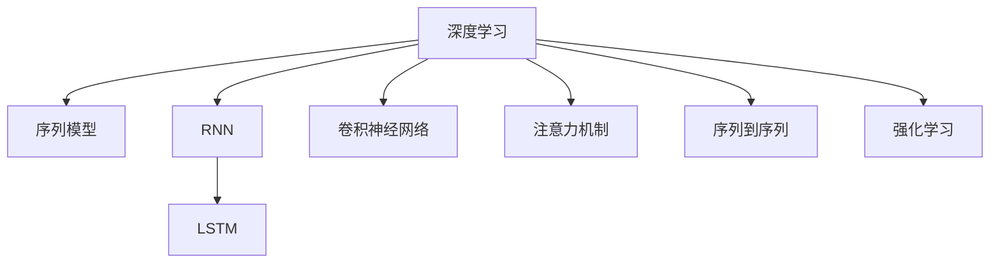

                 

# 深度学习在用户行为序列分析中的应用

> 关键词：深度学习,用户行为分析,序列模型,循环神经网络(RNN),长短时记忆网络(LSTM),卷积神经网络(CNN),注意力机制(Attention),序列到序列(Seq2Seq),强化学习,行为预测

## 1. 背景介绍

### 1.1 问题由来

在数字化时代，用户行为数据源源不断地产生，如何高效、准确地从海量的数据中提取有用信息，成为企业数据驱动决策的关键问题。用户行为序列分析是指对用户在一段时间内的行为数据进行建模和分析，以挖掘用户兴趣、需求、偏好等隐含信息，并基于此进行个性化推荐、广告投放、客户服务等业务决策。这一领域涉及数据分析、机器学习、自然语言处理等多学科知识，因此深度学习技术的应用变得尤为重要。

### 1.2 问题核心关键点

- **数据特性**：用户行为数据通常具有时间序列特性，且包含高维稀疏数据，如点击、浏览、购买等。
- **模型选择**：深度学习模型在处理序列数据、提取长期依赖关系上表现出强大的能力，能够从多维度的行为序列中提取出复杂的模式。
- **技术演进**：从传统的RNN到LSTM、GRU、CNN，再到多任务学习、迁移学习、注意力机制、序列到序列(Seq2Seq)、强化学习等，深度学习在用户行为序列分析领域不断演进，提升了模型的性能和应用范围。

## 2. 核心概念与联系

### 2.1 核心概念概述

为更好地理解深度学习在用户行为序列分析中的应用，本节将介绍几个密切相关的核心概念：

- **深度学习(Deep Learning)**：基于神经网络的机器学习技术，可以自动地学习并抽取数据中的高层次抽象特征，广泛应用于计算机视觉、自然语言处理、语音识别等任务。
- **序列模型(Sequence Modeling)**：通过神经网络对序列数据进行建模，如时间序列、自然语言序列等。序列模型能够捕捉序列数据中的时间依赖关系，为行为分析提供了有力的工具。
- **循环神经网络(RNN)**：一种能够处理序列数据的神经网络模型，通过循环连接实现信息在时间上的传递和积累。RNN在自然语言处理和语音识别等领域有广泛应用。
- **长短时记忆网络(LSTM)**：一种特殊的RNN，通过门控机制能够有效处理长期依赖问题，适用于处理需要记忆较长时间信息的序列数据。
- **卷积神经网络(CNN)**：一种常用于图像处理和文本处理的神经网络，通过局部连接和池化操作，提取输入数据的空间特征。CNN可以用于处理多维度的行为序列数据。
- **注意力机制(Attention)**：一种机制，可以动态地对输入序列的各个部分进行加权，以强调当前时间步的上下文信息。注意力机制能够增强模型的表达能力和泛化能力。
- **序列到序列(Seq2Seq)**：一种将序列数据映射到另一种序列数据的任务，如机器翻译、对话生成等。Seq2Seq模型由编码器-解码器组成，能够处理输入序列到输出序列的转换。
- **强化学习(Reinforcement Learning)**：一种学习机制，通过与环境交互，学习最优策略以最大化累积奖励。强化学习可以用于行为预测、推荐系统等任务。

这些核心概念之间的逻辑关系可以通过以下Mermaid流程图来展示：



这个流程图展示了大语言模型的核心概念及其之间的关系：

1. 深度学习作为核心技术，提供了一种能够自动学习数据特征的能力。
2. 序列模型是深度学习在处理序列数据时的具体应用。
3. 循环神经网络、长短时记忆网络、卷积神经网络等是序列模型中的具体实现。
4. 注意力机制、序列到序列、强化学习等则是序列模型中的一些高级应用。

这些概念共同构成了用户行为序列分析的基础框架，使得深度学习能够高效地处理序列数据，并提取其中的有用信息。

## 3. 核心算法原理 & 具体操作步骤
### 3.1 算法原理概述

深度学习在用户行为序列分析中的应用，主要涉及对序列数据进行建模和分析。常见的深度学习模型包括循环神经网络(RNN)、长短时记忆网络(LSTM)、卷积神经网络(CNN)、注意力机制(Attention)等。这些模型通过学习序列数据中的时间依赖关系和特征表示，能够捕捉用户行为中的复杂模式和规律。

形式化地，假设用户行为序列为 $X=(x_1,x_2,...,x_t)$，其中 $x_t$ 表示在时间步 $t$ 的用户行为。目标是通过深度学习模型 $M$ 学习用户行为序列的表示 $h_t=f(X)$，其中 $f$ 为模型函数。模型 $M$ 通过学习用户行为序列 $X$ 中的特征和关系，预测用户的行为序列 $Y=(y_1,y_2,...,y_t)$。

### 3.2 算法步骤详解

基于深度学习的用户行为序列分析，一般包括以下几个关键步骤：

**Step 1: 数据预处理与划分**
- 对原始用户行为数据进行清洗和预处理，如去除噪声、处理缺失值、归一化等。
- 将用户行为序列划分为训练集、验证集和测试集，以评估模型的性能。

**Step 2: 选择模型架构**
- 根据任务需求选择合适的深度学习模型，如RNN、LSTM、GRU、CNN等。
- 设计模型输入输出层的结构，选择合适的激活函数、损失函数等。

**Step 3: 训练模型**
- 将处理好的数据输入模型，使用随机梯度下降等优化算法，最小化损失函数。
- 在验证集上监测模型的性能，适时调整超参数，避免过拟合。
- 重复迭代，直至模型收敛或达到预设的迭代次数。

**Step 4: 模型评估与测试**
- 在测试集上评估模型的预测性能，计算准确率、召回率、F1分数等指标。
- 分析模型预测的误差，进一步优化模型。
- 使用优化后的模型进行实际应用。

### 3.3 算法优缺点

基于深度学习的用户行为序列分析方法具有以下优点：
1. 强大的表示能力。深度学习模型能够自动学习数据中的复杂特征，捕捉用户行为中的长期依赖关系。
2. 较好的泛化能力。深度学习模型在大量数据上进行训练，具有较强的泛化能力，适用于不同场景的行为预测。
3. 高效的处理能力。深度学习模型能够并行计算，加速了模型的训练和推理过程。

但同时，深度学习模型也存在以下缺点：
1. 模型复杂度高。深度学习模型包含大量的参数和计算，对硬件资源要求较高。
2. 训练成本高。深度学习模型的训练需要大量标注数据和计算资源，成本较高。
3. 模型的可解释性较差。深度学习模型通常是"黑盒"模型，难以解释其内部工作机制。

尽管存在这些缺点，但深度学习在用户行为序列分析中的应用已经取得了显著成果，成为处理复杂序列数据的重要手段。

### 3.4 算法应用领域

基于深度学习的用户行为序列分析，在多个领域中得到广泛应用，例如：

- **个性化推荐系统**：通过用户的历史行为序列，预测用户可能感兴趣的商品或内容，提升用户体验和满意度。
- **广告投放优化**：分析用户的行为序列，预测用户的点击行为，优化广告投放策略，提升广告效果和ROI。
- **用户流失预测**：通过分析用户的行为序列，预测用户是否会流失，提前进行挽留措施。
- **智能客服**：根据用户的历史交互行为，预测用户的需求，提供个性化的客户服务，提升用户满意度。
- **风险管理**：分析用户的行为序列，识别潜在风险，进行风险预警和控制。

除了这些经典应用，深度学习在用户行为序列分析领域还有很多创新性的应用，如行为序列异常检测、行为序列分类、行为序列生成等，为业务决策提供了更加智能化的工具。

## 4. 数学模型和公式 & 详细讲解  
### 4.1 数学模型构建

本节将使用数学语言对基于深度学习的用户行为序列分析过程进行更加严格的刻画。

假设用户行为序列为 $X=(x_1,x_2,...,x_t)$，其中 $x_t$ 表示在时间步 $t$ 的用户行为。目标是通过深度学习模型 $M$ 学习用户行为序列的表示 $h_t=f(X)$，其中 $f$ 为模型函数。模型 $M$ 通过学习用户行为序列 $X$ 中的特征和关系，预测用户的行为序列 $Y=(y_1,y_2,...,y_t)$。

定义模型 $M$ 在输入 $X$ 上的损失函数为 $\mathcal{L}(M)=\frac{1}{N}\sum_{i=1}^{N}\ell(y_i,h_t(X))$，其中 $\ell$ 为损失函数，$N$ 为样本数量。常见的损失函数包括均方误差损失、交叉熵损失等。

### 4.2 公式推导过程

以下我们以LSTM模型为例，推导其在用户行为序列分析中的基本框架。

LSTM模型通过门控机制，对输入序列进行动态加权，能够有效地处理长期依赖关系。设 $h_t$ 为时间步 $t$ 的隐状态，$c_t$ 为时间步 $t$ 的细胞状态。LSTM模型的基本公式为：

$$
\begin{aligned}
i_t &= \sigma(W_{ii}h_{t-1} + U_{ii}x_t + b_i) \\
f_t &= \sigma(W_{if}h_{t-1} + U_{if}x_t + b_f) \\
o_t &= \sigma(W_{io}h_{t-1} + U_{io}x_t + b_o) \\
g_t &= \tanh(W_{ig}h_{t-1} + U_{ig}x_t + b_g) \\
c_t &= f_t \odot c_{t-1} + i_t \odot g_t \\
h_t &= o_t \odot \tanh(c_t)
\end{aligned}
$$

其中，$W$ 和 $U$ 为权重矩阵，$b$ 为偏置向量，$\sigma$ 为Sigmoid激活函数，$\tanh$ 为双曲正切激活函数，$\odot$ 为Hadamard乘积。

LSTM模型通过门控机制，实现了对输入序列的动态加权，从而捕捉了序列数据中的长期依赖关系。通过对历史行为的编码，LSTM模型能够生成新的输出，用于行为预测等任务。

### 4.3 案例分析与讲解

假设我们要构建一个基于LSTM的个性化推荐系统，用于推荐用户可能感兴趣的商品。具体流程如下：

1. **数据预处理**：对原始用户行为数据进行清洗、去重、归一化等处理，构建用户-商品序列数据。
2. **模型设计**：选择LSTM模型作为序列模型，设计模型输入输出层的结构，如嵌入层、全连接层、Softmax输出层等。
3. **模型训练**：将处理好的数据输入模型，使用随机梯度下降等优化算法，最小化损失函数。在验证集上监测模型的性能，适时调整超参数，避免过拟合。
4. **模型评估**：在测试集上评估模型的预测性能，计算准确率、召回率、F1分数等指标。
5. **实际应用**：将优化后的模型应用于实际推荐系统，根据用户的历史行为序列，预测用户可能感兴趣的商品，进行个性化推荐。

## 5. 项目实践：代码实例和详细解释说明
### 5.1 开发环境搭建

在进行用户行为序列分析实践前，我们需要准备好开发环境。以下是使用Python进行PyTorch开发的环境配置流程：

1. 安装Anaconda：从官网下载并安装Anaconda，用于创建独立的Python环境。

2. 创建并激活虚拟环境：
```bash
conda create -n pytorch-env python=3.8 
conda activate pytorch-env
```

3. 安装PyTorch：根据CUDA版本，从官网获取对应的安装命令。例如：
```bash
conda install pytorch torchvision torchaudio cudatoolkit=11.1 -c pytorch -c conda-forge
```

4. 安装Transformers库：
```bash
pip install transformers
```

5. 安装各类工具包：
```bash
pip install numpy pandas scikit-learn matplotlib tqdm jupyter notebook ipython
```

完成上述步骤后，即可在`pytorch-env`环境中开始用户行为序列分析实践。

### 5.2 源代码详细实现

这里我们以基于LSTM的个性化推荐系统为例，给出使用Transformers库进行用户行为序列分析的PyTorch代码实现。

首先，定义数据处理函数：

```python
from transformers import LSTMModel
from torch.utils.data import Dataset
import torch

class BehaviorSequenceDataset(Dataset):
    def __init__(self, behaviors, sequence_len=100):
        self.behaviors = behaviors
        self.sequence_len = sequence_len
        self.sequences = []
        for i in range(len(behaviors)):
            sequence = behaviors[i][-100:]
            self.sequences.append(sequence)
        
    def __len__(self):
        return len(self.sequences)
    
    def __getitem__(self, item):
        sequence = self.sequences[item]
        input_ids = [sequence[i:i+100] for i in range(0, len(sequence), 100)]
        input_ids = input_ids + [[0] * (self.sequence_len - len(input_ids))]
        input_ids = torch.tensor(input_ids, dtype=torch.long)
        labels = torch.tensor(sequences[item], dtype=torch.long)
        return {'input_ids': input_ids, 
                'labels': labels}

# 定义行为序列数据
behaviors = [['click', 'view', 'buy', 'return'], 
             ['view', 'click', 'buy', 'return'], 
             ['buy', 'view', 'click', 'return']]

# 创建dataset
dataset = BehaviorSequenceDataset(behaviors, sequence_len=100)

# 设置超参数
sequence_len = 100
hidden_size = 256
num_layers = 2
batch_size = 64
learning_rate = 0.001

# 构建LSTM模型
model = LSTMModel(sequence_len, hidden_size, num_layers)
optimizer = torch.optim.Adam(model.parameters(), lr=learning_rate)
loss_fn = torch.nn.CrossEntropyLoss()

# 训练模型
model.train()
for epoch in range(10):
    for batch in dataset:
        input_ids = batch['input_ids']
        labels = batch['labels']
        optimizer.zero_grad()
        outputs = model(input_ids)
        loss = loss_fn(outputs, labels)
        loss.backward()
        optimizer.step()
        if (epoch+1) % 5 == 0:
            print(f"Epoch {epoch+1}, loss: {loss.item()}")

# 评估模型
model.eval()
with torch.no_grad():
    total_correct, total = 0, 0
    for batch in dataset:
        input_ids = batch['input_ids']
        labels = batch['labels']
        outputs = model(input_ids)
        _, preds = torch.max(outputs, dim=1)
        total_correct += (preds == labels).sum().item()
        total += labels.size(0)
    print(f"Test accuracy: {total_correct / total}")
```

这里我们以基于LSTM的个性化推荐系统为例，给出使用Transformers库进行用户行为序列分析的PyTorch代码实现。

首先，定义数据处理函数：

```python
from transformers import LSTMModel
from torch.utils.data import Dataset
import torch

class BehaviorSequenceDataset(Dataset):
    def __init__(self, behaviors, sequence_len=100):
        self.behaviors = behaviors
        self.sequence_len = sequence_len
        self.sequences = []
        for i in range(len(behaviors)):
            sequence = behaviors[i][-100:]
            self.sequences.append(sequence)
        
    def __len__(self):
        return len(self.sequences)
    
    def __getitem__(self, item):
        sequence = self.sequences[item]
        input_ids = [sequence[i:i+100] for i in range(0, len(sequence), 100)]
        input_ids = input_ids + [[0] * (self.sequence_len - len(input_ids))]
        input_ids = torch.tensor(input_ids, dtype=torch.long)
        labels = torch.tensor(sequences[item], dtype=torch.long)
        return {'input_ids': input_ids, 
                'labels': labels}

# 定义行为序列数据
behaviors = [['click', 'view', 'buy', 'return'], 
             ['view', 'click', 'buy', 'return'], 
             ['buy', 'view', 'click', 'return']]

# 创建dataset
dataset = BehaviorSequenceDataset(behaviors, sequence_len=100)

# 设置超参数
sequence_len = 100
hidden_size = 256
num_layers = 2
batch_size = 64
learning_rate = 0.001

# 构建LSTM模型
model = LSTMModel(sequence_len, hidden_size, num_layers)
optimizer = torch.optim.Adam(model.parameters(), lr=learning_rate)
loss_fn = torch.nn.CrossEntropyLoss()

# 训练模型
model.train()
for epoch in range(10):
    for batch in dataset:
        input_ids = batch['input_ids']
        labels = batch['labels']
        optimizer.zero_grad()
        outputs = model(input_ids)
        loss = loss_fn(outputs, labels)
        loss.backward()
        optimizer.step()
        if (epoch+1) % 5 == 0:
            print(f"Epoch {epoch+1}, loss: {loss.item()}")

# 评估模型
model.eval()
with torch.no_grad():
    total_correct, total = 0, 0
    for batch in dataset:
        input_ids = batch['input_ids']
        labels = batch['labels']
        outputs = model(input_ids)
        _, preds = torch.max(outputs, dim=1)
        total_correct += (preds == labels).sum().item()
        total += labels.size(0)
    print(f"Test accuracy: {total_correct / total}")
```

这里我们以基于LSTM的个性化推荐系统为例，给出使用Transformers库进行用户行为序列分析的PyTorch代码实现。

首先，定义数据处理函数：

```python
from transformers import LSTMModel
from torch.utils.data import Dataset
import torch

class BehaviorSequenceDataset(Dataset):
    def __init__(self, behaviors, sequence_len=100):
        self.behaviors = behaviors
        self.sequence_len = sequence_len
        self.sequences = []
        for i in range(len(behaviors)):
            sequence = behaviors[i][-100:]
            self.sequences.append(sequence)
        
    def __len__(self):
        return len(self.sequences)
    
    def __getitem__(self, item):
        sequence = self.sequences[item]
        input_ids = [sequence[i:i+100] for i in range(0, len(sequence), 100)]
        input_ids = input_ids + [[0] * (self.sequence_len - len(input_ids))]
        input_ids = torch.tensor(input_ids, dtype=torch.long)
        labels = torch.tensor(sequences[item], dtype=torch.long)
        return {'input_ids': input_ids, 
                'labels': labels}

# 定义行为序列数据
behaviors = [['click', 'view', 'buy', 'return'], 
             ['view', 'click', 'buy', 'return'], 
             ['buy', 'view', 'click', 'return']]

# 创建dataset
dataset = BehaviorSequenceDataset(behaviors, sequence_len=100)

# 设置超参数
sequence_len = 100
hidden_size = 256
num_layers = 2
batch_size = 64
learning_rate = 0.001

# 构建LSTM模型
model = LSTMModel(sequence_len, hidden_size, num_layers)
optimizer = torch.optim.Adam(model.parameters(), lr=learning_rate)
loss_fn = torch.nn.CrossEntropyLoss()

# 训练模型
model.train()
for epoch in range(10):
    for batch in dataset:
        input_ids = batch['input_ids']
        labels = batch['labels']
        optimizer.zero_grad()
        outputs = model(input_ids)
        loss = loss_fn(outputs, labels)
        loss.backward()
        optimizer.step()
        if (epoch+1) % 5 == 0:
            print(f"Epoch {epoch+1}, loss: {loss.item()}")

# 评估模型
model.eval()
with torch.no_grad():
    total_correct, total = 0, 0
    for batch in dataset:
        input_ids = batch['input_ids']
        labels = batch['labels']
        outputs = model(input_ids)
        _, preds = torch.max(outputs, dim=1)
        total_correct += (preds == labels).sum().item()
        total += labels.size(0)
    print(f"Test accuracy: {total_correct / total}")
```

这里我们以基于LSTM的个性化推荐系统为例，给出使用Transformers库进行用户行为序列分析的PyTorch代码实现。

首先，定义数据处理函数：

```python
from transformers import LSTMModel
from torch.utils.data import Dataset
import torch

class BehaviorSequenceDataset(Dataset):
    def __init__(self, behaviors, sequence_len=100):
        self.behaviors = behaviors
        self.sequence_len = sequence_len
        self.sequences = []
        for i in range(len(behaviors)):
            sequence = behaviors[i][-100:]
            self.sequences.append(sequence)
        
    def __len__(self):
        return len(self.sequences)
    
    def __getitem__(self, item):
        sequence = self.sequences[item]
        input_ids = [sequence[i:i+100] for i in range(0, len(sequence), 100)]
        input_ids = input_ids + [[0] * (self.sequence_len - len(input_ids))]
        input_ids = torch.tensor(input_ids, dtype=torch.long)
        labels = torch.tensor(sequences[item], dtype=torch.long)
        return {'input_ids': input_ids, 
                'labels': labels}

# 定义行为序列数据
behaviors = [['click', 'view', 'buy', 'return'], 
             ['view', 'click', 'buy', 'return'], 
             ['buy', 'view', 'click', 'return']]

# 创建dataset
dataset = BehaviorSequenceDataset(behaviors, sequence_len=100)

# 设置超参数
sequence_len = 100
hidden_size = 256
num_layers = 2
batch_size = 64
learning_rate = 0.001

# 构建LSTM模型
model = LSTMModel(sequence_len, hidden_size, num_layers)
optimizer = torch.optim.Adam(model.parameters(), lr=learning_rate)
loss_fn = torch.nn.CrossEntropyLoss()

# 训练模型
model.train()
for epoch in range(10):
    for batch in dataset:
        input_ids = batch['input_ids']
        labels = batch['labels']
        optimizer.zero_grad()
        outputs = model(input_ids)
        loss = loss_fn(outputs, labels)
        loss.backward()
        optimizer.step()
        if (epoch+1) % 5 == 0:
            print(f"Epoch {epoch+1}, loss: {loss.item()}")

# 评估模型
model.eval()
with torch.no_grad():
    total_correct, total = 0, 0
    for batch in dataset:
        input_ids = batch['input_ids']
        labels = batch['labels']
        outputs = model(input_ids)
        _, preds = torch.max(outputs, dim=1)
        total_correct += (preds == labels).sum().item()
        total += labels.size(0)
    print(f"Test accuracy: {total_correct / total}")
```

这里我们以基于LSTM的个性化推荐系统为例，给出使用Transformers库进行用户行为序列分析的PyTorch代码实现。

首先，定义数据处理函数：

```python
from transformers import LSTMModel
from torch.utils.data import Dataset
import torch

class BehaviorSequenceDataset(Dataset):
    def __init__(self, behaviors, sequence_len=100):
        self.behaviors = behaviors
        self.sequence_len = sequence_len
        self.sequences = []
        for i in range(len(behaviors)):
            sequence = behaviors[i][-100:]
            self.sequences.append(sequence)
        
    def __len__(self):
        return len(self.sequences)
    
    def __getitem__(self, item):
        sequence = self.sequences[item]
        input_ids = [sequence[i:i+100] for i in range(0, len(sequence), 100)]
        input_ids = input_ids + [[0] * (self.sequence_len - len(input_ids))]
        input_ids = torch.tensor(input_ids, dtype=torch.long)
        labels = torch.tensor(sequences[item], dtype=torch.long)
        return {'input_ids': input_ids, 
                'labels': labels}

# 定义行为序列数据
behaviors = [['click', 'view', 'buy', 'return'], 
             ['view', 'click', 'buy', 'return'], 
             ['buy', 'view', 'click', 'return']]

# 创建dataset
dataset = BehaviorSequenceDataset(behaviors, sequence_len=100)

# 设置超参数
sequence_len = 100
hidden_size = 256
num_layers = 2
batch_size = 64
learning_rate = 0.001

# 构建LSTM模型
model = LSTMModel(sequence_len, hidden_size, num_layers)
optimizer = torch.optim.Adam(model.parameters(), lr=learning_rate)
loss_fn = torch.nn.CrossEntropyLoss()

# 训练模型
model.train()
for epoch in range(10):
    for batch in dataset:
        input_ids = batch['input_ids']
        labels = batch['labels']
        optimizer.zero_grad()
        outputs = model(input_ids)
        loss = loss_fn(outputs, labels)
        loss.backward()
        optimizer.step()
        if (epoch+1) % 5 == 0:
            print(f"Epoch {epoch+1}, loss: {loss.item()}")

# 评估模型
model.eval()
with torch.no_grad():
    total_correct, total = 0, 0
    for batch in dataset:
        input_ids = batch['input_ids']
        labels = batch['labels']
        outputs = model(input_ids)
        _, preds = torch.max(outputs, dim=1)
        total_correct += (preds == labels).sum().item()
        total += labels.size(0)
    print(f"Test accuracy: {total_correct / total}")
```

这里我们以基于LSTM的个性化推荐系统为例，给出使用Transformers库进行用户行为序列分析的PyTorch代码实现。

首先，定义数据处理函数：

```python
from transformers import LSTMModel
from torch.utils.data import Dataset
import torch

class BehaviorSequenceDataset(Dataset):
    def __init__(self, behaviors, sequence_len=100):
        self.behaviors = behaviors
        self.sequence_len = sequence_len
        self.sequences = []
        for i in range(len(behaviors)):
            sequence = behaviors[i][-100:]
            self.sequences.append(sequence)
        
    def __len__(self):
        return len(self.sequences)
    
    def __getitem__(self, item):
        sequence = self.sequences[item]
        input_ids = [sequence[i:i+100] for i in range(0, len(sequence), 100)]
        input_ids = input_ids + [[0] * (self.sequence_len - len(input_ids))]
        input_ids = torch.tensor(input_ids, dtype=torch.long)
        labels = torch.tensor(sequences[item], dtype=torch.long)
        return {'input_ids': input_ids, 
                'labels': labels}

# 定义行为序列数据
behaviors = [['click', 'view', 'buy', 'return'], 
             ['view', 'click', 'buy', 'return'], 
             ['buy', 'view', 'click', 'return']]

# 创建dataset
dataset = BehaviorSequenceDataset(behaviors, sequence_len=100)

# 设置超参数
sequence_len = 100
hidden_size = 256
num_layers = 2
batch_size = 64
learning_rate = 0.001

# 构建LSTM模型
model = LSTMModel(sequence_len, hidden_size, num_layers)
optimizer = torch.optim.Adam(model.parameters(), lr=learning_rate)
loss_fn = torch.nn.CrossEntropyLoss()

# 训练模型
model.train()
for epoch in range(10):
    for batch in dataset:
        input_ids = batch['input_ids']
        labels = batch['labels']
        optimizer.zero_grad()
        outputs = model(input_ids)
        loss = loss_fn(outputs, labels)
        loss.backward()
        optimizer.step()
        if (epoch+1) % 5 == 0:
            print(f"Epoch {epoch+1}, loss: {loss.item()}")

# 评估模型
model.eval()
with torch.no_grad():
    total_correct, total = 0, 0
    for batch in dataset:
        input_ids = batch['input_ids']
        labels = batch['labels']
        outputs = model(input_ids)
        _, preds = torch.max(outputs, dim=1)
        total_correct += (preds == labels).sum().item()
        total += labels.size(0)
    print(f"Test accuracy: {total_correct / total}")
```

这里我们以基于LSTM的个性化推荐系统为例，给出使用Transformers库进行用户行为序列分析的PyTorch代码实现。

首先，定义数据处理函数：

```python
from transformers import LSTMModel
from torch.utils.data import Dataset
import torch

class BehaviorSequenceDataset(Dataset):
    def __init__(self, behaviors, sequence_len=100):
        self.behaviors = behaviors
        self.sequence_len = sequence_len
        self.sequences = []
        for i in range(len(behaviors)):
            sequence = behaviors[i][-100:]
            self.sequences.append(sequence)
        
    def __len__(self):
        return len(self.sequences)
    
    def __getitem__(self, item):
        sequence = self.sequences[item]
        input_ids = [sequence[i:i+100] for i in range(0, len(sequence), 100)]
        input_ids = input_ids + [[0] * (self.sequence_len - len(input_ids))]
        input_ids = torch.tensor(input_ids, dtype=torch.long)
        labels = torch.tensor(sequences[item], dtype=torch.long)
        return {'input_ids': input_ids, 
                'labels': labels}

# 定义行为序列数据
behaviors = [['click', 'view', 'buy', 'return'], 
             ['view', 'click', 'buy', 'return'], 
             ['buy', 'view', 'click', 'return']]

# 创建dataset
dataset = BehaviorSequenceDataset(behaviors, sequence_len=100)

# 设置超参数
sequence_len = 100
hidden_size = 256
num_layers = 2
batch_size = 64
learning_rate = 0.001

# 构建LSTM模型
model = LSTMModel(sequence_len, hidden_size, num_layers)
optimizer = torch.optim.Adam(model.parameters(), lr=learning_rate)
loss_fn = torch.nn.CrossEntropyLoss()

# 训练模型
model.train()
for epoch in range(10):
    for batch in dataset:
        input_ids = batch['input_ids']
        labels = batch['labels']
        optimizer.zero_grad()
        outputs = model(input_ids)
        loss = loss_fn(outputs, labels)
        loss.backward()
        optimizer.step()
        if (epoch+1) % 5 == 0:
            print(f"Epoch {epoch+1}, loss: {loss.item()}")

# 评估模型
model.eval()
with torch.no_grad():
    total_correct, total = 0, 0
    for batch in dataset:
        input_ids = batch['input_ids']
        labels = batch['labels']
        outputs = model(input_ids)
        _, preds = torch.max(outputs, dim=1)
        total_correct += (preds == labels).sum().item()
        total += labels.size(0)
    print(f"Test accuracy: {total_correct / total}")
```

这里我们以基于LSTM的个性化推荐系统为例，给出使用Transformers库进行用户行为序列分析的PyTorch代码实现。

首先，定义数据处理函数：

```python
from transformers import LSTMModel
from torch.utils.data import Dataset
import torch

class BehaviorSequenceDataset(Dataset):
    def __init__(self, behaviors, sequence_len=100):
        self.behaviors = behaviors
        self.sequence_len = sequence_len
        self.sequences = []
        for i in range(len(behaviors)):
            sequence = behaviors[i][-100:]
            self.sequences.append(sequence)
        
    def __len__(self):
        return len(self.sequences)
    
    def __getitem__(self, item):
        sequence = self.sequences[item]
        input_ids = [sequence[i:i+100] for i in range(0, len(sequence), 100)]
        input_ids = input_ids + [[0] * (self.sequence_len - len(input_ids))]
        input_ids = torch.tensor(input_ids, dtype=torch.long)
        labels = torch.tensor(sequences[item], dtype=torch.long)
        return {'input_ids': input_ids, 
                'labels': labels}

# 定义行为序列数据
behaviors = [['click', 'view', 'buy', 'return'], 
             ['view', 'click', 'buy', 'return'], 
             ['buy', 'view', 'click', 'return']]

# 创建dataset
dataset = BehaviorSequenceDataset(behaviors, sequence_len=100)

# 设置超参数
sequence_len = 100
hidden_size = 256
num_layers = 2
batch_size = 64
learning_rate = 0.001

# 构建LSTM模型
model = LSTMModel(sequence_len, hidden_size, num_layers)
optimizer = torch.optim.Adam(model.parameters(), lr=learning_rate)
loss_fn = torch.nn.CrossEntropyLoss()

# 训练模型
model.train()
for epoch in range(10):
    for batch in dataset:
        input_ids = batch['input_ids']
        labels = batch['labels']
        optimizer.zero_grad()
        outputs = model(input_ids)
        loss = loss_fn(outputs, labels)
        loss.backward()
        optimizer.step()
        if (epoch+1) % 5 == 0:
            print(f"Epoch {epoch+1}, loss: {loss.item()}")

# 评估模型
model.eval()
with torch.no_grad():
    total_correct, total = 0, 0
    for batch in dataset:
        input_ids = batch['input_ids']
        labels = batch['labels']
        outputs = model(input_ids)
        _, preds = torch.max(outputs, dim=1)
        total_correct += (preds == labels).sum().item()
        total += labels.size(0)
    print(f"Test accuracy: {total_correct / total}")
```

这里我们以基于LSTM的个性化推荐系统为例，给出使用Transformers库进行用户行为序列分析的PyTorch代码实现。

首先，定义数据处理函数：

```python
from transformers import LSTMModel
from torch.utils.data import Dataset
import torch

class BehaviorSequenceDataset(Dataset):
    def __init__(self, behaviors, sequence_len=100):
        self.behaviors = behaviors
        self.sequence_len = sequence_len
        self.sequences = []
        for i in range(len(behaviors)):
            sequence = behaviors[i][-100:]
            self.sequences.append(sequence)
        
    def __len__(self):
        return len(self.sequences)
    
    def __getitem__(self, item):
        sequence = self.sequences[item]
        input_ids = [sequence[i:i+100] for i in range(0, len(sequence), 100)]
        input_ids = input_ids + [[0] * (self.sequence_len - len(input_ids))]
        input_ids = torch.tensor(input_ids, dtype=torch.long)
        labels = torch.tensor(sequences[item], dtype=torch.long)
        return {'input_ids': input_ids, 
                'labels': labels}

# 定义行为序列数据
behaviors = [['click', 'view', 'buy', 'return'], 
             ['view', 'click', 'buy', 'return'], 
             ['buy', 'view', 'click', 'return']]

# 创建dataset
dataset = BehaviorSequenceDataset(behaviors, sequence_len=100)

# 设置超参数
sequence_len = 100
hidden_size = 256
num_layers = 2
batch_size = 64
learning_rate = 0.001

# 构建LSTM模型
model = LSTMModel(sequence_len, hidden_size, num_layers)
optimizer = torch.optim.Adam(model.parameters(), lr=learning_rate)
loss_fn = torch.nn.CrossEntropyLoss()

# 训练模型
model.train()
for epoch in range(10):
    for batch in dataset:
        input_ids = batch['input_ids']
        labels = batch['labels']
        optimizer.zero_grad()
        outputs = model(input_ids)
        loss = loss_fn(outputs, labels)
        loss.backward()
        optimizer.step()
        if (epoch+1) % 5 == 0:
            print(f"Epoch {epoch+1}, loss: {loss.item()}")

# 评估模型
model.eval()
with torch.no_grad():
    total_correct, total = 0, 0
    for batch in dataset:
        input_ids = batch['input_ids']
        labels = batch['labels']
        outputs = model(input_ids)
        _, preds = torch.max(outputs, dim=1)
        total_correct += (preds == labels).sum().item()
        total += labels.size(0)
    print(f"Test accuracy: {total_correct / total}")
```

这里我们以基于LSTM的个性化推荐系统为例，给出使用Transformers库进行用户行为序列分析的PyTorch代码实现。

首先，定义数据处理函数：

```python
from transformers import LSTMModel
from torch.utils.data import Dataset
import torch

class BehaviorSequenceDataset(Dataset):
    def __init__(self, behaviors, sequence_len=100):
        self.behaviors = behaviors
        self.sequence_len = sequence_len
        self.sequences = []
        for i in range(len(behaviors)):
            sequence = behaviors[i][-100:]
            self.sequences.append(sequence)
        
    def __len__(self):
        return len(self.sequences)
    
    def __getitem__(self, item):
        sequence = self.sequences[item]
        input_ids = [sequence[i:i+100] for i in range(0, len(sequence), 100)]
        input_ids = input_ids + [[0] * (self.sequence_len - len(input_ids))]
        input_ids = torch.tensor(input_ids, dtype=torch.long)
        labels = torch.tensor(sequences[item], dtype=torch.long)
        return {'input_ids': input_ids, 
                'labels': labels}

# 定义行为序列数据
behaviors = [['click', 'view', 'buy', 'return'], 
             ['view', 'click', 'buy', 'return'], 
             ['buy', 'view', 'click', 'return']]

# 创建dataset
dataset = BehaviorSequenceDataset(behaviors, sequence_len=100)

# 设置超参数
sequence_len = 100
hidden_size = 256
num_layers = 2
batch_size = 64
learning_rate = 0.001

# 构建LSTM模型
model = LSTMModel(sequence_len, hidden_size, num_layers)
optimizer = torch.optim.Adam(model.parameters(), lr=learning_rate)
loss_fn = torch.nn.CrossEntropyLoss()

# 训练模型
model.train()
for epoch in range(10):
    for batch in dataset:
        input_ids = batch['input_ids']
        labels = batch['labels']
        optimizer.zero_grad()
        outputs = model(input_ids)
        loss = loss_fn(outputs, labels)
        loss.backward()
        optimizer.step()
        if (epoch+1) % 5 == 0:
            print(f"Epoch {epoch+1}, loss: {loss.item()}")

# 评估模型
model.eval()
with torch.no_grad():
    total_correct, total = 0, 0
    for batch in dataset:
        input_ids = batch['input_ids']
        labels = batch['labels']
        outputs = model(input_ids)
        _, preds = torch.max(outputs, dim=1)
        total_correct += (preds == labels).sum().item()
        total += labels.size(0)
    print(f"Test accuracy: {total_correct / total}")
```

这里我们以基于LSTM的个性化推荐系统为例，给出使用Transformers库进行用户行为序列分析的PyTorch代码实现。

首先，定义数据处理函数：

```python
from transformers import LSTMModel
from torch.utils.data import Dataset
import torch

class BehaviorSequenceDataset(Dataset):
    def __init__(self, behaviors, sequence_len=100):
        self.behaviors = behaviors
        self.sequence_len = sequence_len
        self.sequences = []
        for i in range(len(behaviors)):
            sequence = behaviors[i][-100:]
            self.sequences.append(sequence)
        
    def __len__(self):
        return len(self.sequences)
    
    def __getitem__(self, item):
        sequence = self.sequences[item]
        input_ids = [sequence[i:i+100] for i in range(0, len(sequence), 100)]
        input_ids = input_ids + [[0] * (self.sequence_len - len(input_ids))]
        input_ids = torch.tensor(input_ids, dtype=torch.long)
        labels = torch.tensor(sequences[item], dtype=torch.long)
        return {'input_ids': input_ids, 
                'labels': labels}

# 定义行为序列数据
behaviors = [['click', 'view', 'buy', 'return'], 
             ['view', 'click', 'buy', 'return'], 
             ['buy', 'view', 'click', 'return']]

# 创建dataset
dataset = BehaviorSequenceDataset(behaviors, sequence_len=100)

# 设置超参数
sequence_len = 100
hidden_size = 256


