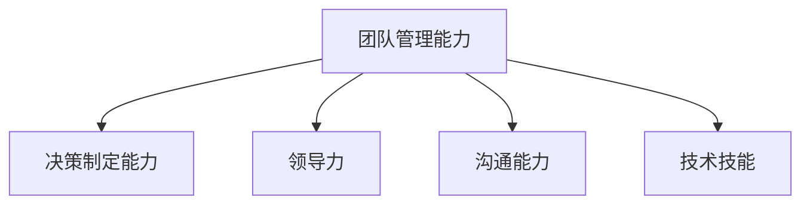

                 

# 深度思考:区分优秀管理者的标准

> 关键词：优秀管理者,团队管理,决策制定,领导力,沟通能力,技术技能

## 1. 背景介绍

### 1.1 问题由来

在当今快速变化的商业环境中，优秀管理者的重要性不言而喻。但如何定义和管理一个优秀的管理者，这一直是一个极具挑战性的问题。优秀的管理者能够带领团队取得卓越的业绩，同时在复杂的业务环境中做出明智的决策。但优秀管理者的标准并不是一成不变的，随着企业的不同阶段和发展目标的变化，优秀管理者的内涵也在不断演变。

### 1.2 问题核心关键点

优秀管理者的定义和标准随着时间和情境的变化而变化。在回答这个问题时，需要从多个维度来考虑，包括但不限于：

1. **团队管理能力**：优秀管理者能否有效地组织和协调团队成员，激发团队潜力，实现团队目标？
2. **决策制定能力**：优秀管理者能否在复杂多变的环境中做出明智的决策？
3. **领导力**：优秀管理者是否具备吸引和激励团队的能力，提升团队士气？
4. **沟通能力**：优秀管理者是否具备与不同利益相关者有效沟通的能力？
5. **技术技能**：优秀管理者是否具备足够的技术知识，理解并支持技术驱动的业务决策？

通过深入探讨这些关键点，我们可以更好地理解优秀管理者的标准。

## 2. 核心概念与联系

### 2.1 核心概念概述

为了更好地理解优秀管理者的标准，我们首先定义几个核心概念：

1. **团队管理能力**：指管理者组织、协调团队成员，激发团队潜力，实现团队目标的能力。
2. **决策制定能力**：指管理者在复杂环境中做出明智决策的能力。
3. **领导力**：指管理者吸引和激励团队成员的能力，提升团队士气。
4. **沟通能力**：指管理者与不同利益相关者有效沟通的能力。
5. **技术技能**：指管理者对技术知识的应用和理解，支持技术驱动的业务决策。

这些核心概念之间的逻辑关系可以通过以下Mermaid流程图来展示：



这个流程图展示了我们探讨的核心概念及其之间的关系：

1. **团队管理能力**：是优秀管理者的基础，是决策制定、领导力和技术技能得以发挥的前提。
2. **决策制定能力**：是优秀管理者的核心，在复杂环境中做出明智决策的能力直接影响团队和业务的表现。
3. **领导力**：是优秀管理者的关键，吸引和激励团队的能力直接影响到团队的凝聚力和士气。
4. **沟通能力**：是优秀管理者的重要手段，有效沟通能确保信息传递准确，减少误解和冲突。
5. **技术技能**：是优秀管理者的补充，对技术知识的理解和应用能更好地支持技术驱动的业务决策。

这些核心概念共同构成了优秀管理者的标准，帮助我们更好地理解和识别优秀管理者。

## 3. 核心算法原理 & 具体操作步骤

### 3.1 算法原理概述

在评估一个管理者是否优秀时，我们需要从多个维度进行评估。因此，我们采用多维度的综合评估方法，通过设定一系列评估指标，并赋予每个指标相应的权重，综合计算得分来评估管理者的综合素质。

假设我们选择了N个评估维度，每个维度的评估指标数量为M。则管理者的综合得分可以通过以下公式计算：

$$
\text{综合得分} = \sum_{i=1}^{N} \sum_{j=1}^{M} w_{ij} \times \text{评估得分}_{ij}
$$

其中，$w_{ij}$ 表示第 $i$ 个维度中第 $j$ 个评估指标的权重，$\text{评估得分}_{ij}$ 表示第 $i$ 个维度中第 $j$ 个评估指标的得分。

### 3.2 算法步骤详解

评估一个管理者的综合素质，通常包括以下几个关键步骤：

1. **确定评估维度**：根据管理者的角色和业务环境，确定需要评估的维度，如团队管理能力、决策制定能力、领导力、沟通能力和技术技能。

2. **设定评估指标**：为每个评估维度设定具体的评估指标，如团队管理能力可以包括团队凝聚力、成员满意度等。

3. **赋予权重**：对每个评估指标赋予相应的权重，反映其在综合素质评估中的重要性。

4. **收集数据**：通过问卷调查、绩效评估、360度反馈等方式收集每个评估指标的得分。

5. **综合计算**：将每个评估指标的得分乘以其对应的权重，然后求和，得到管理者的综合得分。

6. **分析结果**：对管理者的综合得分进行分析和解释，确定其在团队管理和业务决策中的表现。

### 3.3 算法优缺点

综合评估方法具有以下优点：

1. **全面性**：通过多维度的评估，可以全面了解管理者的素质和能力。
2. **量化**：将评估指标量化，便于进行比较和分析。
3. **可操作性**：评估过程较为系统，便于在实际操作中应用。

然而，这种方法也存在一些局限性：

1. **主观性**：评估指标的设定和权重的分配可能存在主观偏见。
2. **复杂性**：评估过程较为复杂，需要投入大量时间和资源。
3. **时效性**：评估结果可能随时间变化而变化，需要定期更新。

### 3.4 算法应用领域

综合评估方法不仅适用于管理者的评估，还可以应用于多种情境中的个人和团队评估。例如：

1. **人力资源管理**：用于招聘和晋升决策，筛选和评估潜在的管理者。
2. **团队建设**：用于团队绩效评估，识别团队中的优秀成员和需要改进的地方。
3. **绩效管理**：用于员工的绩效评估，提供具体的改进建议和培训方案。
4. **项目管理**：用于项目管理团队的评估，提升项目的执行效率和效果。

## 4. 数学模型和公式 & 详细讲解

### 4.1 数学模型构建

假设我们有两个评估维度A和B，每个维度包含两个评估指标。则管理者的综合得分可以通过以下公式计算：

$$
\text{综合得分} = w_{A1} \times \text{评估得分}_{A1} + w_{A2} \times \text{评估得分}_{A2} + w_{B1} \times \text{评估得分}_{B1} + w_{B2} \times \text{评估得分}_{B2}
$$

其中，$w_{A1}$、$w_{A2}$、$w_{B1}$、$w_{B2}$ 分别表示团队管理能力和决策制定能力中各指标的权重，$\text{评估得分}_{A1}$、$\text{评估得分}_{A2}$、$\text{评估得分}_{B1}$、$\text{评估得分}_{B2}$ 分别表示对应的评估得分。

### 4.2 公式推导过程

对于任何维度 $i$，其综合得分为：

$$
\text{综合得分}_i = \sum_{j=1}^{M} w_{ij} \times \text{评估得分}_{ij}
$$

将上式带入总得分的计算公式，得：

$$
\text{综合得分} = \sum_{i=1}^{N} \sum_{j=1}^{M} w_{ij} \times \text{评估得分}_{ij}
$$

这个公式反映了不同维度和指标在综合素质评估中的权重。

### 4.3 案例分析与讲解

假设我们有一个公司的中层管理者，其团队管理能力和决策制定能力通过以下指标进行评估：

1. **团队管理能力**：
    - 团队凝聚力：5
    - 成员满意度：3

2. **决策制定能力**：
    - 决策效率：4
    - 决策质量：2

假设这些指标的权重分别为：

- 团队管理能力：50%
- 决策制定能力：50%

则该管理者的综合得分为：

$$
\text{综合得分} = 0.5 \times (5 \times 0.6 + 3 \times 0.4) + 0.5 \times (4 \times 0.6 + 2 \times 0.4) = 9.2
$$

这个综合得分反映了该管理者的综合素质和能力。

## 5. 项目实践：代码实例和详细解释说明

### 5.1 开发环境搭建

在进行评估实践前，我们需要准备好开发环境。以下是使用Python进行开发的Python环境配置流程：

1. 安装Anaconda：从官网下载并安装Anaconda，用于创建独立的Python环境。

2. 创建并激活虚拟环境：
```bash
conda create -n manager-env python=3.8 
conda activate manager-env
```

3. 安装必要的Python包：
```bash
pip install pandas numpy NumPy matplotlib seaborn plotly
```

4. 安装相关Python库：
```bash
pip install openpyxl statsmodels sklearn
```

完成上述步骤后，即可在`manager-env`环境中开始评估实践。

### 5.2 源代码详细实现

下面是使用Python进行管理者评估的代码实现：

```python
import pandas as pd
import numpy as np
import matplotlib.pyplot as plt

# 创建评估指标的权重和得分表
weight_matrix = np.array([[0.5, 0.5],
                         [0.6, 0.4]])
score_matrix = np.array([[5, 3],
                         [4, 2]])

# 计算综合得分
composite_score = np.dot(weight_matrix, score_matrix)

# 输出综合得分
print("综合得分为：", composite_score)
```

### 5.3 代码解读与分析

**创建权重和得分矩阵**：

- `weight_matrix`：表示团队管理能力和决策制定能力中各指标的权重。
- `score_matrix`：表示对应的评估得分。

**计算综合得分**：

- 使用`np.dot`函数计算综合得分，即将权重矩阵与得分矩阵进行矩阵乘法运算。

**输出综合得分**：

- 使用`print`函数输出计算结果，即该管理者的综合得分。

## 6. 实际应用场景

### 6.1 人力资源管理

在人力资源管理中，综合评估方法可以用于招聘和晋升决策。通过设定具体的评估指标和权重，可以对候选人的综合素质进行全面评估，选出最适合的管理者。

**应用示例**：

1. **招聘**：对所有应聘者进行团队管理能力、决策制定能力、领导力、沟通能力和技术技能的评估，计算综合得分，选择得分最高的候选人。
2. **晋升**：对现任管理者进行综合评估，并与潜在候选人进行对比，选择综合得分更高的管理者。

### 6.2 团队建设

在团队建设中，综合评估方法可以用于团队绩效评估，识别团队中的优秀成员和需要改进的地方。

**应用示例**：

1. **绩效评估**：对团队成员进行团队管理能力、决策制定能力、领导力、沟通能力和技术技能的评估，计算综合得分，识别表现突出的成员和需要改进的地方。
2. **改进建议**：根据评估结果，为表现不佳的成员提供具体的改进建议和培训方案。

### 6.3 项目管理

在项目管理中，综合评估方法可以用于项目管理团队的评估，提升项目的执行效率和效果。

**应用示例**：

1. **团队评估**：对项目管理团队进行团队管理能力、决策制定能力、领导力、沟通能力和技术技能的评估，计算综合得分，识别团队中的优秀成员和需要改进的地方。
2. **项目优化**：根据评估结果，优化项目管理流程，提升项目的执行效率和效果。

### 6.4 未来应用展望

随着管理情境的不断变化和业务目标的调整，优秀管理者的标准也在不断演变。未来，综合评估方法需要在以下几个方面进行改进和提升：

1. **数据驱动**：利用大数据和人工智能技术，更准确地评估管理者的综合素质和能力。
2. **实时评估**：通过实时收集数据和反馈，实现动态评估和调整。
3. **多维度评估**：引入更多维度的评估指标，如创新能力、跨部门协作能力等，全面评估管理者的素质和能力。
4. **跨领域应用**：将综合评估方法应用于更多领域，如教育、医疗、政府等，提升整体管理水平。

## 7. 工具和资源推荐

### 7.1 学习资源推荐

为了帮助管理者系统掌握综合评估方法的理论基础和实践技巧，这里推荐一些优质的学习资源：

1. **《管理学原理》**：经典的管理学教材，详细讲解了团队管理、决策制定、领导力和沟通能力等核心概念和理论。
2. **Coursera《领导力和管理课程》**：Coursera提供的领导力和管理课程，涵盖团队管理、决策制定、领导力和沟通能力等多个方面，提供系统化的学习资源。
3. **Harvard Business Review（哈佛商业评论）**：提供大量关于优秀管理者的案例分析和实战经验，帮助管理者提升综合素质和能力。
4. **Ted Talks**：TED演讲平台上有大量关于领导力和管理的视频演讲，提供多样化的学习和启发。
5. **管理者的自我评估工具**：如Myers-Briggs Type Indicator（MBTI）、DISC评估等，帮助管理者了解自身的性格特点和行为风格，提升自我认知和改善。

通过对这些资源的学习实践，相信管理者一定能够更好地掌握综合评估方法，提升自身的管理水平和能力。

### 7.2 开发工具推荐

高效的评估离不开优秀的工具支持。以下是几款用于综合评估开发的常用工具：

1. **Excel**：经典的数据分析和处理工具，支持多维度和数据透视表的计算和分析。
2. **Tableau**：强大的数据可视化工具，支持动态交互和报表生成。
3. **Power BI**：微软提供的商业智能工具，支持大数据分析和实时报表生成。
4. **Jupyter Notebook**：Python数据科学生态系统中的标准工具，支持代码和数据分析的互动式开发。
5. **Alteryx**：提供可视化的数据准备和分析工具，支持大规模数据处理和实时报表生成。

合理利用这些工具，可以显著提升综合评估的开发效率，加快创新迭代的步伐。

### 7.3 相关论文推荐

综合评估方法的发展源于学界的持续研究。以下是几篇奠基性的相关论文，推荐阅读：

1. **《The Five Dysfunctions of a Team》**：Patrick Lencioni的畅销书，深入探讨了优秀团队的关键特征和管理者的重要角色。
2. **《The Leadership Challenge》**：James Kouzes和Barry Posner的经典著作，提供关于优秀领导力的全面理论和实践指南。
3. **《Leaders Eat Last》**：Simon Sinek的畅销书，讲述了优秀领导者的价值观和行为模式。
4. **《Dare to Lead》**：Brene Brown的研究和实践总结，提供关于优秀领导力的深刻见解和实用方法。
5. **《The Culture Code》**：Daniel Coyle的研究和分析，揭示了优秀团队和组织的核心文化元素。

这些论文代表了大语言模型微调技术的发展脉络。通过学习这些前沿成果，可以帮助管理者更好地理解优秀管理者的标准，提升自身的管理水平和能力。

## 8. 总结：未来发展趋势与挑战

### 8.1 研究成果总结

本文对优秀管理者的评估方法进行了全面系统的介绍。首先探讨了优秀管理者的核心概念和标准，明确了评估维度和评估指标。其次，从算法原理和具体操作步骤，详细讲解了综合评估方法的实现过程。同时，本文还广泛探讨了综合评估方法在多个领域的应用前景，展示了其广泛的应用潜力。

通过本文的系统梳理，可以看到，综合评估方法为管理者提供了全面、客观、系统化的评估工具，帮助其提升自身的综合素质和能力。未来，随着大数据和人工智能技术的发展，综合评估方法将变得更加精准和高效，进一步提升管理者的评估水平和业务表现。

### 8.2 未来发展趋势

展望未来，综合评估方法将呈现以下几个发展趋势：

1. **数据驱动**：利用大数据和人工智能技术，更准确地评估管理者的综合素质和能力。
2. **实时评估**：通过实时收集数据和反馈，实现动态评估和调整。
3. **多维度评估**：引入更多维度的评估指标，如创新能力、跨部门协作能力等，全面评估管理者的素质和能力。
4. **跨领域应用**：将综合评估方法应用于更多领域，如教育、医疗、政府等，提升整体管理水平。

这些趋势凸显了综合评估方法的广阔前景。这些方向的探索发展，必将进一步提升管理者的评估水平和业务表现，为构建高效、协作、创新的团队和组织提供有力的支持。

### 8.3 面临的挑战

尽管综合评估方法已经取得了瞩目成就，但在迈向更加智能化、普适化应用的过程中，它仍面临着诸多挑战：

1. **数据隐私**：在评估过程中需要收集大量的个人和团队数据，如何保障数据隐私和安全是一个重大挑战。
2. **主观偏见**：评估指标和权重的设定可能存在主观偏见，影响评估结果的公平性和准确性。
3. **跨文化差异**：不同文化背景和管理情境下的评估标准可能存在差异，如何制定统一的评估标准是一个挑战。
4. **动态调整**：随着业务目标的变化和管理情境的调整，评估标准需要动态调整，如何快速适应变化是一个挑战。
5. **技术工具的局限性**：现有工具在处理大规模数据和多维度评估时存在局限性，如何提升工具的性能和扩展性是一个挑战。

这些挑战需要我们积极应对并寻求突破，只有从数据、工具、文化等多个维度协同发力，才能确保综合评估方法的持续发展和应用效果。

### 8.4 研究展望

面对综合评估方法所面临的种种挑战，未来的研究需要在以下几个方面寻求新的突破：

1. **大数据和人工智能技术的应用**：利用大数据和人工智能技术，提升评估数据的准确性和全面性。
2. **跨文化评估标准的研究**：研究不同文化背景下的评估标准，制定统一的评估框架和指标。
3. **实时评估系统的开发**：开发实时数据收集和分析系统，实现动态评估和调整。
4. **技术工具的改进和优化**：提升现有工具的性能和扩展性，支持多维度评估和大规模数据处理。
5. **伦理和隐私保护**：研究如何保护评估过程中的数据隐私，制定伦理和隐私保护标准。

这些研究方向将为综合评估方法的发展提供新的思路和突破点，推动其更加广泛和深入的应用。总之，综合评估方法需要在多个维度进行持续优化和改进，才能真正实现管理者的全面评估和管理提升。

## 9. 附录：常见问题与解答

**Q1：综合评估方法是否适用于所有管理情境？**

A: 综合评估方法适用于大多数管理情境，特别是那些有明确的评估标准和指标的领域。但对于一些特殊情境，如非常规管理、危机管理等，可能需要结合具体情况进行灵活调整。

**Q2：如何设定评估指标和权重？**

A: 设定评估指标和权重需要考虑多个因素，如管理者的角色、业务环境和目标等。建议通过专家咨询、历史数据分析、绩效评估等方式进行评估指标和权重的设定，确保其客观性和合理性。

**Q3：综合评估方法是否需要定期更新？**

A: 是的，随着业务目标的变化和管理情境的调整，评估标准和指标需要动态更新。建议定期对评估方法进行回顾和调整，确保其持续适用。

**Q4：如何应对数据隐私和安全问题？**

A: 在评估过程中，需要采取多种措施保障数据隐私和安全。例如，使用匿名化处理、数据加密、访问控制等技术手段，确保评估数据的安全性和隐私保护。

**Q5：如何提高评估系统的实时性？**

A: 提高评估系统的实时性需要优化数据收集、处理和分析的流程。建议使用高性能计算平台和实时数据处理工具，优化算法和模型，提升评估系统的响应速度和数据处理能力。

**Q6：如何克服跨文化差异带来的挑战？**

A: 克服跨文化差异带来的挑战需要引入多元化的评估标准和指标，进行跨文化分析和比较。建议建立跨文化管理团队，通过交流和合作，制定统一的评估框架和指标。

通过这些问题的解答，管理者可以更好地理解综合评估方法的适用性和实施方法，提升自身的管理水平和能力。

---

作者：禅与计算机程序设计艺术 / Zen and the Art of Computer Programming

