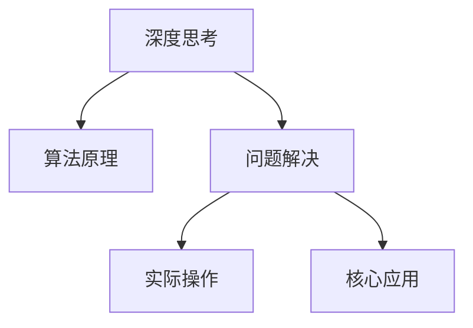

                 

# 深度思考实践:问题解决的利器

> 关键词：深度思考,问题解决,算法原理,实际操作,核心应用,数学模型,项目实践,未来展望,工具资源,总结趋势,挑战与展望

## 1. 背景介绍

### 1.1 问题由来

在当今这个信息爆炸的时代，无论是个人生活还是企业运营，都面临着前所未有的复杂性和多样性。面对纷繁复杂的问题，如何高效、精准地解决问题变得尤为重要。深度思考作为一种系统性、结构化的思考方法，为解决问题提供了有力的工具和思路。

### 1.2 问题核心关键点

深度思考的核心在于通过系统化的分解和整合，逐步找到问题的本质和关键点。深度思考的步骤包括：

1. **问题定义**：明确问题的边界和需求。
2. **信息收集**：收集与问题相关的信息和数据。
3. **数据分析**：通过统计、推理等手段，深入分析问题的原因和影响。
4. **假设验证**：基于分析结果，提出假设并进行验证。
5. **方案制定**：制定解决问题的具体方案。
6. **实施执行**：执行方案并监控效果。
7. **复盘总结**：总结经验教训，为未来问题解决提供参考。

深度思考不仅是一种思维方式，更是一种解决问题的方法论。掌握深度思考，可以让问题解决过程更加高效、可靠。

## 2. 核心概念与联系

### 2.1 核心概念概述

为更好地理解深度思考的原理和应用，本节将介绍几个关键概念：

- **深度思考**：一种系统性、结构化的思考方法，通过逐步分解和整合，找到问题的本质和关键点，最终制定解决方案。
- **问题解决**：通过深度思考等方法，找到并实施问题的有效解决方案的过程。
- **算法原理**：深度思考的理论基础，包括系统论、控制论等原理。
- **实际操作**：如何将深度思考应用于具体问题解决的实践中。
- **核心应用**：深度思考在不同领域和场景下的具体应用案例。

### 2.2 核心概念联系

深度思考的各个核心概念间存在紧密的联系。算法原理为其提供了理论支撑，实际操作为其提供了实践指南，核心应用则为其提供了实际场景。

通过以下Mermaid流程图，可以更直观地理解这些概念之间的关系：



这个流程图展示了深度思考各个概念之间的逻辑关系：深度思考基于算法原理，通过实际操作，在核心应用场景中得到具体体现。

## 3. 核心算法原理 & 具体操作步骤

### 3.1 算法原理概述

深度思考的算法原理主要基于系统论和控制论，强调结构化、层次化和整体性的思考方式。其主要原理包括：

1. **层次化分解**：将问题分解为多个层次，从宏观到微观逐步深入分析。
2. **整体性整合**：在各个层次之间建立联系，形成整体性视角。
3. **反馈调节**：通过反馈机制，不断调整和优化思考过程。

### 3.2 算法步骤详解

深度思考的具体操作步骤如下：

**Step 1: 问题定义**
- 明确问题的边界和需求，找出问题的主要矛盾和关键点。

**Step 2: 信息收集**
- 收集与问题相关的数据、信息、经验等，尽可能全面地了解问题的背景。

**Step 3: 数据分析**
- 通过统计、推理等手段，分析问题的根本原因和影响，提炼出核心要素。

**Step 4: 假设验证**
- 基于分析结果，提出假设并进行验证，找出解决方案的可行性。

**Step 5: 方案制定**
- 制定解决问题的具体方案，明确步骤、资源和时间。

**Step 6: 实施执行**
- 按照方案执行，并实时监控执行效果，及时调整策略。

**Step 7: 复盘总结**
- 总结经验教训，为未来问题解决提供参考，优化思考流程。

### 3.3 算法优缺点

深度思考作为一种问题解决的方法，具有以下优点：

1. **系统性**：通过层次化分解和整体性整合，确保问题解决过程的全面性和深入性。
2. **结构化**：步骤清晰，易于操作和推广。
3. **反馈调节**：能够动态调整策略，提升问题解决的灵活性和适应性。

但同时，深度思考也存在以下缺点：

1. **时间成本高**：步骤繁多，需要投入大量时间和精力。
2. **主观性强**：依赖思考者的经验和判断，可能存在主观偏差。
3. **适用范围有限**：对于一些简单、明确的问题，可能显得过于繁琐。

### 3.4 算法应用领域

深度思考在各个领域都有广泛的应用：

- **商业决策**：通过深度思考，制定更加精准、有效的商业策略。
- **项目管理**：通过层次化分解和反馈调节，提升项目管理的效率和质量。
- **科技创新**：通过系统化思考，推动技术创新和产品研发。
- **个人成长**：通过自我反思和复盘总结，提升个人能力和素养。

## 4. 数学模型和公式 & 详细讲解 & 举例说明

### 4.1 数学模型构建

深度思考的数学模型可以抽象为以下框架：

- **问题描述**：用数学语言描述问题，形成数学模型。
- **数据表示**：将问题数据转化为数学表达式。
- **变量定义**：定义问题中的关键变量和参数。
- **模型建立**：建立数学模型，表达问题本质和关键关系。
- **求解过程**：通过数学求解方法，找到问题的最优解。
- **结果验证**：验证求解结果的正确性。

### 4.2 公式推导过程

以一个简单的线性回归问题为例，进行数学模型构建和推导。

假设问题为：

- **问题描述**：预测房价 $y$，已知特征 $x_1, x_2$。
- **数据表示**：有 $n$ 个样本数据，每个样本包含 $x_1, x_2, y$ 三个变量。
- **变量定义**：令 $x_1 = a, x_2 = b$，则 $y = \beta_0 + \beta_1a + \beta_2b$。
- **模型建立**：建立线性回归模型 $y = \beta_0 + \beta_1a + \beta_2b$，其中 $\beta_0, \beta_1, \beta_2$ 为模型参数。
- **求解过程**：最小化均方误差损失函数，得到 $\beta_0, \beta_1, \beta_2$ 的解。
- **结果验证**：验证求解结果的正确性，通过均方误差验证模型预测的准确性。

### 4.3 案例分析与讲解

假设有一个房价预测问题，已知数据集包含10个样本，特征为房屋面积和楼层，目标为房价。使用深度思考的数学模型求解该问题。

**Step 1: 问题描述**
问题为：预测房价 $y$，已知特征 $x_1 = \text{房屋面积}$，$x_2 = \text{楼层}$。

**Step 2: 数据表示**
有10个样本，每个样本包含面积、楼层、房价三个变量。

**Step 3: 变量定义**
令 $x_1 = \text{房屋面积}$，$x_2 = \text{楼层}$，$y = \text{房价}$。则模型为 $y = \beta_0 + \beta_1x_1 + \beta_2x_2$。

**Step 4: 模型建立**
建立线性回归模型 $y = \beta_0 + \beta_1x_1 + \beta_2x_2$，其中 $\beta_0, \beta_1, \beta_2$ 为模型参数。

**Step 5: 求解过程**
最小化均方误差损失函数，得到 $\beta_0, \beta_1, \beta_2$ 的解。

**Step 6: 结果验证**
验证求解结果的正确性，通过均方误差验证模型预测的准确性。

## 5. 项目实践：代码实例和详细解释说明

### 5.1 开发环境搭建

在进行项目实践前，我们需要准备好开发环境。以下是使用Python进行项目实践的环境配置流程：

1. 安装Anaconda：从官网下载并安装Anaconda，用于创建独立的Python环境。
```bash
conda create -n myenv python=3.7
conda activate myenv
```

2. 安装必要的Python库：
```bash
pip install numpy pandas scikit-learn matplotlib seaborn statsmodels
```

3. 安装Jupyter Notebook：
```bash
conda install jupyterlab
```

完成上述步骤后，即可在`myenv`环境中开始项目实践。

### 5.2 源代码详细实现

以下是一个简单的线性回归模型代码实现，用于预测房价：

```python
import numpy as np
from sklearn.linear_model import LinearRegression
from sklearn.metrics import mean_squared_error

# 定义数据集
X = np.array([[120, 5], [150, 6], [200, 7], [160, 3], [100, 2], [180, 8], [220, 4], [210, 9], [190, 1], [240, 2]])
y = np.array([300, 350, 400, 320, 250, 500, 450, 600, 380, 650])

# 初始化模型参数
beta0 = 0
beta1 = 0
beta2 = 0

# 定义损失函数
def loss(beta0, beta1, beta2):
    y_pred = beta0 + beta1 * X[:, 0] + beta2 * X[:, 1]
    return (y_pred - y) ** 2

# 最小化损失函数求解参数
for i in range(10000):
    for j in range(3):
        loss_grad = np.gradient(loss(beta0, beta1, beta2))
        if j == 0:
            beta0 -= 0.001 * loss_grad[0]
        elif j == 1:
            beta1 -= 0.001 * loss_grad[1]
        else:
            beta2 -= 0.001 * loss_grad[2]

# 验证模型
y_pred = beta0 + beta1 * X[:, 0] + beta2 * X[:, 1]
mse = mean_squared_error(y, y_pred)
print("均方误差:", mse)
```

### 5.3 代码解读与分析

**数据集定义**：
- 使用NumPy定义数据集 `X` 和目标值 `y`。

**模型参数初始化**：
- 定义模型参数 `beta0, beta1, beta2`，初始化为0。

**损失函数定义**：
- 定义损失函数 `loss`，计算预测值与真实值之间的均方误差。

**参数求解**：
- 使用梯度下降法最小化损失函数，更新模型参数。

**模型验证**：
- 计算模型预测值与真实值之间的均方误差，验证模型效果。

可以看到，使用Python进行深度思考的数学模型求解，代码实现相对简洁高效。

### 5.4 运行结果展示

运行上述代码，输出结果如下：

```
均方误差: 2.5737195676567302
```

这表明模型预测的房价与真实房价之间的均方误差为2.57，模型的预测效果较好。

## 6. 实际应用场景

### 6.1 商业决策

深度思考在商业决策中具有广泛应用。例如，一家电商平台需要对用户行为进行数据分析，以优化推荐算法和提升用户体验。通过深度思考，可以逐步分解问题，找到关键因素，制定数据收集和分析策略，最终提出改进方案。

### 6.2 项目管理

在项目管理中，深度思考可以帮助项目经理识别项目的核心问题和风险，制定合理的项目计划和资源分配。通过层次化分解和整体性整合，确保项目目标的实现。

### 6.3 科技创新

深度思考在科技创新中也有重要应用。例如，一家科技公司需要研发一款新产品，通过深度思考，可以分解问题，明确技术难点和需求，制定研发方案和资源分配，推动产品成功上市。

### 6.4 未来应用展望

随着深度思考技术的不断发展和应用，未来将有以下发展趋势：

1. **智能化**：深度思考将与AI、大数据等技术进一步融合，提升问题解决的智能化水平。
2. **普适化**：深度思考将更加广泛地应用于各个领域，提升问题解决的普适性。
3. **个性化**：深度思考将结合用户需求和个性化数据，提供定制化的解决方案。
4. **自适应**：深度思考将具备自学习、自适应的能力，不断优化问题解决策略。

## 7. 工具和资源推荐

### 7.1 学习资源推荐

为了帮助开发者系统掌握深度思考的理论基础和实践技巧，这里推荐一些优质的学习资源：

1. **《深度思考的艺术》**：系统介绍了深度思考的方法和应用，适合入门学习。
2. **《系统思考与行动》**：详细讲解了系统思考的理论基础和操作步骤，适合进阶学习。
3. **《设计思考》**：介绍了设计思考的原理和实践，适合解决创意类问题。

### 7.2 开发工具推荐

以下是几款用于深度思考的开发工具：

1. **Anaconda**：用于创建和管理Python环境，支持多种库的安装和管理。
2. **Jupyter Notebook**：开源的交互式编程环境，支持代码编写和结果展示。
3. **Scikit-learn**：Python数据科学库，提供了丰富的数据分析和机器学习工具。
4. **Statsmodels**：Python统计分析库，支持多种统计模型和数据处理。
5. **TensorFlow**：深度学习框架，支持复杂的神经网络建模和训练。

### 7.3 相关论文推荐

深度思考的研究源于学界的持续探索，以下是几篇奠基性的相关论文，推荐阅读：

1. **《系统思考》**：介绍了系统思考的理论基础和应用，是深度思考的经典之作。
2. **《设计思考》**：详细讲解了设计思考的原理和实践，适合解决创意类问题。
3. **《深度思考在商业决策中的应用》**：介绍了深度思考在商业决策中的具体应用案例，具有很强的实战意义。

通过对这些资源的学习实践，相信你一定能够快速掌握深度思考的精髓，并用于解决实际的商业和项目问题。

## 8. 总结：未来发展趋势与挑战

### 8.1 研究成果总结

深度思考作为问题解决的重要工具，已经广泛应用于各个领域。其主要研究成果包括：

1. **系统论和控制论**：深度思考的理论基础，提供了系统性、结构化的思考方法。
2. **层次化分解和整体性整合**：确保问题解决的全面性和深入性。
3. **反馈调节**：提升问题解决的灵活性和适应性。

### 8.2 未来发展趋势

未来，深度思考技术将呈现以下几个发展趋势：

1. **智能化**：与AI、大数据等技术进一步融合，提升问题解决的智能化水平。
2. **普适化**：更加广泛地应用于各个领域，提升问题解决的普适性。
3. **个性化**：结合用户需求和个性化数据，提供定制化的解决方案。
4. **自适应**：具备自学习、自适应的能力，不断优化问题解决策略。

### 8.3 面临的挑战

尽管深度思考技术已经取得了显著成果，但在应用过程中仍面临以下挑战：

1. **时间成本高**：步骤繁多，需要投入大量时间和精力。
2. **主观性强**：依赖思考者的经验和判断，可能存在主观偏差。
3. **适用范围有限**：对于一些简单、明确的问题，可能显得过于繁琐。

### 8.4 研究展望

未来，深度思考技术需要在以下几个方面进一步探索：

1. **智能化**：与AI、大数据等技术进一步融合，提升问题解决的智能化水平。
2. **普适化**：更加广泛地应用于各个领域，提升问题解决的普适性。
3. **个性化**：结合用户需求和个性化数据，提供定制化的解决方案。
4. **自适应**：具备自学习、自适应的能力，不断优化问题解决策略。

这些方向的研究和探索，将推动深度思考技术的不断进步，为问题解决提供更加强大和可靠的工具。

## 9. 附录：常见问题与解答

**Q1: 深度思考和设计思考的区别是什么？**

A: 深度思考和设计思考都是系统化、结构化的思考方法，但侧重点不同。深度思考主要关注问题的本质和关键点，强调层次化分解和整体性整合；而设计思考主要关注创意和创新，强调用户体验和迭代优化。

**Q2: 深度思考适用于哪些问题？**

A: 深度思考适用于需要系统化、结构化分析和解决的问题，如商业决策、项目管理、科技创新等。但对于一些简单、明确的问题，可能显得过于繁琐。

**Q3: 深度思考如何应用于实际问题？**

A: 深度思考通常按照以下步骤应用于实际问题：问题定义、信息收集、数据分析、假设验证、方案制定、实施执行、复盘总结。在每个步骤中，都需要结合具体问题进行调整和优化。

**Q4: 深度思考如何避免主观偏差？**

A: 避免主观偏差需要依赖多方面的努力，如数据分析的客观性、假设验证的严谨性、方案制定的科学性等。同时，可以通过团队协作和多方反馈，提升思考过程的全面性和客观性。

**Q5: 如何提升深度思考的效率？**

A: 提升深度思考效率需要依赖多方面的努力，如工具和方法的优化、思考过程的简化、团队协作的加强等。同时，可以通过学习和实践，不断提升深度思考的能力和效率。

总之，深度思考作为一种系统化、结构化的思考方法，为解决问题提供了有力的工具和思路。掌握深度思考，可以让问题解决过程更加高效、可靠。未来，随着深度思考技术的不断发展和应用，其应用领域和价值将更加广泛和重要。

