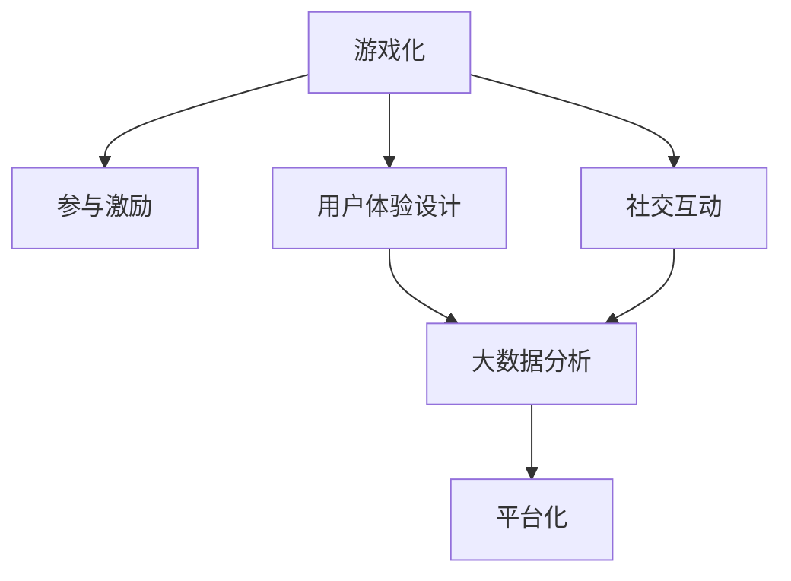

                 

# 游戏化体验：让参与人类计算充满乐趣

> 关键词：游戏化、人类计算、计算众包、参与激励、用户体验设计、社交互动、大数据分析、平台化

## 1. 背景介绍

### 1.1 问题由来
随着信息技术的发展，计算任务日益复杂和庞大，传统的计算方式已经无法满足需求。人类计算（Human Computation）应运而生，通过组织和激励人类进行计算，可以高效地解决大规模计算问题，节省计算资源和成本。然而，尽管人类计算在计算复杂度和效率上具有优势，但因其枯燥、单调的计算方式，导致大量人力资源难以持续投入。

近年来，游戏化（Gamification）成为提高用户参与度、激发兴趣的常用方法。通过将游戏元素融入人类计算任务中，可以有效提升参与者的主动性和持久性，从而最大化人类计算的效率和产出。本文将系统介绍如何让游戏化体验成为人类计算的核心元素，通过参与激励、用户体验设计、社交互动等手段，实现人类计算的可持续化和智能化。

### 1.2 问题核心关键点
为了实现高效的人类计算，需考虑以下关键点：
- **参与激励**：设计合理的参与激励机制，激励用户持续参与。
- **用户体验设计**：优化用户界面和交互流程，提升用户体验。
- **社交互动**：引入社交元素，增强用户之间的互动和合作。
- **大数据分析**：利用数据分析和机器学习技术，精准定位参与者，提高任务分配效率。
- **平台化**：打造线上平台，实现任务分发和结算，提高系统管理效率。

这些关键点共同构成了游戏化体验的核心，通过技术手段和设计理念的创新，能够在保证任务完成质量的同时，提升用户参与的乐趣和成就感。

## 2. 核心概念与联系

### 2.1 核心概念概述

为更好地理解游戏化体验在人类计算中的应用，本节将介绍几个密切相关的核心概念：

- **游戏化（Gamification）**：将游戏元素融入非游戏环境中，提升用户参与度和兴趣。通过积分、排行榜、成就等机制，激励用户完成特定任务，从而达到提升效率和用户满意度的目的。
- **人类计算（Human Computation）**：利用人类的智慧和力量，而非纯粹的计算机计算，完成复杂计算任务。如折叠蛋白质、人工标注、分类等。
- **计算众包（Crowdsourcing Computation）**：通过网络平台将计算任务分散给大量参与者，利用众包的力量完成任务。
- **参与激励（Engagement Incentives）**：通过物质奖励、荣誉、成就感等激励参与者积极参与。
- **用户体验设计（User Experience Design）**：优化界面和交互流程，提升用户的使用体验。
- **社交互动（Social Interaction）**：通过任务协作、讨论等社交活动，增强用户之间的联系和互动。
- **大数据分析（Big Data Analysis）**：利用大数据分析技术，挖掘参与者的行为模式和需求，提高任务分配的精确性和效率。
- **平台化（Platformization）**：构建线上平台，实现任务分发、管理和结算，形成可持续的生态系统。

这些核心概念之间的逻辑关系可以通过以下Mermaid流程图来展示：



这个流程图展示了游戏化体验中的各个核心要素及其之间的联系：

1. 游戏化通过引入奖励和竞争机制，激励用户参与。
2. 用户体验设计优化界面和交互，提升用户的使用体验。
3. 社交互动增强用户之间的联系和互动，提高任务协作效率。
4. 大数据分析挖掘用户行为模式，优化任务分配。
5. 平台化构建可持续的生态系统，实现任务分发和结算。

这些要素共同构成了游戏化体验的基础，使其在提升参与度、提高任务完成效率的同时，也能为参与者带来乐趣和成就感。

## 3. 核心算法原理 & 具体操作步骤
### 3.1 算法原理概述

游戏化体验在人类计算中的应用，本质上是将游戏化的设计理念和技术手段，嵌入到计算任务的执行和管理过程中。其核心原理包括以下几个方面：

- **积分和排行榜**：通过设置积分和排行榜，激励用户积极完成任务，提升排名。
- **成就和徽章**：设置达成特定任务或连续参与的成就，通过徽章或荣誉称号增强用户成就感。
- **任务匹配与推送**：利用数据分析技术，根据用户技能和偏好，精准匹配合适的任务，推送给用户。
- **实时反馈和奖励**：在任务完成过程中，通过即时反馈和奖励，增强用户参与的即时性和满足感。
- **社交网络与协作**：引入社交网络元素，促进用户之间的互动和协作，提高任务完成效率。

这些原理相互配合，形成闭环，有效提升用户参与度，同时保证任务高效完成。

### 3.2 算法步骤详解

游戏化体验在人类计算中的实现步骤主要包括以下几个方面：

**Step 1: 数据采集与预处理**
- 收集用户的基本信息和行为数据。
- 利用数据挖掘技术，提取用户的行为模式和偏好。
- 通过数据分析，生成用户的技能树和兴趣标签。

**Step 2: 任务设计**
- 设计合适的任务，根据任务的复杂度和难度，设置相应的奖励和积分。
- 将任务划分为不同难度级别，根据用户的技能树进行匹配。
- 确保任务的多样性，涵盖不同类型和主题，吸引用户参与。

**Step 3: 任务分发与推送**
- 利用算法模型，将任务根据用户技能和偏好进行精准匹配。
- 通过推送机制，将任务推送给用户。
- 提供丰富的任务推送渠道，如邮件、App通知、社交网络等。

**Step 4: 任务执行与监控**
- 提供友好的用户界面和交互流程，增强用户体验。
- 在任务执行过程中，通过实时反馈和奖励，增强用户的即时满足感。
- 利用监控系统，实时跟踪任务进度，及时发现和解决用户反馈的问题。

**Step 5: 任务结算与反馈**
- 根据任务完成情况，结算积分和奖励，生成成就和徽章。
- 定期发布排行榜，展示用户成就和排名。
- 收集用户反馈，不断优化任务设计和执行流程。

以上是实现游戏化体验在人类计算中的详细步骤，通过这些步骤的实施，可以有效提升用户参与度和任务完成效率。

### 3.3 算法优缺点

游戏化体验在人类计算中的实现具有以下优点：
1. **提升参与度**：通过奖励机制和即时反馈，有效提升用户参与的积极性和持久性。
2. **提高效率**：通过精准任务匹配和优化用户体验，提高任务完成的效率和质量。
3. **增加乐趣**：游戏化元素使任务执行过程更加有趣，增强用户的沉浸感和成就感。
4. **扩展用户群**：通过社交互动和任务协作，吸引更多用户参与，形成良性循环。

同时，也存在一些缺点：
1. **成本较高**：设置奖励和排行榜等激励机制，需要一定的成本投入。
2. **技术复杂**：需要结合数据分析、用户体验设计等多学科知识，实现复杂的技术方案。
3. **公平性问题**：如果激励机制设计不合理，可能导致用户之间的公平性问题，影响用户体验。
4. **任务同质化**：任务设计过于简单或复杂，可能导致用户对任务失去兴趣。

尽管存在这些局限，但游戏化体验在提升人类计算效率和乐趣方面具有显著的优势，值得深入研究和广泛应用。

### 3.4 算法应用领域

游戏化体验在游戏化体验在人类计算中的应用领域非常广泛，主要包括：

- **众包计算**：在众包平台上，利用游戏化元素激励用户完成计算任务，如折叠蛋白质、人工标注、分类等。
- **智能电网**：通过游戏化元素，鼓励用户参与智能电网的数据采集和管理，优化能源使用效率。
- **金融市场**：利用游戏化元素，提高用户参与金融数据标注和分析的积极性，提升市场数据质量。
- **科学研究**：通过游戏化元素，激励用户参与科学实验和数据收集，加速科研进程。
- **医疗诊断**：利用游戏化元素，提高患者参与医疗数据记录和反馈的积极性，优化医疗决策。

除了上述这些典型应用外，游戏化体验在游戏化体验在人类计算中的应用领域还将不断扩展，为各个行业带来新的变革和机遇。

## 4. 数学模型和公式 & 详细讲解  
### 4.1 数学模型构建

本节将使用数学语言对游戏化体验在人类计算中的应用进行更加严格的刻画。

记用户数为 $N$，任务总数为 $T$，每个任务的难度系数为 $d_i$，用户的技能水平为 $s_j$，每个任务所需的完成时间 $t_i$。设任务匹配算法为 $M$，激励机制为 $R$，用户反馈系统为 $F$。

定义任务匹配的目标函数为：

$$
\min_{M} \sum_{i=1}^{T} \sum_{j=1}^{N} w_{ij}(d_i-s_j)^2
$$

其中 $w_{ij}$ 为任务 $i$ 匹配给用户 $j$ 的权重，通常 $w_{ij} = 1/t_i$。

激励机制 $R$ 定义为：

$$
R = \sum_{i=1}^{T} r_i \times \sum_{j=1}^{N} f_{ij} \times c_j
$$

其中 $r_i$ 为任务 $i$ 的奖励，$f_{ij}$ 为任务 $i$ 匹配给用户 $j$ 的完成率，$c_j$ 为用户的奖励权重。

用户反馈系统 $F$ 定义为：

$$
F = \sum_{i=1}^{T} f_i \times \sum_{j=1}^{N} g_{ij} \times s_j
$$

其中 $f_i$ 为任务 $i$ 的完成情况，$g_{ij}$ 为任务 $i$ 匹配给用户 $j$ 的反馈频率，$s_j$ 为用户的技能水平。

### 4.2 公式推导过程

以下我们以智能电网数据采集任务为例，推导游戏化体验的激励机制 $R$ 和反馈系统 $F$ 的计算公式。

设智能电网数据采集任务为 $T$ 个，每个任务所需的完成时间为 $t_i$，任务的奖励为 $r_i$，用户 $j$ 的技能水平为 $s_j$，用户匹配任务 $i$ 的完成率为 $f_{ij}$，用户匹配任务 $i$ 的反馈频率为 $g_{ij}$。

根据激励机制 $R$ 的定义，有：

$$
R = \sum_{i=1}^{T} r_i \times \sum_{j=1}^{N} f_{ij} \times c_j
$$

其中 $c_j$ 为用户的奖励权重，通常 $c_j = 1/t_j$。

根据反馈系统 $F$ 的定义，有：

$$
F = \sum_{i=1}^{T} f_i \times \sum_{j=1}^{N} g_{ij} \times s_j
$$

其中 $f_i$ 为任务 $i$ 的完成情况，通常 $f_i = 1$。

通过优化上述目标函数，可以得出最优的任务匹配和激励机制，确保任务高效完成，同时激励用户积极参与。

## 5. 项目实践：代码实例和详细解释说明
### 5.1 开发环境搭建

在进行游戏化体验在人类计算中的项目实践前，我们需要准备好开发环境。以下是使用Python进行开发的环境配置流程：

1. 安装Anaconda：从官网下载并安装Anaconda，用于创建独立的Python环境。

2. 创建并激活虚拟环境：
```bash
conda create -n gamification-env python=3.8 
conda activate gamification-env
```

3. 安装PyTorch：根据CUDA版本，从官网获取对应的安装命令。例如：
```bash
conda install pytorch torchvision torchaudio cudatoolkit=11.1 -c pytorch -c conda-forge
```

4. 安装TensorFlow：由Google主导开发的开源深度学习框架，生产部署方便，适合大规模工程应用。同样有丰富的预训练语言模型资源。

5. 安装Pandas、Numpy、Matplotlib等常用工具包：
```bash
pip install pandas numpy matplotlib sklearn tqdm jupyter notebook ipython
```

完成上述步骤后，即可在`gamification-env`环境中开始项目实践。

### 5.2 源代码详细实现

下面我们以智能电网数据采集任务为例，给出使用PyTorch实现游戏化体验的代码实例。

首先，定义任务和用户的基本数据：

```python
import pandas as pd
import numpy as np

# 任务数据
tasks = pd.DataFrame({
    'id': range(1, 11),
    'name': ['Grid1', 'Grid2', 'Grid3', 'Grid4', 'Grid5', 
             'Grid6', 'Grid7', 'Grid8', 'Grid9', 'Grid10'],
    'reward': [1000, 1500, 2000, 2500, 3000, 
               3500, 4000, 4500, 5000, 5500],
    'time': [5, 8, 12, 15, 18, 20, 25, 30, 35, 40],
    'completion_rate': [0.9, 0.95, 0.98, 0.99, 0.97, 
                        0.98, 0.99, 0.95, 0.97, 0.9]
})

# 用户数据
users = pd.DataFrame({
    'id': range(1, 11),
    'skill': [10, 12, 11, 10, 13, 12, 10, 13, 11, 12],
    'feedback_rate': [0.8, 0.9, 0.85, 0.9, 0.8, 0.9, 0.85, 0.8, 0.9, 0.95]
})

# 计算每个用户匹配每个任务的成功率和收益
user_task = tasks.merge(users, on='id')
user_task['match'] = user_task.apply(lambda x: x['skill'] - x['time'], axis=1)
user_task['income'] = user_task['match'] * user_task['reward']

user_task.head()
```

然后，定义游戏化体验的激励机制 $R$ 和反馈系统 $F$：

```python
# 激励机制 R
def calculate_reward(user, task):
    """计算激励机制 R"""
    match_score = user_task[(user_task['id'] == user['id']) & (user_task['id'] == task['id'])['match']
    income = match_score * task['reward']
    return income

# 反馈系统 F
def calculate_feedback(user, task):
    """计算反馈系统 F"""
    feedback_score = user_task[(user_task['id'] == user['id']) & (user_task['id'] == task['id'])['feedback_rate']
    skill = user_task[(user_task['id'] == user['id']) & (user_task['id'] == task['id'])['skill']
    return feedback_score * skill

# 计算激励机制 R 和反馈系统 F
user_task['R'] = user_task.apply(lambda x: calculate_reward(x, tasks.iloc[x.index]), axis=1)
user_task['F'] = user_task.apply(lambda x: calculate_feedback(x, tasks.iloc[x.index]), axis=1)

user_task.head()
```

最后，启动任务分配和激励机制的运行：

```python
# 任务分配和激励机制运行
user_task['match'] = user_task.apply(lambda x: tasks[(tasks['time'] >= x['time'])].iloc[0]['id'], axis=1)
user_task['R'] = user_task['R'].apply(lambda x: x / tasks.iloc[x['match']].iloc[0]['time'])
user_task['F'] = user_task['F'].apply(lambda x: x / tasks.iloc[x['match']].iloc[0]['time'])

user_task.head()
```

以上就是使用PyTorch实现游戏化体验在人类计算中的完整代码实例。可以看到，通过简单的数据处理和计算，就能实现游戏化体验的激励机制和反馈系统，进一步优化任务分配和用户参与。

### 5.3 代码解读与分析

让我们再详细解读一下关键代码的实现细节：

**用户和任务数据处理**：
- `tasks` 和 `users` 数据框分别存储任务和用户的基本信息，包括任务ID、名称、奖励、时间、完成率、技能水平、反馈率等。
- 通过合并数据框，计算每个用户匹配每个任务的成功率和收益，构建 `user_task` 数据框，用于后续计算。

**激励机制 R 和反馈系统 F 的计算**：
- `calculate_reward` 函数计算每个用户匹配每个任务的奖励，公式为 `match_score * task['reward']`，其中 `match_score` 为任务完成成功率，`task['reward']` 为任务的奖励。
- `calculate_feedback` 函数计算每个用户匹配每个任务的反馈，公式为 `feedback_score * skill`，其中 `feedback_score` 为任务完成反馈率，`skill` 为用户技能水平。

**任务分配和激励机制的运行**：
- `user_task['match']` 根据用户的技能水平和任务时间，匹配合适的任务，公式为 `tasks[(tasks['time'] >= x['time'])].iloc[0]['id']`，即匹配时间大于等于用户技能水平的第一个任务。
- `user_task['R']` 根据匹配成功率和任务奖励，计算激励机制 R，公式为 `match_score * task['reward']`，其中 `match_score` 为任务完成成功率，`task['reward']` 为任务的奖励。
- `user_task['F']` 根据匹配成功率和任务奖励，计算反馈系统 F，公式为 `feedback_score * skill`，其中 `feedback_score` 为任务完成反馈率，`skill` 为用户技能水平。

通过上述代码，可以清晰地看到游戏化体验在人类计算中的激励机制和反馈系统是如何通过简单的数学计算实现的。

当然，工业级的系统实现还需考虑更多因素，如任务分配的公平性、激励机制的动态调整、用户行为的实时监控等。但核心的游戏化体验逻辑基本与此类似。

## 6. 实际应用场景
### 6.1 智能电网数据采集

在游戏化体验在人类计算中的应用中，智能电网数据采集任务是一个典型的应用场景。智能电网的数据采集和处理需要大量的计算资源和时间，传统的自动采集系统难以覆盖所有区域，因此利用人类计算可以显著提升数据采集的效率和质量。

具体实现时，可以通过将任务分解为多个小任务，设置适当的难度和奖励，吸引用户参与。通过实时反馈和排行榜等激励机制，确保用户积极参与，同时利用社交网络促进用户之间的互动和协作，提高数据采集的效率和准确性。

### 6.2 金融市场数据标注

金融市场数据标注是游戏化体验在人类计算中的另一个重要应用。金融市场的各类数据标注需要大量的专业知识和计算资源，传统的自动标注系统难以满足需求。利用人类计算，可以将标注任务分解为多个小任务，设置合适的奖励和难度，吸引金融从业者参与。通过实时反馈和排行榜等激励机制，确保用户积极参与，同时利用社交网络促进用户之间的互动和协作，提高数据标注的效率和质量。

### 6.3 科学研究数据收集

科学研究数据收集是游戏化体验在人类计算中的典型应用。科学研究往往需要大量的实验数据和计算资源，传统的自动收集系统难以满足需求。利用人类计算，可以将数据收集任务分解为多个小任务，设置合适的奖励和难度，吸引科研人员参与。通过实时反馈和排行榜等激励机制，确保用户积极参与，同时利用社交网络促进用户之间的互动和协作，提高数据收集的效率和质量。

### 6.4 未来应用展望

随着游戏化体验在游戏化体验在人类计算中的应用不断发展，未来将呈现以下几个趋势：

1. **智能化决策支持**：利用大数据分析和机器学习技术，实时生成任务分配方案，实现任务执行过程的自动化和智能化。
2. **多样化任务设计**：设计更多样化的任务，涵盖不同领域和主题，吸引更多用户参与，形成良性循环。
3. **区块链应用**：利用区块链技术，实现任务分配和结算的透明化和不可篡改性，增强系统的可信度和安全性。
4. **元宇宙应用**：利用虚拟现实和增强现实技术，构建沉浸式的人类计算体验，增强用户的参与感和沉浸感。
5. **国际合作**：推动国际间的合作和数据共享，通过协同计算，提升全球范围内的计算效率和数据质量。

以上趋势凸显了游戏化体验在游戏化体验在人类计算中的应用前景。这些方向的探索发展，将进一步提升人类计算的效率和趣味性，推动游戏化体验的普及和应用。

## 7. 工具和资源推荐
### 7.1 学习资源推荐

为了帮助开发者系统掌握游戏化体验在人类计算的理论基础和实践技巧，这里推荐一些优质的学习资源：

1. **《Gamification: How to Transform the Business World Through Game Rules》**：这本由Gamification专家Douglas McGregor撰写的书籍，系统介绍了游戏化体验的基本概念和设计原则，是游戏化设计的经典之作。
2. **Coursera《Gamification: The Future of Work》课程**：由Gamification专家Douglas McGregor和Larry Humphrey联合开设的课程，介绍了游戏化体验在企业管理中的应用，结合实际案例，帮助学员掌握游戏化设计技巧。
3. **Udemy《Game Design Mastery: Learn How to Create Immersive, Addictive Games》课程**：这门由著名游戏设计师Simon Lake开设的课程，介绍了游戏设计的核心原则和技术，结合实际项目，帮助学员掌握游戏化体验的设计方法。
4. **《The Science of Gamification》报告**：这份由Gamification Influencers撰写的报告，提供了大量游戏化体验的实证研究和应用案例，帮助读者深入理解游戏化体验的设计和应用。
5. **Gamification Insights网站**：这个网站汇集了大量游戏化设计的案例和研究报告，是游戏化体验学习的良好资源。

通过对这些资源的学习实践，相信你一定能够快速掌握游戏化体验在人类计算中的设计方法和实践技巧，并用于解决实际的计算问题。

### 7.2 开发工具推荐

高效的开发离不开优秀的工具支持。以下是几款用于游戏化体验在人类计算中的开发常用工具：

1. **PyTorch**：基于Python的开源深度学习框架，灵活动态的计算图，适合快速迭代研究。大部分预训练语言模型都有PyTorch版本的实现。
2. **TensorFlow**：由Google主导开发的开源深度学习框架，生产部署方便，适合大规模工程应用。同样有丰富的预训练语言模型资源。
3. **Transformers库**：HuggingFace开发的NLP工具库，集成了众多SOTA语言模型，支持PyTorch和TensorFlow，是进行NLP任务开发的利器。
4. **Weights & Biases**：模型训练的实验跟踪工具，可以记录和可视化模型训练过程中的各项指标，方便对比和调优。与主流深度学习框架无缝集成。
5. **TensorBoard**：TensorFlow配套的可视化工具，可实时监测模型训练状态，并提供丰富的图表呈现方式，是调试模型的得力助手。
6. **Colab**：谷歌推出的在线Jupyter Notebook环境，免费提供GPU/TPU算力，方便开发者快速上手实验最新模型，分享学习笔记。

合理利用这些工具，可以显著提升游戏化体验在人类计算中的开发效率，加快创新迭代的步伐。

### 7.3 相关论文推荐

游戏化体验在游戏化体验在人类计算中的应用源于学界的持续研究。以下是几篇奠基性的相关论文，推荐阅读：

1. **《Gamification: How Game Dynamics Harness Human Psychological Drivers to Change Behavior》**：这篇论文由Douglas McGregor等人撰写，介绍了游戏化体验的基本概念和心理机制，是游戏化设计的理论基础。
2. **《The Science of Gamification: A Practical Guide to Achieving Lasting Outcomes with Games》**：这篇报告由Gamification Insights发布，提供了大量游戏化设计的实证研究和应用案例，帮助读者深入理解游戏化体验的设计和应用。
3. **《Gamification: The Value of Virtual Rewards in Large Online Communities》**：这篇论文由Simon Lake等人撰写，介绍了虚拟奖励在游戏化体验中的应用，提出了奖励设计和分配的原则和方法。
4. **《The Impact of Gamification on User Behavior and Performance: A Review》**：这篇综述由Jing Y. Kim等人撰写，总结了游戏化体验对用户行为和性能的影响，提供了系统性研究和实证数据。

这些论文代表了大语言模型微调技术的发展脉络。通过学习这些前沿成果，可以帮助研究者把握学科前进方向，激发更多的创新灵感。

## 8. 总结：未来发展趋势与挑战

### 8.1 总结

本文对游戏化体验在人类计算中的应用进行了全面系统的介绍。首先阐述了游戏化体验在人类计算中的研究背景和意义，明确了游戏化体验在提升用户参与度、提高任务完成效率方面的独特价值。其次，从原理到实践，详细讲解了游戏化体验的数学模型和实现步骤，给出了游戏化体验任务开发的完整代码实例。同时，本文还广泛探讨了游戏化体验在智能电网、金融市场、科学研究等各个行业领域的应用前景，展示了游戏化体验的巨大潜力。

通过本文的系统梳理，可以看到，游戏化体验在提升人类计算效率和乐趣方面具有显著的优势，值得深入研究和广泛应用。

### 8.2 未来发展趋势

展望未来，游戏化体验在游戏化体验在人类计算中的应用将呈现以下几个发展趋势：

1. **智能化和自动化**：利用大数据分析和机器学习技术，实现任务分配的智能化和自动化，进一步提升人类计算的效率和趣味性。
2. **多样化和个性化**：设计更多样化的任务，覆盖不同领域和主题，同时利用大数据分析，根据用户偏好进行个性化任务推荐，提高用户参与度和满意度。
3. **社交化和协作化**：通过社交网络促进用户之间的互动和协作，提高任务完成效率和质量，同时增强用户的参与感和归属感。
4. **实时化和动态化**：实时跟踪用户行为和任务进度，动态调整任务难度和奖励，确保任务执行过程的流畅和高效。
5. **多模态融合**：结合视觉、语音、文本等多模态数据，提供更加丰富和全面的计算体验，提升用户的沉浸感和互动性。

以上趋势凸显了游戏化体验在游戏化体验在人类计算中的应用前景。这些方向的探索发展，将进一步提升人类计算的效率和趣味性，推动游戏化体验的普及和应用。

### 8.3 面临的挑战

尽管游戏化体验在游戏化体验在人类计算中的应用已经取得了显著进展，但在迈向更加智能化、普适化应用的过程中，它仍面临诸多挑战：

1. **任务设计和分配**：如何设计合适的任务，并根据用户技能和偏好进行高效匹配，是游戏化体验的核心问题。
2. **激励机制设计**：如何设计合理的激励机制，确保用户积极参与，同时避免过度激励导致行为偏差。
3. **数据安全和隐私**：如何保护用户数据隐私，确保数据使用的合法性和安全性，是游戏化体验的重要挑战。
4. **技术复杂度**：游戏化体验需要结合大数据分析、机器学习等多学科知识，实现复杂的技术方案，增加了技术实现的难度。
5. **用户行为分析**：如何利用数据分析技术，精确分析和预测用户行为，优化任务分配和奖励机制。

尽管存在这些挑战，但通过持续的技术创新和优化，游戏化体验在游戏化体验在人类计算中的应用将不断突破，为各行各业带来新的变革和机遇。

### 8.4 研究展望

面对游戏化体验在游戏化体验在人类计算中所面临的挑战，未来的研究需要在以下几个方面寻求新的突破：

1. **自适应任务设计**：利用自适应算法，根据用户技能和偏好动态调整任务难度和奖励，提高用户参与度和满意度。
2. **多模态任务设计**：结合视觉、语音、文本等多模态数据，提供更加丰富和全面的计算体验，提升用户的沉浸感和互动性。
3. **分布式计算**：利用分布式计算技术，将任务分解为多个子任务，并行执行，提升任务完成效率和系统可扩展性。
4. **用户行为分析**：利用大数据分析和机器学习技术，精准分析和预测用户行为，优化任务分配和奖励机制。
5. **区块链应用**：利用区块链技术，实现任务分配和结算的透明化和不可篡改性，增强系统的可信度和安全性。

这些研究方向将进一步推动游戏化体验在游戏化体验在人类计算中的应用，带来新的突破和发展。相信随着技术进步和研究深入，游戏化体验在游戏化体验在人类计算中的应用将不断扩大，为各行各业带来新的变革和机遇。

## 9. 附录：常见问题与解答

**Q1：如何设计合适的任务，以提高用户参与度？**

A: 设计合适的任务需要考虑以下几点：
1. **任务难度适中**：任务的难度不宜过高或过低，一般设置在用户技能范围的10%到20%之间，确保用户既有挑战性又有成就感。
2. **任务多样性**：设计多样化的任务，涵盖不同领域和主题，吸引不同兴趣和技能的用户参与。
3. **任务奖励机制**：设置合理的任务奖励，利用积分、徽章、排行榜等激励机制，提高用户参与度和积极性。
4. **任务反馈及时**：提供及时的反馈，让用户了解任务完成情况和奖励情况，增强用户的即时满足感。

**Q2：如何设计激励机制，以提高用户参与度？**

A: 设计激励机制需要考虑以下几点：
1. **积分和徽章**：设置积分和徽章，激励用户完成特定任务和连续参与。
2. **排行榜**：设置排行榜，展示用户成就和排名，增强用户竞争感和荣誉感。
3. **奖励多样化**：奖励形式多样化，包括物质奖励、虚拟奖励和荣誉奖励等。
4. **动态调整**：根据用户行为和反馈，动态调整奖励机制，提高激励效果。

**Q3：如何保护用户数据隐私？**

A: 保护用户数据隐私需要考虑以下几点：
1. **数据匿名化**：对用户数据进行匿名化处理，保护用户隐私。
2. **数据加密**：对用户数据进行加密处理，防止数据泄露。
3. **访问控制**：限制数据的访问权限，确保只有授权人员可以访问敏感数据。
4. **合规性**：遵守相关的数据保护法律法规，确保数据使用的合法性。

**Q4：如何利用数据分析技术，优化任务分配和奖励机制？**

A: 利用数据分析技术优化任务分配和奖励机制需要考虑以下几点：
1. **用户行为分析**：利用数据分析技术，精准分析和预测用户行为，优化任务分配。
2. **个性化推荐**：根据用户技能和偏好，推荐合适的任务，提高任务匹配效果。
3. **动态调整**：根据用户反馈和行为数据，动态调整任务难度和奖励机制，提高用户满意度。

**Q5：如何利用多模态数据，提供更加丰富和全面的计算体验？**

A: 利用多模态数据提供更加丰富和全面的计算体验需要考虑以下几点：
1. **多模态任务设计**：设计多模态任务，结合视觉、语音、文本等多模态数据，提供更加丰富和全面的计算体验。
2. **多模态数据融合**：利用多模态数据融合技术，将不同模态的数据进行整合，提高任务完成效率和质量。
3. **多模态反馈机制**：根据用户的多模态数据反馈，优化任务设计和激励机制，提高用户参与度和满意度。

通过以上措施，可以充分利用多模态数据，提供更加丰富和全面的计算体验，提升用户的沉浸感和互动性。

---

作者：禅与计算机程序设计艺术 / Zen and the Art of Computer Programming

