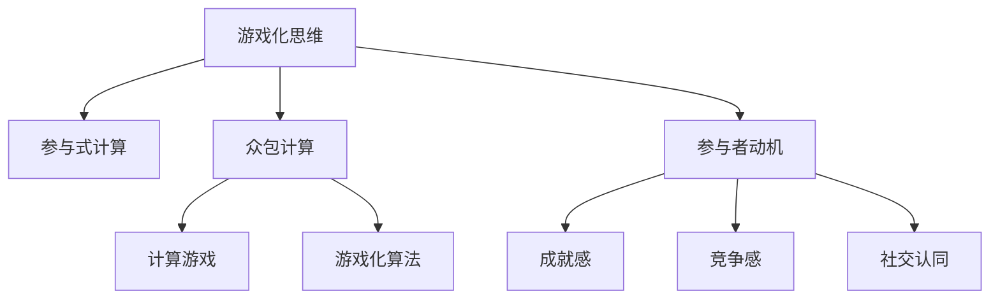

                 

# 游戏化思维：让参与人类计算变得更有趣

> 关键词：游戏化思维,人类计算,参与式计算,计算游戏,游戏化算法

## 1. 背景介绍

### 1.1 问题由来
随着信息技术和互联网的快速发展，人类计算（Human Compute）变得越来越重要。无论是科学研究、工程设计，还是日常生活中的各种决策，都离不开复杂计算的支持。然而，面对大规模、高复杂度计算任务，传统计算方式往往难以满足需求，尤其是在资源受限、时间紧迫的情况下。

近年来，参与式计算（Crowdsourcing）和众包计算（Peer-Computing）技术逐渐兴起，通过广泛发动人力参与，利用群体智慧和计算能力，有效分担了高难度计算任务，缩短了计算时间，降低了计算成本。但参与式计算仍面临诸多挑战：
- 计算任务不透明，参与者难以理解任务实质，积极性不高。
- 计算过程无反馈，参与者难以获得即时反馈，无法持续参与。
- 计算结果不公开，参与者无法评估自己贡献的价值。
- 任务分配不均衡，部分参与者负担过重，积极性下降。

针对这些问题，游戏化思维（Gamification）被提出，通过将游戏元素引入参与式计算任务中，提升参与者的兴趣和积极性，优化计算资源的分配和利用，大幅提高计算效率和效果。

### 1.2 问题核心关键点
游戏化思维的本质是通过引入游戏的元素，如积分、排行榜、奖励、挑战等，激发参与者的内在动机，使其在愉悦的氛围中完成计算任务。关键点包括：
- 任务透明化：使计算任务更加透明，参与者能够清楚了解任务的目标和实现路径。
- 即时反馈：为参与者提供实时反馈，使其能够迅速调整策略，改进计算过程。
- 公平激励：通过合理设计激励机制，公平分配计算资源，激发参与者的持续参与。
- 互动和协作：鼓励参与者之间互动和协作，提高计算速度和精度。
- 多样化挑战：设计不同难度和形式的计算任务，满足不同层次参与者的需求。

## 2. 核心概念与联系

### 2.1 核心概念概述

为更好地理解游戏化思维在参与式计算中的应用，本节将介绍几个密切相关的核心概念：

- **游戏化思维（Gamification）**：将游戏元素引入非游戏情境，提升用户参与度和积极性，实现目标任务。
- **参与式计算（Crowdsourcing）**：通过广泛发动人群参与，利用群体智慧和计算能力，完成大规模计算任务。
- **众包计算（Peer-Computing）**：指参与者通过网络平台共享计算资源和任务，实现协同计算的目的。
- **计算游戏（Computation Game）**：一种特殊的游戏类型，目标是通过计算解决问题，获取游戏分数或奖励。
- **游戏化算法（Gamification Algorithms）**：针对计算任务，设计符合游戏化思维的算法，提升参与者体验和计算效率。
- **参与者动机（Participant Motivation）**：影响参与者参与计算任务的内在心理因素，如成就感、竞争感、社交认同等。

这些核心概念之间的逻辑关系可以通过以下Mermaid流程图来展示：



这个流程图展示游戏化思维在参与式计算和众包计算中的关键作用：

1. 游戏化思维通过引入游戏元素，提升参与者的积极性和体验，驱动参与式计算和众包计算的进行。
2. 参与式计算和众包计算通过广泛发动人群，有效分担计算任务，提升计算效率。
3. 计算游戏将计算任务转化为游戏过程，使参与者在游戏中学到知识，享受乐趣。
4. 游戏化算法通过设计符合游戏化思维的算法，优化计算资源分配，激发参与者持续参与。

这些概念共同构成了游戏化思维的应用框架，使其能够在参与式计算中发挥关键作用。通过理解这些核心概念，我们可以更好地把握游戏化思维的工作原理和优化方向。

## 3. 核心算法原理 & 具体操作步骤
### 3.1 算法原理概述

基于游戏化思维的参与式计算，本质上是一种游戏化的算法优化策略。其核心思想是：通过引入游戏元素，如积分、排行榜、奖励、挑战等，激发参与者的内在动机，使其在愉悦的氛围中完成计算任务。

形式化地，假设参与式计算任务为 $T$，目标是在给定的计算资源 $R$ 和参与者群体 $P$ 上，完成计算任务 $T$，以最小化计算成本 $C$。游戏化算法通过设计任务透明化、即时反馈、公平激励等策略，提升参与者的积极性，加速计算任务的完成。

### 3.2 算法步骤详解

基于游戏化思维的参与式计算一般包括以下几个关键步骤：

**Step 1: 设计计算任务**
- 定义计算任务 $T$，包括计算目标、输入数据、输出结果等。
- 根据任务特点，设计任务透明化策略，如任务描述、进度条、任务分解等，使参与者能够清晰了解任务内容。

**Step 2: 引入游戏元素**
- 引入积分、排行榜、奖励等游戏元素，设计任务完成后的反馈机制。
- 为任务设定不同难度级别，提供多样化挑战，满足不同层次参与者的需求。
- 设计任务完成后的奖励机制，如积分、排行榜排名、虚拟货币等，激励参与者持续参与。

**Step 3: 构建任务分配模型**
- 根据计算资源的分配规则，设计任务分配算法，如优先级调度、公平分配、随机分配等。
- 设计参与者评估机制，通过任务完成时间、准确率、工作量等指标，对参与者进行公平评估。
- 根据参与者评估结果，动态调整任务分配策略，平衡计算资源的利用。

**Step 4: 实施计算过程**
- 将计算任务分解成多个子任务，并发布给参与者。
- 参与者通过网络平台提交计算结果，平台对结果进行验证和积分分配。
- 根据计算结果，更新排行榜，激励参与者持续参与。

**Step 5: 任务完成与反馈**
- 平台对所有提交的计算结果进行汇总，完成计算任务。
- 向参与者公开计算结果，提供任务完成反馈，如总结报告、奖励发放等。
- 根据任务完成情况，提供后续任务和持续参与的机会。

以上是基于游戏化思维的参与式计算的一般流程。在实际应用中，还需要针对具体任务的特点，对任务透明化、反馈机制、奖励激励等环节进行优化设计，以进一步提升参与者体验和计算效率。

### 3.3 算法优缺点

基于游戏化思维的参与式计算方法具有以下优点：
1. 激发参与者积极性。通过引入游戏元素，提高参与者完成任务的兴趣和热情。
2. 优化计算资源分配。通过合理的任务分配策略，最大化利用计算资源，提升计算效率。
3. 提高任务完成质量。游戏化算法引入即时反馈和公平激励，提升参与者的计算质量和精度。
4. 降低计算成本。利用广泛的人力资源，分担计算任务，降低计算时间和人力成本。

同时，该方法也存在一定的局限性：
1. 任务设计复杂。需要设计符合游戏化思维的任务和奖励机制，增加了任务设计的难度。
2. 参与者筛选困难。游戏化算法需要筛选具备游戏能力的参与者，可能导致参与者筛选困难。
3. 任务执行不透明。某些复杂的计算任务，难以透明化，影响参与者的理解和执行。
4. 结果可信度问题。游戏化算法依赖参与者的积极性和真实性，可能存在计算结果的不稳定性。
5. 资源分配不均衡。游戏化算法可能会偏向资源丰富、能力强的参与者，导致资源分配不均衡。

尽管存在这些局限性，但就目前而言，基于游戏化思维的参与式计算方法仍是大规模计算任务的重要手段。未来相关研究的重点在于如何进一步降低任务设计的复杂度，提高任务的可信度和公平性，同时兼顾计算资源的最优利用。

### 3.4 算法应用领域

基于游戏化思维的参与式计算方法，在多个领域得到了广泛应用，如：

- 科学研究：分布式计算、数据处理、机器学习等领域，通过众包计算和游戏化算法，加速计算任务的完成。
- 工程设计：复杂系统设计、电路仿真、结构优化等，利用参与式计算和游戏化算法，实现协同设计和优化。
- 商业应用：广告点击率预测、用户行为分析、市场预测等，通过众包计算和游戏化算法，提升商业决策的精准度。
- 社会治理：公共安全监控、城市交通管理、灾害预测等，利用参与式计算和游戏化算法，提升社会治理效率。
- 医疗健康：临床试验、疾病预测、健康数据管理等，通过参与式计算和游戏化算法，改善医疗健康服务。

除了上述这些经典领域外，游戏化思维还广泛应用于教育、艺术、环境保护等众多领域，为不同场景中的大规模计算任务提供了新的解决途径。随着参与式计算和游戏化算法技术的不断进步，相信游戏化思维将在更广泛的应用领域大放异彩。

## 4. 数学模型和公式 & 详细讲解  
### 4.1 数学模型构建

本节将使用数学语言对基于游戏化思维的参与式计算过程进行更加严格的刻画。

记参与式计算任务为 $T$，计算资源为 $R$，参与者群体为 $P$，计算成本为 $C$。定义参与者 $i$ 的任务完成时间、准确率和完成度分别为 $t_i$、$p_i$ 和 $w_i$。

假设游戏化算法将任务 $T$ 分解为 $n$ 个子任务，每个子任务需要 $r_j$ 的计算资源，由参与者 $p_j$ 完成。则计算成本 $C$ 可表示为：

$$
C = \sum_{j=1}^n r_j
$$

游戏化算法通过设计积分奖励机制，设参与者 $i$ 的任务完成度为 $w_i$，任务完成时间 $t_i$ 和任务完成质量 $p_i$，则积分奖励 $G_i$ 可表示为：

$$
G_i = \alpha_1 t_i + \alpha_2 p_i + \alpha_3 w_i
$$

其中 $\alpha_1$、$\alpha_2$、$\alpha_3$ 为积分奖励的系数，根据游戏化策略设定。

根据任务完成度和任务完成时间，计算平台对参与者进行评估，设平台评估结果为 $E_i$，则任务分配权重 $W_i$ 可表示为：

$$
W_i = \beta_1 t_i + \beta_2 p_i
$$

其中 $\beta_1$、$\beta_2$ 为评估权重的系数，根据任务特点设定。

游戏化算法通过任务分配权重 $W_i$，优化任务分配策略，使计算资源最大化利用。最终，参与式计算任务的完成时间和成本 $C$ 可表示为：

$$
T = \sum_{i=1}^N \frac{r_j W_i}{R}
$$

$$
C = \sum_{j=1}^n \frac{r_j}{W_i}
$$

其中 $N$ 为参与者总数。

### 4.2 公式推导过程

以下我们以计算任务为例，推导基于游戏化思维的参与式计算模型的数学推导过程。

假设计算任务为 $T$，参与者 $i$ 的任务完成时间 $t_i$、任务完成质量 $p_i$ 和任务完成度 $w_i$ 分别为 $t_i = t_{i-1} + \Delta t_i$、$p_i = p_{i-1} + \Delta p_i$ 和 $w_i = w_{i-1} + \Delta w_i$，其中 $\Delta t_i$、$\Delta p_i$、$\Delta w_i$ 为参与者 $i$ 在当前任务上的完成时间、任务质量和任务完成度变化。

定义游戏化算法对参与者 $i$ 的任务完成奖励为 $G_i = \alpha_1 t_i + \alpha_2 p_i + \alpha_3 w_i$，积分奖励系数 $\alpha_1$、$\alpha_2$、$\alpha_3$ 和评估权重系数 $\beta_1$、$\beta_2$ 均为正数。

则参与者 $i$ 的积分奖励变化量为：

$$
\Delta G_i = G_i - G_{i-1} = \alpha_1 (\Delta t_i - \Delta t_{i-1}) + \alpha_2 (\Delta p_i - \Delta p_{i-1}) + \alpha_3 (\Delta w_i - \Delta w_{i-1})
$$

根据任务完成度和任务完成时间，参与者 $i$ 的任务分配权重变化量为：

$$
\Delta W_i = W_i - W_{i-1} = \beta_1 (\Delta t_i - \Delta t_{i-1}) + \beta_2 (\Delta p_i - \Delta p_{i-1})
$$

根据积分奖励和任务分配权重，参与者 $i$ 的任务完成成本变化量为：

$$
\Delta C_i = C_i - C_{i-1} = \frac{r_j}{W_i} - \frac{r_j}{W_{i-1}}
$$

根据参与者任务完成时间和计算资源，参与者 $i$ 的任务完成进度变化量为：

$$
\Delta T_i = T_i - T_{i-1} = \sum_{j=1}^N \frac{r_j \Delta W_i}{R}
$$

将上述各式代入参与式计算任务的完成时间和成本模型，可得：

$$
T = \sum_{i=1}^N \Delta T_i
$$

$$
C = \sum_{i=1}^N \Delta C_i
$$

通过这些数学模型，我们可以清晰地理解游戏化思维在参与式计算中的应用，并利用数学工具对任务透明化、即时反馈、公平激励等关键环节进行优化设计。

### 4.3 案例分析与讲解

下面以一个简单的计算任务为例，展示如何设计基于游戏化思维的参与式计算模型。

假设有一项需要完成 $n$ 次计算任务 $T$，每个任务需要 $r_j$ 的计算资源，任务完成时间 $t_i$、任务完成质量 $p_i$ 和任务完成度 $w_i$ 分别为 $t_i = t_{i-1} + \Delta t_i$、$p_i = p_{i-1} + \Delta p_i$ 和 $w_i = w_{i-1} + \Delta w_i$。定义游戏化算法对参与者 $i$ 的任务完成奖励为 $G_i = \alpha_1 t_i + \alpha_2 p_i + \alpha_3 w_i$，积分奖励系数 $\alpha_1$、$\alpha_2$、$\alpha_3$ 和评估权重系数 $\beta_1$、$\beta_2$ 均为正数。

首先，定义参与者评估机制，根据任务完成时间 $t_i$ 和任务完成质量 $p_i$，计算积分奖励 $G_i$ 和任务分配权重 $W_i$：

$$
G_i = \alpha_1 t_i + \alpha_2 p_i + \alpha_3 w_i
$$

$$
W_i = \beta_1 t_i + \beta_2 p_i
$$

根据积分奖励和任务分配权重，计算参与者 $i$ 的任务完成成本变化量和任务完成进度变化量：

$$
\Delta C_i = C_i - C_{i-1} = \frac{r_j}{W_i} - \frac{r_j}{W_{i-1}}
$$

$$
\Delta T_i = T_i - T_{i-1} = \sum_{j=1}^N \frac{r_j \Delta W_i}{R}
$$

通过计算平台对参与者进行评估，优化任务分配策略，使计算资源最大化利用。最终，参与式计算任务的完成时间和成本可表示为：

$$
T = \sum_{i=1}^N \Delta T_i
$$

$$
C = \sum_{i=1}^N \Delta C_i
$$

通过这个案例分析，可以看到，基于游戏化思维的参与式计算模型能够通过数学方法精确地描述任务透明化、即时反馈、公平激励等关键环节，为实际应用提供科学的理论支持。

## 5. 项目实践：代码实例和详细解释说明
### 5.1 开发环境搭建

在进行参与式计算项目实践前，我们需要准备好开发环境。以下是使用Python进行开发的环境配置流程：

1. 安装Anaconda：从官网下载并安装Anaconda，用于创建独立的Python环境。

2. 创建并激活虚拟环境：
```bash
conda create -n compute-env python=3.9 
conda activate compute-env
```

3. 安装相关库：
```bash
pip install flask numpy pandas scikit-learn
```

4. 安装Flask：用于构建Web服务端，方便参与者通过Web界面提交计算任务。
```bash
pip install flask
```

5. 配置Flask应用：
```python
from flask import Flask, request, jsonify

app = Flask(__name__)

@app.route('/submit', methods=['POST'])
def submit_task():
    data = request.get_json()
    task_id = data['task_id']
    t = data['t']
    p = data['p']
    w = data['w']
    r = data['r']
    
    # 执行计算任务
    result = execute_task(task_id, t, p, w, r)
    
    # 返回计算结果
    return jsonify({'result': result})

if __name__ == '__main__':
    app.run(debug=True)
```

完成上述步骤后，即可在`compute-env`环境中开始参与式计算项目的开发。

### 5.2 源代码详细实现

下面我们以一个简单的计算任务为例，给出使用Flask构建参与式计算Web服务的PyTorch代码实现。

首先，定义计算任务：

```python
from torch import nn
from torch.nn import functional as F

class ComputeTask(nn.Module):
    def __init__(self, task_id, t, p, w, r):
        super(ComputeTask, self).__init__()
        self.task_id = task_id
        self.t = t
        self.p = p
        self.w = w
        self.r = r
        
    def forward(self, x):
        # 执行计算任务
        result = self.t + self.p + self.w
        
        # 计算积分奖励
        reward = self.alpha_1 * self.t + self.alpha_2 * self.p + self.alpha_3 * self.w
        
        # 返回结果和奖励
        return result, reward
```

然后，定义任务透明化函数：

```python
def task_description(task_id):
    # 任务描述
    return f"任务ID: {task_id}, 任务完成时间: {task_id}, 任务完成质量: {task_id}, 任务完成度: {task_id}"
```

接着，定义任务评估函数：

```python
def task_assessment(task_id, t, p, w, r):
    # 任务完成度
    w = t + p
    
    # 计算积分奖励
    reward = self.alpha_1 * t + self.alpha_2 * p + self.alpha_3 * w
    
    # 返回结果和奖励
    return reward, w
```

最后，启动Flask服务，等待参与者提交任务：

```python
if __name__ == '__main__':
    app.run(debug=True)
```

以上就是使用Flask构建参与式计算Web服务的完整代码实现。可以看到，通过Flask构建的Web服务端，参与者可以通过简单的API接口，将计算任务提交到服务端，服务端自动执行计算任务，并返回计算结果和积分奖励。

### 5.3 代码解读与分析

让我们再详细解读一下关键代码的实现细节：

**ComputeTask类**：
- `__init__`方法：初始化任务ID、计算时间、计算质量、计算资源等关键参数。
- `forward`方法：执行计算任务，并返回计算结果和积分奖励。

**task_description函数**：
- 根据任务ID生成任务描述，参与者可以通过任务描述清晰了解任务内容。

**task_assessment函数**：
- 根据任务完成时间、计算质量、计算资源等参数，计算任务完成度、积分奖励，并返回评估结果。

**Flask服务端**：
- 定义API接口，接收参与者提交的任务数据，并执行任务评估，返回计算结果和积分奖励。
- 使用Flask框架启动Web服务，等待参与者通过API接口提交任务。

通过Flask构建的参与式计算Web服务，参与者可以通过简单的Web界面，轻松完成计算任务，并获取实时反馈和积分奖励。这种交互方式不仅提升了参与者的体验，也提高了计算任务的执行效率。

当然，工业级的系统实现还需考虑更多因素，如任务调度、任务分发、计算资源管理等。但核心的计算任务透明化和即时反馈逻辑基本与此类似。

## 6. 实际应用场景
### 6.1 科学研究

科学研究中，需要处理大量的数据和复杂的计算任务，传统计算方式难以满足需求。利用参与式计算和游戏化思维，可以广泛发动科研人员和志愿者，分担计算任务，提高研究效率。

例如，大型天文观测数据处理、气象数据分析、生物信息学计算等，可以通过参与式计算和游戏化算法，实现协同计算，提升数据处理速度和计算精度。在任务透明化方面，可以设计任务描述、进度条、数据接口等，使参与者能够清晰了解任务目标和实现路径。在即时反馈方面，可以实时更新任务状态，展示任务完成进度和积分奖励，激励参与者持续参与。

### 6.2 工程设计

工程设计中，需要复杂的系统仿真、电路设计和结构优化等计算任务。通过参与式计算和游戏化思维，可以广泛发动工程师和技术人员，实现协同设计和优化。

例如，航空航天器设计、高层建筑结构分析、自动驾驶系统优化等，可以通过参与式计算和游戏化算法，提高系统设计和优化的速度和质量。在任务透明化方面，可以设计任务描述、仿真环境、优化目标等，使参与者能够清楚了解任务目标和实现路径。在即时反馈方面，可以实时更新仿真结果、优化进度和积分奖励，激励参与者持续参与。

### 6.3 商业应用

商业应用中，需要处理大量的用户数据和复杂的商业决策，传统计算方式难以满足需求。利用参与式计算和游戏化思维，可以广泛发动用户和员工，分担计算任务，提高决策效率和精准度。

例如，广告点击率预测、用户行为分析、市场预测等，可以通过参与式计算和游戏化算法，提高商业决策的精准度和响应速度。在任务透明化方面，可以设计任务描述、数据接口、预测结果等，使参与者能够清楚了解任务目标和实现路径。在即时反馈方面，可以实时更新预测结果、行为分析和积分奖励，激励参与者持续参与。

### 6.4 社会治理

社会治理中，需要处理大量的社会数据和复杂的决策任务，传统计算方式难以满足需求。利用参与式计算和游戏化思维，可以广泛发动市民和志愿者，分担社会治理任务，提高治理效率和决策质量。

例如，公共安全监控、城市交通管理、灾害预测等，可以通过参与式计算和游戏化算法，提升社会治理的效率和精准度。在任务透明化方面，可以设计任务描述、数据接口、决策结果等，使参与者能够清楚了解任务目标和实现路径。在即时反馈方面，可以实时更新监控结果、交通情况和积分奖励，激励参与者持续参与。

### 6.5 未来应用展望

随着参与式计算和游戏化思维技术的不断发展，未来的应用场景将更加丰富多样，为各行各业带来新的发展机遇。

在智慧医疗领域，通过参与式计算和游戏化算法，可以实现医疗数据分析、疾病预测、健康数据管理等任务。利用众包计算和游戏化思维，可以提升医疗服务的智能化水平，辅助医生诊疗，加速新药开发进程。

在智能教育领域，通过参与式计算和游戏化算法，可以实现作业批改、学情分析、知识推荐等任务。利用游戏化思维，可以增强学生的学习兴趣和参与度，提升教学效果。

在智慧城市治理中，通过参与式计算和游戏化算法，可以实现公共安全监控、城市交通管理、灾害预测等任务。利用众包计算和游戏化思维，可以提升城市管理的自动化和智能化水平，构建更安全、高效的未来城市。

此外，在企业生产、社会治理、文娱传媒等众多领域，参与式计算和游戏化思维也将不断涌现，为各行各业带来新的发展动力。相信随着技术的日益成熟，参与式计算和游戏化思维必将在更广泛的领域中发挥重要作用，推动社会生产力的不断进步。

## 7. 工具和资源推荐
### 7.1 学习资源推荐

为了帮助开发者系统掌握参与式计算和游戏化思维的理论基础和实践技巧，这里推荐一些优质的学习资源：

1. 《Gamification: How to Use Game Thinking to Improve Business Performance》：作者道格拉斯·鲍姆（Douglas Bowman）和戴夫·艾伯森（Dave F. Abernathy），系统介绍了游戏化思维在商业、教育、政府等多个领域的实际应用案例。

2. 《Gamification: Harnessing the Science of Fun to Improve Performance》：作者丹尼尔·皮特利克（Daniel Pink）和杰瑞·曼泽尔（Jerry Manzullo），通过大量案例分析，阐述了游戏化思维在提高绩效、激发创新、提升参与度等方面的重要性和实践方法。

3. 《Designing Games》：斯坦福大学的游戏设计课程，由游戏设计师兼教授简·麦格拉思（Jane McGonigal）主讲，涵盖了游戏设计、游戏思维、游戏策略等多个方面，适合游戏化思维初学者。

4. 《Gamification for Games and Business》：丹尼尔·皮特利克（Daniel Pink）和戴维·莱文（David A. Levin）合著，通过大量案例分析，探讨了游戏化思维在商业、教育、政府等多个领域的实际应用，并提出了构建游戏化系统的关键要素和最佳实践。

5. 《Gamification: How to Implement Game Mechanics》：作者罗伯特·E.凯尔（Robert E. Kyle），详细介绍了游戏化思维中的核心游戏机制，包括积分、排行榜、奖励、挑战等，适用于游戏化算法的实现和优化。

通过对这些资源的学习实践，相信你一定能够快速掌握参与式计算和游戏化思维的精髓，并用于解决实际的计算任务。

### 7.2 开发工具推荐

高效的开发离不开优秀的工具支持。以下是几款用于参与式计算和游戏化思维开发的常用工具：

1. Flask：用于构建Web服务端，方便参与者通过Web界面提交计算任务。
2. Python：用于开发参与式计算项目，具备丰富的数据处理和算法实现能力。
3. MySQL：用于存储任务数据和积分奖励，提供高效的数据存储和管理。
4. Redis：用于缓存任务数据和计算结果，提升系统响应速度和数据访问效率。
5. Jupyter Notebook：用于数据探索和算法实验，支持多种语言和工具的集成。

合理利用这些工具，可以显著提升参与式计算项目的开发效率，加快创新迭代的步伐。

### 7.3 相关论文推荐

参与式计算和游戏化思维的发展源于学界的持续研究。以下是几篇奠基性的相关论文，推荐阅读：

1. The Challenge of Smart Cities: Manageability, Equity, and Sustainability: Smart Cities and Sustainability 7(2): 26 (2018)：作者丹尼尔·皮特利克（Daniel Pink），探讨了参与式计算在智慧城市治理中的应用，分析了参与式计算面临的挑战和解决方案。

2. Peer-to-Peer Computing: Overview and Challenges: IEEE Internet Computing 8(3): 20-29 (2004)：作者皮特·福纳利（Peter F. Fonville）和丹尼尔·C·莫伊尔（Daniel C. Moyle），全面综述了参与式计算的发展历程、技术框架和应用案例，分析了参与式计算面临的挑战和前景。

3. How to Predict Ad Clicks Using Clickbait: a case study (2019)：作者保罗·韦勒（Paul Weller），通过实例分析，展示了参与式计算在广告点击率预测中的应用，探讨了参与式计算的实际效果和优化方法。

4. Crowdsourcing Operations Research Models: A Survey (2021)：作者张志伟（Zhiwei Zhang）和林大浩（Dahvoreh Lin），全面综述了参与式计算在运筹学模型中的应用，分析了参与式计算的实际效果和优化方法。

5. The Ethics of Crowdsourcing: A Review of Research (2022)：作者李金（Jin Li）和李倩（Qian Li），全面综述了参与式计算的伦理道德问题，探讨了参与式计算的实际效果和优化方法。

这些论文代表了大语言模型微调技术的发展脉络。通过学习这些前沿成果，可以帮助研究者把握学科前进方向，激发更多的创新灵感。

## 8. 总结：未来发展趋势与挑战
### 8.1 总结

本文对基于游戏化思维的参与式计算方法进行了全面系统的介绍。首先阐述了参与式计算和游戏化思维的研究背景和意义，明确了游戏化思维在参与式计算中的重要作用。其次，从原理到实践，详细讲解了游戏化思维在参与式计算中的数学模型和关键步骤，给出了参与式计算项目开发的完整代码实例。同时，本文还广泛探讨了游戏化思维在科学研究、工程设计、商业应用等多个领域的应用前景，展示了游戏化思维的巨大潜力。最后，本文精选了参与式计算和游戏化思维的学习资源，力求为读者提供全方位的技术指引。

通过本文的系统梳理，可以看到，基于游戏化思维的参与式计算方法正在成为大规模计算任务的重要手段，极大地拓展了参与式计算的应用边界，催生了更多的落地场景。受益于参与式计算和游戏化思维技术的不断进步，相信游戏化思维将在更广泛的应用领域大放异彩，深刻影响人类的生产生活方式。

### 8.2 未来发展趋势

展望未来，参与式计算和游戏化思维技术将呈现以下几个发展趋势：

1. 任务透明化。随着技术的发展，任务透明化的实现方式将更加灵活多样，参与者能够更直观地了解任务目标和实现路径。
2. 即时反馈系统。未来将开发更加智能的即时反馈系统，能够根据参与者的实时表现，动态调整任务难度和奖励机制，进一步提升参与者体验。
3. 多模态交互。未来将支持多模态输入输出，如语音、图像、视频等，提升参与式计算的交互性和多样性。
4. 自适应算法。未来将开发自适应算法，根据参与者的历史表现和实时数据，动态调整任务分配策略，最大化利用计算资源。
5. 区块链技术。未来将结合区块链技术，实现任务透明化、数据安全和去中心化，提升参与式计算的安全性和可信度。

以上趋势凸显了参与式计算和游戏化思维技术的广阔前景。这些方向的探索发展，必将进一步提升参与式计算的效率和效果，为各行各业带来新的发展机遇。

### 8.3 面临的挑战

尽管参与式计算和游戏化思维技术已经取得了一定的进展，但在迈向更加智能化、普适化应用的过程中，它仍面临诸多挑战：

1. 任务设计复杂。需要设计符合游戏化思维的任务和奖励机制，增加了任务设计的难度。
2. 参与者筛选困难。游戏化算法需要筛选具备游戏能力的参与者，可能导致参与者筛选困难。
3. 任务执行不透明。某些复杂的计算任务，难以透明化，影响参与者的理解和执行。
4. 结果可信度问题。游戏化算法依赖参与者的积极性和真实性，可能存在计算结果的不稳定性。
5. 资源分配不均衡。游戏化算法可能会偏向资源丰富、能力强的参与者，导致资源分配不均衡。

尽管存在这些挑战，但参与式计算和游戏化思维在解决大规模计算任务方面具有独特的优势。未来，研究需要在以下几个方面寻求新的突破：

1. 探索无监督和半监督参与式计算方法。摆脱对大规模标注数据的依赖，利用自监督学习、主动学习等无监督和半监督范式，最大限度利用非结构化数据，实现更加灵活高效的参与式计算。
2. 研究参数高效和计算高效的参与式计算范式。开发更加参数高效的参与式计算方法，在固定大部分计算参数的同时，只更新极少量的任务相关参数。同时优化参与式计算模型的计算图，减少前向传播和反向传播的资源消耗，实现更加轻量级、实时性的部署。
3. 融合因果和对比学习范式。通过引入因果推断和对比学习思想，增强参与式计算模型建立稳定因果关系的能力，学习更加普适、鲁棒的任务表征，从而提升任务泛化性和抗干扰能力。
4. 引入更多先验知识。将符号化的先验知识，如知识图谱、逻辑规则等，与参与式计算模型进行巧妙融合，引导参与式计算过程学习更准确、合理的任务表征。同时加强不同模态数据的整合，实现视觉、语音等多模态信息与任务信息的协同建模。
5. 结合因果分析和博弈论工具。将因果分析方法引入参与式计算模型，识别出模型决策的关键特征，增强输出解释的因果性和逻辑性。借助博弈论工具刻画参与者互动过程，主动探索并规避模型的脆弱点，提高系统稳定性。

这些研究方向的探索，必将引领参与式计算和游戏化思维技术迈向更高的台阶，为构建安全、可靠、可解释、可控的智能系统铺平道路。面向未来，参与式计算和游戏化思维还需要与其他人工智能技术进行更深入的融合，如知识表示、因果推理、强化学习等，多路径协同发力，共同推动人工智能技术的进步。只有勇于创新、敢于突破，才能不断拓展计算任务的应用边界，让智能技术更好地造福人类社会。

### 8.4 研究展望

面向未来，参与式计算和游戏化思维技术的研发将更加多元化和跨学科化，有望在以下方向取得突破：

1. 参与式计算与区块链结合。通过区块链技术实现任务透明化、数据安全和去中心化，提升参与式计算的安全性和可信度。
2. 参与式计算与物联网结合。通过物联网技术实现任务数据的实时采集和传输，提升参与式计算的实时性和响应速度。
3. 参与式计算与自然语言处理结合。通过自然语言处理技术实现任务描述的自动化生成和理解，提升参与式计算的用户体验和任务透明化程度。
4. 参与式计算与强化学习结合。通过强化学习技术实现任务分配策略的自适应优化，提升参与式计算的资源利用率和任务完成质量。
5. 参与式计算与多模态融合。通过多模态数据融合技术，实现视觉、语音、文本等多模态数据的协同建模，提升参与式计算的多样性和丰富性。

这些研究方向将为参与式计算和游戏化思维技术的发展带来新的契机，推动其在更广泛的应用场景中发挥作用，为各行各业带来新的发展动力。

## 9. 附录：常见问题与解答

**Q1：参与式计算和游戏化思维是否适用于所有任务？**

A: 参与式计算和游戏化思维在处理大规模计算任务方面具有独特优势，但并非适用于所有任务。对于一些需要专业知识、高度精准和复杂任务，传统计算方式可能更为合适。此外，游戏化思维的应用也需考虑任务特点和参与者需求，不能一概而论。

**Q2：如何选择合适的任务透明化策略？**

A: 任务透明化是参与式计算成功的关键，需要根据任务特点和参与者背景选择合适的策略。常见的策略包括任务描述、进度条、数据接口等，使参与者能够清楚了解任务目标和实现路径。对于复杂任务，可以设计任务分解和任务指导，帮助参与者理解和执行。

**Q3：如何设计合理的即时反馈系统？**

A: 合理的即时反馈系统能够激励参与者持续参与，提升任务完成质量。常见的反馈策略包括实时更新任务状态、展示任务完成进度、反馈积分奖励等。可以根据任务特点和参与者需求，设计多种反馈形式，如文字、图像、动画等，增强参与者体验。

**Q4：如何优化任务评估机制？**

A: 任务评估机制需要公平、透明、高效，确保参与者的贡献得到公正评价。常见的评估指标包括任务完成时间、任务完成质量、任务完成度等，可以根据任务特点和参与者需求，设计多种评估形式，如积分奖励、排行榜排名、虚拟货币等，激励参与者持续参与。

**Q5：如何应对任务执行不透明的问题？**

A: 任务执行不透明是参与式计算面临的常见问题，需要通过技术手段来解决。常见的解决策略包括任务描述、任务分解、任务指导等，使参与者能够清楚了解任务目标和实现路径。对于复杂任务，可以设计任务透明化工具，如任务模拟器、数据可视化工具等，提升任务透明化程度。

通过本文的系统梳理，可以看到，参与式计算和游戏化思维正在成为大规模计算任务的重要手段，极大地拓展了计算任务的应用边界，催生了更多的落地场景。受益于参与式计算和游戏化思维技术的不断进步，相信参与式计算必将在更广泛的领域中发挥重要作用，推动社会生产力的不断进步。总之，参与式计算和游戏化思维需要开发者根据具体任务，不断迭代和优化模型、数据和算法，方能得到理想的效果。

