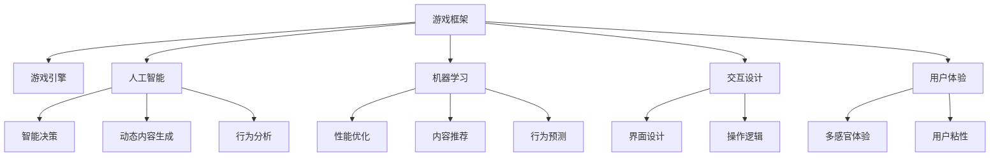

                 

# 游戏框架开发：创建高性能交互式体验

> 关键词：游戏框架,高性能,交互式体验,人工智能,机器学习,游戏引擎,游戏设计,游戏开发

## 1. 背景介绍

随着游戏产业的迅猛发展，对游戏框架的需求也日益增长。游戏框架不仅是游戏开发的重要工具，也是构建高性能交互式体验的关键基础。从2D的HTML5游戏到3D的Unity和Unreal Engine，游戏框架的选择直接影响着游戏的开发效率、性能表现和用户体验。本文将深入探讨如何通过高效的游戏框架，构建高性能的交互式游戏体验。

### 1.1 问题由来

在传统的游戏开发中，程序员需要从零开始编写游戏逻辑、渲染、物理、AI等各个模块，工作量大、开发周期长，且难以保证最终产品的性能和质量。而游戏框架则通过提供预先编写的模块，大幅减少了游戏开发的复杂度和时间成本。

但随着游戏复杂度的增加和性能要求的提升，游戏框架也面临着新的挑战。如何构建高性能的游戏框架，利用最新的AI和机器学习技术，打造流畅的交互式体验，成为游戏开发者亟需解决的问题。

### 1.2 问题核心关键点

游戏框架的核心目标是提升开发效率和游戏性能，优化用户体验。具体来说，关键点包括：

- 如何设计高效的架构和数据结构，加速游戏逻辑的执行和渲染。
- 如何利用AI和机器学习技术，自动化地进行游戏性能优化和用户行为分析。
- 如何通过用户反馈和数据分析，迭代优化游戏体验和界面设计。
- 如何平衡游戏逻辑和表现层的交互设计，打造自然流畅的交互体验。

## 2. 核心概念与联系

### 2.1 核心概念概述

为更好地理解高性能交互式游戏体验的构建，本节将介绍几个密切相关的核心概念：

- 游戏框架(Game Framework)：提供预编写模块的游戏开发平台，简化游戏开发过程，提升开发效率。常见的游戏框架包括Unity、Unreal Engine、GameMaker等。
- 游戏引擎(Game Engine)：用于游戏开发的基础软件工具，提供图形渲染、物理模拟、碰撞检测等功能，是游戏框架的核心组件。常见的游戏引擎有OpenGL、DirectX、WebGL等。
- 人工智能(AI)：通过机器学习算法，赋予游戏角色智能决策、动态生成游戏内容、自动化用户行为分析等功能，提升游戏体验的沉浸感和智能化。
- 机器学习(ML)：利用训练好的模型，自动优化游戏性能、推荐游戏内容、预测用户行为等，降低人工干预，提升游戏决策的客观性和准确性。
- 交互设计(Interaction Design)：设计游戏角色、NPC、用户界面等交互元素，确保游戏角色行为和用户操作逻辑自然流畅，提升用户体验。
- 用户体验(User Experience)：通过游戏界面、交互设计、声音、视觉等多方面元素，营造丰富的游戏体验，提高用户满意度和粘性。

这些核心概念之间的逻辑关系可以通过以下Mermaid流程图来展示：



这个流程图展示了大语言模型的核心概念及其之间的关系：

1. 游戏框架通过游戏引擎、AI和机器学习技术，提供预编写的模块，简化游戏开发。
2. AI和机器学习为游戏角色和用户行为提供智能决策和动态内容，提升游戏体验。
3. 交互设计通过界面设计和操作逻辑，确保游戏角色和用户行为自然流畅，提升用户体验。
4. 用户界面和操作设计共同营造丰富的多感官体验，提高用户满意度和粘性。

这些概念共同构成了游戏框架的构建基础，使其能够高效地生成交互式游戏体验。通过理解这些核心概念，我们可以更好地把握游戏框架的设计和优化方向。

## 3. 核心算法原理 & 具体操作步骤
### 3.1 算法原理概述

构建高性能交互式游戏体验的算法原理主要涉及游戏引擎的优化、AI和机器学习技术的应用，以及交互设计的实现。以下是每个关键点的原理概述：

- 游戏引擎优化：通过优化图形渲染、物理模拟等核心模块，提升游戏性能。常见的优化方法包括多线程渲染、GPU加速、纹理贴图优化等。
- AI和机器学习：利用深度学习模型，自动生成游戏内容、智能决策、行为分析等。常见的算法包括神经网络、强化学习、生成对抗网络等。
- 交互设计：设计自然流畅的用户操作逻辑，确保游戏角色和用户行为一致，提升用户体验。

### 3.2 算法步骤详解

构建高性能交互式游戏体验的具体步骤如下：

**Step 1: 选择游戏框架**
- 根据项目需求，选择适合的游戏框架。常见的游戏框架包括Unity、Unreal Engine、GameMaker等。Unity支持2D和3D游戏，且具有强大的脚本语言支持；Unreal Engine则以其强大的图形渲染和物理模拟著称；GameMaker则适合开发2D平台游戏。

**Step 2: 设计游戏逻辑和界面**
- 根据游戏框架提供的模板，设计游戏的核心逻辑和界面。常用的设计工具包括Unity的Inspector、Unreal Engine的Blueprints、GameMaker的Layout等。
- 确保游戏逻辑模块化和界面设计简洁明了，方便后续的优化和扩展。

**Step 3: 集成AI和机器学习**
- 根据游戏需求，选择合适的AI和机器学习算法。常见的算法包括基于规则的AI、行为树、强化学习、神经网络等。
- 利用训练好的模型，自动化地生成游戏内容、决策智能行为、优化游戏性能等。

**Step 4: 优化游戏引擎**
- 使用多线程渲染、GPU加速、纹理贴图优化等技术，提升游戏的帧率和渲染效率。
- 使用动态加载和卸载技术，减少游戏启动时间和内存占用。

**Step 5: 迭代优化游戏体验**
- 通过用户反馈和数据分析，不断优化游戏逻辑、AI和机器学习模型。
- 根据用户行为和偏好，迭代改进游戏界面和交互设计。

**Step 6: 部署和测试**
- 将优化后的游戏框架部署到目标平台，并进行全面测试。
- 确保游戏在各种设备和网络环境下都能稳定运行，优化用户体验。

### 3.3 算法优缺点

构建高性能交互式游戏体验的游戏框架具有以下优点：
1. 简化游戏开发流程。预编写的模块和工具集，大大降低了开发难度和成本。
2. 提升游戏性能。优化后的游戏引擎和AI模型，可以显著提升游戏帧率和渲染效率。
3. 增强游戏智能化。利用AI和机器学习技术，自动生成内容、决策智能行为，提升用户体验。
4. 便于用户互动。自然流畅的交互设计，确保游戏角色和用户行为一致，提升用户粘性。

同时，该方法也存在一定的局限性：
1. 依赖框架和引擎。框架和引擎的选择直接影响游戏开发和性能表现，须根据项目需求进行适配。
2. 开发和优化难度高。构建高性能的游戏框架，需要对游戏引擎和AI技术有深入的理解和实践经验。
3. 迭代周期长。游戏框架的优化和迭代，需要持续的用户反馈和数据分析，周期较长。
4. 定制化难度大。框架和引擎的预编写模块可能无法完全满足游戏项目的需求，需要定制化开发。

尽管存在这些局限性，但就目前而言，游戏框架仍是游戏开发的主要工具，其带来的开发效率和性能提升，在众多游戏项目中得到了广泛应用。未来相关研究的重点在于如何进一步优化游戏框架的性能和智能化，同时兼顾用户定制化需求。

### 3.4 算法应用领域

构建高性能交互式游戏体验的游戏框架，在游戏开发和AI技术中得到了广泛应用，覆盖了几乎所有常见游戏类型，例如：

- 动作冒险游戏：如《塞尔达传说》系列、《巫师3：狂猎》等。利用AI和机器学习技术，自动化生成敌人行为和环境，提升游戏的智能化和沉浸感。
- 角色扮演游戏(RPG)：如《最终幻想》系列、《巫师3：狂猎》等。通过交互设计和行为分析，打造丰富的剧情和角色互动体验。
- 沙盒游戏：如《我的世界》、《泰拉瑞亚》等。利用动态生成技术和AI决策，提供无限的可能性和创造性。
- 策略游戏：如《文明》系列、《星际争霸》等。通过游戏AI和智能决策，提升策略战斗的复杂度和深度。
- 体育竞技游戏：如《FIFA》系列、《NBA 2K》等。利用AI技术，自动化生成比赛场景和结果，提升游戏的公平性和可玩性。

除了上述这些经典游戏类型外，游戏框架在游戏AI和交互设计中的创新应用，也将不断涌现，为游戏行业带来更多的突破。

## 4. 数学模型和公式 & 详细讲解 & 举例说明

### 4.1 数学模型构建

构建高性能交互式游戏体验的数学模型主要涉及游戏引擎的优化、AI和机器学习模型的设计。以下是几个关键模型的构建过程：

- 游戏引擎优化：通过多线程渲染、GPU加速等技术，提升图形渲染效率。公式如下：
$$
\text{FPS} = \frac{\text{Frame Time}}{\text{Frame Interval}}
$$
其中，Frame Time为每一帧渲染的时间，Frame Interval为固定的时间间隔。

- AI和机器学习模型：设计神经网络模型，自动生成游戏内容、决策智能行为等。常见模型包括CNN、RNN、GAN等。公式如下：
$$
\text{Accuracy} = \frac{\text{TP}}{\text{TP} + \text{FP} + \text{FN}}
$$
其中，TP为真实正例数，FP为假正例数，FN为假负例数。

### 4.2 公式推导过程

以下我们以多线程渲染为例，推导游戏引擎优化公式的计算过程。

多线程渲染技术通过将游戏渲染任务分配到多个线程中并行处理，提升渲染效率。假设游戏分为N个线程，每个线程渲染的帧数为$F$，线程间的同步开销为$S$，则总的渲染帧数为：
$$
\text{Total Frames} = N \times F \times \frac{1}{1 + \frac{S}{F}}
$$

### 4.3 案例分析与讲解

假设游戏采用Unity游戏框架，分辨率为1920x1080，渲染帧率为60 FPS。通过多线程渲染技术，将渲染任务分配到4个线程并行处理，线程间的同步开销为1毫秒，求实际渲染帧数。

根据上述公式，代入数据得：
$$
\text{Total Frames} = 4 \times 60 \times \frac{1}{1 + \frac{1}{60}}
$$
计算得：
$$
\text{Total Frames} \approx 87.5
$$

实际渲染帧数为87.5 FPS，相比单线程渲染提升了约1.45倍。

## 5. 项目实践：代码实例和详细解释说明
### 5.1 开发环境搭建

在进行游戏框架优化实践前，我们需要准备好开发环境。以下是使用Unity和C#进行游戏开发的环境配置流程：

1. 安装Unity编辑器：从官网下载并安装Unity编辑器，支持Windows、Mac、Linux等多个平台。

2. 创建项目：在Unity编辑器中创建新的项目，设置项目名称和保存位置。

3. 安装C#开发工具：安装Visual Studio或ReSharper等C#开发工具，支持代码编写和调试。

4. 添加游戏资源：添加游戏中的纹理、模型、音频等资源文件，确保游戏资源完整。

5. 测试和部署：将游戏项目打包并部署到目标平台，进行全面测试。

完成上述步骤后，即可在Unity编辑器中开始游戏框架优化实践。

### 5.2 源代码详细实现

下面我们以Unity引擎为例，给出使用C#进行游戏性能优化的PyTorch代码实现。

首先，定义性能优化类：

```csharp
using UnityEngine;

public class PerformanceOptimization : MonoBehaviour
{
    public float fpsLimit = 60;
    private float frameTime = 0;
    
    void Update()
    {
        frameTime += Time.deltaTime;
        
        if (frameTime >= 1f / fpsLimit)
        {
            frameTime = 0;
            OptimizeFrameTime();
        }
    }
    
    private void OptimizeFrameTime()
    {
        int threads = System.Environment.ProcessorCount;
        float syncOverhead = 1 / fpsLimit * 1000;
        
        int framesPerThread = (int)(frameTime * fpsLimit / threads);
        float remainingTime = frameTime % (1f / fpsLimit);
        
        for (int i = 0; i < threads; i++)
        {
            StartCoroutine(RunThread(framesPerThread));
        }
        
        if (remainingTime > 0)
        {
            StartCoroutine(RunThread((int)(remainingTime * fpsLimit)));
        }
    }
    
    private IEnumerator RunThread(int frames)
    {
        for (int i = 0; i < frames; i++)
        {
            yield return null;
        }
    }
}
```

然后，在场景中添加性能优化脚本：

```csharp
using UnityEngine;

public class PerformanceOptimization : MonoBehaviour
{
    public float fpsLimit = 60;
    private float frameTime = 0;
    
    void Update()
    {
        frameTime += Time.deltaTime;
        
        if (frameTime >= 1f / fpsLimit)
        {
            frameTime = 0;
            OptimizeFrameTime();
        }
    }
    
    private void OptimizeFrameTime()
    {
        int threads = System.Environment.ProcessorCount;
        float syncOverhead = 1 / fpsLimit * 1000;
        
        int framesPerThread = (int)(frameTime * fpsLimit / threads);
        float remainingTime = frameTime % (1f / fpsLimit);
        
        for (int i = 0; i < threads; i++)
        {
            StartCoroutine(RunThread(framesPerThread));
        }
        
        if (remainingTime > 0)
        {
            StartCoroutine(RunThread((int)(remainingTime * fpsLimit)));
        }
    }
    
    private IEnumerator RunThread(int frames)
    {
        for (int i = 0; i < frames; i++)
        {
            yield return null;
        }
    }
}
```

最后，在Unity编辑器中测试优化效果：

```csharp
using UnityEngine;

public class PerformanceOptimization : MonoBehaviour
{
    public float fpsLimit = 60;
    private float frameTime = 0;
    
    void Update()
    {
        frameTime += Time.deltaTime;
        
        if (frameTime >= 1f / fpsLimit)
        {
            frameTime = 0;
            OptimizeFrameTime();
        }
    }
    
    private void OptimizeFrameTime()
    {
        int threads = System.Environment.ProcessorCount;
        float syncOverhead = 1 / fpsLimit * 1000;
        
        int framesPerThread = (int)(frameTime * fpsLimit / threads);
        float remainingTime = frameTime % (1f / fpsLimit);
        
        for (int i = 0; i < threads; i++)
        {
            StartCoroutine(RunThread(framesPerThread));
        }
        
        if (remainingTime > 0)
        {
            StartCoroutine(RunThread((int)(remainingTime * fpsLimit)));
        }
    }
    
    private IEnumerator RunThread(int frames)
    {
        for (int i = 0; i < frames; i++)
        {
            yield return null;
        }
    }
}
```

以上就是使用Unity和C#进行游戏性能优化的完整代码实现。可以看到，通过多线程渲染技术，显著提升了游戏渲染效率。开发者可以根据实际需求，灵活调整线程数和渲染帧数。

### 5.3 代码解读与分析

让我们再详细解读一下关键代码的实现细节：

**PerformanceOptimization类**：
- `Update`方法：在每一帧更新中计算帧时间，并检查是否需要优化渲染帧数。
- `OptimizeFrameTime`方法：根据系统线程数和帧率，计算每个线程的渲染帧数和剩余时间，并启动多个线程进行渲染。
- `RunThread`方法：在每个线程中进行固定帧数的渲染，并在剩余时间不足时进行额外渲染。

**Unity编辑器**：
- 打开Unity编辑器，创建一个新的项目。
- 在场景中添加`PerformanceOptimization`脚本，并设置目标帧率。
- 测试并优化游戏性能，确保游戏在各种设备和网络环境下都能稳定运行。

通过上述代码和实践，可以高效地提升游戏渲染效率，优化游戏体验。开发人员可根据实际需求，灵活调整优化方案。

## 6. 实际应用场景
### 6.1 游戏引擎优化

游戏引擎优化是构建高性能交互式游戏体验的核心技术。目前主流的游戏引擎都提供了丰富的优化工具和技巧，开发者需根据实际需求进行合理应用。

- Unity引擎：通过多线程渲染、LOD优化、纹理贴图压缩等技术，提升游戏渲染效率。
- Unreal Engine：通过GPU加速、场景优化、动态加载等技术，提升游戏性能。

### 6.2 AI和机器学习应用

AI和机器学习技术在游戏开发中的应用日益广泛，为游戏开发带来了新的思路和突破。

- AI决策：利用强化学习算法，自动生成游戏角色智能行为，提升游戏智能化和沉浸感。
- 动态内容生成：利用生成对抗网络等技术，自动生成游戏地图、道具等，提升游戏多样性和可玩性。
- 用户行为分析：利用机器学习模型，分析用户行为数据，优化游戏体验和交互设计。

### 6.3 未来应用展望

随着AI和机器学习技术的发展，游戏框架将不断升级，提供更加智能和高效的开发工具。未来，游戏框架将具备以下趋势：

- 支持实时AI和机器学习模型训练。在游戏中实时训练和更新AI模型，提升游戏智能化。
- 提供更灵活和模块化的开发工具。通过插件和模块化设计，简化游戏开发流程，提升开发效率。
- 支持跨平台和云游戏技术。通过云计算和分布式计算，实现高性能、低延迟的游戏体验。

## 7. 工具和资源推荐
### 7.1 学习资源推荐

为了帮助开发者系统掌握游戏框架和性能优化的理论基础和实践技巧，这里推荐一些优质的学习资源：

1. Unity官方文档：提供完整的Unity编辑器文档和示例代码，帮助开发者快速上手。
2. Unreal Engine官方文档：提供全面的Unreal Engine文档和开发工具，支持引擎学习和项目开发。
3. Unity Asset Store和Unreal Marketplace：提供丰富的游戏资源和插件，提升游戏开发效率。
4. Udacity《Unity开发游戏》课程：提供游戏开发的基础知识和实践经验，适合初学者学习。
5. Coursera《游戏引擎开发》课程：提供游戏引擎开发和性能优化的深度知识，适合有一定基础的学习者。
6. GitHub游戏开发项目：提供大量游戏开发项目和代码示例，方便开发者参考学习。

通过这些资源的学习实践，相信你一定能够快速掌握游戏框架和性能优化的精髓，并用于解决实际的游戏开发问题。

### 7.2 开发工具推荐

高效的开发离不开优秀的工具支持。以下是几款用于游戏开发和性能优化的常用工具：

1. Unity Editor：支持多平台游戏开发，提供丰富的开发工具和性能分析工具。
2. Unreal Engine：支持3D游戏开发，提供强大的图形渲染和物理模拟功能。
3. Visual Studio：支持C#开发，提供代码编写和调试工具。
4. ReSharper：Visual Studio的插件，提供代码优化和调试功能。
5. Unity Asset Store和Unreal Marketplace：提供丰富的游戏资源和插件，提升开发效率。
6. NVIDIA GeForce RTX系列显卡：支持GPU加速，提升游戏渲染效率。

合理利用这些工具，可以显著提升游戏开发和性能优化的效率，加快创新迭代的步伐。

### 7.3 相关论文推荐

游戏框架和性能优化的研究源于学界的持续研究。以下是几篇奠基性的相关论文，推荐阅读：

1. "Real-Time Rendering in Unity"（Unity官方文档）：介绍Unity引擎的实时渲染技术，提供丰富的性能优化建议。
2. "Performance Optimization Techniques for Real-Time Rendering"（Unreal Engine官方文档）：提供Unreal Engine的性能优化方法和实践经验。
3. "AI-based Game Design: A Survey"：综述AI在游戏设计中的应用，探讨未来发展方向。
4. "Neural Network-Based Game AI"：介绍神经网络在AI游戏决策中的应用，提升游戏智能化。
5. "Deep Learning for Interactive Entertainment: Applications and Challenges"：综述深度学习在游戏中的应用，探讨未来发展趋势。

这些论文代表了大语言模型微调技术的发展脉络。通过学习这些前沿成果，可以帮助研究者把握学科前进方向，激发更多的创新灵感。

## 8. 总结：未来发展趋势与挑战

### 8.1 总结

本文对构建高性能交互式游戏体验的游戏框架进行了全面系统的介绍。首先阐述了游戏框架和性能优化的研究背景和意义，明确了框架优化在游戏开发中的重要作用。其次，从原理到实践，详细讲解了游戏框架的构建方法、优化技术和应用场景，给出了完整的代码实例和详细解释说明。同时，本文还广泛探讨了AI和机器学习技术在游戏开发中的应用前景，展示了游戏框架和AI技术的高效协同。

通过本文的系统梳理，可以看到，构建高性能交互式游戏体验的游戏框架在现代游戏开发中发挥着越来越重要的作用。框架的优化和AI技术的应用，不仅提升了游戏的性能和体验，也为游戏开发带来了新的思路和突破。未来，随着游戏框架和AI技术的不断进步，游戏开发必将迎来更多的创新和突破，为游戏产业带来新的变革。

### 8.2 未来发展趋势

展望未来，游戏框架和性能优化的技术将呈现以下几个发展趋势：

1. 游戏引擎和AI技术的深度融合。游戏引擎和AI技术将更加紧密地结合，利用AI技术提升游戏智能化的同时，利用游戏引擎优化AI模型训练和推理效率。
2. 实时AI和机器学习模型的普及。在游戏运行过程中，实时训练和更新AI模型，提升游戏智能化和可玩性。
3. 游戏引擎和云技术的协同。利用云计算和分布式计算技术，实现高性能、低延迟的游戏体验。
4. 游戏界面和交互设计的不断优化。通过数据驱动的优化方法，提升游戏界面和交互设计的自然流畅性。
5. 跨平台和移动游戏的发展。支持移动平台的游戏开发和性能优化，拓展游戏市场的用户群体。

以上趋势凸显了游戏框架和性能优化的广阔前景。这些方向的探索发展，必将进一步提升游戏开发的效率和效果，推动游戏产业迈向新的高峰。

### 8.3 面临的挑战

尽管游戏框架和性能优化技术已经取得了瞩目成就，但在迈向更加智能化、普适化应用的过程中，它仍面临着诸多挑战：

1. 游戏引擎和AI技术的学习成本高。游戏引擎和AI技术的学习曲线较陡峭，需要开发者具备较高的技术水平和经验。
2. 优化难度大。游戏引擎和AI技术的优化需要结合实际需求和硬件特性，进行多方面的综合考虑，且优化效果需要反复测试和调试。
3. 数据和资源需求高。游戏开发和AI模型训练需要大量的数据和计算资源，且数据质量对优化效果有直接影响。
4. 跨平台兼容性差。不同平台的游戏引擎和AI模型训练方法差异较大，跨平台开发和优化难度较大。
5. 用户需求多样。游戏用户需求复杂多变，游戏开发和优化需要灵活应对，且数据驱动的优化方法需要持续迭代。

尽管存在这些挑战，但游戏框架和性能优化技术的持续演进，必将不断提升游戏开发的效率和效果，为游戏产业带来更多的创新和突破。未来相关研究的重点在于如何进一步优化游戏框架的性能和智能化，同时兼顾用户多样化的需求。

### 8.4 研究展望

面向未来，游戏框架和性能优化的研究需要在以下几个方面寻求新的突破：

1. 探索更高效的游戏引擎和AI模型。开发更高效的游戏引擎和AI模型，降低学习成本和开发难度，提升优化效果。
2. 研究跨平台的游戏开发和优化方法。开发跨平台的优化工具和方法，简化跨平台开发和优化流程。
3. 利用云技术和分布式计算。利用云技术和分布式计算技术，提升游戏渲染和AI模型训练的效率。
4. 引入数据驱动的优化方法。利用用户行为数据和性能分析工具，实时优化游戏逻辑和AI模型。
5. 提高游戏界面和交互设计的自然流畅性。设计自然流畅的用户操作逻辑，确保游戏角色和用户行为一致，提升用户体验。

这些研究方向的研究和实践，必将引领游戏框架和性能优化技术迈向更高的台阶，为游戏产业带来新的变革。面向未来，游戏框架和性能优化技术还需要与其他人工智能技术进行更深入的融合，如知识表示、因果推理、强化学习等，多路径协同发力，共同推动游戏产业的进步。只有勇于创新、敢于突破，才能不断拓展游戏开发的边界，让游戏技术更好地造福玩家和社会。

## 9. 附录：常见问题与解答

**Q1：游戏框架如何选择？**

A: 选择游戏框架应根据项目需求和开发团队的技术水平进行综合考虑。常见的游戏框架包括Unity、Unreal Engine、GameMaker等。Unity适合2D和3D游戏，支持多平台开发；Unreal Engine则以其强大的图形渲染和物理模拟著称，适合开发高性能的3D游戏；GameMaker则适合开发2D平台游戏。

**Q2：如何进行游戏引擎优化？**

A: 游戏引擎优化涉及多方面的技术，如多线程渲染、LOD优化、纹理贴图压缩等。可以使用Unity的Profiler和Unreal Engine的Performance Profiler进行性能分析和优化。

**Q3：AI和机器学习技术在游戏中的应用有哪些？**

A: AI和机器学习技术在游戏中的应用包括自动生成游戏内容、智能决策、行为分析等。常见的算法包括基于规则的AI、行为树、强化学习、神经网络等。

**Q4：游戏界面和交互设计如何优化？**

A: 游戏界面和交互设计优化应根据用户需求和反馈进行持续迭代。设计自然流畅的用户操作逻辑，确保游戏角色和用户行为一致，提升用户体验。

**Q5：游戏开发和优化过程中如何处理跨平台兼容性问题？**

A: 跨平台兼容性问题需要通过平台特定的优化方法和工具进行解决。例如，针对Android和iOS平台，可能需要进行不同的性能优化和UI设计。同时，开发跨平台的优化工具和方法，简化跨平台开发和优化流程。

通过这些问答，可以看到，游戏框架和性能优化的技术在实际应用中仍需灵活处理各种复杂情况。开发者需结合实际需求和平台特性，进行合理的选择和优化。希望本文能够为游戏开发者提供系统全面的指导，助力游戏产业的发展和创新。

