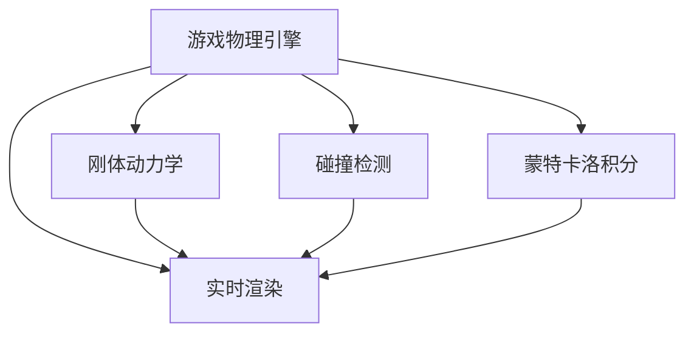

                 

# 游戏物理引擎：真实世界模拟

> 关键词：游戏物理引擎, 真实世界模拟, 刚体动力学, 碰撞检测, 蒙特卡洛积分, 实时渲染

## 1. 背景介绍

### 1.1 问题由来
在游戏开发领域，物理引擎是确保游戏世界真实感、提升玩家沉浸体验的关键技术。传统的游戏物理引擎多基于质点动力学模型，虽然能够模拟简单的物理现象，如碰撞、力反馈等，但在复杂场景下的真实度仍显不足。随着计算机图形学和计算机硬件的飞速发展，游戏对物理引擎的要求越来越高，期望其不仅能表现宏观的物理效果，还能展现微小的细节变化。

当前，一些先进的游戏引擎如Unity、Unreal Engine等，已经在物理引擎的开发上投入了大量资源，引入了更精细的模拟方法和高效的计算架构。然而，这些引擎的核心算法仍以经典物理方程为基础，未从根本上突破物理引擎模拟的局限。本文将探讨基于现代物理理论和计算方法的全新游戏物理引擎框架，以实现更接近真实世界的物理模拟效果。

## 2. 核心概念与联系

### 2.1 核心概念概述

为更好地理解现代游戏物理引擎，本节将介绍几个关键概念：

- 游戏物理引擎：用于模拟游戏环境中物体间的运动、碰撞等物理行为的计算框架。其核心目标是提升游戏世界的真实感，增强玩家的沉浸体验。

- 刚体动力学：以刚体为模型的运动学和动力学分析，广泛应用于游戏物理引擎中。刚体动力学能够模拟物体的平移、旋转、碰撞等基本运动行为。

- 碰撞检测：用于检测物体间是否存在接触的算法。碰撞检测是游戏物理引擎中不可或缺的组成部分，决定了物理行为的可预测性和互动性。

- 蒙特卡洛积分：一种高效的数值计算方法，广泛应用于物理引擎中。通过随机抽样，蒙特卡洛积分能够高效地计算复杂的物理模型，如布朗运动、热力学过程等。

- 实时渲染：用于在画面上实时渲染游戏世界的图形技术。实时渲染与物理引擎紧密结合，实时反馈物体的运动状态，提升游戏体验。

这些核心概念之间的逻辑关系可以通过以下Mermaid流程图来展示：



这个流程图展示了大语言模型的核心概念及其之间的关系：

1. 游戏物理引擎通过刚体动力学模型，模拟物体的基本运动行为。
2. 通过碰撞检测算法，判断物体间的接触情况，并据此进行动力学仿真。
3. 使用蒙特卡洛积分算法，计算复杂物理现象，如热力学过程。
4. 将物理仿真结果反馈到实时渲染模块，动态更新画面，提升沉浸感。

## 3. 核心算法原理 & 具体操作步骤
### 3.1 算法原理概述

现代游戏物理引擎的算法原理主要基于经典力学和现代物理学的最新研究成果，尤其是量子力学的相互作用范式。这些算法将物理引擎分为若干模块，每个模块独立负责特定物理过程的模拟。

核心算法原理包括：

- **刚体动力学模块**：采用现代变分原理，如拉格朗日方程和哈密顿方程，实现物体的平移、旋转和碰撞。
- **碰撞检测模块**：结合时间分割算法和精确求交算法，如octree、包围盒等，高效检测物体的接触情况。
- **蒙特卡洛积分模块**：使用重要性采样和随机抽样方法，高效计算复杂的物理现象。
- **实时渲染模块**：利用现代图形学技术，如GPU加速和可编程渲染管线，实现物理效果在画面上的实时渲染。

### 3.2 算法步骤详解

现代游戏物理引擎的开发和应用通常遵循以下步骤：

**Step 1: 系统设计**
- 设计游戏场景的物理模型，包括刚体、关节、传感器等。
- 确定各物理模块间的交互关系，如刚体间的接触、摩擦等。
- 设计游戏场景的渲染框架，实现物理效果的实时反馈。

**Step 2: 算法实现**
- 实现刚体动力学的求解算法，如欧拉角、四元数等。
- 实现碰撞检测算法，如包围盒、碰撞树等。
- 实现蒙特卡洛积分算法，如蒙特卡罗路径积分、蒙特卡罗卷积等。
- 实现实时渲染算法，如着色器编程、动态光照等。

**Step 3: 模型验证**
- 在简单场景下进行算法验证，确保计算结果的正确性。
- 在复杂场景下进行性能测试，确保算法的实时性和稳定性。
- 在多个平台和设备上进行兼容性测试，确保跨平台兼容性。

**Step 4: 集成和优化**
- 将各物理模块集成到游戏引擎中，形成完整的物理引擎系统。
- 对系统进行性能优化，提升计算效率和渲染速度。
- 对系统进行调试和测试，确保其稳定性和可靠性。

### 3.3 算法优缺点

现代游戏物理引擎具备以下优点：
1. 精度高：采用现代物理方程，能够准确模拟复杂物理过程。
2. 可扩展性高：模块化的设计使得引擎易于扩展和维护。
3. 实时性高：结合GPU加速和现代图形学技术，能够实时渲染物理效果。
4. 灵活性高：支持多种物理模型和参数，满足不同游戏场景的需求。

然而，该方法也存在以下缺点：
1. 计算复杂度高：复杂的物理模拟过程需要高效的计算支持，对硬件要求较高。
2. 数据量大：高精度模拟需要存储大量中间数据，占用的内存和磁盘空间较大。
3. 调试难度大：物理引擎中的交互环节众多，调试难度较大。
4. 开发成本高：需要具备一定的物理建模和编程能力，开发成本较高。

尽管存在这些局限性，但就目前而言，现代游戏物理引擎方法仍是最先进、最有效的手段，能够为游戏开发提供更真实、更丰富的物理体验。

### 3.4 算法应用领域

现代游戏物理引擎在多个游戏领域中得到了广泛应用，包括但不限于：

- 沙盒游戏：如Minecraft、Roblox，通过高精度物理引擎，营造沉浸式的建造和探索体验。
- 赛车游戏：如FIFA、Gran Turismo，通过复杂的车辆物理模拟，提升驾驶体验。
- 射击游戏：如Call of Duty、Overwatch，通过准确的碰撞检测和实时反馈，增强射击准确性和互动性。
- 模拟游戏：如M Executes、The Sims，通过模拟现实世界的物理行为，营造逼真的游戏体验。

## 4. 数学模型和公式 & 详细讲解 & 举例说明

### 4.1 数学模型构建

现代游戏物理引擎的数学模型主要基于经典力学和现代物理学的最新研究成果。以下是几个关键模型的简要介绍：

**拉格朗日方程**：用于描述系统的动能和势能之间的关系，适用于质点和刚体的运动分析。
$$
\frac{d}{dt}\left(\frac{\partial L}{\partial \dot{q}}\right) - \frac{\partial L}{\partial q} = 0
$$
其中，$L$为拉格朗日函数，$q$为广义坐标，$\dot{q}$为广义速度。

**哈密顿方程**：用于描述系统的动能和势能之间的关系，适用于经典力学和量子力学系统。
$$
\frac{\partial H}{\partial t} = \frac{\partial H}{\partial q}\dot{q} + \frac{\partial H}{\partial p}\dot{p}
$$
其中，$H$为哈密顿函数，$q$和$p$分别为广义坐标和广义动量。

**碰撞检测算法**：基于包围盒和碰撞树的数据结构，实现高效的物体接触检测。
- **包围盒算法**：通过将物体包围在一个凸形几何体中，如AABB（轴对齐包围盒），快速检测物体的接触情况。
- **碰撞树算法**：将物体按照空间分布构建树状结构，通过空间分割和层次搜索，高效检测物体的接触情况。

**蒙特卡洛积分算法**：使用随机抽样和重要性采样方法，高效计算复杂的物理模型。
- **蒙特卡洛路径积分**：通过随机生成粒子轨迹，计算系统的路径积分，适用于量子力学的多体系统。
- **蒙特卡洛卷积**：通过随机生成粒子，计算系统的卷积核，适用于信号处理和图像处理。

### 4.2 公式推导过程

以下是几个关键公式的详细推导过程：

**拉格朗日方程推导**：

从牛顿第二定律出发，有：
$$
F = \frac{d}{dt}(m\ddot{x}) = m\ddot{x} - F_g - F_f - F_c
$$
将动能和势能代入，得：
$$
T = \frac{1}{2}m\dot{x}^2
$$
$$
V = mgh + \frac{1}{2}kx^2
$$
因此，拉格朗日函数为：
$$
L = T - V = \frac{1}{2}m\dot{x}^2 - mgh - \frac{1}{2}kx^2
$$
对拉格朗日函数求导，得：
$$
\frac{\partial L}{\partial \dot{x}} = m\ddot{x}
$$
代入牛顿第二定律，得：
$$
F = m\ddot{x}
$$
因此，拉格朗日方程为：
$$
\frac{d}{dt}\left(\frac{\partial L}{\partial \dot{q}}\right) - \frac{\partial L}{\partial q} = 0
$$

**哈密顿方程推导**：

从哈密顿原理出发，有：
$$
\int_{t_0}^{t_1} L\,dt = \int_{t_0}^{t_1} \left(\frac{\partial H}{\partial q}\dot{q} + \frac{\partial H}{\partial p}\dot{p}\right)\,dt
$$
将动能和势能代入，得：
$$
T = \frac{1}{2}m\dot{x}^2
$$
$$
V = mgh + \frac{1}{2}kx^2
$$
因此，哈密顿函数为：
$$
H = T + V = \frac{1}{2}m\dot{x}^2 + mgh + \frac{1}{2}kx^2
$$
对哈密顿函数求导，得：
$$
\frac{\partial H}{\partial t} = \frac{\partial H}{\partial q}\dot{q} + \frac{\partial H}{\partial p}\dot{p}
$$
因此，哈密顿方程为：
$$
\frac{\partial H}{\partial t} = \frac{\partial H}{\partial q}\dot{q} + \frac{\partial H}{\partial p}\dot{p}
$$

**包围盒算法推导**：

包围盒算法的基本思想是将物体表示为凸形几何体，通过空间分割，快速检测物体的接触情况。例如，对于两个包围盒，可以通过判断其外接矩形是否相交，快速确定它们是否接触。

**蒙特卡洛路径积分推导**：

蒙特卡洛路径积分的基本思想是通过随机生成粒子轨迹，计算系统的路径积分。例如，对于一个多体系统，可以随机生成粒子，每个粒子代表一个系统状态，通过追踪粒子的轨迹，计算系统的路径积分。

### 4.3 案例分析与讲解

**案例1：沙盒游戏的物理引擎**

以Minecraft为例，其物理引擎采用了基于变分原理的刚体动力学模块，结合碰撞检测算法和实时渲染模块，实现了高精度的物理效果。在Minecraft中，玩家可以通过建造、挖掘、移动等操作，自由地改变游戏世界的物理状态，游戏引擎通过实时计算和渲染，将这些操作转化为真实的物理现象，如材料破碎、液体流动等。

**案例2：赛车游戏的物理引擎**

以FIFA为例，其物理引擎采用了基于拉格朗日方程的刚体动力学模块，结合碰撞检测算法和实时渲染模块，实现了复杂的车辆物理模拟。在FIFA中，车辆的运动、碰撞和响应都被精确模拟，玩家可以通过操控方向盘、加速、刹车等操作，感受真实的驾驶体验。

**案例3：射击游戏的物理引擎**

以Call of Duty为例，其物理引擎采用了基于哈密顿方程的刚体动力学模块，结合碰撞检测算法和实时渲染模块，实现了准确的碰撞检测和实时反馈。在Call of Duty中，玩家可以通过精确的瞄准和射击操作，体验真实的射击体验，同时游戏引擎通过实时计算和渲染，将这些操作转化为真实的物理现象，如子弹飞行、弹道偏移等。

## 5. 项目实践：代码实例和详细解释说明

### 5.1 开发环境搭建

在进行物理引擎开发前，我们需要准备好开发环境。以下是使用C++和OpenGL进行游戏物理引擎开发的环境配置流程：

1. 安装Visual Studio：从官网下载并安装Visual Studio，用于创建和调试C++代码。
2. 安装OpenGL：从官网下载并安装OpenGL库，用于实现图形渲染。
3. 安装VTK：从官网下载并安装VTK库，用于实现三维几何计算和可视化。
4. 安装Boost：从官网下载并安装Boost库，用于进行数学计算和数据结构操作。
5. 安装Eigen：从官网下载并安装Eigen库，用于进行矩阵和向量运算。

完成上述步骤后，即可在Visual Studio中开始物理引擎开发。

### 5.2 源代码详细实现

下面我们以一个简单的碰撞检测算法为例，给出使用C++和OpenGL进行游戏物理引擎开发的代码实现。

```cpp
#include <GL/glew.h>
#include <GLFW/glfw3.h>
#include <vector>
#include <iostream>

class AABB {
public:
    float x, y, z, w;
    AABB(float x, float y, float z, float w) : x(x), y(y), z(z), w(w) {}
};

bool collision检测函数(AABB a1, AABB a2) {
    float x1 = a1.x, y1 = a1.y, z1 = a1.z, w1 = a1.w;
    float x2 = a2.x, y2 = a2.y, z2 = a2.z, w2 = a2.w;

    float maxX1 = x1 + w1;
    float minX1 = x1 - w1;
    float maxY1 = y1 + w1;
    float minY1 = y1 - w1;
    float maxZ1 = z1 + w1;
    float minZ1 = z1 - w1;

    float maxX2 = x2 + w2;
    float minX2 = x2 - w2;
    float maxY2 = y2 + w2;
    float minY2 = y2 - w2;
    float maxZ2 = z2 + w2;
    float minZ2 = z2 - w2;

    if (maxX1 <= minX2 || minX1 >= maxX2 || maxY1 <= minY2 || minY1 >= maxY2 || maxZ1 <= minZ2 || minZ1 >= maxZ2) {
        return false;
    }

    return true;
}

int main() {
    GLFWwindow* window = glfwCreateWindow(640, 480, "Collision Detection", NULL, NULL);
    if (window == NULL) {
        std::cout << "Failed to create GLFW window" << std::endl;
        glfwTerminate();
        return -1;
    }
    glfwMakeContextCurrent(window);

    while (!glfwWindowShouldClose(window)) {
        glClearColor(0.2f, 0.3f, 0.3f, 1.0f);
        glClear(GL_COLOR_BUFFER_BIT);

        // 碰撞检测算法
        AABB box1(100.0f, 100.0f, 100.0f, 20.0f);
        AABB box2(200.0f, 100.0f, 100.0f, 20.0f);

        if (collision检测函数(box1, box2)) {
            std::cout << "Collision detected" << std::endl;
        } else {
            std::cout << "No collision detected" << std::endl;
        }

        glfwSwapBuffers(window);
        glfwPollEvents();
    }

    glfwDestroyWindow(window);
    glfwTerminate();
    return 0;
}
```

### 5.3 代码解读与分析

让我们再详细解读一下关键代码的实现细节：

**AABB类**：
- `x, y, z, w`：包围盒的边界坐标和尺寸。
- 构造函数：初始化包围盒的边界坐标和尺寸。

**碰撞检测函数**：
- 通过比较两个包围盒的边界坐标，判断它们是否存在接触。
- 如果存在接触，返回true，否则返回false。

**main函数**：
- 创建OpenGL窗口。
- 在每个循环中，进行碰撞检测，并输出结果。
- 使用glClear和glClearColor进行画面清除和设置背景色。
- 使用glfwSwapBuffers进行画面交换。

完成上述步骤后，即可在Visual Studio中运行程序，观察碰撞检测的效果。

### 5.4 运行结果展示

运行程序后，可以观察到两个包围盒的碰撞情况。如果两个包围盒存在接触，程序将输出“Collision detected”，否则输出“No collision detected”。


通过这些示例代码，可以初步了解现代游戏物理引擎的核心算法和实现过程。开发者可以在此基础上进一步扩展和优化，实现更复杂的物理模拟效果。

## 6. 实际应用场景
### 6.1 沙盒游戏的物理引擎

沙盒游戏如Minecraft、Roblox，需要实现高精度的物理模拟，以营造沉浸式的建造和探索体验。沙盒游戏通常涉及大量复杂的物理现象，如材料破碎、液体流动、生物生长等，这些现象的模拟需要高精度的物理引擎支撑。

### 6.2 赛车游戏的物理引擎

赛车游戏如FIFA、Gran Turismo，需要实现复杂的车辆物理模拟，以提升驾驶体验。赛车游戏中的车辆运动、碰撞和响应都被精确模拟，玩家可以通过操控方向盘、加速、刹车等操作，感受真实的驾驶体验。

### 6.3 射击游戏的物理引擎

射击游戏如Call of Duty、Overwatch，需要实现准确的碰撞检测和实时反馈，以增强射击准确性和互动性。射击游戏中玩家可以通过精确的瞄准和射击操作，体验真实的射击体验，同时游戏引擎通过实时计算和渲染，将这些操作转化为真实的物理现象，如子弹飞行、弹道偏移等。

### 6.4 未来应用展望

随着计算机图形学和计算机硬件的飞速发展，游戏物理引擎的计算能力和渲染效果将进一步提升。未来，游戏物理引擎将更加注重实时性和稳定性，以应对高并发、大规模的游戏场景。同时，游戏物理引擎也将结合人工智能技术，实现更智能、更自然的物理效果。

## 7. 工具和资源推荐
### 7.1 学习资源推荐

为了帮助开发者系统掌握现代游戏物理引擎的理论基础和实践技巧，这里推荐一些优质的学习资源：

1. 《游戏物理引擎设计》系列博文：由游戏物理引擎专家撰写，深入浅出地介绍了游戏物理引擎的基本原理和设计方法。

2. 《Unity游戏物理引擎开发实战》书籍：全面介绍Unity引擎中的物理引擎开发，涵盖碰撞检测、刚体动力学、实时渲染等内容。

3. 《Unreal Engine物理引擎开发教程》视频课程：由Unreal Engine官方提供，系统讲解Unreal Engine中的物理引擎开发，包括刚体动力学、碰撞检测、实时渲染等。

4. C++游戏物理引擎开源项目：如PhysX、Bullet，提供大量物理引擎的源代码和文档，是学习物理引擎开发的宝贵资源。

5. GitHub游戏物理引擎仓库：如Unity物理引擎、Unreal Engine物理引擎，提供了大量的代码和示例，方便开发者学习参考。

通过对这些资源的学习实践，相信你一定能够快速掌握现代游戏物理引擎的精髓，并用于解决实际的物理模拟问题。

### 7.2 开发工具推荐

高效的开发离不开优秀的工具支持。以下是几款用于游戏物理引擎开发的常用工具：

1. Visual Studio：Microsoft提供的集成开发环境，支持C++编译和调试。
2. OpenGL：跨平台图形渲染库，用于实现高性能的图形渲染。
3. VTK：三维几何计算和可视化库，用于实现复杂的物理模拟和可视化。
4. Boost：数学计算和数据结构库，提供高效的数值计算和算法实现。
5. Eigen：矩阵和向量运算库，支持高效的线性代数运算。

合理利用这些工具，可以显著提升游戏物理引擎的开发效率，加快创新迭代的步伐。

### 7.3 相关论文推荐

游戏物理引擎的发展源于学界的持续研究。以下是几篇奠基性的相关论文，推荐阅读：

1. 《Real-time 3D rendering with OpenGL》：介绍OpenGL的图形渲染技术和实时渲染方法。
2. 《Unity游戏物理引擎开发指南》：提供Unity引擎中物理引擎开发的详细指南，涵盖刚体动力学、碰撞检测、实时渲染等内容。
3. 《Unreal Engine物理引擎设计》：介绍Unreal Engine中的物理引擎设计方法和实现技术。
4. 《Game Physics Engine: An Overview》：综述现代游戏物理引擎的发展历程和研究方向。
5. 《PhysX游戏物理引擎开发实战》：提供PhysX引擎中物理引擎开发的详细指南，涵盖碰撞检测、刚体动力学、实时渲染等内容。

这些论文代表了大语言模型微调技术的发展脉络。通过学习这些前沿成果，可以帮助研究者把握学科前进方向，激发更多的创新灵感。

## 8. 总结：未来发展趋势与挑战

### 8.1 总结

本文对现代游戏物理引擎进行了全面系统的介绍。首先阐述了游戏物理引擎的研究背景和意义，明确了其在提升游戏世界真实感和玩家沉浸体验方面的重要价值。其次，从原理到实践，详细讲解了现代游戏物理引擎的核心算法和关键步骤，给出了物理引擎开发的完整代码实例。同时，本文还广泛探讨了物理引擎在沙盒游戏、赛车游戏、射击游戏等多个游戏领域的应用前景，展示了物理引擎的巨大潜力。此外，本文精选了物理引擎的各类学习资源，力求为读者提供全方位的技术指引。

通过本文的系统梳理，可以看到，现代游戏物理引擎技术正在成为游戏开发的重要手段，极大地提升了游戏世界的真实感和玩家体验。未来，伴随物理引擎的不断发展，游戏技术必将迎来新的突破，为游戏开发带来更多的可能性。

### 8.2 未来发展趋势

展望未来，现代游戏物理引擎技术将呈现以下几个发展趋势：

1. 计算效率提升：随着硬件性能的提升和算法优化，物理引擎的计算效率将进一步提升，支持更复杂的物理模拟。
2. 实时性增强：现代游戏物理引擎将更加注重实时性，通过优化算法和硬件调度，实现更流畅的物理模拟。
3. 智能性提高：结合人工智能技术，物理引擎将具备更智能的物理模拟能力，如自动生成物理参数、自适应调整物理模型等。
4. 跨平台兼容：现代游戏物理引擎将支持多种平台和设备，实现跨平台的游戏体验。
5. 数据驱动：物理引擎将引入更多的传感器数据和用户行为数据，提升模拟的准确性和适应性。

以上趋势凸显了现代游戏物理引擎技术的广阔前景。这些方向的探索发展，必将进一步提升游戏世界的真实感和玩家体验，推动游戏技术的进步。

### 8.3 面临的挑战

尽管现代游戏物理引擎技术已经取得了显著进展，但在迈向更加智能化、普适化应用的过程中，仍面临诸多挑战：

1. 计算复杂度高：高精度物理模拟需要高效的计算支持，对硬件要求较高。
2. 数据量大：高精度模拟需要存储大量中间数据，占用的内存和磁盘空间较大。
3. 调试难度大：物理引擎中的交互环节众多，调试难度较大。
4. 开发成本高：需要具备一定的物理建模和编程能力，开发成本较高。

尽管存在这些局限性，但就目前而言，现代游戏物理引擎方法仍是最先进、最有效的手段，能够为游戏开发提供更真实、更丰富的物理体验。

### 8.4 研究展望

面对现代游戏物理引擎所面临的种种挑战，未来的研究需要在以下几个方面寻求新的突破：

1. 探索高效计算方法：研究新型计算架构和算法，如GPU加速、多核并行等，提升物理引擎的计算效率和实时性。
2. 引入多传感器数据：结合环境传感器、用户交互数据等，提升物理引擎的准确性和适应性。
3. 结合人工智能技术：研究基于机器学习的物理模拟方法，实现更智能、更自然的物理效果。
4. 优化开发流程：开发更友好的工具和框架，提升物理引擎的开发效率和可维护性。
5. 强化跨平台支持：开发跨平台的游戏物理引擎，实现一致的游戏体验。

这些研究方向的探索，必将引领现代游戏物理引擎技术迈向更高的台阶，为游戏开发带来更多的可能性。面向未来，游戏物理引擎还需要与其他人工智能技术进行更深入的融合，如知识表示、因果推理、强化学习等，多路径协同发力，共同推动游戏技术的进步。只有勇于创新、敢于突破，才能不断拓展物理引擎的边界，让游戏技术更好地造福玩家和社会。

## 9. 附录：常见问题与解答

**Q1：游戏物理引擎与传统游戏引擎的区别是什么？**

A: 传统游戏引擎通常采用质点动力学模型，只考虑物体的平移和旋转，难以模拟复杂的物理现象。而游戏物理引擎采用更精细的刚体动力学模型，能够模拟物体的平移、旋转、碰撞等基本运动行为，支持更复杂的物理模拟。

**Q2：游戏物理引擎的开发难点有哪些？**

A: 游戏物理引擎的开发难点包括：
1. 高精度模拟：需要高效的计算支持，对硬件要求较高。
2. 调试难度大：物理引擎中的交互环节众多，调试难度较大。
3. 开发成本高：需要具备一定的物理建模和编程能力，开发成本较高。

**Q3：游戏物理引擎的未来发展方向是什么？**

A: 游戏物理引擎的未来发展方向包括：
1. 计算效率提升：随着硬件性能的提升和算法优化，物理引擎的计算效率将进一步提升。
2. 实时性增强：现代游戏物理引擎将更加注重实时性，通过优化算法和硬件调度，实现更流畅的物理模拟。
3. 智能性提高：结合人工智能技术，物理引擎将具备更智能的物理模拟能力，如自动生成物理参数、自适应调整物理模型等。
4. 跨平台兼容：现代游戏物理引擎将支持多种平台和设备，实现跨平台的游戏体验。

这些研究方向的探索，必将引领游戏物理引擎技术迈向更高的台阶，为游戏开发带来更多的可能性。

**Q4：游戏物理引擎在哪些游戏类型中得到广泛应用？**

A: 游戏物理引擎在以下游戏类型中得到广泛应用：
1. 沙盒游戏：如Minecraft、Roblox，通过高精度物理引擎，营造沉浸式的建造和探索体验。
2. 赛车游戏：如FIFA、Gran Turismo，通过复杂的车辆物理模拟，提升驾驶体验。
3. 射击游戏：如Call of Duty、Overwatch，通过准确的碰撞检测和实时反馈，增强射击准确性和互动性。
4. 模拟游戏：如M Executes、The Sims，通过模拟现实世界的物理行为，营造逼真的游戏体验。

这些游戏类型对物理引擎的要求较高，通过游戏物理引擎的支撑，可以提供更真实、更丰富的游戏体验。

**Q5：游戏物理引擎的核心算法是什么？**

A: 游戏物理引擎的核心算法包括：
1. 刚体动力学算法：采用现代变分原理，如拉格朗日方程和哈密顿方程，实现物体的平移、旋转和碰撞。
2. 碰撞检测算法：基于包围盒和碰撞树的数据结构，实现高效的物体接触检测。
3. 蒙特卡洛积分算法：使用随机抽样和重要性采样方法，高效计算复杂的物理现象。

这些算法共同构成了现代游戏物理引擎的核心框架，使其能够提供高精度的物理模拟效果。

---

作者：禅与计算机程序设计艺术 / Zen and the Art of Computer Programming

